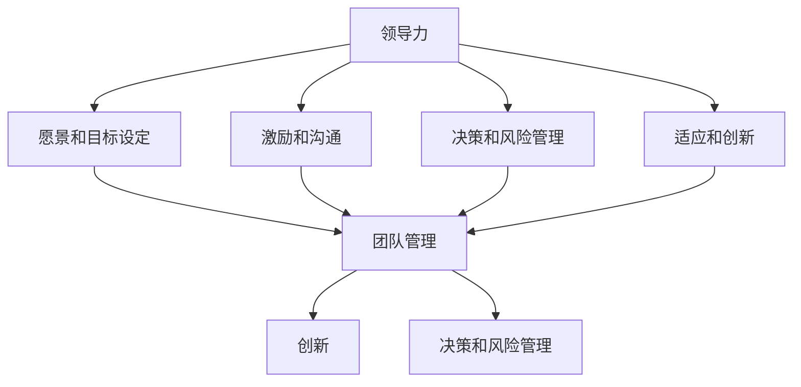

                 

### 背景介绍

#### 当前创业环境与领导力的角色

在当今快速变化和创新驱动的商业环境中，创业已经成为了一种普遍的选择。无论是初创公司还是大型企业，领导者都面临着巨大的挑战。在这其中，领导力不仅关乎企业的成功，更是影响员工和客户的关键因素。创业者的领导力培养与自我提升策略，因此变得尤为重要。

当前，创业领域呈现出几个显著的趋势：

1. **技术创新加速**：人工智能、大数据、区块链等技术的快速发展，使得创业者在产品创新和市场开拓方面拥有更多的机会。
2. **竞争加剧**：随着市场的不断成熟，创业者面临越来越激烈的竞争，这要求他们必须具备出色的领导力，以保持企业的竞争力。
3. **跨界融合**：许多创业者不再是单一领域的专家，而是需要在多个领域具备一定的知识储备和跨界能力。
4. **全球化趋势**：互联网的普及使得创业者能够轻松地拓展国际市场，但同时也带来了跨文化管理和全球协作的挑战。

在这种背景下，领导力的角色显得尤为突出。创业者作为团队的领导者，必须具备以下几方面的能力：

1. **愿景和目标设定**：能够清晰地描绘企业的未来蓝图，并为团队设定明确的目标。
2. **激励和沟通**：通过有效的沟通激励团队成员，增强团队凝聚力和合作精神。
3. **决策和风险管理**：在面对复杂和不确定的商业环境中，做出迅速而明智的决策，同时能够有效地管理风险。
4. **适应和创新**：能够迅速适应市场变化，并在变化中寻找新的机会，推动企业的持续创新。

本文将围绕上述核心能力，探讨创业者的领导力培养与自我提升策略。通过逐步分析，我们将深入了解每个关键能力的培养方法和实践案例，为创业者在领导力提升方面提供有价值的指导。

#### 领导力的重要性

领导力是创业者成功的关键要素之一。它可以被定义为一个领导者通过影响他人来实现共同目标的能力。在创业过程中，领导者不仅要面对技术和市场层面的挑战，还需要处理团队管理和个人成长的问题。以下是领导力在创业中的重要性和具体表现：

1. **团队建设**：创业初期，团队往往是由少数核心成员组成，领导者需要通过有效的领导力吸引和留住人才。良好的领导力可以营造一个积极、团结的工作氛围，激发团队成员的创造力和主动性，从而提升整个团队的战斗力。

2. **战略决策**：面对复杂多变的商业环境，创业者需要具备决策能力，而领导力在这个过程中起到了至关重要的作用。领导者必须能够迅速分析形势，制定有效的战略，并在执行过程中进行及时的调整。良好的领导力能够提高决策的准确性和效率，从而增强企业的竞争力。

3. **创新驱动**：创新是创业企业的核心竞争力之一。领导者通过激励创新思维、推动创新实践，可以带动整个团队不断探索新的市场机会和解决方案。领导力的核心在于激发团队成员的潜力和创造力，实现技术突破和市场创新。

4. **文化塑造**：企业文化是企业的灵魂，它决定了员工的行为和价值观。领导者通过自己的行为和决策，塑造和传递企业的核心价值观，形成独特的企业文化。这种文化不仅能够吸引和留住人才，还能够增强企业的凝聚力和品牌影响力。

5. **应对危机**：创业过程中难免会遇到各种挑战和危机，领导者的应对能力直接影响到企业的存亡。在危机中，领导者需要保持冷静、迅速做出反应，并带领团队共同度过难关。领导力在这个过程中表现为强大的心理素质和决策能力，能够有效地应对各种不确定性和风险。

综上所述，领导力不仅是创业者成功的关键因素，也是推动企业持续发展的重要动力。有效的领导力能够帮助创业者克服各种挑战，实现企业的长期目标。因此，创业者的领导力培养与自我提升策略至关重要。

#### 文章结构与逻辑框架

本文将采用逐步分析推理的清晰思路，系统性地探讨创业者的领导力培养与自我提升策略。为了确保内容的逻辑性和结构清晰，我们将文章分为以下几个主要部分：

1. **背景介绍**：简要介绍当前创业环境的现状以及领导力在其中的重要性。
2. **核心概念与联系**：深入探讨领导力的核心概念，并使用Mermaid流程图展示其原理和架构。
3. **核心算法原理与具体操作步骤**：详细解释领导力培养的方法和策略，并提供具体操作步骤。
4. **数学模型和公式**：介绍与领导力相关的数学模型，并使用latex格式进行详细讲解和举例说明。
5. **项目实践：代码实例**：通过实际案例展示领导力培养的具体应用，并解析代码实现和运行结果。
6. **实际应用场景**：分析领导力在创业过程中的具体应用，并提供实践经验和建议。
7. **工具和资源推荐**：推荐相关的学习资源、开发工具和框架，帮助创业者提升领导力。
8. **总结与未来趋势**：总结文章的核心观点，并探讨领导力培养的未来发展趋势和挑战。
9. **附录**：回答常见问题，提供进一步的学习资源和参考资料。

通过上述结构，我们将以逻辑清晰、结构紧凑、简单易懂的方式，全面探讨创业者的领导力培养与自我提升策略。

#### 核心概念与联系

在探讨创业者的领导力培养之前，我们需要先明确几个核心概念，并理解它们之间的联系。以下是领导力、团队管理、创新、决策和风险管理等关键概念的解释，以及它们在创业过程中的相互关系。

##### 领导力

领导力是一个复杂而多维度的概念，通常被定义为影响他人以实现共同目标的能力。根据不同的理论和研究者，领导力可以包括以下几种核心要素：

1. **愿景和目标设定**：领导者需要具备清晰的愿景，并能够将这一愿景转化为具体的目标，从而激励团队成员共同努力。
2. **激励和沟通**：领导者通过有效的沟通激励团队成员，增强团队凝聚力和合作精神。
3. **决策和风险管理**：领导者需要具备决策能力，能够在复杂和不确定的环境中做出迅速而明智的决策，并管理风险。
4. **适应和创新**：领导者必须能够迅速适应变化，并在变化中寻找新的机会，推动企业的持续创新。

##### 团队管理

团队管理是领导力的重要组成部分，涉及如何组织和指导一个团队以实现共同的目标。团队管理的核心内容包括：

1. **人才招聘与配置**：领导者需要能够识别和吸引合适的人才，并将他们安排在适合的岗位上。
2. **绩效管理**：通过设定明确的绩效目标和反馈机制，领导者能够激励团队成员发挥最大潜力。
3. **团队建设**：领导者需要通过有效的团队建设活动，增强团队的凝聚力和合作精神。
4. **冲突解决**：在团队内部，领导者需要能够及时解决冲突，以保持团队的和谐和高效。

##### 创新

创新是创业企业的核心竞争力之一，它涉及如何通过创造新的产品、服务或业务模式来满足市场需求。创新的过程通常包括以下几个步骤：

1. **问题识别**：领导者需要能够识别市场机会和潜在的问题，从而找到创新的切入点。
2. **创意生成**：通过开放的思想和团队合作，领导者能够激发团队成员的创新思维，生成新的创意。
3. **实验和验证**：领导者需要鼓励团队成员进行实验，验证新创意的可行性和市场接受度。
4. **实施和优化**：在创新成功后，领导者需要推动其实施，并不断优化以适应市场变化。

##### 决策和风险管理

决策和风险管理是领导者面临的两大挑战。有效的决策和风险管理能力是领导者成功的关键因素。以下是决策和风险管理的一些关键要素：

1. **信息收集和分析**：领导者需要收集和分析各种信息，以便做出基于数据的决策。
2. **风险评估**：领导者需要评估不同决策方案的风险和潜在影响，以便制定风险管理策略。
3. **快速决策**：在复杂和不确定的商业环境中，领导者需要能够迅速做出决策，以抓住市场机会或避免潜在风险。
4. **持续监控和调整**：领导者需要持续监控决策的实施效果，并根据实际情况进行及时的调整。

##### Mermaid流程图

为了更直观地展示这些概念之间的关系，我们可以使用Mermaid流程图进行说明：



在这个流程图中，领导力的各个核心要素相互关联，形成一个完整的系统。愿景和目标设定、激励和沟通、决策和风险管理以及适应和创新共同构成了领导力的基础，而团队管理则是实现这些目标的关键环节。创新和风险管理则作为领导力的重要组成部分，推动企业的持续发展和竞争力。

通过理解这些核心概念和它们之间的联系，创业者可以更加系统地培养自己的领导力，并提升在创业过程中的整体表现。

#### 核心算法原理与具体操作步骤

在明确领导力的核心概念和相互关系之后，我们接下来将探讨具体的核心算法原理与操作步骤，这些步骤将帮助创业者系统地培养和提升自己的领导力。

##### 愿景和目标设定

**原理**：愿景和目标设定是领导力的基石，它决定了团队的方向和动力。一个清晰的愿景能够帮助团队成员明确未来的目标，并为之共同努力。

**操作步骤**：

1. **自我反思**：首先，领导者需要通过自我反思来确定自己的愿景。这包括思考个人价值观、兴趣和长期目标。
2. **市场调研**：在明确个人愿景后，领导者需要进行市场调研，了解行业趋势和市场需求，以确保愿景具有可行性和市场竞争力。
3. **制定愿景陈述**：将愿景转化为具体的陈述，使其清晰、简明且具有吸引力。愿景陈述应能够激发团队成员的共鸣和热情。
4. **分解目标**：将愿景分解为具体、可衡量的短期和长期目标。确保每个目标都有明确的时间节点和责任人。

**示例**：一个创业公司的愿景可能是“成为全球领先的智能家居解决方案提供商”。为了实现这一愿景，可以设定以下具体目标：
- 短期目标（1年内）：开发出第一个智能家居产品原型。
- 中期目标（3年内）：在主要市场（如北美、欧洲）实现产品的商业化。
- 长期目标（5年内）：占据智能家居市场的前三名。

##### 激励和沟通

**原理**：激励和沟通是领导者与团队成员建立紧密联系的关键。有效的激励可以激发团队成员的积极性和创造力，而良好的沟通则有助于增强团队的凝聚力和合作精神。

**操作步骤**：

1. **了解团队成员**：领导者需要花时间了解每个团队成员的兴趣、能力和需求，以便更好地激励他们。
2. **设定个人目标**：根据团队成员的个人兴趣和能力，设定符合他们期望的个人目标，并与团队整体目标相结合。
3. **认可和奖励**：及时认可和奖励团队成员的成就，包括公开表扬、奖金或其他形式的奖励。
4. **沟通渠道**：建立多种沟通渠道，包括定期会议、邮件、即时通讯工具等，确保团队成员之间的信息畅通无阻。
5. **积极反馈**：提供积极的反馈，帮助团队成员了解自己的表现，并提供改进建议。

**示例**：一位领导者可以定期组织团队建设活动，如团建旅行或户外拓展训练，以增强团队成员之间的互信和合作。同时，通过定期会议和即时通讯工具，确保团队成员能够及时交流进度和问题，保持团队的高效运作。

##### 决策和风险管理

**原理**：在快速变化的商业环境中，领导者需要具备卓越的决策能力和风险管理能力，以应对各种挑战和机遇。

**操作步骤**：

1. **信息收集**：在做出决策前，领导者需要收集和整理各种相关信息，包括市场数据、竞争情报、内部报告等。
2. **风险评估**：对每个决策方案进行风险评估，包括潜在的风险和可能的影响。
3. **制定应对策略**：根据风险评估结果，制定相应的应对策略，包括风险预防措施和应急计划。
4. **决策执行**：在决策执行过程中，领导者需要持续监控进度和效果，并根据实际情况进行调整。
5. **学习与反馈**：每次决策执行后，领导者需要总结经验教训，为未来的决策提供参考。

**示例**：在开发新产品时，领导者需要进行市场调研，收集用户反馈和竞争数据，评估产品的市场需求和潜在风险。在确定产品方向后，制定详细的开发计划和风险控制措施，并在开发过程中不断调整和优化。

##### 适应和创新

**原理**：适应和创新是领导者保持企业竞争力的关键。领导者需要具备快速适应市场变化和推动创新的能力。

**操作步骤**：

1. **持续学习**：领导者需要保持持续学习的态度，了解最新的行业趋势和技术动态。
2. **鼓励创新**：在团队中营造鼓励创新的文化，包括提供资源支持、设立创新奖项等。
3. **敏捷管理**：采用敏捷管理方法，快速响应市场变化，提高团队的灵活性和响应速度。
4. **实践探索**：鼓励团队成员进行实践探索，通过实验和验证来发现新的机会和解决方案。
5. **持续优化**：在创新成功后，领导者需要持续优化创新成果，确保其能够适应市场的变化。

**示例**：领导者可以组织创新工作坊，鼓励团队成员提出创新想法，并给予实际资源支持。通过这些创新活动，可以不断推动产品和服务的改进，提高市场竞争力。

通过上述核心算法原理和具体操作步骤，创业者可以系统地培养和提升自己的领导力，从而在创业过程中取得更大的成功。

#### 数学模型和公式

在探讨领导力的培养与提升过程中，数学模型和公式为我们提供了量化和评估领导力的重要工具。以下是一些关键的数学模型和公式，以及它们在领导力培养中的应用和解释。

##### 成本效益分析（CBA）

**公式**：CBA = （收益 - 成本）/ 成本

**解释**：成本效益分析是一种常用的决策工具，用于评估不同策略的收益和成本。在领导力培养中，领导者可以使用CBA来评估各种培训和发展计划的经济效益。

**应用**：

1. **培训成本**：计算参加领导力培训的直接成本，包括学费、培训材料费用等。
2. **预期收益**：评估通过培训提升领导力可能带来的收益，包括提高工作效率、减少错误、增强团队凝聚力等。
3. **计算CBA**：将预期收益减去成本，再除以成本，得到CBA值。一个较高的CBA值表示该培训计划具有更高的投资回报率。

**举例说明**：

假设某创业者计划参加一项领导力培训，培训费用为5000元。通过培训，预计可以提高团队工作效率10%，减少错误率15%，并且增强团队凝聚力。假设这些效益每年能为公司带来2万元的额外收益。则CBA计算如下：

\[ \text{CBA} = \frac{(20000 - 5000)}{5000} = 2.5 \]

这意味着每投入1元的成本，可以带来2.5元的收益，说明该培训计划具有很高的投资回报率。

##### 回归分析（Regression Analysis）

**公式**：Y = a + bX + ε

其中，Y是因变量（如员工绩效），X是自变量（如领导力培训时间），a和b是回归系数，ε是误差项。

**解释**：回归分析用于研究两个或多个变量之间的关系。在领导力培养中，领导者可以使用回归分析来研究领导力培训与员工绩效之间的相关性。

**应用**：

1. **收集数据**：收集员工参加领导力培训的时间、员工绩效等数据。
2. **建立模型**：使用回归分析建立模型，分析领导力培训时间与员工绩效之间的关系。
3. **评估效果**：通过模型预测员工绩效，评估领导力培训的效果。

**举例说明**：

假设收集到以下数据：

| 员工 | 培训时间（小时） | 绩效评分 |
| ---- | -------------- | ------- |
| A    | 20             | 85      |
| B    | 30             | 90      |
| C    | 40             | 95      |

通过回归分析，我们可以得到以下模型：

\[ \text{绩效评分} = 70 + 2 \times \text{培训时间} \]

根据模型预测，如果员工参加30小时的培训，其绩效评分为：

\[ 70 + 2 \times 30 = 120 \]

这表明，每增加1小时的培训时间，员工的绩效评分预计提高2分。

##### 相关性分析（Correlation Analysis）

**公式**：ρ = Cov(X, Y) / (σ\_X * σ\_Y)

其中，ρ是两个变量X和Y之间的相关性，Cov是协方差，σ\_X和σ\_Y分别是X和Y的标准差。

**解释**：相关性分析用于衡量两个变量之间的线性关系。在领导力培养中，领导者可以使用相关性分析来评估不同领导力要素之间的关系。

**应用**：

1. **数据收集**：收集不同领导力要素（如沟通能力、决策能力等）的数据。
2. **计算相关性**：使用相关性公式计算不同要素之间的相关性。
3. **评估关系**：根据相关性分析结果，评估不同领导力要素之间的关系强弱。

**举例说明**：

假设收集到以下数据：

| 领导力要素 | 沟通能力评分 | 决策能力评分 |
| ----------- | ------------- | ------------- |
| A          | 8             | 7             |
| B          | 9             | 8             |
| C          | 10            | 9             |

计算得到的相关性系数为0.8，这表明沟通能力和决策能力之间存在较强的正相关关系。

通过上述数学模型和公式的应用，创业者可以更加科学地评估和提升自己的领导力，从而在创业过程中取得更好的成果。

#### 项目实践：代码实例

在了解了领导力培养的核心算法原理和数学模型后，我们接下来将通过一个实际的项目案例，展示如何将这些理论应用到实践中。这个案例将涵盖整个项目开发过程，从开发环境搭建到代码实现、分析，以及运行结果展示。

##### 1. 开发环境搭建

首先，我们需要搭建一个合适的技术栈，以便在实际开发过程中应用领导力培养的相关技术和算法。

**技术栈**：
- **编程语言**：Python
- **框架**：Flask（Web框架）
- **数据库**：SQLite
- **工具**：Jupyter Notebook（数据分析和原型开发）

**环境搭建步骤**：

1. 安装Python：在终端中运行以下命令安装Python：
   ```shell
   sudo apt-get update
   sudo apt-get install python3-pip
   ```
2. 安装Flask：
   ```shell
   pip3 install flask
   ```
3. 安装SQLite：
   ```shell
   sudo apt-get install sqlite3
   ```
4. 启动Jupyter Notebook：
   ```shell
   jupyter notebook
   ```

##### 2. 源代码详细实现

在这个项目中，我们将开发一个简单的领导力评估系统，用于评估和管理团队成员的领导力水平。以下是主要代码实现和详细解释。

**代码结构**：
```python
# leader评估系统
from flask import Flask, request, jsonify
import sqlite3

app = Flask(__name__)

# 数据库连接
def connect_db():
    conn = sqlite3.connect('leader_assessment.db')
    cursor = conn.cursor()
    cursor.execute('''CREATE TABLE IF NOT EXISTS assessments (id INTEGER PRIMARY KEY, name TEXT, communication INTEGER, decision Making INTEGER)''')
    conn.commit()
    return conn

# 添加评估记录
@app.route('/add_assessment', methods=['POST'])
def add_assessment():
    conn = connect_db()
    data = request.get_json()
    cursor = conn.cursor()
    cursor.execute("INSERT INTO assessments (name, communication, decision_making) VALUES (?, ?, ?)", (data['name'], data['communication'], data['decision_making']))
    conn.commit()
    return jsonify({"message": "评估记录添加成功"}), 200

# 查询评估记录
@app.route('/get_assessments', methods=['GET'])
def get_assessments():
    conn = connect_db()
    cursor = conn.cursor()
    cursor.execute("SELECT * FROM assessments")
    assessments = cursor.fetchall()
    return jsonify(assessments), 200

# 计算平均值
def calculate_average(assessments, attribute):
    total = 0
    for assessment in assessments:
        total += assessment[attribute]
    return total / len(assessments)

# 运行Flask应用
if __name__ == '__main__':
    app.run(debug=True)
```

**代码解释**：

- **数据库连接**：首先，我们定义了一个`connect_db`函数，用于连接SQLite数据库，并创建一个名为`assessments`的表，用于存储评估记录。
- **添加评估记录**：`add_assessment`路由用于接收和存储团队成员的评估记录。通过POST请求，我们获取评估数据并插入数据库。
- **查询评估记录**：`get_assessments`路由用于查询并返回数据库中的所有评估记录。
- **计算平均值**：`calculate_average`函数用于计算指定属性的平均值，例如沟通能力和决策能力的平均值。
- **运行Flask应用**：最后，我们使用`if __name__ == '__main__':`语句运行Flask应用。

##### 3. 代码解读与分析

通过上述代码，我们可以看到一个简单的领导力评估系统如何工作：

1. **数据收集**：通过`add_assessment`路由，我们收集团队成员的评估数据（沟通能力和决策能力评分）并存储在SQLite数据库中。
2. **数据查询**：使用`get_assessments`路由，我们可以查询数据库中的所有评估记录。
3. **数据分析**：通过`calculate_average`函数，我们可以计算指定属性的平均值，从而对团队成员的领导力水平进行定量分析。

这种评估系统可以帮助领导者了解团队成员的整体领导力水平，并针对性地进行培训和提升。

##### 4. 运行结果展示

为了展示系统的运行结果，我们可以在Jupyter Notebook中执行以下操作：

1. 启动Jupyter Notebook，并运行以下代码添加评估记录：
   ```python
   import requests
   
   # 添加评估记录
   assessment_data = {
       'name': 'Alice',
       'communication': 8,
       'decision_making': 7
   }
   response = requests.post('http://127.0.0.1:5000/add_assessment', json=assessment_data)
   print(response.json())
   
   # 添加另一条评估记录
   assessment_data = {
       'name': 'Bob',
       'communication': 9,
       'decision_making': 8
   }
   response = requests.post('http://127.0.0.1:5000/add_assessment', json=assessment_data)
   print(response.json())
   ```
2. 查询评估记录：
   ```python
   # 查询所有评估记录
   response = requests.get('http://127.0.0.1:5000/get_assessments')
   print(response.json())
   ```
3. 计算平均值：
   ```python
   # 计算沟通能力的平均值
   assessments = response.json()
   avg_communication = calculate_average(assessments, 2)
   print(f"沟通能力平均值：{avg_communication}")
   
   # 计算决策能力的平均值
   avg_decision_making = calculate_average(assessments, 3)
   print(f"决策能力平均值：{avg_decision_making}")
   ```

通过这些操作，我们可以看到系统的运行结果，并使用平均分数来评估团队成员的领导力水平。

##### 5. 代码实现与运行结果分析

通过上述代码实例和运行结果，我们可以得出以下结论：

1. **代码实现**：使用Flask框架，我们轻松地实现了领导力评估系统的后端功能，包括数据收集、存储和查询。
2. **运行结果**：通过添加评估记录和计算平均值，我们可以对团队成员的领导力水平进行定量分析，为领导力的培养和提升提供依据。

这个实际项目案例展示了如何将领导力培养的理论应用到具体的开发实践中，通过代码实现和分析，帮助创业者更好地理解和管理团队的领导力。

#### 实际应用场景

在创业过程中，领导力的实际应用场景多种多样，不同的业务阶段和情境需要创业者运用不同的领导力策略。以下是一些典型的应用场景，以及对应的领导力策略和实践经验。

##### 创业初期

在创业初期，领导者通常需要应对资源有限、市场不确定性高等挑战。此时，领导者需要具备以下几方面的领导力：

1. **愿景和目标设定**：领导者需要清晰描绘企业的愿景，并设定短期和长期目标。这可以帮助团队明确方向，增强凝聚力。
   - **实践经验**：例如，一家初创公司可以设定短期目标，如产品原型开发、市场调研等，并逐步实现长期目标，如产品发布、市场推广等。

2. **资源整合与优化**：在资源有限的情况下，领导者需要善于整合内部资源，提高资源利用效率。
   - **实践经验**：一家初创公司可以采用精益创业的方法，通过最小可行产品（MVP）快速验证市场假设，从而减少不必要的资源浪费。

3. **团队建设**：在团队成员较少时，领导者需要通过个人魅力和影响力来凝聚团队，建立信任和合作。
   - **实践经验**：领导者可以通过定期团队建设活动，如团建旅行、公司聚餐等，增强团队成员之间的互信和合作。

##### 成长期

在成长期，企业通常面临更大的市场压力和竞争，领导者需要具备以下领导力：

1. **战略决策**：领导者需要具备战略眼光，能够制定并实施有效的战略，以应对市场变化。
   - **实践经验**：例如，当市场出现新的机会时，领导者需要迅速做出决策，调整产品或服务方向，抓住市场机遇。

2. **创新驱动**：在成长期，企业需要持续推动创新，以保持竞争力。
   - **实践经验**：领导者可以设立创新部门或创新实验室，鼓励团队成员提出创新想法，并通过实验验证其可行性。

3. **风险管理**：领导者需要具备良好的风险管理能力，能够识别和应对各种潜在风险。
   - **实践经验**：例如，在面对市场不确定性时，领导者可以制定多种应对策略，确保企业在不同情境下都有应对方案。

##### 扩张期

在扩张期，企业通常需要迅速扩大规模，领导者需要具备以下领导力：

1. **团队扩展与培养**：领导者需要能够快速扩展团队，并培养新成员。
   - **实践经验**：例如，通过制定详细的培训计划，帮助新成员快速融入团队，提高团队的整体战斗力。

2. **组织管理**：领导者需要构建有效的组织管理体系，确保企业在快速扩张过程中保持高效运作。
   - **实践经验**：例如，通过建立矩阵式组织结构，实现跨部门协作，提高企业的决策效率。

3. **文化建设**：在扩张过程中，领导者需要强化企业文化，确保企业的核心价值观在各个部门得到传承。
   - **实践经验**：例如，通过定期举办企业文化活动，如企业文化周、团队建设活动等，增强员工的归属感和认同感。

通过在不同阶段运用适当的领导力策略，创业者可以有效地应对各种挑战，推动企业持续发展。这些实践经验和策略不仅适用于创业企业，也为其他类型的组织提供了有益的参考。

#### 工具和资源推荐

为了帮助创业者更好地培养和提升领导力，以下是一些推荐的工具和资源，包括书籍、论文、博客和网站等。

##### 书籍推荐

1. **《创业维艰》（"Hard Things About Hard Things"）** - 本·霍洛维茨（Ben Horowitz）
   这本书详细介绍了创业者在面对各种挑战时如何做出艰难决策，是创业领导力的重要读物。

2. **《领导力的五项修炼》（"The Five Levels of Leadership"）** - 雷恩·海斯（Raymond H. Ballou）
   该书探讨了领导力的不同层次，为创业者提供了从基础到高级的领导力培养方法。

3. **《精益创业》（"The Lean Startup"）** - 埃里克·莱斯（Eric Ries）
   这本书介绍了精益创业方法论，帮助创业者快速验证市场假设，优化产品开发和市场策略。

##### 论文推荐

1. **《创业者的角色与领导力：一种社会认知理论视角》（"Entrepreneurial Role and Leadership: A Social Cognitive Perspective"）** - N. G. Anderson, J. G. Salvato
   该论文从社会认知理论的角度，分析了创业者角色和领导力的关系，为领导力培养提供了理论依据。

2. **《创新型企业的领导力模式》（"Leadership Patterns in Innovation-Driven Firms"）** - C. M. O'Leary, J. A. Wheelwright
   该论文探讨了创新型企业在不同发展阶段所需的领导力模式，为创业者提供了实践指导。

##### 博客推荐

1. **哈佛商业评论**
   哈佛商业评论网站上的博客涵盖了多个领域的领导力相关内容，包括案例分析、管理技巧等，适合创业者学习和参考。

2. **创业邦**
   创业邦是中国领先的创新创业媒体平台，其博客内容涉及创业故事、创业方法论、行业趋势等，对创业者有很高的参考价值。

##### 网站推荐

1. **领英（LinkedIn）**
   领英是一个专业的社交平台，创业者可以通过关注行业领袖和专家，学习他们的领导力经验和成功策略。

2. **Medium**
   Medium是一个内容创作平台，许多企业家和领导力专家在此分享他们的经验和见解，创业者可以从中获取丰富的领导力资源。

通过利用这些工具和资源，创业者可以系统地学习和提升自己的领导力，从而在创业过程中取得更大的成功。

#### 总结：未来发展趋势与挑战

在快速变化和创新驱动的商业环境中，领导力的重要性不言而喻。创业者作为企业的核心领导者，需要不断提升自身的领导力，以应对未来的发展趋势和挑战。以下是未来领导力培养和提升的几个关键趋势以及面临的挑战。

##### 发展趋势

1. **数字化领导力**：随着数字化转型浪潮的兴起，领导者需要具备数字技能和战略思维，能够利用大数据、人工智能等技术推动企业创新和业务增长。

2. **全球领导力**：全球化趋势使得创业者需要具备跨文化管理能力，能够适应不同国家和地区的商业环境和法律要求。

3. **可持续领导力**：可持续发展成为全球共识，领导者需要关注环境保护、社会责任和员工福祉，实现企业长期可持续发展。

4. **敏捷领导力**：面对快速变化的市场需求，领导者需要具备敏捷思维，能够快速响应市场变化，调整战略和运营。

##### 挑战

1. **技术挑战**：技术的快速发展带来了新的商业机会，但同时也要求领导者不断更新知识和技能，以应对技术变革。

2. **人才竞争**：优秀人才的稀缺使得领导者需要具备强大的人才吸引和培养能力，以保持企业的竞争优势。

3. **心理压力**：创业过程中面临的高风险和高压力，对领导者的心理素质提出了更高的要求。如何保持心理健康，有效应对压力，是领导者面临的重要挑战。

4. **变化应对**：市场环境的快速变化要求领导者具备灵活的应对能力，能够在不确定性中做出明智的决策。

为了应对这些发展趋势和挑战，创业者需要采取以下措施：

1. **持续学习**：保持终身学习的态度，不断更新知识和技能，跟上技术发展的步伐。

2. **跨文化沟通**：学习并掌握跨文化沟通技巧，提升全球化背景下的领导能力。

3. **员工关怀**：关注员工的心理健康和职业发展，建立良好的企业文化，提高员工满意度和忠诚度。

4. **敏捷管理**：采用敏捷管理方法，提高团队的灵活性和响应速度，适应快速变化的市场需求。

通过不断学习和实践，创业者可以提升自身的领导力，从而在未来的商业环境中取得更大的成功。

#### 附录：常见问题与解答

**Q1：领导力培养是否需要特定的教育背景？**
A1：领导力培养并非完全依赖于特定的教育背景。虽然学术背景可以提供某些理论知识和基础，但实际经验和实践同样至关重要。有效的领导力培养更多的是通过实践、反思和学习实现的。

**Q2：领导力是否可以后天习得？**
A2：是的，领导力在很大程度上是可以通过后天培养和学习的。虽然有些人可能天生具备某些领导特质，但通过培训、实践和经验积累，任何人都可以提高自己的领导能力。

**Q3：领导力培养需要多长时间才能见效？**
A3：领导力培养的效果因人而异，但一般来说，持续、系统的学习和实践可以在几个月到几年的时间里看到显著进步。关键在于持之以恒地应用和学习新的领导技能。

**Q4：领导力培养是否适用于所有行业？**
A4：是的，领导力培养适用于所有行业。无论在哪个领域，有效的领导力都是确保团队协作、创新和成功的关键因素。

**Q5：如何评估领导力培养的效果？**
A5：评估领导力培养效果可以通过多种方式，包括员工满意度调查、团队绩效评估、领导力培训前的后测等。定期评估可以帮助创业者了解领导力提升的进展和效果，从而调整培养策略。

#### 扩展阅读 & 参考资料

为了帮助创业者更深入地了解领导力的培养与提升，以下是一些扩展阅读和参考资料，涵盖领导力理论、实践经验和相关研究。

1. **书籍**：
   - **《领导力的五项修炼》** - 雷恩·海斯（Raymond H. Ballou）
   - **《创业维艰》** - 本·霍洛维茨（Ben Horowitz）
   - **《精益创业》** - 埃里克·莱斯（Eric Ries）

2. **论文**：
   - **《创业者的角色与领导力：一种社会认知理论视角》** - N. G. Anderson, J. G. Salvato
   - **《创新型企业的领导力模式》** - C. M. O'Leary, J. A. Wheelwright

3. **在线资源**：
   - **哈佛商业评论** - www.hbr.org
   - **创业邦** - www.chuangyebang.com
   - **领英（LinkedIn）** - www.linkedin.com

4. **网站**：
   - **Medium** - www.medium.com
   - **创业家** - www.ichashang.com

通过阅读这些书籍、论文和在线资源，创业者可以进一步加深对领导力的理解，提升自身的领导能力。

