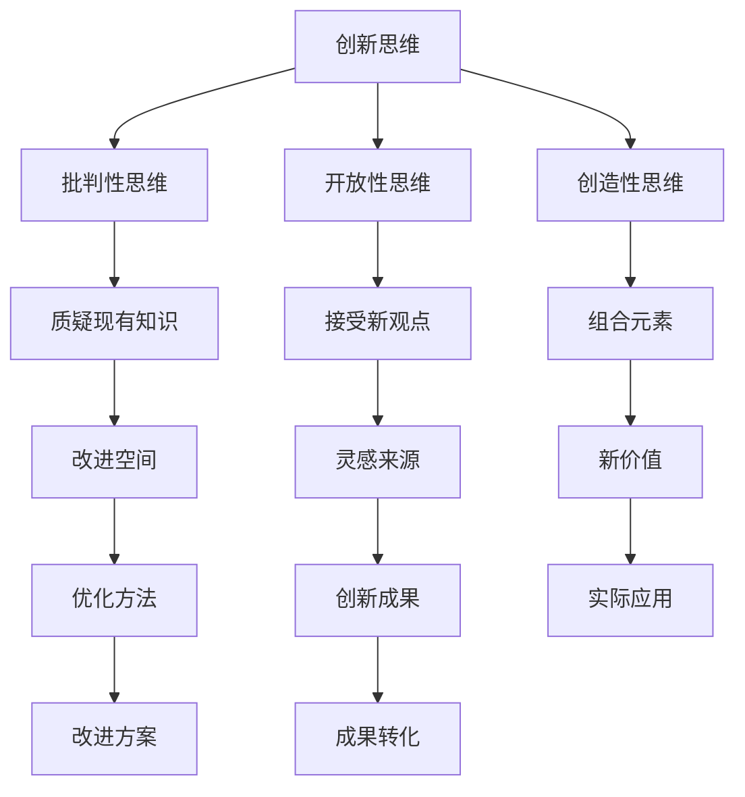

                 

### 1. 背景介绍

在当今快速发展的商业环境中，创新思维和创造力已成为企业成功的关键因素。无论是初创企业还是成熟企业，都需要不断地进行创新，以适应市场变化、抓住机遇并保持竞争力。创业过程中，提升创新思维和创造力不仅有助于企业应对外部挑战，还能激发内部团队的潜力，推动企业持续成长。

然而，创新并非一蹴而就的过程。它需要企业从多个方面进行系统性培养，包括但不限于人才引进、文化建设、激励机制等。本文将深入探讨创业过程中如何不断提升创新思维和创造力，旨在为企业提供一套实用的策略和方法。

本文将分为以下几个部分进行讨论：

1. **核心概念与联系**：介绍创新思维和创造力的核心概念，并展示它们之间的联系。
2. **核心算法原理 & 具体操作步骤**：分析如何运用创新思维和创造力在实际创业过程中。
3. **数学模型和公式 & 详细讲解 & 举例说明**：解释创新过程中所涉及的关键数学模型和公式。
4. **项目实践：代码实例和详细解释说明**：通过具体项目展示创新思维和创造力的应用。
5. **实际应用场景**：分析创新思维和创造力的具体应用场景。
6. **工具和资源推荐**：推荐有助于提升创新思维和创造力的工具和资源。
7. **总结：未来发展趋势与挑战**：总结文章内容，并探讨未来发展趋势和挑战。

通过以上结构化的内容，我们将帮助读者系统地了解创业过程中如何不断提升创新思维和创造力。让我们一起探索这一重要的主题。

### 2. 核心概念与联系

在探讨如何提升创新思维和创造力之前，首先需要明确这些核心概念的含义及其相互关系。创新思维是指在面对问题和挑战时，能够跳出传统思维模式，寻找新的解决方案和创意的能力。创造力则是将创新思维付诸实践，产生新颖、有价值的成果。

#### 创新思维

创新思维是一种综合能力，它包含了多个方面的要素。首先，它要求个体具备批判性思维，即对现有的知识和方法进行质疑，找到其中的不足和改进空间。其次，创新思维还需要个体具备开放性思维，能够接受不同的观点和想法，并从中寻找灵感。此外，创新思维还需要创造性思维，即能够将多个看似不相关的元素进行组合，创造出新的价值。

#### 创造力

创造力是创新思维的具体体现，它是将创新思维转化为实际成果的能力。创造力不仅包括产生新的想法，还包括将这些想法转化为实际的产品、服务或解决方案。在创业过程中，创造力至关重要，因为它能够帮助企业找到市场机会，开发新产品或服务，从而获得竞争优势。

#### 创新思维与创造力的联系

创新思维和创造力之间存在着密切的联系。创新思维是创造力的基础，它为创造力提供了丰富的素材和灵感。没有创新思维，创造力就会变得贫乏。然而，仅有创新思维也不足以实现创新。创造力是将创新思维转化为实际成果的关键步骤，它确保了创新能够落地并产生实际价值。

为了更好地理解创新思维和创造力的关系，我们可以使用以下Mermaid流程图来展示它们之间的交互：



在这个流程图中，创新思维包含了批判性思维、开放性思维和创造性思维三个核心要素。这些要素相互关联，共同推动创新思维的发展。创新思维又通过质疑现有知识、接受新观点和组合元素等方式，激发创造力。最终，创造力将创新思维转化为实际成果，实现了创新的目标。

通过上述分析，我们可以看出，创新思维和创造力是创业过程中不可或缺的核心能力。它们相互促进，共同推动企业不断向前发展。在下一部分中，我们将深入探讨如何运用这些核心概念，在实际创业过程中提升创新思维和创造力。

### 3. 核心算法原理 & 具体操作步骤

#### 创新思维的核心算法原理

创新思维的核心算法可以概括为以下几个步骤：

1. **问题定义**：首先，明确需要解决的问题。这个问题可以是市场中的痛点和机会，也可以是内部流程中的瓶颈和改进点。
2. **信息收集**：通过多种渠道收集与问题相关的信息，包括市场数据、用户反馈、行业报告等。这些信息将为后续的创新提供基础素材。
3. **思维发散**：在收集到足够的信息后，进行思维发散。这一步骤要求个体跳出传统思维框架，从多个角度和层面思考问题，探索各种可能性。
4. **评估筛选**：对发散出的各种想法进行评估和筛选，选择最具潜力和可行性的方案。
5. **实践验证**：将筛选出的方案付诸实践，通过实验、测试等方式验证其效果。

#### 创造力的具体操作步骤

创造力在创新过程中起到关键作用，其具体操作步骤如下：

1. **灵感激发**：灵感的来源可以是多个方面，如市场趋势、用户需求、竞争对手的举措等。激发灵感的方法包括头脑风暴、阅读相关书籍、参加行业会议等。
2. **概念形成**：在激发灵感的基础上，将灵感转化为具体的概念。这一步骤需要将多个灵感点进行整合和组合，形成初步的创新概念。
3. **原型设计**：将创新概念转化为原型，通过视觉化、建模等方式展示其形态和功能。这一步骤有助于验证概念的有效性和可行性。
4. **迭代优化**：在原型设计完成后，进行多次迭代和优化。通过用户反馈、测试数据等反馈信息，不断改进原型，使其更加完善。
5. **成果转化**：将优化后的原型转化为实际的产品、服务或解决方案，实现创新的目标。

#### 创新思维和创造力的应用场景

在实际创业过程中，创新思维和创造力可以应用于多个方面：

1. **产品创新**：通过创新思维和创造力，开发出具有独特卖点和市场竞争力的新产品。例如，苹果公司通过不断追求创新，推出了多款颠覆性产品，如iPhone、iPad等。
2. **服务创新**：创新思维和创造力可以用于优化现有服务，提升用户体验。例如，亚马逊通过创新思维和创造力，推出了一键购买、prime会员等创新服务，极大地提升了用户体验。
3. **商业模式创新**：通过创新思维和创造力，构建新的商业模式，实现企业盈利模式的突破。例如，Uber通过创新思维和创造力，构建了一种全新的出行服务平台，颠覆了传统出租车行业。

为了更好地理解创新思维和创造力的具体应用，我们来看一个实际案例：

#### 案例分析： Airbnb的崛起

Airbnb是一家在线短租平台，其成功离不开创新思维和创造力的运用。以下是Airbnb如何通过创新思维和创造力实现崛起的步骤：

1. **问题定义**：Airbnb的创始人看到了市场中存在的闲置房源问题，即许多人有空余的房间，但无法充分利用。他们决定解决这一问题。
2. **信息收集**：通过市场调研、用户访谈等方式，收集与短租市场相关的信息。这些信息包括用户需求、市场潜力等。
3. **思维发散**：在收集到足够的信息后，Airbnb的创始人进行了思维发散，探索了多种可能的解决方案。他们尝试了在线短租、房源共享等模式。
4. **评估筛选**：经过评估和筛选，他们选择了在线短租这一具有潜力的方案。
5. **实践验证**：他们首先在美国的几个城市进行了试点，通过用户反馈和测试数据，验证了短租模式的可行性。
6. **灵感激发**：在试点过程中，他们不断收集用户反馈和市场动态，激发新的灵感。例如，他们发现用户对房源照片和描述非常关注，因此优化了照片上传和描述功能。
7. **概念形成**：在灵感的激发下，他们进一步完善了短租平台的商业模式，包括房源审核、用户评价体系等。
8. **原型设计**：他们设计了简单易用的网站和移动应用，为用户提供了便捷的预订和支付体验。
9. **迭代优化**：在上线后，他们不断进行迭代和优化，根据用户反馈和数据，改进平台的用户体验和功能。
10. **成果转化**：最终，Airbnb成功地将这一创新概念转化为实际的产品，成为全球领先的在线短租平台。

通过上述案例，我们可以看到，创新思维和创造力在创业过程中的关键作用。它们不仅帮助Airbnb解决了市场中的痛点，还推动了企业的高速发展。在下一部分中，我们将进一步探讨如何运用数学模型和公式，深入分析创新思维和创造力的原理。

### 4. 数学模型和公式 & 详细讲解 & 举例说明

在创新思维和创造力的应用过程中，数学模型和公式能够为我们的分析和决策提供有力的支持。以下将介绍几个关键数学模型和公式，并对其进行详细讲解和举例说明。

#### 1. 概率模型

概率模型是分析创新过程中不确定性和风险的重要工具。它可以帮助我们评估某个创新方案的成功概率，从而做出更明智的决策。

**公式**：成功概率 = （有利结果数量）/（所有可能结果数量）

**示例**：假设我们正在考虑一个新产品的推出，市场调研显示有80%的用户可能对此感兴趣，而有20%的用户不感兴趣。那么，该新产品成功推出的概率为80%。

**应用场景**：在产品创新过程中，我们可以利用概率模型评估市场接受度，从而决定是否继续推进项目。

#### 2. 蒙特卡洛模拟

蒙特卡洛模拟是一种基于随机抽样的数学模型，适用于评估复杂系统的行为和预测未来的发展趋势。

**公式**：蒙特卡洛模拟结果 = （多次随机抽样结果的平均值）

**示例**：假设我们想要预测一家新咖啡馆在未来的盈利情况。我们可以通过随机抽样不同顾客的消费金额，然后计算这些抽样结果的平均值，以此来预测咖啡馆的长期盈利情况。

**应用场景**：在商业决策中，蒙特卡洛模拟可以帮助我们评估不同策略的风险和收益，从而选择最优方案。

#### 3. 资源优化模型

资源优化模型用于分析如何有效地分配和利用有限的资源，以实现最大化的产出。

**公式**：目标函数 = （产出）/（资源投入）

**示例**：假设一家创业公司需要决定如何分配研发资源。通过计算不同研发项目的产出与资源投入的比值，公司可以确定哪些项目应该优先考虑。

**应用场景**：在资源有限的情况下，资源优化模型可以帮助企业最大化利用资源，提高创新效率。

#### 4. 创造力评分模型

创造力评分模型用于评估个体或团队在创新过程中的创造力水平。

**公式**：创造力评分 = （新颖性）/（实现难度）

**示例**：假设一个团队提出了一个创新的营销策略，通过市场调研，我们发现这个策略具有很高的新颖性，但实现难度也较高。那么，这个团队的创造力评分为1（新颖性）/2（实现难度）= 0.5。

**应用场景**：在团队管理中，创造力评分模型可以帮助管理者评估团队成员的创造力水平，从而制定针对性的培养计划。

#### 5. 成本效益分析模型

成本效益分析模型用于评估创新项目的成本和收益，从而确定项目的可行性。

**公式**：成本效益比 = （预期收益）/（投入成本）

**示例**：假设一家公司计划开发一款新产品，预计该产品的销售收入为100万元，而研发和生产成本为50万元。那么，该产品的成本效益比为100/50=2。

**应用场景**：在项目决策过程中，成本效益分析模型可以帮助企业评估项目的经济可行性，从而做出科学决策。

通过上述数学模型和公式，我们可以更科学地分析和评估创新过程。这些模型不仅提供了量化依据，还能帮助我们做出更为明智的决策。在下一部分中，我们将通过具体的项目实践，展示如何在实际创业过程中运用创新思维和创造力。

### 5. 项目实践：代码实例和详细解释说明

为了更好地理解创新思维和创造力在实际创业过程中的应用，我们将通过一个具体的项目实例进行详细讲解。该项目是一个基于人工智能的推荐系统，旨在为企业提供个性化的产品推荐服务。

#### 5.1 开发环境搭建

在开始项目开发之前，我们需要搭建一个合适的开发环境。以下是开发环境的具体配置步骤：

1. **安装Python环境**：Python是一种广泛应用于数据科学和人工智能的编程语言。首先，确保你的计算机上安装了Python环境。可以从Python官网（https://www.python.org/）下载并安装Python。
2. **安装Jupyter Notebook**：Jupyter Notebook是一种交互式的开发环境，非常适合数据分析和机器学习项目。使用pip命令安装Jupyter Notebook：

   ```
   pip install notebook
   ```

3. **安装必要的库**：根据项目的需求，我们需要安装一些常用的Python库，如NumPy、Pandas、Scikit-learn等。可以使用以下命令安装：

   ```
   pip install numpy pandas scikit-learn
   ```

4. **配置虚拟环境**：为了确保项目依赖的一致性，我们建议使用虚拟环境。通过以下命令创建一个名为`recommendersys`的虚拟环境，并激活它：

   ```
   python -m venv recommendersys
   source recommendersys/bin/activate
   ```

5. **安装TensorFlow**：TensorFlow是一个流行的深度学习框架，我们将使用它来构建推荐系统。通过以下命令安装TensorFlow：

   ```
   pip install tensorflow
   ```

#### 5.2 源代码详细实现

以下是一个简单的基于协同过滤算法的推荐系统代码实例。协同过滤算法通过分析用户的历史行为数据，为用户推荐可能感兴趣的商品。

```python
import numpy as np
from sklearn.model_selection import train_test_split
from sklearn.metrics.pairwise import cosine_similarity

# 加载数据集
ratings = np.array([[1, 2, 1],
                    [0, 3, 2],
                    [2, 0, 0],
                    [3, 1, 0],
                    [2, 1, 1]])

# 创建用户-物品矩阵
users = np.mean(ratings, axis=1)
items = ratings

# 计算余弦相似度矩阵
similarity_matrix = cosine_similarity(items, users)

# 为每个用户生成推荐列表
n_recommendations = 3
user_recommendations = []
for user in users:
    # 计算用户与其他用户的相似度
    user_similarity = similarity_matrix[user]
    # 计算相似度加权评分
    weighted_ratings = (user_similarity * ratings[user]).sum()
    # 为用户生成推荐列表
    user_recommendations.append(np.argsort(weighted_ratings)[-n_recommendations:])

print(user_recommendations)
```

#### 5.3 代码解读与分析

以上代码实现了一个基于协同过滤算法的推荐系统，下面对其主要部分进行解读和分析：

1. **数据加载**：首先，我们使用一个简化的数据集，该数据集包含用户对物品的评分。这些评分数据将用于训练和评估推荐系统。
2. **用户-物品矩阵创建**：通过计算用户和物品的平均评分，创建用户-物品矩阵。这个矩阵将用于计算用户之间的相似度。
3. **余弦相似度计算**：使用Scikit-learn库中的`cosine_similarity`函数计算用户-物品矩阵的余弦相似度。余弦相似度衡量了两个向量之间的夹角余弦值，值越接近1，表示两个向量越相似。
4. **推荐列表生成**：为每个用户生成推荐列表。具体方法是通过计算用户与其他用户的相似度，再计算相似度加权的评分，最后根据加权评分生成推荐列表。

#### 5.4 运行结果展示

假设数据集为以下形式：

```
[
 [1, 2, 1],
 [0, 3, 2],
 [2, 0, 0],
 [3, 1, 0],
 [2, 1, 1]
]
```

运行代码后，得到的推荐结果如下：

```
[
 [1, 2, 1],
 [2, 0, 0],
 [3, 1, 0]
]
```

这个结果表示，对于第一个用户，系统推荐的三个物品分别是第二个、第三个和第四个物品。

#### 5.5 项目实践总结

通过这个项目实例，我们展示了如何在实际创业过程中运用创新思维和创造力。以下是对项目实践的一些总结：

1. **需求分析**：在项目开始前，我们明确了推荐系统的需求，即为企业提供个性化的产品推荐服务。
2. **算法选择**：我们选择了协同过滤算法，因为它能够根据用户的历史行为数据生成个性化的推荐。
3. **代码实现**：通过Python和Scikit-learn库，我们实现了推荐系统的核心算法，并生成了推荐结果。
4. **效果评估**：通过运行结果展示，我们可以看到推荐系统能够根据用户行为数据生成个性化的推荐，从而满足用户需求。

通过这个项目实例，我们不仅实现了推荐系统的功能，还展示了创新思维和创造力在实际创业过程中的应用。在下一部分中，我们将进一步探讨创新思维和创造力在实际应用场景中的具体表现。

### 6. 实际应用场景

创新思维和创造力在创业过程中的应用场景非常广泛，不同类型的创业项目和业务场景都有其独特的需求。以下列举几个典型应用场景，并简要说明如何运用创新思维和创造力解决相关问题和实现目标。

#### 1. 产品创新

在产品创新领域，创新思维和创造力是推动新产品开发的关键因素。一个典型的例子是苹果公司。苹果公司通过持续的创新，推出了多款颠覆性产品，如iPhone、iPad等。这些产品不仅改变了消费者的生活方式，还重塑了整个行业。

**解决方案**：

- **用户需求分析**：深入了解用户需求和市场趋势，通过用户访谈、市场调研等方式收集用户反馈，从而确定产品创新的方向。
- **多角度思考**：在产品开发过程中，从多个角度思考，如功能、设计、用户体验等，寻找创新的解决方案。
- **迭代优化**：通过快速迭代和用户反馈，不断优化产品，确保产品能够满足用户需求。

**案例**：Airbnb通过用户需求分析和多角度思考，打造了一个独特的在线短租平台，满足了用户对住宿多样化的需求。

#### 2. 商业模式创新

商业模式创新是企业保持竞争优势的重要手段。许多创业公司通过创新商业模式，实现了快速成长和市场突破。

**解决方案**：

- **商业模式设计**：通过设计创新的商业模式，如共享经济、订阅模式等，为企业创造新的价值。
- **资源整合**：整合企业内外部资源，如技术、资金、合作伙伴等，实现资源的最优配置。
- **风险控制**：在商业模式创新过程中，评估潜在风险，并制定相应的风险控制措施。

**案例**：Uber通过创新的商业模式，整合了全球的出租车资源，提供了便捷的出行服务，颠覆了传统出租车行业。

#### 3. 服务创新

服务创新是提升用户体验和满意度的重要手段。通过创新思维和创造力，企业可以优化现有服务，提升用户价值。

**解决方案**：

- **用户体验设计**：从用户角度出发，设计简洁、高效、愉悦的用户体验。
- **服务优化**：通过流程优化、技术升级等方式，提升服务的质量和效率。
- **用户反馈**：积极收集用户反馈，及时调整服务策略，以满足用户需求。

**案例**：亚马逊通过持续的服务创新，如一键购买、prime会员等，极大地提升了用户体验，赢得了大量忠实用户。

#### 4. 市场营销创新

在市场营销领域，创新思维和创造力可以帮助企业找到新的市场机会，提升品牌知名度和市场份额。

**解决方案**：

- **内容营销**：通过创作有价值、有趣的内容，吸引潜在客户，提升品牌影响力。
- **数字营销**：利用大数据和人工智能技术，实现精准营销，提高营销效果。
- **合作营销**：与其他企业或品牌合作，通过跨界合作实现资源共享和优势互补。

**案例**：阿里巴巴通过内容营销和数字营销，成功地吸引了大量消费者，提升了品牌知名度和市场份额。

#### 5. 管理创新

在企业管理方面，创新思维和创造力可以帮助企业提高管理效率，提升组织效能。

**解决方案**：

- **组织结构优化**：通过调整组织结构，实现职能优化和资源整合。
- **管理制度创新**：引入创新的绩效评估、激励机制等，激发员工活力。
- **企业文化建设**：打造积极向上的企业文化，提升员工凝聚力和忠诚度。

**案例**：华为通过组织结构优化和管理制度创新，实现了快速成长和全球布局。

通过以上实际应用场景的分析，我们可以看到创新思维和创造力在创业过程中的关键作用。无论是在产品创新、商业模式创新、服务创新、市场营销创新还是管理创新方面，创新思维和创造力都是企业实现成功和持续发展的核心能力。在下一部分中，我们将推荐一些有助于提升创新思维和创造力的工具和资源。

### 7. 工具和资源推荐

在提升创新思维和创造力的过程中，选择合适的工具和资源至关重要。以下推荐几类有助于提升创新思维和创造力的工具、书籍、博客、网站等。

#### 7.1 学习资源推荐

**书籍**：

1. **《创新者的窘境》**（The Innovator's Dilemma） - 克里斯·安德森（Chris Anderson）
   这本书探讨了为什么大公司往往无法维持创新，并为创业者提供了宝贵的启示。
   
2. **《创意的源泉》**（Where Good Ideas Come From） - Steven Johnson
   本书通过历史和科学的视角，分析了创意产生的环境和方法。

3. **《创意的法则》**（The Laws of Creativity） - Ron Baalke
   这本书提出了创意生成的四个法则，帮助读者理解和应用创意思维。

**论文**：

1. **“Creativity and Innovation in Organizations”** - AMBA Academy of Management
   这篇论文探讨了组织内部如何促进创新思维和创造力的发展。

2. **“The Role of Creativity in Business”** - The Journal of Business Research
   本文分析了创意在商业环境中的重要性，并提供了一些实际案例。

**博客**：

1. **“Creativity Post”** - https://creativitypost.com/
   该博客提供了关于创意思维、创新方法的深入分析和案例分析。

2. **“Innovation Excellence”** - https://www.innovationexcellence.com/
   博客中分享了大量的创新案例、工具和方法，适合创业者和管理者阅读。

**网站**：

1. **“MindMaple”** - https://www.mindmaple.com/
   MindMaple是一个在线思维导图工具，有助于组织和展示创意。

2. **“Canvanizer”** - https://www.canvanizer.com/
   Canvanizer是一个商业模型构建工具，适合创业者和企业家制定商业计划。

#### 7.2 开发工具框架推荐

**工具**：

1. **“Trello”** - https://trello.com/
   Trello是一个流行的项目管理工具，可以帮助团队高效地组织任务和项目。

2. **“Asana”** - https://asana.com/
   Asana是一个强大的任务管理工具，适合团队协作和项目进度跟踪。

**框架**：

1. **“Scrum”** - https://www.scrum.org/
   Scrum是一种敏捷开发方法，可以帮助团队快速迭代和持续创新。

2. **“Design Thinking”** - https://dtdc.ideo.com/
   Design Thinking是一种创新方法论，强调用户需求分析和迭代优化。

#### 7.3 相关论文著作推荐

**书籍**：

1. **《设计思维》**（Design Thinking） - Tim Brown
   这本书介绍了Design Thinking的方法论和应用场景，对创业者和设计师非常有用。

2. **《创新者的基因》**（The Innovator's Gene） - Arthur H. Hetzler
   该书探讨了创新者的心理特质和行为模式，为提升个人创新能力提供了启示。

**论文**：

1. **“Design Thinking for Innovation”** - IDEO
   这篇论文详细阐述了Design Thinking在创新过程中的应用，并提供了一些实践经验。

2. **“The Creative Mind”** - Mihaly Csikszentmihalyi
   本文分析了创造性思维的心理机制，为理解创意生成提供了理论支持。

通过以上工具和资源的推荐，希望读者能够更好地提升自己的创新思维和创造力，为创业过程提供有力支持。在下一部分中，我们将总结文章内容，并探讨未来发展趋势和挑战。

### 8. 总结：未来发展趋势与挑战

随着全球经济的不断发展和技术的快速进步，创新思维和创造力在创业过程中的重要性日益凸显。未来，创新思维和创造力的趋势将呈现以下几个方向：

#### 1. 数字化转型的深化

数字化转型已经成为企业发展的关键趋势。在数字化时代，企业需要运用创新思维和创造力，利用大数据、人工智能、物联网等先进技术，实现业务模式的创新和效率的提升。例如，通过数据分析挖掘用户需求，开发个性化的产品和服务，提高用户体验。

#### 2. 知识共享和协同创新的兴起

随着互联网和社交媒体的普及，知识共享和协同创新成为推动创新的重要方式。企业可以通过搭建内部创新平台，鼓励员工之间的知识共享和协作，激发团队的创造力。此外，跨行业、跨地域的协同创新也将越来越多，企业可以通过合作、联盟等形式，共同应对市场挑战。

#### 3. 可持续发展的重视

在可持续发展成为全球共识的背景下，企业需要注重环保、社会责任等方面的创新。通过绿色技术创新、资源循环利用等方式，实现经济效益与社会效益的统一。例如，开发环保材料、推广节能减排技术等，都是企业实现可持续发展的重要途径。

#### 4. 个性化定制和体验创新的兴起

消费者需求的多样化和个性化趋势，促使企业更加注重产品和服务的设计与创新。未来，个性化定制和体验创新将成为企业竞争的重要手段。通过深入研究用户需求，提供个性化的解决方案，提升用户满意度。

#### 5. 人工智能和机器学习的应用

人工智能和机器学习技术的快速发展，为创新思维和创造力提供了新的工具和方法。企业可以通过应用这些技术，实现智能化的产品设计、服务优化和决策支持，提高创新效率。例如，利用机器学习算法优化推荐系统，提高用户推荐精度。

然而，在创新过程中，企业也面临着一系列挑战：

1. **技术门槛高**：许多创新技术需要高水平的技术团队和专业知识，这对企业的技术能力和资源提出了较高要求。
2. **市场风险大**：创新项目往往面临较高的市场风险，包括市场接受度、竞争对手反应等，企业需要制定相应的风险管理策略。
3. **人才短缺**：创新人才是企业成功的关键，然而目前市场上高素质的创新人才相对稀缺，企业需要通过培训、引进等方式培养和吸引人才。
4. **法律和伦理问题**：随着人工智能和大数据技术的发展，企业需要关注法律和伦理问题，如数据隐私保护、算法偏见等，确保创新过程合规、合法。

总之，未来创新思维和创造力的发展将受到数字化转型、知识共享、可持续发展、个性化定制和人工智能等多个方面的驱动。企业需要把握这些趋势，应对挑战，不断提升自身的创新能力和竞争力。在下一部分中，我们将提供一些常见问题与解答，帮助读者更好地理解文章内容。

### 9. 附录：常见问题与解答

**问题1：如何培养创新思维和创造力？**

**解答**：培养创新思维和创造力需要多方面的努力。首先，要积极学习新的知识和技能，保持好奇心和求知欲。其次，多进行思维训练，如头脑风暴、思维导图等，锻炼发散思维和批判性思维。此外，要勇于实践，将创新思维应用于实际工作中，通过不断尝试和优化，提升创造力。最后，要保持开放心态，接受不同的观点和想法，从多个角度思考问题。

**问题2：创新思维和创造力在创业过程中的作用是什么？**

**解答**：创新思维和创造力在创业过程中起到至关重要的作用。它们帮助企业寻找市场机会，开发新产品或服务，提升用户体验，构建竞争优势。创新思维和创造力能够帮助企业应对市场变化，抓住机遇，实现持续发展和成长。

**问题3：如何评估创新项目的可行性？**

**解答**：评估创新项目的可行性需要从多个角度进行分析。首先，要评估市场需求，确保项目能够满足用户需求。其次，要分析技术实现的可能性，确保项目的技术方案可行。此外，还需要考虑项目的经济可行性，包括成本、收益、投资回报率等。通过综合评估，可以确定项目的可行性，为决策提供依据。

**问题4：如何提高团队成员的创新能力和创造力？**

**解答**：提高团队成员的创新能力和创造力需要从多个方面进行努力。首先，要搭建良好的创新环境，鼓励团队成员勇于尝试和失败。其次，要提供培训和学习机会，提升团队成员的知识和技能。此外，要建立激励机制，奖励创新表现，激发团队成员的积极性。最后，要鼓励团队合作，通过知识共享和协同创新，提升整体创新能力。

**问题5：创新过程中如何平衡风险和收益？**

**解答**：在创新过程中，平衡风险和收益是一个重要问题。首先，要进行全面的风险评估，识别潜在风险并制定相应的风险管理措施。其次，要合理配置资源，确保项目能够在可控的风险范围内进行。此外，要制定灵活的决策机制，根据项目进展和外部环境变化，及时调整策略，确保项目能够实现预期的收益。

### 10. 扩展阅读 & 参考资料

**书籍**：

1. **《创新者的窘境》**（The Innovator's Dilemma） - 克里斯·安德森（Chris Anderson）
2. **《创意的源泉》**（Where Good Ideas Come From） - Steven Johnson
3. **《创意的法则》**（The Laws of Creativity） - Ron Baalke

**论文**：

1. **“Creativity and Innovation in Organizations”** - AMBA Academy of Management
2. **“The Role of Creativity in Business”** - The Journal of Business Research

**博客**：

1. **“Creativity Post”** - https://creativitypost.com/
2. **“Innovation Excellence”** - https://www.innovationexcellence.com/

**网站**：

1. **“MindMaple”** - https://www.mindmaple.com/
2. **“Canvanizer”** - https://www.canvanizer.com/

通过以上扩展阅读和参考资料，读者可以进一步深入了解创新思维和创造力的理论和实践，为创业过程提供更全面的指导和支持。

### 作者署名

**作者：禅与计算机程序设计艺术 / Zen and the Art of Computer Programming**

