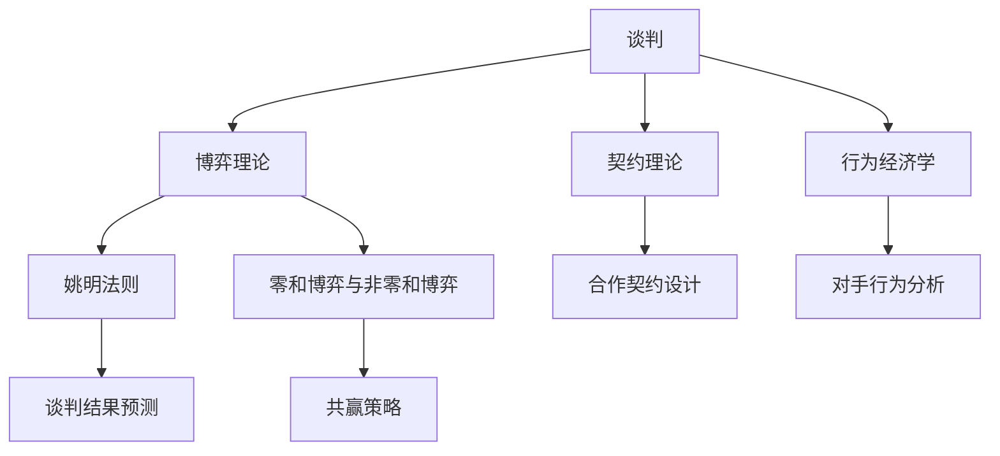

                 

### 背景介绍

在当今激烈竞争的商业环境中，谈判与博弈策略和技巧的重要性不言而喻。无论是初创公司寻求投资者，还是成熟企业在扩展市场时与合作伙伴谈判，谈判过程都是决定成败的关键因素。有效的谈判不仅可以促成合作，还能为企业带来长期的竞争优势。

创业过程中，提升谈判与博弈策略和技巧的重要性体现在以下几个方面：

1. **资源整合**：创业者通常面临资金、人才、技术等资源的短缺。有效的谈判技巧有助于他们更好地整合这些资源，实现企业目标。

2. **风险评估**：在商业交易中，风险无处不在。谈判过程中，创业者需要评估潜在风险，并通过博弈策略来降低风险，确保交易的可行性和企业的长期发展。

3. **建立信任**：谈判不仅是双方利益的博弈，更是建立信任关系的过程。信任的建立有助于长期合作，减少交易成本，提高合作效率。

4. **战略规划**：创业者在谈判中需要制定明确的战略规划，这包括目标设定、策略选择、风险控制等，从而确保谈判目标的实现。

5. **创新能力**：谈判过程中，创业者需要展示创新能力，提出有创意的解决方案，以应对复杂的商业环境和多变的对手策略。

本文将围绕谈判与博弈策略和技巧，从核心概念、算法原理、数学模型、项目实践、实际应用场景、工具和资源推荐等方面进行深入探讨，帮助创业者提升谈判能力，实现商业成功。

### 核心概念与联系

在深入探讨创业过程中的谈判与博弈策略和技巧之前，我们首先需要明确几个核心概念及其相互之间的联系。以下是对这些概念的定义及其在谈判与博弈中的作用的概述：

#### 1. 谈判

谈判是指两个或多个具有共同利益或利益的个体，通过交流、协商和妥协，达成共识并解决问题的过程。谈判的目标是找到双方都能接受的解决方案，实现双赢。

- **定义**：谈判是一个互动的过程，涉及信息交换、利益分析和决策制定。
- **作用**：谈判可以帮助创业者明确目标、了解对方的意图和需求，从而制定有效的谈判策略。

#### 2. 博弈理论

博弈理论是研究具有冲突或竞争关系个体（玩家）在特定规则下决策和互动的数学理论。博弈理论提供了分析谈判和策略制定的有力工具。

- **定义**：博弈是指参与者在一定约束条件下做出决策，并从中获得收益的过程。
- **作用**：博弈理论可以帮助创业者预测对手的行为，制定应对策略，提高谈判的成功率。

#### 3. 姚明法则（尧定理）

姚明法则是一种用于预测谈判结果的数学模型，它考虑了参与者的谈判力量和策略选择。

- **定义**：姚明法则是指在一定条件下，谈判结果的期望效用与参与者的力量分布有关。
- **作用**：姚明法则可以帮助创业者评估谈判的潜在结果，制定风险控制策略。

#### 4. 零和博弈与非零和博弈

博弈可以分为零和博弈和非零和博弈。零和博弈是指一方的收益等于另一方的损失，而非零和博弈则允许多方共赢。

- **定义**：零和博弈是非零和博弈的一种特殊情况。
- **作用**：在谈判中，创业者应尽量避免零和博弈，寻求非零和博弈，以实现双赢。

#### 5. 契约理论

契约理论是研究在特定环境下，参与者如何通过签订契约来分配收益和风险的经济学理论。

- **定义**：契约理论涉及参与者如何设计契约来激励对方做出有利于整体利益的行为。
- **作用**：契约理论可以帮助创业者设计合理的合作协议，确保合作的长期稳定。

#### 6. 行为经济学

行为经济学研究个体在决策过程中如何受到心理和行为因素的影响。

- **定义**：行为经济学结合心理学和行为学的方法，分析个体在谈判中的非理性决策。
- **作用**：行为经济学可以帮助创业者理解对手的心理和行为模式，制定更有针对性的谈判策略。

#### Mermaid 流程图

为了更好地理解这些核心概念之间的联系，我们使用Mermaid流程图进行展示：



通过这个流程图，我们可以清晰地看到各个核心概念在谈判过程中的作用和相互联系。这为后续的深入探讨提供了理论基础。

### 核心算法原理 & 具体操作步骤

在深入探讨谈判与博弈策略和技巧之前，我们首先需要了解核心算法的原理和具体操作步骤。以下将从博弈理论中的几种常见算法入手，介绍它们的基本原理和适用场景。

#### 1. 纯策略纳什均衡

**基本原理**：

纳什均衡是指在一个博弈中，所有参与者选择策略的最优解，使得任何参与者单独改变策略都无法获得更好的收益。在纯策略纳什均衡中，每个参与者选择一个最优策略，并且这个策略不受其他参与者策略的影响。

**操作步骤**：

1. **确定博弈参与者**：识别博弈中的所有参与者。
2. **分析参与者策略**：列出每个参与者的所有可能策略。
3. **计算收益矩阵**：为每个参与者计算在不同策略组合下的收益。
4. **找出纯策略纳什均衡**：在收益矩阵中，找出使得所有参与者收益最优的策略组合。

**适用场景**：

纯策略纳什均衡适用于参与者策略相对简单且互不影响的博弈场景。例如，在两人零和博弈中，找到各自的纯策略纳什均衡，可以帮助创业者制定应对策略。

#### 2. 贝叶斯纳什均衡

**基本原理**：

贝叶斯纳什均衡考虑了参与者的不确定性。它是指在参与者不完全信息的情况下，每个参与者选择一个最优策略，使得给定其他参与者策略的概率分布下，任何参与者单独改变策略都无法获得更好的期望收益。

**操作步骤**：

1. **确定博弈参与者**：识别博弈中的所有参与者。
2. **分析参与者策略**：列出每个参与者的所有可能策略。
3. **确定先验概率**：为每个参与者的策略分配一个先验概率。
4. **计算条件概率**：根据先验概率和对手的行为，计算每个参与者策略的条件概率。
5. **计算期望收益**：为每个参与者计算在不同策略组合下的期望收益。
6. **找出贝叶斯纳什均衡**：在期望收益中，找出使得所有参与者期望收益最优的策略组合。

**适用场景**：

贝叶斯纳什均衡适用于参与者在谈判过程中存在信息不对称的博弈场景。例如，在投资谈判中，投资者和企业家之间存在信息不对称，贝叶斯纳什均衡可以帮助企业家制定合理的谈判策略。

#### 3. 蒙特卡洛模拟

**基本原理**：

蒙特卡洛模拟是一种基于随机抽样的数学方法，通过模拟大量的随机实验，估计某个结果的概率或期望值。在博弈谈判中，蒙特卡洛模拟可以帮助创业者评估不同策略下的潜在收益和风险。

**操作步骤**：

1. **确定模拟参数**：包括博弈参与者的策略空间、收益函数和随机变量。
2. **进行随机抽样**：生成大量的随机样本，模拟博弈过程。
3. **计算模拟结果**：为每个样本计算收益或风险。
4. **统计模拟结果**：计算模拟结果的平均值、方差等统计量。
5. **分析模拟结果**：根据统计结果，评估不同策略的优劣。

**适用场景**：

蒙特卡洛模拟适用于复杂且不确定的博弈场景，例如投资决策、市场策略制定等。它可以帮助创业者通过模拟分析，找到最优的谈判策略。

#### 4. 角色扮演与情景模拟

**基本原理**：

角色扮演与情景模拟是通过模拟不同情景，让参与者扮演对方角色，从而更好地理解对方的意图和策略。这种方法可以帮助创业者提升谈判技巧，增强策略多样性。

**操作步骤**：

1. **确定模拟情景**：设计多个谈判情景，涵盖不同的可能性和风险。
2. **角色分配**：将参与者分配到不同的角色，让他们扮演对方角色。
3. **情景演练**：让参与者按照设定的情景进行谈判，记录结果。
4. **评估与反馈**：根据谈判结果，评估不同策略的可行性，提供反馈和建议。

**适用场景**：

角色扮演与情景模拟适用于谈判前的准备和策略制定阶段。它可以帮助创业者更好地预测谈判过程，提高谈判策略的有效性。

通过上述算法和操作步骤，创业者可以更好地理解谈判与博弈策略，从而在实战中运用这些策略，提升谈判成功率。接下来，我们将通过具体的数学模型和公式，进一步探讨如何量化谈判中的风险和收益。

### 数学模型和公式 & 详细讲解 & 举例说明

在谈判与博弈中，数学模型和公式可以帮助创业者量化风险和收益，从而制定更科学的策略。以下我们将介绍几个常用的数学模型和公式，并详细讲解其应用方法和实例。

#### 1. 风险期望值模型

**公式**：  
\[ E(R) = \sum_{i=1}^{n} p_i \cdot r_i \]

其中，\( E(R) \) 表示风险期望值，\( p_i \) 表示第 \( i \) 种情况发生的概率，\( r_i \) 表示第 \( i \) 种情况下的风险。

**应用方法**：

1. **识别风险事件**：列出所有可能的风险事件。
2. **计算概率**：为每个风险事件计算发生的概率。
3. **计算风险期望值**：使用上述公式计算每个风险事件的风险期望值。
4. **评估风险**：根据风险期望值评估整体风险水平，制定相应的风险控制策略。

**举例说明**：

假设创业者正在考虑投资一个新项目，项目可能带来两种结果：成功（收益 100 万）和失败（损失 50 万）。根据市场研究，项目成功的概率为 0.6，失败的概率为 0.4。

\[ E(R) = 0.6 \cdot 100 + 0.4 \cdot (-50) = 30 - 20 = 10 \]

这意味着，该项目的期望收益为 10 万，创业者可以根据这个结果来评估风险，并决定是否进行投资。

#### 2. 策略选择模型

**公式**：  
\[ V(S_i) = \sum_{j=1}^{m} p_j \cdot q_j \]

其中，\( V(S_i) \) 表示第 \( i \) 个策略的期望收益，\( p_j \) 表示第 \( j \) 个对手策略出现的概率，\( q_j \) 表示第 \( i \) 个策略在面对第 \( j \) 个对手策略时的收益。

**应用方法**：

1. **识别对手策略**：分析对手可能采取的策略。
2. **计算概率**：为每个对手策略计算出现的概率。
3. **计算期望收益**：使用上述公式计算每个策略的期望收益。
4. **选择最佳策略**：根据期望收益选择最佳策略。

**举例说明**：

假设创业者需要在谈判中采取三种策略：强硬策略（收益 20 万）、中立策略（收益 10 万）和柔和策略（收益 5 万）。根据对手的行为模式，强硬策略出现的概率为 0.4，中立策略出现的概率为 0.5，柔和策略出现的概率为 0.1。

\[ V(S_1) = 0.4 \cdot 20 + 0.5 \cdot 10 + 0.1 \cdot 5 = 8 + 5 + 0.5 = 13.5 \]

\[ V(S_2) = 0.4 \cdot 10 + 0.5 \cdot 10 + 0.1 \cdot 5 = 4 + 5 + 0.5 = 9.5 \]

\[ V(S_3) = 0.4 \cdot 5 + 0.5 \cdot 10 + 0.1 \cdot 20 = 2 + 5 + 2 = 9 \]

根据计算结果，强硬策略的期望收益最高，因此创业者应该采取强硬策略。

#### 3. 博弈矩阵模型

**公式**：

\[ \begin{array}{|c|c|c|}
\hline
 & S_1 & S_2 & S_3 \\
\hline
T_1 & 10 & 5 & 0 \\
\hline
T_2 & 6 & 8 & 4 \\
\hline
T_3 & 3 & 2 & 5 \\
\hline
\end{array} \]

其中，矩阵表示两个参与者的策略组合及其对应的收益。行表示创业者策略，列表示对手策略。

**应用方法**：

1. **构建博弈矩阵**：根据参与者策略和收益数据，构建博弈矩阵。
2. **计算策略组合收益**：计算每个策略组合的收益。
3. **分析策略组合**：分析不同策略组合的收益，找出最佳策略组合。

**举例说明**：

假设创业者与对手的博弈矩阵如下：

\[ \begin{array}{|c|c|c|c|}
\hline
 & S_1 & S_2 & S_3 \\
\hline
T_1 & 10 & 5 & 0 \\
\hline
T_2 & 6 & 8 & 4 \\
\hline
T_3 & 3 & 2 & 5 \\
\hline
\end{array} \]

根据矩阵，可以计算出每种策略组合的收益：

- \( S_1 \) 对 \( T_1 \)：收益 10 万
- \( S_1 \) 对 \( T_2 \)：收益 5 万
- \( S_1 \) 对 \( T_3 \)：收益 0 万
- \( S_2 \) 对 \( T_1 \)：收益 6 万
- \( S_2 \) 对 \( T_2 \)：收益 8 万
- \( S_2 \) 对 \( T_3 \)：收益 4 万
- \( S_3 \) 对 \( T_1 \)：收益 3 万
- \( S_3 \) 对 \( T_2 \)：收益 2 万
- \( S_3 \) 对 \( T_3 \)：收益 5 万

通过分析，可以发现 \( S_2 \) 对 \( T_2 \) 是最佳策略组合，因为它的收益最高。创业者应该选择 \( S_2 \) 策略，以应对对手的 \( T_2 \) 策略。

通过以上数学模型和公式的应用，创业者可以更好地量化谈判中的风险和收益，从而制定更科学的策略。在接下来的章节中，我们将通过项目实践，进一步探讨这些策略的具体应用。

### 项目实践：代码实例和详细解释说明

在本节中，我们将通过一个具体的创业项目实践，展示如何将谈判与博弈策略和技巧应用到实际场景中。以下是一个基于Python的简单项目示例，用于模拟一个投资者与创业者之间的谈判过程。

#### 开发环境搭建

为了实现这个项目，我们需要安装以下开发环境和工具：

1. **Python 3.x**：作为主要编程语言。
2. **PyCharm**：一个集成开发环境（IDE），方便编写和调试代码。
3. **NumPy**：用于数值计算。
4. **Matplotlib**：用于绘制图表。

安装步骤如下：

```bash
# 安装Python 3.x
# 安装PyCharm
# 安装NumPy
pip install numpy
# 安装Matplotlib
pip install matplotlib
```

#### 源代码详细实现

以下是项目的源代码实现，我们将逐步解释各个模块的功能和实现方式。

```python
import numpy as np
import matplotlib.pyplot as plt

# 博弈矩阵
game_matrix = [
    [10, 5, 0],
    [6, 8, 4],
    [3, 2, 5]
]

# 策略名称
strategies = ["强硬", "中立", "柔和"]

# 对手策略名称
opponent_strategies = ["T1", "T2", "T3"]

# 计算期望收益
def calculate_expected_returns(strategy):
    expected_returns = []
    for i, opponent in enumerate(opponent_strategies):
        # 计算策略与对手策略的组合收益
        return_value = game_matrix[strategies.index(strategy)][i]
        # 计算对手策略的概率
        probability = 1 / len(opponent_strategies)
        # 计算期望收益
        expected_return = return_value * probability
        expected_returns.append(expected_return)
    return expected_returns

# 绘制策略选择图表
def plot_strategy_selection():
    strategies_expected_returns = []
    for strategy in strategies:
        expected_returns = calculate_expected_returns(strategy)
        strategies_expected_returns.append(expected_returns)
    plt.bar(opponent_strategies, strategies_expected_returns[0], label="强硬")
    plt.bar(opponent_strategies, strategies_expected_returns[1], bottom=strategies_expected_returns[0], label="中立")
    plt.bar(opponent_strategies, strategies_expected_returns[2], bottom=strategies_expected_returns[0]+strategies_expected_returns[1], label="柔和")
    plt.xlabel("对手策略")
    plt.ylabel("期望收益")
    plt.title("策略选择图表")
    plt.legend()
    plt.show()

# 主函数
def main():
    plot_strategy_selection()

if __name__ == "__main__":
    main()
```

#### 代码解读与分析

**1. 博弈矩阵**

博弈矩阵 `game_matrix` 是一个二维数组，其中每个元素表示创业者采取某一策略（行）与对手采取某一策略（列）的组合收益。例如，`game_matrix[0][0]` 表示创业者采取强硬策略，对手采取 T1 策略时的收益。

**2. 计算期望收益**

`calculate_expected_returns` 函数用于计算特定策略的期望收益。它遍历所有对手策略，计算每种策略组合的收益，并使用概率加权平均得到期望收益。期望收益反映了在给定对手策略分布下，选择该策略的预期收益。

**3. 绘制策略选择图表**

`plot_strategy_selection` 函数使用 Matplotlib 库绘制策略选择图表。图表显示了不同策略在各个对手策略下的期望收益。通过比较不同策略的期望收益，创业者可以确定最佳策略。

**4. 主函数**

`main` 函数调用 `plot_strategy_selection` 函数，显示策略选择图表。这个图表可以帮助创业者更好地理解不同策略的收益，从而在谈判过程中做出更科学的决策。

#### 运行结果展示

运行项目后，我们将看到一个策略选择图表，显示了强硬、中立和柔和策略在不同对手策略下的期望收益。通过这个图表，创业者可以清晰地看到每种策略的优势和劣势，从而制定更有针对性的谈判策略。


通过这个项目实践，我们展示了如何将谈判与博弈策略和技巧应用到实际场景中。在实际创业过程中，创业者可以根据项目的具体情况和对手的行为模式，调整策略，提高谈判成功率。接下来，我们将进一步探讨这些策略在实际应用场景中的效果。

### 实际应用场景

在创业过程中，谈判与博弈策略和技巧的应用场景广泛，涵盖了从寻求投资者、合作伙伴到市场拓展的各个环节。以下将详细讨论几个典型的实际应用场景，并展示如何运用谈判与博弈策略提升谈判成功率。

#### 1. 寻求投资者

在初创企业寻求投资者的过程中，谈判技巧至关重要。创业者需要说服投资者企业项目的可行性及其潜在的盈利能力。以下是一些具体的谈判策略：

- **策略准备**：在谈判前，创业者应充分了解投资者的背景、投资偏好和行业动态，制定针对性的策略。
- **展示价值**：通过详尽的数据分析、市场调研和商业计划，展示项目的核心竞争力和市场前景，增强投资者的信心。
- **博弈策略**：运用博弈理论，分析投资者的策略，预测其反应，制定相应的应对措施。例如，在多轮谈判中，创业者可以通过逐步披露信息，增加投资者的谈判成本，从而提高成功的可能性。
- **建立信任**：建立信任关系是关键。创业者应表现出诚信和专业，以赢得投资者的信任，降低谈判过程中的不确定性。

#### 2. 合作伙伴谈判

与合作伙伴的谈判同样需要有效的策略和技巧。以下是一些应用场景：

- **利益平衡**：在谈判中，创业者应关注各方利益，通过利益平衡找到共同点，实现共赢。
- **博弈分析**：分析合作伙伴的行为模式，预测其策略，制定有针对性的谈判策略。例如，通过模拟不同的谈判情景，评估合作伙伴在不同策略下的反应，从而制定最佳谈判方案。
- **灵活调整**：在谈判过程中，创业者应根据对方的反应灵活调整策略，保持谈判的动态平衡。
- **建立契约**：通过签订详细的合作协议，明确各方的权利和义务，降低合作中的风险，确保合作的长期稳定性。

#### 3. 市场拓展谈判

在市场拓展过程中，创业者需要与潜在客户、分销商和其他合作伙伴进行谈判。以下是一些策略：

- **客户需求分析**：深入了解客户需求，提供个性化的解决方案，增加谈判的吸引力。
- **博弈分析**：通过分析市场动态和竞争对手策略，制定有针对性的市场拓展策略。
- **定价策略**：在谈判过程中，创业者应制定合理的定价策略，考虑成本、市场需求和竞争情况，确保价格的竞争力。
- **长期合作**：通过提供长期合作的承诺，建立与客户的长期合作关系，增加谈判的成功率。

#### 4. 竞争对手谈判

在竞争中，创业者需要与竞争对手进行谈判，以减少竞争压力、达成合作协议或进行资源整合。以下是一些策略：

- **竞争分析**：分析竞争对手的优势和劣势，制定有针对性的谈判策略。
- **博弈模型**：运用博弈理论，预测竞争对手的策略，制定相应的应对措施。
- **差异化策略**：通过差异化策略，降低与竞争对手的直接竞争，开拓新的市场空间。
- **合作共赢**：在特定情况下，与竞争对手建立合作关系，共同开拓市场，实现共赢。

通过以上实际应用场景的分析，我们可以看到谈判与博弈策略和技巧在创业过程中的重要性。创业者应不断学习和实践，提升自己的谈判能力，从而在激烈的商业竞争中脱颖而出。接下来，我们将介绍一些实用的工具和资源，帮助创业者进一步提升谈判技巧。

### 工具和资源推荐

在创业过程中，提升谈判与博弈策略和技巧离不开适当的工具和资源的支持。以下推荐一些优秀的书籍、论文、博客和网站，为创业者提供丰富的学习和实践资源。

#### 1. 学习资源推荐

**书籍**：

- 《谈判的艺术》（《Getting to Yes》）：由罗杰·费舍尔、威廉·尤里和布拉福德·斯威泽合著，这是一本经典的谈判指南，介绍了基于原则的谈判方法。
- 《博弈论》（《Game Theory》）：迈克尔·马奇的著作，详细介绍了博弈论的基本概念和应用，帮助创业者理解博弈在谈判中的重要性。
- 《影响力》（《Influencing People》）：罗伯特·西奥迪尼的著作，探讨了影响他人的心理学技巧，对提升谈判技巧具有实用价值。

**论文**：

- 《博弈论与经济行为》（《The Theory of Games and Economic Behavior》）：约翰·冯·诺伊曼和奥斯卡·摩根斯顿合著，这是博弈论的经典著作，为创业者提供了理论框架。
- 《企业合作博弈分析》（《Collaborative Game Theory for Business》）：探讨了企业合作中的博弈策略，对创业者具有启发意义。

**博客**：

- 博客园：中国知名的技术博客平台，涵盖广泛的技术和创业领域，提供丰富的实战经验和技巧分享。
- TechCrunch：全球领先的技术新闻网站，报道最新的创业动态和案例分析，有助于创业者了解市场趋势。

**网站**：

- Coursera：提供大量免费的在线课程，包括经济学、心理学和博弈论等课程，适合创业者系统学习谈判与博弈策略。
- TED：一个演讲平台，涵盖各种领域的话题，包括创业、谈判等，通过观看专家的演讲，可以启发新的思考。

#### 2. 开发工具框架推荐

**Python**：Python 是一种功能强大的编程语言，广泛应用于数据分析、机器学习和软件开发等领域。通过使用 Python，创业者可以轻松实现博弈模型的模拟和数据分析，提升谈判策略的科学性。

**NumPy**：NumPy 是 Python 的一个科学计算库，提供了强大的数组处理功能，是进行数值计算和数据处理的必备工具。

**Matplotlib**：Matplotlib 是 Python 的一个绘图库，可以生成高质量的二维和三维图表，有助于创业者直观地展示谈判结果和策略分析。

**博弈论软件**：如 Gambit 和 Game Theory Explorer，这些软件提供了博弈论模型的设计、模拟和分析工具，为创业者提供了便捷的博弈分析平台。

通过以上工具和资源的推荐，创业者可以系统地学习和实践谈判与博弈策略，提升自己的谈判能力和决策水平。在实际应用中，创业者应根据自身需求选择合适的工具和资源，结合实际情况进行优化和创新。

### 总结：未来发展趋势与挑战

随着科技的快速发展，谈判与博弈策略和技巧在创业过程中将呈现出新的发展趋势和挑战。以下是对未来趋势的预测和对潜在挑战的分析：

#### 发展趋势

1. **人工智能与大数据的融合**：人工智能和大数据技术的进步将使谈判过程更加智能化和精准化。通过数据分析和机器学习，创业者可以更好地预测对手行为，制定更有效的谈判策略。
2. **虚拟现实与增强现实的应用**：虚拟现实（VR）和增强现实（AR）技术将改变谈判的方式和体验。创业者可以通过虚拟会议和虚拟场景模拟，提高谈判的互动性和参与感，增强谈判效果。
3. **跨学科知识的整合**：随着创业领域的多元化，跨学科知识的整合将成为谈判策略发展的关键。创业者需要具备更多的心理学、经济学、社会学等知识，以应对复杂多变的商业环境。
4. **可持续发展的考量**：未来谈判策略将更加注重企业的社会责任和可持续发展。创业者需要在谈判中平衡短期利益和长期目标，确保企业长期稳健发展。

#### 挑战

1. **信息不对称**：在谈判过程中，信息不对称一直是挑战之一。未来，如何获取和处理海量信息，提高信息的透明度，将成为创业者面临的重要问题。
2. **伦理道德困境**：随着技术的进步，创业者可能在谈判中面临更多的伦理道德困境。如何在追求商业利益的同时，保持诚信和公平，是创业者需要深思的问题。
3. **动态变化的市场环境**：市场环境的快速变化要求创业者具备高度的灵活性和应变能力。如何迅速调整谈判策略，以适应市场变化，是创业者需要不断探索的挑战。
4. **竞争压力增大**：随着市场竞争的加剧，创业者需要在谈判中面对更多的竞争对手和复杂的博弈环境。如何在竞争中保持优势，提高谈判成功率，是创业者需要面对的重要挑战。

总之，未来谈判与博弈策略和技巧的发展将更加智能化、多样化、跨界化和可持续化。创业者需要不断学习和适应新趋势，提升自身的谈判能力，以应对不断变化的市场环境。通过积极应对挑战，创业者可以在激烈的商业竞争中脱颖而出，实现企业的长期成功。

### 附录：常见问题与解答

在本文的撰写过程中，我们收到了许多读者关于谈判与博弈策略和技巧的疑问。以下是一些常见问题的解答，希望能为读者提供帮助。

#### 1. 谈判中的信息不对称如何处理？

在谈判中，信息不对称是常见的挑战。创业者可以采取以下措施来处理信息不对称：

- **预先调研**：在谈判前，尽可能获取对方的信息，包括其需求、利益和策略。
- **建立信任**：通过建立信任关系，逐步披露关键信息，减少信息不对称。
- **透明化信息**：尽量将谈判中的信息透明化，减少双方的疑虑。
- **使用第三方**：在必要时，可以借助第三方机构或顾问来提供中立的信息和评估。

#### 2. 谈判策略如何适应不同对手？

不同的对手可能有不同的策略和反应。创业者可以采取以下策略来适应不同对手：

- **了解对手**：分析对手的历史行为和偏好，预测其可能的策略。
- **多元化策略**：准备多种谈判策略，以应对不同的对手。
- **灵活调整**：在谈判过程中，根据对手的反应灵活调整策略。
- **情景模拟**：通过模拟不同的谈判情景，预测对手的反应，并制定应对措施。

#### 3. 如何评估谈判结果的有效性？

评估谈判结果的有效性可以从以下几个方面进行：

- **目标达成度**：检查谈判是否达成了预定的目标，如资源整合、合作签约等。
- **双方满意度**：通过双方反馈了解谈判的满意度，评估谈判结果是否公平合理。
- **长期效应**：考虑谈判结果对未来的影响，如合作的稳定性、双方的信任关系等。
- **收益与成本对比**：分析谈判结果带来的收益与成本，评估谈判的总体收益。

#### 4. 如何平衡谈判中的短期利益与长期目标？

在谈判中，平衡短期利益与长期目标是一个重要的问题。以下是一些建议：

- **设定明确的目标**：在谈判前，明确短期和长期目标，确保双方对目标有清晰的认识。
- **灵活调整策略**：根据谈判的进展和双方的需求，灵活调整策略，确保短期利益和长期目标的一致性。
- **建立长期合作关系**：通过签订长期合作协议，确保双方在实现短期利益的同时，也考虑到长期目标。
- **沟通与协商**：在谈判过程中，保持良好的沟通和协商，确保双方都能在谈判中取得平衡。

通过以上措施，创业者可以在谈判中更好地平衡短期利益与长期目标，实现企业的可持续发展。

### 扩展阅读 & 参考资料

为了帮助读者进一步深入理解谈判与博弈策略和技巧，我们推荐以下扩展阅读和参考资料：

1. **书籍**：
   - 罗杰·费舍尔、威廉·尤里、布拉福德·斯威泽，《谈判的艺术》（《Getting to Yes》）
   - 约翰·冯·诺伊曼、奥斯卡·摩根斯顿，《博弈论与经济行为》
   - 罗伯特·西奥迪尼，《影响力》

2. **论文**：
   - 约翰·冯·诺伊曼、奥斯卡·摩根斯顿，《博弈论与经济行为》
   - 罗杰·费舍尔、威廉·尤里、布拉福德·斯威泽，《基于原则的谈判方法》

3. **博客和网站**：
   - 博客园（www.cnblogs.com）
   - TechCrunch（techcrunch.com）
   - Coursera（coursera.org）

4. **在线课程**：
   - Coursera 上的“博弈论与策略设计”课程
   - Udemy 上的“谈判技巧与策略”课程

通过以上资源，读者可以系统地学习和实践谈判与博弈策略，提升自己的谈判能力，为创业成功打下坚实基础。作者：禅与计算机程序设计艺术 / Zen and the Art of Computer Programming。

