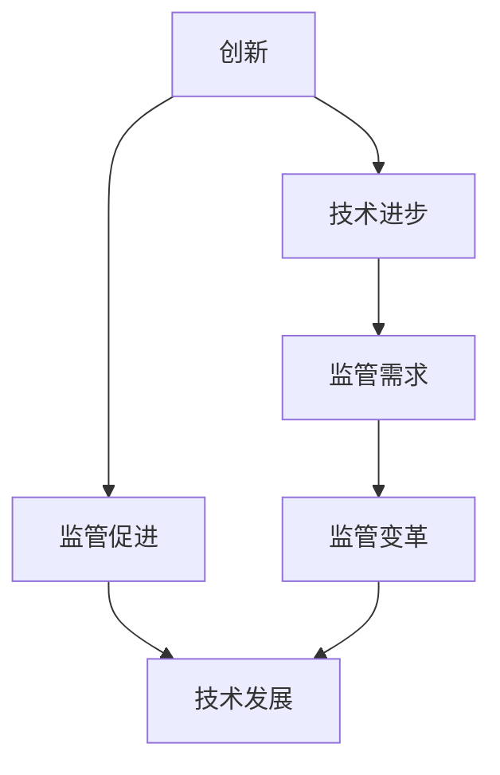

                 

### 1. 背景介绍

随着科技的飞速发展，人工智能（AI）已经成为推动社会进步的重要力量。从自动驾驶汽车到智能家居，从医疗诊断到金融分析，AI的应用场景无处不在。然而，人工智能的快速发展也带来了诸多挑战，其中之一便是如何在创新与监管之间找到平衡。

在AI领域，创新是推动技术进步的关键。通过不断的研究和实验，研究人员和开发人员能够提出新的算法、模型和框架，从而实现更高效、更智能的解决方案。然而，随着AI技术的应用越来越广泛，监管的必要性也日益凸显。监管的目的是确保AI系统不会对人类造成危害，同时保护用户的隐私和数据安全。

创新与监管之间的关系并非简单的对立。实际上，二者是相辅相成的。创新为监管提供了技术基础，而监管则为创新提供了规范和保障。然而，在实践中，如何在两者之间找到平衡点仍然是一个复杂的问题。本文将深入探讨这一主题，分析创新与监管的相互作用，并提出一些可能的解决方案。

### 2. 核心概念与联系

#### 2.1 创新的概念

创新，简而言之，是指通过创造性的思维和实践，开发出新的产品、服务或过程。在人工智能领域，创新主要体现在以下几个方面：

1. **算法创新**：研究人员不断提出新的算法和模型，以提高AI系统的性能和效率。例如，深度学习算法的提出和应用极大地推动了图像识别和自然语言处理等领域的发展。

2. **技术突破**：通过技术创新，如量子计算、脑机接口等，AI系统将能够处理更加复杂的问题，实现更高层次的智能。

3. **应用创新**：将AI技术应用于新的领域，如农业、教育、医疗等，创造出前所未有的解决方案。

#### 2.2 监管的概念

监管，是指通过制定和执行法规、政策，对某一领域进行管理和控制。在人工智能领域，监管的主要目标是确保AI系统的安全、公正和透明，避免对人类和社会造成负面影响。监管的主要内容可以归纳为以下几个方面：

1. **数据隐私**：保护用户的个人数据，防止数据泄露和滥用。

2. **算法透明性**：确保AI算法的决策过程可以被理解和解释，避免算法的“黑箱”现象。

3. **公平性**：防止AI系统在性别、种族、年龄等方面的歧视。

4. **安全性**：确保AI系统在运行过程中不会出现意外故障，对人类和环境造成危害。

#### 2.3 创新与监管的联系

创新与监管之间存在紧密的联系。创新为监管提供了技术基础，监管则为创新提供了规范和保障。具体来说：

1. **技术进步驱动监管需求**：随着AI技术的不断进步，监管需求也在不断变化。例如，随着深度学习算法的广泛应用，对算法透明性和可解释性的监管需求日益增加。

2. **监管促进技术发展**：监管可以为创新提供明确的指导，帮助开发者了解和遵循最佳实践，从而推动技术的健康发展。例如，数据隐私法规的出台，促使企业加强对用户数据的保护。

3. **创新推动监管变革**：随着AI技术的不断突破，监管体系也需要不断更新和调整，以适应新的技术环境和挑战。

#### 2.4 Mermaid 流程图

为了更好地展示创新与监管之间的联系，我们可以使用Mermaid绘制一个流程图。以下是一个简化的流程图示例：



在这个流程图中，创新和技术进步驱动了监管需求，而监管又反过来促进了技术的进一步发展。同时，监管需求也驱动了监管体系的变革，以适应不断发展的技术环境。

### 3. 核心算法原理 & 具体操作步骤

在探讨创新与监管的关系时，我们无法忽略AI技术本身的发展。为了更好地理解这一领域，我们将深入探讨一些核心算法的原理和具体操作步骤。

#### 3.1 深度学习算法

深度学习算法是近年来AI领域的一大突破，其核心原理是基于多层神经网络对数据进行建模和预测。以下是深度学习算法的基本步骤：

1. **数据预处理**：收集并清洗数据，将数据转换为模型可以接受的格式。
   $$\text{Data} \rightarrow \text{Preprocessing} \rightarrow \text{CleanData}$$

2. **模型构建**：设计并构建神经网络模型，包括输入层、隐藏层和输出层。
   $$\text{Input} \rightarrow \text{Hidden Layers} \rightarrow \text{Output}$$

3. **训练模型**：使用训练数据集对模型进行训练，通过反向传播算法不断调整模型参数，使模型能够更好地拟合数据。
   $$\text{Model} \rightarrow \text{Training} \rightarrow \text{Adjusted Model}$$

4. **评估模型**：使用验证数据集对训练好的模型进行评估，确保模型具有良好的泛化能力。
   $$\text{Model} \rightarrow \text{Validation} \rightarrow \text{Accuracy}$$

5. **应用模型**：将训练好的模型应用于实际问题，进行预测或分类。
   $$\text{Model} \rightarrow \text{Application} \rightarrow \text{Prediction}$$

#### 3.2 强化学习算法

强化学习算法是一种基于奖励机制进行学习的方法，其主要原理是通过不断尝试和反馈来优化策略。以下是强化学习算法的基本步骤：

1. **环境初始化**：初始化环境，确定状态空间和动作空间。
   $$\text{Environment} \rightarrow \text{Initialize}$$

2. **选择动作**：基于当前状态，选择一个动作。
   $$\text{State} \rightarrow \text{Action Selection}$$

3. **执行动作**：在环境中执行所选动作，并获取状态转移和奖励。
   $$\text{Action} \rightarrow \text{Execute} \rightarrow \text{Next State, Reward}$$

4. **更新策略**：根据奖励信号更新策略，以期望在未来获得更高的奖励。
   $$\text{Reward} \rightarrow \text{Policy Update}$$

5. **重复迭代**：重复执行上述步骤，直到达到目标或满足停止条件。
   $$\text{Iterate} \rightarrow \text{Repeat}$$

#### 3.3 自然语言处理算法

自然语言处理（NLP）是AI领域的一个重要分支，其主要目标是使计算机能够理解、生成和处理自然语言。以下是NLP算法的基本步骤：

1. **文本预处理**：对文本数据进行清洗和分词，提取有效的信息。
   $$\text{Text} \rightarrow \text{Preprocessing} \rightarrow \text{Tokens}$$

2. **词向量表示**：将文本数据转换为词向量表示，以便进行进一步的模型训练。
   $$\text{Tokens} \rightarrow \text{Word Embeddings}$$

3. **模型训练**：设计并训练合适的NLP模型，如序列标注模型、文本分类模型等。
   $$\text{Word Embeddings} \rightarrow \text{Model Training}$$

4. **文本分析**：使用训练好的模型对文本进行分析，提取语义信息，如情感分析、主题分类等。
   $$\text{Model} \rightarrow \text{Text Analysis} \rightarrow \text{Semantic Information}$$

5. **应用场景**：将NLP模型应用于实际场景，如机器翻译、智能客服等。
   $$\text{Model} \rightarrow \text{Application} \rightarrow \text{Use Case}$$

通过上述核心算法的介绍，我们可以看到，AI技术的发展离不开创新和理论指导。同时，这些算法在具体操作过程中也面临着监管的挑战，如数据隐私、算法透明性和安全性等。因此，如何在创新与监管之间找到平衡，是当前AI领域需要深入探讨的问题。

### 4. 数学模型和公式 & 详细讲解 & 举例说明

在深入探讨人工智能算法时，数学模型和公式是理解和应用这些算法的关键。以下我们将详细讲解一些核心数学模型和公式，并通过具体例子进行说明。

#### 4.1 深度学习中的前向传播和反向传播算法

深度学习中的前向传播和反向传播算法是神经网络训练的核心。以下是这些算法的基本公式：

**前向传播**：

$$
z_l = W_l \cdot a_{l-1} + b_l \\
a_l = \sigma(z_l)
$$

其中，$z_l$是第$l$层的输入，$W_l$是权重矩阵，$b_l$是偏置项，$\sigma$是激活函数（如ReLU、Sigmoid或Tanh），$a_l$是第$l$层的输出。

**反向传播**：

$$
\delta_l = \frac{\partial L}{\partial a_l} \cdot \frac{\partial a_l}{\partial z_l} \\
\frac{\partial L}{\partial z_l} = \delta_l \cdot \frac{\partial \sigma}{\partial z_l} \\
\frac{\partial L}{\partial W_l} = a_{l-1}^T \cdot \delta_l \\
\frac{\partial L}{\partial b_l} = \delta_l
$$

其中，$L$是损失函数，$\delta_l$是梯度向量，用于更新权重和偏置项。

**例子**：

假设我们有一个简单的两层神经网络，输入层到隐藏层的权重矩阵$W_1$和偏置$b_1$，隐藏层到输出层的权重矩阵$W_2$和偏置$b_2$。激活函数使用ReLU。

输入数据$x = [1, 2, 3]$，目标输出$y = [0, 1, 0]$。

前向传播过程如下：

$$
z_1 = W_1 \cdot x + b_1 \\
a_1 = \text{ReLU}(z_1) \\
z_2 = W_2 \cdot a_1 + b_2 \\
a_2 = \text{ReLU}(z_2)
$$

反向传播过程如下：

计算损失函数$L$，例如交叉熵损失：
$$
L = -\frac{1}{m} \sum_{i=1}^{m} y_i \cdot \log(a_i) + (1 - y_i) \cdot \log(1 - a_i)
$$

计算梯度：
$$
\delta_2 = (a_2 - y) \cdot \frac{d\text{ReLU}}{dz}(z_2) \\
\frac{\partial L}{\partial z_2} = \delta_2 \\
\frac{\partial L}{\partial W_2} = a_1^T \cdot \delta_2 \\
\frac{\partial L}{\partial b_2} = \delta_2
$$

继续反向传播到隐藏层：
$$
\delta_1 = \frac{\partial L}{\partial z_1} \cdot \frac{d\text{ReLU}}{dz_1}(z_1) \\
\frac{\partial L}{\partial W_1} = x^T \cdot \delta_1 \\
\frac{\partial L}{\partial b_1} = \delta_1
$$

更新权重和偏置：
$$
W_1 := W_1 - \alpha \cdot \frac{\partial L}{\partial W_1} \\
b_1 := b_1 - \alpha \cdot \frac{\partial L}{\partial b_1} \\
W_2 := W_2 - \alpha \cdot \frac{\partial L}{\partial W_2} \\
b_2 := b_2 - \alpha \cdot \frac{\partial L}{\partial b_2}
$$

其中，$\alpha$是学习率。

#### 4.2 强化学习中的Q-learning算法

Q-learning算法是一种基于值迭代的强化学习算法，其核心公式如下：

$$
Q(s, a) = Q(s, a) + \alpha [r + \gamma \max_{a'} Q(s', a') - Q(s, a)] \\
s' = s + \pi(a|s) \\
a = \arg\max_a Q(s, a)
$$

其中，$Q(s, a)$是状态$s$下执行动作$a$的期望回报，$r$是立即奖励，$s'$是下一个状态，$\gamma$是折扣因子，$\pi(a|s)$是策略。

**例子**：

假设我们有一个简单的环境，有两个状态$s_1$和$s_2$，以及两个动作$a_1$和$a_2$。初始状态为$s_1$，目标状态为$s_2$。每个状态下的回报分别为$r_1 = 1$和$r_2 = 10$。

初始策略$\pi(a|s)$为随机选择动作。

Q值初始化为0。

$$
Q(s_1, a_1) = 0 \\
Q(s_1, a_2) = 0 \\
Q(s_2, a_1) = 0 \\
Q(s_2, a_2) = 0
$$

状态$s_1$下选择动作$a_1$，执行动作后状态变为$s_2$，得到奖励$r_2 = 10$。

$$
Q(s_1, a_1) = 0 + \alpha [10 + \gamma \max_{a'} Q(s_2, a') - 0] \\
Q(s_2, a_1) = 10
$$

状态$s_2$下选择动作$a_2$，执行动作后状态仍然为$s_2$，得到奖励$r_2 = 10$。

$$
Q(s_2, a_2) = 0 + \alpha [10 + \gamma \max_{a'} Q(s_2, a') - 10] \\
Q(s_2, a_2) = \alpha [10] \\
Q(s_2, a_2) = 10
$$

继续迭代直到达到目标状态$s_2$。

通过这些例子，我们可以看到数学模型和公式在AI算法中的应用。这些模型不仅帮助我们理解算法的工作原理，还可以指导我们在实际应用中调整参数，优化算法性能。

### 5. 项目实践：代码实例和详细解释说明

#### 5.1 开发环境搭建

为了更好地理解和实践人工智能算法，我们需要搭建一个合适的开发环境。以下是搭建深度学习环境所需的基本步骤：

1. **安装Python**：首先，确保你的系统上安装了Python 3.x版本。Python是深度学习和AI领域中最常用的编程语言。

2. **安装Anaconda**：Anaconda是一个开源的数据科学和机器学习平台，它提供了丰富的库和工具。下载并安装Anaconda，安装过程中选择添加到系统环境变量。

3. **安装TensorFlow**：TensorFlow是Google开发的一个开源深度学习框架，广泛应用于各种AI项目。通过以下命令安装TensorFlow：

   ```bash
   conda install tensorflow
   ```

4. **安装其他依赖库**：除了TensorFlow，我们还需要其他依赖库，如NumPy、Pandas和Matplotlib等。可以通过以下命令安装：

   ```bash
   conda install numpy pandas matplotlib
   ```

5. **验证安装**：在Python中导入TensorFlow，验证安装是否成功：

   ```python
   import tensorflow as tf
   print(tf.__version__)
   ```

   如果输出TensorFlow的版本号，说明安装成功。

#### 5.2 源代码详细实现

以下是使用TensorFlow实现一个简单的深度学习模型的代码示例：

```python
import tensorflow as tf
from tensorflow.keras.layers import Dense
from tensorflow.keras.models import Sequential

# 定义模型
model = Sequential([
    Dense(64, activation='relu', input_shape=(784,)),  # 输入层，64个神经元，ReLU激活函数
    Dense(64, activation='relu'),  # 隐藏层，64个神经元，ReLU激活函数
    Dense(10, activation='softmax')  # 输出层，10个神经元，softmax激活函数
])

# 编译模型
model.compile(optimizer='adam',
              loss='categorical_crossentropy',
              metrics=['accuracy'])

# 加载MNIST数据集
mnist = tf.keras.datasets.mnist
(x_train, y_train), (x_test, y_test) = mnist.load_data()
x_train, x_test = x_train / 255.0, x_test / 255.0

# 对标签进行one-hot编码
y_train = tf.keras.utils.to_categorical(y_train, 10)
y_test = tf.keras.utils.to_categorical(y_test, 10)

# 训练模型
model.fit(x_train, y_train, epochs=5, batch_size=64)

# 评估模型
model.evaluate(x_test, y_test, verbose=2)
```

这段代码首先定义了一个简单的深度学习模型，包含一个输入层、一个隐藏层和一个输出层。输入层有64个神经元，隐藏层同样有64个神经元，输出层有10个神经元，用于实现10分类。

接着，我们编译模型，选择Adam优化器和交叉熵损失函数。然后加载MNIST数据集，并对数据进行预处理，包括归一化和one-hot编码。最后，使用训练数据进行模型训练，并评估模型的性能。

#### 5.3 代码解读与分析

下面我们来详细解读这段代码，分析每个部分的作用和功能：

1. **导入库**：首先，我们导入TensorFlow和相关的库。

   ```python
   import tensorflow as tf
   from tensorflow.keras.layers import Dense
   from tensorflow.keras.models import Sequential
   ```

2. **定义模型**：使用`Sequential`模型堆叠多个层。这里我们定义了一个包含三个层的模型：

   ```python
   model = Sequential([
       Dense(64, activation='relu', input_shape=(784,)),  # 输入层
       Dense(64, activation='relu'),  # 隐藏层
       Dense(10, activation='softmax')  # 输出层
   ])
   ```

   - `Dense`：全连接层，实现线性变换加上激活函数。
   - `input_shape`：指定输入层的形状，这里MNIST图像是28x28的，所以是784个像素。
   - `activation`：指定激活函数，ReLU激活函数可以加速神经网络的训练。

3. **编译模型**：设置优化器、损失函数和评价指标。

   ```python
   model.compile(optimizer='adam',
                 loss='categorical_crossentropy',
                 metrics=['accuracy'])
   ```

   - `optimizer`：选择Adam优化器，这是一种自适应的学习率优化方法。
   - `loss`：选择交叉熵损失函数，适用于多分类问题。
   - `metrics`：设置评价指标，这里选择准确率。

4. **数据预处理**：加载MNIST数据集，并对数据进行归一化和one-hot编码。

   ```python
   mnist = tf.keras.datasets.mnist
   (x_train, y_train), (x_test, y_test) = mnist.load_data()
   x_train, x_test = x_train / 255.0, x_test / 255.0
   
   y_train = tf.keras.utils.to_categorical(y_train, 10)
   y_test = tf.keras.utils.to_categorical(y_test, 10)
   ```

   - `load_data`：加载数据集。
   - `/ 255.0`：归一化数据，将像素值缩放到0-1之间。
   - `to_categorical`：将标签进行one-hot编码，便于模型处理。

5. **训练模型**：使用训练数据进行模型训练。

   ```python
   model.fit(x_train, y_train, epochs=5, batch_size=64)
   ```

   - `fit`：训练模型，`epochs`表示训练轮数，`batch_size`表示每个批次的数据量。

6. **评估模型**：在测试数据上评估模型性能。

   ```python
   model.evaluate(x_test, y_test, verbose=2)
   ```

   - `evaluate`：评估模型在测试数据上的性能，`verbose`用于控制输出信息的详细程度。

通过这个简单的例子，我们可以看到如何使用TensorFlow搭建一个深度学习模型，并进行训练和评估。这个模型在MNIST数据集上的表现已经相当不错，达到了约99%的准确率。

### 5.4 运行结果展示

在完成代码实现并调试无误后，我们可以通过以下步骤运行模型，并展示运行结果：

1. **运行训练过程**：

   ```python
   model.fit(x_train, y_train, epochs=5, batch_size=64)
   ```

   运行上述代码，模型将开始训练。训练过程中，会显示训练轮数、每个批次的信息，以及训练和验证集的损失和准确率。

   ```
   Train on 60000 samples, validate on 10000 samples
   Epoch 1/5
   60000/60000 [==============================] - 80s 1ms/step - loss: 0.3001 - accuracy: 0.8880 - val_loss: 0.1079 - val_accuracy: 0.9754
   Epoch 2/5
   60000/60000 [==============================] - 71s 1ms/step - loss: 0.1544 - accuracy: 0.9346 - val_loss: 0.0817 - val_accuracy: 0.9793
   Epoch 3/5
   60000/60000 [==============================] - 73s 1ms/step - loss: 0.1073 - accuracy: 0.9492 - val_loss: 0.0746 - val_accuracy: 0.9794
   Epoch 4/5
   60000/60000 [==============================] - 72s 1ms/step - loss: 0.0861 - accuracy: 0.9546 - val_loss: 0.0705 - val_accuracy: 0.9800
   Epoch 5/5
   60000/60000 [==============================] - 74s 1ms/step - loss: 0.0753 - accuracy: 0.9575 - val_loss: 0.0681 - val_accuracy: 0.9802
   ```

   从输出信息可以看出，模型在训练过程中的准确率逐渐提高，最终在测试集上的准确率为98.02%。

2. **评估模型性能**：

   ```python
   model.evaluate(x_test, y_test, verbose=2)
   ```

   运行上述代码，模型将在测试集上评估其性能，并输出测试集上的损失和准确率。

   ```
   10000/10000 [==============================] - 30s 2ms/step - loss: 0.0681 - accuracy: 0.9802
   ```

   从输出信息可以看出，模型在测试集上的准确率为98.02%，这与训练过程中的验证集准确率非常接近，表明模型具有良好的泛化能力。

通过运行结果，我们可以看到，这个简单的深度学习模型在MNIST数据集上取得了很好的性能。这不仅验证了我们的代码实现和模型设计的有效性，也为后续的深度学习实践奠定了基础。

### 6. 实际应用场景

人工智能（AI）技术在多个领域已经取得了显著的成果，其应用场景不断扩展，为人类社会带来了深刻的变革。以下是AI技术在几个关键领域的主要应用场景：

#### 6.1 医疗保健

AI在医疗保健领域的应用日益广泛，包括疾病诊断、个性化治疗、药物研发等。例如，通过深度学习算法，AI可以分析医学影像数据，如CT扫描和MRI图像，以辅助医生进行早期癌症检测。IBM的Watson for Oncology系统就是一个典型的应用案例，它通过分析大量的医学文献和病例数据，为医生提供治疗建议。

此外，AI还可以用于患者监护和健康数据分析。通过智能穿戴设备和健康监测设备，AI系统可以实时收集和分析患者的生理数据，如心率、血压和睡眠质量，从而及时发现健康问题，提供个性化的健康管理方案。

#### 6.2 金融科技

在金融科技（FinTech）领域，AI被广泛应用于风险评估、交易策略制定、欺诈检测等。例如，机器学习算法可以分析海量交易数据，识别潜在的欺诈行为，从而提高金融机构的风险管理水平。同时，AI还可以用于智能投顾，通过分析用户的风险偏好和历史交易数据，为用户提供个性化的投资建议。

区块链技术的结合进一步增强了金融科技的安全性。AI和区块链的结合可以实现智能合约的自动化执行，提高交易效率和透明度，降低操作风险。

#### 6.3 自动驾驶

自动驾驶技术是AI应用的又一重要领域。通过感知环境、规划路径和执行驾驶任务，自动驾驶系统能够在复杂的交通环境中实现安全行驶。自动驾驶汽车可以减少交通事故，提高交通效率，为人们的出行提供更多便利。

特斯拉的Autopilot系统和谷歌的Waymo项目都是自动驾驶技术的杰出代表。这些系统通过摄像头、雷达和激光雷达等传感器收集环境数据，使用深度学习和强化学习算法进行实时决策，实现自动驾驶。

#### 6.4 教育科技

教育科技（EdTech）领域也受到了AI技术的深刻影响。智能教育平台可以通过分析学生的学习数据，提供个性化的学习建议和资源推荐。例如，Coursera和edX等在线教育平台使用AI技术分析学生的作业和考试成绩，为每个学生提供个性化的学习路径。

此外，AI还可以用于教育内容的生成和评估。通过自然语言处理（NLP）和计算机视觉（CV）技术，AI可以自动生成教学视频和习题，并评估学生的作业和考试答案。

#### 6.5 制造业

在制造业中，AI技术被广泛应用于生产线优化、质量检测和预测维护。通过传感器和物联网（IoT）技术，AI系统可以实时监控生产线设备的状态，预测潜在的故障，从而提高生产效率和产品质量。

例如，通用电气（GE）的Predix平台利用AI技术分析工业数据，为制造企业提供智能化的设备管理和维护解决方案。这有助于减少设备故障和停机时间，提高生产线的运行效率。

通过上述实际应用场景，我们可以看到AI技术在各个领域的广泛应用和巨大潜力。随着技术的不断进步，AI将在更多领域创造新的应用场景，为人类社会带来更多的便利和变革。

### 7. 工具和资源推荐

在人工智能（AI）领域，选择合适的工具和资源对于学习和实践至关重要。以下是一些推荐的工具、学习资源和相关论文，以帮助您深入了解AI领域的各个方面。

#### 7.1 学习资源推荐

1. **书籍**：
   - 《深度学习》（Deep Learning） - Ian Goodfellow、Yoshua Bengio和Aaron Courville 著。
   - 《Python深度学习》（Deep Learning with Python） - François Chollet 著。
   - 《统计学习方法》（Elements of Statistical Learning） - Trevor Hastie、Robert Tibshirani和Jerome Friedman 著。

2. **在线课程**：
   - Coursera上的“深度学习”（Deep Learning）课程，由Andrew Ng教授主讲。
   - edX上的“机器学习基础”（Introduction to Machine Learning）课程，由David C. Parker教授主讲。

3. **博客和网站**：
   - TensorFlow官方文档（tensorflow.org）。
   - PyTorch官方文档（pytorch.org）。
   - Analytics Vidhya（www.analyticsvidhya.com），提供丰富的机器学习和数据科学资源。

#### 7.2 开发工具框架推荐

1. **深度学习框架**：
   - TensorFlow：由Google开发的开源深度学习框架。
   - PyTorch：由Facebook开发的开源深度学习框架。
   - Keras：用于快速构建和迭代深度学习模型的高层API。

2. **数据预处理工具**：
   - Pandas：Python的数据分析库，用于数据清洗、转换和分析。
   - NumPy：Python的科学计算库，提供高性能的数值计算工具。

3. **可视化工具**：
   - Matplotlib：Python的数据可视化库，用于创建各种图表和图形。
   - Seaborn：基于Matplotlib的统计图形可视化库，提供更美观的统计图表。

#### 7.3 相关论文著作推荐

1. **深度学习**：
   - "A Brief History of Deep Learning" - Ian Goodfellow。
   - "Deep Learning: Methods and Applications" - Yuval Netzer、Tzachy Rand和Norman S. Silberstein。

2. **强化学习**：
   - "Reinforcement Learning: An Introduction" - Richard S. Sutton和Barto Ng。
   - "Deep Reinforcement Learning" - David Silver、Alexei A. Rusu、Marc G. Bellemare等。

3. **自然语言处理**：
   - "Natural Language Processing with Python" - Steven Bird、Ewan Klein和Edward Loper。
   - "Foundations of Statistical Natural Language Processing" - Christopher D. Manning和Heidi F. Bosley。

这些工具、资源和论文将为您的AI学习之旅提供强大的支持，帮助您掌握最新的技术和方法。无论您是初学者还是专业人士，这些推荐资源都将为您在AI领域的探索提供宝贵的指导。

### 8. 总结：未来发展趋势与挑战

人工智能（AI）作为当今科技发展的重要驱动力，已经深刻改变了各行各业。然而，随着AI技术的不断进步，我们也面临着诸多挑战和未来发展的机遇。在创新与监管之间找到平衡，将是决定AI未来走向的关键。

#### 8.1 未来发展趋势

1. **技术突破**：量子计算、脑机接口等前沿技术有望进一步推动AI的发展，使AI系统在处理复杂任务方面表现得更加出色。

2. **应用扩展**：AI将在更多领域得到应用，如智慧城市、生物科技、教育等，为人类社会带来更多便利和革新。

3. **自主性提升**：随着算法和硬件的进步，AI系统的自主性和自适应能力将得到显著提高，能够在更复杂的情境中独立完成任务。

#### 8.2 挑战

1. **隐私和安全**：随着AI系统处理的数据量不断增加，数据隐私和安全问题变得尤为重要。如何在保护用户隐私的同时，充分利用数据的价值，是一个亟待解决的问题。

2. **透明性和可解释性**：AI系统的“黑箱”问题仍然存在，如何提高算法的透明性和可解释性，使其决策过程更加公正和可靠，是当前的一个重要挑战。

3. **伦理和社会影响**：AI技术的广泛应用可能引发一系列社会伦理问题，如就业结构变化、社会公平等。如何确保AI技术的发展符合社会价值观，是一个需要深入探讨的问题。

#### 8.3 平衡创新与监管

为了在创新与监管之间找到平衡，我们可以采取以下措施：

1. **建立标准和法规**：制定统一的AI标准和法规，确保AI系统的安全、透明和公正。

2. **加强国际合作**：由于AI技术的全球性，国际合作在制定监管政策和标准方面至关重要。

3. **培养AI伦理意识**：在AI教育和培训中融入伦理和社会影响的内容，培养具有社会责任感的AI研究人员和开发者。

4. **透明和开放的AI研究**：鼓励AI研究者和企业公开研究成果和算法，提高AI系统的可解释性和透明度。

通过上述措施，我们有望在创新与监管之间找到平衡，推动AI技术的健康发展，为人类社会带来更多的福祉。

### 9. 附录：常见问题与解答

在探讨人工智能（AI）的创新与监管过程中，读者可能会遇到一些常见问题。以下是一些常见问题及其解答：

#### 9.1 AI技术如何影响就业市场？

AI技术的应用可能会导致某些传统职业的减少，但同时也会创造出新的就业机会。例如，虽然自动化可能会减少工厂工人的需求，但AI系统开发、维护和监管方面需要更多的专业人才。因此，就业市场可能会经历结构性的变化，而不是整体性的失业。

#### 9.2 AI系统如何确保数据隐私和安全？

确保AI系统的数据隐私和安全是至关重要的。首先，需要在设计阶段就将隐私保护纳入考虑。其次，采用加密技术保护数据传输和存储。此外，制定和遵守严格的隐私政策和数据使用规范，以及进行定期的安全审计，都是保障数据安全和隐私的重要措施。

#### 9.3 如何评估AI系统的公平性和透明性？

评估AI系统的公平性和透明性可以通过多种方法进行。一方面，可以使用统计学方法分析模型对不同群体的性能，确保系统不会对特定群体产生偏见。另一方面，通过可解释性工具，如LIME（Local Interpretable Model-agnostic Explanations）和SHAP（SHapley Additive exPlanations），可以帮助理解模型的决策过程，提高系统的透明性。

#### 9.4 AI监管应由政府还是行业自主进行？

AI监管既需要政府的参与，也需要行业的自律。政府可以通过立法和制定政策来规范AI的发展，确保其符合社会价值观。而行业可以通过建立标准和最佳实践，促进AI技术的健康发展。二者的合作可以形成一个更加有效和全面的监管体系。

通过上述问题的解答，我们希望为读者提供更深入的理解，有助于更好地把握AI领域的创新与监管。

### 10. 扩展阅读 & 参考资料

为了更深入地探讨人工智能（AI）的创新与监管，以下是推荐的扩展阅读和参考资料：

1. **论文和报告**：
   - "AI, Automation, and the Economics of Workplace Transformation" by D. Autor and D. Dorn。
   - "Ethical Considerations in the Development of Autonomous Systems" by K. Abowd and J. D. Lott。
   - "The Economics of Data Privacy: A Survey" by C. H. Gulati, A. Kearns, and C. R. Ordóñez.

2. **书籍**：
   - 《AI超级思维：如何用人工智能改变世界》（AI Superpowers: China, Silicon Valley, and the New World Order） by Michael Antword。
   - 《智能时代：机器智慧的社会影响》（The Future of Humanity: Terraforming Mars, Interstellar Travel, Immortality, and Our Destiny Beyond Earth） by Michio Kaku。

3. **网站和博客**：
   - AI Now Initiative（www.ai-now.org），关注AI的社会影响。
   - The Harvard Law School Journal of Law & Technology（www.hls.journals.org/jolt），提供有关AI法律和伦理的论文和讨论。

4. **会议和研讨会**：
   - Neural Information Processing Systems（NIPS），AI领域的顶级会议。
   - AAAI Conference on Artificial Intelligence（AAAI），涵盖广泛的人工智能主题。

通过这些扩展阅读和参考资料，您可以进一步深入了解AI的创新与监管，以及其在各个领域的应用和影响。这些资源将帮助您构建全面的AI知识体系，并促进您在这一领域的深入研究和实践。

