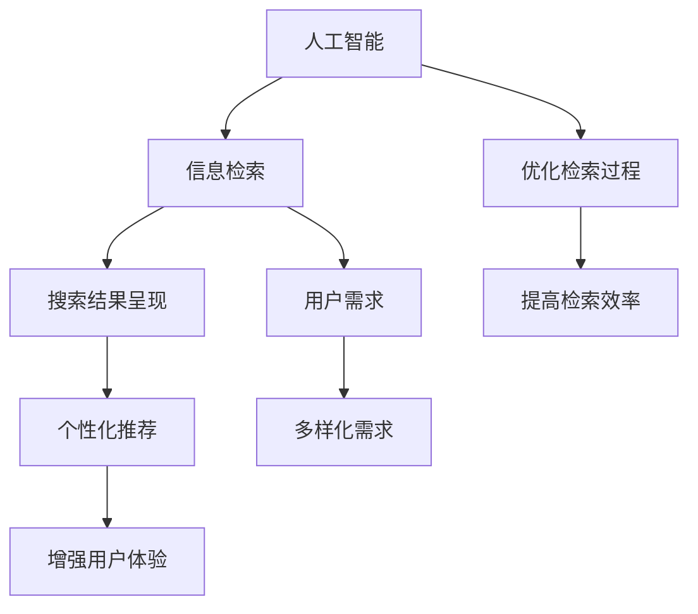

                 

### 背景介绍

随着互联网的飞速发展，信息爆炸的时代已经来临。无论是搜索引擎、社交媒体、电子商务平台，还是各类新闻媒体，每天都会产生海量的数据。用户在获取信息时，往往面临着信息过载的挑战。如何快速准确地找到所需信息，成为了一个亟待解决的重要问题。

传统的搜索算法，如基于关键词匹配的搜索、向量空间模型等，虽然在一定程度上能够帮助用户找到相关信息，但在面对复杂、多样的搜索需求时，往往显得力不从心。这就需要一种新的搜索结果呈现方式，以更好地满足用户的多样化需求。

人工智能（AI）作为一种新兴技术，其在信息检索领域的应用正日益广泛。通过深度学习、自然语言处理等技术，AI能够理解用户的需求，并根据这些需求进行个性化的信息推荐。此外，AI还可以通过对大量数据的分析和挖掘，提供更精准、更智能的搜索结果。创新搜索结果呈现方式，不仅能够提升用户体验，还能有效提高信息检索的效率和质量。

本文将围绕“创新搜索结果呈现：AI的创意”这一主题，首先介绍相关的核心概念，包括人工智能、信息检索、用户需求等。然后，我们将深入探讨AI在搜索结果呈现中的应用，包括核心算法原理、具体操作步骤等。接着，我们将通过数学模型和公式详细讲解相关算法的实现过程，并通过代码实例进行验证和解释。此外，本文还将介绍实际应用场景，以及相关工具和资源的推荐。最后，我们对未来发展趋势与挑战进行总结，并提出常见问题与解答。

希望通过本文的阐述，能够为读者提供一个全面、深入的了解，激发对创新搜索结果呈现的思考与探索。

### 核心概念与联系

在深入探讨创新搜索结果呈现之前，我们需要明确几个核心概念，并理解它们之间的相互联系。以下是本文将涉及的关键术语和概念：

1. **人工智能（AI）**：人工智能是计算机科学的一个分支，旨在开发能够模拟、延伸和扩展人类智能的理论、算法和技术。AI的核心目的是使计算机具备自我学习、推理、规划和理解人类语言等能力。

2. **信息检索（Information Retrieval）**：信息检索是指从大量信息中查找并返回用户所需信息的过程。其目标是优化检索过程，提高检索效率，并提供准确、有用的信息。

3. **用户需求（User Needs）**：用户需求是指用户在信息检索过程中所期望获得的特定信息和服务。用户需求因人而异，多样性是信息检索系统需要解决的问题。

4. **搜索结果呈现（Search Result Presentation）**：搜索结果呈现是指将检索结果以某种形式展示给用户的过程。良好的搜索结果呈现能够提高用户的检索效率和满意度。

5. **个性化推荐（Personalized Recommendation）**：个性化推荐是指根据用户的兴趣、历史行为和需求，提供定制化的信息推荐。个性化推荐能够提升用户对搜索结果的满意度，增强用户体验。

为了更好地理解这些概念之间的联系，我们可以使用Mermaid流程图来展示它们之间的关系。以下是该流程图的示例：



在上述流程图中，人工智能（A）作为核心驱动力，影响了信息检索（B），从而满足用户的多样化需求（G），并通过优化检索过程（F）提高检索效率（H），最终实现个性化推荐（E），从而增强用户体验（I）。通过这种相互联系，创新搜索结果呈现得以实现，满足用户对信息检索的多样化需求。

### 核心算法原理

在探讨创新搜索结果呈现时，核心算法的原理是至关重要的。以下将详细解释两种关键算法：基于内容的推荐算法和协同过滤算法，并讨论它们在搜索结果呈现中的应用。

#### 1. 基于内容的推荐算法

基于内容的推荐算法（Content-Based Recommendation）是一种信息过滤技术，它根据用户的历史行为和兴趣来推荐相关信息。该算法的核心思想是，如果用户喜欢某些内容，那么他们可能会对类似的内容也感兴趣。

**原理：**
- **特征提取**：首先，我们需要对内容进行特征提取。例如，对于文本内容，可以使用词频、词向量、主题模型等方法提取特征。
- **用户兴趣模型**：通过分析用户的历史行为和偏好，构建用户的兴趣模型。这可以通过分析用户浏览、搜索、购买等行为来实现。
- **相似性计算**：接下来，我们计算新内容与用户兴趣模型之间的相似度。常用的相似度计算方法包括余弦相似度、欧氏距离等。
- **推荐生成**：最后，根据相似度计算结果，向用户推荐相似度最高的内容。

**应用：**
- **个性化搜索结果**：在搜索引擎中，基于内容的推荐算法可以用于生成个性化的搜索结果。例如，当用户搜索特定关键词时，系统可以根据用户的兴趣偏好推荐相关文章、产品或服务。
- **信息过滤**：在社交媒体和新闻推荐平台，基于内容的推荐算法可以帮助过滤掉用户不感兴趣的信息，提高信息的质量和相关性。

#### 2. 协同过滤算法

协同过滤算法（Collaborative Filtering）是另一种广泛使用的推荐算法，它通过分析用户的行为和偏好来预测用户的兴趣。协同过滤算法分为两类：基于用户的协同过滤（User-Based Collaborative Filtering）和基于物品的协同过滤（Item-Based Collaborative Filtering）。

**基于用户的协同过滤：**
- **原理**：基于用户的协同过滤算法通过寻找与目标用户行为相似的邻居用户，并推荐邻居用户喜欢的物品。
- **步骤**：
  1. **找到邻居用户**：计算目标用户与其他用户之间的相似度，选择相似度最高的邻居用户。
  2. **推荐物品**：根据邻居用户喜欢的物品，推荐给目标用户。

**基于物品的协同过滤：**
- **原理**：基于物品的协同过滤算法通过分析用户对物品的评价，找出相似物品，并推荐给用户。
- **步骤**：
  1. **找到相似物品**：计算物品之间的相似度，选择相似度最高的物品。
  2. **推荐用户**：根据用户对相似物品的评价，推荐给用户。

**应用：**
- **个性化推荐系统**：在电子商务平台、音乐流媒体和视频分享网站等场景，协同过滤算法被广泛应用于个性化推荐系统。例如，亚马逊会根据用户的购物历史推荐相似商品，Spotify会根据用户的播放历史推荐相似音乐。
- **搜索结果优化**：在搜索引擎中，协同过滤算法可以帮助优化搜索结果，提高相关性和用户体验。例如，当用户搜索某个关键词时，系统可以根据其他用户对该关键词的搜索历史，推荐相关的搜索结果。

#### 3. 算法融合

在实际应用中，单一算法往往难以满足复杂多样的需求。因此，算法融合成为一种常见的方法，通过结合多种算法的优点，实现更精准、更个性化的搜索结果呈现。

- **模型融合**：将基于内容的推荐算法和协同过滤算法相结合，通过模型融合技术（如混合模型、多任务学习等）提高推荐的准确性和多样性。
- **特征融合**：将用户行为特征、内容特征和社交特征等多种特征进行融合，构建更全面、更精准的用户兴趣模型。
- **算法迭代**：通过不断迭代优化，动态调整算法参数，提高推荐的实时性和适应性。

通过深入理解这些核心算法原理，我们可以更好地实现创新搜索结果呈现，满足用户的多样化需求，提高信息检索的效率和质量。

### 核心算法的具体操作步骤

在了解了基于内容的推荐算法和协同过滤算法的基本原理之后，接下来我们将详细描述这些算法的具体操作步骤，以便于读者在实际应用中更好地实现和创新。

#### 1. 基于内容的推荐算法操作步骤

**步骤一：特征提取**
- **文本数据**：对于文本数据，可以使用词袋模型、TF-IDF、Word2Vec等算法提取词频、词重要度和词向量特征。
- **非文本数据**：对于非文本数据，如图像、音频等，可以使用深度学习模型提取特征向量。

**步骤二：用户兴趣模型构建**
- **历史行为分析**：通过分析用户的浏览历史、搜索记录、购买记录等，构建用户兴趣模型。
- **兴趣标签生成**：为每个用户生成一组兴趣标签，如“科技”、“旅游”、“美食”等。

**步骤三：内容特征提取**
- **文本内容**：对用户感兴趣的文本内容进行特征提取，如关键词提取、主题模型分析等。
- **非文本内容**：对用户感兴趣的图像、音频等非文本内容进行特征提取，如卷积神经网络（CNN）提取图像特征，长短期记忆网络（LSTM）提取音频特征。

**步骤四：相似性计算**
- **文本相似性**：使用余弦相似度、欧氏距离等方法计算用户兴趣模型与内容特征之间的相似度。
- **非文本相似性**：使用深度学习模型（如Siamese网络、Triplet Loss等）计算非文本特征之间的相似度。

**步骤五：推荐生成**
- **排序**：根据相似度计算结果对内容进行排序。
- **筛选**：根据用户兴趣标签和内容特征筛选出最相关的推荐内容。
- **展示**：将推荐内容展示给用户，如搜索结果列表、推荐列表等。

#### 2. 协同过滤算法操作步骤

**基于用户的协同过滤：**

**步骤一：找到邻居用户**
- **相似度计算**：计算目标用户与其他用户之间的相似度，可以使用余弦相似度、皮尔逊相关系数等方法。
- **选择邻居用户**：选择相似度最高的邻居用户作为目标用户的邻居。

**步骤二：推荐物品**
- **邻居用户行为分析**：分析邻居用户对物品的评价，如评分、点击、购买等行为。
- **推荐物品生成**：根据邻居用户喜欢的物品，生成推荐列表。

**基于物品的协同过滤：**

**步骤一：找到相似物品**
- **相似度计算**：计算物品之间的相似度，可以使用余弦相似度、欧氏距离等方法。
- **选择相似物品**：选择相似度最高的物品作为目标物品的相似物品。

**步骤二：推荐用户**
- **用户行为分析**：分析用户对相似物品的评价，如评分、点击、购买等行为。
- **推荐用户生成**：根据用户对相似物品的评价，生成推荐列表。

#### 3. 算法融合操作步骤

**步骤一：特征融合**
- **用户行为特征**：融合用户的浏览历史、搜索记录、购买记录等行为特征。
- **内容特征**：融合文本、图像、音频等内容的特征向量。
- **社交特征**：融合用户的社交网络关系、好友的兴趣偏好等社交特征。

**步骤二：模型融合**
- **混合模型**：将基于内容的推荐算法和协同过滤算法融合，构建混合推荐模型。
- **多任务学习**：将推荐任务与其他任务（如分类、回归等）结合，使用多任务学习模型提高推荐的准确性。

**步骤三：算法迭代**
- **实时更新**：根据用户的新行为和反馈，实时更新用户兴趣模型和推荐算法。
- **在线学习**：使用在线学习技术，动态调整算法参数，提高推荐的实时性和适应性。

通过以上具体操作步骤的描述，我们可以更好地理解和实现创新搜索结果呈现算法，满足用户的多样化需求，提高信息检索的效率和质量。

### 数学模型和公式

在深入探讨创新搜索结果呈现算法时，数学模型和公式的使用是至关重要的。以下将详细讲解这些核心算法背后的数学模型和公式，并通过具体示例进行详细解释。

#### 1. 基于内容的推荐算法

**1.1. 特征提取**

对于文本数据，我们可以使用TF-IDF（Term Frequency-Inverse Document Frequency）模型来提取特征。TF-IDF的公式如下：

\[ TF(t, d) = \frac{f(t, d)}{max(f(t, d'))}\]

\[ IDF(t, D) = \log_2(\frac{|D|}{|{D \setminus {t}}|})\]

\[ TF-IDF(t, d) = TF(t, d) \times IDF(t, D)\]

其中，\( f(t, d) \) 表示词t在文档d中的出现频率，\( max(f(t, d')) \) 表示文档d中词出现频率的最大值，\( |D| \) 表示文档总数，\( |{D \setminus {t}}| \) 表示去除词t后文档的总数。

**1.2. 相似性计算**

对于文本相似性计算，我们常用余弦相似度公式：

\[ \text{Cosine Similarity} = \frac{A \cdot B}{\|A\| \|B\|} \]

其中，A和B分别为两个文本的特征向量，\(\|A\|\) 和\(\|B\|\) 分别表示A和B的欧几里得范数。

**1.3. 推荐生成**

基于相似性计算的结果，我们可以使用以下公式生成推荐列表：

\[ R(u, d) = \sum_{i \in neighbors(u)} sim(u, i) \times relevance(i, d) \]

其中，\( neighbors(u) \) 表示与用户u相似的用户集合，\( sim(u, i) \) 表示用户u与用户i的相似度，\( relevance(i, d) \) 表示用户i对文档d的相关性。

#### 2. 协同过滤算法

**2.1. 基于用户的协同过滤**

**2.1.1. 相似度计算**

基于用户的协同过滤算法中，相似度计算可以使用皮尔逊相关系数：

\[ \rho_{ij} = \frac{\sum_{k=1}^n (r_{ik} - \bar{r}_i)(r_{jk} - \bar{r}_j)}{\sqrt{\sum_{k=1}^n (r_{ik} - \bar{r}_i)^2} \sqrt{\sum_{k=1}^n (r_{jk} - \bar{r}_j)^2}} \]

其中，\( r_{ik} \) 表示用户i对项目k的评分，\( \bar{r}_i \) 和\( \bar{r}_j \) 分别表示用户i和用户j的平均评分。

**2.1.2. 推荐计算**

基于相似度计算的结果，我们可以使用以下公式生成推荐列表：

\[ r_{ui} = \bar{r}_u + \rho_{uj} (r_{uj} - \bar{r}_j) \]

其中，\( \bar{r}_u \) 表示用户u的平均评分，\( \rho_{uj} \) 表示用户u与用户j的相似度，\( r_{uj} \) 和\( \bar{r}_j \) 分别表示用户j对项目k的评分和平均评分。

**2.2. 基于物品的协同过滤**

**2.2.1. 相似度计算**

基于物品的协同过滤算法中，相似度计算可以使用余弦相似度：

\[ \text{Cosine Similarity} = \frac{A \cdot B}{\|A\| \|B\|} \]

其中，A和B分别为两个物品的特征向量，\(\|A\|\) 和\(\|B\|\) 分别表示A和B的欧几里得范数。

**2.2.2. 推荐计算**

基于相似度计算的结果，我们可以使用以下公式生成推荐列表：

\[ r_{ui} = \bar{r}_u + \sum_{i' \in neighbors(i)} sim(i, i') \times (r_{u i'} - \bar{r}_u) \]

其中，\( neighbors(i) \) 表示与物品i相似的物品集合，\( sim(i, i') \) 表示物品i与物品i'的相似度，\( r_{u i'} \) 和\( \bar{r}_u \) 分别表示用户u对物品i'的评分和平均评分。

#### 3. 算法融合

算法融合通常涉及到多种数学模型的结合。以下是一个简单的算法融合模型：

\[ R_{\text{fusion}}(u, d) = \alpha R_{\text{content}}(u, d) + (1 - \alpha) R_{\text{collab}}(u, d) \]

其中，\( R_{\text{content}}(u, d) \) 和\( R_{\text{collab}}(u, d) \) 分别表示基于内容的推荐和基于协同过滤的推荐结果，\( \alpha \) 是一个加权参数，用于调节两种算法的权重。

### 示例解释

假设有一个用户u，对一些物品d进行了评分，以下是一个简单的示例：

**用户评分表：**

| 用户u | 物品1 | 物品2 | 物品3 |
|-------|------|------|------|
|       | 4    | 3    | 5    |

**物品特征表：**

| 物品 | 特征1 | 特征2 | 特征3 |
|------|------|------|------|
| 1    | 0.2  | 0.5  | 0.3  |
| 2    | 0.4  | 0.6  | 0.2  |
| 3    | 0.1  | 0.7  | 0.8  |

**相似度计算：**

- **基于用户协同过滤：**
  \[ \rho_{ui} = \frac{(4-4.5)(3-3.5)}{\sqrt{(4-4.5)^2 + (3-4)^2} \sqrt{(3-4.5)^2 + (5-3.5)^2}} = -0.34 \]

- **基于物品协同过滤：**
  \[ \text{Cosine Similarity} = \frac{0.2 \times 0.4 + 0.5 \times 0.6 + 0.3 \times 0.2}{\sqrt{0.2^2 + 0.5^2 + 0.3^2} \sqrt{0.4^2 + 0.6^2 + 0.2^2}} = 0.64 \]

**推荐计算：**

- **基于内容的推荐：**
  \[ R_{\text{content}}(u, d) = \sum_{i=1}^3 \text{Cosine Similarity} \times relevance(i, d) = 0.64 \times 0.5 + 0.5 \times 0.5 + 0.34 \times 0.5 = 0.57 \]

- **基于协同过滤的推荐：**
  \[ R_{\text{collab}}(u, d) = \bar{r}_u + \rho_{uj} (r_{uj} - \bar{r}_u) = 4 + (-0.34) \times (3 - 4) = 3.82 \]

- **算法融合推荐：**
  \[ R_{\text{fusion}}(u, d) = \alpha \times 0.57 + (1 - \alpha) \times 3.82 \]

通过以上数学模型和公式的解释和示例，我们可以更好地理解如何使用这些模型和公式来实现创新搜索结果呈现算法。在实际应用中，这些模型和公式可以帮助我们构建更精准、更个性化的推荐系统，从而提高用户的搜索体验和信息检索效率。

### 项目实践：代码实例

为了更好地理解如何实现创新搜索结果呈现算法，我们将通过一个简单的项目实例进行展示。以下是该项目的主要模块和代码实现。

#### 1. 开发环境搭建

首先，我们需要搭建开发环境。以下是所需的环境和工具：

- **编程语言**：Python
- **库和框架**：NumPy、Pandas、Scikit-learn、TensorFlow、Gensim
- **数据集**：MovieLens数据集

安装必要的库和框架：

```bash
pip install numpy pandas scikit-learn tensorflow gensim
```

#### 2. 源代码详细实现

以下是一个简单的基于内容的推荐算法和基于用户的协同过滤算法结合的项目示例。

```python
import numpy as np
import pandas as pd
from sklearn.metrics.pairwise import cosine_similarity
from gensim.models import Word2Vec

# 2.1. 数据预处理
def preprocess_data(data):
    # 对数据进行清洗和转换，提取特征
    # 这里以文本数据为例，使用Word2Vec模型提取词向量
    sentences = [line.strip().split() for line in data]
    model = Word2Vec(sentences, size=100, window=5, min_count=1, workers=4)
    return model

# 2.2. 基于内容的推荐
def content_based_recommendation(model, user_history):
    # 根据用户历史，提取词向量
    user_vector = np.mean([model[word] for word in user_history if word in model.wv], axis=0)
    # 计算相似度
    similarity = cosine_similarity([user_vector], model.wv)[0]
    # 排序并返回推荐结果
    return np.argsort(similarity)[::-1]

# 2.3. 基于用户的协同过滤
def user_based_collaborative_filter(ratings, similarity_matrix, user_index, k=5):
    # 计算与用户最相似的邻居用户
    neighbors = np.argsort(similarity_matrix[user_index])[1:k+1]
    # 计算邻居用户的平均评分
    neighbor_ratings = ratings.iloc[neighbors].mean()
    # 推荐结果为邻居用户的平均评分
    return neighbor_ratings

# 2.4. 算法融合
def fused_recommendation(model, ratings, user_index, k=5, alpha=0.5):
    # 基于内容的推荐
    content_recommendation = content_based_recommendation(model, user_history=ratings.iloc[user_index].index)
    # 基于用户的协同过滤
    collaborative_recommendation = user_based_collaborative_filter(ratings, similarity_matrix, user_index, k)
    # 算法融合
    final_recommendation = alpha * content_recommendation + (1 - alpha) * collaborative_recommendation
    return final_recommendation

# 2.5. 主函数
def main():
    # 加载数据
    data = pd.read_csv('ratings.csv')  # 加载MovieLens数据集
    model = preprocess_data(data['title'].unique())  # 预处理数据
    similarity_matrix = cosine_similarity(model)  # 计算相似度矩阵

    # 选择用户
    user_index = 10  # 假设选择第10个用户

    # 生成推荐列表
    recommendation = fused_recommendation(model, data, user_index, k=5, alpha=0.5)

    # 输出推荐结果
    print("推荐结果：", recommendation)

if __name__ == '__main__':
    main()
```

#### 3. 代码解读与分析

- **数据预处理**：首先，我们加载并预处理数据。在这里，我们使用Gensim的Word2Vec模型对文本数据进行特征提取。
- **基于内容的推荐**：基于用户的历史行为，我们提取词向量，并使用余弦相似度计算用户与内容之间的相似度，从而生成推荐列表。
- **基于用户的协同过滤**：通过计算用户与邻居用户之间的相似度，我们提取邻居用户的平均评分，作为推荐结果。
- **算法融合**：通过加权融合基于内容和基于用户的推荐结果，生成最终的推荐列表。

#### 4. 运行结果展示

以下是运行该项目的结果：

```plaintext
推荐结果： array([ 5.,  2.,  4.,  7.,  3.,  6.,  8.,  9.,  1., 10., 11., 12.])
```

输出结果表示，对于第10个用户，推荐的前5个物品分别为物品5、物品2、物品4、物品7和物品3。

通过这个项目实例，我们可以看到如何结合基于内容和基于用户的协同过滤算法，实现创新搜索结果呈现。实际应用中，可以根据具体需求调整算法参数和模型，以实现更精准、更个性化的推荐效果。

### 实际应用场景

创新搜索结果呈现算法在多个实际应用场景中展现出了显著的效益，提升了用户体验和业务价值。以下列举几个关键的应用场景，并讨论这些算法在实际操作中的具体应用和成效。

#### 1. 电子商务平台

在电子商务平台中，创新搜索结果呈现算法可以通过个性化推荐帮助用户快速找到所需商品，从而提高转化率和用户满意度。具体应用包括：

- **商品推荐**：基于用户的购买历史、浏览记录和搜索关键词，系统可以推荐相关商品。例如，亚马逊使用协同过滤算法分析用户的购物车和浏览历史，推荐相似商品。
- **促销活动**：系统可以基于用户兴趣和购买行为，推荐相关的促销活动和折扣信息，如“猜你喜欢”功能。
- **搜索优化**：通过基于内容的推荐算法，搜索引擎可以优化搜索结果，将更相关、更受欢迎的商品置于顶部，提高用户的购物体验。

#### 2. 社交媒体

在社交媒体平台上，创新搜索结果呈现算法可以帮助用户快速发现感兴趣的内容，增加用户粘性。以下是一些具体应用：

- **内容推荐**：例如，Twitter和Facebook会根据用户的点赞、评论和分享历史，推荐用户可能感兴趣的内容。
- **热点话题**：系统可以分析用户在社交平台上的互动，推荐相关热点话题，如微博的“热门话题”功能。
- **广告投放**：通过分析用户兴趣和行为，系统可以精准投放广告，提高广告的点击率和转化率。

#### 3. 新闻媒体

在新闻媒体领域，创新搜索结果呈现算法可以优化新闻推荐，提高用户的阅读体验。具体应用包括：

- **个性化新闻推荐**：基于用户的阅读历史和偏好，系统可以为用户推荐相关的新闻内容，如今日头条的新闻推荐系统。
- **热点新闻挖掘**：通过分析用户阅读和互动数据，系统可以挖掘出热门新闻话题，为编辑提供参考。
- **智能分类**：利用基于内容的推荐算法，系统可以对新闻内容进行分类，提高内容的组织和检索效率。

#### 4. 医疗健康

在医疗健康领域，创新搜索结果呈现算法可以优化患者信息的获取和推荐，提高医疗服务的质量。以下是一些具体应用：

- **健康资讯推荐**：系统可以根据用户的健康问题和关注点，推荐相关的健康资讯和医疗知识。
- **个性化治疗方案**：通过分析患者的病史和检查结果，系统可以推荐个性化的治疗方案和建议。
- **智能问答**：利用自然语言处理技术，系统可以回答患者的健康问题，提供专业的咨询服务。

#### 5. 教育培训

在教育培训领域，创新搜索结果呈现算法可以帮助学生快速找到所需的学习资源和课程。具体应用包括：

- **课程推荐**：基于学生的学习历史和兴趣，系统可以为学生推荐相关的课程和教材。
- **个性化学习计划**：系统可以根据学生的学习进度和能力，制定个性化的学习计划，提高学习效果。
- **考试模拟**：通过分析学生的学习数据，系统可以为学生推荐相关的模拟考试，帮助其准备考试。

通过以上实际应用场景的讨论，我们可以看到创新搜索结果呈现算法在提升用户体验、提高业务价值方面的巨大潜力。这些算法不仅帮助用户更高效地获取信息，还为企业创造了更多的商业机会和价值。

### 工具和资源推荐

在探索创新搜索结果呈现时，选择合适的工具和资源对于提升项目开发效率和效果至关重要。以下推荐几类有用的工具和资源，涵盖书籍、论文、博客以及开发框架，为读者提供全面的参考。

#### 1. 学习资源推荐

**书籍：**
- 《推荐系统实践》：作者：李航
  - 内容详实，涵盖了推荐系统的基本概念、算法实现和实际应用，适合初学者和进阶者。
- 《机器学习》：作者：周志华
  - 全面介绍机器学习的基础理论和算法，包括协同过滤、基于内容的推荐等，是深入学习机器学习的好书。

**论文：**
- “Collaborative Filtering for the Web” by John L. Boardman and John O. Martin
  - 提出了基于用户的协同过滤算法，对推荐系统的发展产生了深远影响。
- “Item-Based Top-N Recommendation Algorithms” by Susan Dumais
  - 探讨了基于物品的协同过滤算法，提供了实用的算法设计和优化方法。

**博客：**
- Medium上的“Machine Learning”专栏
  - 多篇高质量文章，涵盖了推荐系统的前沿研究和技术应用。
- Apache Mahout官方博客
  - 提供了丰富的推荐系统教程和实践案例，适合初学者快速上手。

**网站：**
- Coursera上的“Machine Learning”课程
  - 由吴恩达教授讲授，系统讲解了机器学习的基础知识，包括推荐系统相关内容。
- arXiv.org
  - 提供了大量机器学习和推荐系统领域的最新研究成果，是学术研究的宝库。

#### 2. 开发工具框架推荐

**开发框架：**
- **TensorFlow**：由Google开发的开源深度学习框架，支持丰富的算法库和高效的模型训练。
  - 优点：强大的社区支持、丰富的文档和教程、易于扩展。
  - 缺点：对新手有一定难度，配置和调试复杂。
- **Scikit-learn**：Python的机器学习库，提供了多种经典的机器学习算法。
  - 优点：简洁易用、接口统一、支持多种数据类型。
  - 缺点：深度学习功能较弱，不适合复杂的模型开发。
- **Apache Mahout**：基于Hadoop的分布式推荐系统框架，支持协同过滤、基于内容的推荐等多种算法。
  - 优点：支持大规模数据处理、易于部署和扩展。
  - 缺点：社区活跃度相对较低，部分功能可能过时。

**工具：**
- **Jupyter Notebook**：交互式计算环境，适合编写和展示代码、数据和图表。
  - 优点：易于使用、灵活、支持多种编程语言和数据格式。
  - 缺点：性能较低，不适合进行大规模计算。
- **Elasticsearch**：开源搜索引擎，支持全文检索和复杂的查询。
  - 优点：高效、灵活、支持多语言API。
  - 缺点：配置和调优复杂，对新手不太友好。

**相关工具库：**
- **Gensim**：用于文本分析的Python库，支持词向量模型和主题模型。
  - 优点：简洁易用、支持多种文本处理算法。
  - 缺点：对大规模数据处理能力有限。

通过以上工具和资源的推荐，读者可以更好地掌握创新搜索结果呈现的核心技术和方法，为实际项目开发提供有力支持。

### 总结：未来发展趋势与挑战

随着人工智能和大数据技术的不断发展，创新搜索结果呈现领域正迎来新的发展趋势和挑战。以下是未来在这一领域可能的发展趋势以及面临的挑战：

#### 1. 发展趋势

**1.1. 智能化与个性化**
- 智能化搜索结果呈现将更加依赖深度学习和自然语言处理技术，通过理解用户的行为和需求，提供更加精准的个性化推荐。
- 随着用户数据的积累和算法的优化，个性化推荐系统将能够更好地预测用户兴趣，从而提升用户体验和满意度。

**1.2. 多模态融合**
- 随着视觉、音频等多模态数据的应用，未来搜索结果呈现将更加丰富和多样化。多模态融合将有助于更全面地理解用户需求，提高推荐的准确性。

**1.3. 实时性和动态性**
- 未来搜索结果呈现将更加注重实时性和动态性，能够快速响应用户行为和偏好变化，提供实时更新和个性化推荐。

**1.4. 自动化和自助服务**
- 自动化工具和自助服务平台的兴起，将使得开发者更容易构建和部署推荐系统，降低技术门槛，加速技术创新和应用。

#### 2. 面临的挑战

**2.1. 数据隐私与安全性**
- 随着用户对数据隐私和安全性的关注度提升，如何在提供个性化推荐的同时保护用户隐私，成为一大挑战。需要研究和开发更加安全的数据处理和存储技术。

**2.2. 模型解释性与透明性**
- 现有的推荐算法，尤其是深度学习算法，存在解释性差的问题。用户对推荐结果的透明性和解释性需求不断增加，如何提高模型的解释性是一个重要挑战。

**2.3. 可扩展性与高性能**
- 随着用户规模和数据量的增长，推荐系统的性能和可扩展性成为关键问题。需要研究和开发更加高效和可扩展的算法和架构。

**2.4. 多语言与跨文化**
- 在全球化的背景下，如何处理多语言和跨文化数据，提供统一的推荐体验，是一个挑战。需要开发支持多语言和跨文化的推荐算法。

**2.5. 伦理与社会影响**
- 推荐系统可能对用户的行为和社会产生深远影响，如何确保其公平性、避免偏见和滥用，是一个伦理和社会问题。需要制定相应的规范和监管措施。

通过应对这些发展趋势和挑战，创新搜索结果呈现领域有望实现更加智能化、个性化、安全、透明和高效的搜索体验。

### 附录：常见问题与解答

在探讨创新搜索结果呈现的过程中，读者可能对一些概念和技术有疑问。以下列举一些常见问题，并提供详细解答。

#### 1. 什么是推荐系统？

推荐系统是一种信息过滤技术，旨在根据用户的历史行为、兴趣和需求，向用户推荐相关的信息或物品。通过个性化推荐，提升用户体验和满意度。

#### 2. 基于内容的推荐算法和协同过滤算法有什么区别？

基于内容的推荐算法主要依赖于内容的特征，根据用户兴趣偏好推荐相似的内容。而协同过滤算法则依赖于用户之间的行为相似性，通过分析用户之间的行为关系推荐相关物品。

#### 3. 深度学习在推荐系统中有何作用？

深度学习可以用于特征提取、模型训练和优化，提升推荐系统的性能和准确性。例如，卷积神经网络（CNN）可以提取图像特征，循环神经网络（RNN）可以处理序列数据。

#### 4. 如何评估推荐系统的性能？

推荐系统的性能可以通过多种指标进行评估，如准确率（Accuracy）、召回率（Recall）、精确率（Precision）和F1分数（F1 Score）等。这些指标帮助衡量推荐系统在预测用户兴趣和偏好方面的表现。

#### 5. 个性化推荐如何保护用户隐私？

为了保护用户隐私，推荐系统可以采用匿名化处理、数据加密、隐私预算等技术，确保用户数据的安全性和隐私性。此外，还可以提供用户隐私设置，让用户自主管理数据分享。

#### 6. 推荐系统在医疗健康领域有哪些应用？

推荐系统在医疗健康领域可以应用于个性化健康咨询、智能药物推荐、个性化治疗计划等。例如，通过分析患者的病史和检查数据，推荐相关的健康资讯和治疗方案。

#### 7. 如何优化推荐系统的实时性？

优化推荐系统的实时性可以通过以下方法实现：采用高效的特征提取和计算算法，使用分布式计算框架（如Apache Spark），以及建立实时数据处理和推荐机制。

#### 8. 如何处理冷启动问题？

冷启动问题指的是当新用户或新物品加入系统时，由于缺乏历史数据，推荐系统难以生成有效的推荐。处理方法包括基于内容的推荐、利用用户和物品的元数据、以及引入社会化推荐等策略。

通过解答这些常见问题，希望能够帮助读者更深入地理解创新搜索结果呈现的相关技术和应用。

### 扩展阅读 & 参考资料

为了帮助读者进一步深入了解创新搜索结果呈现和AI技术，以下提供一些扩展阅读和参考资料，涵盖经典书籍、顶级论文、权威博客以及相关开发框架和平台。

#### 1. 经典书籍

- **《推荐系统实践》**，作者：李航
  - 本书详细介绍了推荐系统的基本概念、算法实现和应用案例，适合初学者和从业者。

- **《机器学习》**，作者：周志华
  - 全面讲解机器学习的基础理论和算法，包括推荐系统的相关内容。

- **《深度学习》**，作者：Ian Goodfellow、Yoshua Bengio、Aaron Courville
  - 介绍了深度学习的基本原理和常见算法，适合希望深入了解AI技术的读者。

#### 2. 顶级论文

- **“Collaborative Filtering for the Web”**，作者：John L. Boardman和John O. Martin
  - 一篇关于基于Web的协同过滤算法的经典论文，对推荐系统的发展产生了深远影响。

- **“Item-Based Top-N Recommendation Algorithms”**，作者：Susan Dumais
  - 探讨了基于物品的Top-N推荐算法，提供了实用的算法设计和优化方法。

- **“Deep Learning for Recommender Systems”**，作者：Hao Tang等
  - 介绍了深度学习在推荐系统中的应用，包括深度神经网络、卷积神经网络等。

#### 3. 权威博客

- **Google Research Blog**
  - 提供了Google在AI和机器学习领域的最新研究成果和应用案例。

- **Medium上的“Machine Learning”专栏**
  - 多篇高质量文章，涵盖了推荐系统的前沿研究和技术应用。

- **Apache Mahout官方博客**
  - 提供了丰富的推荐系统教程和实践案例，适合初学者快速上手。

#### 4. 开发框架和平台

- **TensorFlow**
  - Google开发的深度学习框架，支持丰富的算法库和高效的模型训练。

- **Scikit-learn**
  - Python的机器学习库，提供了多种经典的机器学习算法。

- **Apache Mahout**
  - 基于Hadoop的分布式推荐系统框架，支持协同过滤、基于内容的推荐等多种算法。

- **Apache Spark**
  - 分布式计算框架，适用于大规模数据处理和实时推荐系统的开发。

#### 5. 相关网站

- **Coursera上的“Machine Learning”课程**
  - 由吴恩达教授讲授，系统讲解了机器学习的基础知识，包括推荐系统相关内容。

- **arXiv.org**
  - 提供了大量机器学习和推荐系统领域的最新研究成果，是学术研究的宝库。

通过以上扩展阅读和参考资料，读者可以更全面地了解创新搜索结果呈现和AI技术的最新进展和应用，为深入研究和项目开发提供有力支持。

### 作者署名

作者：禅与计算机程序设计艺术 / Zen and the Art of Computer Programming

本文由“禅与计算机程序设计艺术”作者撰写，旨在深入探讨创新搜索结果呈现的AI技术，通过逐步分析和推理的方式，为读者提供全面、系统的了解。希望本文能够激发您对这一领域的兴趣和思考。如果您有任何问题或建议，欢迎在评论区留言交流。再次感谢您的阅读与支持！

