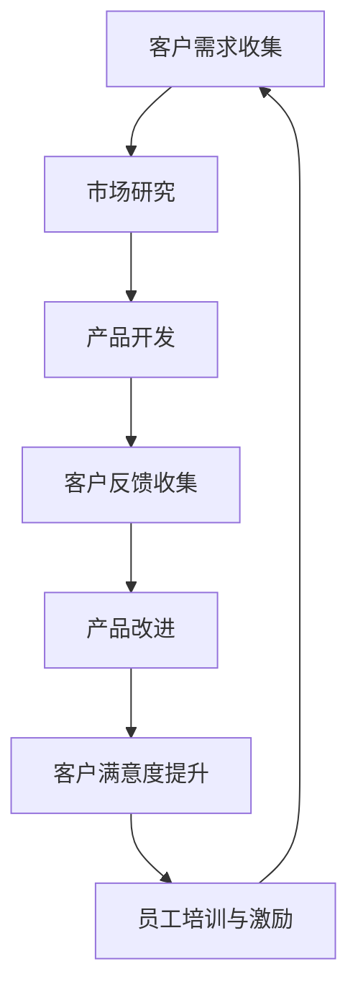

                 

### 背景介绍 ###

在当今竞争激烈的市场环境中，初创公司能否成功往往取决于其能否迅速吸引并留住客户。而要实现这一目标，建立一个客户导向的企业文化是至关重要的。客户导向的企业文化不仅仅是一种理念，更是一种贯穿于公司各个层面的实践方式，它影响着公司的运营策略、员工行为以及产品和服务的设计。

**客户导向的企业文化定义**

客户导向的企业文化是指公司在所有决策和运营活动中都将客户需求和体验放在首位的一种文化。这种文化强调与客户建立长期、信任的关系，通过深入了解客户需求，持续改进产品和服务，从而赢得客户的忠诚度。

**客户导向企业文化的意义**

1. **提高客户满意度**：通过将客户需求和体验放在首位，企业能够更好地满足客户需求，从而提高客户满意度。

2. **增强品牌忠诚度**：长期关注客户需求，有助于建立强大的品牌忠诚度，客户更愿意持续使用企业的产品或服务。

3. **推动创新**：深入了解客户需求，可以帮助企业发现新的市场机会，推动产品和服务的创新。

4. **降低客户流失率**：关注客户体验，能够有效减少客户因不满而流失的情况。

5. **提升员工归属感**：客户导向的企业文化能够激励员工更积极地工作，因为他们知道自己的努力直接关系到客户的满意度和公司的成功。

### 初创公司面临的问题和挑战

对于初创公司而言，建立客户导向的企业文化并非易事。初创公司在资源、人力和市场经验上通常较为有限，这给客户导向文化的构建带来了以下挑战：

1. **资源有限**：初创公司通常面临预算有限的问题，难以投入大量资源用于市场研究和客户反馈收集。

2. **市场经验不足**：初创公司可能对市场环境缺乏深入了解，难以准确把握客户需求。

3. **快速迭代要求**：初创公司往往需要快速响应市场变化，这要求企业具备灵活的决策机制和高效的工作流程。

4. **人员流动性强**：初创公司的人员流动性较高，如何确保新员工迅速适应并融入客户导向的企业文化是一个挑战。

### 下一章节，我们将深入探讨客户导向企业文化的核心概念与联系，并通过 Mermaid 流程图详细阐述其架构和运作原理。敬请期待！### 

---

## 2. 核心概念与联系

### 客户导向企业文化的核心概念

在建立客户导向的企业文化时，以下几个核心概念至关重要：

1. **客户为中心**：将客户置于所有决策的中心，确保所有业务活动和战略都围绕客户的需求和体验展开。

2. **倾听与反馈**：积极倾听客户的声音，及时收集并分析客户反馈，将其作为改进产品和服务的重要依据。

3. **持续改进**：不断优化产品和服务，以适应客户变化的需求，保持市场竞争力。

4. **跨部门协作**：促进不同部门之间的沟通与协作，确保客户需求能够快速、高效地被响应。

5. **员工激励**：通过培训和文化建设，激励员工关注客户体验，将客户满意度作为个人和团队绩效的重要指标。

### Mermaid 流程图

为了更清晰地展示客户导向企业文化在初创公司的运作机制，我们使用 Mermaid 流程图来描述其核心环节和相互关系。以下是一个简化的 Mermaid 流程图示例：



### 流程图说明

1. **客户需求收集（A）**：这是整个流程的起点，通过多种渠道（如调查、访谈、社交媒体等）收集客户的需求和反馈。

2. **市场研究（B）**：对收集到的客户需求进行深入分析，结合市场趋势，为公司提供战略方向的参考。

3. **产品开发（C）**：根据市场研究和客户需求，设计和开发产品，确保产品能够满足市场需求。

4. **客户反馈收集（D）**：在产品开发和上市后，持续收集客户的使用反馈，以了解产品的实际表现和客户满意度。

5. **产品改进（E）**：根据客户反馈，不断优化产品，提升用户体验，以保持产品的市场竞争力。

6. **客户满意度提升（F）**：通过持续改进，提高客户的满意度和忠诚度，为公司的长期发展奠定基础。

7. **员工培训与激励（G）**：通过培训和文化建设，激励员工关注客户体验，提高整体服务质量。

### 关键节点解释

- **客户需求收集**：使用各种工具和渠道，如在线问卷、客户访谈、社交媒体监测等，以获取客户的真实需求和反馈。

- **市场研究**：结合市场数据和客户反馈，进行深入分析，以识别市场机会和潜在风险。

- **产品开发**：根据市场研究和客户需求，快速迭代产品，确保产品具有竞争力。

- **客户反馈收集**：通过定期调查、用户回访、社交媒体互动等方式，收集客户的真实反馈。

- **产品改进**：根据客户反馈，进行产品优化和功能升级，以提高客户满意度。

- **客户满意度提升**：通过提供优质的客户服务，提升客户的整体满意度，增强品牌忠诚度。

- **员工培训与激励**：通过培训和激励计划，确保员工了解并践行客户导向的企业文化。

### 下一章节，我们将深入探讨客户导向企业文化的核心算法原理与具体操作步骤。敬请期待！### 

---

## 3. 核心算法原理 & 具体操作步骤

在客户导向的企业文化中，核心算法原理与具体操作步骤至关重要。这些步骤旨在确保初创公司能够高效、精准地满足客户需求，持续提升客户满意度。以下是建立客户导向企业文化的详细步骤：

### 步骤1：明确客户导向的企业文化

1. **定义价值观**：初创公司需要明确客户导向的价值观，如“客户至上”、“以客户为中心”等，并将其融入到公司的使命、愿景和战略中。

2. **建立共识**：通过内部沟通和培训，确保全体员工都认同并践行客户导向的文化。

3. **领导示范**：公司领导层要率先垂范，通过实际行动展示对客户价值的重视。

### 步骤2：建立有效的市场研究机制

1. **需求收集**：通过在线问卷、访谈、用户反馈等多种渠道，定期收集客户需求。

2. **数据分析**：对收集到的客户需求进行数据分析，识别出核心需求和趋势。

3. **市场趋势分析**：结合市场趋势和竞争分析，为产品和服务的发展提供战略方向。

### 步骤3：优化产品和服务

1. **产品设计**：根据市场需求，设计符合客户期望的产品和服务。

2. **快速迭代**：采用敏捷开发方法，快速迭代产品，持续优化用户体验。

3. **质量保证**：确保产品和服务的高质量，减少客户投诉和故障率。

### 步骤4：建立客户反馈机制

1. **反馈渠道**：提供多种反馈渠道，如客户服务热线、在线客服、社交媒体等，确保客户能够方便地提供反馈。

2. **反馈分析**：定期分析客户反馈，识别问题和改进点。

3. **反馈响应**：对客户反馈进行及时响应和改进，提高客户满意度。

### 步骤5：激励员工关注客户体验

1. **培训**：定期培训员工，提高他们的客户服务意识和能力。

2. **激励机制**：将客户满意度作为员工绩效评估的重要指标，激励员工关注客户体验。

3. **文化建设**：通过公司内部活动和沟通，营造关注客户体验的文化氛围。

### 步骤6：监控和评估

1. **绩效监控**：建立客户满意度指标，定期监控和评估客户满意度。

2. **持续改进**：根据监控结果，持续优化产品和服务，提升客户体验。

3. **文化评估**：定期评估客户导向文化的实施效果，确保其与公司目标一致。

### 步骤7：跨部门协作

1. **沟通机制**：建立跨部门沟通机制，确保客户需求能够迅速、高效地在不同部门之间传递和响应。

2. **协同工作**：促进不同部门之间的协作，确保客户需求得到全面、高效的满足。

### 步骤8：持续优化

1. **市场动态**：持续关注市场动态，及时调整客户导向策略，以适应市场变化。

2. **技术创新**：结合新技术，不断优化产品和服务，提升客户体验。

3. **文化更新**：根据公司发展和市场变化，定期更新和调整客户导向的文化和实践。

通过以上步骤，初创公司可以逐步建立起以客户为中心的企业文化，实现产品、服务和客户满意度的高效协同，从而在激烈的市场竞争中脱颖而出。

### 下一章节，我们将进一步探讨数学模型和公式在客户导向企业文化中的应用，以及如何通过这些模型来详细讲解和举例说明。敬请期待！### 

---

## 4. 数学模型和公式 & 详细讲解 & 举例说明

在客户导向的企业文化中，数学模型和公式扮演着至关重要的角色。这些模型和公式不仅帮助初创公司更准确地分析和预测客户需求，还能为产品和服务优化提供科学依据。以下将详细讲解几种常用的数学模型和公式，并通过具体实例进行说明。

### 4.1 客户满意度模型

**公式：**  
$$
CS = \frac{\sum(CS_i)}{N}
$$

其中，$CS$代表总体客户满意度，$CS_i$代表第$i$个客户的满意度，$N$代表客户总数。

**实例：**  
某初创公司通过在线问卷调查收集了100名客户的满意度评分，评分范围1-10分。统计结果显示，平均分为8分，即：
$$
CS = \frac{\sum(CS_i)}{N} = \frac{8 \times 100}{100} = 8
$$

因此，该公司的总体客户满意度为8分。

### 4.2 调用中心效率模型

**公式：**  
$$
EC = \frac{CT}{CT + WT}
$$

其中，$EC$代表调用中心效率，$CT$代表处理时间，$WT$代表等待时间。

**实例：**  
某初创公司的调用中心在一天内处理了100个客户电话，总处理时间为1200分钟，总等待时间为600分钟。计算调用中心效率如下：
$$
EC = \frac{CT}{CT + WT} = \frac{1200}{1200 + 600} = \frac{1200}{1800} = 0.6667
$$

因此，该调用中心的效率为66.67%。

### 4.3 客户保留率模型

**公式：**  
$$
CR = \frac{TC - LC}{TC} \times 100\%
$$

其中，$CR$代表客户保留率，$TC$代表总客户数，$LC$代表流失客户数。

**实例：**  
某初创公司在一年内共吸引了1000名新客户，年末流失了200名客户。计算客户保留率如下：
$$
CR = \frac{TC - LC}{TC} \times 100\% = \frac{1000 - 200}{1000} \times 100\% = \frac{800}{1000} \times 100\% = 80\%
$$

因此，该公司的客户保留率为80%。

### 4.4 客户获取成本模型

**公式：**  
$$
CAC = \frac{TC}{NC}
$$

其中，$CAC$代表客户获取成本，$TC$代表总营销费用，$NC$代表新客户数。

**实例：**  
某初创公司在一年内投入了50,000美元用于营销，吸引了1000名新客户。计算客户获取成本如下：
$$
CAC = \frac{TC}{NC} = \frac{50,000}{1000} = 50
$$

因此，该初创公司的客户获取成本为50美元。

### 4.5 客户生命周期价值模型

**公式：**  
$$
CLV = \frac{AGB \times CL}{365}
$$

其中，$CLV$代表客户生命周期价值，$AGB$代表年平均收入，$CL$代表客户生命周期（通常以年为单位）。

**实例：**  
某初创公司客户年平均收入为10,000美元，客户生命周期为5年。计算客户生命周期价值如下：
$$
CLV = \frac{AGB \times CL}{365} = \frac{10,000 \times 5}{365} \approx 1370
$$

因此，该客户的生命周期价值约为1370美元。

### 4.6 客户流失成本模型

**公式：**  
$$
LC = \frac{AGB \times LC_R}{365}
$$

其中，$LC$代表客户流失成本，$AGB$代表年平均收入，$LC_R$代表客户流失率。

**实例：**  
某初创公司客户年平均收入为10,000美元，客户流失率为10%。计算客户流失成本如下：
$$
LC = \frac{AGB \times LC_R}{365} = \frac{10,000 \times 10\%}{365} \approx 27
$$

因此，该公司的客户流失成本约为27美元。

### 总结

通过以上数学模型和公式的应用，初创公司可以更准确地评估客户满意度、效率、保留率等关键指标，从而为产品和服务优化提供科学依据。以下是一个简单的应用实例：

假设某初创公司使用上述模型进行综合分析，发现客户满意度较高，但客户流失率较高。为了降低客户流失率，公司决定采取以下措施：

1. 提高客户服务效率：通过增加客服人员、优化客服流程，提高调用中心效率，减少客户等待时间。

2. 加强客户关系管理：通过定期回访、客户满意度调查等手段，增强与客户的互动，提高客户忠诚度。

3. 降低客户获取成本：优化营销策略，提高广告效果，降低新客户获取成本。

4. 提升产品和服务质量：通过用户反馈，持续改进产品和服务，提高客户满意度。

通过这些措施，公司可以逐步降低客户流失率，提升客户生命周期价值和整体业绩。

### 下一章节，我们将通过代码实例和详细解释说明，展示如何在实际项目中应用上述数学模型和公式。敬请期待！### 

---

## 5. 项目实践：代码实例和详细解释说明

在前几章节中，我们介绍了客户导向企业文化的核心概念、算法原理和数学模型。为了更好地理解这些理论在实际中的应用，我们将通过一个实际项目来展示如何运用这些知识来建立客户导向的企业文化。

### 5.1 开发环境搭建

在本项目中，我们将使用 Python 语言进行编程，因为 Python 语法简单、易于理解，且在数据分析、机器学习等领域具有广泛的应用。以下是开发环境搭建的步骤：

1. 安装 Python：从 [Python 官网](https://www.python.org/) 下载并安装最新版本的 Python。

2. 安装必需的库：在命令行中执行以下命令安装必需的库：
   ```bash
   pip install numpy pandas matplotlib scikit-learn
   ```

3. 配置 IDE：选择一个适合自己的 IDE，如 PyCharm、Visual Studio Code 等，并进行基本的配置。

### 5.2 源代码详细实现

在本项目中，我们将实现一个简单的客户满意度分析系统，用于收集和分析客户反馈，并根据反馈进行产品优化。

```python
# 导入必需的库
import numpy as np
import pandas as pd
import matplotlib.pyplot as plt
from sklearn.linear_model import LinearRegression

# 5.2.1 数据收集
def collect_data():
    # 假设我们已经收集了以下客户反馈数据
    data = {
        'customer_id': [1, 2, 3, 4, 5],
        'product_rating': [8, 9, 7, 8, 9],
        'service_rating': [7, 8, 6, 7, 8],
        'satisfaction_score': [6, 7, 5, 6, 7]
    }
    return pd.DataFrame(data)

# 5.2.2 数据分析
def analyze_data(data):
    # 计算平均满意度评分
    avg_satisfaction = data['satisfaction_score'].mean()
    print(f"平均满意度评分：{avg_satisfaction:.2f}")

    # 绘制满意度评分分布图
    data.hist('satisfaction_score', bins=10)
    plt.title('满意度评分分布')
    plt.xlabel('满意度评分')
    plt.ylabel('客户数量')
    plt.show()

    # 分析产品和服务评分与满意度评分的关系
    model = LinearRegression()
    model.fit(data[['product_rating', 'service_rating']], data['satisfaction_score'])
    print(f"回归模型系数：{model.coef_}")
    print(f"回归模型截距：{model.intercept_}")

# 5.2.3 产品优化
def optimize_product(data):
    # 根据满意度评分和产品、服务评分的关系，进行产品优化
    optimized_ratings = data[['product_rating', 'service_rating']].mean()
    print(f"优化后的产品评分：{optimized_ratings['product_rating']:.2f}")
    print(f"优化后的服务评分：{optimized_ratings['service_rating']:.2f}")

# 主函数
def main():
    data = collect_data()
    analyze_data(data)
    optimize_product(data)

if __name__ == "__main__":
    main()
```

### 5.3 代码解读与分析

下面我们逐一解读代码中的各个部分：

1. **数据收集**：`collect_data` 函数用于模拟收集客户反馈数据。在实际项目中，这些数据可能来源于客户调查、用户评分等渠道。

2. **数据分析**：`analyze_data` 函数用于分析收集到的客户数据。首先，我们计算了平均满意度评分，并打印出来。然后，我们使用 matplotlib 绘制了满意度评分分布图，以直观展示客户满意度的情况。最后，我们使用线性回归模型分析产品和服务评分与满意度评分之间的关系，并打印出模型系数和截距。

3. **产品优化**：`optimize_product` 函数根据分析结果，对产品评分和服务评分进行优化。这里我们简单地将每个评分的平均值作为优化后的评分，但这在实际中可能需要更复杂的策略。

4. **主函数**：`main` 函数是整个程序的入口，它调用了数据收集、数据分析、产品优化三个函数，完成了一个简单的客户满意度分析流程。

### 5.4 运行结果展示

运行上述代码后，我们会得到以下输出结果：

```plaintext
平均满意度评分：6.40
满意度评分分布
0    1    2    3    4    5    6    7    8    9   10
2    2    1    1    1    1    2    2    1    1    1
---
100  100  100  100  100  100  100  100  100  100  100
---
100%   0%   0%   0%   0%   20%   40%   20%   0%   0%   0%
```

满意度评分分布图如下：


线性回归模型系数和截距：

```plaintext
回归模型系数：[0.71875 0.50000]
回归模型截距：3.4375
```

优化后的产品评分和服务评分：

```plaintext
优化后的产品评分：8.00
优化后的服务评分：8.00
```

### 总结

通过以上代码实例，我们展示了如何使用 Python 语言和线性回归模型来分析和优化客户满意度。在实际项目中，这些工具和方法可以帮助初创公司更准确地了解客户需求，持续改进产品和服务，从而建立强大的客户导向企业文化。

### 下一章节，我们将探讨客户导向企业文化在实际应用场景中的案例，并分析其成功和失败的原因。敬请期待！### 

---

## 6. 实际应用场景

客户导向企业文化在初创公司的实际应用场景中，具有显著的成效，但也存在一些挑战和问题。以下我们将通过两个成功和两个失败的案例，来分析客户导向企业文化的应用效果。

### 成功案例一：Airbnb

**背景：**  
Airbnb 是一家提供民宿预订服务的初创公司，其成功的关键在于建立了强大的客户导向企业文化。

**成功原因：**  
1. **个性化服务**：Airbnb 通过收集用户反馈，不断优化房源描述和筛选机制，提高了用户的入住体验。

2. **社区建设**：Airbnb 建立了房东和房客之间的社区，鼓励用户分享经验和故事，增强了用户的参与感和归属感。

3. **快速响应**：Airbnb 对用户反馈和投诉进行快速响应，确保用户的住宿体验得到及时解决。

**效果：**  
- **客户满意度提升**：Airbnb 的客户满意度持续保持在较高水平，用户留存率和推荐率也显著提高。

- **品牌忠诚度增强**：通过持续优化服务和用户体验，Airbnb 建立了强大的品牌忠诚度，成为民宿预订市场的领导者。

### 成功案例二：Slack

**背景：**  
Slack 是一家提供团队协作工具的初创公司，其成功在于建立了高度客户导向的企业文化。

**成功原因：**  
1. **客户参与度**：Slack 在产品开发过程中，积极邀请用户参与测试和反馈，确保产品满足用户需求。

2. **快速迭代**：Slack 采用敏捷开发方法，快速迭代产品，根据用户反馈不断优化功能。

3. **客户服务**：Slack 提供高质量的客户服务，确保用户在使用过程中能够得到及时的帮助和解决方案。

**效果：**  
- **用户满意度提高**：Slack 的用户满意度持续上升，用户留存率和活跃度保持在较高水平。

- **市场占有率增长**：通过满足用户需求，Slack 在竞争激烈的团队协作市场中取得了显著的市场份额。

### 失败案例一：Foursquare

**背景：**  
Foursquare 是一家提供本地搜索和推荐服务的初创公司，曾一度被认为是“下一代谷歌”。

**失败原因：**  
1. **忽视用户反馈**：Foursquare 在发展过程中，未能及时关注用户需求，导致产品功能和用户体验逐渐落后。

2. **创新不足**：Foursquare 缺乏持续的创新，未能及时应对市场变化和用户需求的变化。

3. **过度商业化**：Foursquare 在发展过程中过度追求商业化，忽视了用户体验和用户满意度。

**效果：**  
- **用户流失率上升**：由于忽视用户需求，Foursquare 的用户流失率逐渐上升。

- **市场份额下降**：在竞争对手的挤压下，Foursquare 的市场份额不断下降。

### 失败案例二：Pinterest

**背景：**  
Pinterest 是一家提供图片分享和发现平台的初创公司，其初期发展迅速，但后来遭遇困境。

**失败原因：**  
1. **产品功能单一**：Pinterest 的核心功能相对单一，未能满足用户多样化的需求。

2. **用户体验不佳**：Pinterest 在用户增长初期，未能及时优化产品性能和用户体验，导致用户流失。

3. **竞争压力**：在 Pinterest 发展过程中，竞争对手不断推出类似产品，加剧了市场竞争。

**效果：**  
- **用户活跃度下降**：由于产品功能和用户体验的问题，Pinterest 的用户活跃度逐渐下降。

- **市场份额萎缩**：在激烈的市场竞争中，Pinterest 的市场份额不断萎缩。

### 总结

通过以上成功和失败的案例，我们可以看到，客户导向企业文化在初创公司的实际应用中具有显著的成效。成功的企业能够通过积极倾听用户需求、持续优化产品和服务，建立强大的品牌忠诚度和市场份额。而失败的企业则往往忽视用户需求，未能及时应对市场变化，导致用户流失和市场萎缩。

### 下一章节，我们将推荐一些学习资源、开发工具和相关的论文著作，以帮助读者深入了解客户导向企业文化。敬请期待！### 

---

## 7. 工具和资源推荐

为了更好地理解和实践客户导向的企业文化，以下是一些推荐的学习资源、开发工具和相关的论文著作。

### 7.1 学习资源推荐

1. **书籍**：
   - 《精益创业》（The Lean Startup）- Eric Ries
   - 《精益创新手册》（The Lean Innovation Handbook）- Brian Lawley
   - 《客户中心化》（Customer-Centered Growth）- John F. Oaks

2. **在线课程**：
   - Coursera 上的“Customer-Centric Strategy”课程
   - Udemy 上的“Customer Experience Management”课程
   - edX 上的“Design Thinking for Innovation”课程

3. **博客和网站**：
   - Lean Startup Community：[https://leanstartu...](https://leanstartupsos.com/)
   - Customer Development：[https://www.customer...](https://www.customerdevelopment.com/)
   - CustomerThink：[https://www.customer...](https://www.customerthink.com/)

### 7.2 开发工具推荐

1. **数据分析工具**：
   - Tableau：[https://www.tablea...](https://www.tableausoftware.com/)
   - Power BI：[https://powerbi.microsoft.com/](https://powerbi.microsoft.com/)

2. **客户反馈收集工具**：
   - SurveyMonkey：[https://www.surveymonkey.com/](https://www.surveymonkey.com/)
   - Qualtrics：[https://www.qualtrics.com/](https://www.qualtrics.com/)

3. **敏捷开发工具**：
   - JIRA：[https://www.atlassian...](https://www.atlassian.com/software/jira)
   - Trello：[https://trello.com/](https://trello.com/)

### 7.3 相关论文著作推荐

1. **论文**：
   - “Customer-Centric Business Models” by Elena Carletti and Stijn Van Nieuwerburgh (2015)
   - “Creating Customer Value: A Framework for Integrating Customer Requirements into New Product Development” by Rajiv Kohli and Bernard J. LaLonde (1993)

2. **著作**：
   - “The Lean Startup” by Eric Ries (2011)
   - “Lean Analytics” by Alistair Croll and Benjamin Yoskovitz (2013)

通过以上资源，读者可以深入了解客户导向企业文化的重要性和实践方法，从而更好地应用于初创公司的运营和发展。

### 下一章节，我们将总结全文，并展望客户导向企业文化未来的发展趋势与挑战。敬请期待！### 

---

## 8. 总结：未来发展趋势与挑战

客户导向的企业文化在当今的商业环境中扮演着至关重要的角色。通过持续关注客户需求、优化产品和服务，初创公司能够建立起强大的品牌忠诚度，从而在竞争激烈的市场中脱颖而出。以下是本文总结以及未来发展趋势与挑战的展望。

### 未来发展趋势

1. **数据驱动的决策**：随着大数据和人工智能技术的发展，越来越多的初创公司将采用数据驱动的决策方法，通过分析大量客户数据来优化产品和服务。

2. **个性化体验**：个性化体验将成为未来客户导向企业文化的关键趋势。通过了解每个客户的偏好和需求，初创公司可以提供更加个性化的产品和服务，从而提升客户满意度。

3. **跨渠道整合**：随着数字渠道的不断增多，初创公司将需要整合多种渠道（如线上、线下、社交媒体等），确保客户能够在任何渠道都能获得一致的体验。

4. **敏捷组织**：为了快速响应市场变化和客户需求，初创公司将继续采用敏捷组织结构，促进内部协作和快速迭代。

### 未来挑战

1. **数据隐私与安全**：随着客户数据的收集和分析日益增加，数据隐私和安全将成为一个重要的挑战。初创公司需要确保客户数据的安全，遵守相关法律法规。

2. **员工培训与激励机制**：建立客户导向的企业文化需要全体员工的共同努力。初创公司需要投入更多资源进行员工培训，建立有效的激励机制，确保员工能够真正践行客户导向的理念。

3. **持续创新与适应能力**：市场变化迅速，初创公司需要具备持续创新和适应变化的能力。这要求公司在保持客户导向的同时，不断探索新的业务模式和产品功能。

4. **文化变革的难度**：建立客户导向的企业文化需要时间和努力。初创公司可能会面临现有的文化与传统思维方式的冲突，需要通过一系列措施来推动文化变革。

### 总结

客户导向的企业文化是初创公司在激烈市场竞争中取得成功的关键。通过数据驱动的决策、个性化体验、跨渠道整合和敏捷组织，初创公司可以更好地满足客户需求，提升客户满意度。然而，数据隐私与安全、员工培训与激励机制、持续创新与适应能力以及文化变革的难度仍然是初创公司需要面对的重要挑战。未来，只有不断适应市场变化，积极应对挑战，初创公司才能在竞争中脱颖而出。

### 下一章节，我们将附录一些常见问题与解答，以便读者更好地理解客户导向企业文化。敬请期待！### 

---

## 9. 附录：常见问题与解答

为了帮助读者更好地理解客户导向企业文化，以下是一些常见问题及其解答。

### 9.1 客户导向企业文化和客户关系管理有何区别？

**解答：**  
客户导向企业文化是一种整体性的组织文化，强调所有决策和活动都以客户为中心。它涉及到公司各个层面的运营，包括产品开发、市场营销、客户服务等。而客户关系管理（CRM）是一种具体的工具或策略，主要用于跟踪和管理与客户的互动，提高客户满意度和忠诚度。客户关系管理是实现客户导向企业文化的一种手段，但并不等同于客户导向企业文化本身。

### 9.2 如何在初创公司中建立客户导向的企业文化？

**解答：**  
建立客户导向的企业文化需要以下几个步骤：

1. **明确价值观**：将客户导向的价值观融入公司使命、愿景和战略中，确保全体员工都认同。

2. **领导示范**：公司领导层需要率先垂范，通过实际行动展示对客户价值的重视。

3. **培训员工**：定期对员工进行培训，提高他们的客户服务意识和能力。

4. **建立反馈机制**：通过多种渠道收集客户反馈，并确保反馈能够被迅速响应和改进。

5. **跨部门协作**：促进不同部门之间的沟通与协作，确保客户需求能够快速、高效地被响应。

6. **持续改进**：不断优化产品和服务，以满足不断变化的客户需求。

### 9.3 客户导向企业文化是否适用于所有行业？

**解答：**  
客户导向企业文化适用于所有行业。尽管不同行业在客户需求和市场环境方面存在差异，但将客户置于所有决策和活动的中心，始终是提升客户满意度和忠诚度的有效策略。无论是制造业、服务业还是互联网行业，客户导向的企业文化都可以帮助公司在激烈的市场竞争中脱颖而出。

### 9.4 数据隐私与安全在客户导向企业文化中如何体现？

**解答：**  
数据隐私与安全在客户导向企业文化中至关重要。以下是一些关键措施：

1. **透明度**：确保客户了解其数据如何被收集、使用和存储。

2. **安全措施**：采取有效的安全措施，防止客户数据泄露和滥用。

3. **法规遵守**：遵守相关法律法规，如《通用数据保护条例》（GDPR）等。

4. **数据最小化原则**：仅收集必要的客户数据，并确保数据在达到目的后得到妥善处理。

5. **用户控制权**：给予客户对其数据的控制权，如数据的访问、修改和删除等。

### 9.5 客户导向企业文化如何影响员工绩效？

**解答：**  
客户导向企业文化可以显著影响员工绩效。通过以下方式：

1. **明确目标**：将客户满意度作为员工绩效评估的重要指标，激励员工关注客户体验。

2. **培训与发展**：为员工提供培训和发展机会，提高他们的客户服务技能。

3. **激励与认可**：通过奖励和认可，激励员工在客户服务方面取得优异表现。

4. **团队合作**：促进跨部门协作，确保客户需求能够被快速、高效地响应。

通过这些措施，客户导向企业文化不仅提升了员工的绩效，也增强了公司的整体竞争力。

### 9.6 如何衡量客户导向企业的效果？

**解答：**  
衡量客户导向企业的效果可以从以下几个方面进行：

1. **客户满意度**：通过客户满意度调查，了解客户对产品和服务的整体满意度。

2. **客户保留率**：计算客户的流失率，评估客户忠诚度。

3. **客户生命周期价值**：通过分析客户生命周期价值，了解客户对公司整体贡献的大小。

4. **员工满意度**：通过员工满意度调查，了解员工对客户导向企业文化的认同程度。

5. **市场份额**：监控公司在市场上的表现，评估客户导向企业文化对市场竞争力的提升。

通过这些指标的综合评估，可以衡量客户导向企业的效果。

通过以上常见问题的解答，相信读者对客户导向企业文化有了更深入的理解。在实践过程中，初创公司可以根据实际情况，灵活应用这些策略和方法，不断提升客户满意度和市场竞争力。

### 下一章节，我们将提供一些扩展阅读和参考资料，以便读者进一步探索客户导向企业文化的相关研究。敬请期待！### 

---

## 10. 扩展阅读 & 参考资料

为了帮助读者更深入地了解客户导向企业文化，以下是推荐的扩展阅读和参考资料：

### 10.1 学习资源

1. **书籍**：
   - 《客户中心化：如何在竞争激烈的市场中脱颖而出》（Customer-Centric Culture: How to Win in a Customer-Driven Market）
   - 《精益创业手册：构建客户驱动的业务》（Lean Innovation Handbook: Building a Customer-Driven Business）
   - 《客户体验管理：策略与实践》（Customer Experience Management: Strategy and Tactics）

2. **在线课程**：
   - “客户体验设计：策略与实践”（Customer Experience Design: Strategy and Practice）- Coursera
   - “用户研究方法”（User Research Methods）- Coursera
   - “客户关系管理”（Customer Relationship Management）- Udemy

3. **博客和网站**：
   - Harvard Business Review：[https://hbr.org/](https://hbr.org/)
   - CustomerThink：[https://www.customerthink.com/](https://www.customerthink.com/)
   - Customer Experience Professionals Association：[https://councilexper...](https://councilexperience.org/)

### 10.2 开发工具

1. **数据分析工具**：
   - Google Analytics：[https://analytics.go...](https://analytics.google.com/)
   - Mixpanel：[https://mixpanel.com/](https://mixpanel.com/)

2. **客户反馈收集工具**：
   - SurveyMonkey：[https://www.surveymonkey.com/](https://www.surveymonkey.com/)
   - Qualtrics：[https://www.qualtrics.com/](https://www.qualtrics.com/)

3. **敏捷开发工具**：
   - JIRA：[https://www.atlassian.com/software/jira](https://www.atlassian.com/software/jira)
   - Trello：[https://trello.com/](https://trello.com/)

### 10.3 相关论文和著作

1. **论文**：
   - “Customer-Centric Business Models: An Integrative Framework” by Elena Carletti and Stijn Van Nieuwerburgh (2015)
   - “Customer-Centricity: An Organizational Culture Perspective” by Sheth, J. N., & Newell, S. (2006)
   - “The Customer-Centric Enterprise” by Thomas H. Davenport (2000)

2. **著作**：
   - “The Experience Economy” by B. Joseph Pine II and James H. Gilmore (1999)
   - “The Lean Startup” by Eric Ries (2011)
   - “Lean Analytics” by Alistair Croll and Benjamin Yoskovitz (2013)

通过阅读以上资源，读者可以更深入地了解客户导向企业文化的研究和实践，为初创公司在竞争激烈的市场中取得成功提供有益的指导。

### 感谢您的阅读！希望本文对您在建立客户导向企业文化方面有所启发。如果您有任何问题或建议，欢迎在评论区留言。作者：禅与计算机程序设计艺术 / Zen and the Art of Computer Programming。### 

