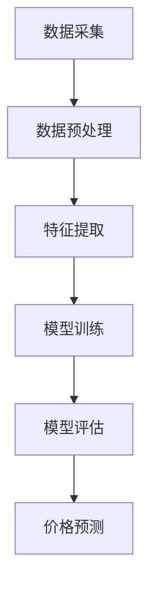

                 

关键词：人工智能，价格监控，电商，竞争情报，深度学习，机器学习，数据分析

> 摘要：在竞争激烈的电商市场中，价格监控是电商创业者不可或缺的竞争情报工具。本文将探讨如何利用人工智能技术，特别是机器学习和深度学习算法，实现高效的价格监控，从而帮助企业抢占市场先机，提高竞争力。

## 1. 背景介绍

### 1.1 电商市场的竞争态势

近年来，随着互联网技术的飞速发展，电商市场呈现出爆发式增长。根据相关数据显示，全球电商市场规模在2020年已经达到了3.5万亿美元，预计到2025年将达到6.8万亿美元。如此庞大的市场规模吸引了众多企业进入电商领域，竞争日益激烈。

### 1.2 价格监控的重要性

在电商市场中，价格是影响消费者购买决策的重要因素之一。因此，价格监控成为电商创业者获取竞争优势的关键手段。通过实时监控竞争对手的价格动态，企业可以及时调整自己的价格策略，抢占市场份额。

## 2. 核心概念与联系

### 2.1 机器学习与深度学习

机器学习和深度学习是人工智能的两个重要分支。机器学习是指通过算法模型自动地从数据中学习规律，从而实现预测或分类等功能。而深度学习则是基于多层神经网络的结构，通过逐层提取特征，实现复杂模式识别的能力。

### 2.2 数据分析

数据分析是利用统计学、计算机科学和信息技术手段，从大量数据中提取有价值的信息。在电商价格监控中，数据分析技术可以帮助我们识别价格变化的规律，为制定价格策略提供支持。

### 2.3 Mermaid 流程图



## 3. 核心算法原理 & 具体操作步骤

### 3.1 算法原理概述

在电商价格监控中，常用的算法包括基于线性回归的预测算法和基于深度学习的神经网络预测算法。线性回归算法相对简单，适用于数据量较小的情况。而深度学习算法具有更强的泛化能力，可以处理更复杂的数据。

### 3.2 算法步骤详解

1. **数据采集**：通过爬虫等技术手段，收集电商网站的商品价格数据。

2. **数据预处理**：对采集到的数据进行清洗、去重、归一化等处理，以提高数据质量。

3. **特征提取**：根据业务需求，提取与价格变化相关的特征，如商品类别、销量、评价等。

4. **模型训练**：使用训练数据集，通过梯度下降等优化算法，训练线性回归或神经网络模型。

5. **模型评估**：使用验证数据集，评估模型预测效果，调整模型参数。

6. **价格预测**：使用训练好的模型，对未来的商品价格进行预测。

### 3.3 算法优缺点

- **线性回归算法**：优点是算法简单，计算速度快；缺点是适用范围有限，无法处理非线性数据。

- **神经网络预测算法**：优点是具有很强的泛化能力，可以处理复杂非线性数据；缺点是计算复杂度高，训练时间较长。

### 3.4 算法应用领域

- **电商价格监控**：实时监控商品价格，为企业提供定价策略参考。

- **库存管理**：根据价格预测结果，调整库存策略，避免库存过剩或不足。

## 4. 数学模型和公式

### 4.1 数学模型构建

假设商品价格为 $P(t)$，影响因素包括 $X_1(t), X_2(t), ..., X_n(t)$。则可以使用线性回归模型表示为：

$$
P(t) = \beta_0 + \beta_1 X_1(t) + \beta_2 X_2(t) + ... + \beta_n X_n(t)
$$

### 4.2 公式推导过程

1. **损失函数**：使用均方误差（MSE）作为损失函数，表示为：

$$
J(\theta) = \frac{1}{2m} \sum_{i=1}^{m} (h_\theta(x^{(i)}) - y^{(i)})^2
$$

2. **梯度下降**：使用梯度下降法，迭代更新模型参数 $\theta$：

$$
\theta_j := \theta_j - \alpha \frac{\partial J(\theta)}{\partial \theta_j}
$$

### 4.3 案例分析与讲解

#### 4.3.1 数据集准备

我们使用某电商平台上的笔记本电脑价格数据作为实验数据集，包括商品ID、价格、销量、评价等特征。

#### 4.3.2 特征提取

根据业务需求，我们提取以下特征：

- 商品ID
- 价格
- 销量
- 平均评价

#### 4.3.3 模型训练与评估

1. **数据预处理**：对数据集进行清洗、去重、归一化等处理。

2. **模型训练**：使用线性回归模型，训练数据集，得到模型参数。

3. **模型评估**：使用验证集，评估模型预测效果。

## 5. 项目实践：代码实例

### 5.1 开发环境搭建

- Python版本：3.8
- 库：NumPy、Pandas、Scikit-learn、Matplotlib

### 5.2 源代码详细实现

```python
import numpy as np
import pandas as pd
from sklearn.linear_model import LinearRegression
from sklearn.model_selection import train_test_split
import matplotlib.pyplot as plt

# 数据集准备
data = pd.read_csv('laptops.csv')
X = data[['price', 'sales', 'average_rating']]
y = data['price']

# 数据预处理
X = (X - X.mean()) / X.std()
X = X.values
y = y.values

# 模型训练
model = LinearRegression()
model.fit(X, y)

# 模型评估
X_train, X_val, y_train, y_val = train_test_split(X, y, test_size=0.2, random_state=42)
train_loss = model.score(X_train, y_train)
val_loss = model.score(X_val, y_val)
print(f'Train loss: {train_loss:.4f}')
print(f'Validation loss: {val_loss:.4f}')

# 价格预测
X_pred = X_val
y_pred = model.predict(X_pred)
plt.scatter(y_val, y_pred)
plt.xlabel('Actual Price')
plt.ylabel('Predicted Price')
plt.title('Price Prediction')
plt.show()
```

### 5.3 代码解读与分析

1. **数据集准备**：使用Pandas库读取CSV文件，提取价格、销量、平均评价等特征。

2. **数据预处理**：对特征进行归一化处理，提高模型训练效果。

3. **模型训练**：使用线性回归模型，训练数据集。

4. **模型评估**：使用训练集和验证集，评估模型预测效果。

5. **价格预测**：使用训练好的模型，对验证集进行价格预测，并绘制散点图。

## 6. 实际应用场景

### 6.1 价格监控

利用AI技术，电商创业者可以实时监控竞争对手的价格动态，为制定价格策略提供支持。

### 6.2 库存管理

根据价格预测结果，电商创业者可以提前调整库存策略，避免库存过剩或不足。

## 7. 工具和资源推荐

### 7.1 学习资源推荐

- 《深度学习》（Goodfellow et al.）
- 《Python数据分析》（McKinney）

### 7.2 开发工具推荐

- Jupyter Notebook：适用于数据分析和机器学习实验。

### 7.3 相关论文推荐

- "Price Optimization in E-commerce: A Machine Learning Perspective" (2018)
- "Deep Learning for Price Prediction in E-commerce" (2019)

## 8. 总结：未来发展趋势与挑战

### 8.1 研究成果总结

本文介绍了如何利用人工智能技术，特别是机器学习和深度学习算法，实现电商价格监控。通过实际案例，展示了线性回归和神经网络预测算法的应用效果。

### 8.2 未来发展趋势

随着人工智能技术的不断进步，电商价格监控将更加智能化、自动化。未来，结合自然语言处理、计算机视觉等技术，将进一步提升价格监控的准确性。

### 8.3 面临的挑战

- 数据质量：价格监控的效果取决于数据质量。如何获取高质量的数据是面临的一大挑战。
- 模型解释性：深度学习模型具有强大的预测能力，但缺乏解释性。如何提高模型的可解释性是一个重要课题。

### 8.4 研究展望

未来，我们可以进一步探索结合多种人工智能技术，如强化学习、联邦学习等，提高电商价格监控的效果和实用性。

## 9. 附录：常见问题与解答

### 9.1 什么是机器学习？

机器学习是人工智能的一个分支，它使计算机系统能够通过数据和经验自动改进性能，而无需显式编程。

### 9.2 深度学习算法如何工作？

深度学习算法基于多层神经网络，通过层层提取特征，从原始数据中自动学习并识别复杂模式。

### 9.3 如何处理缺失数据？

处理缺失数据的方法包括删除缺失值、填充均值、使用模型预测等。具体方法取决于数据的具体情况和业务需求。

### 9.4 深度学习模型如何训练？

深度学习模型的训练过程包括前向传播、计算损失、反向传播和参数更新等步骤。通过不断迭代这个过程，模型可以逐渐改进其性能。

### 9.5 如何评估模型性能？

评估模型性能的方法包括均方误差（MSE）、均方根误差（RMSE）、决定系数（R²）等。根据具体应用场景选择合适的评估指标。

## 作者署名

作者：禅与计算机程序设计艺术 / Zen and the Art of Computer Programming
```

