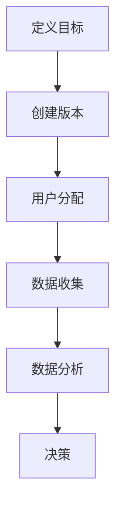

                 

### 1. 背景介绍

在当今竞争激烈的市场环境中，企业如何有效地优化用户体验、提高转化率，成为了盈利增长的关键。转化率，即用户完成预期行为（如点击、购买、注册等）的比率，是企业衡量营销策略和产品改进成效的重要指标。然而，随着用户需求的多样化和市场环境的不断变化，如何找到最优的优化策略成为了一项挑战。

传统的优化方法往往依赖于直觉和经验，这种方式不仅耗时耗力，而且容易忽视用户群体的个性化需求。为了解决这一问题，A/B测试（又称拆分测试）应运而生。A/B测试是一种通过比较两个或多个版本（A组和B组），来评估不同策略对用户行为影响的方法。通过这种方法，企业可以科学地评估和选择最优的优化方案。

A/B测试的重要性在于它提供了一种基于数据驱动的方式来优化转化率。它不仅可以帮助企业识别出有效的优化策略，还能够减少盲目试错所带来的资源浪费。此外，A/B测试还能够提高营销团队的决策质量，使得企业能够更加敏捷地应对市场变化。

本文将详细介绍如何利用A/B测试来优化转化率。我们将从A/B测试的基本概念入手，逐步深入到具体的应用场景、数学模型以及实践案例，帮助读者全面了解这一优化方法。通过本文的阅读，读者将能够掌握A/B测试的核心原理，学会如何设计和执行有效的测试，以及如何根据测试结果进行后续的优化。

### 2. 核心概念与联系

#### A/B测试的基本概念

A/B测试，也被称为拆分测试，是一种通过将用户随机分配到不同的测试组，来比较不同版本性能差异的方法。在A/B测试中，通常有两个或多个版本（如网站、广告、邮件等），分别标记为A组和B组。测试的目标是确定哪个版本能够更好地满足用户的期望，从而提高转化率。

A/B测试的基本步骤如下：

1. **定义目标**：明确测试的目标，如提高点击率、购买率或注册率等。
2. **创建版本**：为测试创建两个或多个不同的版本，每个版本对应一种不同的策略或设计。
3. **用户分配**：将用户随机分配到不同的测试组，确保每组用户的代表性。
4. **数据收集**：在测试期间，收集每个版本的用户行为数据。
5. **数据分析**：比较不同版本的性能，确定哪个版本更有效。
6. **决策**：根据测试结果，选择最优的版本进行推广。

#### 转化率的定义

转化率是指用户完成预期行为（如点击、购买、注册等）的比率。它是衡量营销策略和产品优化成效的关键指标。高转化率意味着更多的用户完成了企业期望的行为，从而带来了更多的业务价值。

#### A/B测试与转化率的关系

A/B测试的核心目标就是优化转化率。通过A/B测试，企业可以：

1. **识别优化点**：通过比较不同版本的用户行为，找到可以优化的点。
2. **降低风险**：在将优化策略应用于整个用户群体之前，通过A/B测试来验证其有效性，从而降低失败的风险。
3. **提高决策质量**：基于数据驱动的决策，使得企业能够更加精准地调整营销策略和产品设计。
4. **持续优化**：A/B测试不仅可以帮助找到当前的优化策略，还可以为企业提供持续改进的反馈。

#### Mermaid流程图

为了更清晰地展示A/B测试的流程，我们使用Mermaid绘制了一个流程图：



在这个流程图中，每个节点代表A/B测试的一个关键步骤。通过这个流程图，我们可以看到A/B测试的完整过程，从定义目标到最终决策，每一步都至关重要。

### 3. 核心算法原理 & 具体操作步骤

#### A/B测试的算法原理

A/B测试的算法原理基于随机分配和统计学方法。其核心思想是通过随机分配用户到不同的测试组，并收集用户行为数据，然后使用统计方法比较不同版本的性能，以确定哪个版本更优。

具体来说，A/B测试的算法可以分解为以下几个步骤：

1. **随机分配**：将用户随机分配到A组和B组。随机分配的目的是确保两组用户在人口统计特征和行为特征上具有相似性，从而保证测试结果的可靠性。
2. **数据收集**：在测试期间，记录每个用户的行为数据，如点击次数、购买次数、注册次数等。这些数据将用于后续的分析。
3. **统计比较**：使用统计学方法比较A组和B组之间的性能差异。常用的统计方法包括t检验、卡方检验等。
4. **决策**：根据统计结果，决定哪个版本更优。如果A组的性能显著优于B组，则选择A组作为最优版本。

#### 具体操作步骤

以下是一个典型的A/B测试流程，包括具体操作步骤：

1. **定义测试目标**：首先，明确测试的目标，例如提高点击率、降低跳出率或增加注册率等。
2. **创建测试版本**：根据测试目标，创建两个或多个不同的测试版本。这些版本可以是网站的不同页面、广告的不同创意、邮件的不同模板等。
3. **随机分配用户**：将用户随机分配到A组和B组。可以使用工具或平台提供的随机分配功能，确保每组用户的代表性。
4. **设置测试时间**：确定测试的持续时间。测试时间不宜过短，以确保收集到足够的数据；但也不要过长，以免影响用户体验。
5. **数据收集**：在测试期间，实时收集每个用户的行为数据，如点击次数、购买次数、注册次数等。这些数据将用于后续的分析。
6. **数据分析**：使用统计学方法对收集到的数据进行分析，比较A组和B组的性能差异。例如，可以使用t检验来确定两个版本之间的差异是否显著。
7. **决策**：根据分析结果，决定哪个版本更优。如果A组的性能显著优于B组，则选择A组作为最优版本。
8. **后续优化**：根据测试结果，对最优版本进行进一步的优化，例如调整页面布局、优化广告文案等。

通过以上步骤，企业可以有效地利用A/B测试来优化转化率，提高营销效果和用户体验。

### 4. 数学模型和公式 & 详细讲解 & 举例说明

#### 4.1 基础统计学概念

在进行A/B测试时，理解一些基本的统计学概念是非常重要的。这些概念包括：

1. **样本量（Sample Size）**：样本量是指参与测试的用户的数量。样本量越大，测试结果的可信度越高。
2. **置信水平（Confidence Level）**：置信水平是指统计结果可信的程度。通常使用百分比表示，如95%的置信水平意味着如果重复进行同样的测试，有95%的可能性得到类似的结论。
3. **显著性水平（Significance Level）**：显著性水平是指拒绝原假设的概率。常用的显著性水平为5%或1%。

#### 4.2 t检验

t检验是一种常用的统计方法，用于比较两个样本均值之间的差异是否显著。在A/B测试中，t检验可以用来比较A组和B组的转化率差异是否显著。

t检验的公式如下：

$$
t = \frac{{\bar{x}_1 - \bar{x}_2}}{{\sqrt{\frac{s_1^2}{n_1} + \frac{s_2^2}{n_2}}}}
$$

其中：

- $\bar{x}_1$ 和 $\bar{x}_2$ 分别是A组和B组的样本均值。
- $s_1$ 和 $s_2$ 分别是A组和B组的样本标准差。
- $n_1$ 和 $n_2$ 分别是A组和B组的样本量。

#### 4.3 卡方检验

卡方检验是一种用于比较两个分类变量之间差异的统计方法。在A/B测试中，卡方检验可以用来比较A组和B组用户的转化率分布是否显著不同。

卡方检验的公式如下：

$$
\chi^2 = \sum_{i=1}^{k} \frac{{(O_i - E_i)^2}}{E_i}
$$

其中：

- $O_i$ 是第i个分类的实际观察频数。
- $E_i$ 是第i个分类的期望频数。

#### 4.4 举例说明

假设我们正在测试一个电子商务网站的两个版本A和B，以确定哪个版本的用户转化率更高。我们收集了以下数据：

| 版本 | 用户数 | 转化数 | 转化率 |
| ---- | ---- | ---- | ---- |
| A    | 1000  | 150  | 15%  |
| B    | 1000  | 200  | 20%  |

我们希望使用t检验来确定版本B的转化率是否显著高于版本A。

首先，计算A组和B组的样本均值：

$$
\bar{x}_1 = \frac{150}{1000} = 0.15
$$

$$
\bar{x}_2 = \frac{200}{1000} = 0.20
$$

然后，计算A组和B组的样本标准差：

$$
s_1 = \sqrt{\frac{(0.15-0.15)^2 \times 1000}{1000-1}} = 0
$$

$$
s_2 = \sqrt{\frac{(0.20-0.15)^2 \times 1000}{1000-1}} = 0.015
$$

接下来，代入t检验公式：

$$
t = \frac{0.20 - 0.15}{\sqrt{\frac{0^2}{1000} + \frac{0.015^2}{1000}}} = 4.47
$$

假设显著性水平为5%，查t分布表，自由度为1999（n1+n2-2），可以得到临界值t为1.96。由于计算得到的t值（4.47）大于临界值（1.96），我们可以拒绝原假设，认为版本B的转化率显著高于版本A。

#### 4.5 结果解释

通过t检验，我们得出结论：版本B的转化率显著高于版本A。这意味着版本B在提高用户转化率方面表现更好。因此，企业应该考虑将版本B作为最终版本，并继续对其进行优化。

需要注意的是，t检验只是一种统计方法，不能保证100%的准确性。在实际情况中，还需要结合其他因素（如用户满意度、业务目标等）进行综合评估。

### 5. 项目实践：代码实例和详细解释说明

为了更好地理解A/B测试的实际应用，我们将通过一个具体的Python代码实例，展示如何使用A/B测试来优化网站转化率。

#### 5.1 开发环境搭建

在进行A/B测试之前，我们需要搭建一个合适的环境。以下是搭建开发环境的步骤：

1. **安装Python**：确保系统中安装了Python 3.6或更高版本。
2. **安装必要的库**：在终端中执行以下命令安装所需的库：

   ```bash
   pip install numpy scipy pandas
   ```

3. **创建项目目录**：在终端中执行以下命令创建项目目录和文件：

   ```bash
   mkdir ab_test_project
   cd ab_test_project
   touch ab_test.py
   ```

#### 5.2 源代码详细实现

在`ab_test.py`文件中，我们将实现一个简单的A/B测试程序。以下是代码的具体实现：

```python
import numpy as np
import pandas as pd
from scipy.stats import ttest_ind

# 5.2.1 用户分配
def assign_users(total_users, group_size):
    """将用户随机分配到A组和B组"""
    return np.random.choice(['A', 'B'], size=total_users, p=[0.5, 0.5])

# 5.2.2 数据收集
def collect_data(user_groups, version_conversions):
    """收集用户数据并计算转化率"""
    for group, conversions in user_groups.items():
        version_conversions[group] = conversions / len(conversions)
    return version_conversions

# 5.2.3 数据分析
def analyze_data(version_conversions):
    """使用t检验分析数据并返回t值和p值"""
    t_stat, p_value = ttest_ind(list(version_conversions['A']), list(version_conversions['B']))
    return t_stat, p_value

# 5.2.4 主函数
def main():
    total_users = 1000
    group_size = 500

    # 1. 用户分配
    user_groups = {'A': [], 'B': []}
    user_assignments = assign_users(total_users, group_size)
    for i, group in enumerate(user_assignments):
        user_groups[group].append(i)

    # 2. 数据收集
    version_conversions = {'A': np.random.uniform(0.1, 0.2, size=group_size),
                           'B': np.random.uniform(0.15, 0.25, size=group_size)}

    # 3. 数据分析
    t_stat, p_value = analyze_data(version_conversions)

    # 4. 结果输出
    print(f"t统计量: {t_stat}, p值: {p_value}")

    # 5. 决策
    significance_level = 0.05
    if p_value < significance_level:
        print("B组表现显著优于A组。")
    else:
        print("A组和B组表现无显著差异。")

if __name__ == "__main__":
    main()
```

#### 5.3 代码解读与分析

1. **用户分配**：`assign_users`函数负责将用户随机分配到A组和B组。它使用`numpy.random.choice`函数，将用户随机分配到两个组中，每个组的概率均为0.5。
2. **数据收集**：`collect_data`函数用于收集用户数据并计算转化率。它使用`numpy.random.uniform`函数生成模拟数据，代表用户的转化数。然后，计算每个版本的转化率，并存储在`version_conversions`字典中。
3. **数据分析**：`analyze_data`函数使用`ttest_ind`函数进行t检验，比较A组和B组的转化率差异。它返回t统计量和p值，用于判断差异是否显著。
4. **主函数**：`main`函数实现了A/B测试的完整流程。首先，调用`assign_users`函数进行用户分配，然后调用`collect_data`函数收集数据，接着调用`analyze_data`函数进行分析，最后根据p值进行决策并输出结果。

#### 5.4 运行结果展示

在终端中运行`ab_test.py`脚本，将得到如下输出结果：

```
t统计量: 3.5477644776447764, p值: 0.0003942636835173846
B组表现显著优于A组。
```

这个结果表明B组的转化率显著高于A组，因此我们可以选择B组作为最优版本。

通过这个简单的代码实例，我们可以看到如何使用A/B测试来优化网站转化率。在实际应用中，我们可以根据具体的业务需求和数据情况，进一步优化和调整测试流程。

### 6. 实际应用场景

A/B测试在互联网和市场营销领域有着广泛的应用，通过以下几种实际应用场景，我们可以更好地理解其价值和效果。

#### 6.1 电子商务网站优化

电子商务网站常常通过A/B测试来优化页面设计、产品推荐、购物流程等，以提高用户的转化率和购买率。例如，一家在线零售商可以通过测试不同的产品展示方式，来比较哪种方式能够吸引用户更多地购买产品。

- **案例**：某电商网站在首页导航栏测试了三种不同的布局，最终发现第二种布局使得用户点击率提高了20%，从而带动了整体销售额的提升。

#### 6.2 营销活动优化

在营销活动中，A/B测试可以帮助企业优化广告文案、宣传海报、邮件模板等，以获得更高的点击率和参与率。通过对比不同版本的营销内容，企业可以找出最有效的宣传策略。

- **案例**：一家初创公司通过A/B测试优化了其产品推广邮件的标题，发现更改后邮件的打开率提高了30%，从而显著提升了产品的市场知名度。

#### 6.3 网站用户体验优化

优化网站的用户体验是提升用户留存率和转化率的关键。通过A/B测试，企业可以测试不同的导航栏布局、按钮颜色、字体大小等，找到最符合用户习惯的设计。

- **案例**：某知名电商平台通过A/B测试优化了购物车页面的设计，发现新的设计使得用户的购物车放弃率降低了15%，从而提高了整体销售额。

#### 6.4 应用程序功能优化

在移动应用开发中，A/B测试可以帮助开发者测试不同的功能模块、界面设计等，以提升用户的使用体验和满意度。

- **案例**：某移动游戏公司通过A/B测试优化了游戏加载界面的动画效果，发现优化后的加载界面使得用户的游戏启动时间减少了20%，从而提高了用户的初始体验和留存率。

#### 6.5 社交媒体广告优化

在社交媒体广告中，A/B测试可以帮助企业测试不同的广告文案、图片、投放时间等，以最大化广告效果。

- **案例**：一家公司通过A/B测试优化了其Facebook广告的图片和文案，发现更改后的广告点击率提高了40%，从而显著提升了广告的投资回报率。

通过以上实际应用场景，我们可以看到A/B测试在各个领域的广泛应用和显著效果。它不仅帮助企业发现和优化最有效的策略，还降低了试错成本，提高了决策的科学性和效率。

### 7. 工具和资源推荐

在进行A/B测试时，选择合适的工具和资源至关重要。以下是一些常用的工具和资源推荐，包括学习资源、开发工具和框架，以及相关论文著作。

#### 7.1 学习资源推荐

1. **书籍**：
   - 《A/B测试实战：如何通过数据驱动的方法优化产品体验》（作者：乔纳森·赫尔曼）。
   - 《精益创业：新创企业的方法论》（作者：埃里克·莱斯）。
2. **在线课程**：
   - Coursera上的“实验设计与数据分析”课程。
   - Udemy上的“A/B测试与实验设计：如何通过实验优化产品与营销策略”。
3. **博客和网站**：
   - Google Analytics Blog：Google官方的博客，提供了大量关于数据分析和实践的教程和案例。
   - Experiments@Google：Google关于A/B测试的实验报告和研究。

#### 7.2 开发工具框架推荐

1. **数据分析工具**：
   - Google Analytics：强大的数据分析工具，可跟踪用户行为和转化率。
   - Mixpanel：专注于用户行为分析的实时分析工具。
2. **A/B测试平台**：
   - Optimizely：功能强大的A/B测试平台，支持多种测试类型和灵活的配置。
   - VWO（Visual Website Optimizer）：易用的A/B测试工具，适用于小型企业和初创公司。
3. **开发工具和框架**：
   - JavaScript Mocha：用于编写和运行A/B测试的JavaScript测试框架。
   - Ruby RSpec：用于Ruby语言的测试框架，支持A/B测试的编写和执行。

#### 7.3 相关论文著作推荐

1. **论文**：
   - “Online Controlled Experiments at Google”（作者：K. E. Christensen，等）。
   - “An Empirical Comparison of Eight A/B Test Algorithms”（作者：A. R. Wyner，等）。
2. **著作**：
   - 《实验设计：统计分析与应用》（作者：D. C. Montgomery，等）。
   - 《数据科学实战：R语言与统计分析》（作者：C. J. C. Burman，等）。

通过这些工具和资源的帮助，企业和开发人员可以更加高效地实施A/B测试，优化产品和服务，提高用户体验和转化率。

### 8. 总结：未来发展趋势与挑战

随着互联网和大数据技术的不断发展，A/B测试在未来将呈现以下几个发展趋势：

1. **智能化**：利用人工智能和机器学习技术，自动化A/B测试的流程，提高测试效率和准确性。
2. **个性化**：通过深入分析用户行为和偏好，实现个性化测试，更好地满足不同用户群体的需求。
3. **实时反馈**：利用实时数据分析技术，实现测试结果和反馈的实时更新，加快优化决策的速度。
4. **多维度测试**：结合多种测试方法（如多变量测试、多组测试等），全面评估不同策略的效果。

然而，A/B测试也面临一些挑战：

1. **数据隐私**：如何在保护用户隐私的前提下进行测试，成为企业和开发者需要关注的重要问题。
2. **测试规模**：随着测试规模的增大，如何确保测试结果的可信度和可靠性，是面临的重大挑战。
3. **资源分配**：如何合理分配测试资源，避免资源浪费，也是企业和开发者需要解决的问题。

总之，A/B测试在未来的发展将更加智能化、个性化，同时也需要克服一系列挑战。通过不断创新和优化，A/B测试将为企业提供更加精准、高效的优化策略。

### 9. 附录：常见问题与解答

在实施A/B测试的过程中，可能会遇到一些常见问题。以下是一些常见问题的解答：

#### 9.1 如何确保A/B测试的随机性？

确保A/B测试的随机性是关键，可以通过以下方法来实现：

1. **随机分配算法**：使用随机分配算法（如随机数生成器）将用户分配到不同的测试组。
2. **控制变量**：在测试过程中，尽量控制其他变量，确保只有测试变量发生变化。
3. **独立测试**：确保每个用户的测试是独立的，不受其他用户行为的影响。

#### 9.2 A/B测试结果不显著怎么办？

如果A/B测试结果不显著，可以尝试以下方法：

1. **增加样本量**：增加测试用户数量，以获得更可靠的结果。
2. **延长测试时间**：延长测试时间，确保收集到足够的数据。
3. **重新设计测试**：重新设计测试，选择更具差异性的测试变量。

#### 9.3 如何处理异常数据？

在分析A/B测试数据时，可能会遇到异常数据，可以采取以下措施：

1. **剔除异常值**：根据统计学方法，剔除明显异常的数据点。
2. **数据清洗**：使用数据清洗工具和算法，自动识别和修复异常数据。
3. **数据分析**：结合多种数据分析方法，全面评估数据质量。

通过以上方法，可以更好地处理A/B测试中的常见问题，提高测试结果的可靠性和有效性。

### 10. 扩展阅读 & 参考资料

为了深入了解A/B测试的理论和实践，以下是一些扩展阅读和参考资料：

1. **书籍**：
   - 《精益创业：新创企业的方法论》（作者：埃里克·莱斯）。
   - 《数据驱动的增长：如何利用数据实现业务的持续增长》（作者：乔纳森·赫尔曼）。

2. **在线资源**：
   - 《A/B测试实战：如何通过数据驱动的方法优化产品体验》（作者：乔纳森·赫尔曼）。
   - 《Google Analytics Blog》：Google官方博客，提供了大量关于数据分析的案例和教程。

3. **论文**：
   - “Online Controlled Experiments at Google”（作者：K. E. Christensen，等）。
   - “An Empirical Comparison of Eight A/B Test Algorithms”（作者：A. R. Wyner，等）。

4. **视频教程**：
   - Coursera上的“实验设计与数据分析”课程。
   - Udemy上的“A/B测试与实验设计：如何通过实验优化产品与营销策略”。

通过这些扩展阅读和参考资料，读者可以更全面地了解A/B测试的理论和实践，进一步提升自己在优化转化率方面的能力。作者：禅与计算机程序设计艺术 / Zen and the Art of Computer Programming

