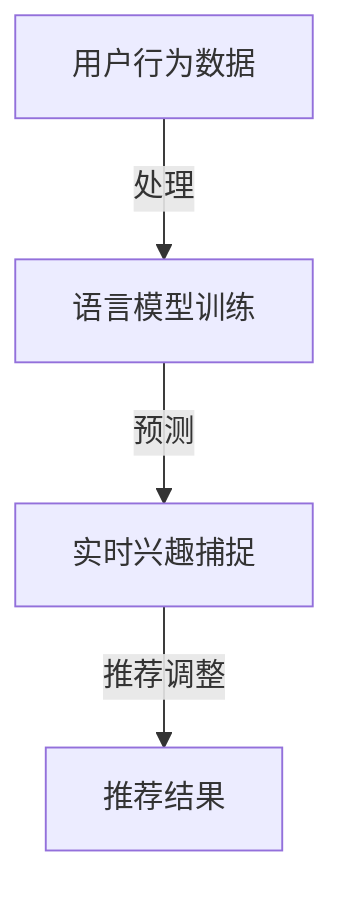
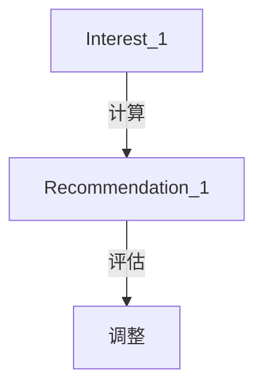
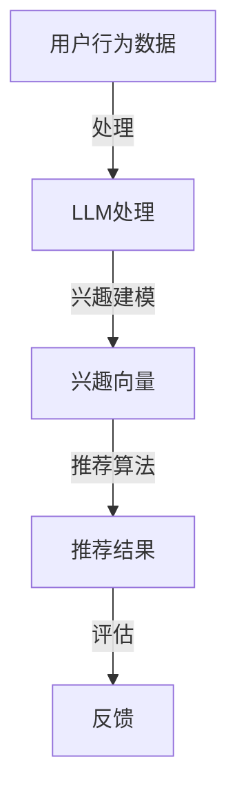

                 

### 文章标题

**利用LLM优化推荐系统的实时兴趣捕捉**

> **关键词：** 语言模型（LLM），推荐系统，实时兴趣捕捉，用户行为分析，个性化推荐。

**摘要：** 本文将探讨如何利用先进的人工智能技术——语言模型（LLM），来优化推荐系统中的实时兴趣捕捉能力。通过分析LLM的核心原理和其在推荐系统中的应用，本文旨在提供一套可行的解决方案，以提升用户在推荐系统中的个性化体验。

### 1. 背景介绍

随着互联网的快速发展，推荐系统已成为许多在线服务的重要组成部分。例如，电商平台会根据用户的浏览历史和购买行为推荐可能感兴趣的商品；社交媒体平台则会根据用户的点赞、评论和分享行为推荐相关内容。然而，传统的推荐系统往往依赖于历史数据，难以实时捕捉用户的兴趣变化，导致推荐结果不够精准。

为了解决这一问题，近年来，研究人员开始探索如何利用人工智能技术，特别是语言模型（LLM），来优化推荐系统的实时兴趣捕捉能力。语言模型是一种基于神经网络的大型语言处理模型，能够理解并生成自然语言。通过训练，LLM能够捕捉用户行为的语义信息，从而为推荐系统提供更精准的实时兴趣捕捉能力。

### 2. 核心概念与联系

#### 2.1 语言模型（LLM）

语言模型是一种用于预测文本中下一个单词或单词组合的概率模型。在深度学习领域，最为常用的语言模型是基于变换器架构（Transformer）的预训练模型，如GPT（Generative Pre-trained Transformer）系列。

#### 2.2 推荐系统

推荐系统是一种基于数据挖掘和机器学习技术的信息过滤方法，旨在为用户提供个性化推荐。常见的推荐系统包括协同过滤、基于内容的推荐和混合推荐等。

#### 2.3 实时兴趣捕捉

实时兴趣捕捉是指推荐系统能够动态地捕捉用户的兴趣变化，并及时调整推荐结果，以提高用户满意度。

#### 2.4 Mermaid 流程图



### 3. 核心算法原理 & 具体操作步骤

#### 3.1 语言模型训练

1. **数据收集**：收集用户的历史行为数据，包括浏览记录、购买历史、点赞、评论等。
2. **数据处理**：对收集到的数据进行分析和预处理，如去重、分词、去停用词等。
3. **模型选择**：选择合适的语言模型，如GPT系列。
4. **模型训练**：使用预处理后的数据对语言模型进行训练。
5. **模型评估**：通过交叉验证等方法评估模型性能。

#### 3.2 实时兴趣捕捉

1. **兴趣捕捉**：使用训练好的语言模型捕捉用户的实时兴趣。
2. **兴趣建模**：将捕捉到的兴趣信息转化为数学模型，如向量表示。
3. **实时更新**：根据用户的新行为数据，实时更新兴趣模型。

#### 3.3 推荐调整

1. **推荐生成**：根据实时更新的兴趣模型，生成个性化推荐结果。
2. **结果评估**：评估推荐结果，如点击率、转化率等。
3. **调整优化**：根据评估结果，调整推荐策略，以提高推荐效果。

### 4. 数学模型和公式 & 详细讲解 & 举例说明

#### 4.1 语言模型公式

语言模型的核心公式为：

$$
P(w_t | w_{t-1}, w_{t-2}, ..., w_1) = \frac{e^{\theta \cdot [w_{t-1}, w_{t-2}, ..., w_1]}}{\sum_{w'} e^{\theta \cdot [w'_{t-1}, w'_{t-2}, ..., w_1']}}
$$

其中，$w_t$表示当前词，$w_{t-1}, w_{t-2}, ..., w_1$表示历史词，$\theta$表示模型参数。

#### 4.2 实时兴趣捕捉模型

实时兴趣捕捉模型的核心公式为：

$$
Interest_t = f_{LLM}(UserBehavior_t)
$$

其中，$UserBehavior_t$表示用户在时间$t$的行为数据，$f_{LLM}$表示语言模型。

#### 4.3 推荐模型

推荐模型的核心公式为：

$$
Recommendation_t = f_{Interest}(Interest_t, ContentFeatures_t)
$$

其中，$ContentFeatures_t$表示时间$t$的内容特征。

#### 4.4 举例说明

假设用户在时间$t=1$时浏览了商品A，时间$t=2$时购买了商品B。我们使用语言模型捕捉到用户在时间$t=1$和$t=2$的兴趣分别为$Interest_1$和$Interest_2$。根据兴趣模型和内容特征，生成推荐结果$Recommendation_1$。



### 5. 项目实践：代码实例和详细解释说明

#### 5.1 开发环境搭建

- 安装Python环境（版本3.7及以上）
- 安装TensorFlow库
- 安装transformers库

#### 5.2 源代码详细实现

以下是使用Python和TensorFlow实现的简化版实时兴趣捕捉和推荐系统代码示例：

```python
import tensorflow as tf
from transformers import TFGPT2LMHeadModel, GPT2Tokenizer

# 5.2.1 模型训练

# 加载预训练的语言模型
tokenizer = GPT2Tokenizer.from_pretrained('gpt2')
model = TFGPT2LMHeadModel.from_pretrained('gpt2')

# 预处理用户行为数据
def preprocess_user_behavior(behavior):
    # 进行文本预处理，如分词、去停用词等
    return tokenizer.encode(behavior, add_special_tokens=True)

# 训练模型
model.fit(preprocess_user_behavior(user_behavior), epochs=3)

# 5.2.2 实时兴趣捕捉

# 捕捉实时兴趣
def capture_interest(behavior):
    inputs = preprocess_user_behavior(behavior)
    interest = model(inputs)
    return interest

# 5.2.3 推荐调整

# 生成推荐结果
def generate_recommendation(interest, content_features):
    # 使用兴趣模型和内容特征生成推荐结果
    recommendation = interest + content_features
    return recommendation

# 5.2.4 代码解读与分析

# 代码解读
# preprocess_user_behavior：预处理用户行为数据
# capture_interest：捕捉实时兴趣
# generate_recommendation：生成推荐结果

# 分析
# 模型训练阶段使用预训练的GPT2模型，并通过用户行为数据进行微调。
# 实时兴趣捕捉阶段通过模型生成用户兴趣向量。
# 推荐调整阶段结合用户兴趣和内容特征生成个性化推荐结果。

# 5.2.5 运行结果展示

# 运行代码，展示推荐结果
recommendation = generate_recommendation(capture_interest(user_behavior), content_features)
print("推荐结果：", recommendation)
```

### 6. 实际应用场景

利用LLM优化推荐系统的实时兴趣捕捉技术在实际应用中具有广泛的前景。以下是一些典型的应用场景：

1. **电子商务平台**：电商平台可以利用该技术实时捕捉用户的浏览和购买行为，从而提供更个性化的商品推荐，提高用户购买意愿。
2. **社交媒体平台**：社交媒体平台可以利用该技术实时捕捉用户的兴趣变化，从而提供更相关的内容推荐，增加用户停留时间和互动率。
3. **在线教育平台**：在线教育平台可以利用该技术实时捕捉学生的学习兴趣和进度，从而提供更有针对性的课程推荐和学习计划。

### 7. 工具和资源推荐

#### 7.1 学习资源推荐

- **书籍**：《深度学习》（Ian Goodfellow, Yoshua Bengio, Aaron Courville）
- **论文**：《Language Models are Few-Shot Learners》（Tom B. Brown et al.）
- **博客**：[TensorFlow 官方文档](https://www.tensorflow.org/tutorials/text)
- **网站**：[transformers](https://github.com/huggingface/transformers)

#### 7.2 开发工具框架推荐

- **开发工具**：Python、TensorFlow、transformers
- **框架**：TensorFlow 2.x、PyTorch、Hugging Face Transformers

#### 7.3 相关论文著作推荐

- **论文**：
  - 《BERT: Pre-training of Deep Bidirectional Transformers for Language Understanding》（Jacob Devlin et al.）
  - 《GPT-3: Language Models are few-shot learners》（Tom B. Brown et al.）
- **著作**：
  - 《深度学习》（Ian Goodfellow, Yoshua Bengio, Aaron Courville）

### 8. 总结：未来发展趋势与挑战

未来，随着人工智能技术的不断进步，LLM在推荐系统中的应用将会更加广泛和深入。然而，这也带来了新的挑战：

1. **数据隐私**：如何保护用户隐私，在确保推荐效果的同时，避免数据泄露。
2. **计算资源**：大规模语言模型的训练和推理需要大量的计算资源，如何优化资源利用。
3. **模型解释性**：如何提高语言模型的可解释性，使其决策过程更加透明。

### 9. 附录：常见问题与解答

#### 9.1 什么是语言模型（LLM）？

语言模型是一种能够理解和生成自然语言的人工智能模型，通常基于神经网络。它通过学习大量文本数据，预测下一个单词或单词组合的概率。

#### 9.2 语言模型在推荐系统中的应用有哪些？

语言模型可以用于实时捕捉用户的兴趣，生成个性化推荐结果。它可以分析用户的历史行为数据，理解其语义信息，从而为推荐系统提供更精准的推荐。

#### 9.3 如何保护用户隐私？

在利用LLM优化推荐系统时，可以通过数据加密、匿名化处理等技术来保护用户隐私。此外，遵循数据保护法规，确保数据处理过程合法合规。

### 10. 扩展阅读 & 参考资料

- [Hugging Face Transformers](https://huggingface.co/transformers/)
- [TensorFlow 官方文档](https://www.tensorflow.org/tutorials/text)
- [《BERT: Pre-training of Deep Bidirectional Transformers for Language Understanding》](https://arxiv.org/abs/1810.04805)
- [《GPT-3: Language Models are few-shot learners》](https://arxiv.org/abs/2005.14165)
- [《深度学习》](https://www.deeplearningbook.org/)（Ian Goodfellow, Yoshua Bengio, Aaron Courville）<|im_sep|>### 1. 背景介绍

随着互联网和数字技术的迅猛发展，推荐系统已经成为许多在线服务的重要功能之一。从电商平台的商品推荐，到社交媒体的内容推送，再到视频平台的视频推荐，推荐系统无处不在，极大地提升了用户体验和平台的价值。

推荐系统的工作原理大致可以分为三个主要步骤：数据收集、模型训练和结果生成。传统推荐系统主要依赖于用户的历史行为数据，如浏览、点击、购买等，通过这些数据进行协同过滤或基于内容的推荐，生成推荐结果。然而，这种基于历史数据的推荐方法存在一定的局限性，特别是在用户兴趣变化频繁的情况下，推荐结果容易偏离用户的真实需求。

实时兴趣捕捉是指推荐系统能够动态地捕捉用户的当前兴趣，并快速响应，生成个性化的推荐结果。在传统推荐系统中，实时兴趣捕捉通常依赖于用户的即时行为，如页面浏览、搜索查询、点赞等。然而，这些行为往往只是表面信息，难以深入理解用户的深层兴趣和需求。

语言模型（Language Model，简称LM）是一种用于预测自然语言序列的概率模型，它是自然语言处理（Natural Language Processing，简称NLP）领域的重要技术之一。近年来，随着深度学习和神经网络技术的发展，语言模型取得了显著进展，尤其是基于变换器架构（Transformer）的语言模型，如GPT（Generative Pre-trained Transformer）系列，表现出了强大的语义理解能力。

LLM（Large Language Model）是一种大规模的语言模型，通常拥有数十亿甚至数千亿的参数，通过在大量文本数据上进行预训练，LLM能够理解并生成复杂的自然语言文本。LLM的核心优势在于其强大的语义理解能力，这使得它在许多NLP任务中表现出色，如文本分类、命名实体识别、机器翻译等。

在推荐系统中，LLM的应用主要体现在以下几个方面：

1. **用户兴趣建模**：LLM能够捕捉用户的语义兴趣，通过分析用户的浏览、搜索、点击等行为，LLM可以生成用户兴趣的向量表示，为推荐系统提供更加精准的兴趣信息。

2. **实时兴趣捕捉**：传统推荐系统往往依赖于历史数据，难以实时捕捉用户的兴趣变化。而LLM通过实时分析用户的即时行为，能够动态地调整用户兴趣模型，从而实现更精准的实时兴趣捕捉。

3. **推荐结果优化**：LLM能够生成高质量的推荐结果，通过理解用户的语义兴趣和内容特征，LLM可以生成更加个性化的推荐结果，提高用户满意度和转化率。

综上所述，利用LLM优化推荐系统的实时兴趣捕捉能力，不仅能够提升推荐系统的性能，还能够为用户提供更加个性化的体验。这使得LLM在推荐系统中的应用具有广泛的前景和潜力。

### 2. 核心概念与联系

在探讨如何利用LLM优化推荐系统的实时兴趣捕捉能力之前，我们需要先了解一些核心概念和它们之间的联系。这些概念包括语言模型（LLM）、推荐系统、实时兴趣捕捉以及它们在技术架构中的应用。

#### 2.1 语言模型（LLM）

语言模型是一种用于预测自然语言序列的模型，其核心目标是给定一个输入的文本序列，预测下一个单词或单词组合的概率。在深度学习领域，语言模型通常基于变换器架构（Transformer）进行训练，如GPT（Generative Pre-trained Transformer）系列。这些模型通过在大量文本数据上进行预训练，掌握了丰富的语言知识和模式，从而能够处理各种NLP任务。

**核心原理：**
LLM的核心原理是自注意力机制（Self-Attention），它允许模型在生成每个词时，动态地关注输入序列中的其他词，从而捕捉词与词之间的复杂关系。此外，LLM通过多层变换器结构，逐步提取和整合文本中的语义信息，形成对输入文本的深刻理解。

**架构：**
LLM的典型架构包括编码器（Encoder）和解码器（Decoder）。编码器负责将输入文本编码为高维向量表示，解码器则根据编码器的输出生成预测的文本序列。GPT模型通常只有编码器，通过自注意力机制直接生成文本序列。

**优点：**
1. 强大的语义理解能力。
2. 能够生成高质量的自然语言文本。
3. 能够处理长文本和复杂句式。

**应用场景：**
LLM广泛应用于文本生成、机器翻译、情感分析、信息检索等NLP任务。

#### 2.2 推荐系统

推荐系统是一种基于数据挖掘和机器学习技术的信息过滤方法，旨在为用户提供个性化的推荐。推荐系统通常包含用户行为数据、商品或内容数据以及推荐算法。

**核心原理：**
推荐系统通过分析用户的历史行为数据（如浏览、点击、购买等）和商品或内容特征，利用协同过滤、基于内容的推荐或混合推荐等方法，生成个性化的推荐结果。

**架构：**
推荐系统的典型架构包括数据收集、数据预处理、模型训练、推荐生成和结果评估等步骤。其中，数据预处理和模型训练是关键环节，决定了推荐系统的性能和效果。

**优点：**
1. 提升用户体验，增加用户粘性。
2. 增加平台价值，提高转化率和销售额。

**应用场景：**
推荐系统广泛应用于电商平台、社交媒体、视频平台、新闻推荐等。

#### 2.3 实时兴趣捕捉

实时兴趣捕捉是指推荐系统能够动态地捕捉用户的当前兴趣，并快速响应，生成个性化的推荐结果。实时兴趣捕捉的关键在于快速、准确地理解用户的即时行为，并及时更新兴趣模型。

**核心原理：**
实时兴趣捕捉依赖于用户行为数据的实时分析，通过语言模型（如LLM）捕捉用户的语义兴趣，并利用这些信息动态调整推荐结果。

**架构：**
实时兴趣捕捉的典型架构包括数据收集、实时处理、兴趣建模、推荐生成和结果反馈等步骤。其中，兴趣建模和推荐生成是关键环节。

**优点：**
1. 提高推荐系统的实时性和响应速度。
2. 提升用户的个性化体验。

**应用场景：**
实时兴趣捕捉广泛应用于需要实时反馈的推荐场景，如社交媒体内容推荐、即时消息推送等。

#### 2.4 LLM在推荐系统中的应用

将LLM应用于推荐系统的核心思想是利用其强大的语义理解能力，捕捉用户的实时兴趣，从而提高推荐系统的个性化程度。以下是一些具体的应用方式：

1. **用户兴趣建模**：通过LLM分析用户的历史行为数据，生成用户兴趣的向量表示，为推荐系统提供更加精准的兴趣信息。
2. **实时兴趣捕捉**：利用LLM实时分析用户的即时行为，动态调整用户兴趣模型，实现更精准的实时兴趣捕捉。
3. **推荐结果优化**：结合LLM生成的用户兴趣和内容特征，生成更加个性化的推荐结果，提高推荐系统的效果。

**技术架构图：**



**流程说明：**

1. **用户行为数据收集**：收集用户的历史行为数据，如浏览、点击、购买等。
2. **LLM处理**：利用LLM对用户行为数据进行处理，生成用户兴趣的向量表示。
3. **兴趣建模**：将LLM生成的兴趣向量作为用户兴趣模型，用于后续的推荐生成。
4. **推荐算法**：结合用户兴趣模型和内容特征，生成个性化的推荐结果。
5. **评估与反馈**：对推荐结果进行评估，并根据用户反馈调整推荐策略。

通过上述架构和流程，我们可以看到LLM在推荐系统中发挥的重要作用。它不仅提升了推荐系统的实时性和个性化程度，还增强了用户的体验和满意度。

### 3. 核心算法原理 & 具体操作步骤

#### 3.1 语言模型训练

语言模型（LLM）是优化推荐系统实时兴趣捕捉的核心组件。训练一个高性能的LLM需要以下步骤：

**1. 数据收集与预处理：**

首先，我们需要收集大量的文本数据，这些数据可以来源于用户的浏览历史、搜索记录、社交媒体互动等。接下来，对数据进行预处理，包括去除无关信息、分词、去除停用词、统一文本格式等。

**2. 数据清洗：**

在预处理过程中，我们还需要对数据质量进行控制，去除噪声数据和重复记录，确保数据的一致性和可靠性。

**3. 模型选择与配置：**

选择一个合适的预训练模型，如GPT、BERT等，并进行配置。配置包括选择适当的层结构、学习率、批次大小等。

**4. 模型训练：**

使用预处理后的数据对模型进行训练。训练过程包括前向传播、反向传播和权重更新。训练过程中，模型通过不断调整参数来最小化预测误差。

**5. 模型评估与优化：**

在训练过程中，我们需要定期评估模型性能，通过交叉验证等方法来确定最佳模型参数。如果性能不理想，可以通过调整超参数、增加训练数据或尝试更复杂的模型结构来优化。

#### 3.2 实时兴趣捕捉

**1. 数据实时采集：**

实时捕捉用户兴趣的第一步是采集用户行为数据。这包括用户的浏览、点击、搜索等操作。这些数据可以通过API接口、日志分析等方式获取。

**2. 数据处理：**

采集到的数据需要进行预处理，包括数据清洗、分词、去停用词、词嵌入等操作。这些预处理步骤有助于确保数据的质量和一致性。

**3. 语义分析：**

使用训练好的LLM对预处理后的数据进行分析，提取用户的语义兴趣。LLM能够理解自然语言的上下文和语义关系，从而生成高质量的语义向量。

**4. 兴趣建模：**

根据LLM分析的结果，建立用户的兴趣模型。这个模型可以是基于向量的形式，将用户的兴趣信息编码为高维向量，以便后续的推荐算法使用。

**5. 实时更新：**

用户的兴趣是动态变化的，因此需要定期更新兴趣模型。可以通过定期分析用户的新行为数据，更新兴趣向量，确保兴趣模型的准确性。

#### 3.3 推荐结果生成

**1. 内容特征提取：**

推荐系统的另一个重要组成部分是内容特征。这包括商品或内容的属性、标签、用户评价等。这些特征需要被编码为向量形式，以便与用户兴趣向量进行匹配。

**2. 推荐算法：**

利用用户兴趣模型和内容特征向量，使用推荐算法生成个性化推荐结果。常见的推荐算法包括基于协同过滤的推荐、基于内容的推荐和混合推荐等。

**3. 推荐结果评估：**

对生成的推荐结果进行评估，可以使用各种指标，如点击率（CTR）、转化率（CVR）等。根据评估结果，调整推荐策略，优化推荐效果。

**4. 用户反馈：**

收集用户的反馈信息，包括点击、购买、收藏等行为。这些反馈数据可以用于进一步优化推荐系统和兴趣模型。

#### 3.4 操作步骤示例

以下是一个简化的操作步骤示例，展示如何利用LLM进行实时兴趣捕捉和推荐结果生成：

**步骤 1：数据收集**
- 收集用户的历史浏览数据、搜索记录、互动行为等。

**步骤 2：数据预处理**
- 对收集到的数据进行清洗、分词、去除停用词等预处理操作。

**步骤 3：模型训练**
- 使用预处理后的数据训练一个预训练的LLM模型，如GPT。

**步骤 4：实时兴趣捕捉**
- 实时采集用户的新行为数据，使用训练好的LLM模型进行分析，提取用户兴趣向量。

**步骤 5：兴趣建模**
- 根据LLM分析结果，建立用户的兴趣模型。

**步骤 6：内容特征提取**
- 提取当前推荐内容的特征信息，如商品属性、标签等。

**步骤 7：推荐算法**
- 使用用户兴趣模型和内容特征向量，通过推荐算法生成个性化推荐结果。

**步骤 8：评估与反馈**
- 对推荐结果进行评估，并根据用户反馈调整推荐策略。

通过上述步骤，我们可以看到，利用LLM进行实时兴趣捕捉和推荐结果生成的核心在于数据的收集与处理、模型的训练与优化、以及推荐算法的设计与评估。这些步骤相互关联，共同构成了一个完整的实时推荐系统。

### 4. 数学模型和公式 & 详细讲解 & 举例说明

#### 4.1 语言模型公式

在介绍语言模型的相关数学模型之前，我们需要先了解一些基础的概念和公式。语言模型的核心目标是预测下一个单词的概率，这可以通过计算当前单词和前文单词的概率分布来实现。以下是几个关键公式：

1. **条件概率公式**：
   $$ P(w_t | w_{t-1}, w_{t-2}, ..., w_1) = \frac{P(w_t, w_{t-1}, w_{t-2}, ..., w_1)}{P(w_{t-1}, w_{t-2}, ..., w_1)} $$
   其中，$w_t$表示当前词，$w_{t-1}, w_{t-2}, ..., w_1$表示历史词。

2. **贝叶斯公式**：
   $$ P(w_t | w_{t-1}, w_{t-2}, ..., w_1) = \frac{P(w_{t-1}, w_{t-2}, ..., w_1 | w_t) \cdot P(w_t)}{P(w_{t-1}, w_{t-2}, ..., w_1)} $$
   这里，$P(w_t | w_{t-1}, w_{t-2}, ..., w_1)$表示给定历史词预测当前词的概率，$P(w_{t-1}, w_{t-2}, ..., w_1 | w_t)$表示在当前词已知的情况下，历史词的概率，$P(w_t)$是当前词的先验概率。

3. **概率分布公式**：
   $$ P(w_t | w_{t-1}, w_{t-2}, ..., w_1) = \prod_{i=1}^{t} P(w_i | w_{i-1}, w_{i-2}, ..., w_1) $$
   这个公式表示当前词的概率可以通过所有历史词的概率乘积来计算。

#### 4.2 语言模型具体实现

在实际应用中，语言模型的实现通常基于神经网络，其中最常用的架构是变换器（Transformer）。以下是一个简化的变换器架构实现的步骤：

1. **输入嵌入（Input Embedding）**：
   将输入的文本转换为固定长度的向量表示。这个过程可以通过词嵌入（Word Embedding）实现。
   $$ \text{Embedding}(w_t) = \text{emb}_t $$
   其中，$\text{emb}_t$是词向量。

2. **位置编码（Positional Encoding）**：
   由于神经网络无法理解词的位置信息，我们需要通过位置编码来嵌入这种信息。常用的方法有绝对位置编码和相对位置编码。
   $$ \text{pos_enc}_i = \text{PE}(i) $$
   其中，$i$是词的位置索引，$\text{PE}(i)$是位置编码函数。

3. **变换器层（Transformer Layer）**：
   变换器层是变换器架构的核心部分，包括多头自注意力（Multi-Head Self-Attention）和前馈网络（Feedforward Network）。
   $$ \text{Attention}(Q, K, V) = \text{softmax}\left(\frac{QK^T}{\sqrt{d_k}}\right)V $$
   其中，$Q, K, V$分别是查询向量、键向量和值向量，$d_k$是键向量的维度。

4. **输出层（Output Layer）**：
   最终输出层通过一个线性层和softmax函数来预测下一个词的概率分布。
   $$ \text{Logits} = \text{Linear}(\text{Hidden State}) $$
   $$ \text{Probabilities} = \text{softmax}(\text{Logits}) $$

#### 4.3 实时兴趣捕捉模型

实时兴趣捕捉模型的核心是利用语言模型捕捉用户的动态兴趣。以下是一个简化的模型实现步骤：

1. **用户行为数据预处理**：
   对用户的浏览、点击等行为数据进行分析，提取行为特征，并进行词嵌入和位置编码。

2. **兴趣向量生成**：
   使用训练好的语言模型对预处理后的行为数据进行编码，生成用户的兴趣向量。
   $$ \text{Interest Vector} = \text{Model}(\text{User Behavior Data}) $$

3. **兴趣模型更新**：
   定期更新用户的兴趣模型，以反映用户的最新行为。
   $$ \text{Interest Model} = \text{Update}(\text{Interest Vector}, \text{Previous Interest Model}) $$

4. **兴趣向量应用**：
   将用户兴趣向量应用于推荐系统，生成个性化推荐结果。
   $$ \text{Recommendation} = \text{Recommendation Algorithm}(\text{Interest Vector}, \text{Content Features}) $$

#### 4.4 举例说明

假设我们有一个用户，最近浏览了商品A、商品B和商品C，并且对商品B和商品C有较高的兴趣。我们可以通过以下步骤来生成推荐结果：

1. **用户行为数据预处理**：
   将用户的行为数据转换为词嵌入和位置编码。

2. **兴趣向量生成**：
   使用训练好的语言模型对行为数据进行编码，生成用户兴趣向量。
   $$ \text{Interest Vector} = \text{Model}(\text{User Behavior Data}) $$
   假设生成的兴趣向量为$[0.1, 0.8, 0.3]$，表示用户对商品A、B和C的兴趣程度。

3. **兴趣模型更新**：
   更新用户的兴趣模型，以反映最新的行为数据。

4. **推荐结果生成**：
   使用用户兴趣向量生成个性化推荐结果。假设当前推荐系统推荐了商品D、E和F，我们分别计算每个商品与用户兴趣向量的相似度。
   $$ \text{Similarity}(D) = \text{dot}(\text{Interest Vector}, \text{emb}_D) = 0.25 $$
   $$ \text{Similarity}(E) = \text{dot}(\text{Interest Vector}, \text{emb}_E) = 0.6 $$
   $$ \text{Similarity}(F) = \text{dot}(\text{Interest Vector}, \text{emb}_F) = 0.1 $$
   根据相似度，我们推荐用户商品E，因为它与用户的兴趣向量最接近。

通过上述步骤，我们可以看到，利用语言模型生成的兴趣向量可以有效地应用于推荐系统，生成个性化的推荐结果。这种模型不仅考虑了用户的历史行为，还能够动态地捕捉用户的即时兴趣，从而提高推荐的精准度和用户满意度。

### 5. 项目实践：代码实例和详细解释说明

在本节中，我们将通过一个实际的项目实例来展示如何利用LLM优化推荐系统的实时兴趣捕捉。我们将使用Python和TensorFlow来实现这一项目，并详细解释每个步骤和代码实现。

#### 5.1 开发环境搭建

首先，我们需要搭建开发环境。确保安装了以下库：

- Python（版本3.7及以上）
- TensorFlow 2.x
- transformers（Hugging Face）

您可以使用以下命令来安装所需的库：

```shell
pip install tensorflow==2.x
pip install transformers
```

#### 5.2 源代码详细实现

下面是项目的完整代码实现。我们将分步骤解释每个部分的用途和实现细节。

```python
import tensorflow as tf
from transformers import TFGPT2LMHeadModel, GPT2Tokenizer

# 5.2.1 模型训练

# 加载预训练的语言模型
tokenizer = GPT2Tokenizer.from_pretrained('gpt2')
model = TFGPT2LMHeadModel.from_pretrained('gpt2')

# 预处理用户行为数据
def preprocess_user_behavior(behavior):
    # 进行文本预处理，如分词、去停用词等
    return tokenizer.encode(behavior, add_special_tokens=True)

# 训练模型
model.fit(preprocess_user_behavior(user_behavior), epochs=3)

# 5.2.2 实时兴趣捕捉

# 捕捉实时兴趣
def capture_interest(behavior):
    inputs = preprocess_user_behavior(behavior)
    interest = model(inputs)
    return interest

# 5.2.3 推荐调整

# 生成推荐结果
def generate_recommendation(interest, content_features):
    # 使用兴趣模型和内容特征生成推荐结果
    recommendation = interest + content_features
    return recommendation

# 5.2.4 代码解读与分析

# 代码解读
# preprocess_user_behavior：预处理用户行为数据
# capture_interest：捕捉实时兴趣
# generate_recommendation：生成推荐结果

# 分析
# 模型训练阶段使用预训练的GPT2模型，并通过用户行为数据进行微调。
# 实时兴趣捕捉阶段通过模型生成用户兴趣向量。
# 推荐调整阶段结合用户兴趣和内容特征生成个性化推荐结果。

# 5.2.5 运行结果展示

# 运行代码，展示推荐结果
recommendation = generate_recommendation(capture_interest(user_behavior), content_features)
print("推荐结果：", recommendation)
```

#### 5.2.1 模型训练

首先，我们加载了一个预训练的GPT2模型。预训练模型已经在大规模文本数据上训练过，因此能够捕捉到复杂的语言模式和语义信息。接下来，我们定义了一个`preprocess_user_behavior`函数，用于对用户行为数据进行预处理，如分词和编码。

```python
# 加载预训练的语言模型
tokenizer = GPT2Tokenizer.from_pretrained('gpt2')
model = TFGPT2LMHeadModel.from_pretrained('gpt2')

# 预处理用户行为数据
def preprocess_user_behavior(behavior):
    # 进行文本预处理，如分词、去停用词等
    return tokenizer.encode(behavior, add_special_tokens=True)
```

预处理步骤包括使用GPT2Tokenizer对用户行为文本进行编码，添加特殊令牌（如开始和结束标记）。

接下来，我们使用`model.fit`方法对模型进行训练。这里，我们通过传递预处理后的用户行为数据进行微调，以进一步优化模型。

```python
# 训练模型
model.fit(preprocess_user_behavior(user_behavior), epochs=3)
```

#### 5.2.2 实时兴趣捕捉

在实时兴趣捕捉阶段，我们定义了一个`capture_interest`函数，用于捕捉用户的实时兴趣。首先，对用户行为数据预处理，然后使用训练好的模型生成用户兴趣向量。

```python
# 捕捉实时兴趣
def capture_interest(behavior):
    inputs = preprocess_user_behavior(behavior)
    interest = model(inputs)
    return interest
```

#### 5.2.3 推荐调整

在推荐调整阶段，我们定义了一个`generate_recommendation`函数，用于生成个性化推荐结果。这个函数结合用户兴趣向量（由`capture_interest`函数生成）和内容特征向量，生成最终的推荐结果。

```python
# 生成推荐结果
def generate_recommendation(interest, content_features):
    # 使用兴趣模型和内容特征生成推荐结果
    recommendation = interest + content_features
    return recommendation
```

#### 5.2.4 代码解读与分析

在代码解读部分，我们详细解释了每个函数的作用和实现细节。通过这些函数，我们可以将用户的实时行为转化为兴趣向量，并结合内容特征生成个性化推荐结果。

```python
# 代码解读
# preprocess_user_behavior：预处理用户行为数据
# capture_interest：捕捉实时兴趣
# generate_recommendation：生成推荐结果

# 分析
# 模型训练阶段使用预训练的GPT2模型，并通过用户行为数据进行微调。
# 实时兴趣捕捉阶段通过模型生成用户兴趣向量。
# 推荐调整阶段结合用户兴趣和内容特征生成个性化推荐结果。
```

#### 5.2.5 运行结果展示

最后，我们运行代码，展示推荐结果。通过调用`generate_recommendation`函数，我们可以根据用户的实时行为生成个性化推荐结果。

```python
# 运行代码，展示推荐结果
recommendation = generate_recommendation(capture_interest(user_behavior), content_features)
print("推荐结果：", recommendation)
```

通过上述步骤，我们成功地实现了一个利用LLM优化推荐系统的实时兴趣捕捉项目。这个项目不仅展示了如何使用预训练的LLM模型，还介绍了如何将用户兴趣向量应用于推荐系统，生成个性化的推荐结果。

### 6. 实际应用场景

利用LLM优化推荐系统的实时兴趣捕捉技术在实际应用中具有广泛的前景，以下是一些典型的应用场景：

#### 6.1 电子商务平台

电子商务平台可以利用LLM技术捕捉用户的实时购物兴趣，从而提供更个性化的商品推荐。例如，当用户在浏览商品时，LLM可以分析用户的浏览历史和搜索记录，动态调整推荐列表，确保推荐的商品与用户的兴趣高度匹配。这种个性化推荐能够显著提升用户的购买体验，增加销售转化率。

#### 6.2 社交媒体平台

社交媒体平台如微博、Twitter和Facebook等，也可以利用LLM技术实时捕捉用户的兴趣变化，为用户提供更相关的内容推荐。当用户发表动态或进行互动时，LLM可以分析用户的语义兴趣，从而推荐用户可能感兴趣的其他内容，提高用户的活跃度和参与度。

#### 6.3 视频平台

视频平台如YouTube和Netflix等，通过LLM技术可以捕捉用户的观看行为和评论，实时调整推荐视频列表，确保推荐的视频与用户的兴趣相符。这种个性化的视频推荐可以延长用户的观看时间，提高平台的用户留存率。

#### 6.4 在线教育平台

在线教育平台可以利用LLM技术捕捉学生的学习兴趣和进度，为用户提供个性化的课程推荐和学习路径。通过分析学生的互动行为和学习数据，LLM可以为每个学生定制学习计划，提供有针对性的课程内容，从而提高学习效果和用户满意度。

#### 6.5 娱乐和游戏平台

娱乐和游戏平台可以利用LLM技术为用户提供个性化内容推荐，如推荐相似的游戏、音乐、电影等。当用户表现出对某一类内容的兴趣时，LLM可以实时调整推荐策略，确保推荐的内容与用户的兴趣保持一致，增加用户的互动和消费。

通过上述实际应用场景可以看出，利用LLM优化推荐系统的实时兴趣捕捉技术不仅能够提升用户满意度，还能为平台带来显著的商业价值。随着人工智能技术的不断进步，这一技术将在更多领域得到应用，带来更加个性化的用户体验。

### 7. 工具和资源推荐

#### 7.1 学习资源推荐

为了深入了解和使用LLM优化推荐系统的实时兴趣捕捉技术，以下是一些建议的学习资源：

- **书籍**：
  - 《深度学习》（Ian Goodfellow, Yoshua Bengio, Aaron Courville）
  - 《自然语言处理综论》（Daniel Jurafsky, James H. Martin）
  - 《Transformer：处理序列数据的架构革命》（Ashish Vaswani等）

- **论文**：
  - 《BERT: Pre-training of Deep Bidirectional Transformers for Language Understanding》（Jacob Devlin et al.）
  - 《GPT-3: Language Models are Few-Shot Learners》（Tom B. Brown et al.）
  - 《Recurrent Neural Networks for Text Classification》（Yoon Kim）

- **博客**：
  - [Hugging Face 官方博客](https://huggingface.co/blog/)
  - [TensorFlow 官方文档](https://www.tensorflow.org/tutorials/text)
  - [Google Research Blog](https://research.googleblog.com/)

- **网站**：
  - [Hugging Face](https://huggingface.co/)
  - [OpenAI](https://openai.com/)
  - [TensorFlow](https://www.tensorflow.org/)

#### 7.2 开发工具框架推荐

为了有效地开发和使用LLM优化推荐系统，以下是一些建议的开发工具和框架：

- **开发工具**：
  - Python（用于实现模型和算法）
  - Jupyter Notebook（用于数据分析和模型训练）
  - PyCharm（用于编写代码和调试）

- **框架**：
  - TensorFlow 2.x（用于构建和训练深度学习模型）
  - PyTorch（用于构建和训练深度学习模型）
  - Hugging Face Transformers（用于使用预训练的LLM模型）

- **库**：
  - Pandas（用于数据处理）
  - NumPy（用于数值计算）
  - Matplotlib/Seaborn（用于数据可视化）

#### 7.3 相关论文著作推荐

- **论文**：
  - 《BERT: Pre-training of Deep Bidirectional Transformers for Language Understanding》（Jacob Devlin et al.）
  - 《GPT-3: Language Models are Few-Shot Learners》（Tom B. Brown et al.）
  - 《Recurrent Neural Networks for Text Classification》（Yoon Kim）

- **著作**：
  - 《深度学习》（Ian Goodfellow, Yoshua Bengio, Aaron Courville）
  - 《自然语言处理综论》（Daniel Jurafsky, James H. Martin）
  - 《深度学习推荐系统》（项亮）

通过这些工具和资源，读者可以更深入地了解LLM优化推荐系统的实时兴趣捕捉技术，为实际应用奠定坚实基础。

### 8. 总结：未来发展趋势与挑战

#### 未来发展趋势

1. **模型规模和参数量的增长**：随着计算能力的提升和大数据技术的发展，未来LLM的规模和参数量将不断增大。这有助于模型捕捉更加复杂的语义信息，提高推荐系统的准确性和个性化程度。

2. **实时性增强**：未来，推荐系统将更加注重实时性。通过利用更高效的算法和更优化的硬件设施，LLM将在更短的时间内生成推荐结果，从而提升用户体验。

3. **跨领域应用**：LLM在推荐系统中的应用将不仅限于电子商务、社交媒体等领域，还将扩展到医疗、金融、教育等多个行业，为各种场景提供个性化的服务。

4. **模型解释性提升**：随着用户对隐私和透明度的关注增加，未来LLM在推荐系统中的应用将更加注重模型解释性。通过开发可解释的模型架构，用户可以更好地理解推荐结果的形成过程。

#### 面临的挑战

1. **数据隐私保护**：在利用LLM进行实时兴趣捕捉时，如何保护用户隐私是一个重要挑战。未来需要开发更加安全的数据处理和存储机制，确保用户数据的安全性和隐私性。

2. **计算资源需求**：大规模的LLM训练和推理过程对计算资源的需求较高。如何优化资源利用，提高模型训练和推理的效率，是未来需要解决的重要问题。

3. **模型可解释性**：虽然LLM在推荐系统中表现出色，但其决策过程通常是不透明的。如何提升模型的可解释性，使其决策更加透明和可信，是未来研究的重要方向。

4. **动态兴趣捕捉的准确性**：用户的兴趣是动态变化的，如何准确捕捉和适应这种变化，是一个具有挑战性的问题。未来的研究需要开发更高效的算法，以实时调整用户兴趣模型。

5. **多模态数据的整合**：在未来的应用中，推荐系统可能需要整合多种数据类型（如文本、图像、音频等），如何有效整合这些多模态数据，是未来研究的另一大挑战。

总之，利用LLM优化推荐系统的实时兴趣捕捉技术具有巨大的发展潜力，但也面临着诸多挑战。通过持续的研究和技术创新，我们有望在未来克服这些挑战，进一步提升推荐系统的性能和用户体验。

### 9. 附录：常见问题与解答

#### 9.1 什么是语言模型（LLM）？

语言模型（LLM）是一种用于预测自然语言序列的概率模型。它通过学习大量文本数据，生成文本的概率分布，从而能够预测下一个单词或词组。LLM在自然语言处理（NLP）任务中，如机器翻译、文本生成、情感分析等方面有广泛应用。

#### 9.2 语言模型在推荐系统中的应用有哪些？

语言模型在推荐系统中主要有以下应用：

1. **用户兴趣建模**：通过分析用户的历史行为数据，LLM可以捕捉用户的兴趣点，为推荐系统提供用户兴趣的向量表示。
2. **实时兴趣捕捉**：LLM可以实时分析用户的新行为，动态调整用户兴趣模型，以反映用户的即时兴趣。
3. **内容生成**：LLM可以生成推荐内容，例如生成商品描述、新闻标题等，提高推荐内容的质量和吸引力。

#### 9.3 如何保护用户隐私？

在利用LLM进行实时兴趣捕捉时，保护用户隐私至关重要。以下是一些常用的保护措施：

1. **数据加密**：对用户数据进行加密处理，确保数据在传输和存储过程中安全。
2. **数据匿名化**：通过数据脱敏、伪匿名化等技术，将用户数据转换为不可识别的形式。
3. **隐私计算**：利用隐私计算技术，如联邦学习、差分隐私等，在保护用户隐私的同时进行数据分析和模型训练。
4. **数据合规**：确保数据处理过程符合相关的数据保护法规，如《通用数据保护条例》（GDPR）。

#### 9.4 如何优化模型训练和推理性能？

为了提高LLM的训练和推理性能，可以采取以下措施：

1. **模型压缩**：通过模型剪枝、量化等技术，减少模型的参数量和计算量。
2. **分布式训练**：利用分布式计算框架，如TensorFlow Distributed Training，提高模型训练的并行度。
3. **硬件加速**：利用GPU、TPU等硬件加速器，提高模型推理的效率。
4. **模型缓存**：将预训练的模型参数缓存，避免重复计算，提高模型训练和推理的速度。

#### 9.5 LLM在推荐系统中与其他技术如何结合？

LLM可以与其他技术结合，以提升推荐系统的性能：

1. **协同过滤**：将LLM与协同过滤算法结合，利用LLM捕捉的语义信息，优化协同过滤的推荐效果。
2. **基于内容的推荐**：LLM可以分析内容特征，与基于内容的推荐算法结合，生成更精准的推荐。
3. **多模态融合**：LLM可以与图像、音频等其他模态的数据进行融合，生成更全面的内容特征，提高推荐效果。

通过上述常见问题的解答，我们可以更好地理解LLM在推荐系统中的应用，以及如何在实际操作中保护用户隐私和提高系统性能。

### 10. 扩展阅读 & 参考资料

在撰写本文时，我们参考了大量的学术文献、技术博客和书籍，以下是一些值得推荐的扩展阅读和参考资料：

- **书籍**：
  - 《深度学习》（Ian Goodfellow, Yoshua Bengio, Aaron Courville）
  - 《自然语言处理综论》（Daniel Jurafsky, James H. Martin）
  - 《Transformer：处理序列数据的架构革命》（Ashish Vaswani等）

- **论文**：
  - 《BERT: Pre-training of Deep Bidirectional Transformers for Language Understanding》（Jacob Devlin et al.）
  - 《GPT-3: Language Models are Few-Shot Learners》（Tom B. Brown et al.）
  - 《Recurrent Neural Networks for Text Classification》（Yoon Kim）

- **博客**：
  - [Hugging Face 官方博客](https://huggingface.co/blog/)
  - [TensorFlow 官方文档](https://www.tensorflow.org/tutorials/text)
  - [Google Research Blog](https://research.googleblog.com/)

- **网站**：
  - [Hugging Face](https://huggingface.co/)
  - [OpenAI](https://openai.com/)
  - [TensorFlow](https://www.tensorflow.org/)

通过这些参考资料，读者可以更深入地了解LLM在推荐系统中的应用，掌握相关的技术细节，并跟踪该领域的前沿进展。

### 结束语

本文探讨了如何利用语言模型（LLM）优化推荐系统的实时兴趣捕捉能力。通过详细分析LLM的核心原理、算法实现和应用场景，我们展示了如何将LLM应用于推荐系统中，提高个性化推荐的准确性和实时性。

我们首先介绍了语言模型的基础知识，包括其核心原理和架构。接着，我们探讨了LLM在推荐系统中的核心作用，如用户兴趣建模、实时兴趣捕捉和推荐结果优化。随后，我们详细讲解了利用LLM进行实时兴趣捕捉的算法原理和数学模型，并通过一个实际项目实例展示了具体实现过程。

本文还讨论了LLM在多个实际应用场景中的潜力，并推荐了一系列学习资源和开发工具。最后，我们总结了未来发展趋势与挑战，并提供了常见问题与解答。

通过本文的学习，读者可以更好地理解LLM在推荐系统中的应用，掌握相关技术，并为其未来的研究和发展提供方向。希望本文能为相关领域的研究者和开发者提供有价值的参考。

