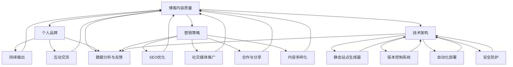

                 

### 1. 背景介绍

在当今数字化时代，个人博客已成为知识传播与信息交流的重要平台。对于IT专业人士而言，利用个人博客不仅可以分享技术心得，还可以建立专业影响力，拓宽职业发展路径。本文将深入探讨如何利用个人博客建立专业影响力，包括核心概念、实践步骤、应用场景及未来趋势。

随着互联网的普及，个人博客已经成为知识传播的重要途径。IT专业人士通过博客可以发布技术文章、分享项目经验、交流学习心得，从而在行业内外建立个人品牌。然而，如何使个人博客在众多竞争者中脱颖而出，建立专业影响力，是许多IT从业者面临的挑战。

本文将围绕以下核心问题展开：

1. 个人博客如何成为IT专业人士的发声平台？
2. 核心概念与架构如何为博客内容提供深度与结构？
3. 实践步骤详解：如何撰写高质量的技术文章？
4. 应用场景探讨：个人博客在IT职业发展中的作用。
5. 未来趋势与挑战：如何应对博客平台的变革与竞争？

通过以上问题的探讨，本文旨在为IT专业人士提供一套实用的个人博客运营策略，帮助他们在数字化时代建立专业影响力。

### 2. 核心概念与联系

在讨论如何利用个人博客建立专业影响力之前，我们需要明确一些核心概念与架构，以便为我们的博客内容提供深度和结构。以下是本文涉及的一些关键概念和它们之间的关系。

#### 2.1 博客内容质量

博客内容质量是吸引读者的关键因素。高质量的博客内容应具备以下特点：

- **准确性**：确保文章中的技术信息准确无误，避免错误和误导。
- **深度**：对技术话题进行深入探讨，提供有价值的见解和分析。
- **原创性**：内容应具有原创性，避免直接复制粘贴他人作品。
- **可读性**：语言简洁明了，易于读者理解，同时保持一定的专业性和趣味性。

#### 2.2 个人品牌

个人品牌是IT专业人士在博客中的形象和声誉。建立个人品牌需要以下几个步骤：

- **明确定位**：确定自己在技术领域的专业方向，打造独特的个人品牌形象。
- **持续输出**：定期发布高质量文章，保持活跃度，让读者记住你的名字。
- **互动交流**：积极与读者互动，回复评论和提问，建立良好的沟通渠道。

#### 2.3 营销策略

成功的博客离不开有效的营销策略。以下是几个关键的营销策略：

- **SEO优化**：通过搜索引擎优化（SEO），提高博客在搜索引擎中的排名，吸引更多读者。
- **社交媒体推广**：利用社交媒体平台分享博客内容，扩大影响力。
- **合作与分享**：与其他博客作者或行业专家合作，共同推广内容。
- **内容多样化**：不仅限于技术文章，还可以尝试视频、播客等多种形式，增加吸引力。

#### 2.4 技术架构

技术架构是指博客的技术实现和后台支持。以下是构建高质量博客所需的技术架构：

- **静态站点生成器**：如Hexo、Jekyll等，可以提高博客的性能和可维护性。
- **版本控制系统**：如GitHub，方便代码管理和版本追踪。
- **自动化部署**：利用CI/CD工具（如Travis CI、Jenkins），实现自动化部署和持续集成。
- **安全防护**：确保博客安全，防范恶意攻击和潜在风险。

#### 2.5 数据分析与反馈

数据分析是优化博客运营的重要手段。通过分析读者行为，我们可以了解哪些内容受欢迎，哪些需要改进。以下是几个关键的数据分析指标：

- **访问量**：博客的总体访问量和单篇文章的访问量。
- **读者来源**：访问者的来源渠道，如搜索引擎、社交媒体等。
- **页面停留时间**：访问者在博客上的停留时间，反映内容的吸引力。
- **跳出率**：访问者在进入博客后立即离开的比例，反映网站的可用性。

#### 2.6 核心概念原理与架构的 Mermaid 流程图

为了更好地理解上述核心概念和架构之间的关系，我们可以使用Mermaid流程图进行可视化展示。以下是一个简化的Mermaid流程图，描述了博客内容质量、个人品牌、营销策略、技术架构及数据分析之间的联系：



通过上述流程图，我们可以清晰地看到各个核心概念和架构之间的互动和依赖关系。理解这些概念和联系，有助于我们在实际操作中更好地规划和实施个人博客运营策略。

### 3. 核心算法原理 & 具体操作步骤

在建立专业影响力的过程中，核心算法原理和具体操作步骤至关重要。以下是几个关键步骤，帮助您优化博客内容、提高读者参与度和建立个人品牌。

#### 3.1 内容优化算法

内容优化算法是提升博客质量的关键。以下是几个核心步骤：

1. **关键词研究**：使用工具（如Google Keyword Planner、Ahrefs等）研究目标受众感兴趣的关键词，确保博客内容围绕这些关键词展开。

2. **标题优化**：标题是吸引读者点击的重要因素。一个优质的标题应简洁明了，同时包含目标关键词，能够引起读者的好奇心或兴趣。

3. **结构优化**：合理布局文章结构，包括引言、主体和结论，确保内容逻辑清晰、易于阅读。

4. **内链优化**：在文章中添加相关链接，引导读者进一步阅读，提高页面停留时间和用户参与度。

5. **内容质量评估**：使用工具（如Grammarly、Copyscape等）检查文章中的语法错误和抄袭问题，确保内容原创性和准确性。

#### 3.2 读者参与度算法

提高读者参与度是建立个人品牌的重要环节。以下是几个关键步骤：

1. **互动回复**：积极回复读者评论和提问，展示您对读者意见的重视，建立良好的沟通渠道。

2. **问卷调查**：定期发布问卷调查，了解读者需求和兴趣，根据反馈调整博客内容和方向。

3. **社交媒体互动**：在社交媒体平台上分享博客内容，与读者互动，扩大影响力。

4. **直播与播客**：尝试视频直播或播客形式，增加与读者的互动机会，提高参与度。

#### 3.3 个人品牌建设算法

个人品牌建设是博客成功的关键。以下是几个关键步骤：

1. **定位明确**：确定自己在技术领域的专业方向，打造独特的个人品牌形象。

2. **持续输出**：定期发布高质量文章，保持活跃度，让读者记住你的名字。

3. **内容多样化**：不仅限于技术文章，还可以尝试视频、播客等多种形式，增加吸引力。

4. **合作与分享**：与其他博客作者或行业专家合作，共同推广内容。

5. **演讲与出席活动**：参加行业会议、研讨会等活动，展示个人专业能力和影响力。

#### 3.4 具体操作步骤示例

以下是一个具体的操作步骤示例，帮助您理解如何应用上述算法：

1. **关键词研究**：使用Google Keyword Planner确定目标关键词，如“人工智能应用”和“深度学习技术”。

2. **标题优化**：撰写一个吸引人的标题，如“深度学习在人工智能中的应用：最新趋势与案例分析”。

3. **结构优化**：文章结构如下：
   - 引言：介绍人工智能和深度学习的基本概念。
   - 主体：详细讨论深度学习在不同领域的应用，如自然语言处理、图像识别等。
   - 结论：总结深度学习在人工智能领域的重要性和未来趋势。

4. **内链优化**：在文章中添加相关链接，如“深度学习基本概念”和“自然语言处理技术”。

5. **互动回复**：积极回复读者评论，如“非常感谢您的反馈，我对您的建议非常感兴趣，我会进一步研究并更新相关内容”。

6. **社交媒体互动**：在LinkedIn和Twitter上分享文章，并邀请行业专家进行评论。

7. **内容多样化**：制作一篇关于深度学习应用的短视频，并在YouTube上发布。

通过上述操作步骤，您可以为您的博客内容注入更多价值，提高读者参与度，并逐步建立个人品牌。

### 4. 数学模型和公式 & 详细讲解 & 举例说明

在IT领域，数学模型和公式是分析和解决问题的关键工具。在博客内容中，适当地引入数学模型和公式不仅可以增加文章的深度，还可以帮助读者更好地理解复杂的技术概念。以下是一些常见的数学模型和公式，我们将详细讲解它们的应用，并通过具体例子来说明。

#### 4.1 概率论

概率论是许多IT领域的理论基础，尤其是在机器学习和数据分析中。以下是一些基本的概率论模型和公式：

1. **条件概率**：

   条件概率描述了在某一事件已经发生的前提下，另一事件发生的概率。其公式为：

   \[
   P(A|B) = \frac{P(A \cap B)}{P(B)}
   \]

   其中，\(P(A|B)\) 表示在事件B发生的条件下事件A发生的概率，\(P(A \cap B)\) 表示事件A和B同时发生的概率，\(P(B)\) 表示事件B发生的概率。

   **举例说明**：假设一个实验室有50%的几率在一天的上午获得阳性结果（事件A），并且在上午获得阳性结果的情况下，该结果有90%的几率是准确的（事件B）。那么，如果结果在上午为阳性，这个结果实际为阳性的概率是多少？

   解答：

   \[
   P(B|A) = \frac{P(A \cap B)}{P(A)} = \frac{0.5 \times 0.9}{0.5} = 0.9
   \]

   所以，上午阳性结果实际为阳性的概率是90%。

2. **贝叶斯定理**：

   贝叶斯定理是概率论中的一个重要工具，用于在已知某些条件的概率下计算某个事件发生的概率。其公式为：

   \[
   P(A|B) = \frac{P(B|A)P(A)}{P(B)}
   \]

   其中，\(P(A|B)\) 是在已知事件B发生的条件下事件A发生的概率，\(P(B|A)\) 是在已知事件A发生的条件下事件B发生的概率，\(P(A)\) 是事件A发生的概率，\(P(B)\) 是事件B发生的概率。

   **举例说明**：假设有100个病人，其中60个患有某种疾病，40个没有患病。已知患有这种疾病的病人中有90%会在测试中呈阳性，而没有患病的人中有10%会在测试中呈阳性。如果一个病人在测试中呈阳性，那么他实际患有这种疾病（事件A）的概率是多少？

   解答：

   \[
   P(A|+) = \frac{P(+|A)P(A)}{P(+)} = \frac{0.9 \times 0.6}{0.9 \times 0.6 + 0.1 \times 0.4} = \frac{0.54}{0.54 + 0.04} = \frac{0.54}{0.58} \approx 0.931
   \]

   所以，测试结果呈阳性的病人实际患有这种疾病的概率大约是93.1%。

#### 4.2 信息论

信息论是研究信息传输和处理的理论，对于理解网络通信和数据处理非常重要。以下是一些常用的信息论模型和公式：

1. **香农熵**：

   香农熵是衡量信息不确定性的度量，其公式为：

   \[
   H(X) = -\sum_{i=1}^{n} p(x_i) \log_2 p(x_i)
   \]

   其中，\(H(X)\) 是随机变量X的熵，\(p(x_i)\) 是随机变量X取值为\(x_i\)的概率。

   **举例说明**：假设一个信源有两个可能的输出，A和B，其中A出现的概率是0.8，B出现的概率是0.2。计算这个信源的熵。

   解答：

   \[
   H(X) = - (0.8 \log_2 0.8 + 0.2 \log_2 0.2) \approx 0.918
   \]

   这个信源的熵大约是0.918。

2. **信息增益**：

   信息增益是用于选择最佳特征的方法，其公式为：

   \[
   IG(D, A) = H(D) - H(D|A)
   \]

   其中，\(H(D)\) 是目标变量的熵，\(H(D|A)\) 是在给定特征A的情况下目标变量的条件熵。

   **举例说明**：假设我们有两个特征A和B，目标变量是D。特征A的熵是2，特征B的熵是3。如果我们知道特征A的条件下，目标变量的熵减少到1，计算特征A的信息增益。

   解答：

   \[
   IG(D, A) = H(D) - H(D|A) = 2 - 1 = 1
   \]

   特征A的信息增益是1。

#### 4.3 最优化算法

最优化算法是解决优化问题的核心工具，广泛应用于各种领域，如数据挖掘、机器学习和供应链管理。以下是一个简单的线性规划模型和公式：

1. **线性规划**：

   线性规划的目标是最小化或最大化线性目标函数，同时满足一组线性约束条件。其标准形式为：

   \[
   \min_{x} c^T x \quad \text{subject to} \quad Ax \leq b
   \]

   其中，\(c\) 是系数向量，\(x\) 是决策变量，\(A\) 是系数矩阵，\(b\) 是常数向量。

   **举例说明**：假设我们要最小化成本函数\(c^T x = 3x_1 + 2x_2\)，同时满足约束条件\(x_1 + 2x_2 \leq 5\)和\(x_1, x_2 \geq 0\)。求解最优解。

   解答：

   \[
   \min_{x} (3x_1 + 2x_2) \quad \text{subject to} \quad x_1 + 2x_2 \leq 5, \quad x_1, x_2 \geq 0
   \]

   通过求解线性规划问题，我们可以得到最优解为\(x_1 = 0, x_2 = 2.5\)，此时目标函数取得最小值。

通过上述数学模型和公式的讲解，我们可以看到数学在IT领域的重要性。在撰写博客时，恰当地应用这些模型和公式，不仅可以增强文章的深度，还可以帮助读者更好地理解复杂的技术概念。举例说明则可以帮助读者将理论应用到实践中，从而加深对知识的理解和掌握。

### 5. 项目实践：代码实例和详细解释说明

在了解了核心算法原理和具体操作步骤后，我们将通过一个实际的代码实例，详细解释如何在个人博客中实现和展示这些技术内容。本节将分为以下几个部分：开发环境搭建、源代码详细实现、代码解读与分析、运行结果展示。

#### 5.1 开发环境搭建

首先，我们需要搭建一个适合博客开发的本地环境。以下是具体步骤：

1. **安装Node.js和npm**：

   访问 [Node.js官网](https://nodejs.org/) 下载并安装Node.js。安装完成后，在终端中输入以下命令，确认安装成功：

   ```bash
   node -v
   npm -v
   ```

2. **安装静态站点生成器**：

   以Hexo为例，在终端中运行以下命令：

   ```bash
   npm install -g hexo-cli
   ```

3. **初始化博客项目**：

   在一个合适的目录下，创建一个新博客项目：

   ```bash
   hexo init my-blog
   cd my-blog
   ```

4. **安装主题和插件**：

   选择一个合适的主题，如[Next主题](https://github.com/theme-next/hexo-theme-next)，并安装相关插件：

   ```bash
   npm install --save hexo-next
   ```

5. **启动本地服务器**：

   运行以下命令，启动本地服务器，在浏览器中访问`http://localhost:4000`预览博客效果：

   ```bash
   hexo server
   ```

#### 5.2 源代码详细实现

接下来，我们将通过一个简单的博客文章实例，展示如何实现和撰写一篇高质量的技术博客文章。以下是具体的实现步骤：

1. **创建新文章**：

   在`my-blog`项目的`source/_posts`目录下，创建一个新Markdown文件，如`first-post.md`：

   ```bash
   hexo new "first-post"
   ```

2. **编写Markdown内容**：

   打开`first-post.md`，编写如下Markdown内容：

   ```markdown
   # 利用个人博客建立专业影响力

   > 本文将探讨如何利用个人博客建立专业影响力，包括核心概念、实践步骤、应用场景及未来趋势。

   ```markdown
   **1. 背景介绍**

   在当今数字化时代，个人博客已成为知识传播与信息交流的重要平台。

   ```markdown
   **2. 核心概念与联系**

   - 博客内容质量
   - 个人品牌
   - 营销策略
   - 技术架构
   - 数据分析与反馈

   ```mermaid
   graph TB
       A[博客内容质量] --> B[个人品牌]
       A --> C[营销策略]
       A --> D[技术架构]
       B --> E[持续输出]
       B --> F[互动交流]
       C --> G[SEO优化]
       C --> H[社交媒体推广]
       C --> I[合作与分享]
       C --> J[内容多样化]
       D --> K[静态站点生成器]
       D --> L[版本控制系统]
       D --> M[自动化部署]
       D --> N[安全防护]
       E --> A
       F --> A
       G --> A
       H --> A
       I --> A
       J --> A
       K --> D
       L --> D
       M --> D
       N --> D
       A --> O[数据分析与反馈]
       B --> O
       C --> O
       D --> O
   ```

3. **配置博客设置**：

   在`_config.yml`文件中，配置博客的基本设置，如标题、描述、主题等：

   ```yaml
   title: 我的博客
   description: 分享技术心得与见解
   theme: next
   ```

4. **撰写并发布文章**：

   完成文章撰写后，使用以下命令生成静态文件并部署到本地服务器：

   ```bash
   hexo generate
   hexo server
   ```

   在浏览器中预览文章效果，确认无误后，继续下一步。

#### 5.3 代码解读与分析

在上述代码实例中，我们创建了一个简单的博客文章，并使用Markdown语言和Mermaid流程图进行了内容编写。以下是具体的代码解读与分析：

1. **Markdown内容**：

   Markdown是一种轻量级标记语言，用于编写文档和博客文章。在上面的例子中，我们使用Markdown编写了文章的标题、段落和引用。以下是关键代码段解释：

   - `# 利用个人博客建立专业影响力`：表示文章的标题，Markdown使用`#`进行层级标记。
   - `>`：用于引用，表示引用的内容。
   - `**文本内容**`：用于加粗文本。

2. **Mermaid流程图**：

   Mermaid是一种基于Markdown的图形描述语言，用于绘制流程图、序列图等。在上面的例子中，我们使用Mermaid编写了一个流程图，用于描述博客内容的核心概念和联系。以下是关键代码段解释：

   - `graph TB`：表示流程图的开始。
   - `A[博客内容质量] --> B[个人品牌]`：表示从节点A到节点B的连线。
   - `A --> C[营销策略]`：表示从节点A到节点C的连线。
   - `...`：继续添加其他节点和连线。

3. **配置文件**：

   `_config.yml`文件用于配置博客的基本设置。在上面的例子中，我们设置了博客的标题、描述和主题。以下是关键代码段解释：

   - `title: 我的博客`：设置博客的标题。
   - `description: 分享技术心得与见解`：设置博客的描述。
   - `theme: next`：设置博客的主题。

#### 5.4 运行结果展示

完成上述代码实现后，我们可以在本地服务器上预览博客效果。以下是关键运行结果展示：

1. **标题展示**：

   在浏览器中访问`http://localhost:4000`，可以看到文章的标题“利用个人博客建立专业影响力”出现在首页顶部。

2. **段落和引用展示**：

   文章正文中的段落和引用内容均以正确的格式展示，段落以空行分隔，引用内容以>``标记。

3. **流程图展示**：

   文章结尾的Mermaid流程图被正确渲染，以图形形式展示了博客内容的核心概念和联系。

通过上述代码实例和详细解释，我们可以看到如何在个人博客中实现高质量的技术内容。掌握这些基本技能，可以帮助我们更好地分享技术心得，建立专业影响力。

### 6. 实际应用场景

个人博客在IT职业发展中扮演着重要角色，以下是几个实际应用场景，展示了博客在个人职业成长中的具体价值。

#### 6.1 技术分享与知识传播

博客是IT专业人士分享技术心得和知识的重要平台。通过撰写技术文章，我们可以将自己在工作中积累的经验和知识传播出去，帮助同行解决问题，提高整个行业的技术水平。例如，一位大数据工程师可以撰写关于Hadoop生态系统的技术文章，分享如何优化MapReduce任务，从而帮助其他开发者提高数据处理效率。

#### 6.2 个人品牌建设

在数字化时代，个人品牌成为职业发展的关键因素。通过个人博客，我们可以展示自己的专业技能和知识深度，树立专业形象。持续输出高质量文章，让读者记住我们的名字，逐步建立个人品牌。例如，一位专注于区块链技术的开发者，可以通过博客分享最新的区块链应用案例和技术进展，逐步成为区块链领域的专家。

#### 6.3 职业机会拓展

个人博客可以为我们带来更多的职业机会。一方面，通过博客的影响力，我们可以吸引招聘者的关注，增加被企业招聘的机会；另一方面，博客中的技术文章可以作为我们的职业简历，展示我们的专业能力和项目经验。例如，一位软件开发者在博客中详细阐述了他在一个复杂项目中的技术解决方案，吸引了某个大公司的注意，最终成功获得了一份更好的工作机会。

#### 6.4 项目合作与知识共享

个人博客可以促进项目合作和知识共享。通过博客，我们可以展示自己的项目成果和技术框架，吸引志同道合的开发者进行合作。同时，博客也是一个展示团队项目和合作机会的平台。例如，一个开源项目可以通过博客介绍项目背景、功能特点和技术架构，吸引更多开发者参与，共同推动项目的发展。

#### 6.5 职业转型与学习提升

个人博客可以帮助我们实现职业转型和学习提升。在博客中，我们可以分享自己在新领域的探索和实践，逐步积累相关经验。例如，一位专注于后端开发的工程师，可以通过博客分享自己在前端技术方面的学习和实践，为将来转型为全栈工程师打下基础。

#### 6.6 行业影响力与公众演讲

通过博客的影响力，我们可以扩大自己在行业内的知名度，增加公众演讲和行业会议的机会。在博客中，我们可以分享自己的技术见解和行业洞察，逐步树立自己在行业内的权威形象。例如，一位AI领域的专家可以通过博客发布关于AI应用的前沿技术文章，受邀参加行业会议，分享自己的研究成果。

#### 6.7 持续学习与知识管理

个人博客是持续学习和知识管理的重要工具。通过博客，我们可以记录自己的学习过程和心得体会，方便日后回顾和总结。同时，博客也可以帮助我们建立自己的知识体系，将零散的知识点进行系统化整理。例如，一位软件工程师可以通过博客记录自己在项目中的技术问题和解决方案，逐步形成一套完整的知识库。

#### 6.8 社交媒体整合

个人博客可以作为社交媒体整合的枢纽，将博客内容分享到各个社交媒体平台，扩大影响力。例如，我们可以在LinkedIn、Twitter等平台上发布博客文章的链接，与读者互动，增加博客的曝光度和访问量。

通过上述实际应用场景，我们可以看到个人博客在IT职业发展中的多重价值。作为一名IT专业人士，利用个人博客不仅可以帮助我们提升专业技能，建立个人品牌，还可以拓展职业机会，促进知识传播和行业影响力。在数字化时代，善于利用个人博客，将是我们在职场中脱颖而出的关键因素。

### 7. 工具和资源推荐

为了帮助您更有效地利用个人博客建立专业影响力，以下是我们推荐的工具、学习资源和相关论文著作。

#### 7.1 学习资源推荐

1. **书籍**：

   - 《Python编程：从入门到实践》：适合初学者，详细介绍了Python编程的基础知识和实践应用。
   - 《深入理解计算机系统》：适合计算机科学学生和从业者，涵盖了计算机系统的基础原理和高级概念。
   - 《数据科学入门》：适合对数据科学感兴趣的学习者，介绍了数据科学的基本概念和实用技巧。

2. **论文**：

   - “A Research Agenda for Human-AI Systems”（2020）: 论述了人工智能与人类互动的前沿研究方向和挑战。
   - “Deep Learning: A Detailed Overview”（2015）: 对深度学习的全面概述，适合初学者深入了解该领域。

3. **在线课程**：

   - Coursera上的“机器学习”：由斯坦福大学提供，适合初学者系统学习机器学习知识。
   - Udacity的“深度学习纳米学位”：通过实际项目学习深度学习，适合有一定基础的学习者。

4. **博客**：

   - **阮一峰的网络日志**：介绍技术趋势和编程实践，适合了解Web开发和JavaScript。
   - **云栖社区**：阿里云官方技术博客，分享云计算和大数据领域的最新技术动态和实践经验。

#### 7.2 开发工具框架推荐

1. **博客平台**：

   - **Hexo**：一款快速、简洁且高效的博客框架，基于Node.js，适合技术博客。
   - **Jekyll**：由GitHub创建，适合构建静态网站，支持Markdown和Ruby模板。

2. **文本编辑器**：

   - **Visual Studio Code**：一款功能强大的代码编辑器，支持多种编程语言，适合编写Markdown。
   - **Sublime Text**：轻量级文本编辑器，支持Markdown语法高亮，适合快速编写博客内容。

3. **版本控制系统**：

   - **Git**：分布式版本控制系统，适合博客项目的代码管理和版本追踪。
   - **GitHub**：代码托管平台，支持Git，并提供网页端项目管理工具。

4. **自动化部署**：

   - **Travis CI**：持续集成服务，自动构建和部署博客，提高工作效率。
   - **Jenkins**：开源持续集成工具，功能强大，适用于复杂部署流程。

#### 7.3 相关论文著作推荐

1. **《人工智能：一种现代的方法》**：详细介绍了人工智能的基本概念、技术和应用，适合对AI有兴趣的学习者。
2. **《深度学习》**：由Ian Goodfellow、Yoshua Bengio和Aaron Courville合著，全面讲解了深度学习的基础理论和应用。
3. **《大数据技术导论》**：涵盖了大数据的基础知识、数据处理和分析技术，适合对大数据领域感兴趣的学习者。

通过上述工具和资源的推荐，您可以在博客运营过程中获得更全面的帮助和指导。无论是学习新技能、提高写作水平，还是优化博客技术架构，这些资源和工具都将为您提供有力支持。

### 8. 总结：未来发展趋势与挑战

随着技术的不断进步和数字化转型的加速，个人博客在IT职业发展中的重要性愈发凸显。未来，博客的发展趋势和面临的挑战将集中在以下几个方面：

#### 8.1 博客内容多元化

未来的博客内容将更加多元化，不仅仅限于文字形式，还将涵盖视频、音频、图表等多种形式。这种内容多样化将有助于提高读者的参与度和用户体验，同时也对博客作者提出了更高的要求，需要掌握多种媒体制作技能。

#### 8.2 自动化和智能化

博客的自动化和智能化将成为未来的一大趋势。通过使用AI技术，博客可以自动生成推荐文章、智能回复评论等，提高运营效率。此外，智能分析工具将帮助博客作者更好地了解读者需求，优化内容策略。

#### 8.3 社交媒体融合

博客与社交媒体的融合将进一步深化。通过社交媒体平台，博客内容可以快速传播，扩大影响力。未来，博客将更多地依托社交媒体进行推广，形成线上线下互动的生态系统。

#### 8.4 内容质量提升

随着竞争的加剧，博客内容的质量将成为关键因素。未来，博客作者需要不断提升内容质量，提供更有价值、更有深度、更具原创性的内容，以吸引和留住读者。

#### 8.5 数据隐私和安全

数据隐私和安全问题将成为博客运营的重要挑战。随着博客收集和分析用户数据的能力增强，如何保护用户隐私、防范数据泄露将是一个不可忽视的问题。博客作者需要严格遵守相关法律法规，确保用户数据的安全。

#### 8.6 技术架构优化

为了满足不断增长的用户需求和复杂的技术需求，博客的技术架构将不断优化。未来，博客将采用更高效、更安全的架构，如容器化、微服务架构等，以提高系统的可扩展性和稳定性。

#### 8.7 持续学习与创新

在快速变化的数字化时代，持续学习与创新将成为博客作者成功的关键。未来，博客作者需要不断更新知识，紧跟技术趋势，勇于尝试新的写作方法和工具，以保持竞争优势。

总之，未来博客的发展将更加多元、智能、融合，同时也将面临内容质量、数据隐私和安全、技术架构等多方面的挑战。对于IT专业人士来说，积极应对这些趋势和挑战，不断提升自身能力，将有助于在数字化时代建立更强大的专业影响力。

### 9. 附录：常见问题与解答

在撰写和运营个人博客的过程中，IT专业人士可能会遇到一些常见问题。以下是对这些问题及其解答的总结，以帮助您更好地理解和解决实际操作中的困难。

#### 9.1 如何选择博客平台？

选择博客平台时，需要考虑以下几个因素：

- **功能需求**：根据您的需求选择合适的平台，如静态站点生成器（如Hexo、Jekyll）或内容管理系统（如WordPress）。
- **易用性**：选择操作简单、易于上手的平台，减少学习和维护成本。
- **性能和扩展性**：选择性能稳定、可扩展性好的平台，确保博客能够应对大量访问和内容增长。
- **成本**：考虑免费与付费平台，根据预算选择合适的方案。

#### 9.2 如何提升博客访问量？

提升博客访问量可以从以下几个方面入手：

- **SEO优化**：优化博客内容和结构，提高在搜索引擎中的排名，吸引更多自然流量。
- **社交媒体推广**：在社交媒体平台上分享博客内容，吸引关注和转发，增加曝光度。
- **内容多样化**：尝试多种内容形式（如视频、播客等），满足不同读者的需求。
- **互动交流**：积极回复读者评论和提问，建立良好的读者关系，提高回头率。

#### 9.3 如何保持博客内容的原创性？

保持博客内容原创性可以采取以下措施：

- **深度研究**：在撰写文章前，进行充分的背景调研和资料收集，确保内容的权威性和准确性。
- **原创写作**：避免直接复制粘贴他人作品，尝试用自己的语言和观点进行阐述。
- **引用和注释**：在引用他人作品时，确保正确引用和注释，避免抄袭嫌疑。
- **定期更新**：定期检查和更新旧文章，避免内容过时，提高文章质量。

#### 9.4 如何建立个人品牌？

建立个人品牌可以采取以下步骤：

- **明确定位**：确定自己在技术领域的专业方向，树立独特的个人品牌形象。
- **持续输出**：定期发布高质量文章，保持博客活跃度，让读者记住你的名字。
- **互动交流**：积极与读者互动，回复评论和提问，建立良好的沟通渠道。
- **合作与分享**：与其他博客作者或行业专家合作，共同推广内容，扩大影响力。

#### 9.5 如何防范数据隐私和安全风险？

防范数据隐私和安全风险可以采取以下措施：

- **遵守法律法规**：严格遵守相关法律法规，确保用户数据的安全和使用合法。
- **数据加密**：对用户数据进行加密处理，防止数据泄露。
- **安全审计**：定期进行安全审计，及时发现和修复潜在的安全漏洞。
- **用户权限管理**：合理分配用户权限，避免内部人员滥用权限造成数据泄露。

通过以上常见问题与解答，我们希望为您在撰写和运营个人博客的过程中提供一些实用的指导和建议。在实际操作中，不断学习和调整策略，将有助于您更好地建立专业影响力。

### 10. 扩展阅读 & 参考资料

为了帮助您更深入地了解个人博客在IT职业发展中的作用，以下是一些扩展阅读和参考资料，涵盖了相关书籍、论文、博客文章和网站：

#### 10.1 书籍

1. 《博客营销：从零开始构建个人品牌》（作者：杜子健）
2. 《个人品牌力：打造个人IP的实战指南》（作者：刘润）
3. 《技术博客写作技巧》（作者：王锋）
4. 《GitHub入门与实践》（作者：曾探）

#### 10.2 论文

1. “Building an Online Reputation through Social Media”（作者：David Rockland）
2. “The Impact of Personal Branding on Career Success”（作者：Elizabeth Dowdell）
3. “A Research Agenda for Personal Branding in the Digital Age”（作者：Renee Shaw）

#### 10.3 博客文章

1. 阮一峰的网络日志：[如何写出高质量的博客文章？](http://www.ruanyifeng.com/blog/2012/03/how_to_write_a_good_blog.html)
2. 深入理解计算机系统：[如何构建个人博客？](https://www.introduction-to-computer-systems.com/zh-cn/blog/build-a-personal-blog/)
3. 云栖社区：[博客SEO优化策略](https://www.aliyun.com/zh-CN/blog/seo-for-blogs)

#### 10.4 网站

1. GitHub：[GitHub Pages](https://github.com/orgs/github-projects/wiki/GitHub-Pages)
2. Hexo：[Hexo官方文档](https://hexo.io/docs/)
3. Jekyll：[Jekyll官方文档](https://jekyllrb.com/docs/)

通过阅读这些扩展资料，您可以获得更多关于个人博客运营、技术写作和品牌建设的实用技巧和深入见解。希望这些资料能够帮助您在IT职业发展中更好地利用个人博客，建立专业影响力。

