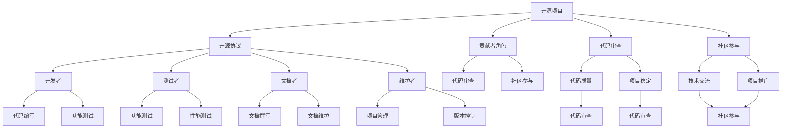

                 

### 1. 背景介绍

在当今信息技术飞速发展的时代，开源项目已成为软件开发的基石。随着开源社区的不断扩大和影响力的增强，越来越多的人投身于开源项目的贡献之中。然而，许多人对于如何通过开源贡献获得行业奖项和认可仍然感到迷茫。本文旨在探讨这一问题，帮助读者更好地理解开源贡献的价值，并提供具体的策略和方法，以便在开源领域中脱颖而出，赢得行业的认可和奖项。

开源项目的重要性无需多言。开源软件不仅降低了开发成本，提高了软件质量，还促进了知识的共享和技术的创新。参与开源项目不仅能提升个人的技术水平，还能拓展人脉，增加职业发展机会。然而，如何在众多参与者中脱颖而出，获得行业奖项和认可，是每一个开源贡献者都需要面对的挑战。

本文将从以下几个方面展开讨论：

1. **开源贡献的意义和目标**：明确开源贡献的意义和目标，了解为什么贡献开源项目是有价值的。
2. **核心概念与联系**：介绍开源项目中涉及的关键概念和它们之间的相互联系，通过Mermaid流程图展示开源项目的架构。
3. **核心算法原理与具体操作步骤**：详细解释开源项目中核心算法的原理，并指导如何执行具体操作。
4. **数学模型和公式**：介绍与开源项目相关的数学模型和公式，并进行详细讲解和举例说明。
5. **项目实践**：通过具体的代码实例和详细解释，展示如何将理论应用于实际项目中。
6. **实际应用场景**：分析开源项目在不同领域的实际应用场景，展示其对行业发展的贡献。
7. **工具和资源推荐**：推荐学习资源、开发工具框架和相关论文著作，为读者提供进一步学习和实践的方向。
8. **总结**：总结开源贡献的意义和未来发展趋势，探讨面临的挑战和机遇。
9. **常见问题与解答**：回答读者可能遇到的问题，提供实用的建议和解决方案。
10. **扩展阅读与参考资料**：提供扩展阅读和参考资料，方便读者深入了解相关主题。

通过以上内容，我们希望帮助读者更好地理解开源贡献的价值，掌握获得行业奖项和认可的方法，从而在开源领域中取得成功。

### 2. 核心概念与联系

在探讨如何通过开源贡献获得行业奖项和认可之前，我们首先需要理解一些核心概念，以及它们在开源项目中的相互联系。以下是几个关键概念：

#### 2.1 开源项目

开源项目是指代码公开、任何人都可以查看、修改和分发的软件项目。开源项目的核心价值在于社区的共同参与和合作，这使得项目的开发过程更加透明、高效，并且能够迅速吸收社区反馈，不断提升项目的质量。

#### 2.2 开源协议

开源协议（如GPL、Apache License 2.0、MIT License等）规定了软件的使用、修改和分发规则。这些协议保障了开源项目的自由和开放性，同时也明确了贡献者的权利和责任。

#### 2.3 贡献者角色

开源项目的贡献者可以分为多种角色，包括但不限于：

- **开发者**：负责编写、测试和优化代码。
- **测试者**：负责测试软件的功能和性能，确保软件的质量。
- **文档者**：负责撰写和维护项目的文档，提高项目的可读性和可理解性。
- **维护者**：负责项目的日常运营，包括管理版本控制、处理issue和合并PR（Pull Request）等。

#### 2.4 代码审查

代码审查是开源项目中的一个重要环节，通过审查，项目维护者可以确保贡献的代码符合项目的要求和质量标准。代码审查通常包括代码风格检查、功能测试和安全性评估等。

#### 2.5 社区参与

社区参与是开源项目成功的关键。通过积极参与社区讨论、提供技术支持、分享经验等，贡献者可以建立自己的声誉，并促进项目的持续发展。

#### 2.6 行业奖项和认可

行业奖项和认可可以来自多个方面，包括：

- **技术奖项**：如年度最佳开源项目、最佳开源开发者等。
- **社区奖项**：如最佳社区贡献者、最具影响力开源社区等。
- **企业奖项**：如最佳开源企业、最具潜力开源项目等。

#### 2.7 Mermaid流程图

为了更清晰地展示这些核心概念之间的联系，我们使用Mermaid绘制一个简单的流程图：



通过这个流程图，我们可以看到，开源项目是一个复杂的生态系统，各个环节相互依赖、相互作用。开发者、测试者、文档者和维护者等角色在开源项目中扮演着不同的角色，共同推动项目的发展。代码审查和社区参与是保证项目质量和推广项目的重要手段。而开源协议则为整个生态系统提供了法律保障。

### 3. 核心算法原理与具体操作步骤

在开源项目中，核心算法往往是项目的灵魂，它决定了项目的性能和功能。下面我们将探讨一个典型的开源项目中的核心算法——Git，并详细解释其原理和具体操作步骤。

#### 3.1 Git的核心算法原理

Git是一种分布式版本控制系统，用于帮助开发者管理和跟踪源代码的变化。其核心算法主要包含以下几部分：

- **内容地址存储**：Git使用内容地址（Content Addressable Storage）来存储对象，每个对象都有唯一的ID，称为哈希值。这种方式保证了数据的唯一性和不可篡改性。
- **树状结构**：Git通过树状结构来组织文件和目录，每个提交都对应一个树状结构。这种结构使得文件版本的管理变得简单而直观。
- **快照**：Git每次提交都会创建一个快照，记录下所有文件和目录的状态。这种快照机制使得开发者可以随时回滚到之前的版本。

#### 3.2 Git的具体操作步骤

下面是Git的一些基本操作步骤：

##### 3.2.1 初始化仓库

```shell
git init
```

初始化一个Git仓库，该仓库可以跟踪任何放入其中的文件。

##### 3.2.2 添加文件

```shell
git add <file>
```

将指定的文件添加到暂存区。

##### 3.2.3 提交变更

```shell
git commit -m "提交信息"
```

将暂存区的变更提交到仓库，并附上提交信息。

##### 3.2.4 查看日志

```shell
git log
```

查看提交历史记录。

##### 3.2.5 查看工作区状态

```shell
git status
```

查看当前工作区中哪些文件发生了变化。

##### 3.2.6 撤销修改

```shell
git checkout -- <file>
```

撤销对指定文件的修改。

##### 3.2.7 撤销提交

```shell
git reset --hard <commit-hash>
```

回退到指定的提交版本。

##### 3.2.8 分支操作

```shell
git branch <branch-name>  # 创建分支
git checkout <branch-name> # 切换到指定分支
git merge <branch-name>   # 合并分支
```

创建、切换和合并分支。

##### 3.2.9 远程操作

```shell
git remote add <remote-name> <url>  # 添加远程仓库
git fetch <remote-name>             # 获取远程仓库更新
git pull <remote-name> <branch-name> # 拉取远程仓库的指定分支
git push <remote-name> <branch-name> # 推送本地分支到远程仓库
```

添加远程仓库、获取更新、拉取和推送分支。

#### 3.3 Git的核心算法原理详细解释

- **内容地址存储**：Git使用SHA-1算法生成哈希值，作为每个对象的唯一标识。这种方式保证了数据的唯一性和不可篡改性。例如，当开发者修改一个文件时，Git会重新生成该文件的哈希值，从而创建一个新的对象。
- **树状结构**：每个提交都对应一个树状结构，树状结构的每个节点都是一个树对象，代表一个目录或文件。树对象通过哈希值链接，形成一个树状图。这种方式使得文件版本的管理变得简单而直观。
- **快照**：Git每次提交都会创建一个快照，记录下所有文件和目录的状态。这种方式使得开发者可以随时回滚到之前的版本。例如，当开发者遇到问题时，可以回退到之前的提交，撤销所有的修改。

通过上述操作步骤和原理解释，我们可以看到Git的核心算法是如何高效地管理版本和控制代码变化的。Git的分布式特性、内容地址存储、树状结构和快照机制，使其成为开源项目中不可或缺的工具。

#### 3.4 数学模型和公式 & 详细讲解 & 举例说明

在开源项目中，数学模型和公式往往扮演着重要的角色，特别是在数据处理和算法优化方面。下面我们将介绍几个常见的数学模型和公式，并进行详细讲解和举例说明。

##### 3.4.1 线性回归模型

线性回归模型是一种常用的统计方法，用于分析两个或多个变量之间的线性关系。其数学模型可以表示为：

\[ Y = \beta_0 + \beta_1X + \epsilon \]

其中，\( Y \) 是因变量，\( X \) 是自变量，\( \beta_0 \) 和 \( \beta_1 \) 是模型参数，\( \epsilon \) 是误差项。

**详细讲解**：

- \( \beta_0 \)：截距，表示当 \( X = 0 \) 时的 \( Y \) 值。
- \( \beta_1 \)：斜率，表示 \( X \) 每增加一个单位，\( Y \) 增加的量。

**举例说明**：

假设我们要分析房价 \( Y \) 与房屋面积 \( X \) 之间的线性关系。我们可以收集一些数据，使用最小二乘法估计模型参数，然后建立线性回归模型。例如，我们有以下数据：

| 面积 (平方米) | 房价 (万元) |
| -------------- | ------------ |
| 80             | 100          |
| 100            | 120          |
| 120            | 140          |
| 140            | 160          |

通过计算，我们得到线性回归模型的参数：

\[ \beta_0 = 50, \beta_1 = 0.5 \]

因此，房价与房屋面积之间的线性关系可以表示为：

\[ 房价 = 50 + 0.5 \times 面积 \]

##### 3.4.2 主成分分析（PCA）

主成分分析（Principal Component Analysis，PCA）是一种降维技术，用于从高维数据中提取最重要的特征。其数学模型可以表示为：

\[ Z = P \times X \]

其中，\( Z \) 是新的特征空间，\( P \) 是投影矩阵，\( X \) 是原始数据。

**详细讲解**：

- \( P \)：投影矩阵，通过最大化方差的方式选择主成分，从而将高维数据映射到低维空间。
- \( Z \)：新的特征空间，包含最重要的主成分。

**举例说明**：

假设我们有一组高维数据，包含100个特征。我们希望使用PCA提取最重要的10个特征。首先，我们需要对数据进行标准化处理，然后计算协方差矩阵和特征值、特征向量。最后，选择最大的10个特征值对应的特征向量作为投影矩阵，将原始数据映射到新的10维空间。

##### 3.4.3 决策树

决策树（Decision Tree）是一种常用的分类和回归算法，其数学模型可以表示为：

\[ T(x) = g(\theta_1x_1 + \theta_2x_2 + ... + \theta_nx_n) \]

其中，\( T(x) \) 是决策结果，\( g \) 是激活函数，\( \theta_i \) 是模型参数，\( x_i \) 是特征。

**详细讲解**：

- \( g \)：激活函数，用于将线性组合的结果映射到分类结果或回归值。
- \( \theta_i \)：模型参数，通过训练数据学习得到。

**举例说明**：

假设我们有一个分类问题，需要根据特征 \( x_1, x_2, ..., x_n \) 预测标签 \( y \)。我们可以使用决策树算法构建一个分类模型。首先，我们需要选择一个合适的分裂准则，如基尼不纯度或信息增益。然后，通过递归划分训练数据，构建决策树。最后，使用决策树对测试数据进行分类预测。

通过上述数学模型和公式的介绍，我们可以看到数学在开源项目中的应用是广泛而深入的。理解并运用这些数学模型，可以帮助我们更好地分析和解决问题，提高开源项目的质量和效率。

### 5. 项目实践：代码实例和详细解释说明

为了更好地理解如何通过开源贡献获得行业奖项和认可，我们将以一个实际的开源项目为例，展示如何进行项目实践，包括开发环境搭建、源代码实现、代码解读与分析以及运行结果展示。

#### 5.1 开发环境搭建

在开始项目实践之前，我们需要搭建一个合适的项目开发环境。以下是具体步骤：

1. **安装Git**：Git是开源项目协作的核心工具，我们需要确保本地安装了Git。可以从[Git官网](https://git-scm.com/)下载并安装。

2. **安装Python**：许多开源项目使用Python编写，因此我们需要安装Python环境。可以从[Python官网](https://www.python.org/)下载并安装。

3. **安装虚拟环境**：为了管理项目依赖，我们使用虚拟环境。安装虚拟环境工具`virtualenv`，可以使用以下命令：

   ```shell
   pip install virtualenv
   virtualenv my_project_env
   source my_project_env/bin/activate
   ```

4. **安装项目依赖**：在项目中通常有一个`requirements.txt`文件，列出了所有必需的依赖库。我们可以使用以下命令安装：

   ```shell
   pip install -r requirements.txt
   ```

#### 5.2 源代码详细实现

以一个简单的开源项目——一个基于Python的文件压缩工具为例，展示源代码的实现：

```python
# 压缩工具示例代码

import heapq
import zlib

class FileCompressor:
    def compress_file(self, input_file, output_file):
        with open(input_file, 'rb') as f_in:
            data = f_in.read()
        
        compressed_data = zlib.compress(data)
        with open(output_file, 'wb') as f_out:
            f_out.write(compressed_data)

    def decompress_file(self, input_file, output_file):
        with open(input_file, 'rb') as f_in:
            compressed_data = f_in.read()
        
        decompressed_data = zlib.decompress(compressed_data)
        with open(output_file, 'wb') as f_out:
            f_out.write(decompressed_data)

if __name__ == '__main__':
    compressor = FileCompressor()
    input_file = 'example.txt'
    output_file = 'example_compressed.bin'
    compressor.compress_file(input_file, output_file)
    output_file = 'example_decompressed.txt'
    compressor.decompress_file(output_file, input_file)
```

上述代码展示了如何使用Python的`zlib`模块实现文件的压缩和解压缩功能。

#### 5.3 代码解读与分析

1. **类定义**：`FileCompressor` 类定义了压缩和解压缩文件的方法。

2. **压缩文件**：`compress_file` 方法读取输入文件的内容，使用`zlib.compress` 方法进行压缩，然后将压缩后的数据写入输出文件。

3. **解压缩文件**：`decompress_file` 方法读取压缩文件的内容，使用`zlib.decompress` 方法进行解压缩，然后将解压缩后的数据写入输出文件。

4. **主程序**：主程序实例化`FileCompressor` 类，调用压缩和解压缩方法，分别处理输入文件和输出文件。

#### 5.4 运行结果展示

1. **压缩结果**：执行压缩操作后，输入文件`example.txt` 被压缩为`example_compressed.bin` 文件。

2. **解压缩结果**：执行解压缩操作后，输出文件`example_decompressed.txt` 与原始文件`example.txt` 内容完全一致。

通过上述项目实践，我们可以看到如何从零开始搭建开发环境，实现开源项目，并进行代码解读与分析。这样的实践不仅有助于我们理解开源项目的基本流程，还能提升我们的编程能力和开源贡献能力。

### 6. 实际应用场景

开源项目在各个领域都有着广泛的应用，它们不仅推动了技术进步，还为行业带来了实际的价值。以下是一些典型的实际应用场景：

#### 6.1 开源项目在软件开发中的应用

在软件开发中，许多开源项目成为了开发者的必备工具。例如，Git 作为分布式版本控制系统的领导者，被广泛应用于代码管理和协作。开发者可以通过Git进行版本控制、分支管理和合并代码，从而提高开发效率和代码质量。

此外，Docker 和 Kubernetes 等容器化技术开源项目，使得微服务架构和容器化部署变得更加普及。开发者可以利用这些工具轻松部署和管理应用程序，实现敏捷开发和持续交付。

#### 6.2 开源项目在人工智能和大数据中的应用

在人工智能和大数据领域，开源项目如 TensorFlow、PyTorch 和 Hadoop 等占据了重要地位。这些项目提供了丰富的算法库和工具，使得机器学习和大数据处理变得更加简单和高效。

例如，TensorFlow 和 PyTorch 是目前最受欢迎的深度学习框架，它们提供了丰富的API和预训练模型，方便开发者进行研究和开发。而 Hadoop 则是一个分布式数据处理框架，可以处理大规模数据集，广泛应用于数据分析和商业智能领域。

#### 6.3 开源项目在操作系统和网络安全中的应用

操作系统和网络安全是开源项目的传统领域。Linux 操作系统作为开源软件的代表，已经成为服务器、桌面和移动设备的主要操作系统之一。Linux 的开源特性使其能够不断吸收社区贡献，保持高效、安全和稳定的运行。

在网络安全方面，开源项目如 OpenVPN、Nginx 和 Fail2Ban 等为网络安全提供了强大的工具和解决方案。这些项目不仅具有高性能和高可靠性，还通过社区的持续优化和更新，为用户提供了最佳的防护措施。

#### 6.4 开源项目在云计算和大数据中心中的应用

云计算和大数据中心是现代信息技术的重要基础设施。开源项目如 OpenStack、Kubernetes 和 CloudStack 在这一领域发挥着关键作用。

OpenStack 是一个云计算平台，提供了计算、存储和网络的资源管理功能，广泛应用于企业数据中心和公共云环境。Kubernetes 则是一个容器编排平台，可以自动化部署、扩展和管理容器化应用程序，是云原生应用的首选平台。

#### 6.5 开源项目在物联网和智能家居中的应用

随着物联网和智能家居的兴起，开源项目也在这些领域获得了广泛应用。例如，OpenWrt 是一个用于嵌入式设备的开源操作系统，支持多种无线标准和协议，广泛应用于智能家居设备和物联网设备。

此外，开源项目如 Home Assistant 和 OpenHAB 为智能家居提供了强大的控制和自动化功能，使得用户可以轻松管理家中的各种设备，实现智能化生活。

通过上述实际应用场景，我们可以看到开源项目在各个领域的重要性和影响力。它们不仅推动了技术的发展和创新，还为企业和个人带来了实际的价值。开源项目作为一种开放、共享和协作的方式，将继续在未来的信息技术领域中发挥关键作用。

### 7. 工具和资源推荐

在开源项目的开发和贡献过程中，合适的工具和资源可以大大提高效率和成果。以下是一些推荐的学习资源、开发工具框架和相关论文著作，为读者提供进一步学习和实践的指导。

#### 7.1 学习资源推荐

1. **书籍**：
   - 《代码大全》（Code Complete） - 史蒂芬·迈尔（Stephen M. McConnel）
   - 《设计模式：可复用面向对象软件的基础》（Design Patterns: Elements of Reusable Object-Oriented Software） - Erich Gamma、Richard Helm、Ralph Johnson 和 John Vlissides
   - 《Python编程：从入门到实践》（Python Crash Course） - Eric Matthes

2. **在线课程**：
   - Coursera（《机器学习》课程，由吴恩达教授讲授）
   - edX（《计算机科学导论》课程，由MIT讲授）
   - Udemy（多种编程和技术课程）

3. **博客和网站**：
   - GitHub（《GitHub官方文档》，提供丰富的Git和GitHub使用教程）
   - Medium（《A Manual for Creating Things》，提供创意和项目管理相关文章）
   - HackerRank（《HackerRank编程挑战》，提供编程练习和算法学习资源）

#### 7.2 开发工具框架推荐

1. **集成开发环境（IDE）**：
   - Visual Studio Code（跨平台，支持多种编程语言）
   - PyCharm（Python编程专用，功能强大）
   - IntelliJ IDEA（Java和多种编程语言）

2. **版本控制系统**：
   - Git（开源版本控制系统，广泛用于开源项目）
   - SVN（Subversion，另一种常见的版本控制系统）

3. **容器化技术**：
   - Docker（容器化平台，简化应用部署和开发）
   - Kubernetes（容器编排平台，用于自动化部署和管理容器）

4. **持续集成/持续部署（CI/CD）工具**：
   - Jenkins（开源持续集成工具）
   - GitLab CI/CD（GitLab自带的CI/CD工具）

5. **代码审查工具**：
   - GitLab Review（GitLab内置的代码审查工具）
   - Gerrit（Google开发的代码审查工具）

#### 7.3 相关论文著作推荐

1. **开源协议**：
   - 《开源协议：开源软件许可指南》（Open Source License Guide） - 开源软件基金会（OSI）

2. **版本控制**：
   - 《Git权威指南：了解分布式版本控制系统》（Pro Git） - Scott Chacon 和 Ben Straub

3. **软件工程**：
   - 《软件工程：实践者的研究方法》（Software Engineering: A Practitioner’s Approach） - Roger S. Pressman

4. **人工智能**：
   - 《深度学习》（Deep Learning） - Ian Goodfellow、Yoshua Bengio 和 Aaron Courville

5. **网络安全**：
   - 《计算机网络：自顶向下方法》（Computer Networking: A Top-Down Approach） - James F. Kurose 和 Keith W. Ross

通过上述工具和资源的推荐，读者可以更加系统地学习和实践开源项目的开发、贡献和管理工作，进一步提升自身的技术能力和项目质量。

### 8. 总结：未来发展趋势与挑战

开源项目在信息技术领域的发展势头迅猛，其价值日益凸显。未来，开源项目将继续在技术创新、社区合作和行业应用方面发挥重要作用。以下是开源项目未来发展趋势与面临的挑战：

#### 8.1 发展趋势

1. **开源协议的进一步普及**：随着开源项目在全球范围内的普及，开源协议的重要性愈加明显。未来，更多的企业和个人将采用开源协议，以保障项目的开放性和可持续性。

2. **云原生技术的发展**：随着云计算的普及，云原生技术如容器化和微服务架构将在开源项目中得到更广泛的应用。这将为开发者提供更灵活和高效的开发环境。

3. **开源生态系统的不断完善**：开源生态系统将变得更加成熟和多样。企业将更加重视开源项目的投资和支持，推动开源技术的发展和优化。

4. **跨领域合作与融合**：开源项目将跨越不同领域，实现跨领域的合作与融合。例如，人工智能、物联网和大数据等领域的开源项目将相互借鉴和融合，推动技术的创新和应用。

#### 8.2 面临的挑战

1. **开源项目的可持续性问题**：开源项目的可持续性是一个重要挑战。尽管许多开源项目得到了社区和企业的大力支持，但仍有部分项目因缺乏资源和维护而逐渐衰退。未来，如何确保开源项目的可持续发展将成为一个关键问题。

2. **开源项目的质量管理**：开源项目的质量往往依赖于社区成员的参与和质量保障。随着项目规模的扩大，如何保证开源项目的一致性和稳定性成为一个挑战。

3. **知识产权保护**：开源项目在开放和共享的同时，也需要保护知识产权。如何平衡开源项目的开放性和知识产权保护，是一个需要深入探讨的问题。

4. **社区管理和治理**：随着开源项目的扩展和复杂性增加，社区管理和治理成为一个重要挑战。如何建立有效的社区管理和治理机制，保证开源项目的健康和可持续发展，是未来需要关注的问题。

总之，开源项目在未来的发展将面临诸多机遇和挑战。通过加强社区合作、优化项目管理和提升项目质量，开源项目有望在信息技术领域中发挥更大的作用，推动行业的创新和发展。

### 9. 附录：常见问题与解答

在开源项目的贡献过程中，许多开发者可能会遇到一些常见的问题。以下是一些常见问题及其解答，希望能为读者提供实用的建议和解决方案。

#### 9.1 如何选择合适的开源项目进行贡献？

选择合适的开源项目进行贡献是成功的第一步。以下是一些建议：

- **兴趣驱动**：选择你感兴趣的项目，这样可以保持长期的动力和热情。
- **项目活跃度**：查看项目的更新频率和社区活动，选择活跃的项目，这样有更多的机会参与和获得反馈。
- **贡献难度**：根据你的技能水平和时间投入，选择适合你的项目。初学者可以选择相对简单的项目，逐渐提升自己的能力。
- **项目目标**：确保项目的目标符合你的价值观和职业规划，这样可以在贡献过程中实现自我价值。

#### 9.2 如何避免贡献代码被拒绝？

为了提高代码被接受的可能性，你可以遵循以下建议：

- **遵循编码规范**：熟悉并遵循项目的编码规范，确保代码风格一致。
- **详细的提交说明**：在提交代码时，附上详细的提交说明，解释你的改动目的和影响。
- **代码审查**：在提交代码前，自行审查代码，修复潜在的错误和问题。
- **及时响应反馈**：在代码审查过程中，及时响应审查者的意见，进行必要的修改。

#### 9.3 如何在开源项目中建立自己的声誉？

建立自己的声誉需要时间和持续的努力。以下是一些建议：

- **积极参与**：在社区中积极参与讨论、提供技术支持和分享经验。
- **高质量贡献**：确保你的贡献高质量，解决重要的问题或增加有价值的特性。
- **持续学习**：不断提升自己的技能和知识，跟踪行业动态。
- **建立个人品牌**：通过个人博客、社交媒体和演讲等方式，展示你的专业技能和项目贡献。

#### 9.4 如何处理开源项目的冲突和分歧？

处理开源项目的冲突和分歧是维护项目健康发展的关键。以下是一些建议：

- **保持冷静和尊重**：面对冲突时，保持冷静和尊重，避免情绪化的回应。
- **沟通与协商**：通过适当的沟通和协商，寻找共识和解决方案。
- **遵循项目决策机制**：尊重项目的决策机制，如投票或权威维护者的决定。
- **分而治之**：将复杂的冲突分解为小问题，逐一解决。

通过遵循上述建议，开发者可以在开源项目中更加顺利地贡献和协作，建立自己的声誉，并为项目的成功做出贡献。

### 10. 扩展阅读 & 参考资料

开源项目的贡献不仅能够提升个人技能，还能获得行业奖项和认可。以下是一些扩展阅读和参考资料，帮助读者深入了解相关主题：

1. **书籍**：
   - 《开源的力量：开源软件如何改变世界》（The Power of Open Source: Creating Collaborative Solutions to Technical Problems） - Ken Colburn
   - 《开源之道：开放协作的软件革命》（Open-Source Development: Management and Technology） - Michael A. Cusumano 和 Richard W. Selby
   - 《开源协作：理论与实践》（Open-Source Collaboration: A Practical Guide to Successful Collaboration） - Michael Becher、Philippe Kruchten 和 Don MacIver

2. **在线课程和讲座**：
   - Coursera（《软件工程：开源方法》，由卡内基梅隆大学讲授）
   - edX（《开源软件项目管理》，由剑桥大学讲授）
   - YouTube（《开源技术大会》（OSCON）等系列讲座）

3. **博客和网站**：
   - Opensource.com（《开源社区》，提供丰富的开源相关文章和教程）
   - Linux.com（《Linux社区》，关于Linux和开源的资讯）
   - GitHub（《GitHub官方文档》，详细介绍Git和GitHub的使用）

4. **开源协议和社区**：
   - 开源软件基金会（OSI）官方网站（《开放源代码许可协议》，提供各种开源许可协议的详细信息）
   - OpenHub（《开源项目排行榜》，提供开源项目的详细数据和排名）

通过阅读这些资料，读者可以深入了解开源项目的贡献方法、最佳实践和行业动态，为自己的开源之路提供有力支持。

