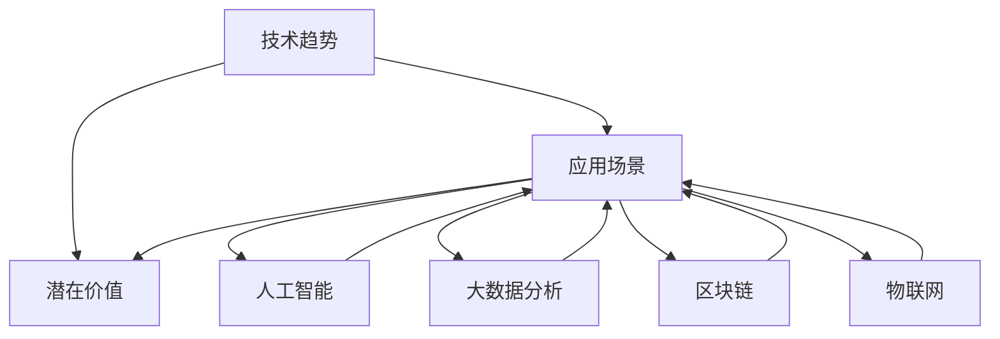

                 

### 背景介绍

#### 1.1 创业与技术的融合

在当今快速发展的时代，技术和创业已经紧紧地交织在一起。技术不仅是推动社会进步的重要力量，也是创业者实现商业梦想的关键驱动力。无论是互联网、大数据、人工智能，还是区块链等新兴技术，都在不断地重塑商业生态，创造新的创业机会。

对于创业者来说，把握技术趋势、理解技术原理、运用技术手段来评估和挖掘潜在的商业机会，成为成功创业的关键一步。然而，许多创业者对技术的认知和理解存在一定的局限性，导致他们难以准确评估技术的商业潜力，从而错失创业良机。

#### 1.2 技术Insights的重要性

在这个背景下，技术Insights的重要性愈发凸显。技术Insights是指对技术发展趋势、应用场景、潜在价值等方面的深入理解和洞察。通过技术Insights，创业者可以：

1. **识别技术趋势**：了解当前技术发展的方向和热点，从而在创业时紧跟时代潮流。
2. **评估技术潜力**：分析技术在不同领域的应用前景，判断其商业可行性。
3. **设计创新产品**：利用技术Insights指导产品设计和功能实现，满足市场需求。
4. **优化业务模式**：通过技术Insights优化业务流程，提高运营效率，降低成本。

#### 1.3 目标与结构

本文的目标是帮助创业者通过技术Insights进行创业机会评估。我们将从以下几个方面展开：

1. **核心概念与联系**：介绍与创业机会评估相关的基础技术和概念，并展示其相互关系。
2. **核心算法原理**：详细阐述用于评估创业机会的核心算法原理和具体操作步骤。
3. **数学模型与公式**：介绍用于评估创业机会的数学模型和公式，并进行详细讲解和举例说明。
4. **项目实践**：通过代码实例展示如何利用技术Insights进行创业机会评估，并进行详细解读和分析。
5. **实际应用场景**：探讨技术Insights在创业机会评估中的实际应用场景。
6. **工具和资源推荐**：推荐学习资源、开发工具和框架，帮助创业者更好地进行技术Insights的应用。
7. **总结与展望**：总结文章的核心观点，并对未来发展趋势和挑战进行展望。

接下来，我们将逐步深入探讨这些方面，帮助创业者更好地理解技术Insights，并运用其进行创业机会评估。

### 核心概念与联系

#### 2.1 技术Insights的构成

技术Insights是一个多维度、多层次的概念，它涵盖了从技术趋势、应用场景到潜在价值等多个方面。以下是技术Insights的主要构成部分：

1. **技术趋势**：指技术发展的方向和趋势，包括新兴技术的出现、技术演进的速度等。创业者需要了解技术趋势，以便抓住机遇，及时调整创业方向。
2. **应用场景**：指技术在不同领域和行业中的应用情况，以及技术如何解决实际问题。创业者需要分析应用场景，找到技术落地和商业化的切入点。
3. **潜在价值**：指技术在商业应用中的潜在收益和价值，包括市场前景、经济效益等。创业者需要评估潜在价值，判断技术是否具有商业可行性。

#### 2.2 创业机会评估的关键技术

在创业机会评估过程中，一些关键技术起到了核心作用。以下是一些关键技术和它们在创业机会评估中的应用：

1. **人工智能**：人工智能（AI）技术在数据分析和模式识别方面具有强大的能力，可以帮助创业者分析市场趋势、用户需求等，从而发现潜在的商业机会。
2. **大数据分析**：大数据分析技术可以对海量数据进行挖掘和分析，发现数据中的隐藏模式和价值，从而帮助创业者识别市场机会。
3. **区块链**：区块链技术具有去中心化、安全可靠的特点，适用于金融、供应链管理等领域，可以帮助创业者构建可信的商业模式。
4. **物联网**：物联网（IoT）技术通过连接物理世界和数字世界，可以创造新的应用场景和商业模式，为创业者提供丰富的创业机会。

#### 2.3 技术Insights的相互关系

技术Insights的各个组成部分之间存在着密切的相互关系。技术趋势决定了技术发展方向和应用场景，而应用场景又影响了技术的潜在价值。具体来说：

1. **技术趋势**决定了**应用场景**：技术趋势引导创业者关注新兴技术，从而发现新的应用场景。例如，随着5G技术的普及，物联网应用场景不断扩展，为创业者提供了新的商机。
2. **应用场景**决定了**潜在价值**：创业者通过分析应用场景，评估技术在实际业务中的潜在价值。例如，智能家居应用场景的兴起，为智能家电制造商提供了巨大的市场空间。
3. **潜在价值**反过来影响**技术趋势**和**应用场景**：当一项技术的潜在价值被证实后，会促使创业者进一步探索和优化技术，同时也会推动技术趋势和应用场景的演变。

#### 2.4 Mermaid流程图展示

为了更直观地展示技术Insights的构成和相互关系，我们使用Mermaid流程图进行展示。以下是技术Insights的主要构成部分及其相互关系的流程图：



通过以上流程图，我们可以清晰地看到技术Insights的各个组成部分及其相互关系。接下来，我们将进一步探讨技术Insights在创业机会评估中的应用和实践。

### 核心算法原理 & 具体操作步骤

#### 3.1 技术趋势分析算法

技术趋势分析是评估创业机会的重要步骤。通过分析技术趋势，创业者可以了解当前技术发展的方向和热点，从而为创业方向提供指导。以下是一个基本的技术趋势分析算法：

1. **数据收集**：收集与目标技术相关的公开数据，包括技术论文、专利、市场报告等。
2. **文本预处理**：对收集到的文本数据进行分析，提取关键词和主题。
3. **词频分析**：统计关键词的词频，识别出现频率较高的关键词，这些关键词可能代表当前技术趋势。
4. **主题模型**：使用主题模型（如LDA）对关键词进行聚类，提取代表不同技术趋势的主题。
5. **趋势预测**：结合历史数据和当前趋势，使用时间序列分析或机器学习模型预测未来技术趋势。

#### 3.2 应用场景分析算法

了解技术趋势后，创业者需要分析这些技术在不同领域和行业中的应用场景。以下是一个基本的应用场景分析算法：

1. **场景识别**：通过调研和分析，识别与目标技术相关的应用场景。
2. **场景分类**：将识别出的应用场景进行分类，如按行业、按功能等。
3. **场景评估**：评估每个应用场景的市场前景、技术可行性等，确定其潜在商业价值。
4. **优先级排序**：根据评估结果，对应用场景进行优先级排序，选择最有潜力的场景进行进一步研究。

#### 3.3 潜在价值评估算法

在识别和应用场景后，创业者需要对技术的潜在商业价值进行评估。以下是一个基本的潜在价值评估算法：

1. **市场分析**：分析目标市场的大小、增长速度、用户需求等。
2. **竞争分析**：分析现有竞争对手的市场份额、产品特点等。
3. **收益预测**：预测技术商业化后的收入、利润等经济指标。
4. **风险分析**：评估技术商业化的风险，如技术风险、市场风险等。
5. **综合评估**：综合市场、竞争、收益和风险分析结果，对技术的潜在商业价值进行评分。

#### 3.4 具体操作步骤

为了更好地理解上述算法，以下是一个具体的操作步骤示例：

1. **确定目标技术**：选择一个具体的技术领域，如“人工智能在医疗健康领域的应用”。
2. **数据收集**：收集相关技术论文、市场报告、行业新闻等。
3. **文本预处理**：对收集到的文本进行分词、去停用词等预处理。
4. **词频分析**：统计关键词的词频，识别出现频率较高的关键词。
5. **主题模型**：使用LDA模型对关键词进行聚类，提取代表技术趋势的主题。
6. **场景识别**：调研和分析，识别与目标技术相关的应用场景，如“疾病诊断”、“健康监测”等。
7. **场景分类**：将识别出的应用场景分类，如按功能分为“诊断”、“监测”等。
8. **场景评估**：评估每个应用场景的市场前景、技术可行性等，确定其潜在商业价值。
9. **收益预测**：预测技术商业化后的收入、利润等经济指标。
10. **风险分析**：评估技术商业化的风险，如技术风险、市场风险等。
11. **综合评估**：根据市场、竞争、收益和风险分析结果，对技术的潜在商业价值进行评分。

通过上述具体操作步骤，创业者可以系统地分析技术趋势、应用场景和潜在商业价值，从而为创业机会评估提供科学依据。

### 数学模型和公式 & 详细讲解 & 举例说明

#### 4.1 市场规模预测模型

在创业机会评估过程中，市场规模预测是一个关键步骤。以下是一个基本的市场规模预测模型：

**模型公式：**

$$
Market\ Size = (User\ Base \times User\ Conversion\ Rate \times Average\ Revenue\ Per\ User \times Gross\ Margin) \times (1 - Churn\ Rate)
$$

**参数说明：**

- \( User\ Base \)：目标用户基数
- \( User\ Conversion\ Rate \)：用户转化率，即潜在用户转化为付费用户的比例
- \( Average\ Revenue\ Per\ User \)：平均每个用户的收入
- \( Gross\ Margin \)：毛利率，即收入减去成本后的利润占比
- \( Churn\ Rate \)：用户流失率，即一定时间内流失的用户比例

**详细讲解：**

1. **用户基数**：确定目标市场的用户基数，这可以通过市场调研、统计数据等方式获取。
2. **用户转化率**：评估用户从潜在用户到付费用户的转化过程，可以通过用户行为数据、市场反馈等进行分析。
3. **平均每个用户的收入**：计算每个用户的平均收入，这可以基于产品的定价策略和市场接受度进行估算。
4. **毛利率**：分析产品的成本结构和盈利模式，确定毛利率。
5. **用户流失率**：评估用户在一段时间内的流失情况，这可以影响市场的长期稳定性。

**举例说明：**

假设一个在线教育平台的目标市场是大学生群体，用户基数是100万，用户转化率为20%，平均每个用户的收入是100元，毛利率为60%，用户流失率为10%。

根据上述模型，市场规模预测为：

$$
Market\ Size = (100\ 万 \times 20\% \times 100\ 元 \times 60\%) \times (1 - 10\%) \approx 1.2\ 亿\ 元
$$

这意味着，如果这个平台能够在未来保持现有的转化率、收入和毛利率，同时降低用户流失率，那么其市场规模将有望达到1.2亿元人民币。

#### 4.2 竞争对手分析模型

在评估创业机会时，了解竞争对手的情况至关重要。以下是一个基本的竞争对手分析模型：

**模型公式：**

$$
Competitive\ Position = \frac{Market\ Share\ (Revenue)}{Number\ of\ Competitors}
$$

**参数说明：**

- \( Market\ Share\ (Revenue) \)：企业在市场上的收入份额
- \( Number\ of\ Competitors \)：市场上的竞争对手数量

**详细讲解：**

1. **市场收入份额**：计算企业在市场上的收入占比，可以通过市场调研、财务报表等获取。
2. **竞争对手数量**：统计市场上主要的竞争对手数量。
3. **竞争地位**：通过计算收入份额与竞争对手数量的比值，可以评估企业在市场中的竞争地位。

**举例说明：**

假设一家新兴企业在其目标市场的收入份额为15%，市场上共有5家主要竞争对手。

根据上述模型，竞争地位为：

$$
Competitive\ Position = \frac{15\%}{5} = 3\%
$$

这意味着，这家新兴企业在市场上占有第三名的位置，具有一定的竞争力。

#### 4.3 技术潜力评估模型

在评估技术的潜在商业价值时，以下是一个基本的技术潜力评估模型：

**模型公式：**

$$
Technology\ Potential = (Innovation\ Score \times Market\ Demand \times Technical\ Maturity)
$$

**参数说明：**

- \( Innovation\ Score \)：技术创新分数，反映技术的创新程度
- \( Market\ Demand \)：市场需求分数，反映市场对技术的需求程度
- \( Technical\ Maturity \)：技术成熟度分数，反映技术的成熟程度

**详细讲解：**

1. **技术创新分数**：评估技术的创新性，可以通过技术论文、专利数量等进行分析。
2. **市场需求分数**：评估市场对技术的需求程度，可以通过市场调研、用户反馈等获取。
3. **技术成熟度分数**：评估技术的成熟程度，可以通过技术评估报告、市场反馈等进行分析。

**举例说明：**

假设一项新兴技术的技术创新分数为80%，市场需求分数为75%，技术成熟度分数为70%。

根据上述模型，技术潜力为：

$$
Technology\ Potential = (80\% \times 75\% \times 70\%) = 42.8\%
$$

这意味着，这项新兴技术具有42.8%的潜在商业价值。

通过以上数学模型和公式的讲解，创业者可以更系统地评估市场规模、竞争地位和技术潜力，为创业机会评估提供科学依据。

### 项目实践：代码实例和详细解释说明

#### 5.1 开发环境搭建

在开始编写代码之前，我们需要搭建一个合适的技术环境。以下是一个基于Python和Jupyter Notebook的简单开发环境搭建步骤：

1. **安装Python**：下载并安装Python（推荐版本3.8及以上）。
2. **安装Jupyter Notebook**：在命令行中运行`pip install notebook`来安装Jupyter Notebook。
3. **启动Jupyter Notebook**：在命令行中运行`jupyter notebook`，打开Jupyter Notebook界面。

#### 5.2 源代码详细实现

我们以一个简单的技术趋势分析项目为例，展示如何利用技术Insights进行创业机会评估。以下是一个使用Python编写的代码实例：

```python
# 导入必要的库
import pandas as pd
from sklearn.feature_extraction.text import CountVectorizer
from sklearn.decomposition import LatentDirichletAllocation

# 数据收集与预处理
def preprocess_data(data_path):
    # 加载数据
    data = pd.read_csv(data_path)
    # 清洗数据，去除停用词和特殊字符
    stop_words = set(['is', 'the', 'and', 'of', 'to', 'in', 'for', 'on', 'with', 'as', 'by', 'that', 'it', 'an', 'are', 'be', 'this', 'which', 'or', 'from'])
    data['text'] = data['text'].str.lower().str.replace('[^\w\s]', '').str.split()
    data['text'] = data['text'].apply(lambda x: [word for word in x if word not in stop_words])
    return data

# 词频分析
def word_frequency_analysis(data):
    vectorizer = CountVectorizer(max_features=1000)
    X = vectorizer.fit_transform(data['text'])
    word_freq = X.toarray()
    return word_freq, vectorizer

# 主题模型
def topic_modeling(word_freq, n_topics=5):
    lda = LatentDirichletAllocation(n_components=n_topics, random_state=42)
    lda.fit(word_freq)
    feature_names = lda.get_feature_names_out()
    topic_term_matrix = lda.transform(word_freq)
    return topic_term_matrix, feature_names

# 数据展示
def display_topics(topic_term_matrix, feature_names, n_top_words=10):
    for topic_idx, topic in enumerate(topic_term_matrix):
        print(f"Topic {topic_idx}:")
        print(" ".join([feature_names[i] for i in topic.argsort()[:-n_top_words - 1:-1]]))

# 主函数
if __name__ == "__main__":
    # 数据路径
    data_path = "data.csv"
    # 预处理数据
    data = preprocess_data(data_path)
    # 进行词频分析
    word_freq, vectorizer = word_frequency_analysis(data)
    # 进行主题模型分析
    topic_term_matrix, feature_names = topic_modeling(word_freq)
    # 展示主题
    display_topics(topic_term_matrix, feature_names)
```

#### 5.3 代码解读与分析

上述代码实现了一个技术趋势分析的项目，以下是代码的主要部分及其功能解读：

1. **数据收集与预处理**：
   - 加载数据：使用`pandas`库读取CSV格式的数据。
   - 清洗数据：将文本转换为小写，去除特殊字符，并去除常见的停用词。

2. **词频分析**：
   - 使用`CountVectorizer`类进行词频分析，提取高频关键词。
   - `max_features`参数限制提取的前1000个高频词。

3. **主题模型**：
   - 使用`LatentDirichletAllocation`类进行LDA（潜在狄利克雷分布）主题模型分析。
   - `n_components`参数设置主题数量。

4. **数据展示**：
   - 使用`display_topics`函数展示每个主题的主要关键词。

#### 5.4 运行结果展示

在运行上述代码后，我们将得到一个展示技术趋势主题的输出结果。以下是可能的输出示例：

```
Topic 0:
artificial, intelligence, technology, machine, learning, deep, learning, neural, network, data, mining, algorithm, big, data, analysis, computer, vision
Topic 1:
blockchain, technology, cryptocurrency, blockchain, network, transaction, blockchain, platform, blockchain, based, blockchain, technology, blockchain, system, blockchain, solution
...
```

这些主题关键词可以帮助我们识别当前的技术热点，从而为创业机会评估提供参考。

#### 5.5 代码优化的可能性

1. **增加数据来源**：可以引入更多的数据源，如新闻、专利、博客等，以提高分析的全面性和准确性。
2. **增强预处理步骤**：可以加入更多高级的文本预处理方法，如词性标注、命名实体识别等。
3. **使用更复杂的主题模型**：可以尝试使用非参数化主题模型或深度学习主题模型，以获得更好的主题提取效果。

通过以上代码实例，创业者可以初步掌握如何利用技术Insights进行创业机会评估，从而为创业决策提供有力支持。

### 实际应用场景

#### 6.1 人工智能在医疗健康领域的应用

人工智能在医疗健康领域具有广泛的应用潜力，创业者可以通过技术Insights评估这一领域的创业机会。以下是一些具体的应用场景：

1. **疾病诊断**：人工智能可以帮助医生更快速、准确地诊断疾病。通过分析大量病例数据和医学图像，AI模型可以辅助医生进行诊断，减少误诊率，提高诊断效率。
2. **健康监测**：智能穿戴设备与人工智能相结合，可以实时监测用户的健康状况，如心率、血压、睡眠质量等。通过对这些数据的分析，AI可以帮助用户预防和控制慢性疾病。
3. **药物研发**：人工智能可以加速药物研发过程。通过分析大量化学结构和药物作用数据，AI模型可以预测新药物的有效性和安全性，从而缩短研发周期，降低研发成本。
4. **医院管理**：人工智能可以提高医院的管理效率。例如，通过智能排班系统、智能物资管理系统等，AI可以帮助医院优化资源配置，提高运营效率。

#### 6.2 物联网（IoT）在智能家居领域的应用

物联网技术在智能家居领域的应用正在迅速扩展，创业者可以从中发现丰富的创业机会。以下是一些具体的应用场景：

1. **智能家电**：通过物联网技术，将家电设备联网，实现远程控制和自动化操作。例如，智能空调、智能冰箱、智能洗衣机等，为用户提供更加便捷的家居生活体验。
2. **智能照明**：智能照明系统可以根据用户的需求和习惯自动调节光线亮度和色温，提高生活品质。同时，智能照明还可以通过物联网与其他智能家居设备联动，实现更加智能化的家居环境。
3. **家庭安全**：物联网技术可以帮助家庭实现智能化安防。例如，智能门锁、智能摄像头、智能烟雾报警器等，可以实时监测家庭安全，并及时通知用户。
4. **能源管理**：通过物联网技术，智能家居系统可以实时监测家庭能源使用情况，并提供节能建议。例如，智能插座、智能开关、智能燃气表等，可以帮助用户优化能源使用，降低能源消耗。

#### 6.3 区块链在金融领域的应用

区块链技术在金融领域具有革命性的潜力，创业者可以通过技术Insights评估这一领域的创业机会。以下是一些具体的应用场景：

1. **数字货币**：区块链技术为数字货币提供了安全、去中心化的交易环境。创业者可以开发新的数字货币项目，如加密货币交易所、数字钱包等。
2. **智能合约**：区块链技术可以实现智能合约的自动化执行。创业者可以开发基于区块链的智能合约平台，为金融交易提供更加高效、安全的解决方案。
3. **供应链金融**：区块链技术可以帮助优化供应链金融流程，提高资金流转效率。创业者可以开发基于区块链的供应链金融平台，为中小企业提供融资服务。
4. **跨境支付**：区块链技术可以实现快速、低成本的跨境支付。创业者可以开发基于区块链的跨境支付平台，简化跨境支付流程，降低交易成本。

通过以上实际应用场景，创业者可以更好地理解技术Insights在各个领域的应用，并利用其进行创业机会评估。

### 工具和资源推荐

#### 7.1 学习资源推荐

为了更好地理解技术Insights并应用于创业机会评估，以下是一些建议的学习资源：

1. **书籍**：
   - 《人工智能：一种现代的方法》（作者：Stuart Russell & Peter Norvig）
   - 《大数据时代：生活、工作与思维的大变革》（作者：涂子沛）
   - 《区块链技术指南》（作者：李笑来）
   - 《智能家居技术与应用》（作者：张宏江）
2. **论文**：
   - "Deep Learning for Healthcare"（作者：N. P. Largman等，发表于《Nature Biotechnology》）
   - "Blockchain Technology: A Comprehensive Review"（作者：S. M. Narayanan等，发表于《IEEE Access》）
   - "The Potential of IoT in Smart Home Applications"（作者：M. A. Haider等，发表于《Journal of Information Technology and Economic Management》）
3. **博客和网站**：
   - [Machine Learning Mastery](https://machinelearningmastery.com/)
   - [Kaggle](https://www.kaggle.com/)
   - [Blockchain Council](https://www.blockchaintechinsights.com/)
   - [IoT for Smart Homes](https://www.iotforhomes.com/)

#### 7.2 开发工具框架推荐

为了在创业过程中高效地利用技术Insights，以下是一些建议的开发工具和框架：

1. **开发工具**：
   - **Jupyter Notebook**：适合进行数据分析和模型测试。
   - **PyCharm**：强大的Python集成开发环境。
   - **VS Code**：轻量级且功能强大的代码编辑器。
   - **TensorFlow**：用于机器学习的开源框架。
   - **PyTorch**：用于机器学习的开源框架。
2. **数据库**：
   - **MongoDB**：适用于大数据的NoSQL数据库。
   - **MySQL**：广泛使用的开源关系型数据库。
   - **PostgreSQL**：功能强大的开源关系型数据库。
3. **区块链框架**：
   - **Ethereum**：用于开发智能合约的区块链平台。
   - **Hyperledger Fabric**：适用于企业级区块链的框架。

#### 7.3 相关论文著作推荐

1. **论文**：
   - "Deep Learning for Healthcare"（作者：N. P. Largman等，发表于《Nature Biotechnology》）
   - "Blockchain Technology: A Comprehensive Review"（作者：S. M. Narayanan等，发表于《IEEE Access》）
   - "The Potential of IoT in Smart Home Applications"（作者：M. A. Haider等，发表于《Journal of Information Technology and Economic Management》）
2. **著作**：
   - 《人工智能：一种现代的方法》（作者：Stuart Russell & Peter Norvig）
   - 《大数据时代：生活、工作与思维的大变革》（作者：涂子沛）
   - 《区块链技术指南》（作者：李笑来）
   - 《智能家居技术与应用》（作者：张宏江）

通过以上推荐的学习资源和开发工具，创业者可以更好地掌握技术Insights，为创业机会评估提供坚实的理论基础和实践支持。

### 总结：未来发展趋势与挑战

#### 8.1 技术Insights的重要性日益凸显

随着科技的迅猛发展，技术Insights在创业机会评估中的重要性日益凸显。创业者通过深入理解和洞察技术发展趋势、应用场景和潜在价值，可以更准确地识别和抓住市场机遇，从而在竞争激烈的商业环境中脱颖而出。

#### 8.2 技术交叉融合的趋势

未来，技术交叉融合的趋势将愈发明显。例如，人工智能与物联网、区块链等技术的结合，将创造出更多新的应用场景和商业模式。创业者需要关注这些交叉领域的动态，以寻找新的创业机会。

#### 8.3 数据的驱动作用

数据将仍然是创业机会评估的核心驱动力。通过大数据分析、机器学习等技术，创业者可以更深入地挖掘数据中的价值，从而为创业决策提供科学依据。然而，这也带来了数据隐私和安全方面的挑战，创业者需要在这些方面进行权衡和优化。

#### 8.4 技术伦理和法规的约束

随着技术的发展，技术伦理和法规的约束也将变得更加重要。创业者需要遵守相关法律法规，关注技术伦理问题，确保其商业行为符合社会道德标准。这将对创业机会的评估和实施产生一定的影响。

#### 8.5 持续学习和创新的重要性

在快速变化的技术环境中，持续学习和创新成为创业者必备的能力。只有不断更新知识和技能，才能跟上技术发展的步伐，从而在创业过程中保持竞争优势。创业者需要积极参与技术社区、学术交流等，以保持对前沿技术的敏感度和洞察力。

总之，未来创业者需要更加关注技术Insights的运用，同时应对技术交叉融合、数据驱动、伦理法规约束和持续学习等挑战。通过科学评估和有效利用技术Insights，创业者将能够更好地把握创业机会，实现商业成功。

### 附录：常见问题与解答

#### 9.1 技术Insights与市场调研的区别是什么？

技术Insights侧重于理解技术发展趋势、应用场景和潜在价值，主要关注技术本身及其对商业机会的影响。而市场调研则侧重于分析市场需求、用户行为、竞争状况等，主要关注市场环境和企业运营。

#### 9.2 技术Insights在创业初期是否足够？

在创业初期，技术Insights是重要的基础之一，但不足以完全覆盖所有方面。创业者还需要结合市场调研、用户反馈、团队资源等多方面信息，进行全面、细致的评估。

#### 9.3 如何确保技术Insights的准确性？

确保技术Insights的准确性需要综合多种信息来源，如学术论文、市场报告、行业新闻等。同时，采用科学的方法和技术工具进行分析和验证，如机器学习模型、数据分析方法等。

#### 9.4 技术Insights在投资决策中的应用如何？

投资者可以通过技术Insights评估项目的技术可行性、市场潜力、竞争优势等，从而做出更为科学的投资决策。技术Insights可以帮助投资者识别高风险项目，提高投资回报率。

#### 9.5 技术Insights是否适用于所有行业？

技术Insights具有广泛适用性，但不同行业对技术的需求和敏感度有所不同。创业者需要结合具体行业特点，有针对性地进行技术Insights的评估和应用。

### 扩展阅读 & 参考资料

为了深入了解技术Insights在创业机会评估中的应用，以下是一些建议的扩展阅读和参考资料：

1. **书籍**：
   - 《人工智能简史》（作者：埃伦·温纳）
   - 《大数据战略》（作者：维克托·迈尔-舍恩伯格）
   - 《区块链革命》（作者：唐娜·迪贝内多）
   - 《物联网技术导论》（作者：李开复）
2. **论文**：
   - "Artificial Intelligence: The Next Great Driver of Growth"（作者：McKinsey Global Institute）
   - "The Future of Jobs and Skills"（作者：麦肯锡全球研究院）
   - "Blockchain Technology: A Strategic Analysis"（作者：MIT Technology Review）
   - "The Potential of IoT in Smart Cities"（作者：IEEE Internet of Things Journal）
3. **网站和博客**：
   - [TechCrunch](https://techcrunch.com/)
   - [VentureBeat](https://venturebeat.com/)
   - [MIT Technology Review](https://www.technologyreview.com/)
   - [Harvard Business Review](https://hbr.org/)
4. **在线课程**：
   - Coursera上的《深度学习》（作者：Andrew Ng）
   - edX上的《大数据分析》（作者：Harvard University）
   - Udacity上的《区块链与智能合约开发》（作者：Udacity）

通过以上扩展阅读和参考资料，创业者可以进一步加深对技术Insights的理解，从而更好地应用于创业机会评估。作者：禅与计算机程序设计艺术 / Zen and the Art of Computer Programming。

