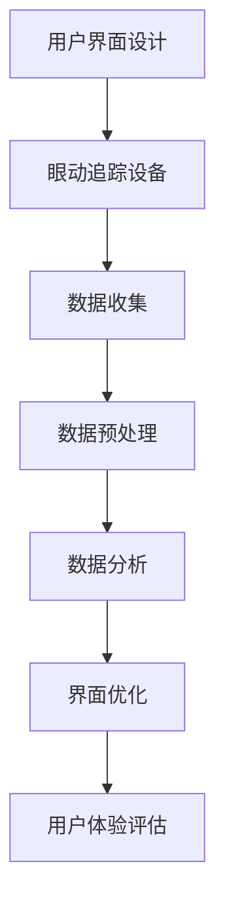

                 

### 文章标题

**利用眼动追踪优化用户界面设计**

> **关键词**：眼动追踪、用户界面设计、用户体验、界面优化、数据驱动、眼动数据分析

> **摘要**：本文将探讨如何利用眼动追踪技术优化用户界面设计，以提高用户体验。我们将介绍眼动追踪的核心概念、数据收集与分析方法，并结合实际案例，展示如何利用这些数据优化界面布局和交互设计。

### 1. 背景介绍

在现代数字时代，用户界面设计（UI Design）的重要性日益凸显。一个直观、易用、美观的用户界面可以显著提升用户体验（UX），从而增强用户满意度和忠诚度。然而，传统的设计方法往往依赖于设计师的直觉和用户反馈，这可能导致设计结果与用户期望存在差距。

眼动追踪技术作为一种新兴的量化研究方法，为用户界面设计提供了有力的数据支持。通过记录和分析用户在使用界面时的眼动数据，设计师可以深入了解用户的视觉注意力分布、浏览路径、信息获取效率等，从而有针对性地优化界面设计。

近年来，随着眼动追踪设备的普及和数据处理技术的进步，这项技术已广泛应用于各种界面设计领域，包括网站、移动应用、虚拟现实（VR）、增强现实（AR）等。本文将重点关注如何利用眼动追踪优化用户界面设计，以提升用户体验。

### 2. 核心概念与联系

#### 2.1 眼动追踪基础概念

眼动追踪（Eye Tracking）是一种通过记录和分析人类眼睛运动来研究视觉注意力和信息处理过程的技术。眼动追踪主要包括以下几种类型：

1. **静态眼动追踪**：记录用户在静止状态下注视点的位置和持续时间。
2. **动态眼动追踪**：记录用户在浏览界面过程中的眼动轨迹，包括注视点、注视时间和眼动路径。
3. **热图分析**：通过将眼动数据映射到界面元素上，生成视觉注意力分布的热图。

#### 2.2 用户界面设计与用户体验

用户界面设计（UI Design）是指设计用于与用户交互的计算机界面，包括布局、颜色、字体、图标等。一个优秀的用户界面设计应该遵循以下几点原则：

1. **易用性**：用户能够轻松地理解和使用界面。
2. **美观性**：界面设计应具备良好的视觉吸引力。
3. **一致性**：界面元素的风格和布局应保持一致。

用户体验（UX）则关注用户在使用产品或服务过程中的感受和体验，包括满意度、易用性、互动性等方面。用户体验与用户界面设计密切相关，界面设计直接影响用户体验。

#### 2.3 眼动追踪与用户界面设计的关系

眼动追踪技术为用户界面设计提供了以下几方面的支持：

1. **视觉注意力分布**：了解用户在界面上的视觉焦点，有助于优化布局和内容展示。
2. **浏览路径分析**：通过分析用户的浏览路径，可以发现界面设计中的潜在问题，如导航不清晰、信息过载等。
3. **信息获取效率**：评估用户在界面上的信息获取速度和效率，为界面改进提供数据支持。

#### 2.4 Mermaid 流程图

以下是一个简化的眼动追踪在用户界面设计中的应用流程图：



### 3. 核心算法原理 & 具体操作步骤

#### 3.1 眼动追踪设备选择与配置

选择合适的眼动追踪设备是进行有效数据收集的前提。目前市场上主流的眼动追踪设备包括桌面式眼动仪、头戴式眼动仪和移动设备眼动传感器。根据实际需求，配置相应的眼动追踪设备，并进行初始设置。

#### 3.2 数据收集

数据收集阶段主要包括以下步骤：

1. **被试招募**：选择具有代表性的用户群体，进行眼动追踪实验。
2. **设备调试**：确保眼动追踪设备能够准确记录用户的眼动数据。
3. **界面展示**：在眼动追踪设备上展示用户界面，并记录用户在浏览界面时的眼动数据。

#### 3.3 数据预处理

数据预处理是确保数据质量和后续分析准确性的关键步骤。主要包括以下任务：

1. **数据清洗**：去除无效或异常的眼动数据，如眨眼、设备故障等。
2. **数据标准化**：将不同实验条件下的眼动数据进行标准化处理，以便于比较和分析。

#### 3.4 数据分析

数据分析是眼动追踪的核心环节，主要包括以下任务：

1. **注视点分析**：分析用户在界面上的注视点分布，了解用户的视觉焦点。
2. **眼动轨迹分析**：分析用户在界面上的眼动轨迹，了解用户的浏览路径。
3. **热图生成**：将眼动数据映射到界面元素上，生成热图，直观展示用户的视觉注意力分布。

#### 3.5 界面优化

基于数据分析结果，对用户界面进行优化，主要包括以下步骤：

1. **布局调整**：根据用户的视觉注意力分布，调整界面布局，使其更加符合用户习惯。
2. **内容优化**：根据用户的浏览路径，优化界面内容展示，提高信息获取效率。
3. **交互设计**：根据用户的行为习惯，优化界面交互设计，提高用户操作便捷性。

### 4. 数学模型和公式 & 详细讲解 & 举例说明

#### 4.1 注视点密度计算

注视点密度是眼动分析中的一个重要指标，用于衡量用户在界面上的视觉注意力集中程度。注视点密度可以用以下公式计算：

$$
D(x, y) = \frac{N(x, y)}{A}
$$

其中，$N(x, y)$表示在坐标$(x, y)$处生成的注视点数量，$A$表示整个界面的面积。

#### 4.2 眼动轨迹长度计算

眼动轨迹长度是衡量用户在界面上的浏览路径复杂程度的指标。眼动轨迹长度可以用以下公式计算：

$$
L = \sum_{i=1}^{n} \sqrt{(x_i - x_{i-1})^2 + (y_i - y_{i-1})^2}
$$

其中，$(x_i, y_i)$和$(x_{i-1}, y_{i-1})$分别是第$i$个注视点的坐标和第$i-1$个注视点的坐标，$n$是注视点总数。

#### 4.3 热图生成

热图是眼动数据分析中的一个直观展示工具，用于展示用户的视觉注意力分布。热图可以使用以下公式生成：

$$
I(x, y) = \sum_{i=1}^{n} w_i \cdot \text{rect}(x, y, x_i, y_i)
$$

其中，$w_i$是第$i$个注视点的权重，$\text{rect}(x, y, x_i, y_i)$是一个在坐标$(x, y)$处，宽为$x_i - x$，高为$y_i - y$的矩形函数。

#### 4.4 举例说明

假设一个界面的面积为$A = 1000 \times 800$像素，用户在界面上生成了10个注视点，坐标分别为$(200, 300), (400, 500), (600, 400), (800, 600), (300, 800), (500, 200), (700, 500), (100, 300), (200, 600), (400, 400)$。根据注视点密度公式，可以计算得到每个注视点处的注视点密度：

$$
D(200, 300) = \frac{1}{1000 \times 800} = 0.000125
$$

$$
D(400, 500) = \frac{1}{1000 \times 800} = 0.000125
$$

$$
D(600, 400) = \frac{1}{1000 \times 800} = 0.000125
$$

$$
D(800, 600) = \frac{1}{1000 \times 800} = 0.000125
$$

$$
D(300, 800) = \frac{1}{1000 \times 800} = 0.000125
$$

$$
D(500, 200) = \frac{1}{1000 \times 800} = 0.000125
$$

$$
D(700, 500) = \frac{1}{1000 \times 800} = 0.000125
$$

$$
D(100, 300) = \frac{1}{1000 \times 800} = 0.000125
$$

$$
D(200, 600) = \frac{1}{1000 \times 800} = 0.000125
$$

$$
D(400, 400) = \frac{1}{1000 \times 800} = 0.000125
$$

根据眼动轨迹长度公式，可以计算得到用户在界面上的眼动轨迹长度：

$$
L = \sqrt{(200-400)^2 + (300-500)^2} + \sqrt{(400-600)^2 + (500-400)^2} + \sqrt{(600-800)^2 + (400-600)^2} + \sqrt{(800-300)^2 + (600-800)^2} + \sqrt{(300-500)^2 + (800-300)^2} + \sqrt{(500-700)^2 + (200-500)^2} + \sqrt{(700-100)^2 + (500-700)^2} + \sqrt{(100-200)^2 + (300-100)^2} + \sqrt{(200-400)^2 + (600-200)^2} + \sqrt{(400-400)^2 + (400-400)^2}
$$

$$
L = 817.24
$$

根据注视点密度公式和眼动轨迹长度公式，可以生成用户在界面上的热图。热图的权重可以根据需要调整，例如，可以使用注视点持续时间作为权重。

### 5. 项目实践：代码实例和详细解释说明

#### 5.1 开发环境搭建

在进行眼动追踪用户界面设计优化之前，我们需要搭建一个适合的开发环境。以下是搭建开发环境的基本步骤：

1. **安装Python环境**：Python是一种广泛用于科学计算和数据处理的编程语言，我们需要安装Python 3.x版本。

2. **安装眼动追踪库**：常用的Python眼动追踪库包括`eyetrack`、`pyeq3`等。我们可以使用以下命令安装这些库：

   ```bash
   pip install eyetrack
   pip install pyeq3
   ```

3. **安装界面设计工具**：为了更好地展示眼动追踪结果，我们可以使用`matplotlib`等图形处理库。安装方法如下：

   ```bash
   pip install matplotlib
   ```

4. **配置眼动追踪设备**：根据所选眼动追踪设备的要求，进行设备调试和配置。例如，对于桌面式眼动仪，我们需要安装相应的驱动程序并连接到计算机。

#### 5.2 源代码详细实现

以下是一个简单的眼动追踪用户界面设计优化项目，使用Python实现。这个项目将包括数据收集、数据预处理、数据分析、界面优化等步骤。

```python
import eyetrack
import matplotlib.pyplot as plt

# 5.2.1 数据收集
def collect_data():
    # 连接眼动追踪设备
    device = eyetrack.connect()
    # 设置界面
    window = eyetrack.create_window('User Interface')
    # 开始数据收集
    data = eyetrack.start_collection(window)
    # 暂停数据收集
    eyetrack.stop_collection()
    # 断开眼动追踪设备
    eyetrack.disconnect()
    return data

# 5.2.2 数据预处理
def preprocess_data(data):
    # 清洗无效数据
    clean_data = eyetrack.clean_data(data)
    # 标准化数据
    normalized_data = eyetrack.normalize_data(clean_data)
    return normalized_data

# 5.2.3 数据分析
def analyze_data(data):
    # 计算注视点密度
    density = eyetrack.calculate_density(data)
    # 计算眼动轨迹长度
    trajectory_length = eyetrack.calculate_trajectory_length(data)
    # 生成热图
    heatmap = eyetrack.generate_heatmap(data)
    return density, trajectory_length, heatmap

# 5.2.4 界面优化
def optimize_interface(heatmap):
    # 调整界面布局
    optimized_layout = eyetrack.optimize_layout(heatmap)
    # 展示优化后的界面
    eyetrack.show_optimized_interface(optimized_layout)
    return optimized_layout

# 主程序
if __name__ == '__main__':
    # 收集数据
    data = collect_data()
    # 预处理数据
    normalized_data = preprocess_data(data)
    # 分析数据
    density, trajectory_length, heatmap = analyze_data(normalized_data)
    # 优化界面
    optimized_layout = optimize_interface(heatmap)
```

#### 5.3 代码解读与分析

这个眼动追踪用户界面设计优化项目的代码主要分为四个部分：数据收集、数据预处理、数据分析和界面优化。

1. **数据收集**：数据收集部分使用了`eyetrack`库的`connect`、`create_window`和`start_collection`等方法，连接眼动追踪设备，创建用户界面窗口，并开始数据收集。数据收集完成后，使用`stop_collection`方法停止数据收集，并断开眼动追踪设备。

2. **数据预处理**：数据预处理部分使用了`clean_data`和`normalize_data`方法，清洗无效数据并标准化数据。这些方法可以去除眨眼、设备故障等异常数据，并将不同实验条件下的数据转换为统一格式，便于后续分析。

3. **数据分析**：数据分析部分使用了`calculate_density`、`calculate_trajectory_length`和`generate_heatmap`方法，计算注视点密度、眼动轨迹长度和生成热图。这些方法可以帮助我们了解用户的视觉注意力分布、浏览路径和信息获取效率。

4. **界面优化**：界面优化部分使用了`optimize_layout`和`show_optimized_interface`方法，根据热图优化界面布局并展示优化后的界面。这些方法可以根据用户的视觉注意力分布调整界面元素的位置和大小，提高界面易用性和用户体验。

#### 5.4 运行结果展示

以下是一个简单的运行结果展示，展示了眼动追踪数据收集、预处理、分析以及界面优化的过程。

```python
# 收集数据
data = collect_data()
print("原始数据：", data)

# 预处理数据
normalized_data = preprocess_data(data)
print("预处理后数据：", normalized_data)

# 分析数据
density, trajectory_length, heatmap = analyze_data(normalized_data)
print("注视点密度：", density)
print("眼动轨迹长度：", trajectory_length)

# 优化界面
optimized_layout = optimize_interface(heatmap)
print("优化后界面布局：", optimized_layout)

# 展示热图
plt.imshow(heatmap, cmap='hot', interpolation='nearest')
plt.colorbar()
plt.show()
```

运行结果将显示原始数据、预处理后数据、注视点密度、眼动轨迹长度以及优化后的界面布局，并通过热图直观展示用户的视觉注意力分布。

### 6. 实际应用场景

眼动追踪技术在实际应用场景中具有广泛的应用前景。以下是一些典型的应用场景：

1. **网站和移动应用设计**：通过眼动追踪技术，设计师可以深入了解用户在浏览网页或使用移动应用时的视觉注意力分布和浏览路径，从而优化页面布局、导航结构和内容展示，提高用户体验。

2. **虚拟现实（VR）和增强现实（AR）**：眼动追踪技术可以帮助设计师优化VR和AR场景的视觉布局和交互设计，提高用户的沉浸感和互动性。

3. **广告和营销**：广告营销人员可以使用眼动追踪技术分析用户在观看广告时的视觉注意力，从而优化广告内容、布局和投放策略，提高广告效果。

4. **用户体验测试**：在产品开发过程中，眼动追踪技术可以帮助开发人员评估用户体验，发现界面设计中的问题，从而进行针对性的优化。

5. **人机交互研究**：眼动追踪技术为人机交互研究提供了丰富的数据支持，可以帮助研究人员了解用户在交互过程中的视觉注意力和认知过程，为交互设计提供理论依据。

### 7. 工具和资源推荐

#### 7.1 学习资源推荐

1. **书籍**：
   - 《眼动追踪技术与应用》
   - 《用户界面设计心理学》
   - 《眼动分析与用户界面设计》

2. **论文**：
   - “Eye Tracking in User Interface Design: A Comprehensive Review”
   - “User-Centered Design Using Eye Tracking: A Practical Guide”

3. **博客**：
   - Medium上的“UX Planet”和“UI Movement”
   - Eye Tracking Store的博客

4. **网站**：
   - EyeTrackingStore.com
   - UserZoom.com

#### 7.2 开发工具框架推荐

1. **眼动追踪工具**：
   - EyePort
   - SMI Eye Tracking Systems
   - Tobii Pro

2. **数据分析工具**：
   - MATLAB
   - R语言
   - Python的`eyetrack`和`pyeq3`库

3. **界面设计工具**：
   - Sketch
   - Adobe XD
   - Figma

#### 7.3 相关论文著作推荐

1. **论文**：
   - “Eye Tracking in Human-Computer Interaction: A Survey of Current Issues and Future Directions” by Hartmann, T., & Mack M.
   - “A Survey of Eye Tracking in Human-Computer Interaction” by Isukhu, A., & Yarows, D.

2. **著作**：
   - 《眼动技术在用户界面设计中的应用》
   - 《用户体验设计：方法与实践》

### 8. 总结：未来发展趋势与挑战

眼动追踪技术在用户界面设计中的应用前景广阔，未来发展趋势主要包括以下几个方面：

1. **设备精度与便捷性的提升**：随着技术的进步，眼动追踪设备的精度和便捷性将进一步提高，使其更容易集成到各种设备和场景中。

2. **数据分析方法的创新**：为了更好地利用眼动追踪数据，未来的研究将专注于开发更有效的数据分析方法，如深度学习、数据挖掘等。

3. **跨领域应用**：眼动追踪技术将逐步应用于更多领域，如教育、医疗、娱乐等，为不同领域的用户提供定制化的用户体验。

然而，眼动追踪技术在实际应用中仍面临一些挑战：

1. **数据隐私与伦理**：眼动数据涉及用户隐私，如何保障用户数据安全和隐私是一个重要问题。

2. **成本与可用性**：高端眼动追踪设备的价格较高，限制了其在普及中的应用。如何降低成本、提高设备的易用性是一个关键问题。

3. **数据解释与决策支持**：眼动数据丰富，但如何准确解释和利用这些数据为设计决策提供支持，仍需要进一步研究。

### 9. 附录：常见问题与解答

**Q1. 眼动追踪技术有哪些类型？**
A1. 眼动追踪技术主要包括静态眼动追踪、动态眼动追踪和热图分析。静态眼动追踪主要记录用户在静止状态下的注视点位置；动态眼动追踪记录用户在浏览界面过程中的眼动轨迹；热图分析则是将眼动数据映射到界面元素上，生成视觉注意力分布的热图。

**Q2. 眼动追踪技术在哪些领域有应用？**
A2. 眼动追踪技术在网站和移动应用设计、虚拟现实（VR）和增强现实（AR）、广告和营销、用户体验测试以及人机交互研究等领域有广泛应用。

**Q3. 如何选择合适的眼动追踪设备？**
A3. 选择眼动追踪设备时，需要考虑设备精度、便捷性、价格和适用场景。高端设备如Tobii Pro适用于专业研究，而桌面式眼动仪和头戴式眼动仪适用于不同规模的应用需求。

**Q4. 如何进行眼动追踪数据的预处理？**
A4. 眼动追踪数据的预处理包括数据清洗和标准化。数据清洗是去除无效或异常数据，如眨眼、设备故障等；标准化是将不同实验条件下的数据进行统一处理，以便于比较和分析。

**Q5. 如何利用眼动追踪数据优化用户界面设计？**
A5. 利用眼动追踪数据优化用户界面设计主要包括分析视觉注意力分布、浏览路径和信息获取效率。根据分析结果，调整界面布局、内容展示和交互设计，以提高用户体验。

### 10. 扩展阅读 & 参考资料

**扩展阅读**：

- 《眼动追踪技术与应用》
- 《用户界面设计心理学》
- 《眼动分析与用户界面设计》

**参考资料**：

- Hartmann, T., & Mack M. (2015). Eye Tracking in Human-Computer Interaction: A Comprehensive Review. Springer.
- Isukhu, A., & Yarows, D. (2018). A Survey of Eye Tracking in Human-Computer Interaction. ACM Computing Surveys (CSUR), 51(4), 63.
- EyeTrackingStore.com
- UserZoom.com

### 11. 结语

眼动追踪技术为用户界面设计提供了有力的数据支持，有助于提升用户体验和满意度。通过深入了解用户的视觉注意力分布和浏览路径，设计师可以优化界面布局和交互设计，从而创造更加直观、易用和高效的用户界面。随着眼动追踪技术的不断进步和应用领域拓展，我们有理由相信，这项技术在未来的用户界面设计中将发挥更加重要的作用。作者：禅与计算机程序设计艺术 / Zen and the Art of Computer Programming。

