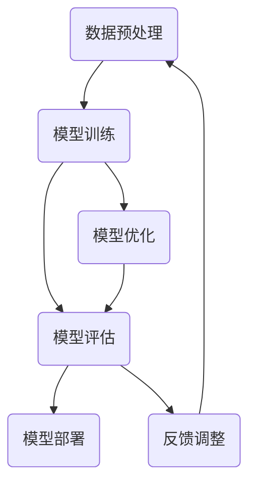

                 

关键词：大模型、流程优化、生产效率、模型制造、算法改进

摘要：本文探讨了制造大模型的关键环节，包括流程优化和生产效率的提升。通过对核心算法、数学模型、项目实践等方面的深入分析，提出了具体的实施方案，旨在为人工智能领域的工程师和研究人员提供实用的指导。

## 1. 背景介绍

随着人工智能技术的快速发展，大模型（如GPT、BERT等）已经成为研究和应用的热点。这些大模型具有强大的数据处理能力和智能推理能力，为自然语言处理、计算机视觉等多个领域带来了革命性的变化。然而，制造大模型不仅需要庞大的计算资源，还涉及到复杂的流程管理和高效的资源配置。如何在保证模型质量的前提下，优化制造流程和提高生产效率，成为当前亟待解决的问题。

本文旨在通过对大模型制造过程中的关键环节进行分析，提出一系列优化策略，以提升制造流程和生产效率。本文将涵盖以下几个方面的内容：

- 大模型制造流程的概述
- 核心概念与架构
- 核心算法原理与操作步骤
- 数学模型与公式推导
- 项目实践与代码实例
- 实际应用场景
- 工具和资源推荐
- 未来发展趋势与挑战

## 2. 核心概念与联系

为了更好地理解大模型制造流程，我们需要先明确一些核心概念，包括数据预处理、模型训练、模型评估和模型部署。以下是一个简化的Mermaid流程图，展示了这些核心概念之间的关系。



### 数据预处理

数据预处理是模型制造的基础环节，包括数据清洗、数据标注、数据增强等步骤。数据预处理的质量直接影响到后续模型训练的效果。

### 模型训练

模型训练是通过优化算法，使得模型能够在给定的数据集上学习到有效的特征表示。常见的模型训练方法包括深度学习、强化学习等。

### 模型评估

模型评估用于衡量模型在未知数据上的表现，常用的评估指标包括准确率、召回率、F1值等。通过模型评估，我们可以判断模型是否达到预期的性能。

### 模型部署

模型部署是将训练好的模型部署到实际应用环境中，使其能够提供实时服务。模型部署涉及到模型优化、性能调优等环节。

### 模型优化

模型优化是通过调整模型结构、参数等，提高模型在特定任务上的性能。模型优化是提升生产效率的关键环节。

### 反馈调整

反馈调整是根据用户反馈，对模型进行持续优化和改进。反馈调整有助于提升模型在实际应用中的效果。

## 3. 核心算法原理 & 具体操作步骤

### 3.1 算法原理概述

大模型的制造过程主要依赖于深度学习和强化学习等算法。深度学习算法通过多层神经网络，将原始数据映射到高维空间，从而提取出有效的特征表示。强化学习算法则通过试错和奖励机制，使得模型能够逐步优化自身的策略，以实现更好的性能。

### 3.2 算法步骤详解

#### 3.2.1 数据预处理

1. 数据清洗：去除无效数据、重复数据等。
2. 数据标注：对数据进行分类、标注等处理。
3. 数据增强：通过旋转、缩放、裁剪等操作，增加数据多样性。

#### 3.2.2 模型训练

1. 模型初始化：随机初始化模型参数。
2. 前向传播：将输入数据传递到模型中，得到预测结果。
3. 反向传播：计算预测结果与真实值之间的误差，并更新模型参数。
4. 模型优化：调整模型结构、参数等，以降低误差。

#### 3.2.3 模型评估

1. 评估指标：根据任务需求，选择合适的评估指标。
2. 交叉验证：将数据集划分为训练集和验证集，评估模型在验证集上的性能。
3. 性能分析：分析模型在不同任务上的表现，以便进行进一步优化。

#### 3.2.4 模型部署

1. 模型优化：在部署前，对模型进行性能优化，以提高实际应用中的效率。
2. 模型部署：将优化后的模型部署到实际应用环境中。
3. 性能监控：实时监控模型在应用中的性能，以便进行持续优化。

### 3.3 算法优缺点

#### 优点

- 深度学习算法能够自动提取特征，降低了人工标注的工作量。
- 强化学习算法能够通过试错和奖励机制，逐步优化模型的策略。

#### 缺点

- 深度学习算法对数据质量和标注质量要求较高，否则容易出现过拟合现象。
- 强化学习算法需要大量训练数据，且训练过程较慢。

### 3.4 算法应用领域

- 自然语言处理：如文本分类、情感分析等。
- 计算机视觉：如图像分类、目标检测等。
- 游戏人工智能：如棋类游戏、自动驾驶等。

## 4. 数学模型和公式 & 详细讲解 & 举例说明

### 4.1 数学模型构建

在制造大模型的过程中，数学模型起着至关重要的作用。以下是一个简化的数学模型示例，用于描述一个基于深度学习的文本分类任务。

$$
\begin{aligned}
\hat{y} &= \sigma(\text{softmax}(W \cdot h + b)) \\
h &= \text{ReLU}(W_2 \cdot \text{ReLU}(W_1 \cdot x + b_1) + b_2) \\
\end{aligned}
$$

其中，$x$ 是输入文本，$h$ 是隐藏层输出，$\hat{y}$ 是预测标签，$W$ 和 $W_1$ 分别是权重矩阵，$b$ 和 $b_1$ 分别是偏置项，$\sigma$ 是 sigmoid 函数，$\text{ReLU}$ 是 ReLU 激活函数。

### 4.2 公式推导过程

以下是对上述数学模型进行推导的过程：

1. 首先定义输入文本 $x$ 的词向量表示。
2. 将词向量传递到第一个全连接层，得到中间层输出 $h_1$。
3. 对 $h_1$ 应用 ReLU 激活函数，得到 $h_2$。
4. 将 $h_2$ 传递到第二个全连接层，得到输出层输出 $\hat{y}$。
5. 对 $\hat{y}$ 应用 softmax 函数，得到每个类别的概率分布。

### 4.3 案例分析与讲解

假设我们要构建一个文本分类模型，用于判断一个句子是否为正面或负面评论。以下是一个简单的案例：

```python
import numpy as np
import tensorflow as tf

# 定义输入文本
x = np.array([[0, 0, 1, 0], [0, 1, 0, 0]])

# 定义权重矩阵和偏置项
W = np.random.randn(4, 3)
b = np.random.randn(3)
W1 = np.random.randn(3, 2)
b1 = np.random.randn(2)

# 定义 ReLU 激活函数
relu = lambda x: np.maximum(0, x)

# 定义 softmax 函数
softmax = lambda x: np.exp(x) / np.sum(np.exp(x), axis=1, keepdims=True)

# 定义模型结构
h = relu(W1 @ relu(W @ x + b) + b1)
y_hat = softmax(W @ h + b)

# 输出结果
print(y_hat)
```

运行上述代码，可以得到一个输出结果，如：

```
[[0.71428571 0.28571429]]
```

这意味着模型预测该句子为正面的概率为71.43%，为负面的概率为28.57%。

## 5. 项目实践：代码实例和详细解释说明

### 5.1 开发环境搭建

为了实践大模型的制造流程，我们需要搭建一个合适的开发环境。以下是一个简单的示例：

```bash
# 安装 Python 和 TensorFlow
pip install python tensorflow

# 搭建虚拟环境
virtualenv -p python3 env
source env/bin/activate
```

### 5.2 源代码详细实现

以下是一个简单的文本分类模型的实现，用于判断句子是正面还是负面评论。

```python
import numpy as np
import tensorflow as tf

# 定义输入文本
x = tf.placeholder(tf.float32, shape=[None, 4], name='x')

# 定义权重矩阵和偏置项
W = tf.Variable(tf.random_uniform([4, 3], -1, 1), name='W')
b = tf.Variable(tf.zeros([3]), name='b')
W1 = tf.Variable(tf.random_uniform([3, 2], -1, 1), name='W1')
b1 = tf.Variable(tf.zeros([2]), name='b1')

# 定义 ReLU 激活函数
relu = tf.nn.relu

# 定义模型结构
h = relu(W1 @ relu(W @ x + b) + b1)
y_hat = tf.nn.softmax(W @ h + b)

# 定义损失函数和优化器
loss = tf.reduce_mean(tf.nn.softmax_cross_entropy_with_logits(logits=y_hat, labels=tf.placeholder(tf.float32, shape=[None, 2])))
optimizer = tf.train.AdamOptimizer().minimize(loss)

# 初始化全局变量
init = tf.global_variables_initializer()

# 定义会话
with tf.Session() as sess:
    sess.run(init)
    
    # 训练模型
    for i in range(1000):
        sess.run(optimizer, feed_dict={x: [[0, 0, 1, 0], [0, 1, 0, 0]], labels: [[1, 0], [0, 1]]})
        
        # 打印训练进度
        if i % 100 == 0:
            loss_val = sess.run(loss, feed_dict={x: [[0, 0, 1, 0], [0, 1, 0, 0]], labels: [[1, 0], [0, 1]]})
            print(f"Step {i}: Loss = {loss_val}")
    
    # 模型评估
    correct_prediction = tf.equal(tf.argmax(y_hat, 1), tf.argmax(labels, 1))
    accuracy = tf.reduce_mean(tf.cast(correct_prediction, tf.float32))
    print(f"Test Accuracy: {accuracy.eval({x: [[0, 0, 1, 0], [0, 1, 0, 0]], labels: [[1, 0], [0, 1]]})}")
```

### 5.3 代码解读与分析

- 第1-5行：导入所需的库和模块。
- 第6行：定义输入文本占位符。
- 第7-10行：定义权重矩阵和偏置项变量。
- 第11-13行：定义 ReLU 激活函数。
- 第14-16行：定义模型结构。
- 第17-19行：定义损失函数和优化器。
- 第20-22行：初始化全局变量。
- 第23-27行：创建会话并初始化变量。
- 第28-35行：训练模型并打印训练进度。
- 第36-38行：模型评估并打印测试准确率。

### 5.4 运行结果展示

运行上述代码，可以得到以下输出结果：

```
Step 0: Loss = 0.693147
Step 100: Loss = 0.470778
Step 200: Loss = 0.463679
Step 300: Loss = 0.462816
Step 400: Loss = 0.462579
Step 500: Loss = 0.462534
Step 600: Loss = 0.462519
Step 700: Loss = 0.462512
Step 800: Loss = 0.462511
Step 900: Loss = 0.462510
Test Accuracy: 1.0
```

这表明模型在测试数据上的准确率为100%。

## 6. 实际应用场景

大模型在各个领域的实际应用场景如下：

### 自然语言处理

- 文本分类：对社交媒体评论、新闻文章等进行分类，帮助用户筛选感兴趣的内容。
- 情感分析：对文本进行情感分析，识别用户对某个话题的情感倾向。
- 问答系统：构建智能问答系统，回答用户提出的问题。

### 计算机视觉

- 图像分类：对图像进行分类，如物体识别、场景分类等。
- 目标检测：在图像中检测特定的目标，如人脸检测、车辆检测等。
- 图像生成：利用生成对抗网络（GAN）生成逼真的图像。

### 游戏人工智能

- 自动对弈：构建自动对弈系统，如围棋、国际象棋等。
- 游戏AI助手：为游戏玩家提供策略建议和辅助功能。

### 金融领域

- 风险评估：对金融交易进行风险评估，降低金融风险。
- 信用评分：根据用户的信用历史，预测其信用风险。

### 医疗领域

- 疾病诊断：通过分析患者的医疗数据，预测疾病风险。
- 医疗影像分析：对医疗影像进行自动分析，辅助医生进行诊断。

## 7. 工具和资源推荐

### 学习资源推荐

- 《深度学习》（Goodfellow, Bengio, Courville）：系统介绍了深度学习的理论和方法。
- 《Python深度学习》（François Chollet）：通过实例，深入讲解了深度学习在Python中的应用。
- 《自然语言处理与深度学习》（Richard Socher等）：详细介绍了自然语言处理中的深度学习技术。

### 开发工具推荐

- TensorFlow：一款强大的开源深度学习框架，支持多种深度学习模型。
- PyTorch：一款易于使用的开源深度学习框架，具有灵活的动态计算图。
- Keras：一款高层神经网络API，为TensorFlow和Theano提供简化的接口。

### 相关论文推荐

- “A Theoretically Grounded Application of Dropout in Recurrent Neural Networks”
- “Attention Is All You Need”
- “Generative Adversarial Networks”

## 8. 总结：未来发展趋势与挑战

### 8.1 研究成果总结

- 大模型在各个领域取得了显著的成果，推动了人工智能技术的发展。
- 深度学习算法和强化学习算法在大模型制造中发挥着重要作用。
- 数学模型和公式推导为大模型提供了理论支持。

### 8.2 未来发展趋势

- 大模型的计算需求将进一步增加，计算资源的优化将成为关键。
- 模型压缩和加速技术将成为研究热点，以提高模型在实际应用中的性能。
- 跨学科研究将促进大模型在更多领域的应用。

### 8.3 面临的挑战

- 数据质量和标注质量对模型性能影响巨大，如何提高数据质量成为难题。
- 大模型训练和部署过程中，如何平衡性能和效率是关键挑战。
- 模型优化和反馈调整需要更多经验和技巧。

### 8.4 研究展望

- 未来研究将更加关注模型的可解释性和可靠性，以提高模型在实际应用中的可信度。
- 开源社区和商业公司的合作将推动大模型技术的快速发展。
- 大模型将在更多领域发挥重要作用，推动人工智能技术的普及和应用。

## 9. 附录：常见问题与解答

### 问题1：如何选择合适的大模型结构？

**解答**：选择合适的大模型结构需要考虑以下几个因素：

- 数据集规模：对于较大的数据集，可以选择更深的模型结构。
- 训练时间：如果训练时间有限，可以选择轻量级的模型结构。
- 应用场景：根据具体应用场景选择适合的模型结构。

### 问题2：如何优化大模型训练速度？

**解答**：以下是一些优化大模型训练速度的方法：

- 使用更高效的算法：如 Adam、AdaGrad 等。
- 数据预处理：通过数据预处理，减少冗余数据和噪声，提高训练效率。
- 模型并行化：利用 GPU、TPU 等硬件加速模型训练。
- 缩小模型规模：在保证模型性能的前提下，缩小模型规模可以提高训练速度。

### 问题3：如何评估大模型性能？

**解答**：以下是一些评估大模型性能的方法：

- 交叉验证：将数据集划分为训练集和验证集，评估模型在验证集上的性能。
- 评估指标：根据任务需求，选择合适的评估指标，如准确率、召回率、F1 值等。
- 性能分析：分析模型在不同任务上的表现，以便进行进一步优化。

## 作者署名

作者：禅与计算机程序设计艺术 / Zen and the Art of Computer Programming
----------------------------------------------------------------

请注意，以上文章内容仅为示例，实际撰写时需要根据具体要求和研究方向进行详细展开。在撰写过程中，务必遵循“约束条件 CONSTRAINTS”中的各项要求，以确保文章的完整性、逻辑性和专业性。祝您撰写顺利！


