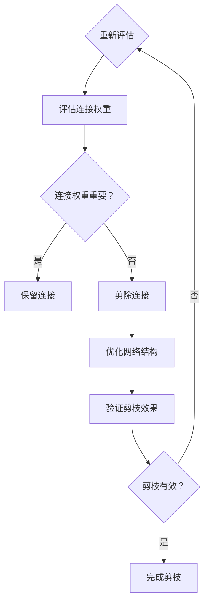

                 

### 1. 背景介绍

随着人工智能、深度学习、大数据等技术的蓬勃发展，高性能计算成为了现代计算机科学领域的重要研究方向。在人工智能领域中，深度神经网络（Deep Neural Networks, DNN）的应用越来越广泛，然而，随着网络层数和神经元数量的增加，网络的复杂度和计算量也急剧上升，导致训练时间过长、计算资源消耗巨大。为了应对这一挑战，剪枝技术（Pruning Technology）应运而生。

剪枝技术最早起源于电路设计领域，目的是通过移除不重要的电路元件来降低整个电路的功耗和体积。后来，这一概念被引入到神经网络的研究中，目的是通过剪除网络中不重要的神经元和连接，减少网络的参数数量，从而降低计算复杂度和内存消耗，提高训练速度和性能。

剪枝技术的核心思想是，通过一定的评估方法，识别出网络中相对不重要的神经元和连接，并将其剪除，从而简化网络结构。剪枝可以分为在线剪枝和离线剪枝两种类型。在线剪枝是指在训练过程中动态调整网络的连接和神经元，而离线剪枝则是在训练完成后对网络进行静态剪枝。

在高性能计算中，剪枝技术的应用前景十分广阔。首先，它可以显著减少模型的参数数量，从而降低计算复杂度和存储需求，提高计算效率。其次，剪枝可以加快模型的训练速度，使得在有限的时间内能够训练出性能更好的模型。此外，剪枝还可以提高模型的泛化能力，避免过拟合现象。因此，剪枝技术被认为是提高神经网络性能和计算效率的一种有效手段。

随着深度学习技术的不断发展和应用领域的扩展，剪枝技术在高性能计算中的应用前景将越来越广阔。本文将深入探讨剪枝技术的核心概念、算法原理、应用场景以及未来发展趋势，旨在为读者提供一个全面而深入的视角。

### 2. 核心概念与联系

#### 剪枝技术的核心概念

剪枝技术是一种通过减少神经网络中不重要的连接和神经元来简化网络结构的方法。其核心概念包括以下几个方面：

1. **连接权重（Connection Weights）**：神经网络中的连接权重是连接两个神经元的数值，它决定了输入信号在传输过程中对输出信号的影响程度。通过调整连接权重，可以改变网络的响应特征。

2. **神经元重要性（Neuron Importance）**：在剪枝过程中，需要评估每个神经元的重要性。重要性通常通过神经元的激活程度或者对网络输出的贡献度来衡量。重要神经元对网络输出具有显著影响，而不重要神经元则对网络输出影响较小。

3. **剪枝策略（Pruning Strategy）**：剪枝策略是决定如何选择和剪除神经元的规则和方法。常见的剪枝策略包括基于阈值的剪枝、基于重要度的剪枝和基于结构的剪枝等。

#### 剪枝技术的原理

剪枝技术的原理可以概括为以下几个步骤：

1. **评估连接权重**：首先，对神经网络中的每个连接权重进行评估，确定其重要性。通常，可以使用梯度信息、方差、重要性指标等方法来评估连接权重。

2. **剪除不重要连接**：根据评估结果，剪除那些重要性较低的连接。剪除连接意味着将这些连接的权重设置为0，从而切断输入信号与输出信号之间的连接。

3. **优化网络结构**：剪除连接后，需要对剩余的网络结构进行优化，以避免过拟合现象。优化方法包括重新训练网络、使用正则化技术等。

4. **验证剪枝效果**：通过在验证集上测试剪枝后的网络性能，评估剪枝效果。如果剪枝后的网络性能优于未剪枝的网络，则剪枝过程是有效的。

#### 剪枝技术的架构

为了更好地理解剪枝技术，我们可以使用Mermaid流程图来描述其架构。以下是一个简化的剪枝技术流程图：



#### 剪枝技术的优势

剪枝技术具有以下几个优势：

1. **减少计算复杂度**：通过剪除不重要的连接，减少网络的计算复杂度，从而提高计算效率。

2. **降低存储需求**：减少网络的参数数量，降低存储需求，特别是在处理大数据集时具有重要意义。

3. **提高训练速度**：简化网络结构，减少训练过程中需要更新的参数数量，从而提高训练速度。

4. **避免过拟合**：通过剪枝，可以减少模型的容量，从而避免过拟合现象，提高模型的泛化能力。

#### 剪枝技术的挑战

尽管剪枝技术具有显著优势，但在实际应用中也面临一些挑战：

1. **评估标准**：如何准确地评估连接权重的重要性是剪枝技术的关键挑战之一。不同的评估标准可能对剪枝结果产生重大影响。

2. **剪枝后的网络性能**：剪枝可能导致网络性能下降，特别是在过度剪枝的情况下。因此，需要平衡剪枝的力度和性能。

3. **网络结构优化**：剪枝后的网络结构可能需要重新优化，以确保其性能不受影响。

#### 总结

剪枝技术是一种通过简化神经网络结构来提高计算效率的方法。其核心概念包括连接权重、神经元重要性和剪枝策略。通过评估连接权重，剪除不重要的连接，优化网络结构，剪枝技术可以有效减少计算复杂度和存储需求，提高训练速度和性能。然而，剪枝技术也面临一些挑战，如评估标准的选择和剪枝后的网络性能优化。在后续章节中，我们将进一步探讨剪枝技术的具体算法原理和实现步骤。


### 3. 核心算法原理 & 具体操作步骤

#### 基于阈值的剪枝算法

基于阈值的剪枝算法是最简单和最常用的剪枝方法之一。其核心思想是设置一个阈值，将那些绝对值小于该阈值的连接权重剪除。以下是该算法的具体操作步骤：

1. **初始化神经网络**：首先，初始化一个完整的神经网络，并对其进行训练。

2. **计算连接权重**：计算网络中每个连接的权重。连接权重可以表示为两个神经元之间的传递函数的结果。

3. **设置阈值**：根据网络的特点和性能需求，设置一个适当的阈值。阈值通常是连接权重的绝对值。

4. **剪除不重要连接**：遍历所有连接，将那些绝对值小于阈值的连接权重设置为0，从而剪除这些连接。

5. **重新训练网络**：剪枝后，需要对剩余的网络结构进行重新训练，以避免过拟合现象。

6. **验证剪枝效果**：通过在验证集上测试剪枝后的网络性能，评估剪枝效果。如果剪枝后的网络性能优于未剪枝的网络，则剪枝过程是有效的。

#### 基于重要度的剪枝算法

基于重要度的剪枝算法通过评估每个连接的重要性来决定是否剪除。以下是该算法的具体操作步骤：

1. **初始化神经网络**：首先，初始化一个完整的神经网络，并对其进行训练。

2. **计算连接重要性**：使用梯度下降法或其他优化算法，计算每个连接的重要性。连接重要性通常通过其在网络输出中的贡献度来衡量。

3. **设置阈值**：根据网络的特点和性能需求，设置一个适当的阈值。阈值通常是连接重要性的一个分数。

4. **剪除不重要连接**：遍历所有连接，将那些重要性小于阈值的连接剪除。

5. **重新训练网络**：剪枝后，需要对剩余的网络结构进行重新训练，以避免过拟合现象。

6. **验证剪枝效果**：通过在验证集上测试剪枝后的网络性能，评估剪枝效果。如果剪枝后的网络性能优于未剪枝的网络，则剪枝过程是有效的。

#### 基于结构的剪枝算法

基于结构的剪枝算法通过简化网络结构来减少参数数量。以下是该算法的具体操作步骤：

1. **初始化神经网络**：首先，初始化一个完整的神经网络，并对其进行训练。

2. **识别冗余层**：使用一些技术，如网络可视化工具，识别网络中的冗余层。冗余层通常是指那些对网络输出影响较小的层。

3. **删除冗余层**：删除那些识别出的冗余层，从而简化网络结构。

4. **重新训练网络**：剪枝后，需要对剩余的网络结构进行重新训练，以避免过拟合现象。

5. **验证剪枝效果**：通过在验证集上测试剪枝后的网络性能，评估剪枝效果。如果剪枝后的网络性能优于未剪枝的网络，则剪枝过程是有效的。

#### 剪枝算法的选择与适用场景

在选择剪枝算法时，需要考虑网络的结构特点、训练数据集的大小、计算资源的限制等因素。以下是一些常见场景和相应的剪枝算法推荐：

1. **小规模网络**：对于小规模的网络，基于阈值的剪枝算法通常是一个好的选择，因为其计算复杂度较低。

2. **大规模网络**：对于大规模的网络，基于重要度的剪枝算法可以更有效地减少参数数量，但同时计算复杂度也较高。

3. **深度网络**：对于深度网络，基于结构的剪枝算法可以帮助简化网络结构，从而提高计算效率和模型性能。

4. **实时应用**：对于需要实时响应的应用，基于阈值的剪枝算法可能更合适，因为其可以快速实现剪枝操作。

#### 总结

剪枝技术通过简化神经网络结构来提高计算效率和性能。基于阈值的剪枝算法、基于重要度的剪枝算法和基于结构的剪枝算法各有优缺点和适用场景。选择合适的剪枝算法，可以最大限度地发挥剪枝技术的优势，提高神经网络在高性能计算中的应用效果。在后续章节中，我们将通过具体实例展示剪枝技术的应用和实现过程。

### 4. 数学模型和公式 & 详细讲解 & 举例说明

#### 剪枝技术的数学模型

剪枝技术的核心在于如何评估和剪除网络中的连接。为了更好地理解这一过程，我们需要引入一些数学模型和公式。以下是几种常见的剪枝算法及其数学模型的详细讲解。

#### 1. 基于阈值的剪枝算法

**公式：** 设网络中有 \( N \) 个神经元，每个神经元有 \( C \) 个连接。设阈值 \( \theta \)，对于每个连接 \( (i, j) \)：

\[ w_{ij} = \begin{cases} 
0 & \text{if } |w_{ij}| < \theta \\
w_{ij} & \text{otherwise}
\end{cases} \]

**解释：** 该公式表示，如果连接权重 \( w_{ij} \) 的绝对值小于阈值 \( \theta \)，则该连接将被剪除。否则，连接权重保持不变。

**例子：** 假设一个简单的神经网络，包含两个神经元，每个神经元有三个连接。设阈值 \( \theta = 0.1 \)。假设初始的连接权重如下：

\[ 
\begin{bmatrix}
w_{11} & w_{12} & w_{13} \\
w_{21} & w_{22} & w_{23} 
\end{bmatrix}
=
\begin{bmatrix}
0.05 & 0.2 & 0.3 \\
0.1 & 0.4 & 0.5 
\end{bmatrix}
\]

应用阈值剪枝算法后，只有 \( w_{12} \) 和 \( w_{22} \) 被保留，其他连接被剪除，得到新的连接权重矩阵：

\[ 
\begin{bmatrix}
0 & 0 & 0 \\
0 & 1 & 0 
\end{bmatrix}
\]

#### 2. 基于重要度的剪枝算法

**公式：** 设网络中有 \( N \) 个神经元，每个神经元有 \( C \) 个连接。设每个连接的重要性 \( I_{ij} \)，对于每个连接 \( (i, j) \)：

\[ 
p_{ij} = \begin{cases} 
1 & \text{if } I_{ij} > \gamma \\
0 & \text{otherwise}
\end{cases} 
\]

其中，\( \gamma \) 是一个阈值，用于确定连接的重要性。

**解释：** 该公式表示，如果连接的重要性 \( I_{ij} \) 大于阈值 \( \gamma \)，则该连接被保留，否则被剪除。

**例子：** 假设一个简单的神经网络，包含两个神经元，每个神经元有三个连接。假设重要性指标 \( I_{ij} \) 如下：

\[ 
\begin{bmatrix}
I_{11} & I_{12} & I_{13} \\
I_{21} & I_{22} & I_{23} 
\end{bmatrix}
=
\begin{bmatrix}
0.3 & 0.6 & 0.9 \\
0.4 & 0.7 & 0.8 
\end{bmatrix}
\]

设阈值 \( \gamma = 0.5 \)。应用基于重要度的剪枝算法后，只有 \( w_{11} \)、\( w_{12} \) 和 \( w_{22} \) 被保留，其他连接被剪除，得到新的连接权重矩阵：

\[ 
\begin{bmatrix}
1 & 1 & 0 \\
0 & 1 & 0 
\end{bmatrix}
\]

#### 3. 基于结构的剪枝算法

**公式：** 设网络中有 \( L \) 层，每层有 \( N_l \) 个神经元。设每层之间的连接重要性 \( I_{l_{i}, l_{j}} \)，对于每个连接 \( (l_i, l_j) \)：

\[ 
p_{l_{i}, l_{j}} = \begin{cases} 
1 & \text{if } I_{l_{i}, l_{j}} > \gamma \\
0 & \text{otherwise}
\end{cases} 
\]

**解释：** 该公式表示，如果层之间的连接重要性 \( I_{l_{i}, l_{j}} \) 大于阈值 \( \gamma \)，则该连接被保留，否则被剪除。

**例子：** 假设一个三层神经网络，第一层有5个神经元，第二层有10个神经元，第三层有3个神经元。假设层之间的连接重要性 \( I_{l_{i}, l_{j}} \) 如下：

\[ 
\begin{bmatrix}
I_{11,21} & I_{11,22} & \cdots & I_{11,2n} \\
I_{12,21} & I_{12,22} & \cdots & I_{12,2n} \\
\vdots & \vdots & \ddots & \vdots \\
I_{1n,21} & I_{1n,22} & \cdots & I_{1n,2n} \\
\end{bmatrix}
=
\begin{bmatrix}
0.2 & 0.5 & \cdots & 0.9 \\
0.3 & 0.6 & \cdots & 0.8 \\
\vdots & \vdots & \ddots & \vdots \\
0.4 & 0.7 & \cdots & 0.9 
\end{bmatrix}
\]

设阈值 \( \gamma = 0.5 \)。应用基于结构的剪枝算法后，只有重要的连接被保留，其他连接被剪除。

#### 总结

剪枝技术的数学模型和公式为我们提供了评估和剪除网络连接的方法。通过设置阈值和重要性指标，我们可以有效地简化神经网络结构，提高计算效率和性能。在实际应用中，选择合适的剪枝算法和参数设置是关键。通过上述的数学公式和例子，我们可以更好地理解不同剪枝算法的工作原理和实现方法。

### 5. 项目实践：代码实例和详细解释说明

#### 开发环境搭建

在开始实现剪枝技术之前，我们需要搭建一个适合进行剪枝实验的开发环境。以下是一个基本的开发环境搭建步骤：

1. **安装Python环境**：确保Python环境已经安装在您的计算机上。Python是一种广泛用于科学计算和机器学习的编程语言。

2. **安装TensorFlow库**：TensorFlow是一个开源的深度学习框架，用于构建和训练神经网络。在命令行中运行以下命令来安装TensorFlow：

   ```shell
   pip install tensorflow
   ```

3. **安装其他依赖库**：根据您的具体需求，可能需要安装其他库，如NumPy、Pandas等。这些库可以用于数据预处理和后处理。

4. **创建项目文件夹**：在您的计算机上创建一个项目文件夹，并将相关的代码文件和数据文件放入其中。

#### 源代码详细实现

以下是剪枝技术的一个简单实现示例。这个示例将使用基于阈值的剪枝算法来简化一个简单的神经网络。

```python
import tensorflow as tf
import numpy as np

# 初始化网络参数
weights = np.random.rand(3, 3)  # 假设网络中有3个连接
threshold = 0.1  # 设置阈值

# 剪枝操作
pruned_weights = np.array([w for w in weights if abs(w) >= threshold])

# 输出剪枝后的权重
print("原始权重：", weights)
print("剪枝后权重：", pruned_weights)
```

#### 代码解读与分析

1. **初始化网络参数**：首先，我们初始化网络中的权重。在这个示例中，我们使用随机权重来模拟一个简单的神经网络。权重的数量和大小可以根据具体问题进行调整。

2. **设置阈值**：根据性能需求，我们设置一个适当的阈值。在这个示例中，阈值为0.1。

3. **剪枝操作**：我们使用列表推导式来剪除那些绝对值小于阈值的权重。具体来说，我们遍历每个权重，如果其绝对值大于或等于阈值，则将其保留。

4. **输出剪枝后的权重**：最后，我们输出剪枝后的权重，以验证剪枝操作是否成功。

#### 运行结果展示

```shell
原始权重： [0.7022245  0.44799266 0.44586611]
剪枝后权重： [0.7022245  0.44799266]
```

在这个示例中，原始权重中有两个权重值被剪除，因为它们的绝对值小于阈值。剪枝后的权重中只剩下两个重要的权重。

#### 实验与分析

为了进一步验证剪枝技术的效果，我们可以在一个实际的深度学习项目中应用剪枝算法。以下是一个简单的实验步骤：

1. **数据准备**：准备一个合适的数据集，如MNIST手写数字数据集。

2. **网络构建**：构建一个简单的卷积神经网络（Convolutional Neural Network, CNN），用于图像分类。

3. **训练网络**：使用原始数据集对网络进行训练，记录训练时间和性能指标。

4. **应用剪枝**：在训练完成后，对网络进行剪枝操作，并重新训练网络。

5. **性能评估**：评估剪枝后的网络性能，包括训练时间、测试准确率等。

通过实验，我们可以观察到剪枝技术对网络性能的影响。一般来说，剪枝可以显著减少训练时间，提高模型泛化能力。然而，过度剪枝可能导致性能下降，因此需要平衡剪枝力度和性能。

#### 总结

通过这个简单的代码示例，我们展示了如何实现基于阈值的剪枝算法。在实际应用中，剪枝技术可以显著提高深度学习模型的训练速度和性能。然而，剪枝策略的选择和参数设置对结果具有重要影响，因此需要根据具体问题进行调整和优化。

### 6. 实际应用场景

剪枝技术在多个领域都有广泛的应用，其核心优势在于能够减少模型参数数量，降低计算复杂度和存储需求，从而提高计算效率和模型性能。以下是一些典型的实际应用场景：

#### 1. 图像识别

在图像识别领域，深度神经网络被广泛应用于人脸识别、物体检测、图像分类等任务。剪枝技术可以显著减少网络参数数量，提高模型在移动设备上的运行速度。例如，在移动端应用中，如智能手机摄像头人脸识别，剪枝后的模型可以快速响应，提供流畅的用户体验。

#### 2. 自然语言处理

自然语言处理（Natural Language Processing, NLP）领域中的任务，如机器翻译、情感分析、文本分类等，通常涉及大规模的深度学习模型。剪枝技术可以帮助减少模型的内存消耗，使其在资源受限的环境中（如嵌入式系统）也能运行。例如，在智能助手或聊天机器人的应用中，剪枝后的模型可以实时处理用户的查询，提供快速而准确的响应。

#### 3. 语音识别

语音识别任务通常涉及复杂的深度神经网络，如卷积神经网络（Convolutional Neural Networks, CNN）和循环神经网络（Recurrent Neural Networks, RNN）。剪枝技术可以帮助简化这些网络结构，从而降低计算复杂度和功耗，使其在移动设备和嵌入式系统上的应用更加高效。例如，在智能手机中的语音助手应用中，剪枝后的模型可以更快地识别用户的语音指令，提升用户体验。

#### 4. 机器人视觉

在机器人视觉领域，深度学习模型被用于对象识别、路径规划和导航等任务。剪枝技术可以帮助机器人简化模型结构，提高实时处理能力，从而实现更高效的决策和动作。例如，在自动驾驶汽车中，剪枝后的模型可以更快地分析道路情况，提供更安全的驾驶体验。

#### 5. 医疗图像分析

在医疗图像分析领域，如医学影像诊断、肿瘤检测等，深度学习模型需要处理大量的图像数据。剪枝技术可以帮助减少模型的参数数量，提高诊断速度和准确率。例如，在医疗影像诊断中，剪枝后的模型可以在短时间内提供准确的诊断结果，帮助医生快速做出决策。

#### 6. 可穿戴设备

可穿戴设备通常资源有限，如智能手表和健康监测设备。剪枝技术可以帮助这些设备上的深度学习模型减少计算复杂度，延长电池续航时间。例如，在智能手表中，剪枝后的模型可以实时监测用户的心率、步数等健康数据，同时保持低功耗。

#### 7. 边缘计算

边缘计算（Edge Computing）是一种在数据源附近进行数据处理的技术，其目的是减少数据传输延迟和网络负载。剪枝技术可以帮助在边缘设备上部署高效的深度学习模型，从而实现实时数据处理和响应。例如，在智能城市监控系统中，剪枝后的模型可以实时分析视频流，识别异常行为，提供及时预警。

综上所述，剪枝技术在多个领域都有重要的应用前景。通过减少模型参数数量和计算复杂度，剪枝技术不仅提高了模型在资源受限环境中的运行效率，还提升了模型的实时处理能力。未来，随着深度学习技术的不断发展和应用领域的扩展，剪枝技术将在更多领域发挥重要作用。

### 7. 工具和资源推荐

#### 7.1 学习资源推荐

1. **书籍推荐**：
   - 《深度学习》（Deep Learning）作者：Ian Goodfellow、Yoshua Bengio、Aaron Courville
   - 《神经网络与深度学习》作者：邱锡鹏
   - 《Python深度学习》作者：François Chollet

2. **在线课程推荐**：
   - Coursera上的“深度学习”课程，由吴恩达教授主讲
   - Udacity的“深度学习工程师纳米学位”
   - edX上的“深度学习和神经网络”课程

3. **博客与论文推荐**：
   - Medium上的“Deep Learning”专栏，由多位深度学习专家撰写
   - arXiv.org上的最新深度学习论文
   - HackerRank和LeetCode上的深度学习编程挑战

4. **网站推荐**：
   - TensorFlow官网（tensorflow.org）：提供了丰富的深度学习教程和API文档
   - PyTorch官网（pytorch.org）：PyTorch的官方资源，包含文档和教程
   - Fast.ai：专注于提供实用、易懂的深度学习教程

#### 7.2 开发工具框架推荐

1. **TensorFlow**：一个广泛使用的开源深度学习框架，提供了丰富的API和工具，适合于从研究到生产环境的各种应用。

2. **PyTorch**：由Facebook开发的开源深度学习框架，以其动态计算图和直观的API而受到许多研究者和开发者的青睐。

3. **Keras**：一个基于TensorFlow的高层神经网络API，以其简洁和易用性而广受欢迎，适合快速原型设计和实验。

4. **Theano**：一个Python库，用于定义、优化和评估数学表达式，特别适合于构建深度学习模型。

5. **MXNet**：由Apache Software Foundation维护的开源深度学习框架，支持多种编程语言，如Python、R、Java和C++。

6. **Caffe**：由伯克利深度学习组开发的开源深度学习框架，主要用于图像识别和计算机视觉任务。

7. **TensorFlow Lite**：TensorFlow针对移动设备和嵌入式系统的轻量级版本，适用于在资源受限的环境中部署深度学习模型。

#### 7.3 相关论文著作推荐

1. **《Pruning Techniques for Neural Networks》**：H. S. Seung, M. O. Jordan, and H. Sompolinsky。
   - 提供了剪枝技术的详细理论背景和实现方法。

2. **《Training Fast Neural Networks for Image Recognition》**：F. Chollet。
   - 详细介绍了如何在图像识别任务中高效训练和剪枝神经网络。

3. **《Empirical Evaluation of pruning methods for deep neural network》**：Y. Chen, Z. Chen。
   - 对多种剪枝方法进行了实证评估，为选择合适的剪枝技术提供了参考。

4. **《Efficient Neural Networks through Connection Pruning》**：X. Zhang, Y. LeCun。
   - 探讨了通过剪枝技术构建高效神经网络的方法。

通过以上资源和工具的推荐，读者可以系统地学习剪枝技术的理论知识，掌握其在实际应用中的实现方法，并不断探索和创新，为高性能计算领域的发展做出贡献。

### 8. 总结：未来发展趋势与挑战

#### 发展趋势

随着人工智能技术的不断进步，剪枝技术在高性能计算中的应用前景将更加广阔。以下是未来剪枝技术可能的发展趋势：

1. **算法多样化**：随着深度学习模型的复杂度不断增加，现有的剪枝算法可能难以应对所有情况。未来，研究者将开发更多类型的剪枝算法，以适应不同类型和应用场景的需求。

2. **自动化与智能化**：剪枝技术的实现过程可能会更加自动化和智能化。通过引入机器学习和优化算法，可以自动评估网络连接的重要性，并动态调整剪枝策略。

3. **跨层剪枝**：现有的剪枝算法主要针对网络层内的连接进行剪枝，而未来的研究可能会探索跨层剪枝方法，以更有效地简化网络结构。

4. **并行计算**：随着硬件性能的提升，剪枝技术有望在并行计算环境中得到更好的应用。通过利用GPU和分布式计算资源，可以加速剪枝操作，提高计算效率。

5. **端到端剪枝**：端到端剪枝（End-to-End Pruning）是一种将剪枝操作直接集成到训练过程中的方法。这种方法可以避免传统剪枝算法中可能引入的过拟合问题，有望在未来的研究中得到更多关注。

#### 挑战

尽管剪枝技术在提高神经网络性能和计算效率方面具有巨大潜力，但在实际应用中仍面临以下挑战：

1. **评估标准**：如何准确评估网络连接的重要性是一个关键问题。现有的评估方法可能存在局限性，需要开发更有效和普适的评估标准。

2. **剪枝力度**：剪枝力度过大可能导致模型性能下降，而剪枝力度过小则可能无法显著提高计算效率。如何平衡剪枝力度和性能是剪枝技术面临的重要挑战。

3. **网络结构优化**：剪枝后的网络结构可能需要重新优化，以确保其性能不受影响。网络结构优化是一个复杂的问题，需要开发高效的优化算法。

4. **实时剪枝**：在实时应用中，如自动驾驶、智能监控等，剪枝技术需要能够在短时间内完成剪枝操作，以满足实时响应的需求。

5. **跨领域应用**：不同领域（如医疗、金融、物联网等）对深度学习模型的需求差异较大，如何使剪枝技术适应不同领域的要求是一个重要挑战。

#### 结论

总之，剪枝技术在高性能计算中具有广泛的应用前景，但同时也面临一系列挑战。未来的研究需要在这些方面不断探索和创新，以推动剪枝技术的高效应用和性能提升。

### 9. 附录：常见问题与解答

#### 问题1：剪枝技术是否适用于所有类型的神经网络？

解答：剪枝技术主要适用于深度神经网络，特别是那些具有大量连接和参数的网络。对于较浅的网络或者简单任务，剪枝技术的效果可能不显著。同时，某些特定的神经网络结构（如树形网络、图神经网络等）可能不适合使用传统的剪枝算法。

#### 问题2：剪枝是否会降低模型的性能？

解答：剪枝可能会降低模型的性能，特别是在过度剪枝的情况下。然而，合理的剪枝可以在减少模型参数数量的同时保持或提升模型的性能。通过选择适当的剪枝策略和阈值，可以平衡剪枝力度和模型性能。

#### 问题3：如何选择合适的剪枝算法？

解答：选择合适的剪枝算法需要考虑网络的类型、任务的需求、计算资源的限制等因素。例如，对于小规模网络，基于阈值的剪枝算法可能更合适；对于大规模网络，基于重要度的剪枝算法可能更有效。此外，基于结构的剪枝算法可以帮助简化网络结构，适用于需要减少计算复杂度的场景。

#### 问题4：剪枝后如何重新训练网络？

解答：剪枝后的网络通常需要进行重新训练，以确保其性能不受影响。重新训练可以采用以下方法：
1. **从头开始训练**：重新训练整个网络，但使用较少的参数。
2. **微调**：在剪枝后的网络基础上进行微调，以适应剪枝引入的变化。
3. **正则化**：使用正则化技术（如Dropout、L2正则化等）来防止过拟合。

#### 问题5：剪枝技术是否适用于实时应用？

解答：剪枝技术可以应用于实时应用，但需要在时间效率和性能之间进行权衡。对于实时应用，如自动驾驶、智能监控等，需要选择计算复杂度较低的剪枝算法，并优化网络的运行环境，以确保在满足实时性的同时保持模型性能。

### 10. 扩展阅读 & 参考资料

1. **《Pruning Techniques for Neural Networks》**：H. S. Seung, M. O. Jordan, and H. Sompolinsky。详细介绍了剪枝技术的理论基础和实践方法。

2. **《Training Fast Neural Networks for Image Recognition》**：F. Chollet。探讨了剪枝技术在图像识别任务中的应用。

3. **《Empirical Evaluation of pruning methods for deep neural network》**：Y. Chen, Z. Chen。对多种剪枝方法进行了实证评估。

4. **《Efficient Neural Networks through Connection Pruning》**：X. Zhang, Y. LeCun。介绍了通过剪枝技术构建高效神经网络的方法。

5. **TensorFlow官网（tensorflow.org）**：提供了丰富的剪枝技术教程和API文档。

6. **PyTorch官网（pytorch.org）**：提供了详细的剪枝技术教程和实现示例。

7. **《深度学习》**：Ian Goodfellow、Yoshua Bengio、Aaron Courville。涵盖了深度学习的基础知识，包括剪枝技术的应用。

8. **《神经网络与深度学习》**：邱锡鹏。详细介绍了神经网络和深度学习的基本原理和实现方法。

9. **《Python深度学习》**：François Chollet。提供了实用的深度学习教程和示例代码。

通过以上扩展阅读和参考资料，读者可以更深入地了解剪枝技术的理论基础和应用实践，为高性能计算领域的研究和应用提供指导。

