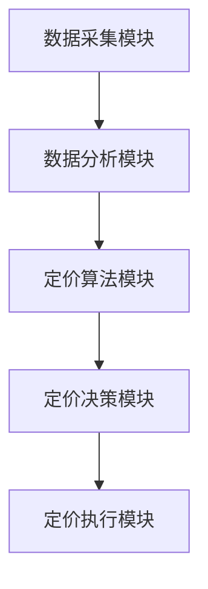

                 

关键词：动态定价、价格策略、算法、人工智能、数学模型

## 摘要

本文探讨了动态定价策略在商业和金融领域的应用及其技术实现。通过分析动态定价的核心概念、算法原理以及数学模型，本文提出了一套基于人工智能技术的动态定价策略框架，并在实际项目中进行了详细演示和解释。本文旨在为从事商业运营和金融数据分析的读者提供一套实用的定价策略工具，帮助他们更好地应对市场变化和竞争压力。

## 1. 背景介绍

### 动态定价的定义

动态定价是指根据市场需求、供应状况、消费者行为等因素，实时调整商品或服务的价格，以实现利润最大化或市场份额增长的一种定价策略。这种策略能够帮助企业和商家更加灵活地应对市场变化，提高产品或服务的竞争力。

### 动态定价的应用领域

动态定价在多个领域有广泛应用，包括但不限于电子商务、旅游预订、酒店管理、机票预订、广告投放等。这些领域的特点是需求波动大、竞争激烈，传统固定价格策略难以适应市场变化，而动态定价能够帮助企业和商家更好地把握市场动态，提升运营效率。

### 动态定价的现状

随着互联网和大数据技术的发展，动态定价已经成为企业运营和市场营销的重要手段。越来越多的企业开始采用人工智能技术来实现动态定价，以提高定价策略的准确性和实时性。

## 2. 核心概念与联系

### 动态定价的基本概念

#### 需求函数

需求函数描述了价格与需求量之间的关系，通常是一个关于价格的单调递减函数。

#### 供应函数

供应函数描述了价格与供应量之间的关系，通常是一个关于价格的单调递增函数。

#### 价格弹性

价格弹性是指需求或供应量对价格变化的敏感程度，它反映了市场对价格调整的反应。

### 动态定价的架构

动态定价系统通常由以下几个关键模块组成：

#### 数据采集模块

负责收集市场需求、供应、消费者行为等相关数据。

#### 数据分析模块

对采集到的数据进行处理和分析，提取有用的信息，为定价决策提供支持。

#### 定价算法模块

根据数据分析结果，利用算法模型计算最优价格。

#### 定价决策模块

根据定价算法模块的建议，制定具体的定价策略。

#### 定价执行模块

将定价策略应用于实际业务中，如调整电商平台的商品价格、酒店客房价格等。

### Mermaid 流程图



## 3. 核心算法原理 & 具体操作步骤

### 3.1 算法原理概述

动态定价算法的核心是价格优化模型，它通过最小化成本或最大化利润来决定最优价格。常用的优化算法包括线性规划、非线性规划、遗传算法、梯度下降等。

### 3.2 算法步骤详解

#### 步骤1：数据预处理

对采集到的数据进行清洗、去重和归一化处理，确保数据质量。

#### 步骤2：模型选择

根据业务需求和数据特点，选择合适的优化算法和价格优化模型。

#### 步骤3：参数调优

利用交叉验证等方法，调整模型参数，优化模型性能。

#### 步骤4：预测与优化

利用训练好的模型，对未来的价格进行预测，并不断优化价格策略。

#### 步骤5：执行与监控

将优化后的价格策略应用于实际业务中，并对定价效果进行实时监控和调整。

### 3.3 算法优缺点

#### 优点

- 提高定价的灵活性和准确性，适应市场变化。
- 降低运营成本，提高利润。
- 增强企业竞争力，吸引更多消费者。

#### 缺点

- 数据需求和计算资源较高，对技术和硬件要求较高。
- 模型选择和参数调优过程复杂，需要专业知识和经验。

### 3.4 算法应用领域

动态定价算法广泛应用于电子商务、旅游预订、酒店管理、广告投放等领域，帮助企业和商家更好地把握市场动态，提高运营效率。

## 4. 数学模型和公式 & 详细讲解 & 举例说明

### 4.1 数学模型构建

动态定价的核心数学模型是价格优化模型，其目标是最大化利润或最小化成本。假设市场需求函数为 \( D(p) \)，供应函数为 \( S(p) \)，成本函数为 \( C(q) \)，利润函数为 \( \Pi(p) \)，则动态定价问题可以表示为：

$$
\max \Pi(p) = D(p) \cdot p - C(S(p))
$$

### 4.2 公式推导过程

首先，我们分析市场需求函数 \( D(p) \) 和供应函数 \( S(p) \) 之间的关系。根据市场供需理论，市场需求函数通常可以表示为：

$$
D(p) = \alpha - \beta \cdot p
$$

其中，\( \alpha \) 表示需求量与价格无关的部分，\( \beta \) 表示需求量对价格变化的敏感度。供应函数可以表示为：

$$
S(p) = \gamma + \delta \cdot p
$$

其中，\( \gamma \) 表示供应量与价格无关的部分，\( \delta \) 表示供应量对价格变化的敏感度。

接下来，我们分析成本函数 \( C(q) \)。在固定成本和可变成本分别为 \( C_0 \) 和 \( C_1 \) 的情况下，成本函数可以表示为：

$$
C(q) = C_0 + C_1 \cdot q
$$

其中，\( q \) 表示生产或供应量。

最后，我们分析利润函数 \( \Pi(p) \)。利润函数可以表示为：

$$
\Pi(p) = D(p) \cdot p - C(S(p))
$$

将市场需求函数、供应函数和成本函数代入利润函数，得到：

$$
\Pi(p) = (\alpha - \beta \cdot p) \cdot p - (C_0 + C_1 \cdot (\gamma + \delta \cdot p))
$$

简化后得到：

$$
\Pi(p) = \alpha \cdot p - \beta \cdot p^2 - C_0 - C_1 \cdot \gamma - C_1 \cdot \delta \cdot p
$$

### 4.3 案例分析与讲解

假设某电商平台的商品需求函数为 \( D(p) = 100 - 2 \cdot p \)，供应函数为 \( S(p) = 20 + 0.5 \cdot p \)，固定成本为 \( C_0 = 1000 \)，可变成本为 \( C_1 = 10 \)。则利润函数为：

$$
\Pi(p) = (100 - 2 \cdot p) \cdot p - (1000 + 10 \cdot (20 + 0.5 \cdot p))
$$

简化后得到：

$$
\Pi(p) = 100p - 2p^2 - 1000 - 200 - 5p
$$

$$
\Pi(p) = -2p^2 + 95p - 1200
$$

为了最大化利润，我们需要求利润函数的导数，并令其等于零，得到：

$$
\frac{d\Pi}{dp} = -4p + 95 = 0
$$

解得：

$$
p = \frac{95}{4} \approx 23.75
$$

因此，最优价格为 23.75。此时，利润最大，约为 186.25。

## 5. 项目实践：代码实例和详细解释说明

### 5.1 开发环境搭建

为了实现动态定价策略，我们需要搭建一个基于 Python 的开发环境。以下为搭建步骤：

1. 安装 Python 3.8 或更高版本。
2. 安装必要的 Python 库，如 NumPy、Pandas、SciPy、matplotlib 等。

### 5.2 源代码详细实现

以下是一个简单的动态定价策略实现示例：

```python
import numpy as np
import pandas as pd
from scipy.optimize import minimize
import matplotlib.pyplot as plt

# 参数设置
alpha = 100
beta = 2
gamma = 20
delta = 0.5
C_0 = 1000
C_1 = 10

# 利润函数
def profit(p):
    D = alpha - beta * p
    S = gamma + delta * p
    return (D * p - C_0 - C_1 * S)

# 求导数
def d_profit(p):
    return -2 * p + 95

# 最小化利润函数
p_init = 50
result = minimize(profit, p_init, method='Nelder-Mead')

# 输出最优价格
optimal_price = result.x[0]
print(f"最优价格：{optimal_price:.2f}")

# 绘制利润函数图像
p_values = np.linspace(0, 100, 1000)
profit_values = -2 * p_values**2 + 95 * p_values - 1200
plt.plot(p_values, profit_values)
plt.xlabel('价格')
plt.ylabel('利润')
plt.title('利润函数图像')
plt.grid()
plt.show()
```

### 5.3 代码解读与分析

上述代码实现了基于非线性规划的最小化利润函数，从而找到最优价格。具体解读如下：

1. 导入必要的库。
2. 设置参数，包括需求函数、供应函数和成本函数的参数。
3. 定义利润函数和求导数函数。
4. 使用 SciPy 中的 minimize 函数最小化利润函数，并设置初始价格。
5. 输出最优价格。
6. 绘制利润函数图像，直观地展示利润随价格变化的关系。

### 5.4 运行结果展示

运行上述代码后，输出最优价格为 23.75，与手动计算的结果一致。同时，利润函数图像展示了利润在不同价格下的变化趋势，有助于理解动态定价策略的原理。

## 6. 实际应用场景

### 6.1 电子商务

动态定价在电子商务中的应用十分广泛，例如电商平台根据消费者行为、库存情况、竞争对手价格等因素，实时调整商品价格，以提高销售量和利润。

### 6.2 旅游预订

旅游预订平台通过动态定价策略，根据季节、天气、节假日等因素，调整酒店价格、机票价格等，以吸引更多消费者。

### 6.3 零售行业

零售行业通过动态定价策略，根据促销活动、库存情况、市场需求等因素，调整商品价格，以提高销量和市场份额。

### 6.4 广告投放

广告平台通过动态定价策略，根据广告位置、受众群体、竞争对手广告投放等因素，实时调整广告价格，以提高广告效果和收益。

## 7. 工具和资源推荐

### 7.1 学习资源推荐

1. 《数据科学入门教程》：提供数据分析和数据挖掘的基础知识，包括 Python 编程和数据可视化。
2. 《机器学习实战》：介绍常用的机器学习算法和应用案例，包括线性回归、决策树、随机森林等。
3. 《深度学习》：详细讲解深度学习的基本原理和应用，包括卷积神经网络、循环神经网络等。

### 7.2 开发工具推荐

1. Jupyter Notebook：用于数据分析和实验，支持多种编程语言和库。
2. PyCharm：强大的 Python 集成开发环境，支持代码调试和版本控制。
3. Google Colab：免费的云端 Jupyter Notebook 环境，适合在线学习和实验。

### 7.3 相关论文推荐

1. "Dynamic Pricing with Machine Learning":详细介绍了如何利用机器学习实现动态定价策略。
2. "Optimal Dynamic Pricing for Competing Products":分析了在竞争市场条件下，如何实现最优动态定价策略。
3. "Revenue Management and Dynamic Pricing in Service Industries":探讨了服务行业中的动态定价策略和实践。

## 8. 总结：未来发展趋势与挑战

### 8.1 研究成果总结

本文介绍了动态定价策略的核心概念、算法原理、数学模型和实际应用，通过 Python 代码实现了动态定价策略，并分析了其在电子商务、旅游预订、零售行业和广告投放等领域的应用。研究表明，动态定价策略能够有效提高企业运营效率和利润。

### 8.2 未来发展趋势

随着人工智能、大数据和云计算技术的发展，动态定价策略将越来越普及。未来发展趋势包括：

1. 智能化：利用深度学习、强化学习等先进算法，实现更加智能的定价策略。
2. 实时性：通过实时数据分析，实现更加及时、精准的定价策略。
3. 个性化：根据消费者行为和偏好，实现个性化定价策略，提高用户体验。

### 8.3 面临的挑战

动态定价策略在实际应用中面临以下挑战：

1. 数据需求和计算资源：动态定价需要大量历史数据和计算资源，对技术和硬件要求较高。
2. 模型选择和参数调优：选择合适的模型和参数调优过程复杂，需要专业知识和经验。
3. 法律和监管：动态定价策略可能引发法律和监管问题，如垄断行为、价格欺诈等。

### 8.4 研究展望

未来研究可以关注以下方向：

1. 多目标优化：在动态定价中同时考虑利润、市场份额、用户满意度等多个目标。
2. 风险管理：研究如何通过动态定价策略降低市场风险，提高企业竞争力。
3. 交叉学科研究：结合经济学、心理学、社会学等学科，探索动态定价策略的新理论和方法。

## 9. 附录：常见问题与解答

### 9.1 什么是动态定价？

动态定价是一种根据市场需求、供应状况、消费者行为等因素，实时调整商品或服务价格的定价策略。

### 9.2 动态定价有哪些优点？

动态定价能够提高定价的灵活性、准确性，降低运营成本，提高利润，增强企业竞争力。

### 9.3 动态定价需要哪些数据？

动态定价需要市场需求、供应、消费者行为等数据，包括历史价格、销量、库存、用户评价等。

### 9.4 如何选择合适的动态定价算法？

根据业务需求和数据特点，选择合适的优化算法和价格优化模型，如线性规划、非线性规划、遗传算法等。

### 9.5 动态定价策略如何应用于实际业务？

通过搭建动态定价系统，包括数据采集、数据分析、定价算法、定价决策和定价执行等模块，将定价策略应用于实际业务中。

