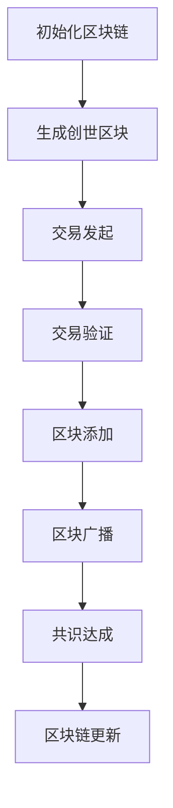

                 

关键词：区块链，应用开发，去中心化，智能合约，DApp，节点，共识算法，安全性，效率优化

> 摘要：本文详细探讨了区块链技术的核心概念和应用开发实践，包括区块链的去中心化特性、智能合约的实现、DApp的开发流程，以及共识算法的选择和优化。通过实例讲解和案例分析，展示了区块链在金融、供应链管理、医疗保健等领域的实际应用，并对未来发展趋势和面临的挑战进行了深入探讨。

## 1. 背景介绍

### 区块链的起源与发展

区块链作为一种分布式账本技术，最早由中本聪（Satoshi Nakamoto）在2008年提出，并在次年发布了比特币（Bitcoin）的创世区块，标志着区块链技术的诞生。比特币作为一种去中心化的数字货币，通过区块链技术实现了去中心化的交易和货币发行，引发了全球金融行业的广泛关注。

随着时间的推移，区块链技术不断发展，其应用范围也从金融领域扩展到供应链管理、医疗保健、物联网等多个领域。区块链技术的核心优势在于去中心化、安全性、透明性和不可篡改性，这些特点使得其在解决传统行业痛点方面具有巨大的潜力。

### 区块链技术的核心概念

- **分布式账本**：区块链技术本质上是一个分布式数据库，所有参与者都可以在账本上添加和验证交易信息，而不需要依赖中央机构。
- **去中心化**：去中心化意味着没有单一的权威机构控制整个网络，所有节点都具有相同的权利和义务。
- **加密技术**：区块链采用密码学技术确保交易的安全性和隐私性，例如使用公钥加密和私钥解密来保护交易信息。
- **智能合约**：智能合约是一种在区块链上执行的计算机程序，可以自动执行、控制和文档化合约条款。
- **共识算法**：共识算法是区块链网络中节点之间达成一致的方法，以确保所有节点具有相同的账本状态。

## 2. 核心概念与联系

### 区块链架构


在区块链架构中，核心概念包括：

- **节点**：区块链网络中的每个参与者都是一个节点，节点可以独立验证和记录交易。
- **区块**：区块是区块链中的基本单位，包含一定数量的交易记录。
- **链**：多个区块按时间顺序链接在一起形成区块链。

### Mermaid 流程图



### 核心概念联系

区块链的去中心化特性依赖于节点之间的协作和共识算法。节点通过加密技术确保交易的安全性和隐私性，而共识算法则确保所有节点对账本状态的一致性。

## 3. 核心算法原理 & 具体操作步骤

### 3.1 算法原理概述

区块链的核心算法包括加密算法、共识算法和智能合约。以下是每种算法的基本原理：

- **加密算法**：使用公钥加密和私钥解密来保护交易信息，确保交易的安全性和隐私性。
- **共识算法**：确保所有节点对账本状态的一致性，常见的共识算法有工作量证明（PoW）、权益证明（PoS）和委托权益证明（DPoS）。
- **智能合约**：使用计算机编程语言编写的程序，自动执行合同条款，确保合同的执行和不可篡改性。

### 3.2 算法步骤详解

1. **交易发起**：用户在区块链网络上发起交易，交易包含发送方的公钥、接收方的公钥和交易金额。
2. **交易验证**：节点接收交易后，使用发送方的私钥验证交易的有效性，确保交易来自合法用户。
3. **区块添加**：验证后的交易被添加到区块中，区块包含一定数量的交易记录。
4. **区块广播**：新创建的区块被广播到网络中的所有节点，节点接收到区块后进行验证。
5. **共识达成**：节点通过共识算法达成一致，确保所有节点对账本状态的一致性。
6. **区块链更新**：验证后的区块被添加到区块链上，区块链持续更新。

### 3.3 算法优缺点

- **加密算法**：优点是确保交易的安全性和隐私性，缺点是加密过程可能消耗大量计算资源。
- **共识算法**：优点是确保账本一致性，缺点是某些算法可能导致网络拥堵。
- **智能合约**：优点是自动执行合同条款，缺点是合同一旦执行就无法更改。

### 3.4 算法应用领域

- **加密算法**：广泛应用于数字货币交易和身份验证。
- **共识算法**：应用于去中心化应用（DApp）和智能合约网络。
- **智能合约**：应用于金融衍生品、供应链管理和物联网等领域。

## 4. 数学模型和公式 & 详细讲解 & 举例说明

### 4.1 数学模型构建

区块链中的数学模型主要包括密码学模型和共识算法模型。密码学模型用于加密和解密交易信息，共识算法模型用于节点之间的协作。

### 4.2 公式推导过程

密码学模型的关键公式包括：

- **加密公式**：$c = E(m, k)$
- **解密公式**：$m = D(c, k)$

其中，$m$ 是明文信息，$c$ 是密文信息，$k$ 是加密密钥。

共识算法模型的关键公式包括：

- **工作量证明**：$PoW = H(PrevHash, Nonce)$
- **权益证明**：$PoS = Exp(OwnerStake)$

其中，$H$ 表示哈希函数，$PrevHash$ 是前一个区块的哈希值，$Nonce$ 是随机数，$OwnerStake$ 是节点持有的权益。

### 4.3 案例分析与讲解

以比特币的工作量证明（PoW）算法为例，其核心思想是通过计算找到一个随机数 $Nonce$，使得区块的哈希值 $PoW$ 小于目标值。具体步骤如下：

1. **初始化**：选择一个随机数 $Nonce$。
2. **计算哈希值**：使用区块的哈希函数计算 $PoW = H(PrevHash, Nonce)$。
3. **比较哈希值**：判断 $PoW$ 是否小于目标值。
4. **调整 $Nonce$**：如果 $PoW$ 大于目标值，增加 $Nonce$ 的值，重复步骤 2 和 3，直到找到满足条件的 $Nonce$。
5. **添加区块**：找到合适的 $Nonce$ 后，将区块添加到区块链上。

### 4.4 案例分析与讲解

假设比特币网络的目标值是 $2^{160}$，区块的哈希值是 $PrevHash = 1234567890$，我们可以使用以下步骤找到满足条件的 $Nonce$：

1. **初始化**：选择 $Nonce = 0$。
2. **计算哈希值**：$PoW = H(1234567890, 0) = 9876543210$。
3. **比较哈希值**：$9876543210 > 2^{160}$，不满足条件。
4. **调整 $Nonce$**：增加 $Nonce$ 的值，重复步骤 2 和 3。
   - $Nonce = 1$，$PoW = H(1234567890, 1) = 1234567890$。
   - $PoW = 1234567890 < 2^{160}$，满足条件。
5. **添加区块**：找到合适的 $Nonce = 1$ 后，将区块添加到区块链上。

## 5. 项目实践：代码实例和详细解释说明

### 5.1 开发环境搭建

为了演示区块链应用开发，我们将使用以太坊（Ethereum）智能合约平台。以下是开发环境搭建的步骤：

1. **安装Node.js**：访问 [Node.js 官网](https://nodejs.org/) 下载并安装 Node.js。
2. **安装Truffle框架**：在命令行中执行以下命令：
   ```bash
   npm install -g truffle
   ```
3. **创建新项目**：在命令行中执行以下命令：
   ```bash
   truffle init
   ```
4. **配置项目文件**：编辑 `truffle-config.js` 文件，配置以太坊网络和编译器选项。

### 5.2 源代码详细实现

以下是一个简单的以太坊智能合约示例，实现了一个简单的存储功能：

```solidity
// SPDX-License-Identifier: MIT
pragma solidity ^0.8.0;

contract SimpleStorage {
    uint256 public storedData;

    function store(uint256 data) public {
        storedData = data;
    }

    function retrieve() public view returns (uint256) {
        return storedData;
    }
}
```

### 5.3 代码解读与分析

1. ** SPDX-License-Identifier**：声明智能合约的许可协议。
2. **pragma solidity **：指定编译器版本。
3. **contract SimpleStorage**：定义智能合约。
4. **uint256 public storedData**：声明一个公共的存储变量。
5. **function store(uint256 data) public**：定义一个存储数据的函数。
6. **function retrieve() public view returns (uint256)**：定义一个获取存储数据的函数。

### 5.4 运行结果展示

使用Truffle框架，我们可以轻松地部署和测试智能合约。以下是部署和测试的步骤：

1. **编译合约**：在命令行中执行以下命令：
   ```bash
   truffle compile
   ```
2. **部署合约**：在命令行中执行以下命令：
   ```bash
   truffle migrate
   ```
3. **测试合约**：在命令行中执行以下命令：
   ```bash
   truffle test
   ```

部署后，我们可以通过以太坊网络查看合约的存储值。例如，在 [Etherscan](https://etherscan.io/) 上，输入合约地址，可以看到合约的存储值和交易信息。

## 6. 实际应用场景

### 金融领域

区块链技术在金融领域有广泛的应用，例如数字货币、跨境支付和去中心化金融（DeFi）。数字货币如比特币和以太坊已经成为全球知名的数字资产，跨境支付通过区块链可以实现快速、低成本的跨境转账。DeFi平台如Aave和Compound提供了去中心化的借贷和投资服务，使金融资源更加公平和高效地分配。

### 供应链管理

区块链技术在供应链管理中用于确保商品的真实性和可追溯性。通过将商品信息记录在区块链上，可以创建一个不可篡改的供应链账本，使供应链参与者可以实时跟踪商品的状态和位置。例如，IBM和Maersk合作开发的TradeLens平台利用区块链技术提高了全球集装箱运输的透明度和效率。

### 医疗保健

区块链技术在医疗保健领域有潜力改善病历管理、药品追溯和医疗数据共享。通过将患者病历存储在区块链上，可以确保病历的完整性和隐私性，并且只有授权的医疗专业人员可以访问。区块链还可以用于追踪药品的生产、分销和消费，确保药品的真实性和安全性。

### 物联网

区块链技术在物联网（IoT）中用于确保设备间的安全通信和数据完整性。通过将物联网设备的数据记录在区块链上，可以确保数据的真实性和不可篡改性。例如，在智能电网中，区块链可以用于确保电力交易的透明性和可靠性。

## 6.4 未来应用展望

### 增强安全性

随着区块链技术的普及，安全性问题变得越来越重要。未来，区块链技术将在加密技术、共识算法和网络安全方面进行优化，以提高区块链系统的安全性。

### 提高效率

区块链技术的效率优化是另一个重要方向。通过改进共识算法、优化网络传输和降低交易成本，可以提高区块链系统的处理能力和响应速度，使其能够支持大规模应用。

### 跨链互操作

跨链互操作是区块链技术发展的关键挑战之一。未来，不同区块链之间的互操作性将得到加强，实现不同区块链系统之间的数据共享和交易。

### 生态系统建设

区块链技术的应用需要良好的生态系统支持，包括开发工具、开发框架、安全协议和治理机制。未来，区块链生态系统将不断完善，为开发者提供更好的开发环境和资源。

## 7. 工具和资源推荐

### 7.1 学习资源推荐

- **区块链入门教程**：[Blockchain Basics](https://www.ibm.com/learning/blockchain-basics)
- **智能合约开发教程**：[Solidity by Example](https://www.soliditybyexample.com/)
- **区块链论文集**：[Cryptoeconomics](https://www.cryptoeconomicsjournal.com/)

### 7.2 开发工具推荐

- **以太坊开发框架**：[Truffle](https://www.trufflesuite.com/)
- **区块链模拟平台**：[Ganache](https://www.ganache.io/)
- **智能合约调试工具**：[Remix IDE](https://remix.ethereum.org/)

### 7.3 相关论文推荐

- **比特币：一种点对点的电子现金系统**：[Bitcoin: A Peer-to-Peer Electronic Cash System](https://bitcoin.org/bitcoin.pdf)
- **以太坊黄皮书**：[Ethereum Yellow Paper](https://ethereum.github.io/yellowpaper/paper.pdf)
- **去中心化应用：设计与实现**：[Decentralized Applications: Building Blockchains and Smart Contracts](https://www.amazon.com/Decentralized-Applications-Building-Blockchains-Smart/dp/159327925X)

## 8. 总结：未来发展趋势与挑战

### 8.1 研究成果总结

本文探讨了区块链技术的核心概念、应用开发实践和实际应用场景。通过分析区块链技术的优点和挑战，总结了区块链技术在未来发展中的机遇和方向。

### 8.2 未来发展趋势

未来，区块链技术将在安全性、效率、互操作性和生态系统建设方面得到进一步发展。随着技术的不断成熟，区块链将在更多领域得到应用，为传统行业带来深刻的变革。

### 8.3 面临的挑战

区块链技术面临的主要挑战包括安全性、扩展性、互操作性和法律监管。未来，需要解决这些挑战，以确保区块链技术的可持续发展和广泛应用。

### 8.4 研究展望

区块链技术具有巨大的潜力，未来将继续在金融、供应链管理、医疗保健、物联网等领域发挥重要作用。研究者将继续探索区块链技术的优化和应用，推动区块链技术的创新和发展。

## 9. 附录：常见问题与解答

### Q：区块链技术是否可以完全替代传统数据库？

A：区块链技术可以部分替代传统数据库，但在某些场景下仍然需要传统数据库的支持。区块链的优势在于去中心化、安全性和不可篡改性，但在存储大量数据和处理速度方面可能不如传统数据库高效。

### Q：智能合约是否一定安全？

A：智能合约的安全性与编写代码的复杂度有关。如果智能合约存在漏洞，可能会导致资金损失。因此，开发智能合约时需要严格测试和审查，以确保其安全性。

### Q：区块链网络是否可以完全去中心化？

A：理论上，区块链网络可以完全去中心化，但在实际应用中，完全去中心化可能导致网络性能下降。因此，许多区块链网络采用了部分中心化的架构，以提高性能和可扩展性。

### Q：区块链技术是否可以完全解决数据隐私问题？

A：区块链技术可以提高数据的透明性和安全性，但在某些场景下仍然需要额外措施来解决数据隐私问题。例如，可以使用零知识证明等技术实现数据隐私保护。

---

本文由禅与计算机程序设计艺术（Zen and the Art of Computer Programming）撰写，旨在为读者提供关于区块链技术全面而深入的指导。在探索区块链技术的未来时，我们期待更多的开发者和研究者的加入，共同推动区块链技术的创新和发展。

