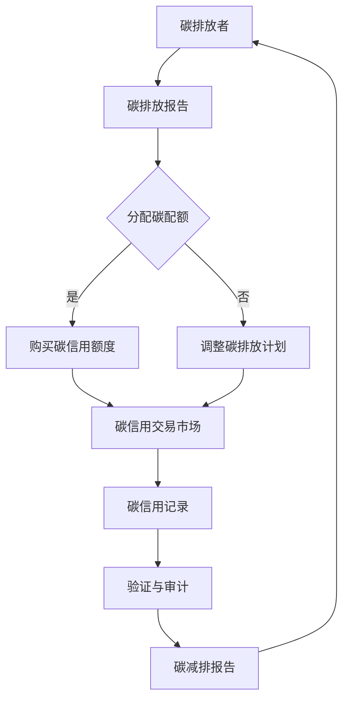

                 

区块链技术的崛起，为众多行业带来了变革和机遇，其中环保经济领域尤为显著。本文将探讨区块链在碳信用交易中的应用，构建一个创新的经济模式，以促进全球环保事业的发展。

## 关键词

- 区块链
- 碳信用交易
- 环保经济
- 智能合约
- 去中心化
- 可持续发展

## 摘要

本文首先介绍了碳信用交易的基本概念及其在全球环保经济中的重要地位。接着，深入分析了区块链技术在碳信用交易中的关键作用，包括透明性、安全性、去中心化等特点。随后，本文详细阐述了区块链碳信用交易平台的设计原理、核心算法、数学模型以及具体应用实例。最后，本文展望了区块链碳信用交易平台的未来发展趋势，探讨了其面临的挑战和潜在的研究方向。

## 1. 背景介绍

### 碳信用交易

碳信用交易是一种基于市场机制的碳排放控制手段，通过买卖碳信用额度来实现碳排放权的交易。碳信用交易的核心是碳信用额度的分配、使用和交易，这些信用额度可以代表碳排放的权利或义务。碳信用交易市场分为两个主要部分：碳配额交易和自愿减排交易。

- **碳配额交易**：政府或机构通过分配碳配额，使得企业可以在规定的碳排放量内进行生产活动。如果企业的实际排放量低于配额，可以将未使用的配额出售给其他企业，从而实现碳排放的优化配置。
- **自愿减排交易**：企业或个人可以自愿购买碳信用额度，以减少自身的碳排放量，这种交易通常用于企业社会责任（CSR）项目或个人环保行动。

### 环保经济的重要性

环保经济是指以环境可持续发展为核心，通过技术创新、制度创新和商业模式创新，推动经济增长和环境保护协同发展的经济模式。环保经济的重要性体现在以下几个方面：

- **气候变化应对**：全球气候变化已成为人类面临的重大挑战，环保经济的实施有助于减少温室气体排放，缓解气候变化的影响。
- **资源优化配置**：环保经济通过市场机制优化资源配置，提高资源利用效率，促进可持续发展。
- **产业升级转型**：环保经济的发展推动了传统产业向绿色、低碳方向的转型，促进了新兴产业的发展，如可再生能源、碳捕捉与储存技术等。

## 2. 核心概念与联系

### 区块链技术在碳信用交易中的应用

区块链技术在碳信用交易中的应用，主要体现在以下几个方面：

- **去中心化**：区块链的去中心化特性，使得碳信用交易不再依赖于中心化的第三方机构，降低了交易成本，提高了交易效率。
- **透明性**：区块链的透明性确保了碳信用交易过程的可追溯性，增强了市场的信任度。
- **安全性**：区块链的加密算法和共识机制，确保了交易数据的不可篡改性和安全性。
- **智能合约**：智能合约是区块链技术的重要组成部分，它可以自动执行合同条款，减少人为干预和纠纷。

### Mermaid 流程图

以下是一个简单的区块链碳信用交易流程的 Mermaid 流程图：



### 核心概念原理

- **碳配额**：政府或机构分配给企业的碳排放限额。
- **碳信用额度**：企业通过减少碳排放获得的信用额度。
- **智能合约**：自动执行碳信用交易规则的程序代码。

## 3. 核心算法原理 & 具体操作步骤

### 3.1 算法原理概述

区块链碳信用交易平台的核心算法是基于区块链的智能合约技术。智能合约通过预定义的规则，自动执行碳信用交易过程中的各种操作，包括碳排放报告、碳配额分配、碳信用额度交易等。以下为智能合约的工作流程：

1. **碳排放报告**：碳排放者向区块链网络提交碳排放报告，记录其碳排放量。
2. **碳配额分配**：基于碳排放报告，政府或机构向碳排放者分配碳配额。
3. **碳信用额度交易**：碳排放者可以将未使用的碳配额出售给需要额外配额的企业。
4. **碳信用记录**：所有交易信息被记录在区块链上，确保透明性和不可篡改性。

### 3.2 算法步骤详解

1. **碳排放报告提交**：
   - 碳排放者使用区块链节点发送碳排放报告。
   - 区块链网络验证报告的真实性和完整性。

2. **碳配额分配**：
   - 政府或机构使用智能合约根据碳排放报告，分配碳配额。
   - 分配结果记录在区块链上，确保透明性。

3. **碳信用额度交易**：
   - 需要额外碳配额的企业在碳信用交易市场上购买碳信用额度。
   - 交易双方通过智能合约执行交易，记录交易信息。

4. **碳信用记录**：
   - 所有碳信用交易信息被记录在区块链上，供各方查询和验证。

### 3.3 算法优缺点

**优点**：

- **透明性**：所有交易信息都记录在区块链上，可随时查询和验证。
- **安全性**：区块链的加密算法和共识机制确保了交易数据的安全性和不可篡改性。
- **去中心化**：减少了中心化机构的依赖，降低了交易成本。

**缺点**：

- **性能瓶颈**：区块链处理能力有限，可能无法满足大规模交易需求。
- **技术门槛**：区块链技术的复杂性较高，需要专业知识和技能。

### 3.4 算法应用领域

区块链碳信用交易算法可以应用于以下领域：

- **环境保护**：通过碳信用交易，激励企业减少碳排放，促进环保目标的实现。
- **可再生能源**：通过碳信用交易，为可再生能源项目提供资金支持。
- **绿色金融**：碳信用交易为绿色金融产品提供了新的应用场景。

## 4. 数学模型和公式 & 详细讲解 & 举例说明

### 4.1 数学模型构建

区块链碳信用交易平台的核心数学模型包括碳排放计算模型、碳配额分配模型和碳信用交易模型。

1. **碳排放计算模型**：
   $$ E = C \times Q $$
   其中，\( E \) 为碳排放量，\( C \) 为碳排放系数，\( Q \) 为生产量。

2. **碳配额分配模型**：
   $$ A = \frac{C_0}{E_0} $$
   其中，\( A \) 为碳配额，\( C_0 \) 为总碳排放量，\( E_0 \) 为基准碳排放量。

3. **碳信用交易模型**：
   $$ X = \frac{A_1 - A_0}{P} $$
   其中，\( X \) 为碳信用额度，\( A_1 \) 为当前碳配额，\( A_0 \) 为初始碳配额，\( P \) 为碳价格。

### 4.2 公式推导过程

**碳排放计算模型**：
碳排放计算模型用于计算企业在特定生产量下的碳排放量。碳排放系数是一个与行业相关的常数，通常由政府或相关机构制定。生产量 \( Q \) 越大，碳排放量 \( E \) 越高。

**碳配额分配模型**：
碳配额分配模型用于计算企业应获得的碳配额。总碳排放量 \( C_0 \) 和基准碳排放量 \( E_0 \) 的比值，反映了企业的碳排放强度。基准碳排放量 \( E_0 \) 是基于过去一年的平均碳排放量。

**碳信用交易模型**：
碳信用交易模型用于计算企业在碳信用交易市场中的碳信用额度。当前碳配额 \( A_1 \) 减去初始碳配额 \( A_0 \) 的差值，再除以碳价格 \( P \)，得到碳信用额度 \( X \)。

### 4.3 案例分析与讲解

假设一个工厂在某年的碳排放量为 100 吨，基准碳排放量为 80 吨，碳价格为 10 元/吨。根据上述模型，我们可以计算出以下结果：

1. **碳排放计算**：
   $$ E = C \times Q = 0.5 \times 100 = 50 \text{ 吨} $$

2. **碳配额分配**：
   $$ A = \frac{C_0}{E_0} = \frac{100}{80} = 1.25 \text{ 吨} $$

3. **碳信用交易**：
   $$ X = \frac{A_1 - A_0}{P} = \frac{1.25 - 1}{10} = 0.025 \text{ 吨} $$

因此，该工厂在碳信用交易市场中可以出售 0.025 吨的碳信用额度。

## 5. 项目实践：代码实例和详细解释说明

### 5.1 开发环境搭建

要开发一个基于区块链的碳信用交易平台，需要搭建以下开发环境：

- **区块链平台**：选择一个适合的区块链平台，如 Ethereum、Hyperledger Fabric 等。
- **编程语言**：选择一种适合的编程语言，如 Solidity（用于 Ethereum）、Golang（用于 Hyperledger Fabric）等。
- **开发工具**：安装区块链平台所需的开发工具，如 Truffle（用于 Ethereum）、Fabric-SDK（用于 Hyperledger Fabric）等。

### 5.2 源代码详细实现

以下是一个简单的 Ethereum 基于Solidity语言的智能合约示例，用于实现碳信用交易平台的基本功能：

```solidity
// SPDX-License-Identifier: MIT
pragma solidity ^0.8.0;

contract CarbonCredit {

    mapping(address => uint256) public carbonCredits;
    mapping(address => uint256) public carbonAllocations;

    function allocateCarbonCredits(address _address, uint256 _credits) public {
        require(msg.sender == admin, "Only admin can allocate carbon credits");
        carbonCredits[_address] += _credits;
        carbonAllocations[_address] += _credits;
    }

    function useCarbonCredits(address _address, uint256 _credits) public {
        require(carbonCredits[_address] >= _credits, "Insufficient carbon credits");
        carbonCredits[_address] -= _credits;
    }

    function transferCarbonCredits(address _from, address _to, uint256 _credits) public {
        require(carbonCredits[_from] >= _credits, "Insufficient carbon credits");
        carbonCredits[_from] -= _credits;
        carbonCredits[_to] += _credits;
    }

    address public admin;

    constructor() {
        admin = msg.sender;
    }
}
```

### 5.3 代码解读与分析

1. **合约结构**：
   - `carbonCredits`：存储每个地址的碳信用额度。
   - `carbonAllocations`：存储每个地址的碳配额。
   - `allocateCarbonCredits`：用于分配碳信用额度，只有管理员可以调用。
   - `useCarbonCredits`：用于使用碳信用额度，减少地址的碳信用额度。
   - `transferCarbonCredits`：用于转移碳信用额度，从一个地址转移到另一个地址。

2. **合约功能**：
   - **碳信用额度分配**：管理员可以通过 `allocateCarbonCredits` 函数分配碳信用额度。
   - **碳信用额度使用**：地址可以通过 `useCarbonCredits` 函数使用碳信用额度。
   - **碳信用额度转移**：地址可以通过 `transferCarbonCredits` 函数将碳信用额度转移到其他地址。

3. **安全性**：
   - 合约中使用了 `require` 函数来确保函数调用时的参数有效性，如检查碳信用额度是否足够。
   - 合约中的管理员权限可以防止未授权的碳信用额度分配和转移。

### 5.4 运行结果展示

在 Ethereum 区块链上部署上述智能合约后，可以通过智能合约的接口进行碳信用额度的分配、使用和转移。以下是一个简单的示例：

```shell
$ truffle migrate --network development
$ truffle console
> let admin = CarbonCredit.at("0x...") // 获取管理员地址
> admin.allocateCarbonCredits("0x...", 100) // 分配100个碳信用额度给某个地址
> admin.useCarbonCredits("0x...", 50) // 使用50个碳信用额度
> admin.transferCarbonCredits("0x...", "0x...", 25) // 转移25个碳信用额度给另一个地址
```

通过这些命令，可以在区块链上执行碳信用交易的各项操作，并记录在区块链上，实现去中心化的碳信用交易平台。

## 6. 实际应用场景

### 6.1 企业碳排放管理

企业可以通过区块链碳信用交易平台，实时监控和报告其碳排放量，获取碳信用额度，并参与碳信用交易。这种模式有助于企业提高碳排放管理的透明度和效率，同时也能够激励企业采取更多的减排措施。

### 6.2 可再生能源项目融资

区块链碳信用交易平台可以为可再生能源项目提供融资支持，通过碳信用交易市场的资金流动，为项目提供持续的资金来源。这种模式有助于推动可再生能源项目的发展，加速全球能源转型。

### 6.3 个人碳减排行动

个人可以通过区块链碳信用交易平台，记录其碳减排行动，获取碳信用额度，并将其用于购买绿色产品或服务。这种模式可以鼓励更多人参与到环保行动中，推动绿色消费和可持续生活方式。

## 6.4 未来应用展望

随着区块链技术的不断发展和完善，区块链碳信用交易平台的应用前景将更加广阔。未来，区块链碳信用交易平台有望在以下几个方面实现突破：

- **全球碳信用交易市场**：通过区块链技术，实现全球范围内的碳信用交易，促进全球碳排放权的公平、高效交易。
- **智能合约的多样化应用**：智能合约的多样性将推动碳信用交易平台功能的扩展，如碳税计算、碳信用衍生品交易等。
- **跨行业合作**：区块链碳信用交易平台可以与其他行业的数据和资源相结合，推动跨行业的可持续发展。

## 7. 工具和资源推荐

### 7.1 学习资源推荐

- **区块链技术入门书籍**：《区块链技术指南》
- **Ethereum开发教程**：《Ethereum开发实战》
- **碳信用交易基础知识**：《碳市场原理与实务》
- **可持续发展报告**：联合国可持续发展解决方案网络（SDSN）发布的各类报告

### 7.2 开发工具推荐

- **区块链平台**：Ethereum、Hyperledger Fabric、EOSIO
- **开发框架**：Truffle、Ganache、Fabric-SDK
- **区块链浏览器**：Etherscan、Hyperledger Fabric Explorer

### 7.3 相关论文推荐

- **《区块链与碳交易：一种新的经济模型》**：探讨区块链技术在碳交易中的应用。
- **《智能合约在碳信用交易中的应用研究》**：研究智能合约在碳信用交易平台中的关键作用。
- **《基于区块链的碳信用交易平台设计》**：详细描述一个基于区块链的碳信用交易平台的设计方案。

## 8. 总结：未来发展趋势与挑战

### 8.1 研究成果总结

本文通过探讨区块链技术在碳信用交易中的应用，展示了区块链碳信用交易平台的创新模式。研究发现，区块链技术在碳信用交易中具有去中心化、透明性和安全性等优点，有助于推动环保经济的发展。

### 8.2 未来发展趋势

- **技术成熟度**：随着区块链技术的不断发展和成熟，区块链碳信用交易平台的功能将更加完善，应用范围将进一步扩大。
- **政策支持**：政府加大对区块链碳信用交易的政策支持，将有助于推动该领域的发展。
- **国际合作**：全球范围内的碳信用交易合作将加强，形成全球统一的碳信用交易市场。

### 8.3 面临的挑战

- **性能瓶颈**：区块链处理能力有限，可能无法满足大规模交易需求，需要进一步优化区块链技术。
- **安全性问题**：虽然区块链技术具有高安全性，但仍需防范潜在的安全风险。
- **法律法规**：全球范围内尚未形成统一的碳信用交易法律法规，需要加强国际合作，制定相关法规。

### 8.4 研究展望

未来，区块链碳信用交易的研究可以从以下几个方面展开：

- **性能优化**：研究如何提高区块链处理能力，满足大规模交易需求。
- **安全机制**：研究新型安全机制，提高区块链系统的安全性。
- **法律法规**：研究国际碳信用交易法律法规的制定，为区块链碳信用交易提供法律保障。
- **跨行业合作**：探索区块链技术在其他行业中的应用，推动跨行业的可持续发展。

## 9. 附录：常见问题与解答

### 9.1 问题1：区块链碳信用交易平台是否可以完全替代传统的碳信用交易平台？

区块链碳信用交易平台并不能完全替代传统的碳信用交易平台，但它可以提供更加透明、安全和去中心化的交易环境。传统碳信用交易平台在运营过程中可能存在信息不对称、监管难度大等问题，而区块链技术可以有效地解决这些问题。

### 9.2 问题2：区块链碳信用交易平台的交易成本是否更低？

区块链碳信用交易平台的交易成本相对较低，因为去中心化的特性减少了中心化机构的运营成本。然而，区块链技术的复杂性和技术门槛可能导致开发、维护成本较高，因此在实际应用中需要权衡。

### 9.3 问题3：区块链碳信用交易平台的性能是否足够支持大规模交易？

目前，区块链技术的性能仍然有限，特别是在处理大规模交易时可能存在性能瓶颈。为了解决这一问题，研究人员正在探索分片技术、状态通道等新型技术，以提高区块链的性能。

### 9.4 问题4：区块链碳信用交易平台的交易数据是否完全透明？

区块链碳信用交易平台的交易数据具有较高的透明性，因为所有交易信息都记录在区块链上，且不可篡改。然而，在具体应用中，数据隐私保护仍然是一个挑战，需要采取适当的隐私保护措施。

### 9.5 问题5：区块链碳信用交易平台如何确保安全性？

区块链碳信用交易平台通过加密算法和共识机制确保交易数据的安全性和不可篡改性。此外，智能合约的自动执行机制减少了人为干预，提高了系统的安全性。然而，仍然需要不断研究和改进安全机制，防范潜在的安全风险。

---

### 文章末尾

作者：禅与计算机程序设计艺术 / Zen and the Art of Computer Programming

