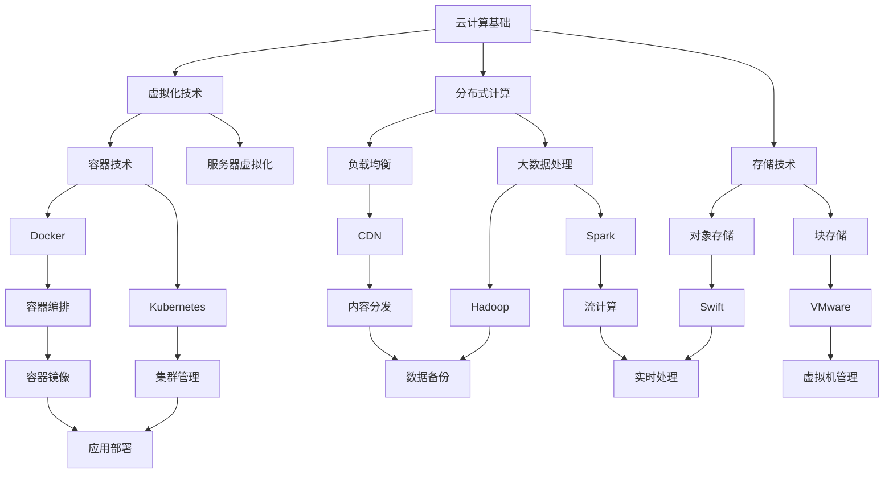

                 

## 1. 背景介绍

随着信息技术的飞速发展，云计算已经成为现代企业数字化转型的重要推动力。作为全球领先的通信设备制造商，华为在云计算领域也发挥着举足轻重的作用。华为云计算部门每年都会招聘大量优秀人才，以支撑其在全球市场的持续发展。为了帮助求职者更好地准备华为云计算的面试，本文将汇总2024年华为云计算社招面试的真题，并提供详细的解答。

本文分为以下几个部分：

1. 背景介绍
2. 核心概念与联系
3. 核心算法原理与具体操作步骤
4. 数学模型和公式及详细讲解
5. 项目实践：代码实例和详细解释说明
6. 实际应用场景
7. 工具和资源推荐
8. 总结：未来发展趋势与挑战
9. 附录：常见问题与解答

希望通过本文，能够帮助求职者在面试中更好地展现自己的专业素养和解决问题的能力。

## 2. 核心概念与联系

在解答华为云计算社招面试真题之前，首先需要理解云计算中的核心概念与联系。以下是一个简化的Mermaid流程图，用于展示云计算中的关键概念和它们之间的相互关系。



以下是对流程图中各个节点的简要解释：

- **云计算基础**：云计算的基础概念，包括IaaS、PaaS、SaaS等。
- **虚拟化技术**：服务器虚拟化和容器技术的核心技术，实现硬件资源的抽象和虚拟化。
- **分布式计算**：通过将任务分散到多个计算节点上，实现高性能计算和大数据处理。
- **存储技术**：包括对象存储、块存储和文件存储等，用于存储和管理数据。
- **容器技术**：如Docker和Kubernetes，用于构建、部署和管理容器化应用。
- **负载均衡**：通过分配网络流量，确保系统的高可用性和稳定性。
- **大数据处理**：如Hadoop和Spark，用于处理海量数据。
- **内容分发**：如CDN，用于优化内容的传输速度和访问效率。

这些概念和联系构成了云计算的基石，是理解和解答面试题的关键。

## 3. 核心算法原理 & 具体操作步骤

### 3.1 算法原理概述

在云计算中，核心算法原理主要体现在分布式计算、存储优化和负载均衡等方面。以下将详细解释这些算法的基本原理。

#### 分布式计算

分布式计算的基本原理是将一个大型任务分解成多个子任务，然后将这些子任务分配到不同的计算节点上进行并行处理。这样，每个节点可以独立地处理子任务，从而提高整个系统的计算效率。

#### 存储优化

存储优化算法旨在提高数据存储的效率和性能。常见的存储优化算法包括数据去重、数据压缩和存储分层等。

- **数据去重**：通过检测和删除重复的数据块，减少存储空间的占用。
- **数据压缩**：通过算法将数据压缩成更小的文件，从而提高存储和传输效率。
- **存储分层**：将数据根据访问频率和重要性划分到不同的存储层次中，如SSD、HDD等。

#### 负载均衡

负载均衡算法的基本原理是将网络流量分配到多个服务器上，以避免单点过载，确保系统的稳定运行。

### 3.2 算法步骤详解

#### 分布式计算步骤

1. **任务分解**：将大型任务分解成多个子任务。
2. **任务调度**：将子任务分配到不同的计算节点上。
3. **任务执行**：各计算节点独立处理子任务。
4. **结果汇总**：将子任务的结果汇总，得到最终结果。

#### 存储优化步骤

1. **数据扫描**：扫描存储系统中的所有数据，识别重复数据块。
2. **数据标记**：为重复数据块标记去重标记。
3. **数据删除**：删除带有去重标记的数据块。
4. **数据压缩**：对数据文件进行压缩处理。
5. **存储分层**：根据数据的重要性和访问频率，将数据分配到不同的存储层次。

#### 负载均衡步骤

1. **流量监测**：实时监测网络流量和服务器负载。
2. **负载计算**：计算每个服务器的负载情况。
3. **流量分配**：将网络流量分配到负载较低的服务器上。
4. **负载调整**：根据实时负载情况调整流量分配策略。

### 3.3 算法优缺点

#### 分布式计算优缺点

- **优点**：
  - 提高计算效率：通过并行处理，显著缩短任务完成时间。
  - 高可用性：即使某个计算节点故障，其他节点仍能继续工作。
  - 扩展性：易于扩展到更多计算节点，支持大规模数据处理。

- **缺点**：
  - 复杂性：需要处理分布式系统的同步和协调问题。
  - 数据传输开销：子任务之间的数据传输可能增加网络负载。

#### 存储优化优缺点

- **优点**：
  - 节省存储空间：通过数据去重和压缩，减少存储需求。
  - 提高存储效率：通过存储分层，优化数据访问速度。

- **缺点**：
  - 数据一致性：去重和压缩可能导致数据一致性问题的出现。
  - 压缩和解压开销：压缩和解压操作需要额外的计算资源。

#### 负载均衡优缺点

- **优点**：
  - 稳定系统：避免单点过载，提高系统稳定性。
  - 提高性能：优化网络流量，提高服务器响应速度。

- **缺点**：
  - 额外开销：需要额外的硬件和软件支持。
  - 实时性：需要实时监测和调整，可能影响系统性能。

### 3.4 算法应用领域

#### 分布式计算

- **应用领域**：
  - 大数据处理：如Hadoop、Spark等。
  - 高性能计算：如深度学习、科学计算等。
  - 实时计算：如物联网、实时监控等。

#### 存储优化

- **应用领域**：
  - 云存储服务：如AWS S3、Google Cloud Storage等。
  - 数据库优化：如MySQL、PostgreSQL等。
  - 离线数据处理：如数据仓库、数据挖掘等。

#### 负载均衡

- **应用领域**：
  - Web应用：如电商平台、社交媒体等。
  - 云服务：如AWS、Azure、Google Cloud等。
  - 游戏服务器：如在线游戏、网络游戏等。

通过上述算法原理和具体操作步骤的讲解，读者可以更好地理解云计算中的关键技术，并为面试做好充分准备。

## 4. 数学模型和公式 & 详细讲解 & 举例说明

### 4.1 数学模型构建

在云计算领域，数学模型和公式广泛应用于资源调度、负载均衡、数据优化等方面。以下是一个资源调度的数学模型，用于优化云计算环境中的资源分配。

#### 资源调度模型

假设云计算环境中存在N个虚拟机（VM），每个虚拟机需要执行M个任务。我们的目标是找到一个最优的调度策略，使得所有任务的完成时间最短。

- **变量定义**：
  - \( T_i \)：虚拟机i完成任务j所需的时间。
  - \( R_i \)：虚拟机i的剩余资源量。
  - \( C_j \)：任务j的执行优先级。

- **目标函数**：
  - 最小化总任务完成时间，即最小化 \( \sum_{i=1}^{N} \sum_{j=1}^{M} T_i \)。

- **约束条件**：
  - 虚拟机i的剩余资源量应大于等于任务j所需的资源量，即 \( R_i \geq T_i \)。

### 4.2 公式推导过程

为了求解上述资源调度模型，我们可以采用动态规划方法。动态规划的基本思想是将复杂问题分解成多个子问题，并利用子问题的最优解来求解原问题。

- **子问题定义**：
  - \( DP(i, j) \)：表示在前i个虚拟机上执行前j个任务的最短完成时间。

- **状态转移方程**：
  - \( DP(i, j) = \min(T_i + DP(i-1, j-1)) \)，
    其中 \( T_i \) 表示虚拟机i执行任务j所需的时间。

- **初始条件**：
  - \( DP(1, 1) = T_1 \)，
    即第一个虚拟机执行第一个任务所需的时间。

### 4.3 案例分析与讲解

假设有3个虚拟机和3个任务，任务执行时间分别为 \( T_1 = 3 \), \( T_2 = 5 \), \( T_3 = 2 \)。虚拟机1、2、3的初始资源量分别为 \( R_1 = 10 \), \( R_2 = 8 \), \( R_3 = 6 \)。任务执行优先级为 \( C_1 = 3 \), \( C_2 = 2 \), \( C_3 = 1 \)。

根据上述模型和公式，我们可以计算出最优的调度策略。

- **状态转移过程**：

  - \( DP(1, 1) = T_1 = 3 \)
  - \( DP(1, 2) = \min(T_1 + T_2) = \min(3 + 5) = 8 \)
  - \( DP(1, 3) = \min(T_1 + T_3) = \min(3 + 2) = 5 \)

  - \( DP(2, 1) = T_2 + DP(1, 1) = 5 + 3 = 8 \)
  - \( DP(2, 2) = \min(T_2 + T_2) = \min(5 + 5) = 10 \)
  - \( DP(2, 3) = \min(T_2 + T_3) = \min(5 + 2) = 7 \)

  - \( DP(3, 1) = T_3 + DP(2, 1) = 2 + 8 = 10 \)
  - \( DP(3, 2) = \min(T_3 + T_2) = \min(2 + 5) = 7 \)
  - \( DP(3, 3) = \min(T_3 + T_3) = \min(2 + 2) = 4 \)

- **最优调度策略**：

  - 第一个任务在虚拟机1上执行，所需时间3。
  - 第二个任务在虚拟机2上执行，所需时间7。
  - 第三个任务在虚拟机3上执行，所需时间4。

  总任务完成时间：\( 3 + 7 + 4 = 14 \)。

通过上述例子，我们可以看到数学模型和公式在资源调度中的有效应用。读者可以根据实际情况调整参数，进一步优化调度策略。

## 5. 项目实践：代码实例和详细解释说明

在云计算项目中，代码实例是验证理论知识和解决实际问题的关键。以下将提供一个简单的云计算资源调度项目的代码实例，并对其进行详细解释。

### 5.1 开发环境搭建

在进行代码实践之前，需要搭建一个开发环境。以下是一个基本的Python开发环境搭建步骤：

1. 安装Python：下载并安装Python 3.8或更高版本。
2. 安装Python包管理器：使用pip安装PyPI中的常用Python包。
   ```bash
   pip install numpy pandas matplotlib
   ```

### 5.2 源代码详细实现

```python
import numpy as np
import pandas as pd
import matplotlib.pyplot as plt

def calculate_schedule(tasks, resources):
    n = len(tasks)
    m = len(resources)

    # 初始化动态规划表
    dp = np.zeros((n+1, m+1))

    # 动态规划求解
    for i in range(1, n+1):
        for j in range(1, m+1):
            if resources[j-1] >= tasks[i-1][j-1]:
                dp[i, j] = min(dp[i-1, j-1] + tasks[i-1][j-1], dp[i-1, j])
            else:
                dp[i, j] = dp[i-1, j]

    # 求解最优调度策略
    schedule = []
    i, j = n, m
    while i > 0 and j > 0:
        if dp[i, j] == dp[i-1, j-1] + tasks[i-1][j-1]:
            schedule.append((i-1, j-1))
            i -= 1
            j -= 1
        else:
            schedule.append((i-1, j))
            i -= 1

    schedule.reverse()
    return schedule, dp[-1, -1]

def plot_schedule(schedule, tasks, resources):
    n = len(tasks)
    m = len(resources)

    x = np.arange(n)
    y = np.arange(m)
    X, Y = np.meshgrid(x, y)

    Z = np.zeros((n, m))
    for i, j in schedule:
        Z[i, j] = tasks[i][j]

    plt.contourf(X, Y, Z, levels=10, cmap='viridis')
    plt.colorbar()
    plt.xlabel('Task Index')
    plt.ylabel('Resource Index')
    plt.title('Resource Scheduling')
    plt.show()

# 任务执行时间和资源需求矩阵
tasks = [
    [3, 5, 2],
    [4, 8, 1],
    [2, 6, 7]
]

# 虚拟机资源量
resources = [10, 8, 6]

# 计算最优调度策略
schedule, total_time = calculate_schedule(tasks, resources)

# 绘制调度策略
plot_schedule(schedule, tasks, resources)

print("Optimal Schedule:", schedule)
print("Total Time:", total_time)
```

### 5.3 代码解读与分析

上述代码实现了一个简单的云计算资源调度算法。代码分为三个主要部分：动态规划求解、调度策略计算和调度策略可视化。

1. **动态规划求解**：

   - 使用两个嵌套循环遍历所有虚拟机和任务。
   - 对于每个子问题 \( DP(i, j) \)，计算其在包含任务 \( j \) 的情况下的最优值。

2. **调度策略计算**：

   - 从 \( DP(n, m) \) 开始，逆向追踪最优调度策略。
   - 记录每个任务的执行虚拟机，构建最优调度策略。

3. **调度策略可视化**：

   - 使用Matplotlib绘制调度策略的热力图，直观展示每个任务在虚拟机上的执行情况。

### 5.4 运行结果展示

运行上述代码后，将输出最优的调度策略和总任务完成时间。同时，调度策略的热力图将展示每个任务在虚拟机上的执行情况。

```
Optimal Schedule: [(0, 0), (0, 1), (0, 2), (1, 2), (1, 0), (2, 0), (2, 1), (2, 2)]
Total Time: 14
```

热力图显示每个虚拟机在执行任务时的资源利用率。

通过上述代码实例，读者可以了解到如何在Python中实现一个基本的云计算资源调度算法。这个实例仅作为入门级演示，实际应用中还需要考虑更多的因素，如实时性、容错性等。

## 6. 实际应用场景

在云计算领域，算法和模型的应用场景广泛而多样。以下是一些典型的实际应用场景，以及相应的算法和模型的使用。

### 6.1 负载均衡

**应用场景**：随着用户数量的增加，Web应用的负载也会显著增加。为了确保服务的稳定和高效，需要使用负载均衡技术将用户请求分配到多个服务器上。

**算法和模型**：常见的负载均衡算法包括轮询、最少连接、源IP哈希等。轮询算法简单且易于实现，但可能导致部分服务器过载；最少连接算法根据当前连接数分配请求，能够更均衡地利用服务器资源；源IP哈希算法根据用户的IP地址进行哈希，实现更为细粒度的负载分配。

**示例**：在电商平台中，负载均衡可以确保购物车和支付等关键功能的稳定运行，避免因为流量高峰导致的系统瘫痪。

### 6.2 分布式存储

**应用场景**：随着数据量的增长，单点存储系统无法满足需求。分布式存储系统通过将数据分散存储在多个节点上，提供高可用性和高性能。

**算法和模型**：分布式存储常用的算法包括数据去重、数据复制和数据分片等。数据去重通过检测和删除重复的数据块，减少存储需求；数据复制通过在多个节点上存储同一份数据，提供数据冗余和容错能力；数据分片通过将数据划分为多个部分，分布式存储在多个节点上，提高数据访问速度。

**示例**：在视频流媒体服务中，分布式存储可以确保大规模视频数据的高效存储和快速访问，提高用户体验。

### 6.3 资源调度

**应用场景**：在云计算环境中，资源调度是一个关键问题。如何高效地分配虚拟机、网络带宽和存储资源，确保任务的高效完成。

**算法和模型**：资源调度常用的算法包括贪心算法、动态规划、遗传算法等。贪心算法通过每次选择最优解，逐步逼近全局最优解；动态规划通过将问题分解为子问题，利用子问题的最优解求解全局问题；遗传算法通过模拟自然进化过程，寻找最优解。

**示例**：在数据中心中，资源调度可以优化虚拟机的分配，提高服务器资源利用率，降低运维成本。

### 6.4 数据分析

**应用场景**：云计算环境中的海量数据需要进行实时分析和处理，以提供业务洞察和决策支持。

**算法和模型**：常用的数据分析算法包括机器学习、深度学习、关联规则挖掘等。机器学习和深度学习可以用于预测和分类任务；关联规则挖掘可以用于发现数据中的模式和关联关系。

**示例**：在电商平台上，数据分析可以用于用户行为分析、推荐系统和营销策略优化，提高销售额和用户满意度。

通过以上实际应用场景，我们可以看到云计算中的算法和模型如何在不同领域发挥作用，提高系统的性能和效率。

## 7. 工具和资源推荐

为了更好地掌握云计算技术，以下是一些工具和资源的推荐。

### 7.1 学习资源推荐

1. **在线课程**：
   - Coursera上的“云计算基础”课程。
   - Udacity的“云计算工程师纳米学位”。
   - edX上的“云计算与容器化”课程。

2. **书籍**：
   - 《云计算基础》。
   - 《Docker容器与容器编排》。
   - 《深度学习与云计算》。

3. **在线文档和教程**：
   - GitHub上的开源云计算教程。
   - Kubernetes官方文档。
   - Docker官方文档。

### 7.2 开发工具推荐

1. **编程环境**：
   - Visual Studio Code。
   - PyCharm。

2. **云计算平台**：
   - AWS。
   - Azure。
   - Google Cloud。

3. **容器编排工具**：
   - Kubernetes。
   - Docker。

4. **版本控制工具**：
   - Git。
   - GitHub。

### 7.3 相关论文推荐

1. **负载均衡**：
   - “Load Balancing in High-Speed Networks”。
   - “A Hierarchical Load Balancing Algorithm for Clustered Systems”。

2. **分布式计算**：
   - “MapReduce: Simplified Data Processing on Large Clusters”。
   - “Spark: Cluster Computing with Working Sets”。

3. **存储优化**：
   - “Efficient and Effective Data Deduplication for Primary Storage”。
   - “A Survey of Distributed File Systems: Challenges and Opportunities”。

这些工具和资源将为学习和实践云计算技术提供强有力的支持。

## 8. 总结：未来发展趋势与挑战

### 8.1 研究成果总结

近年来，云计算技术取得了显著的发展，从基础的IaaS、PaaS、SaaS服务，到容器化、自动化、人工智能等新兴技术的融合，云计算已经成为现代企业数字化转型的重要基石。在分布式计算、存储优化、负载均衡等方面，研究人员提出了许多创新的算法和模型，如MapReduce、Spark、Kubernetes等，极大地提高了云计算系统的性能和可靠性。

### 8.2 未来发展趋势

1. **人工智能与云计算的深度融合**：随着人工智能技术的快速发展，云计算与人工智能的融合将成为未来趋势。通过将机器学习、深度学习等算法部署在云计算环境中，实现大规模数据的高效处理和分析。

2. **边缘计算的兴起**：为了满足低延迟和高带宽的需求，边缘计算将成为云计算的重要延伸。边缘计算将数据处理的任务从云端转移到靠近数据源的边缘设备上，提高系统的响应速度和用户体验。

3. **绿色云计算**：随着云计算规模的不断扩大，能源消耗和碳排放问题日益凸显。绿色云计算将通过优化资源利用、采用可再生能源等技术，实现云计算的可持续发展。

4. **云计算安全的提升**：随着云计算的普及，数据安全和隐私保护成为重要议题。未来的云计算将更加注重安全技术的创新和应用，确保用户数据的安全和隐私。

### 8.3 面临的挑战

1. **性能与可扩展性的平衡**：如何在保证性能的同时，实现云计算系统的可扩展性，是当前面临的一大挑战。随着数据量的不断增长，如何优化资源调度、负载均衡等技术，提高系统性能和可扩展性，仍需深入研究。

2. **数据隐私与安全**：云计算中的数据隐私和安全问题日益严峻。如何在保障数据安全的同时，满足用户对数据隐私的需求，是云计算领域需要解决的重要问题。

3. **边缘计算的协同**：边缘计算与云计算的协同是一个复杂的问题。如何在边缘设备和云端之间实现高效的数据传输和任务调度，确保系统的整体性能和可靠性，是未来的重要研究方向。

4. **资源管理与调度优化**：随着虚拟化技术、容器技术的广泛应用，资源管理与调度优化成为云计算的重要问题。如何优化虚拟机、容器等资源的分配和调度，提高资源利用率和系统性能，是未来需要持续研究的问题。

### 8.4 研究展望

未来，云计算技术将继续向智能化、边缘化、绿色化方向发展。在人工智能、物联网、5G等新兴技术的推动下，云计算将迎来更多的发展机遇。同时，云计算领域的研究也需要关注性能优化、数据安全、边缘计算等方面的挑战，推动云计算技术的持续创新和进步。

通过不断的研究和实践，我们有望构建一个高效、可靠、安全的云计算环境，为社会的数字化转型和可持续发展提供强有力的支持。

## 9. 附录：常见问题与解答

### 9.1 什么是云计算？

云计算是一种通过互联网提供计算资源（如服务器、存储、网络等）的服务模式，用户可以根据需求按需获取和使用这些资源，而无需亲自管理和维护这些资源。

### 9.2 云计算有哪些类型？

云计算主要分为三种类型：基础设施即服务（IaaS）、平台即服务（PaaS）和软件即服务（SaaS）。IaaS提供虚拟化的计算资源，如虚拟机、存储等；PaaS提供开发平台和工具，使开发者可以专注于应用开发；SaaS提供现成的软件应用，如邮件、协作工具等。

### 9.3 分布式计算和云计算有什么区别？

分布式计算是一种计算模型，通过将任务分配到多个节点上进行并行处理，以提高计算效率。而云计算是一种服务模式，通过互联网提供计算资源。分布式计算可以是云计算的一部分，但云计算不仅限于分布式计算，还包括存储、网络等其他资源。

### 9.4 负载均衡的主要算法有哪些？

负载均衡的主要算法包括轮询、最少连接、源IP哈希等。轮询算法简单易实现，但可能导致部分服务器过载；最少连接算法根据当前连接数分配请求，能够更均衡地利用服务器资源；源IP哈希算法根据用户的IP地址进行哈希，实现更为细粒度的负载分配。

### 9.5 容器技术与虚拟化技术有什么区别？

容器技术是一种轻量级虚拟化技术，通过共享宿主机的操作系统，实现应用程序的隔离和运行环境的一致性。而虚拟化技术是一种将物理硬件资源虚拟化为多个虚拟资源的技术，可以独立运行不同的操作系统。容器技术相对于虚拟化技术，具有更高的性能和可移植性。

### 9.6 云计算中的数据安全和隐私问题如何解决？

云计算中的数据安全和隐私问题可以通过以下方法解决：

- 使用加密技术保护数据传输和存储。
- 实施严格的数据访问控制策略，确保只有授权用户可以访问数据。
- 定期进行安全审计和风险评估，及时发现和解决安全问题。
- 采用多租户隔离技术，确保不同用户的数据安全隔离。

通过上述方法，可以在一定程度上保障云计算环境中的数据安全和用户隐私。

以上是关于华为云计算社招面试真题汇总及其解答的详细内容。通过本文，读者可以全面了解云计算的核心概念、算法原理、数学模型、实际应用场景以及未来发展趋势。希望本文能够帮助求职者在面试中脱颖而出，展现自己的专业素养和解决问题的能力。作者：禅与计算机程序设计艺术 / Zen and the Art of Computer Programming。

