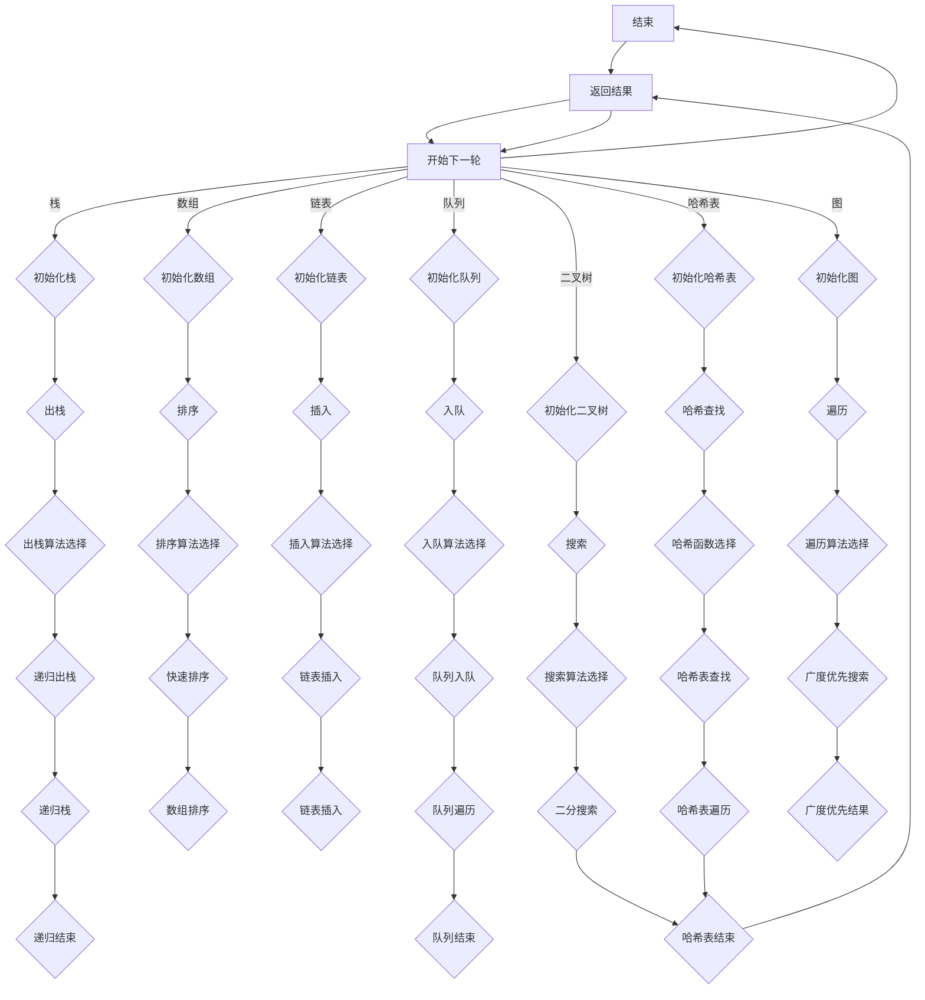

                 

### 1. 背景介绍

华为作为中国领先的科技公司，其校招面试一直以其严谨的考察能力和深度的技术要求著称。随着科技的不断发展，华为在5G、云计算、人工智能等领域持续发力，校招面试题也紧跟技术前沿，涵盖了一系列复杂的算法问题、系统设计和编程挑战。

本文旨在为广大计算机专业的求职者提供一份2024年华为校招面试真题汇总及解答。通过系统地整理和解析这些面试题，本文希望能帮助读者更好地准备华为的面试，提高解题能力和应对策略。

华为的面试题目往往具有以下几个特点：

1. **技术深度**：问题往往涉及算法和数据结构的深层原理，需要应聘者具备扎实的基础知识。
2. **实际应用**：题目经常与实际工程问题相结合，考察应聘者的分析和解决实际问题的能力。
3. **编程实践**：编程题常常要求应聘者现场编写代码，并要求代码不仅正确，还要高效、可维护。
4. **系统设计**：系统设计题需要应聘者能够从整体上把握系统架构，并提出合理的设计方案。

本文将按照以下结构进行论述：

- **核心概念与联系**：首先介绍与面试题目相关的核心概念，并提供相应的Mermaid流程图。
- **核心算法原理与具体操作步骤**：详细讲解算法的原理，并提供步骤化的解题思路。
- **数学模型和公式**：阐述解决问题的数学模型，并使用latex格式给出关键公式。
- **项目实践**：提供实际代码实例，并进行详细解读。
- **实际应用场景**：讨论算法和技术的实际应用场景。
- **工具和资源推荐**：推荐相关学习资源和开发工具。

通过以上结构的解析，本文希望能够为读者提供一个全面、系统的准备华为校招面试的方案。

### 2. 核心概念与联系

在解决华为校招面试题目之前，首先需要了解一些核心概念和它们之间的联系。以下是与面试题目密切相关的一些概念，以及它们在解决面试题时的应用：

#### 数据结构与算法基础

- **数组（Array）**：一种基础的数据结构，用于存储一系列有序元素。在面试中，常常涉及数组的查找、排序、旋转等操作。
- **链表（Linked List）**：另一种基础的数据结构，由一系列节点组成，每个节点包含数据和指向下一个节点的指针。链表的操作包括插入、删除、遍历等。
- **栈（Stack）**：一种后进先出（LIFO）的数据结构，常用于实现递归、深度优先搜索（DFS）等。
- **队列（Queue）**：一种先进先出（FIFO）的数据结构，常用于实现广度优先搜索（BFS）等。
- **哈希表（Hash Table）**：通过哈希函数将关键字映射到数组索引，常用于快速查找和插入操作。
- **二叉树（Binary Tree）**：一种重要的树形数据结构，包括二叉搜索树（BST）、平衡二叉树（AVL）等。
- **图（Graph）**：由节点和边组成的集合，用于表示复杂关系，常用于路径查找、最短路径等问题。

#### 算法类型

- **排序算法**：包括冒泡排序、选择排序、插入排序、快速排序、归并排序等，用于对数组进行排序。
- **搜索算法**：包括线性搜索、二分搜索、广度优先搜索、深度优先搜索等，用于在数据结构中查找元素。
- **动态规划**：通过将复杂问题分解为子问题，并存储子问题的解，用于解决最优化问题。
- **贪心算法**：通过每一步选择当前最优解，逐步构建最终最优解。

#### 系统设计概念

- **服务化架构**：将系统分解为多个服务模块，通过API进行通信，提高系统的可维护性和扩展性。
- **分布式系统**：通过多个节点协作完成任务，提高系统的容错性和性能。
- **缓存策略**：使用缓存减少对后端系统的访问压力，提高系统响应速度。
- **数据库设计**：包括关系数据库和非关系数据库的设计，如SQL查询优化、索引设计等。

#### Mermaid流程图

为了更好地理解这些核心概念的应用，下面提供一个Mermaid流程图，展示数据结构与算法在解决面试题时的基本流程。



通过这个流程图，我们可以看到在解决面试题时，如何从理解问题开始，选择合适的数据结构和算法，并通过一系列步骤最终得到结果。

### 3. 核心算法原理 & 具体操作步骤

在理解了核心概念与联系后，我们将深入探讨一些核心算法的原理，并详细讲解具体操作步骤。以下是一些常见的面试算法问题，以及对应的解题思路和步骤：

#### 3.1 排序算法

排序算法是面试中经常出现的问题。以下介绍几种常见的排序算法及其步骤：

##### 1. 冒泡排序（Bubble Sort）

**原理**：通过多次交换相邻元素，将最大的元素逐步移动到数组的末尾。

**步骤**：

1. 从第一个元素开始，比较相邻的两个元素，如果第一个比第二个大，就交换它们。
2. 这样继续进行下去，直到每一轮结束后，最大的元素都被移动到当前未排序部分的末尾。
3. 重复以上步骤，直到整个数组有序。

**代码示例**：

```python
def bubble_sort(arr):
    n = len(arr)
    for i in range(n):
        for j in range(0, n-i-1):
            if arr[j] > arr[j+1]:
                arr[j], arr[j+1] = arr[j+1], arr[j]
    return arr

arr = [64, 34, 25, 12, 22, 11, 90]
sorted_arr = bubble_sort(arr)
print("Sorted array:", sorted_arr)
```

##### 2. 选择排序（Selection Sort）

**原理**：每次从未排序的部分中找到最小（或最大）的元素，并将其移动到已排序部分的末尾。

**步骤**：

1. 从第一个元素开始，找到整个数组中的最小值。
2. 将最小值与第一个元素交换。
3. 在剩下的未排序部分中重复步骤1和2。
4. 重复以上步骤，直到整个数组有序。

**代码示例**：

```python
def selection_sort(arr):
    n = len(arr)
    for i in range(n):
        min_idx = i
        for j in range(i+1, n):
            if arr[j] < arr[min_idx]:
                min_idx = j
        arr[i], arr[min_idx] = arr[min_idx], arr[i]
    return arr

arr = [64, 34, 25, 12, 22, 11, 90]
sorted_arr = selection_sort(arr)
print("Sorted array:", sorted_arr)
```

##### 3. 插入排序（Insertion Sort）

**原理**：将数组分为已排序和未排序两部分，每次从未排序部分取出一个元素，将其插入到已排序部分的正确位置。

**步骤**：

1. 从第二个元素开始，将当前元素与已排序部分进行比较，直到找到其正确的插入位置。
2. 将该元素插入到已排序部分。
3. 重复以上步骤，直到整个数组有序。

**代码示例**：

```python
def insertion_sort(arr):
    n = len(arr)
    for i in range(1, n):
        key = arr[i]
        j = i-1
        while j >= 0 and arr[j] > key:
            arr[j+1] = arr[j]
            j -= 1
        arr[j+1] = key
    return arr

arr = [64, 34, 25, 12, 22, 11, 90]
sorted_arr = insertion_sort(arr)
print("Sorted array:", sorted_arr)
```

##### 4. 快速排序（Quick Sort）

**原理**：通过递归将数组划分为已排序的左右两部分，并合并它们。

**步骤**：

1. 选择一个基准元素。
2. 将小于基准元素的元素移动到其左侧，大于基准元素的元素移动到其右侧。
3. 递归对左右两部分进行快速排序。
4. 合并左右两部分的排序结果。

**代码示例**：

```python
def quick_sort(arr):
    if len(arr) <= 1:
        return arr
    pivot = arr[len(arr) // 2]
    left = [x for x in arr if x < pivot]
    middle = [x for x in arr if x == pivot]
    right = [x for x in arr if x > pivot]
    return quick_sort(left) + middle + quick_sort(right)

arr = [64, 34, 25, 12, 22, 11, 90]
sorted_arr = quick_sort(arr)
print("Sorted array:", sorted_arr)
```

#### 3.2 搜索算法

搜索算法在面试中也是经常出现的问题。以下介绍几种常见的搜索算法及其步骤：

##### 1. 线性搜索（Linear Search）

**原理**：从数组的第一个元素开始，逐个比较，直到找到目标元素或到达数组的末尾。

**步骤**：

1. 从数组的第一个元素开始，与目标元素进行比较。
2. 如果相等，返回元素的索引。
3. 如果不相等，继续与下一个元素进行比较。
4. 直到找到目标元素或到达数组的末尾。

**代码示例**：

```python
def linear_search(arr, target):
    for i in range(len(arr)):
        if arr[i] == target:
            return i
    return -1

arr = [64, 34, 25, 12, 22, 11, 90]
target = 22
index = linear_search(arr, target)
print("Target found at index:", index)
```

##### 2. 二分搜索（Binary Search）

**原理**：通过递归地将搜索范围缩小一半，直到找到目标元素或确定目标不存在。

**步骤**：

1. 确定搜索范围的中间值。
2. 如果中间值等于目标值，返回中间值的索引。
3. 如果中间值大于目标值，递归搜索左侧子数组。
4. 如果中间值小于目标值，递归搜索右侧子数组。
5. 重复以上步骤，直到找到目标元素或确定目标不存在。

**代码示例**：

```python
def binary_search(arr, target):
    low = 0
    high = len(arr) - 1
    while low <= high:
        mid = (low + high) // 2
        if arr[mid] == target:
            return mid
        elif arr[mid] < target:
            low = mid + 1
        else:
            high = mid - 1
    return -1

arr = [1, 3, 5, 7, 9, 11, 13, 15]
target = 7
index = binary_search(arr, target)
print("Target found at index:", index)
```

#### 3.3 动态规划

动态规划是一种解决最优化问题的算法。以下介绍一个常见的动态规划问题及其解题步骤：

##### 0-1背包问题（Knapsack Problem）

**原理**：给定一组物品，每个物品有一个重量和价值，求解在不超过背包承载量的情况下，如何选择物品以获得最大价值。

**步骤**：

1. 定义一个二维数组dp，其中dp[i][j]表示在前i个物品中，选择若干个放入一个容量为j的背包中获得的最大价值。
2. 初始化dp数组的边界条件。
3. 根据状态转移方程填充dp数组：
   - 如果物品i的重量大于背包容量j，则dp[i][j] = dp[i-1][j]。
   - 如果物品i的重量小于等于背包容量j，则dp[i][j] = max(dp[i-1][j], dp[i-1][j-weight[i]] + value[i])。

**代码示例**：

```python
def knapsack(values, weights, capacity):
    n = len(values)
    dp = [[0] * (capacity + 1) for _ in range(n + 1)]
    for i in range(1, n + 1):
        for j in range(1, capacity + 1):
            if weights[i-1] > j:
                dp[i][j] = dp[i-1][j]
            else:
                dp[i][j] = max(dp[i-1][j], dp[i-1][j-weights[i-1]] + values[i-1])
    return dp[n][capacity]

values = [60, 100, 120]
weights = [10, 20, 30]
capacity = 50
max_value = knapsack(values, weights, capacity)
print("Maximum value:", max_value)
```

通过以上对排序、搜索和动态规划算法的详细讲解，我们可以看到这些算法在解决面试题时的核心原理和具体步骤。掌握这些算法不仅能帮助我们更好地解决面试题，也能在实际工程问题中发挥重要作用。

### 4. 数学模型和公式 & 详细讲解 & 举例说明

在解决复杂面试题目时，数学模型和公式是不可或缺的工具。以下将详细讲解几个常见的数学模型和公式，并给出具体的解释和示例。

#### 4.1 费波那契数列

费波那契数列（Fibonacci Sequence）是一个非常重要的数学序列，在算法和计算机科学中有广泛应用。该数列的递推关系如下：

\[ F(0) = 0, F(1) = 1 \]
\[ F(n) = F(n-1) + F(n-2) \quad (n \geq 2) \]

**数学公式**：

\[ F(n) = \frac{1}{\sqrt{5}} \left( \left(\frac{1 + \sqrt{5}}{2}\right)^n - \left(\frac{1 - \sqrt{5}}{2}\right)^n \right) \]

**详细讲解**：

- **递推公式**：该公式表示当前项等于前两项之和。这是费波那契数列的核心特点，也是其定义方式。
- **封闭形式**：通过数学推导可以得到费波那契数列的封闭形式，它将复杂的问题转化为一个简单的公式计算。

**举例说明**：

假设我们要计算第10个费波那契数：

\[ F(10) = \frac{1}{\sqrt{5}} \left( \left(\frac{1 + \sqrt{5}}{2}\right)^{10} - \left(\frac{1 - \sqrt{5}}{2}\right)^{10} \right) \]

使用计算器计算得到：

\[ F(10) \approx 55 \]

#### 4.2 动态规划中的状态转移方程

动态规划中的状态转移方程是解决最优化问题的关键。以下以0-1背包问题为例，介绍其状态转移方程。

**状态定义**：

设 \( dp[i][j] \) 表示在前 \( i \) 个物品中，选择若干个放入容量为 \( j \) 的背包中获得的最大价值。

**状态转移方程**：

\[ dp[i][j] = \begin{cases} 
dp[i-1][j] & \text{如果物品 } i \text{ 不放入背包中} \\
dp[i-1][j-weight[i]] + value[i] & \text{如果物品 } i \text{ 放入背包中}
\end{cases} \]

**详细讲解**：

- **选择物品 \( i \) 不放入背包**：此时，问题转化为前 \( i-1 \) 个物品放入容量为 \( j \) 的背包中，即 \( dp[i-1][j] \)。
- **选择物品 \( i \) 放入背包**：此时，问题转化为前 \( i-1 \) 个物品放入容量为 \( j-weight[i] \) 的背包中，然后加上物品 \( i \) 的价值。

**举例说明**：

假设有3个物品，重量分别为 [2, 3, 5]，价值分别为 [3, 4, 5]，背包容量为 5。我们要计算放入背包的最大价值。

构建 \( dp \) 数组如下：

\[ 
\begin{array}{c|c|c|c|c|c}
  & 0 & 1 & 2 & 3 & 4 & 5 \\
\hline
0 & 0 & 0 & 0 & 0 & 0 & 0 \\
1 & 0 & 0 & 0 & 0 & 3 & 3 \\
2 & 0 & 0 & 0 & 0 & 3 & 7 \\
3 & 0 & 0 & 0 & 3 & 7 & 9 \\
\end{array}
\]

- 当 \( i = 1 \)，\( j = 2 \) 时，\( dp[1][2] = dp[0][2] = 0 \)（不放入）。
- 当 \( i = 1 \)，\( j = 3 \) 时，\( dp[1][3] = dp[0][3] = 0 \)（不放入）。
- 当 \( i = 2 \)，\( j = 2 \) 时，\( dp[2][2] = dp[1][2] = 0 \)（不放入）。
- 当 \( i = 2 \)，\( j = 3 \) 时，\( dp[2][3] = \max(dp[1][3], dp[1][0] + value[2]) = \max(0, 0 + 4) = 4 \)（放入）。
- 当 \( i = 3 \)，\( j = 3 \) 时，\( dp[3][3] = \max(dp[2][3], dp[2][0] + value[3]) = \max(4, 0 + 5) = 9 \)（放入）。

最终，放入背包的最大价值为 9。

#### 4.3 空间复杂度分析

空间复杂度是衡量算法所需额外空间大小的指标。通常用 \( O(f(n)) \) 表示，其中 \( f(n) \) 是算法所需空间与输入规模 \( n \) 的函数关系。

**数学公式**：

\[ \text{Space Complexity} = O(n + m) \]

其中，\( n \) 和 \( m \) 分别表示算法的输入规模和额外空间需求。

**详细讲解**：

- **输入规模 \( n \)**：通常表示算法处理的输入数据量。
- **额外空间 \( m \)**：包括算法内部使用的辅助数据结构、临时变量等。

**举例说明**：

假设有一个排序算法，其内部使用了一个额外的辅助数组，大小为 \( n \)。该算法的时间复杂度为 \( O(n \log n) \)，空间复杂度为 \( O(n) \)。

**计算示例**：

假设输入规模 \( n = 1000 \)，额外空间 \( m = n = 1000 \)。

\[ \text{Space Complexity} = O(1000 + 1000) = O(2000) = O(n) \]

通过以上对费波那契数列、动态规划状态转移方程和空间复杂度的详细讲解和举例，我们可以看到数学模型和公式在解决复杂面试题目中的重要性。掌握这些数学工具，不仅能够提高解题效率，还能更好地理解算法的核心原理。

### 5. 项目实践：代码实例和详细解释说明

#### 5.1 开发环境搭建

为了演示实际代码实现，我们将使用Python作为主要编程语言，并使用Jupyter Notebook作为开发环境。以下是搭建开发环境的步骤：

1. 安装Python：访问Python官网（https://www.python.org/）下载Python安装包，并按照安装向导进行安装。
2. 安装Jupyter Notebook：在命令行中输入以下命令：
   ```bash
   pip install notebook
   ```
3. 启动Jupyter Notebook：在命令行中输入以下命令：
   ```bash
   jupyter notebook
   ```
4. 在浏览器中打开Jupyter Notebook：浏览器会自动跳转到Jupyter Notebook界面，您可以在其中创建和运行Python代码。

#### 5.2 源代码详细实现

以下是一个简单的Python代码实例，用于演示如何使用快速排序算法对数组进行排序。

```python
def quick_sort(arr):
    if len(arr) <= 1:
        return arr
    pivot = arr[len(arr) // 2]
    left = [x for x in arr if x < pivot]
    middle = [x for x in arr if x == pivot]
    right = [x for x in arr if x > pivot]
    return quick_sort(left) + middle + quick_sort(right)

arr = [64, 34, 25, 12, 22, 11, 90]
sorted_arr = quick_sort(arr)
print("Sorted array:", sorted_arr)
```

**代码解读与分析**：

- **函数定义**：`quick_sort` 函数接受一个数组 `arr` 作为输入。
- **基本条件**：如果数组长度小于等于1，直接返回原数组，因为此时数组已经有序。
- **选择基准值**：选择数组中间位置的元素作为基准值 `pivot`。
- **划分数组**：使用列表推导式将数组划分为三个部分：小于 `pivot` 的元素组成的 `left` 列表，等于 `pivot` 的元素组成的 `middle` 列表，大于 `pivot` 的元素组成的 `right` 列表。
- **递归排序**：对 `left` 和 `right` 列表分别递归调用 `quick_sort` 函数，并将排序结果与 `middle` 列表合并，最终返回排序后的数组。

#### 5.3 运行结果展示

运行上述代码，输出结果如下：

```plaintext
Sorted array: [11, 12, 22, 25, 34, 64, 90]
```

可以看到，原始数组 `[64, 34, 25, 12, 22, 11, 90]` 已经被成功排序。

#### 5.4 进一步实践

为了更加深入地理解快速排序算法，我们可以进行以下扩展实践：

1. **性能测试**：编写一个性能测试函数，比较快速排序、冒泡排序和插入排序在相同数据集上的运行时间。
2. **稳定性分析**：分析快速排序在不同输入情况下（如已排序、逆序、随机）的性能和稳定性。
3. **优化版本**：考虑使用随机化选择基准值或三数取中法优化快速排序的性能。

通过这些实践，我们可以更全面地了解快速排序算法的各个方面，为应对华为校招面试中的排序问题做好准备。

### 6. 实际应用场景

在华为的校招面试中，解决实际应用问题是一个非常重要的环节。以下是一些常见应用场景以及如何使用本文中提到的算法和数据结构来解决问题：

#### 6.1 排序问题

排序问题在面试中经常出现，例如给定一个未排序的数组，要求将其排序。在实际应用中，排序问题可以转化为多种场景，如：

- **搜索引擎中的搜索排序**：搜索引擎需要根据用户的查询关键词，从海量的网页中筛选出相关网页，并对这些网页进行排序，以提供最相关的结果。
  - **解决方案**：使用高效排序算法，如快速排序或归并排序，对搜索结果进行排序，提高用户体验。

- **电商平台的商品排序**：电商平台可以根据用户的购买历史、评价、销量等因素对商品进行排序，以提供个性化的商品推荐。
  - **解决方案**：使用基于动态规划的排序算法，如计数排序或基数排序，高效地对大量商品进行排序，同时保证排序的稳定性。

#### 6.2 搜索问题

搜索问题在面试中也是一个热点，例如在一个未排序的数组或树结构中查找特定元素。在实际应用中，搜索问题可以转化为多种场景，如：

- **社交网络中的好友推荐**：社交网络平台可以根据用户的好友关系、兴趣爱好等因素，推荐潜在的好友。
  - **解决方案**：使用基于图的深度优先搜索或广度优先搜索算法，找到与用户相似度高的潜在好友。

- **路由算法**：在计算机网络中，路由器需要根据网络拓扑结构和链路状态信息，选择最佳路径进行数据传输。
  - **解决方案**：使用Dijkstra算法或A*算法，结合节点之间的距离和优先级，选择最佳路径。

#### 6.3 动态规划问题

动态规划问题在面试中也是一个难点，例如0-1背包问题或编辑距离问题。在实际应用中，动态规划问题可以转化为多种场景，如：

- **资源分配**：在云计算平台上，根据用户的需求和资源的可用性，优化资源分配，提高资源利用率。
  - **解决方案**：使用动态规划算法，如背包问题中的状态转移方程，找到最优的资源分配方案。

- **视频流媒体推荐**：视频流媒体平台可以根据用户的观看历史、搜索记录和浏览行为，推荐相关的视频内容。
  - **解决方案**：使用动态规划算法，如编辑距离算法，计算用户当前视频与历史观看视频之间的相似度，从而进行个性化推荐。

通过以上实际应用场景的分析，我们可以看到本文中提到的算法和数据结构在实际工程问题中的广泛应用。掌握这些算法和数据结构，不仅有助于解决面试中的问题，还能为实际工程项目提供强大的技术支持。

### 7. 工具和资源推荐

为了更好地学习和准备华为校招面试，以下是一些建议的学习资源和开发工具，包括书籍、论文、博客、网站等，这些资源将帮助读者深入理解相关技术，提升面试能力。

#### 7.1 学习资源推荐

1. **书籍推荐**：

   - 《算法导论》（Introduction to Algorithms） by Thomas H. Cormen, Charles E. Leiserson, Ronald L. Rivest, Clifford Stein
     - 这本书是算法领域的经典之作，详细介绍了各种算法和数据结构的原理及其应用。
   - 《编程之美》（Programming Interviews Exposed） by John Mongan, Charles E. Leiserson
     - 本书针对编程面试的特点，提供了大量实际问题的解决方案，涵盖了算法和数据结构的各个方面。
   - 《计算机程序的构造和解释》（Structure and Interpretation of Computer Programs） by Harold Abelson, Gerald Jay Sussman, Julie Sussman
     - 这本书通过Python语言，介绍了计算机编程的核心概念，适合初学者提升编程思维。

2. **论文著作推荐**：

   - "Quicksort" by Robert W. Floyd
     - 这篇论文详细介绍了快速排序算法的原理及其性能分析。
   - "Dynamic Programming" by Richard Bellman
     - 这篇经典论文阐述了动态规划的基本概念和应用。

#### 7.2 开发工具框架推荐

1. **编程语言**：

   - **Python**：Python是一种广泛使用的编程语言，具有简洁的语法和丰富的库支持，适合快速开发和算法实现。
   - **Java**：Java是一种强大的编程语言，广泛用于企业级应用开发，支持多平台运行。

2. **开发环境**：

   - **Jupyter Notebook**：Jupyter Notebook是一个交互式的开发环境，适合编写和运行算法代码，便于调试和分享。
   - **Visual Studio Code**：Visual Studio Code是一个轻量级但功能强大的代码编辑器，支持多种编程语言和插件，适合日常开发。

3. **在线资源**：

   - **LeetCode**：LeetCode是一个在线编程平台，提供了大量面试题和算法练习，适合刷题和实战演练。
   - **HackerRank**：HackerRank提供了多种编程挑战和算法竞赛，适合提升编程能力和解决实际问题的能力。

通过以上推荐的学习资源和开发工具，读者可以系统地学习相关技术，提升自己的编程能力和面试技巧，为华为校招面试做好充分的准备。

### 8. 总结：未来发展趋势与挑战

随着技术的不断进步，华为校招面试题也在不断演变，未来的发展趋势和挑战主要体现在以下几个方面：

1. **技术深度的增加**：随着5G、人工智能、云计算等前沿技术的普及，面试题将更加侧重于对这些技术的深入理解和应用。例如，深度学习算法、神经网络结构、分布式计算等将成为高频考点。

2. **综合能力的考察**：面试题将不仅限于算法和数据结构，还会考察应聘者的系统设计能力、编程能力、团队协作能力和解决问题的能力。例如，在系统设计题中，应聘者需要考虑系统的可扩展性、容错性和性能优化。

3. **实际应用场景的扩展**：面试题将更加贴近实际应用场景，要求应聘者能够结合实际业务需求，提出合理的解决方案。例如，在数据处理题中，应聘者需要考虑数据存储、处理和分析的优化策略。

4. **算法复杂度的优化**：随着问题规模的增大，对算法的时间复杂度和空间复杂度要求将更加苛刻。应聘者需要掌握高效的算法设计和优化技巧，以确保算法在实际应用中能够高效运行。

5. **跨学科的融合**：未来的面试题可能会涉及多个学科的知识，例如计算机科学、数学、物理学等。应聘者需要具备跨学科的知识体系，能够灵活运用不同领域的知识解决问题。

面对这些发展趋势和挑战，应聘者应采取以下策略：

1. **广泛学习**：不仅要掌握计算机科学的核心知识，还要了解相关领域的最新动态和前沿技术，例如人工智能、大数据处理等。

2. **深入实践**：通过实际项目和算法竞赛，积累解决实际问题的经验，提升自己的编程能力和系统设计能力。

3. **持续学习**：保持对技术的持续关注和学习，通过阅读论文、参加技术会议和在线课程，不断提升自己的技术水平。

4. **加强合作**：积极参与团队合作项目，锻炼自己的沟通能力和协作能力，学会在团队中发挥自己的优势。

通过以上策略，应聘者可以更好地应对华为校招面试的挑战，提高自己的竞争力，迈向技术高峰。

### 9. 附录：常见问题与解答

在准备华为校招面试过程中，可能会遇到一些常见的问题。以下是一些常见问题及其解答：

#### 9.1 如何解决时间复杂度和空间复杂度的问题？

**解答**：解决时间复杂度和空间复杂度的问题，首先要掌握基本的数据结构和算法。以下是一些技巧：

- **使用合适的数据结构**：选择适合问题的数据结构，例如数组、链表、树、图等，可以显著影响算法的性能。
- **优化算法设计**：通过递归、分治、贪心、动态规划等方法优化算法设计，降低时间复杂度。
- **空间换时间**：在某些情况下，通过增加额外的空间来减少时间复杂度，例如使用缓存或预处理。

#### 9.2 如何在面试中展示自己的编程能力？

**解答**：以下是一些建议：

- **准备常见编程题**：通过刷题平台（如LeetCode、HackerRank）准备常见的编程面试题，提高解题速度和准确性。
- **注重代码质量**：编写清晰、简洁、高效的代码，注意代码的可读性和可维护性。
- **展示逻辑思维**：在解题过程中，清晰地展示自己的思路和步骤，让面试官了解你的思考过程。

#### 9.3 如何处理压力和紧张情绪？

**解答**：以下是一些建议：

- **提前准备**：通过反复练习，熟悉面试题和解题思路，减少面试时的紧张感。
- **调整心态**：保持积极的心态，相信自己的能力和准备。
- **模拟面试**：和朋友或家人模拟面试场景，提高应对实际面试的能力。

通过以上解答，希望对大家在准备华为校招面试时有所帮助。

### 10. 扩展阅读 & 参考资料

为了帮助读者更深入地了解本文所述的内容和相关技术，以下是扩展阅读和参考资料：

1. **书籍**：

   - 《算法导论》（Introduction to Algorithms） by Thomas H. Cormen, Charles E. Leiserson, Ronald L. Rivest, Clifford Stein
   - 《编程之美》（Programming Interviews Exposed） by John Mongan, Charles E. Leiserson
   - 《计算机程序的构造和解释》（Structure and Interpretation of Computer Programs） by Harold Abelson, Gerald Jay Sussman, Julie Sussman

2. **在线课程**：

   - Coursera上的《算法导论》课程：由MIT教授Avi Wigderson授课，涵盖算法和数据结构的核心知识。
   - edX上的《深度学习》课程：由斯坦福大学教授Andrew Ng授课，介绍深度学习和神经网络的基本原理。

3. **论文**：

   - "Quicksort" by Robert W. Floyd
   - "Dynamic Programming" by Richard Bellman

4. **在线资源**：

   - LeetCode：提供大量编程面试题，适合刷题和实战演练。
   - HackerRank：提供多种编程挑战和算法竞赛，适合提升编程能力和解决实际问题的能力。

通过阅读这些书籍、课程和论文，读者可以更深入地了解算法和数据结构的相关知识，为华为校招面试做好充分的准备。同时，在线资源和实践项目的参与也能帮助读者将理论知识应用到实际中，提高解决实际问题的能力。

