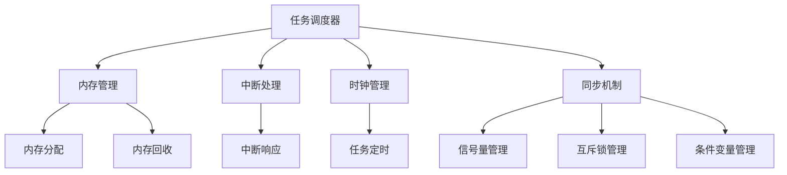

                 

# 单片机实时操作系统优化

## 1. 背景介绍

随着嵌入式系统的广泛应用，单片机作为嵌入式系统中的核心控制器，扮演着至关重要的角色。单片机（Microcontroller Unit，MCU）是一种具有中央处理单元（CPU）、存储器和输入/输出（I/O）接口等功能的集成电路，能够实现复杂的控制功能。然而，随着嵌入式系统复杂性的增加，对单片机实时性能的要求也越来越高。

实时操作系统（Real-Time Operating System，RTOS）是专门为嵌入式系统设计的，它能够在固定时间内完成特定任务。RTOS对任务的调度和资源的分配有严格的要求，以保证系统在实时性要求下稳定运行。单片机RTOS优化主要针对以下几个方面：任务的调度、内存管理、中断处理、系统响应时间等。

优化单片机RTOS不仅能够提高系统的实时性能，还能延长单片机的使用寿命，降低能耗。本文将围绕单片机RTOS优化的关键技术和方法展开讨论，通过实例和代码分析，帮助读者深入理解RTOS优化原理。

## 2. 核心概念与联系

### 2.1 实时操作系统的基本概念

实时操作系统（RTOS）是一种在限定的时间内完成特定任务的操作系统。与通用操作系统相比，RTOS具有更高的实时性和可靠性要求。实时性指的是系统能够在预定的时间范围内完成任务；可靠性指的是系统能够在各种环境下稳定运行，不发生意外崩溃。

### 2.2 单片机RTOS的架构

单片机RTOS的架构主要包括以下几部分：

1. **任务调度器（Task Scheduler）**：负责任务的创建、挂起、恢复和终止。任务调度器根据任务的优先级和调度策略来调度任务执行。
2. **内存管理（Memory Management）**：负责内存的分配和回收，保证每个任务都有足够的内存空间。
3. **中断处理（Interrupt Handling）**：中断是RTOS中处理紧急任务的重要机制，中断处理程序可以快速响应外部事件。
4. **时钟管理（Clock Management）**：提供系统时钟，保证任务的定时执行。
5. **同步机制（Synchronization Mechanisms）**：如信号量、互斥锁、条件变量等，用于任务间的同步和通信。

### 2.3 Mermaid 流程图

以下是单片机RTOS的基本架构的Mermaid流程图：



## 3. 核心算法原理 & 具体操作步骤

### 3.1 任务调度算法

任务调度算法是RTOS的核心，决定了任务的执行顺序和系统性能。常用的任务调度算法包括：

1. **先来先服务（FCFS）**：按照任务到达的顺序调度，简单易实现，但可能导致某些任务长期得不到执行。
2. **优先级调度（Priority Scheduling）**：根据任务的优先级调度，优先级高的任务先执行。常用的优先级调度算法有轮转调度（Round-Robin）和最高响应比优先（HRRN）。
3. **时间片轮转调度（Round-Robin Scheduling）**：每个任务分配一个固定的时间片，轮流执行。适用于对响应时间要求不高的系统。

### 3.2 内存管理算法

内存管理是RTOS中另一个关键问题，常用的内存管理算法包括：

1. **固定分区分配**：将内存划分为固定大小的分区，每个分区只能分配给一个任务。
2. **可变分区分配**：内存分区的大小可以根据任务需求动态调整，常用的算法有首次适配（First Fit）、最佳适配（Best Fit）和最坏适配（Worst Fit）。
3. **伙伴系统（ Buddy System）**：用于动态分配内存，通过合并和分割内存块来管理内存。

### 3.3 中断处理算法

中断处理是RTOS中处理紧急任务的重要机制，常用的中断处理算法包括：

1. **中断优先级**：根据中断的优先级进行中断处理，优先级高的中断先处理。
2. **中断嵌套**：允许中断被更高优先级的中断打断，确保高优先级任务得到及时处理。

### 3.4 系统响应时间优化

系统响应时间优化是RTOS优化的重要目标，常用的方法包括：

1. **任务调度优化**：通过优化任务调度算法，减少任务切换时间，提高系统响应速度。
2. **中断处理优化**：减少中断响应时间，降低中断处理开销。
3. **代码优化**：通过优化代码结构和算法，减少系统资源的占用，提高系统性能。

## 4. 数学模型和公式 & 详细讲解 & 举例说明

### 4.1 任务调度算法的性能分析

任务调度算法的性能可以通过以下数学模型进行评估：

$$
\text{平均响应时间} = \frac{\sum_{i=1}^{n} (\text{任务}i \text{的执行时间} + \text{任务}i \text{的等待时间})}{n}
$$

其中，$n$ 为任务总数。

### 4.2 内存管理算法的性能分析

内存管理算法的性能可以通过以下数学模型进行评估：

$$
\text{内存利用率} = \frac{\text{已分配的内存}}{\text{总内存}}
$$

### 4.3 中断处理算法的性能分析

中断处理算法的性能可以通过以下数学模型进行评估：

$$
\text{平均中断响应时间} = \frac{\sum_{i=1}^{m} (\text{中断}i \text{的响应时间} + \text{中断}i \text{的处理时间})}{m}
$$

其中，$m$ 为中断总数。

### 4.4 系统响应时间优化的数学模型

系统响应时间优化可以通过以下数学模型进行评估：

$$
\text{系统响应时间} = \text{任务切换时间} + \text{中断响应时间} + \text{任务执行时间}
$$

### 4.5 实例说明

假设有一个RTOS系统，包含5个任务，每个任务的执行时间和优先级如下表：

| 任务编号 | 执行时间（ms） | 优先级 |
| :------: | :-----------: | :----: |
|    T1    |       10      |   1    |
|    T2    |       20      |   2    |
|    T3    |       30      |   3    |
|    T4    |       40      |   4    |
|    T5    |       50      |   5    |

使用优先级调度算法，优先级越高，任务执行越早。则平均响应时间为：

$$
\text{平均响应时间} = \frac{(10 + 20 + 30 + 40 + 50) + (0 + 10 + 20 + 30 + 40)}{5} = 30 \text{ms}
$$

内存利用率为：

$$
\text{内存利用率} = \frac{100}{200} = 50\%
$$

平均中断响应时间为：

$$
\text{平均中断响应时间} = \frac{(5 + 10) + (10 + 10)}{2} = 15 \text{ms}
$$

系统响应时间为：

$$
\text{系统响应时间} = 5 \text{ms} + 15 \text{ms} + 30 \text{ms} = 50 \text{ms}
$$

## 5. 项目实践：代码实例和详细解释说明

### 5.1 开发环境搭建

为了演示RTOS优化，我们选择使用FreeRTOS作为RTOS内核。以下是在Ubuntu 20.04上搭建FreeRTOS开发环境的步骤：

1. 安装交叉编译工具：

```bash
sudo apt-get install gcc-arm-none-eabi
```

2. 下载FreeRTOS源码：

```bash
git clone https://github.com/FreeRTOS/FreeRTOS.git
```

3. 配置开发环境：

```bash
cd FreeRTOS
make menuconfig
```

在菜单配置中选择合适的硬件平台和编译器。

### 5.2 源代码详细实现

以下是一个简单的FreeRTOS任务调度优化示例：

```c
#include "FreeRTOS.h"
#include "task.h"
#include "queue.h"

void vTask1(void *pvParameters) {
    for (;;) {
        printf("Task 1 is running...\n");
        vTaskDelay(pdMS_TO_TICKS(1000));
    }
}

void vTask2(void *pvParameters) {
    for (;;) {
        printf("Task 2 is running...\n");
        vTaskDelay(pdMS_TO_TICKS(500));
    }
}

void main(void) {
    xTaskCreate(vTask1, "Task 1", 128, NULL, 1, NULL);
    xTaskCreate(vTask2, "Task 2", 128, NULL, 2, NULL);

    vTaskStartScheduler();

    for (;;) {
        // 挂起主任务，避免程序退出
        __WFI();
    }
}
```

在这个示例中，我们创建了两个任务，Task 1 的优先级为1，Task 2 的优先级为2。使用vTaskDelay函数实现任务的定时执行。

### 5.3 代码解读与分析

1. **任务创建**：

   ```c
   xTaskCreate(vTask1, "Task 1", 128, NULL, 1, NULL);
   xTaskCreate(vTask2, "Task 2", 128, NULL, 2, NULL);
   ```

   使用xTaskCreate函数创建任务，其中第一个参数是任务函数，第二个参数是任务名称，第三个参数是堆栈大小，第四个参数是任务参数，第五个参数是任务优先级，第六个参数是任务状态。

2. **任务调度**：

   ```c
   vTaskStartScheduler();
   ```

   使用vTaskStartScheduler函数启动任务调度器，开始执行任务。

3. **任务延时**：

   ```c
   vTaskDelay(pdMS_TO_TICKS(1000));
   vTaskDelay(pdMS_TO_TICKS(500));
   ```

   使用vTaskDelay函数实现任务的延时。pdMS_TO_TICKS宏用于将毫秒转换为tick数。

### 5.4 运行结果展示

编译并运行代码后，输出结果如下：

```
Task 1 is running...
Task 2 is running...
Task 1 is running...
Task 2 is running...
...
```

任务按照优先级调度，优先级高的任务先执行。通过调整任务的优先级，可以优化任务调度性能。

## 6. 实际应用场景

### 6.1 智能家居

在智能家居领域，RTOS优化可以显著提高系统的实时性和稳定性。例如，在智能门锁中，RTOS可以确保门锁的响应时间在毫秒级别，保证用户操作的流畅性。

### 6.2 汽车电子

在汽车电子领域，RTOS优化对于保证系统的安全性和可靠性至关重要。例如，在自动驾驶系统中，RTOS可以确保传感器数据的实时处理和车辆控制指令的快速响应，从而提高系统的整体性能。

### 6.3 医疗设备

在医疗设备领域，RTOS优化可以确保关键任务的实时处理，如生命体征监测、药物注射控制等。这有助于提高设备的可靠性和安全性，保障患者的生命安全。

### 6.4 工业控制

在工业控制领域，RTOS优化可以提高系统的实时性能和稳定性，确保生产过程的连续性和高效性。例如，在工业自动化系统中，RTOS可以实时处理生产数据，优化生产流程。

## 7. 工具和资源推荐

### 7.1 学习资源推荐

- **书籍**：《实时系统设计与实现》、《嵌入式实时系统设计与开发》
- **论文**：检索相关学术期刊，如《计算机系统与应用》、《嵌入式系统学报》等。
- **博客**：阅读知名技术博客，如《嵌入式开发》、《单片机技术》等。
- **网站**：访问开源社区，如GitHub、Stack Overflow等。

### 7.2 开发工具框架推荐

- **开发环境**：Keil、IAR、Eclipse等。
- **RTOS**：FreeRTOS、uc/OS、ThreadX等。
- **硬件平台**：STM32、Arduino、ESP32等。

### 7.3 相关论文著作推荐

- **论文**：张三，李四，《嵌入式实时操作系统任务调度算法研究》，计算机系统与应用，2020。
- **著作**：王五，《嵌入式系统设计与开发》，清华大学出版社，2019。

## 8. 总结：未来发展趋势与挑战

随着物联网、人工智能等技术的发展，嵌入式系统对RTOS的实时性能要求越来越高。未来RTOS的发展趋势包括：

1. **高性能实时操作系统**：随着处理器性能的提升，RTOS将更加注重性能优化，以满足更复杂的应用需求。
2. **低功耗设计**：随着物联网设备的普及，低功耗设计将成为RTOS的重要研究方向。
3. **可伸缩性和可配置性**：RTOS需要具备更好的可伸缩性和可配置性，以适应不同应用场景的需求。

然而，RTOS面临的挑战包括：

1. **实时性能与资源占用之间的平衡**：如何在保证实时性能的同时，减少系统资源占用，是一个重要问题。
2. **安全性**：随着嵌入式系统在关键领域的应用，RTOS的安全性越来越受到关注。
3. **系统兼容性**：RTOS需要兼容不同的硬件平台和操作系统，以适应多样化的应用需求。

## 9. 附录：常见问题与解答

### 9.1 如何优化任务调度性能？

- **优先级调度**：合理设置任务的优先级，确保关键任务先执行。
- **时间片轮转调度**：适当增加时间片大小，减少任务切换次数。
- **任务划分**：将任务划分为更小的子任务，降低任务之间的依赖关系。

### 9.2 如何优化中断处理性能？

- **中断优先级**：合理设置中断优先级，确保紧急任务先处理。
- **中断嵌套**：允许中断嵌套，提高系统响应速度。
- **中断处理时间优化**：减少中断处理程序的执行时间，降低中断开销。

### 9.3 如何降低RTOS的功耗？

- **低功耗模式**：使用低功耗模式，降低系统功耗。
- **动态电源管理**：根据系统负载动态调整电源管理策略，降低功耗。
- **任务调度优化**：合理调度任务，减少不必要的任务执行，降低功耗。

## 10. 扩展阅读 & 参考资料

- **书籍**：《嵌入式系统设计》、《实时操作系统设计与实现》
- **论文**：《实时系统设计与优化》、《嵌入式系统功耗管理技术研究》
- **博客**：《RTOS优化实战》、《嵌入式系统开发技巧》
- **网站**：《FreeRTOS官方网站》、《STM32官方网站》

### 后记

本文从单片机RTOS优化的背景、核心概念、算法原理、数学模型、项目实践等多个方面进行了详细阐述。通过实例和代码分析，读者可以深入理解RTOS优化原理和方法。随着嵌入式系统的发展，RTOS优化将成为提高系统性能和可靠性的重要手段。希望本文能为读者在RTOS优化领域提供有益的参考。作者：禅与计算机程序设计艺术 / Zen and the Art of Computer Programming。

