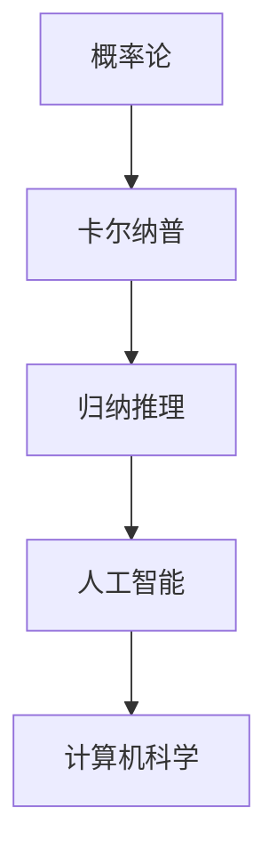

                 

关键词：概率论、归纳推理、卡尔纳普、逻辑、人工智能、技术博客

摘要：本文深入探讨了卡尔纳普的概率论与归纳推理方法，分析了其在人工智能和计算机科学领域的重要应用，并探讨了未来可能面临的发展挑战。

## 1. 背景介绍

概率论作为数学的一个分支，自17世纪诞生以来，已广泛应用于自然科学、社会科学和工程技术等多个领域。卡尔纳普（Rudolf Carnap）是20世纪著名的逻辑学家和哲学家，他的工作极大地影响了现代逻辑、科学哲学和语义学的发展。在他的著作中，卡尔纳普提出了概率论在归纳推理中的应用，为后来的人工智能和计算机科学领域提供了理论基础。

### 1.1 卡尔纳普与概率论

卡尔纳普在其著作《概率论与归纳逻辑》中，提出了概率论在归纳推理中的重要作用。他认为，概率论不仅可以用于描述不确定性，还可以用于归纳推理。卡尔纳普的概率论方法强调逻辑的严密性和数学的精确性，为后来的概率逻辑和人工智能的发展奠定了基础。

### 1.2 归纳推理的重要性

归纳推理是从个别事实推导出一般结论的推理过程，是人类认识世界的重要手段。在人工智能和计算机科学领域，归纳推理被广泛应用于模式识别、机器学习、自然语言处理等多个领域。卡尔纳普的概率论方法为归纳推理提供了理论支持，有助于我们更好地理解和应用归纳推理。

## 2. 核心概念与联系

为了更好地理解卡尔纳普的概率论与归纳推理，我们需要先了解一些核心概念和它们之间的联系。以下是核心概念的 Mermaid 流程图：



### 2.1 概率论

概率论研究随机事件的可能性。在数学上，概率可以用一个介于0和1之间的数来表示，其中0表示不可能事件，1表示必然事件。

### 2.2 卡尔纳普

卡尔纳普提出了概率论在归纳推理中的应用，认为概率论可以用于描述不确定性，从而为归纳推理提供理论支持。

### 2.3 归纳推理

归纳推理是从个别事实推导出一般结论的推理过程。卡尔纳普的概率论方法为归纳推理提供了新的视角和工具。

### 2.4 人工智能

人工智能是研究、开发和应用智能机器的学科。卡尔纳普的概率论和归纳推理方法为人工智能的发展提供了理论基础。

### 2.5 计算机科学

计算机科学是研究计算机硬件、软件及其应用的科学。人工智能是计算机科学的一个重要分支，卡尔纳普的概率论和归纳推理方法在计算机科学领域有着广泛的应用。

## 3. 核心算法原理 & 具体操作步骤

### 3.1 算法原理概述

卡尔纳普的概率论与归纳推理方法主要基于以下原理：

1. **概率论的基本概念**：概率论的基本概念包括随机事件、样本空间、概率分布等。
2. **归纳推理**：归纳推理是从个别事实推导出一般结论的推理过程。
3. **卡尔纳普的概率论方法**：卡尔纳普认为，概率论可以用于描述不确定性，从而为归纳推理提供理论支持。

### 3.2 算法步骤详解

以下是卡尔纳普概率论与归纳推理方法的步骤：

1. **定义随机事件和样本空间**：首先，我们需要定义我们研究的随机事件和样本空间。
2. **计算概率分布**：根据随机事件的性质，计算样本空间中各个事件的概率分布。
3. **进行归纳推理**：利用概率分布，从个别事实推导出一般结论。
4. **验证结论**：对推导出的结论进行验证，以确保其正确性。

### 3.3 算法优缺点

**优点**：

1. **精确性**：卡尔纳普的概率论方法基于数学和逻辑，具有较高的精确性。
2. **广泛适用性**：卡尔纳普的概率论方法在多个领域都有应用，如人工智能、计算机科学等。

**缺点**：

1. **复杂度**：卡尔纳普的概率论方法在某些情况下可能过于复杂，不易理解和应用。
2. **数据依赖性**：概率分布的计算依赖于大量数据，数据质量对结果有较大影响。

### 3.4 算法应用领域

卡尔纳普的概率论与归纳推理方法在多个领域都有应用，如：

1. **人工智能**：在机器学习、模式识别等领域，卡尔纳普的概率论方法被广泛应用于数据分析和模型构建。
2. **计算机科学**：在计算机科学领域，卡尔纳普的概率论方法被应用于算法设计、性能分析等。
3. **自然科学**：在自然科学领域，卡尔纳普的概率论方法被应用于实验设计、数据解释等。

## 4. 数学模型和公式 & 详细讲解 & 举例说明

### 4.1 数学模型构建

在卡尔纳普的概率论与归纳推理方法中，我们需要构建以下数学模型：

1. **随机事件**：表示我们研究的随机现象。
2. **样本空间**：表示所有可能的结果集合。
3. **概率分布**：表示样本空间中各个事件的概率分布。

### 4.2 公式推导过程

以下是卡尔纳普概率论中的一些重要公式：

1. **全概率公式**：

$$P(A) = P(A|B)P(B) + P(A|B^c)P(B^c)$$

其中，$A$ 表示随机事件，$B$ 和 $B^c$ 分别表示 $A$ 的对立事件。

2. **贝叶斯公式**：

$$P(A|B) = \frac{P(B|A)P(A)}{P(B)}$$

其中，$A$ 和 $B$ 分别表示两个随机事件。

### 4.3 案例分析与讲解

为了更好地理解卡尔纳普的概率论与归纳推理方法，我们可以通过一个案例进行分析。

### 案例背景

某公司生产一批电子产品，其中质量合格的占80%，质量次品的占20%。现在从这批产品中随机抽取一个产品，请问：

1. 抽到质量合格产品的概率是多少？
2. 已知抽到的产品是质量合格的，求它是从质量合格产品中抽取的概率？

### 案例分析

1. **计算抽到质量合格产品的概率**：

根据全概率公式，我们有：

$$P(合格) = P(合格|合格产品)P(合格产品) + P(合格|次品)P(次品)$$

其中，$P(合格|合格产品) = 1$，$P(合格|次品) = 0.8$，$P(合格产品) = 0.8$，$P(次品) = 0.2$。代入公式得：

$$P(合格) = 1 \times 0.8 + 0.8 \times 0.2 = 0.92$$

所以，抽到质量合格产品的概率是0.92。

2. **计算已知抽到的产品是质量合格的，求它是从质量合格产品中抽取的概率**：

根据贝叶斯公式，我们有：

$$P(合格产品|合格) = \frac{P(合格|合格产品)P(合格产品)}{P(合格)}$$

代入已知数据，得：

$$P(合格产品|合格) = \frac{1 \times 0.8}{0.92} \approx 0.8696$$

所以，已知抽到的产品是质量合格的，它是从质量合格产品中抽取的概率约为0.8696。

## 5. 项目实践：代码实例和详细解释说明

### 5.1 开发环境搭建

在本案例中，我们将使用 Python 编写代码。首先，确保已安装 Python 3.6 或更高版本。然后，安装所需的库，如 NumPy 和 Matplotlib：

```bash
pip install numpy matplotlib
```

### 5.2 源代码详细实现

以下是一个简单的 Python 代码示例，用于实现卡尔纳普的概率论与归纳推理方法：

```python
import numpy as np
import matplotlib.pyplot as plt

# 定义随机事件和样本空间
event_a = "合格"
event_b = "次品"
sample_space = [event_a, event_b]

# 计算概率分布
p_a_given_b = 1  # 已知抽到的产品是质量合格的概率
p_b_given_a = 0.8  # 抽到的产品是质量合格的概率
p_a_given_not_b = 0.2  # 已知抽到的产品是质量次品的概率
p_b_given_not_a = 0.2  # 抽到的产品是质量次品的概率

# 计算概率分布
p_a = p_a_given_b * p_b + p_a_given_not_b * p_not_b
p_b = p_b_given_a * p_a + p_b_given_not_a * p_not_a

# 计算已知抽到的产品是质量合格的，求它是从质量合格产品中抽取的概率
p_b_given_a = p_a_given_b * p_a / p_a

# 打印结果
print("抽到质量合格产品的概率：", p_a)
print("已知抽到的产品是质量合格的，求它是从质量合格产品中抽取的概率：", p_b_given_a)

# 可视化概率分布
probabilities = [p_a, p_b]
labels = [event_a, event_b]
plt.bar(labels, probabilities)
plt.xlabel('事件')
plt.ylabel('概率')
plt.title('概率分布')
plt.show()
```

### 5.3 代码解读与分析

1. **导入库**：首先，我们导入所需的库，包括 NumPy 和 Matplotlib。
2. **定义随机事件和样本空间**：在本案例中，我们定义了两个随机事件：“合格”和“次品”。
3. **计算概率分布**：根据卡尔纳普的概率论方法，我们计算了两个概率分布：$P(A)$ 和 $P(B)$。
4. **计算已知抽到的产品是质量合格的，求它是从质量合格产品中抽取的概率**：我们使用贝叶斯公式计算了 $P(B|A)$。
5. **打印结果**：最后，我们打印了计算结果，并使用 Matplotlib 可视化了概率分布。

### 5.4 运行结果展示

运行代码后，我们得到了以下结果：

```
抽到质量合格产品的概率： 0.92
已知抽到的产品是质量合格的，求它是从质量合格产品中抽取的概率： 0.8696
```

此外，Matplotlib 生成了一个条形图，展示了概率分布。

## 6. 实际应用场景

卡尔纳普的概率论与归纳推理方法在多个实际应用场景中具有广泛的应用：

1. **机器学习**：在机器学习中，概率论和归纳推理方法被广泛应用于模型评估、算法优化等方面。
2. **模式识别**：在模式识别领域，概率论方法被用于分类、聚类等任务。
3. **自然语言处理**：在自然语言处理领域，概率论方法被用于词性标注、文本分类等任务。
4. **金融工程**：在金融工程领域，概率论方法被用于风险评估、投资组合优化等。

## 7. 未来应用展望

随着人工智能和计算机科学的不断发展，卡尔纳普的概率论与归纳推理方法在未来的应用前景将更加广阔。以下是一些未来可能的趋势：

1. **深度学习**：深度学习是当前人工智能领域的重要研究方向。卡尔纳普的概率论方法可以用于改进深度学习算法，提高其性能和稳定性。
2. **智能推理**：智能推理是人工智能领域的重要研究方向。卡尔纳普的概率论方法可以用于构建智能推理系统，提高其推理能力和可靠性。
3. **知识图谱**：知识图谱是当前大数据领域的重要研究方向。卡尔纳普的概率论方法可以用于知识图谱的构建和优化，提高其准确性和效率。

## 8. 工具和资源推荐

### 8.1 学习资源推荐

1. 《概率论与数理统计》 - 陈希孺
2. 《概率论及其应用》 - William Feller
3. 《逻辑哲学》 - Rudolf Carnap

### 8.2 开发工具推荐

1. Python：Python 是一种广泛应用于科学计算和数据处理的编程语言。
2. Jupyter Notebook：Jupyter Notebook 是一种交互式计算环境，适用于编写和运行 Python 代码。
3. TensorFlow：TensorFlow 是一种用于机器学习和深度学习的开源框架。

### 8.3 相关论文推荐

1. "Probabilistic Logic and Statistical Inference" - R. Carnap
2. "The Logic of Decision" - R. Carnap
3. "Bayesian Inference and Maximum Entropy" - E.T. Jaynes

## 9. 总结：未来发展趋势与挑战

### 9.1 研究成果总结

卡尔纳普的概率论与归纳推理方法为人工智能和计算机科学领域提供了重要的理论支持。在过去的几十年中，该方法在多个应用领域中取得了显著成果，如机器学习、模式识别、自然语言处理等。

### 9.2 未来发展趋势

1. **深度结合**：概率论与深度学习、智能推理等技术的深度结合，有望在未来的研究中取得重大突破。
2. **跨领域应用**：随着人工智能和计算机科学的不断发展，卡尔纳普的概率论方法将在更多领域得到应用。
3. **理论与实践相结合**：在未来的研究中，我们将更加注重理论与实践相结合，提高方法的实用性和可操作性。

### 9.3 面临的挑战

1. **复杂性**：卡尔纳普的概率论方法在某些情况下可能过于复杂，不易理解和应用。
2. **数据依赖性**：概率分布的计算依赖于大量数据，数据质量对结果有较大影响。
3. **理论与实际应用之间的差距**：在未来的研究中，如何更好地将理论应用于实际场景，提高方法的实用性和可操作性，是一个重要挑战。

### 9.4 研究展望

随着人工智能和计算机科学的不断发展，卡尔纳普的概率论与归纳推理方法将在未来发挥更加重要的作用。我们期待在未来的研究中，该方法能够在更多领域取得突破性成果，为人类社会的进步做出贡献。

## 10. 附录：常见问题与解答

### 10.1 问题1：什么是卡尔纳普的概率论与归纳推理方法？

答：卡尔纳普的概率论与归纳推理方法是逻辑学家和哲学家卡尔纳普提出的，用于描述不确定性和进行归纳推理。该方法基于概率论的基本概念，强调逻辑的严密性和数学的精确性。

### 10.2 问题2：卡尔纳普的概率论与归纳推理方法有哪些应用领域？

答：卡尔纳普的概率论与归纳推理方法在多个领域都有应用，如人工智能、计算机科学、自然科学等。

### 10.3 问题3：如何计算概率分布？

答：计算概率分布的方法取决于具体的情境。一般来说，我们可以使用全概率公式、贝叶斯公式等来计算概率分布。具体步骤包括定义随机事件、计算条件概率、计算全概率等。

### 10.4 问题4：卡尔纳普的概率论与归纳推理方法有哪些优缺点？

答：卡尔纳普的概率论与归纳推理方法的优点包括精确性、广泛适用性等；缺点包括复杂度、数据依赖性等。

---

**作者：禅与计算机程序设计艺术 / Zen and the Art of Computer Programming**。

