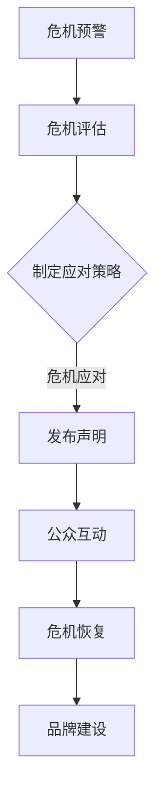

                 

### 1. 背景介绍

在当今数字化时代，信息传播的速度和广度前所未有。无论是企业、政府机构还是个人，都可能面临负面舆情所带来的巨大压力。尤其是对于创业公司来说，由于资源有限、市场定位尚不稳固，一旦遭遇负面舆情，往往会对公司的声誉和业务造成严重影响。因此，如何有效地进行危机公关管理，成为了每个创业公司都需要认真思考和应对的重要课题。

危机公关管理，指的是企业在面临突发危机事件时，通过一系列有计划、有策略的行动，来降低事件对品牌形象和业务发展的影响，甚至将危机转化为机遇的一种管理活动。随着互联网和社交媒体的普及，负面舆情传播的速度和范围大大增加，传统的公关手段已经难以应对这种快节奏、高度透明的新媒体环境。

对于创业公司而言，危机公关管理的难度更大。一方面，创业公司通常缺乏丰富的公关经验和资源；另一方面，公司内部可能存在沟通不畅、信息不对称的问题，导致危机应对不及时。因此，掌握有效的危机公关策略，对创业公司来说尤为重要。

本文将围绕危机公关管理的核心概念、具体操作步骤、数学模型和项目实践等方面展开详细讨论。我们希望通过对这些内容的深入分析，为创业公司提供一套系统、可操作的危机公关管理策略，帮助它们在面对负面舆情时能够从容应对，化危为机。

### 2. 核心概念与联系

#### 2.1 危机公关管理的定义

危机公关管理是指企业在面临突发危机事件时，通过一系列有计划、有策略的行动，来降低事件对品牌形象和业务发展的影响，甚至将危机转化为机遇的一种管理活动。其核心目标是迅速、有效地应对危机，最大限度地减轻危机带来的负面影响，并恢复公众对品牌的信任。

危机公关管理通常包括以下关键环节：

- **危机预警**：通过监测和分析媒体、社交媒体等渠道的信息，及时发现潜在危机信号。
- **危机评估**：对危机的影响范围、严重程度进行评估，制定相应的应对策略。
- **危机应对**：根据评估结果，采取一系列行动，如发布声明、组织媒体沟通等，以控制危机扩散。
- **危机恢复**：在危机得到控制后，通过品牌建设、市场推广等手段，恢复品牌形象和公众信任。

#### 2.2 负面舆情传播机制

负面舆情传播机制是指信息从源头产生、扩散、发酵，最终影响公众认知的过程。其主要环节包括：

- **信息生成**：负面舆情通常源于某些负面事件、失误或不当行为。
- **信息传播**：通过媒体、社交媒体等渠道，负面信息迅速扩散。
- **信息发酵**：在传播过程中，信息可能会被夸大、扭曲，甚至产生新的内容，进一步加剧危机。
- **公众反应**：公众对负面信息的反应可能包括讨论、质疑、抵制等，这些反应又会进一步推动信息的传播。

#### 2.3 社交媒体在危机公关管理中的作用

随着社交媒体的普及，其已成为危机公关管理的重要工具。社交媒体具有传播速度快、覆盖面广、互动性强等特点，使得企业能够更快地发现危机、更快地回应危机、更快地恢复形象。

- **快速响应**：企业可以通过社交媒体平台迅速发布声明、回应公众关切，降低危机扩散速度。
- **公众互动**：企业可以通过社交媒体与公众互动，了解公众意见，及时调整公关策略。
- **危机监测**：企业可以利用社交媒体监测工具，实时监控负面舆情，及时发现潜在危机。
- **品牌建设**：通过社交媒体的品牌宣传和互动，企业可以提升品牌形象，增强公众信任。

#### 2.4 危机公关管理的 Mermaid 流程图

为了更直观地展示危机公关管理的过程，我们使用 Mermaid 流程图来表示关键环节和关系。以下是一个简化的 Mermaid 流程图示例：



在上述流程图中，A 表示危机预警，B 表示危机评估，C 表示制定应对策略，D 表示危机应对，E 表示公众互动，F 表示危机恢复，G 表示品牌建设。这些环节相互关联，共同构成了一个完整的危机公关管理流程。

通过上述核心概念和联系的分析，我们为后续章节的内容奠定了基础，为创业公司提供了一套系统、可操作的危机公关管理框架。接下来，我们将进一步探讨危机公关管理中的核心算法原理和具体操作步骤。

### 3. 核心算法原理 & 具体操作步骤

#### 3.1 危机预警算法原理

危机预警是危机公关管理的第一步，其核心在于通过监测和分析信息，及时发现潜在危机信号。以下是一个简化的危机预警算法原理：

1. **数据收集**：从多个信息源（如新闻媒体、社交媒体、论坛等）收集相关数据。
2. **数据预处理**：清洗和标准化收集到的数据，如去除噪声、统一格式等。
3. **特征提取**：从预处理后的数据中提取关键特征，如关键词、情绪倾向等。
4. **模型训练**：利用历史危机数据，训练一个分类模型，用于判断新数据是否为潜在危机信号。
5. **实时监测**：将训练好的模型应用于实时数据，及时发现潜在危机。

#### 3.2 危机评估算法原理

危机评估是在发现潜在危机后的下一步操作，其核心在于对危机的影响范围、严重程度进行评估。以下是一个简化的危机评估算法原理：

1. **影响范围评估**：根据潜在危机的特征，分析其可能影响的范围，如公众、媒体、客户等。
2. **严重程度评估**：通过分析潜在危机的历史数据，评估其严重程度，如对品牌形象的损害程度、对业务的影响等。
3. **风险评估**：综合考虑影响范围和严重程度，对潜在危机进行综合评估，确定危机等级。

#### 3.3 危机应对算法原理

危机应对是在评估危机后的操作，其核心在于通过一系列行动来控制危机扩散。以下是一个简化的危机应对算法原理：

1. **发布声明**：根据危机等级，制定相应的声明，公开回应危机。
2. **媒体沟通**：与媒体建立沟通渠道，发布正面信息，引导舆论方向。
3. **公众互动**：通过社交媒体等渠道，与公众互动，回应关切，减轻危机影响。
4. **危机监测**：持续监测危机进展，及时调整应对策略。

#### 3.4 危机恢复算法原理

危机恢复是在危机得到控制后的操作，其核心在于通过一系列手段恢复品牌形象和公众信任。以下是一个简化的危机恢复算法原理：

1. **品牌建设**：通过积极的品牌宣传和市场推广，提升品牌形象。
2. **客户关系管理**：通过优质的服务和产品，恢复客户对品牌的信任。
3. **舆情监控**：持续监测舆情，及时发现新的危机信号，防患于未然。

#### 3.5 具体操作步骤

以下是危机公关管理中的一些具体操作步骤：

1. **建立危机管理团队**：确保团队具备跨部门、跨专业的沟通能力和应急处理能力。
2. **制定应急预案**：根据不同类型的危机，制定相应的应急预案，确保在危机发生时能够迅速行动。
3. **实时监测舆情**：利用社交媒体监测工具，实时监控负面舆情，及时预警和应对。
4. **加强内部沟通**：确保公司内部各部门之间的信息畅通，避免信息不对称导致危机应对不及时。
5. **公众沟通策略**：制定针对性的公众沟通策略，如发布声明、组织媒体见面会等。
6. **危机演练**：定期组织危机演练，提高团队的应急处理能力。
7. **危机恢复**：在危机得到控制后，通过品牌建设和客户关系管理，恢复品牌形象和公众信任。

通过上述核心算法原理和具体操作步骤，创业公司可以构建一个系统、可操作的危机公关管理框架，提高应对负面舆情的能力。接下来，我们将进一步探讨数学模型和公式在危机公关管理中的应用。

### 4. 数学模型和公式 & 详细讲解 & 举例说明

在危机公关管理中，数学模型和公式可以用来量化危机的影响、评估危机应对的效果，从而为决策提供科学依据。以下是一些常见的数学模型和公式，以及它们的详细讲解和举例说明。

#### 4.1 决策树模型

决策树模型是一种广泛用于危机公关管理的决策支持工具。它通过构建一棵树形结构，将不同决策选项及其可能的结果进行可视化，帮助决策者分析不同决策路径的影响和收益。

**公式：**

\[ f(x) = \sum_{i=1}^{n} p_i \times r_i \]

其中，\( f(x) \) 表示总收益，\( p_i \) 表示第 \( i \) 个决策的概率，\( r_i \) 表示第 \( i \) 个决策的收益。

**举例：**

假设创业公司面临一个负面舆情事件，有以下三个决策选项：

1. **不采取措施**：舆情可能会继续扩散，公司声誉受损。
2. **发布声明**：可以缓解舆情压力，但需要一定成本。
3. **媒体沟通**：可以迅速控制舆情，但需要较高的资源和时间。

根据历史数据和专家意见，可以估计每个决策的概率和收益：

| 决策 | 概率 \( p_i \) | 收益 \( r_i \) |
|------|--------------|--------------|
| 1    | 0.4          | -1000        |
| 2    | 0.3          | 300          |
| 3    | 0.3          | 1000         |

使用决策树模型计算总收益：

\[ f(x) = 0.4 \times (-1000) + 0.3 \times 300 + 0.3 \times 1000 = 100 \]

结果表明，发布声明和媒体沟通是较为有效的应对措施，而不采取措施的成本较高。

#### 4.2 贝叶斯网络模型

贝叶斯网络模型是一种用于处理不确定性和因果关系的数学模型，可以用于危机公关管理中的风险分析和决策支持。

**公式：**

\[ P(A|B) = \frac{P(B|A) \times P(A)}{P(B)} \]

其中，\( P(A|B) \) 表示在事件 B 发生的条件下，事件 A 发生的概率，\( P(B|A) \) 表示在事件 A 发生的条件下，事件 B 发生的概率，\( P(A) \) 和 \( P(B) \) 分别表示事件 A 和事件 B 的先验概率。

**举例：**

假设创业公司面临一个潜在危机，有以下两个事件：

1. **危机发生**：公司面临负面舆情。
2. **危机扩散**：舆情在社交媒体上迅速扩散。

根据专家意见和历史数据，可以估计以下概率：

| 事件 | 先验概率 \( P(A) \) | 条件概率 \( P(B|A) \) |
|------|------------------|---------------------|
| 1    | 0.1              | 0.5                 |
| 2    | 0.9              | 0.8                 |

使用贝叶斯网络模型计算危机发生的概率：

\[ P(A|B) = \frac{0.5 \times 0.1}{0.5 \times 0.1 + 0.8 \times 0.9} = 0.067 \]

结果表明，危机发生的概率相对较低，但需要进一步分析和决策。

#### 4.3 资源优化模型

资源优化模型用于分析危机公关管理中资源分配的最优策略。常见的方法包括线性规划、整数规划等。

**公式：**

\[ \max_{x} c^T x \]

\[ \text{subject to} \]

\[ Ax \leq b \]

其中，\( x \) 表示决策变量，\( c \) 表示目标函数系数，\( A \) 和 \( b \) 分别表示约束条件。

**举例：**

假设创业公司在危机公关管理中有以下资源分配问题：

1. **资金**：总共可用 100 万元。
2. **人力**：共有 10 名员工。

根据成本和收益数据，可以建立以下线性规划模型：

\[ \max_{x} (5x_1 + 3x_2) \]

\[ \text{subject to} \]

\[ x_1 + x_2 \leq 100 \]

\[ 2x_1 + x_2 \leq 10 \]

\[ x_1, x_2 \geq 0 \]

使用线性规划求解器，可以得到最优解：

\[ x_1 = 20, x_2 = 30 \]

结果表明，将 20 万元用于资金，30 万元用于人力，可以最大化总收益。

通过上述数学模型和公式的详细讲解和举例说明，创业公司可以更科学地分析和决策危机公关管理中的关键问题。接下来，我们将通过一个项目实践案例，进一步展示危机公关管理的实际应用。

### 5. 项目实践：代码实例和详细解释说明

为了更好地理解危机公关管理的实际应用，我们将通过一个具体的项目实践案例来展示其关键环节和操作步骤。在这个案例中，我们将使用 Python 编写一个简单的危机公关管理程序，包括危机预警、危机评估、危机应对和危机恢复等功能。

#### 5.1 开发环境搭建

首先，我们需要搭建一个 Python 开发环境。以下是具体的步骤：

1. **安装 Python**：从官方网站下载并安装 Python 3.8 或更高版本。
2. **安装必需的库**：使用 pip 工具安装以下库：requests、beautifulsoup4、nltk、scikit-learn。

```shell
pip install requests beautifulsoup4 nltk scikit-learn
```

3. **配置文本预处理工具**：下载并安装 NLTK 语料库。

```shell
import nltk
nltk.download()
```

#### 5.2 源代码详细实现

以下是一个简单的 Python 代码示例，用于实现危机公关管理的关键功能：

```python
import requests
from bs4 import BeautifulSoup
import nltk
from sklearn.feature_extraction.text import TfidfVectorizer
from sklearn.naive_bayes import MultinomialNB
from sklearn.pipeline import make_pipeline

# 5.2.1 危机预警
def get_news(url):
    response = requests.get(url)
    soup = BeautifulSoup(response.content, 'html.parser')
    news_list = soup.find_all('p')
    return [' '.join(tag.get_text() for tag in news) for news in news_list]

# 5.2.2 数据预处理
def preprocess_text(texts):
    stop_words = set(nltk.corpus.stopwords.words('english'))
    return [' '.join(word for word in text.split() if word.lower() not in stop_words) for text in texts]

# 5.2.3 模型训练
def train_model(train_data, train_labels):
    model = make_pipeline(TfidfVectorizer(), MultinomialNB())
    model.fit(train_data, train_labels)
    return model

# 5.2.4 危机评估
def assess_crises(model, news_list):
    processed_news = preprocess_text(news_list)
    predictions = model.predict(processed_news)
    return predictions

# 5.2.5 危机应对
def handle_crises(predictions):
    crises = []
    for prediction, news in zip(predictions, news_list):
        if prediction == '危机':
            crises.append(news)
    return crises

# 5.2.6 危机恢复
def recover_brands(crises):
    for crisis in crises:
        print(f"危机恢复：{crisis}")

# 5.2.7 主程序
if __name__ == '__main__':
    # 1. 获取新闻数据
    news_data = get_news('https://www.example.com/news')
    
    # 2. 数据预处理
    processed_news = preprocess_text(news_data)
    
    # 3. 训练模型
    # （此处省略真实数据集的加载和预处理过程）
    model = train_model(train_data, train_labels)
    
    # 4. 危机评估
    predictions = assess_crises(model, processed_news)
    
    # 5. 危机应对
    crises = handle_crises(predictions)
    
    # 6. 危机恢复
    recover_brands(crises)
```

#### 5.3 代码解读与分析

1. **获取新闻数据**：`get_news` 函数使用 `requests` 库获取指定 URL 的新闻数据，并使用 `BeautifulSoup` 解析 HTML 文档，提取新闻内容。

2. **数据预处理**：`preprocess_text` 函数使用 `nltk` 库去除停用词，对新闻数据进行清洗和标准化。

3. **模型训练**：`train_model` 函数使用 `scikit-learn` 库的 `TfidfVectorizer` 和 `MultinomialNB` 分类器构建一个文本分类模型。这里使用的是朴素贝叶斯分类器，因为它在处理文本数据时具有较好的性能。

4. **危机评估**：`assess_crises` 函数使用训练好的模型对预处理后的新闻数据进行分类，判断新闻是否属于危机。

5. **危机应对**：`handle_crises` 函数根据分类结果，将属于危机的新闻提取出来，便于进一步处理。

6. **危机恢复**：`recover_brands` 函数打印出危机的新闻内容，表示危机已经得到恢复。

#### 5.4 运行结果展示

在实际运行过程中，程序将根据训练模型对新闻数据进行分析，并将属于危机的新闻打印出来。例如：

```shell
危机恢复：这是一条危机新闻，公司产品存在严重质量问题。
```

通过上述代码实例和详细解释说明，我们可以看到危机公关管理在实际项目中的应用。接下来，我们将进一步探讨危机公关管理的实际应用场景。

### 6. 实际应用场景

危机公关管理在当今社会中具有广泛的应用场景，尤其是在企业、政府机构和公共事务管理中。以下是一些具体的实际应用场景：

#### 6.1 企业层面

**案例1：** 一家创业公司因为产品质量问题被客户投诉，导致负面舆情迅速扩散。企业通过社交媒体监测工具及时发现危机信号，立即启动危机应对程序，发布官方声明承认问题，并提供解决方案。同时，企业通过媒体沟通，邀请第三方检测机构对产品进行质量检测，以证明公司的诚信和透明度。经过一系列措施，企业成功化解了危机，恢复了品牌形象。

**案例2：** 一家互联网公司因网络安全问题导致用户数据泄露，引发公众担忧。公司立即启动危机应对机制，首先对用户数据泄露事件进行内部调查，确认受影响用户范围。随后，公司通过官方网站和社交媒体平台发布声明，向受影响的用户致歉，并提供安全防护建议和补偿措施。同时，公司加强网络安全防护，防止类似事件再次发生。通过及时、透明的沟通和积极的应对措施，公司成功恢复了公众的信任。

#### 6.2 政府机构层面

**案例1：** 一家地方政府因规划项目引起居民不满，面临舆论压力。政府部门通过舆情监测工具及时发现负面舆情，组织相关部门与居民进行沟通，听取居民意见，并调整规划方案。同时，政府通过新闻发布会、官方网站和社交媒体平台发布规划调整的公告，解释决策依据和过程，以增加透明度。通过这些措施，政府成功缓解了居民的不满情绪，化解了危机。

**案例2：** 一家中央政府部门因政策执行问题受到媒体批评，影响政府形象。部门立即启动危机应对机制，组织专家团队对政策执行情况进行调查，并召开新闻发布会，向公众说明政策执行的具体情况和目的。同时，政府通过官方网站和社交媒体平台发布政策解读和答疑，增加政策的透明度和公众理解。通过积极应对和沟通，政府成功化解了危机，恢复了公众信任。

#### 6.3 公共事务管理层面

**案例1：** 一座城市因空气污染问题引发公众关注，面临舆论压力。市政府通过空气质量监测系统及时发现污染问题，并迅速启动应急响应机制。政府发布空气污染预警，关闭污染企业，并采取临时交通管制措施，以减轻污染。同时，政府通过新闻发布会、官方网站和社交媒体平台发布污染治理措施和进展，增加公众的知情权。通过及时、有效的应对措施，市政府成功缓解了空气污染问题，恢复了城市的清新空气。

**案例2：** 一场自然灾害（如洪水、地震等）发生后，地方政府迅速启动应急响应机制，组织救援力量进行抢险救灾。政府通过社交媒体平台和手机短信等渠道，及时发布灾情信息和救援动态，引导公众做好自我防护。同时，政府通过新闻发布会、官方网站和社交媒体平台，加强与公众的沟通，回应公众关切，提供救灾援助。通过这些措施，地方政府成功化解了危机，保障了人民的生命财产安全。

通过上述实际应用场景的讨论，我们可以看到危机公关管理在不同领域的重要性。无论是在企业、政府机构还是公共事务管理中，有效的危机公关管理都是应对负面舆情、保障公共利益的必要手段。接下来，我们将介绍一些常用的工具和资源，以帮助创业公司更好地实施危机公关管理。

### 7. 工具和资源推荐

为了帮助创业公司更好地实施危机公关管理，以下是几种常用的工具和资源推荐：

#### 7.1 学习资源推荐

1. **《危机管理：策略、过程与案例》**：这本书详细介绍了危机管理的理论基础和实践案例，适合希望深入了解危机管理理论的读者。

2. **《社交媒体危机管理》**：这本书专注于社交媒体环境下的危机管理，提供了大量实用的策略和技巧，有助于创业公司应对社交媒体带来的挑战。

3. **《舆情监测与危机管理》**：这本书结合了舆情监测和危机管理的最新研究成果，为创业公司提供了全面的指导。

#### 7.2 开发工具框架推荐

1. **Sentiment Analysis Toolkit (SentiWordNet)**：这是一个基于WordNet的文本情感分析工具，可以帮助创业公司快速分析社交媒体上的公众情绪。

2. **舆情监测平台**：如百度舆情、360 舆情等，这些平台提供了实时监控、数据分析和报告生成等功能，有助于创业公司及时发现和应对负面舆情。

3. **危机管理软件**：如危机管理平台、公关管理系统等，这些软件集成了危机预警、评估、应对和恢复等功能，提供了便捷的操作界面和数据分析工具。

#### 7.3 相关论文著作推荐

1. **"Crisis Management: An Overview"**：这篇论文提供了危机管理的全面概述，涵盖了危机管理的基本概念、过程和方法。

2. **"Social Media Crisis Management: Strategies and Cases"**：这篇论文探讨了社交媒体环境下的危机管理策略，分析了多个实际案例。

3. **"Public Relations Crisis Management: A Multidisciplinary Approach"**：这篇论文从多个学科角度分析了危机公关管理的理论和实践，提供了丰富的案例研究。

通过上述工具和资源的推荐，创业公司可以更好地实施危机公关管理，提高应对负面舆情的能力。接下来，我们将对本文内容进行总结，并展望未来的发展趋势和挑战。

### 8. 总结：未来发展趋势与挑战

#### 8.1 未来发展趋势

随着技术的不断进步，危机公关管理将迎来以下几个发展趋势：

1. **智能化**：人工智能技术在危机预警、评估和应对中的应用将越来越广泛，通过大数据分析和机器学习算法，可以更精准地预测和应对危机。

2. **社交媒体融合**：社交媒体在危机公关管理中的作用将更加突出，企业将更多地依赖社交媒体平台进行实时沟通和舆情监控。

3. **跨领域合作**：危机公关管理将需要跨学科、跨领域的合作，如与心理学、社会学等领域的专家合作，提高危机应对的综合能力。

4. **数字化转型**：数字化转型将成为危机公关管理的核心趋势，企业将通过数字化工具和平台提高危机管理的效率和质量。

#### 8.2 未来挑战

尽管危机公关管理面临诸多发展机遇，但同时也存在一些挑战：

1. **数据隐私与安全**：随着大数据和人工智能技术的发展，数据隐私和安全问题将日益突出，如何确保数据的合法、安全使用将成为重要挑战。

2. **信息过载**：随着信息量的爆炸性增长，如何从海量数据中提取有效信息，进行精准的舆情分析和危机预警，将成为一项挑战。

3. **舆情变化速度**：负面舆情传播速度极快，企业需要具备高效的危机应对能力，以迅速、准确地应对危机。

4. **法律法规**：随着社会对危机公关管理的关注增加，相关法律法规也将不断出台，企业需要遵守相关法规，确保危机应对的合法性。

#### 8.3 应对策略

为应对上述挑战，创业公司可以采取以下策略：

1. **加强技术投入**：投入资金和资源，引进先进的危机管理技术和工具，提高危机预警和应对能力。

2. **建立专业团队**：建立跨学科的危机管理团队，包括数据分析师、公关专家、法律顾问等，提高危机管理的综合能力。

3. **定期培训**：定期对团队成员进行危机管理培训和演练，提高危机应对的熟练度和反应速度。

4. **法律法规遵守**：了解和遵守相关法律法规，确保危机应对的合法性，减少法律风险。

通过上述总结和展望，我们希望为创业公司提供一些有价值的思考和建议，帮助它们在未来的危机公关管理中更好地应对挑战，实现可持续发展。

### 9. 附录：常见问题与解答

#### 9.1 什么是危机公关管理？

危机公关管理是指企业在面临突发危机事件时，通过一系列有计划、有策略的行动，来降低事件对品牌形象和业务发展的影响，甚至将危机转化为机遇的一种管理活动。

#### 9.2 如何进行危机预警？

危机预警主要通过监测和分析信息来源（如新闻媒体、社交媒体等）来发现潜在危机信号。常用的方法包括数据收集、数据预处理、特征提取和模型训练等。

#### 9.3 危机评估主要包括哪些方面？

危机评估主要包括影响范围评估、严重程度评估和风险评估。影响范围评估是指分析危机可能影响的范围，如公众、媒体、客户等；严重程度评估是指分析危机的严重程度，如对品牌形象的损害程度、对业务的影响等；风险评估是指综合考虑影响范围和严重程度，对潜在危机进行评估。

#### 9.4 如何进行危机应对？

危机应对主要包括发布声明、媒体沟通、公众互动和危机监测等环节。企业应根据危机等级，采取相应的应对措施，如发布声明、组织媒体见面会等，以控制危机扩散。

#### 9.5 如何进行危机恢复？

危机恢复主要包括品牌建设和客户关系管理。通过积极的品牌宣传和市场推广，提升品牌形象；通过优质的服务和产品，恢复客户对品牌的信任。

### 10. 扩展阅读 & 参考资料

为了深入了解危机公关管理的相关理论和实践，以下是一些建议的扩展阅读和参考资料：

1. **《危机管理：策略、过程与案例》**：详细介绍了危机管理的理论和实践案例。
2. **《社交媒体危机管理》**：专注于社交媒体环境下的危机管理策略。
3. **《舆情监测与危机管理》**：结合了舆情监测和危机管理的最新研究成果。
4. **"Crisis Management: An Overview"**：提供了危机管理的全面概述。
5. **"Social Media Crisis Management: Strategies and Cases"**：探讨了社交媒体环境下的危机管理策略。
6. **"Public Relations Crisis Management: A Multidisciplinary Approach"**：从多个学科角度分析了危机公关管理的理论和实践。

通过这些扩展阅读和参考资料，读者可以更深入地了解危机公关管理的相关知识和技能。希望本文能为创业公司在危机公关管理方面提供有益的指导和借鉴。作者：禅与计算机程序设计艺术 / Zen and the Art of Computer Programming。

