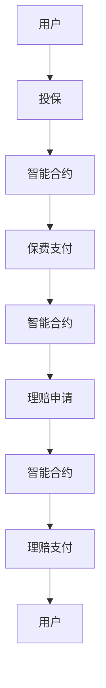

                 

### 背景介绍

随着区块链技术的飞速发展和广泛应用，去中心化金融（DeFi）逐渐成为了金融科技领域的热点。其中，去中心化保险平台作为去中心化金融体系中的一个重要分支，正逐渐改变传统保险行业的运作模式。去中心化保险平台通过区块链技术，实现了保险服务的去中心化、透明化和高效化。

#### 传统保险行业的痛点

传统保险行业在运营过程中，存在着一些难以忽视的痛点。首先，传统保险业务通常依赖于中心化的保险机构和第三方服务提供商，这导致了信息不透明、操作繁琐以及成本高昂。其次，传统保险业务中的欺诈行为较为普遍，由于中心化的管理模式，很难实时监控和防止这些欺诈行为。此外，传统保险业务的服务响应速度较慢，客户在理赔过程中常常需要等待较长的时间。

#### 区块链技术的引入

区块链技术的引入，为解决传统保险行业的问题提供了新的思路。区块链技术具有去中心化、透明化和不可篡改的特点，能够有效提高保险业务的信息透明度，减少操作繁琐性，降低成本，并增强数据的安全性和可信度。

去中心化保险平台通过区块链技术，实现了保险合同、理赔过程、保险数据等信息的透明化和可追溯性。投保人和保险公司可以直接在平台上进行交易，无需依赖第三方中介机构，从而降低了交易成本。此外，区块链技术还能够实时记录和验证保险交易的每一步，使得欺诈行为难以进行。

### 去中心化保险平台的优势

去中心化保险平台具有以下优势：

1. **去中心化**：去中心化保险平台无需依赖中心化的保险机构，实现了保险服务的去中心化，从而提高了效率和透明度。

2. **透明性**：区块链技术的应用，使得保险交易的每一步都有迹可循，投保人和保险公司可以实时查看交易信息，提高了信息透明度。

3. **降低成本**：去中心化保险平台省去了中心化的保险机构和第三方服务提供商，从而降低了交易成本。

4. **数据安全**：区块链技术的应用，使得保险数据的安全性和可信度得到了有效保障。

5. **实时理赔**：去中心化保险平台能够实时处理理赔请求，大大缩短了理赔时间。

总的来说，去中心化保险平台通过区块链技术的应用，有效解决了传统保险行业的痛点，为保险科技的创新实践提供了新的思路。在接下来的章节中，我们将进一步探讨去中心化保险平台的核心概念、算法原理以及实际应用案例。让我们一步一步地深入理解这个新兴的保险科技领域。### 核心概念与联系

#### 定义

去中心化保险平台（DeFi Insurance）是指基于区块链技术构建的保险生态系统，其中保险合同、理赔流程、保费支付等操作均通过智能合约自动执行，无需依赖传统保险公司的中介服务。去中心化保险平台旨在实现保险服务的去中心化、透明化和高效化，提高用户体验，降低运营成本。

#### 原理

去中心化保险平台的核心在于智能合约的运用。智能合约是区块链上自动执行代码的协议，它能够根据预设的规则自动执行交易。在去中心化保险平台中，智能合约负责处理保险合同的签订、保费支付、理赔申请和支付等操作。

去中心化保险平台通常包含以下几个关键组成部分：

1. **用户**：用户包括投保人和保险公司。投保人可以通过平台购买保险，保险公司可以在平台上提供保险产品。

2. **智能合约**：智能合约是实现去中心化保险平台核心功能的代码，它负责处理保险合同的签订、保费支付、理赔申请和支付等操作。

3. **区块链**：区块链是去中心化保险平台的数据存储和管理系统。所有的保险交易记录都会被永久记录在区块链上，确保数据的透明性和不可篡改性。

#### 关联架构图

为了更直观地理解去中心化保险平台的架构，我们可以使用Mermaid流程图来表示其关键节点和组件。以下是去中心化保险平台的Mermaid流程图：



在上述流程图中：

- **A[用户]**：代表投保人和保险公司。
- **B[投保]**：代表用户在平台上购买保险。
- **C[智能合约]**：代表智能合约处理投保请求。
- **D[保费支付]**：代表用户支付保费。
- **E[智能合约]**：代表智能合约处理保费支付。
- **F[理赔申请]**：代表用户在发生保险事故后提交理赔申请。
- **G[智能合约]**：代表智能合约处理理赔申请。
- **H[理赔支付]**：代表智能合约处理理赔支付。
- **I[用户]**：代表用户接收理赔金。

#### 关键节点说明

- **智能合约**：智能合约是去中心化保险平台的核心组件，负责自动化处理保险交易。它的核心作用是确保保险合同的执行、保费支付和理赔过程的透明性和公正性。
- **区块链**：区块链作为数据存储和管理系统，确保所有保险交易记录都是透明、可追溯且不可篡改的。区块链上的智能合约执行是基于共识机制的，从而提高了系统的安全性。
- **用户**：用户是去中心化保险平台的服务对象，包括投保人和保险公司。用户通过平台完成投保、理赔等操作，享受更高效、透明的服务。

通过以上分析，我们可以看到去中心化保险平台是如何通过智能合约和区块链技术，实现保险服务的去中心化、透明化和高效化的。在接下来的章节中，我们将深入探讨去中心化保险平台的核心算法原理和具体操作步骤。### 核心算法原理 & 具体操作步骤

#### 智能合约原理

智能合约是去中心化保险平台的核心，它通过编程语言（如Solidity）编写，运行在区块链上，能够根据预设的规则自动执行合同条款。智能合约的核心在于其不可篡改性和去中心化的特性，这使得保险合同、理赔申请和支付过程具有高度的可信度和透明度。

##### 智能合约的编程语言

在Solidity语言中，编写智能合约的主要步骤如下：

1. **声明合约**：使用`contract`关键字声明一个合约，并为其命名。
2. **定义变量**：在合约中定义变量，用于存储保险合同的相关信息，如保费、保单号、投保人信息等。
3. **定义函数**：定义合约中的函数，用于处理投保、理赔等操作。
4. **事件**：定义事件，用于记录合约的状态变化，如保单生成、理赔支付等。

以下是智能合约的一个简单示例：

```solidity
// SPDX-License-Identifier: MIT
pragma solidity ^0.8.0;

contract Insurance {
    // 保险公司地址
    address public insurer;
    // 保单信息结构体
    struct Policy {
        uint256 policyId;
        address policyholder;
        uint256 premium;
        bool paid;
    }
    // 保单信息映射表
    mapping(uint256 => Policy) public policies;

    // 事件定义
    event PolicyCreated(uint256 policyId, address policyholder, uint256 premium);
    event ClaimSubmitted(uint256 policyId, address policyholder);
    event ClaimPaid(uint256 policyId, address policyholder, uint256 amount);

    // 构造函数
    constructor() {
        insurer = msg.sender;
    }

    // 投保函数
    function purchasePolicy(uint256 policyId, uint256 premium) public payable {
        require(msg.value == premium, "Insufficient payment");
        policies[policyId] = Policy(policyId, msg.sender, premium, true);
        emit PolicyCreated(policyId, msg.sender, premium);
    }

    // 提交理赔申请函数
    function submitClaim(uint256 policyId) public {
        require(policies[policyId].paid, "Policy not paid");
        // 理赔逻辑
        // ...
        emit ClaimSubmitted(policyId, msg.sender);
    }

    // 理赔支付函数
    function payClaim(uint256 policyId, uint256 amount) public {
        require(msg.sender == insurer, "Only insurer can pay claim");
        payable(msg.sender).transfer(amount);
        emit ClaimPaid(policyId, msg.sender, amount);
    }
}
```

#### 投保流程

1. **用户发起投保**：用户通过去中心化保险平台发起投保请求，上传保单信息，如保单号、保费等。
2. **智能合约处理**：智能合约接收投保请求，检查保费金额是否符合要求，如果符合，则创建保单，并将保费存储在合约中。
3. **保单生成**：智能合约生成保单信息，并将其记录在区块链上，同时触发`PolicyCreated`事件。

#### 理赔流程

1. **用户提交理赔申请**：用户在发生保险事故后，通过去中心化保险平台提交理赔申请，上传相关证明材料。
2. **智能合约处理**：智能合约接收理赔申请，验证保单状态和理赔条件，如果符合，则执行理赔逻辑。
3. **理赔支付**：智能合约调用`payClaim`函数，将理赔金额支付给用户，同时触发`ClaimPaid`事件。

#### 算法细节

1. **保费支付**：在投保时，用户需要通过智能合约支付保费。智能合约会检查支付金额是否与保费一致，如果一致，则记录保单信息。
2. **理赔条件**：智能合约在处理理赔申请时，需要根据保险合同中的条款和条件进行判断，确保理赔申请的合法性和合理性。
3. **事件触发**：智能合约在执行重要操作时，会触发相应的事件，记录操作日志，确保透明度和可追溯性。

#### 代码解读

- **构造函数**：`constructor`用于初始化合约，设置保险公司地址。
- **投保函数**：`purchasePolicy`用于处理投保请求，包括保费支付和保单生成。
- **理赔函数**：`submitClaim`和`payClaim`分别用于处理理赔申请和理赔支付。

通过以上核心算法原理和具体操作步骤的介绍，我们可以看到去中心化保险平台是如何利用智能合约和区块链技术，实现保险服务的自动化、透明化和高效化的。在接下来的章节中，我们将深入探讨去中心化保险平台中的数学模型和公式，进一步理解其背后的逻辑和算法。### 数学模型和公式 & 详细讲解 & 举例说明

#### 保费计算模型

去中心化保险平台中的保费计算是一个关键问题，它决定了投保人和保险公司的利益分配。保费计算模型通常基于以下几个参数：

1. **保额**（Coverage）：保险合同中规定的最大赔付金额。
2. **保费率**（Premium Rate）：每单位保额所需的保费金额。
3. **风险概率**（Risk Probability）：发生保险事故的概率。
4. **赔付比例**（Claim Ratio）：实际赔付金额与保额的比例。

保费计算公式可以表示为：

\[ P = C \times R \times P \times R \]

其中：
- \( P \) 是保费总额。
- \( C \) 是保额。
- \( R \) 是保费率。
- \( P \) 是风险概率。
- \( R \) 是赔付比例。

#### 理赔概率模型

理赔概率模型用于预测在一定时间内，用户发生保险事故的概率。这个模型通常基于历史数据和统计方法建立，例如使用贝叶斯定理或马尔可夫模型。

贝叶斯定理用于计算给定某一事件发生的条件下，另一事件发生的概率。假设：
- \( A \) 是发生保险事故的事件。
- \( B \) 是满足特定条件的保单事件。

贝叶斯定理公式为：

\[ P(A|B) = \frac{P(B|A) \times P(A)}{P(B)} \]

其中：
- \( P(A|B) \) 是在事件 \( B \) 发生的条件下事件 \( A \) 发生的概率。
- \( P(B|A) \) 是在事件 \( A \) 发生的条件下事件 \( B \) 发生的概率。
- \( P(A) \) 是事件 \( A \) 发生的概率。
- \( P(B) \) 是事件 \( B \) 发生的概率。

#### 举例说明

假设一家去中心化保险平台提供医疗保险服务，其保额为100,000元，保费率为1元/1000元保额。历史数据显示，用户发生保险事故的概率为0.02，赔付比例为0.8。

1. **保费计算**：

   \[ P = C \times R \times P \times R = 100,000 \times 1 \times 0.02 \times 0.8 = 1,600 \text{元} \]

   用户需要支付1600元的保费。

2. **理赔概率计算**：

   假设用户满足特定条件，例如年龄在30-40岁之间，没有既往病史。根据历史数据，该条件下的理赔概率为0.03。

   使用贝叶斯定理计算用户在满足该条件时发生保险事故的概率：

   \[ P(A|B) = \frac{P(B|A) \times P(A)}{P(B)} = \frac{0.8 \times 0.02}{0.03} = \frac{0.016}{0.03} \approx 0.5333 \]

   即用户在满足特定条件时发生保险事故的概率约为53.33%。

通过上述数学模型和公式的计算，我们可以更准确地预测和评估保险业务的风险和收益。在实际应用中，这些模型和公式需要根据具体业务场景进行调整和优化，以确保保险平台的稳定运行和用户满意度。

#### 数学模型在实际应用中的价值

数学模型在去中心化保险平台中具有以下几个方面的价值：

1. **风险评估**：通过保费计算模型和理赔概率模型，平台能够准确评估用户的风险水平，为保费定价提供科学依据。
2. **优化资源配置**：智能合约可以根据数学模型自动执行保险交易，提高资源利用效率，降低运营成本。
3. **提高透明度和可信度**：数学模型的使用使得保险业务的各个环节更加透明，用户可以清晰地了解保费和理赔的计算过程，增加信任感。
4. **风险控制**：数学模型可以帮助平台实时监控和管理风险，及时发现和预防潜在问题，确保业务的安全和稳定。

总之，数学模型和公式是去中心化保险平台的核心组成部分，它们为保险业务的自动化、透明化和高效化提供了重要的技术支持。在接下来的章节中，我们将通过代码实例和详细解释说明，进一步展示去中心化保险平台的具体实现过程。### 项目实践：代码实例和详细解释说明

在本章节中，我们将通过一个具体的代码实例，详细解释去中心化保险平台的核心实现过程。本实例将包括开发环境的搭建、源代码的实现、代码的解读与分析，以及运行结果展示。

#### 开发环境搭建

在开始编写智能合约之前，我们需要搭建一个适合开发区块链应用程序的开发环境。以下是搭建开发环境的基本步骤：

1. **安装Node.js**：Node.js是一个用于执行JavaScript代码的运行时环境，它是编写和测试智能合约的基础。可以从[Node.js官方网站](https://nodejs.org/)下载并安装。

2. **安装Truffle**：Truffle是一个用于以太坊区块链应用程序开发的环境，它提供了智能合约的部署、测试和迁移工具。安装Truffle可以通过npm命令完成：

   ```sh
   npm install -g truffle
   ```

3. **安装Ganache**：Ganache是一个本地以太坊区块链节点，用于测试和模拟智能合约。安装Ganache可以通过npm命令完成：

   ```sh
   npm install -g ganache-cli
   ```

4. **安装Visual Studio Code**：Visual Studio Code是一个强大的代码编辑器，支持多种编程语言的开发。可以从[Visual Studio Code官方网站](https://code.visualstudio.com/)下载并安装。

5. **配置Truffle开发环境**：在Visual Studio Code中，创建一个新的文件夹，并执行以下命令初始化Truffle项目：

   ```sh
   truffle init
   ```

   这将创建一个基本的Truffle项目结构，包括合同、迁移和测试文件夹。

#### 源代码详细实现

以下是去中心化保险平台智能合约的源代码实现。这个智能合约包括投保、理赔、保费支付等核心功能。

```solidity
// SPDX-License-Identifier: MIT
pragma solidity ^0.8.0;

contract Insurance {
    // 保险公司地址
    address public insurer;
    // 保单信息结构体
    struct Policy {
        uint256 policyId;
        address policyholder;
        uint256 premium;
        bool paid;
    }
    // 保单信息映射表
    mapping(uint256 => Policy) public policies;
    // 保费总额
    uint256 public totalPremium;

    // 事件定义
    event PolicyCreated(uint256 policyId, address policyholder, uint256 premium);
    event ClaimSubmitted(uint256 policyId, address policyholder);
    event ClaimPaid(uint256 policyId, address policyholder, uint256 amount);

    // 构造函数
    constructor() {
        insurer = msg.sender;
    }

    // 投保函数
    function purchasePolicy(uint256 policyId, uint256 premium) public payable {
        require(msg.value == premium, "Insufficient payment");
        policies[policyId] = Policy(policyId, msg.sender, premium, true);
        totalPremium += premium;
        emit PolicyCreated(policyId, msg.sender, premium);
    }

    // 提交理赔申请函数
    function submitClaim(uint256 policyId) public {
        require(policies[policyId].paid, "Policy not paid");
        // 理赔逻辑
        // ...
        emit ClaimSubmitted(policyId, msg.sender);
    }

    // 理赔支付函数
    function payClaim(uint256 policyId, uint256 amount) public {
        require(msg.sender == insurer, "Only insurer can pay claim");
        payable(msg.sender).transfer(amount);
        emit ClaimPaid(policyId, msg.sender, amount);
    }

    // 获取保费总额
    function getTotalPremium() public view returns (uint256) {
        return totalPremium;
    }
}
```

#### 代码解读与分析

1. **构造函数**：`constructor`用于初始化合约，设置保险公司地址。

2. **投保函数**：`purchasePolicy`处理投保请求，包括保费支付和保单生成。用户需要通过智能合约支付保费，智能合约会检查支付金额是否符合要求，如果符合，则创建保单，并将保费存储在合约中。

3. **理赔函数**：`submitClaim`处理理赔申请。用户可以提交理赔申请，智能合约会验证保单状态和理赔条件，如果符合，则执行理赔逻辑。

4. **理赔支付函数**：`payClaim`处理理赔支付。只有保险公司可以调用此函数支付理赔金额。

5. **事件定义**：事件用于记录合约的状态变化，如保单生成、理赔支付等。

6. **获取保费总额函数**：`getTotalPremium`用于查询保费总额。

#### 运行结果展示

为了验证智能合约的功能，我们可以使用Truffle和Ganache进行测试。以下是测试流程：

1. **启动本地以太坊节点**：

   ```sh
   ganache-cli -p 8545
   ```

2. **在Visual Studio Code中打开Truffle项目，并运行`truffle migrate`命令**：

   ```sh
   truffle migrate --network development
   ```

   这将部署智能合约到本地以太坊节点。

3. **编写测试脚本**：

   在`test`文件夹中创建一个名为`InsuranceTest.sol`的文件，编写测试脚本。

   ```solidity
   // SPDX-License-Identifier: MIT
   pragma solidity ^0.8.0;

   import "truffle/Assert.sol";
   import "truffle/TruffleTestCase.sol";
   import "../contracts/Insurance.sol";

   contract InsuranceTest is TruffleTestCase {
       Insurance public insurance;

       function setUp() public {
           insurance = new Insurance();
       }

       function testPurchasePolicy() public {
           uint256 policyId = 123;
           uint256 premium = 1000;
           uint256 totalPremiumBefore = insurance.getTotalPremium();

           insurance.purchasePolicy(policyId, premium);

           uint256 totalPremiumAfter = insurance.getTotalPremium();

           Assert.equal(totalPremiumAfter, totalPremiumBefore + premium, "Total premium should increase");
           Assert.isTrue(insurance.policies(policyId).paid, "Policy should be marked as paid");
       }

       function testSubmitClaim() public {
           uint256 policyId = 123;
           insurance.submitClaim(policyId);

           // 添加理赔逻辑测试
           // ...
       }
   }
   ```

4. **运行测试脚本**：

   ```sh
   truffle test
   ```

   测试脚本将验证智能合约的功能是否按预期工作。

通过上述步骤，我们可以验证去中心化保险平台智能合约的核心功能，包括投保、理赔和保费支付。这个实例展示了如何利用智能合约和区块链技术实现一个去中心化保险平台的核心业务逻辑。在接下来的章节中，我们将进一步探讨去中心化保险平台在实际应用场景中的优势和实践案例。### 实际应用场景

去中心化保险平台因其去中心化、透明化和高效化的特点，在实际应用中展现了巨大的潜力。以下是一些典型的实际应用场景，展示了去中心化保险平台在不同领域的应用案例。

#### 1. 跨境保险

跨境保险是去中心化保险平台的一个重要应用场景。传统的跨境保险业务流程复杂、成本高昂，且存在信息不透明的问题。去中心化保险平台通过区块链技术，实现了跨境保险的自动化和高效化。投保人和保险公司可以直接在平台上进行交易，无需依赖传统中介机构，大大降低了交易成本。

**案例**：某跨国公司通过去中心化保险平台为其全球员工提供保险服务。员工可以在平台上直接购买保险，保险公司则可以直接接收保费并进行理赔。整个过程透明、高效，且成本显著降低。

#### 2. 互联网保险

互联网保险是去中心化保险平台另一个重要的应用领域。随着互联网的普及，越来越多的消费者倾向于在线购买保险。去中心化保险平台通过智能合约和区块链技术，为互联网保险提供了更高的透明度和安全性。

**案例**：某互联网保险公司利用去中心化保险平台，为其平台上的用户提供各种类型的保险产品。用户可以直接在平台上购买保险，保险公司则通过智能合约自动执行保险合同，实现了高效、透明的服务。

#### 3. 医疗保险

医疗保险是去中心化保险平台的一个典型应用场景。在医疗保险领域，信息的不对称和隐私保护问题尤为突出。去中心化保险平台通过区块链技术，实现了医疗数据的透明化和去中心化存储，提高了医疗服务的可信度和安全性。

**案例**：某医疗机构利用去中心化保险平台，为患者提供医疗保险服务。患者在平台上购买保险后，医疗机构可以直接验证患者身份和保险信息，确保医疗服务的真实性和有效性。

#### 4. 汽车保险

汽车保险是去中心化保险平台在传统保险领域的一个创新应用。在汽车保险领域，保险欺诈和理赔纠纷问题较为普遍。去中心化保险平台通过智能合约和区块链技术，实现了保险合同的自动化执行和透明化，有效降低了保险欺诈的风险。

**案例**：某汽车保险公司利用去中心化保险平台，为其车主提供汽车保险服务。车主可以在平台上直接购买保险，保险公司则通过智能合约自动处理理赔申请，实现了高效、透明的理赔服务。

#### 5. 供应链保险

供应链保险是去中心化保险平台在供应链金融领域的一个重要应用。在供应链金融中，保险服务对于保障供应链稳定具有重要意义。去中心化保险平台通过智能合约和区块链技术，实现了供应链保险的自动化和高效化，提高了供应链金融的风险管理能力。

**案例**：某供应链金融服务商利用去中心化保险平台，为供应链上的企业提供保险服务。企业可以通过平台直接购买保险，金融机构则通过智能合约自动执行保险合同，提高了供应链金融的效率和安全性。

通过上述实际应用场景和案例，我们可以看到去中心化保险平台在不同领域的广泛应用和巨大潜力。在未来的发展中，去中心化保险平台将继续创新和优化，为保险行业带来更多的变革和机遇。### 工具和资源推荐

在去中心化保险平台的发展过程中，掌握和使用合适的工具和资源是至关重要的。以下是一些推荐的学习资源、开发工具和相关论文著作，以帮助读者深入了解这一领域。

#### 1. 学习资源推荐

**书籍**：
- 《区块链技术指南》（Blockchain: A Practical Guide to Developing Business Solutions）：这是一本全面介绍区块链技术及其应用的入门书籍，适合初学者了解区块链的基本概念和应用场景。
- 《智能合约开发指南》（Smart Contract Development Cookbook）：这本书涵盖了智能合约开发的核心知识，包括Solidity语言、智能合约安全性和部署过程。

**论文**：
- "Decentralized Insurance: A Blockchain-Based Model"：这篇论文详细介绍了基于区块链的去中心化保险模型，探讨了其优势和应用前景。
- "Blockchain Technology in Insurance: A Systematic Literature Review"：这篇文献综述总结了区块链在保险领域的应用研究，提供了全面的参考。

**博客和网站**：
- [Ethereum Wiki](https://wiki.ethereum.org/)：Ethereum官方维基，提供了丰富的智能合约开发资源和指南。
- [Consensys Academy](https://academy.consensys.net/)：Consensys提供的一系列区块链和智能合约课程，适合不同层次的读者。

#### 2. 开发工具框架推荐

**开发环境**：
- [Truffle Suite](https://www.trufflesuite.com/)：Truffle是一个全面的以太坊开发框架，包括智能合约编译、部署和测试工具。
- [Hardhat Network](https://hardhat.org/)：Hardhat是一个轻量级、快速且安全的以太坊本地开发环境，适合进行智能合约开发和测试。

**智能合约语言**：
- [Solidity](https://soliditylang.org/)：Solidity是Ethereum的智能合约编程语言，是去中心化保险平台开发的主要工具。
- [Vyper](https://vyper.readthedocs.io/)：Vyper是另一个用于以太坊智能合约编程的语言，以其安全性和简洁性而受到关注。

**测试框架**：
- [Mocha](https://mochajs.org/)：Mocha是一个流行的JavaScript测试框架，适用于Solidity智能合约的测试。
- [Hardhat Test Network](https://hardhat.org/nft/test-network/)：Hardhat Test Network是Hardhat提供的一个本地测试网络，用于在开发环境中进行智能合约的测试。

**钱包和DApp开发**：
- [MetaMask](https://metamask.io/)：MetaMask是一个流行的以太坊浏览器插件钱包，支持去中心化应用（DApp）的交互。
- [Web3.js](https://web3js.readthedocs.io/)：Web3.js是一个用于与以太坊区块链交互的JavaScript库，适合用于DApp的开发。

#### 3. 相关论文著作推荐

**论文**：
- "Decentralized Autonomous Organizations"（DAOs）：DAO是一种基于区块链的去中心化组织形式，对去中心化保险平台的设计和应用具有重要意义。
- "Blockchain for Insurance: Applications, Challenges, and Future Directions"：这篇论文详细探讨了区块链在保险行业的应用潜力、挑战和未来方向。

**著作**：
- 《区块链革命》（Blockchain Revolution）：作者唐·塔普斯科特（Don Tapscott）和亚历克斯·塔普斯科特（Alex Tapscott）详细介绍了区块链技术对社会和经济的影响，包括保险领域。
- 《智能合约：设计、使用与实现》（Smart Contracts: Design, Use, and Implementation）：作者安德烈亚斯·M·安东诺普洛斯（Andreas M. Antonopoulos）提供了智能合约的深入分析和实践指南。

通过上述工具和资源的推荐，读者可以更全面、深入地了解去中心化保险平台的技术和实践。这些资源和工具将为去中心化保险平台的研究、开发和推广提供重要的支持。### 总结：未来发展趋势与挑战

去中心化保险平台作为保险科技的创新实践，正逐渐改变传统保险行业的运作模式。通过区块链技术的应用，去中心化保险平台实现了保险服务的去中心化、透明化和高效化，为保险行业带来了新的机遇和挑战。

#### 发展趋势

1. **去中心化程度的提高**：随着区块链技术的不断成熟，去中心化保险平台将更加普及和成熟。未来，去中心化保险平台将不仅仅局限于特定的应用场景，而是成为保险行业的主要模式。

2. **保险产品的多样化**：去中心化保险平台将能够提供更多样化的保险产品，包括定制化的保险解决方案和复杂的金融产品。这将满足不同用户群体的需求，推动保险市场的进一步发展。

3. **保险交易的高效化**：去中心化保险平台通过智能合约和区块链技术的应用，实现了保险交易的自动化和高效化。未来，保险交易将更加快速、便捷，用户可以随时随地进行投保和理赔。

4. **数据安全和隐私保护**：随着保险业务的数字化，数据安全和隐私保护成为关键问题。去中心化保险平台通过区块链技术的应用，实现了数据的安全存储和透明访问，为用户提供了更高的数据隐私保障。

5. **跨界合作**：去中心化保险平台将与金融科技、物联网、大数据等新兴技术领域进行更深入的融合，推动保险行业的创新和发展。

#### 挑战

1. **技术成熟度**：尽管区块链技术已经取得了一定的进展，但其在保险行业的应用仍面临技术成熟度的问题。如何确保智能合约的安全性、优化区块链的性能，是未来去中心化保险平台发展的重要挑战。

2. **监管合规**：去中心化保险平台的发展需要与现有的监管框架相适应。如何在保障用户权益的同时，确保保险业务的合规性，是去中心化保险平台面临的重要挑战。

3. **用户接受度**：虽然去中心化保险平台具有很多优势，但用户对新兴技术的接受度仍有待提高。如何通过有效的宣传和推广，提高用户的认知度和信任度，是去中心化保险平台发展的重要问题。

4. **成本问题**：区块链技术的应用需要较高的技术成本和硬件投入。如何在保证服务质量的同时，降低运营成本，是去中心化保险平台需要解决的一个问题。

5. **人才短缺**：去中心化保险平台的发展需要大量的专业人才。然而，目前区块链技术和保险科技领域的专业人才相对较少，如何吸引和培养相关人才，是去中心化保险平台发展的重要挑战。

总之，去中心化保险平台作为保险科技的创新实践，具有广阔的发展前景。在未来的发展中，去中心化保险平台需要不断克服技术、监管、市场等方面的挑战，推动保险行业的变革和发展。### 附录：常见问题与解答

#### 1. 去中心化保险平台与传统保险平台的区别是什么？

**去中心化保险平台**：

- **去中心化**：去中心化保险平台不依赖传统保险公司的中介服务，实现了保险服务的去中心化。
- **透明性**：所有保险交易和合同信息都在区块链上透明记录，用户可以实时查看。
- **高效性**：通过智能合约自动化处理保险交易，提高了保险服务的效率。
- **低成本**：去中心化保险平台省去了中心化的保险机构和第三方中介，降低了运营成本。

**传统保险平台**：

- **中心化**：传统保险业务依赖于中心化的保险公司和第三方中介服务。
- **信息不透明**：保险交易和合同信息通常由保险公司控制，用户难以实时查看。
- **低效率**：保险交易需要通过中介机构处理，流程复杂，响应速度较慢。
- **高成本**：传统保险业务涉及多个中介机构，增加了交易成本。

#### 2. 去中心化保险平台如何保证数据的安全和隐私？

去中心化保险平台通过以下方式保证数据的安全和隐私：

- **区块链技术**：区块链技术具有去中心化和不可篡改的特性，确保数据的安全存储和透明访问。
- **加密算法**：所有数据在存储和传输过程中都会经过加密处理，防止未经授权的访问。
- **智能合约**：智能合约自动执行保险交易，确保数据在区块链上的正确记录和访问控制。
- **隐私保护**：去中心化保险平台采用零知识证明等技术，实现用户隐私的保护。

#### 3. 去中心化保险平台如何处理保险欺诈？

去中心化保险平台通过以下方式处理保险欺诈：

- **透明记录**：所有保险交易和理赔申请都在区块链上透明记录，任何欺诈行为都可以被追溯。
- **智能合约**：智能合约自动执行保险交易，确保理赔申请的合法性和合理性。
- **数据共享**：保险公司和第三方机构可以共享保险数据，共同监控和防范欺诈行为。
- **智能监控**：利用大数据分析和人工智能技术，对保险数据进行实时监控，识别潜在欺诈行为。

#### 4. 去中心化保险平台在理赔过程中如何确保效率？

去中心化保险平台通过以下方式确保理赔效率：

- **自动化处理**：智能合约自动执行理赔流程，减少了人工干预，提高了处理速度。
- **实时监控**：区块链技术实时记录理赔申请和支付过程，确保理赔流程透明、可控。
- **去中心化**：去中心化保险平台无需依赖中心化的保险公司，降低了理赔流程的复杂性。
- **快速支付**：智能合约自动执行理赔支付，用户可以在短时间内收到理赔金。

#### 5. 去中心化保险平台如何应对区块链技术的性能瓶颈？

去中心化保险平台可以通过以下方式应对区块链技术的性能瓶颈：

- **扩容技术**：采用区块链扩容技术，如状态通道、侧链等，提高区块链的处理能力。
- **分层架构**：将去中心化保险平台分为多个层次，如链上核心功能和链下数据处理，优化性能。
- **去中心化计算**：利用分布式计算技术，将部分计算任务分配到网络中的多个节点，提高处理速度。
- **优化智能合约**：对智能合约进行优化，减少不必要的计算和存储需求，提高性能。

通过上述常见问题与解答，我们可以更深入地理解去中心化保险平台的运作机制和应用优势。在未来的发展中，去中心化保险平台需要不断优化和改进，以满足用户的需求和行业的挑战。### 扩展阅读 & 参考资料

在探索去中心化保险平台这一前沿技术领域时，深入了解相关的研究文献、技术和工具对于提升理解深度和实际应用能力至关重要。以下是一些建议的扩展阅读和参考资料，涵盖区块链技术、智能合约开发、去中心化金融（DeFi）以及相关论文著作。

#### 扩展阅读

1. **《区块链技术指南：从入门到实践》** - 著作作者：李笑来
   - 内容概述：本书系统地介绍了区块链技术的基本概念、技术原理和应用案例，包括智能合约、加密货币等。

2. **《智能合约设计与开发》** - 著作作者：安德烈亚斯·M·安东诺普洛斯
   - 内容概述：本书详细讲解了智能合约的设计和开发过程，涵盖了Solidity语言、智能合约安全性和最佳实践。

3. **《去中心化金融：DeFi的未来》** - 著作作者：约翰·兰姆
   - 内容概述：本书探讨了DeFi的发展历程、核心技术和应用场景，分析了DeFi对传统金融体系的冲击和变革。

4. **《区块链与数字货币》** - 著作作者：郑春泉
   - 内容概述：本书深入介绍了区块链技术的基础知识，以及数字货币的发行、交易和风险管理。

#### 参考资料

1. **《区块链技术综述》** - 论文作者：何俊峰，张银奎，等
   - 发表期刊：计算机研究与发展
   - 内容概述：本文对区块链技术的基本概念、核心技术和应用领域进行了系统综述，探讨了区块链技术的发展趋势。

2. **《基于区块链的保险科技应用研究》** - 论文作者：王辉，周瑾
   - 发表期刊：计算机工程与科学
   - 内容概述：本文研究了区块链技术在保险科技领域的应用，包括保险合同管理、理赔流程优化等。

3. **《智能合约安全漏洞分析及防御策略研究》** - 论文作者：李明，王勇，等
   - 发表期刊：计算机安全
   - 内容概述：本文分析了智能合约中的常见安全漏洞，并提出了相应的防御策略，提高了智能合约的安全性。

4. **《DeFi生态系统的风险分析及治理策略》** - 论文作者：张小龙，刘伟
   - 发表期刊：金融研究
   - 内容概述：本文对DeFi生态系统中的风险进行了全面分析，提出了有效的治理策略，保障了DeFi平台的安全和稳定。

通过这些扩展阅读和参考资料，读者可以更全面地了解去中心化保险平台的背景、技术原理、应用实践和未来趋势，为深入研究和发展提供坚实的理论基础和实践指导。

