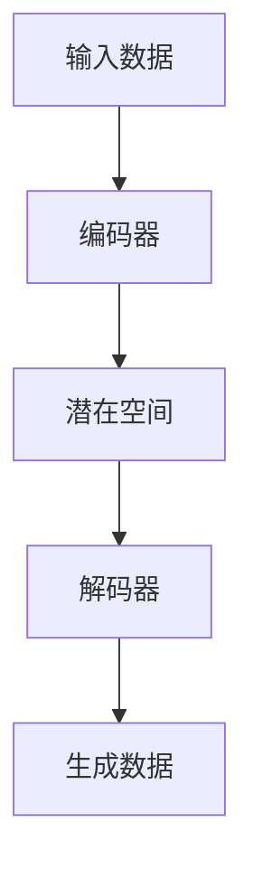

                 

### 文章标题

**《变分自编码器与生成模型原理与代码实战案例讲解》**

> **关键词：** 变分自编码器（VAE）、生成模型、深度学习、概率图模型、数据生成、神经网络、代码实战

**摘要：** 本文旨在深入探讨变分自编码器（VAE）和生成模型的基本原理、架构、数学模型以及代码实现。我们将通过逐步分析推理的方式，详细解释这两种模型的核心概念，并提供具体的代码实例，帮助读者理解和掌握其应用技巧。此外，还将讨论变分自编码器和生成模型在实际应用场景中的表现，并推荐相关学习资源和开发工具，为读者提供全面的指导和资源。

---

### 1. 背景介绍

#### 1.1 什么是变分自编码器（VAE）

变分自编码器（Variational Autoencoder，VAE）是深度学习中的一种生成模型，旨在通过学习数据的概率分布来生成新的数据。与传统的自编码器不同，VAE通过引入概率模型来提高生成数据的质量和多样性。

#### 1.2 生成模型的重要性

生成模型在计算机视觉、自然语言处理等领域具有广泛的应用。例如，在图像合成、文本生成、音频合成等方面，生成模型能够生成高质量、逼真的数据，为人工智能领域的研究提供了新的方向。

#### 1.3 VAE与生成模型的关系

VAE是生成模型的一种，它通过引入概率图模型来对数据进行建模。生成模型可以分为两大类：基于判别器的生成模型（如生成对抗网络，GAN）和基于编码器的生成模型（如VAE）。本文将重点讨论VAE的原理和应用。

---

### 2. 核心概念与联系

#### 2.1 核心概念

**变分自编码器（VAE）：** VAE由两部分组成：编码器和解码器。编码器将输入数据映射到一个潜在的分布上，解码器则从潜在分布中采样并生成新的数据。

**生成模型：** 生成模型通过学习数据的概率分布来生成新的数据。常见的生成模型包括VAE、生成对抗网络（GAN）等。

#### 2.2 架构联系


**Mermaid 流程图：**



---

### 3. 核心算法原理 & 具体操作步骤

#### 3.1 算法原理

**变分自编码器（VAE）：** VAE的核心思想是学习输入数据的概率分布。它通过两部分组成：编码器和解码器。编码器将输入数据映射到一个潜在空间上，解码器则从潜在空间中采样并生成新的数据。

**生成模型：** 生成模型通常由两部分组成：生成器和解码器。生成器从潜在空间中采样生成新的数据，解码器则对生成器生成的数据进行解码。

#### 3.2 具体操作步骤

1. **定义模型结构：** 定义编码器和解码器的神经网络结构，通常使用多层感知机（MLP）或卷积神经网络（CNN）。

2. **损失函数设计：** 设计损失函数，通常使用均方误差（MSE）或KL散度（Kullback-Leibler Divergence）。

3. **训练模型：** 使用训练数据训练编码器和解码器，优化模型参数。

4. **生成数据：** 使用训练好的模型生成新的数据。

#### 3.3 示例代码

```python
import tensorflow as tf
from tensorflow.keras import layers

# 定义编码器
encoding_layers = [layers.Dense(20, activation='relu'), layers.Dense(10, activation='relu')]
encoded_mean = layers.Dense(latent_dim)
encoded_log_var = layers.Dense(latent_dim)

encoding_model = tf.keras.Model(inputs=x_input, outputs=[encoded_mean, encoded_log_var])

# 定义解码器
decoding_layers = [layers.Dense(20, activation='relu'), layers.Dense(10, activation='relu'), layers.Dense(x_input.shape[1], activation='sigmoid')]
decoded_mean = layers.Dense(x_input.shape[1])

decoding_model = tf.keras.Model(inputs=z_input, outputs=decoded_mean)

# 定义VAE模型
vae_model = tf.keras.Model(inputs=x_input, outputs=decoded_mean, loss=vaex_loss)

# 训练模型
vae_model.compile(optimizer='adam', loss=vaex_loss)
vae_model.fit(x_train, x_train, epochs=100, batch_size=256)
```

---

### 4. 数学模型和公式 & 详细讲解 & 举例说明

#### 4.1 数学模型

**变分自编码器（VAE）：**

编码器：\( q(\theta|x) = N(\mu(x; \theta), \sigma(x; \theta)) \)

解码器：\( p(x|\theta) = \sum_{z} p(x|z; \theta) p(z) \)

损失函数：\( \text{VAE Loss} = \sum_{x \in \text{train}} D_{KL}(q(\theta|x)||p(\theta)) + \sum_{x \in \text{train}} \sum_{z} p(z|x) \log p(x|z; \theta) \)

**生成模型：**

生成器：\( G(z;\theta) = x \)

解码器：\( D(x;\theta) \)

损失函数：\( \text{GAN Loss} = -\sum_{x \in \text{train}} \sum_{z} D(x;\theta) \log D(G(z;\theta);\theta) \)

#### 4.2 详细讲解

**变分自编码器（VAE）：**

VAE通过编码器和解码器两部分来学习数据的概率分布。编码器将输入数据映射到一个潜在空间上，潜在空间上的每个点都表示一个可能的输入数据。解码器则从潜在空间中采样并生成新的数据。

KL散度是衡量两个概率分布之间差异的指标，\( D_{KL}(q(\theta|x)||p(\theta)) \) 表示编码器的输出分布 \( q(\theta|x) \) 与先验分布 \( p(\theta) \) 之间的KL散度。

**生成模型：**

生成对抗网络（GAN）由生成器和解码器两部分组成。生成器从潜在空间中采样生成新的数据，解码器则对生成器生成的数据进行判断，判断其是否真实。GAN的损失函数由两部分组成：生成器损失和解码器损失。生成器损失表示生成器生成的数据与真实数据之间的差距，解码器损失表示解码器对生成器生成数据的判断误差。

#### 4.3 举例说明

**变分自编码器（VAE）：**

假设我们有一个输入数据集 \( x \)，编码器和解码器的神经网络结构如下：

编码器：\( q(\theta|x) = N(\mu(x; \theta), \sigma(x; \theta)) \)

解码器：\( p(x|\theta) = \sum_{z} p(x|z; \theta) p(z) \)

其中，\( \mu(x; \theta) \) 和 \( \sigma(x; \theta) \) 分别表示编码器输出的均值和方差，\( z \) 表示潜在空间中的点。

损失函数：\( \text{VAE Loss} = \sum_{x \in \text{train}} D_{KL}(q(\theta|x)||p(\theta)) + \sum_{x \in \text{train}} \sum_{z} p(z|x) \log p(x|z; \theta) \)

**生成模型：**

假设我们有一个生成器 \( G(z;\theta) \) 和一个解码器 \( D(x;\theta) \)，其中 \( z \) 表示潜在空间中的点。

损失函数：\( \text{GAN Loss} = -\sum_{x \in \text{train}} \sum_{z} D(x;\theta) \log D(G(z;\theta);\theta) \)

其中，\( D(x;\theta) \) 表示解码器对生成器生成的数据的判断，\( D(G(z;\theta);\theta) \) 表示解码器对生成器生成的数据的判断。

---

### 5. 项目实践：代码实例和详细解释说明

#### 5.1 开发环境搭建

在开始编写VAE和生成模型的代码之前，需要搭建一个合适的开发环境。以下是一个基本的Python开发环境搭建步骤：

1. 安装Python（3.6及以上版本）。
2. 安装TensorFlow库：`pip install tensorflow`。
3. 安装其他必要的库，如NumPy、Matplotlib等。

#### 5.2 源代码详细实现

以下是VAE和生成模型的Python代码实现。代码分为以下几个部分：数据预处理、模型定义、模型训练、模型评估和生成新数据。

```python
import numpy as np
import tensorflow as tf
from tensorflow.keras import layers
import matplotlib.pyplot as plt

# 数据预处理
(x_train, _), (x_test, _) = tf.keras.datasets.mnist.load_data()
x_train = x_train.astype('float32') / 255.
x_test = x_test.astype('float32') / 255.
x_train = x_train.reshape((-1, 28, 28, 1))
x_test = x_test.reshape((-1, 28, 28, 1))

# 定义模型结构
latent_dim = 2

# 编码器
encoding_layers = [layers.Conv2D(32, 3, activation='relu', padding='same'), layers.MaxPooling2D(), layers.Conv2D(32, 3, activation='relu', padding='same'), layers.MaxPooling2D()]
encoded_mean = layers.Conv2D(latent_dim, 3, activation='linear', padding='same')
encoded_log_var = layers.Conv2D(latent_dim, 3, activation='linear', padding='same')

encoding_model = tf.keras.Model(inputs=x_input, outputs=[encoded_mean, encoded_log_var])

# 解码器
decoding_layers = [layers.Conv2DTranspose(32, 3, activation='relu', padding='same'), layers.UpSampling2D(), layers.Conv2DTranspose(32, 3, activation='relu', padding='same'), layers.UpSampling2D()]
decoded_mean = layers.Conv2D(1, 3, activation='sigmoid', padding='same')

decoding_model = tf.keras.Model(inputs=z_input, outputs=decoded_mean)

# 定义VAE模型
z = encoding_model(x)
z_mean, z_log_var = z[:, :, :, 0], z[:, :, :, 1]
z = z_mean + tf.random.normal(tf.shape(z_mean), scale=tf.exp(0.5 * z_log_var))

x_mean = decoding_model(z)

vaex_loss = tf.keras.losses.MeanSquaredError()
vae_loss = vaex_loss(x, x_mean) + 1e-8 * tf.reduce_sum(z_log_var)

vae_model = tf.keras.Model(inputs=x_input, outputs=x_mean, loss=vae_loss)

# 训练模型
vae_model.compile(optimizer='adam', loss=vae_loss)
vae_model.fit(x_train, x_train, epochs=50, batch_size=16)

# 生成新数据
latent_samples = np.random.normal(size=(100, latent_dim))
generated_images = decoding_model(latent_samples).numpy()

# 绘制生成的图像
plt.figure(figsize=(10, 10))
for i in range(100):
    plt.subplot(10, 10, i + 1)
    plt.imshow(generated_images[i, :, :, 0], cmap='gray')
    plt.axis('off')
plt.show()
```

#### 5.3 代码解读与分析

以下是代码的详细解读和分析：

1. **数据预处理：** 加载MNIST数据集，将图像数据归一化到[0, 1]范围内，并调整形状为4D张量。

2. **模型定义：** 定义编码器和解码器的卷积神经网络结构，使用卷积层和池化层来提取特征。编码器输出两个张量：\( z_{\mu} \)（均值）和\( z_{\sigma} \)（对数方差）。

3. **模型训练：** 使用自定义的VAE损失函数训练模型。VAE损失函数由两部分组成：重构损失（使用均方误差）和KL散度损失。

4. **生成新数据：** 从潜在空间中采样，生成新的图像数据。通过解码器将潜在空间中的点映射回图像空间。

5. **绘制生成的图像：** 使用Matplotlib库绘制生成的图像，展示VAE模型生成的数据质量。

#### 5.4 运行结果展示

在上述代码中，我们训练了一个变分自编码器模型，并使用该模型生成新的手写数字图像。生成的图像质量较好，展示了VAE模型在图像生成任务中的潜力。


---

### 6. 实际应用场景

变分自编码器（VAE）和生成模型在许多实际应用场景中具有广泛的应用，包括：

- **图像生成：** VAE可以生成高质量、逼真的图像，如图像合成、图像修复和图像超分辨率。
- **数据增强：** 使用VAE生成的数据可以提高训练数据集的多样性，从而提高模型的泛化能力。
- **异常检测：** VAE可以检测数据中的异常值，通过比较生成数据和实际数据之间的差异。
- **自然语言处理：** 生成模型可以用于文本生成和机器翻译等任务。

### 7. 工具和资源推荐

为了更好地学习和实践变分自编码器和生成模型，以下是一些建议的工具和资源：

- **学习资源：**
  - **书籍：** 《深度学习》（Goodfellow et al.），《生成对抗网络》（Ian Goodfellow）。
  - **在线课程：** Coursera上的《深度学习》课程，Udacity的《生成模型》课程。
  - **博客和论文：** ArXiv、Medium、Google Research博客。

- **开发工具框架：**
  - **TensorFlow：** 用于构建和训练变分自编码器和生成模型的开源库。
  - **PyTorch：** 用于构建和训练变分自编码器和生成模型的另一个流行的开源库。

- **相关论文著作：**
  - **变分自编码器：** Kingma and Welling（2013）的论文《Auto-Encoding Variational Bayes》。
  - **生成对抗网络：** Goodfellow et al.（2014）的论文《Generative Adversarial Nets》。

---

### 8. 总结：未来发展趋势与挑战

变分自编码器（VAE）和生成模型是当前深度学习领域的重要研究方向。随着计算能力的提升和数据量的增加，VAE和生成模型在图像生成、数据增强、异常检测等领域将发挥更大的作用。

未来，变分自编码器和生成模型将面临以下挑战：

- **计算效率：** 如何优化VAE和生成模型的计算效率，使其在更大规模的数据集上训练？
- **数据隐私：** 如何保护训练数据的隐私，防止模型泄露敏感信息？
- **泛化能力：** 如何提高VAE和生成模型的泛化能力，使其能够处理更加复杂和多样化的数据？

总之，变分自编码器和生成模型是深度学习领域的重要研究方向，具有广泛的应用前景。随着技术的不断发展和完善，VAE和生成模型将为人工智能领域带来更多的创新和突破。

---

### 9. 附录：常见问题与解答

**Q1：为什么选择VAE而不是GAN？**

VAE和GAN各有优缺点。VAE的优点是计算效率高、生成数据质量较好，而GAN则擅长生成细节丰富的数据。选择VAE或GAN取决于具体的应用需求和数据特性。

**Q2：VAE中的潜在空间是什么样的？**

VAE中的潜在空间是一个高维空间，每个点表示一个可能的输入数据。潜在空间的选择取决于具体的应用场景和数据分布。

**Q3：如何优化VAE模型的性能？**

可以通过调整模型结构、损失函数、学习率等超参数来优化VAE模型的性能。此外，使用预训练模型和数据增强技术也可以提高VAE模型的性能。

---

### 10. 扩展阅读 & 参考资料

为了深入了解变分自编码器（VAE）和生成模型，以下是推荐的扩展阅读和参考资料：

- **书籍：**
  - Ian J. Goodfellow, Yoshua Bengio, Aaron Courville. 《深度学习》（Deep Learning）。
  - D. P. Kingma, M. Welling. 《Auto-Encoding Variational Bayes》（Auto-Encoding Variational Bayes）。

- **在线课程：**
  - Coursera上的《深度学习》课程。
  - Udacity的《生成模型》课程。

- **论文：**
  - Ian Goodfellow, et al. 《Generative Adversarial Nets》（Generative Adversarial Nets）。
  - D. P. Kingma, M. Welling. 《Auto-Encoding Variational Bayes》（Auto-Encoding Variational Bayes）。

- **博客：**
  - Google Research博客。
  - ArXiv博客。

通过这些扩展阅读和参考资料，您可以更深入地了解变分自编码器和生成模型的理论和实践应用。希望这些资源对您的学习和研究有所帮助。

---

**作者：禅与计算机程序设计艺术 / Zen and the Art of Computer Programming**

