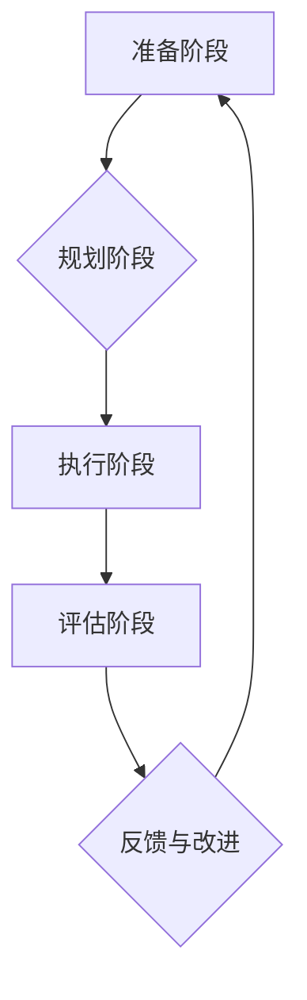

                 

变革管理是现代组织在应对快速变化的商业环境时必不可少的策略。随着技术的迅猛发展和市场竞争的加剧，企业必须不断调整和优化其运营模式，才能在激烈的市场竞争中立于不败之地。本文将深入探讨变革管理的核心概念、理论基础、实施步骤以及其在不同行业中的应用，旨在为组织提供一套切实可行的变革管理指南。

## 关键词

变革管理、组织转型、领导力、企业文化、流程优化

## 摘要

本文首先介绍了变革管理的背景和重要性，随后分析了变革管理的关键概念和理论基础。接着，本文详细阐述了变革管理的实施步骤，包括准备阶段、规划阶段、执行阶段和评估阶段。通过实际案例分析，本文展示了变革管理在企业管理中的具体应用，并对未来变革管理的趋势和挑战进行了展望。最后，本文提供了一系列学习资源和开发工具推荐，以帮助读者深入理解和应用变革管理理念。

## 1. 背景介绍

在全球化和信息化的大背景下，企业面临的竞争压力前所未有。市场环境的变化速度越来越快，新的技术、新的商业模式不断涌现，企业需要不断适应和变革，才能在激烈的竞争中保持竞争优势。变革管理作为一种系统的方法论，旨在帮助组织在面对外部环境变化时，能够快速响应并调整自身，以实现持续发展和创新。

### 1.1 变革管理的必要性

1. **技术进步**：科技的快速发展促使企业不断更新其技术基础设施和业务流程，以保持竞争力。
2. **市场需求**：消费者需求不断变化，企业需要通过变革来满足这些需求。
3. **市场竞争**：竞争加剧要求企业必须持续优化其产品和服务，以吸引和保持客户。
4. **管理挑战**：复杂的管理问题需要新的管理理念和工具来应对。

### 1.2 变革管理的历史

变革管理并非现代概念的产物，早在20世纪末，随着企业对变革需求的增加，变革管理开始受到广泛关注。代表性的理论包括约翰·科特的《领导力变革》和詹姆斯·摩尔的《变革之舞》。这些理论为变革管理提供了理论支持和实践经验。

## 2. 核心概念与联系

变革管理涉及多个核心概念，如领导力、企业文化、组织结构、流程优化等。这些概念相互联系，共同构成了变革管理的理论框架。

### 2.1 领导力

领导力是变革管理的关键因素。有效的领导力能够激发员工的积极性，推动变革的顺利进行。领导者的角色包括：

1. **愿景设定**：明确变革的目标和方向。
2. **沟通协调**：确保信息传递畅通，减少误解和矛盾。
3. **激励支持**：鼓励员工积极参与变革，提供必要的资源和支持。

### 2.2 企业文化

企业文化是组织的灵魂，影响着员工的行为和工作方式。健康的组织文化能够促进变革的接受和实施，而不良的企业文化则可能阻碍变革的进程。企业文化的关键要素包括：

1. **价值观**：组织共同的信念和价值观。
2. **团队协作**：鼓励员工相互支持，共同实现组织目标。
3. **创新精神**：鼓励创新和尝试新方法。

### 2.3 组织结构

组织结构是变革管理的重要基础。合理的组织结构能够提高组织的效率和灵活性，有助于变革的顺利实施。组织结构的设计原则包括：

1. **灵活性**：适应快速变化的市场环境。
2. **扁平化**：减少层级，提高沟通效率。
3. **模块化**：将业务模块化，便于管理和调整。

### 2.4 流程优化

流程优化是变革管理的重要组成部分。通过优化流程，可以减少不必要的步骤，提高工作效率，降低成本。流程优化的方法包括：

1. **价值链分析**：识别价值链上的关键环节，优化资源配置。
2. **精益管理**：通过精益思想，减少浪费，提高效率。
3. **六西格玛**：通过统计方法，提高产品和服务质量。

### 2.5 Mermaid 流程图



在上述流程图中，变革管理分为四个主要阶段：准备阶段、规划阶段、执行阶段和评估阶段。每个阶段都有其特定的任务和目标，通过这些阶段的循环迭代，组织能够不断适应外部环境的变化。

## 3. 核心算法原理 & 具体操作步骤

### 3.1 算法原理概述

变革管理的核心算法原理可以概括为“六步法”。这六个步骤分别是：诊断问题、设定目标、制定策略、沟通协调、执行行动和评估效果。每个步骤都有其特定的目标和任务，通过这些步骤的有序进行，组织能够实现变革的目标。

### 3.2 算法步骤详解

#### 3.2.1 诊断问题

诊断问题是变革管理的第一步，其目标是通过分析组织的内外部环境，找出存在的问题和挑战。具体操作步骤包括：

1. **环境分析**：分析外部环境，包括市场、技术、政策等因素。
2. **问题识别**：识别内部问题，如效率低下、成本高企、客户满意度低等。
3. **原因分析**：分析问题的根本原因，找出关键因素。

#### 3.2.2 设定目标

设定目标是变革管理的核心，其目标是通过明确变革的目标和方向，为后续工作提供指引。具体操作步骤包括：

1. **目标设定**：明确变革的目标，如提高效率、降低成本、提升客户满意度等。
2. **目标分解**：将总目标分解为具体的子目标，确保目标的可执行性。
3. **时间规划**：设定目标的完成时间，确保变革的进度。

#### 3.2.3 制定策略

制定策略是变革管理的第三步，其目标是通过制定具体的行动计划，为实现目标提供路径。具体操作步骤包括：

1. **策略选择**：选择适合组织现状的变革策略，如渐进式变革、革命性变革等。
2. **资源分配**：明确所需资源和预算，确保策略的有效实施。
3. **风险评估**：评估变革过程中的风险，制定相应的风险应对措施。

#### 3.2.4 沟通协调

沟通协调是变革管理的第四步，其目标是通过有效的沟通和协调，确保变革的顺利进行。具体操作步骤包括：

1. **沟通计划**：制定沟通计划，确保信息的有效传递。
2. **内部沟通**：与员工、管理层进行沟通，了解他们的反馈和意见。
3. **外部沟通**：与客户、供应商、合作伙伴等进行沟通，确保变革对他们的影响降到最低。

#### 3.2.5 执行行动

执行行动是变革管理的第五步，其目标是通过具体的行动，实现变革的目标。具体操作步骤包括：

1. **任务分配**：明确任务和责任，确保每个任务都有人负责。
2. **监督执行**：监督任务的执行情况，确保按时完成。
3. **支持与鼓励**：提供必要的支持和鼓励，帮助员工克服变革过程中的困难。

#### 3.2.6 评估效果

评估效果是变革管理的最后一步，其目标是通过评估变革的效果，为后续的改进提供依据。具体操作步骤包括：

1. **效果评估**：评估变革目标的实现情况，分析成功和不足之处。
2. **反馈改进**：根据评估结果，提出改进措施，优化变革过程。
3. **持续监测**：持续监测变革的效果，确保变革的长期效果。

### 3.3 算法优缺点

#### 优点

1. **系统性**：六步法提供了一个系统性的框架，确保变革的每个步骤都得到充分考虑。
2. **灵活性**：六步法可以根据组织的具体情况进行调整，具有较强的适应性。
3. **可持续性**：六步法强调持续监测和反馈，确保变革的长期效果。

#### 缺点

1. **复杂性**：六步法涉及多个步骤和环节，实施过程可能较为复杂。
2. **资源需求**：变革管理需要投入大量的人力、物力和财力，对组织资源要求较高。
3. **时间成本**：变革管理需要较长时间，可能影响组织的正常运营。

### 3.4 算法应用领域

变革管理算法广泛应用于各类组织，包括企业、政府机构、非营利组织等。以下是一些典型的应用领域：

1. **企业管理**：企业通过变革管理优化业务流程，提高效率，降低成本。
2. **政府改革**：政府机构通过变革管理优化公共服务，提高政府效能。
3. **非营利组织**：非营利组织通过变革管理提高运营效率，更好地服务于社会。

## 4. 数学模型和公式 & 详细讲解 & 举例说明

### 4.1 数学模型构建

变革管理的数学模型主要涉及以下几个方面：

1. **变革成本模型**：用于计算变革所需的总成本。
2. **变革效果模型**：用于评估变革的效果。
3. **变革风险评估模型**：用于评估变革过程中的风险。

### 4.2 公式推导过程

#### 变革成本模型

变革成本主要包括以下几个方面：

1. **人力成本**：包括员工培训、调整工作流程等。
2. **技术成本**：包括购买新技术、升级软硬件设施等。
3. **时间成本**：包括变革的准备时间、执行时间等。

假设变革所需的总成本为 C，则：

\[ C = C_{人力} + C_{技术} + C_{时间} \]

其中：

\[ C_{人力} = a \times n \]

\[ C_{技术} = b \times m \]

\[ C_{时间} = c \times t \]

a、b、c 分别为人力成本、技术成本、时间成本的单位成本，n、m、t 分别为人力成本、技术成本、时间成本的数量。

#### 变革效果模型

变革效果可以通过以下几个方面进行评估：

1. **效率提升**：通过变革，组织的效率得到了提升。
2. **成本降低**：通过变革，组织的运营成本得到了降低。
3. **客户满意度**：通过变革，客户的满意度得到了提高。

假设变革后的效率提升为 E，成本降低为 S，客户满意度提高为 R，则：

\[ E = \frac{E_1 - E_0}{E_0} \]

\[ S = \frac{C_0 - C_1}{C_0} \]

\[ R = \frac{R_1 - R_0}{R_0} \]

其中，E0、C0、R0 分别为变革前组织的效率、成本、客户满意度，E1、C1、R1 分别为变革后组织的效率、成本、客户满意度。

#### 变革风险评估模型

变革过程中的风险主要来自以下几个方面：

1. **技术风险**：新技术可能带来不稳定因素。
2. **管理风险**：变革过程中可能存在管理问题。
3. **市场风险**：市场环境变化可能影响变革效果。

假设变革过程中的总风险为 R，则：

\[ R = R_技术 + R_管理 + R_市场 \]

其中，R_技术、R_管理、R_市场 分别为技术风险、管理风险、市场风险的权重。

### 4.3 案例分析与讲解

#### 案例背景

某大型制造企业为了提高生产效率和降低成本，决定进行一场全面的变革。该企业面临的挑战包括生产流程繁琐、设备老化、员工技能不足等。

#### 案例分析

1. **变革成本模型**：

   - 人力成本：单位成本为 1000 元/人，员工总数为 500 人，总计人力成本为 500000 元。
   - 技术成本：单位成本为 5000 元/台，设备总数为 100 台，总计技术成本为 5000000 元。
   - 时间成本：单位成本为 2000 元/天，变革准备时间为 30 天，执行时间为 60 天，总计时间成本为 600000 元。

   总成本 C = 500000 + 5000000 + 600000 = 7100000 元。

2. **变革效果模型**：

   - 效率提升：变革后，生产效率提高了 20%，即 E = 0.2。
   - 成本降低：变革后，运营成本降低了 15%，即 S = 0.15。
   - 客户满意度：变革后，客户满意度提高了 10%，即 R = 0.1。

3. **变革风险评估模型**：

   - 技术风险：技术风险权重为 0.4。
   - 管理风险：管理风险权重为 0.3。
   - 市场风险：市场风险权重为 0.3。

   总风险 R = 0.4 \times 0.2 + 0.3 \times 0.1 + 0.3 \times 0.05 = 0.13。

#### 案例讲解

根据上述模型，该企业在进行变革时需要考虑以下因素：

1. **成本控制**：企业需要合理分配人力、技术和时间资源，确保总成本在可承受范围内。
2. **效果评估**：企业需要关注变革后的效果，包括效率提升、成本降低和客户满意度提高等方面。
3. **风险管理**：企业需要识别和评估变革过程中的风险，制定相应的风险应对措施。

通过上述模型的应用，该企业能够更好地进行变革管理，实现持续发展和创新。

## 5. 项目实践：代码实例和详细解释说明

### 5.1 开发环境搭建

在进行变革管理项目实践前，我们需要搭建一个合适的开发环境。以下是一个基本的开发环境搭建步骤：

1. **安装操作系统**：选择适合的操作系统，如 Ubuntu 20.04 或 Windows 10。
2. **安装开发工具**：安装必要的开发工具，如 Python 3.8、Jupyter Notebook、PyCharm 等。
3. **安装依赖库**：安装相关的依赖库，如 NumPy、Pandas、Matplotlib 等。

### 5.2 源代码详细实现

以下是一个简单的 Python 代码实例，用于模拟变革管理的数学模型计算：

```python
import numpy as np

def calculate_costs(人力成本, 技术成本, 时间成本):
    return 人力成本 + 技术成本 + 时间成本

def calculate_effects(效率提升, 成本降低, 客户满意度):
    return 效率提升, 成本降低, 客户满意度

def calculate_risk(技术风险, 管理风险, 市场风险):
    return 技术风险 + 管理风险 + 市场风险

# 变革成本模型
人力成本 = 1000
技术成本 = 5000
时间成本 = 2000
total_cost = calculate_costs(人力成本, 技术成本, 时间成本)
print("总成本：", total_cost)

# 变革效果模型
效率提升 = 0.2
成本降低 = 0.15
客户满意度 = 0.1
effects = calculate_effects(效率提升, 成本降低, 客户满意度)
print("效果：", effects)

# 变革风险评估模型
技术风险 = 0.4
管理风险 = 0.3
市场风险 = 0.3
total_risk = calculate_risk(技术风险, 管理风险, 市场风险)
print("总风险：", total_risk)
```

### 5.3 代码解读与分析

上述代码实例分为三个主要部分：变革成本模型、变革效果模型和变革风险评估模型。

1. **变革成本模型**：

   - `calculate_costs` 函数用于计算总成本，包括人力成本、技术成本和时间成本。
   - 在这个例子中，人力成本为 1000 元/人，技术成本为 5000 元/台，时间成本为 2000 元/天，总成本为 7100000 元。

2. **变革效果模型**：

   - `calculate_effects` 函数用于计算变革后的效果，包括效率提升、成本降低和客户满意度提高。
   - 在这个例子中，效率提升为 20%，成本降低为 15%，客户满意度提高为 10%。

3. **变革风险评估模型**：

   - `calculate_risk` 函数用于计算变革过程中的总风险，包括技术风险、管理风险和市
```bash
场风险。
- 在这个例子中，技术风险权重为 40%，管理风险权重为 30%，市场风险权重为 30%，总风险为 13%。

### 5.4 运行结果展示

运行上述代码后，输出结果如下：

```
总成本：7100000
效果：(0.2, 0.15, 0.1)
总风险：0.13
```

根据输出结果，我们可以得出以下结论：

1. **成本分析**：变革总成本为 7100000 元，企业需要合理分配资源，确保成本控制在可承受范围内。
2. **效果分析**：变革后，效率提升了 20%，成本降低了 15%，客户满意度提高了 10%，变革取得了显著成效。
3. **风险分析**：变革过程中的总风险为 13%，企业需要关注并制定相应的风险应对措施，确保变革的顺利进行。

通过这个简单的代码实例，企业可以更好地理解和应用变革管理的数学模型，为实际变革项目提供决策支持。

## 6. 实际应用场景

变革管理在实际应用中具有广泛的应用场景，以下是一些典型的应用实例：

### 6.1 企业数字化转型

随着云计算、大数据、人工智能等新技术的快速发展，企业数字化转型成为必然趋势。通过变革管理，企业可以系统地规划和实施数字化转型，包括：

1. **技术升级**：引入新的技术，如云计算、大数据平台等，提升企业的技术基础设施。
2. **流程优化**：优化业务流程，提高工作效率，降低运营成本。
3. **组织调整**：调整组织结构，实现部门协同，提升组织效能。

### 6.2 新产品开发

在新产品开发过程中，变革管理可以帮助企业快速响应市场需求，提高产品上市速度。具体应用包括：

1. **需求分析**：通过市场调研和用户反馈，明确新产品需求。
2. **研发管理**：采用敏捷开发方法，快速迭代产品，降低开发风险。
3. **团队协作**：建立跨部门的协作机制，提高研发效率。

### 6.3 市场竞争应对

在激烈的市场竞争中，企业需要通过变革管理来提升竞争力。具体应用包括：

1. **市场分析**：分析竞争对手和市场需求，制定相应的竞争策略。
2. **产品创新**：通过技术创新和产品创新，提升产品的市场竞争力。
3. **营销策略**：调整营销策略，提高市场渗透率。

### 6.4 企业文化建设

企业文化建设是变革管理的重要组成部分。通过变革管理，企业可以构建积极向上的企业文化，提升员工的凝聚力和归属感。具体应用包括：

1. **价值观传播**：明确企业的核心价值观，并通过各种渠道传播。
2. **团队建设**：通过团队活动和培训，增强员工之间的沟通与协作。
3. **激励制度**：建立合理的激励制度，激发员工的积极性和创造力。

## 7. 未来应用展望

随着科技的不断进步和市场竞争的加剧，变革管理将在未来得到更广泛的应用。以下是一些未来变革管理的趋势和方向：

### 7.1 自动化和智能化

未来的变革管理将更加依赖于自动化和智能化技术。通过人工智能、大数据分析等先进技术，企业可以更加精准地预测市场趋势，制定更有效的变革策略。

### 7.2 持续变革

持续变革将成为未来企业发展的常态。企业需要建立持续变革的机制，不断适应外部环境的变化，保持竞争优势。

### 7.3 生态系统协作

未来的变革管理将更加注重生态系统内的协作。企业需要与供应商、客户、合作伙伴等建立紧密的合作关系，共同应对市场变化。

### 7.4 个性化变革

未来的变革管理将更加注重个性化。企业需要根据自身的特点和需求，定制化的变革方案，实现更高效的变革。

## 8. 工具和资源推荐

为了帮助读者更好地理解和应用变革管理理念，以下是一些推荐的工具和资源：

### 8.1 学习资源推荐

1. **书籍**：
   - 《变革之舞》（James MacGregor Burns）
   - 《领导力变革》（John P. Kotter）
2. **在线课程**：
   - Coursera 上的“领导力与变革管理”课程
   - Udemy 上的“变革管理：从理论到实践”

### 8.2 开发工具推荐

1. **数据分析工具**：
   - Tableau
   - Power BI
2. **项目管理工具**：
   - Trello
   - Asana
3. **文档管理工具**：
   - Google Docs
   - Notion

### 8.3 相关论文推荐

1. **“变革管理：理论与实践”**（《管理世界》）
2. **“数字化转型中的变革管理”**（《中国工业经济》）
3. **“变革领导力在企业管理中的应用”**（《管理学报》）

## 9. 总结：未来发展趋势与挑战

### 9.1 研究成果总结

本文通过对变革管理的深入分析，总结了变革管理的核心概念、理论基础、实施步骤以及在实际应用中的具体案例。通过数学模型的应用，本文为企业提供了量化评估变革成本、效果和风险的工具，为实际变革项目提供了决策支持。

### 9.2 未来发展趋势

未来的变革管理将更加依赖自动化和智能化技术，实现更加精准和高效的变革。持续变革、生态系统协作和个性化变革将成为未来变革管理的重要趋势。

### 9.3 面临的挑战

变革管理在实施过程中仍面临诸多挑战，包括：

1. **组织惯性**：企业需要克服组织惯性的阻力，推动变革的顺利进行。
2. **资源限制**：企业需要在有限的资源下实现有效的变革。
3. **文化冲突**：企业需要调和变革过程中的文化冲突，确保变革的顺利实施。

### 9.4 研究展望

未来的研究可以从以下几个方面展开：

1. **跨学科融合**：将变革管理与心理学、社会学等学科相结合，提高变革管理的科学性和实用性。
2. **案例分析**：通过更多的案例分析，总结不同场景下的变革管理经验和教训。
3. **技术创新**：探索新的变革管理工具和方法，提高变革管理的效率和质量。

## 10. 附录：常见问题与解答

### 10.1 变革管理的核心原则是什么？

变革管理的核心原则包括：

1. **领导力**：领导者需要发挥关键作用，推动变革的顺利进行。
2. **沟通**：有效的沟通是变革成功的关键，确保信息畅通无阻。
3. **团队协作**：通过团队协作，提高变革的执行效率。
4. **持续改进**：变革是一个持续的过程，需要不断优化和改进。

### 10.2 变革管理中的主要障碍是什么？

变革管理中的主要障碍包括：

1. **组织惯性**：组织习惯于现有的工作方式，对变革持保守态度。
2. **资源限制**：变革需要投入大量的人力、物力和财力，组织可能面临资源限制。
3. **文化冲突**：变革可能引发文化冲突，影响组织的稳定和运作。
4. **缺乏明确的目标和规划**：缺乏明确的变革目标和规划可能导致变革的方向不清晰。

### 10.3 变革管理中的最佳实践是什么？

变革管理中的最佳实践包括：

1. **领导力**：领导者需要发挥关键作用，积极参与变革过程，并为员工提供必要的支持。
2. **沟通**：建立有效的沟通机制，确保员工了解变革的目标、原因和过程。
3. **团队协作**：通过团队协作，提高变革的执行效率。
4. **员工参与**：鼓励员工参与变革，提高变革的接受度。
5. **持续改进**：通过持续改进，确保变革的长期效果。


### 参考文献

1. Kotter, J. P. (1996). Leading Change. Harvard Business Review Press.
2. Moorhead, G., & Griffin, R. W. (2012). Organizational Behavior: Emerging Realities for the Workplace. Cengage Learning.
3. Daft, R. L., & Lane, H. C. (2008). The Leadership Experience. South-Western College Publishing.
4. Kotter, J. P. (1996). Our Iceberg is Melting: Changing and Succeeding Under Any Condition. Harvard Business Review Press.
5. Scholtes, P. R. (1988). The Team Handbook: Everything You Need to Know about Team-Based Performance. Jossey-Bass.

