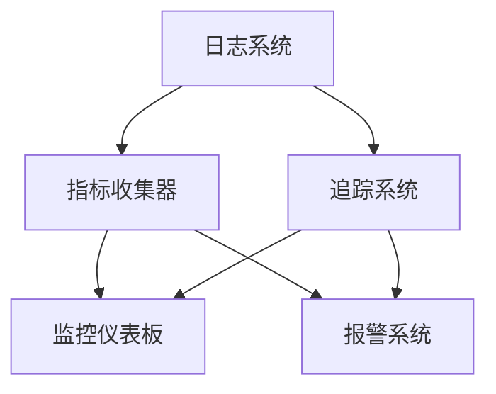

                 

### 背景介绍

在现代软件开发领域，系统的复杂性和规模不断增长，开发、运维团队需要高效地理解和监控系统的运行状态，以确保其稳定性和性能。这一需求催生了一个新的概念——可观测性（Observability）。可观测性是软件系统的一种属性，它使我们能够通过观察系统内部的行为来理解其整体状态，从而更好地进行故障诊断、性能优化和安全性管理。

可观测性工具链是实现这一目标的关键组件。工具链通常包括日志（Logging）、指标（Metrics）和追踪（Tracing）三大类。这三者各有特点，但共同作用，为开发和运维团队提供了全面的系统监控能力。

#### 日志（Logging）

日志是记录系统运行过程中发生的事件的文本记录。它们提供了详细的操作历史和错误信息，可以帮助开发人员了解系统在特定时间点上的状态。日志的典型用途包括：

1. **故障诊断**：当系统出现问题时，通过日志可以查找相关错误信息，快速定位故障源头。
2. **性能监控**：通过分析日志中的系统操作记录，可以了解系统资源的使用情况和性能瓶颈。
3. **审计和合规**：日志记录可以帮助企业满足合规要求，例如金融行业的监管需求。

#### 指标（Metrics）

指标是系统性能和运行状态的量化度量。它们通常以数字的形式表示，可以帮助运维团队快速了解系统的健康状态。常见的指标类型包括：

1. **CPU利用率**：表示CPU在一段时间内的使用情况。
2. **内存使用率**：表示系统内存的使用情况。
3. **响应时间**：表示系统处理请求的平均耗时。

指标通常通过自动化的监控系统收集，并且可以集成到监控仪表板中，实时显示系统的运行状态。

#### 追踪（Tracing）

追踪是记录系统中各个服务之间的交互过程，可以帮助团队了解请求在分布式系统中的路径和耗时。追踪的主要用途包括：

1. **性能优化**：通过追踪请求的路径和耗时，可以识别系统中的性能瓶颈。
2. **故障排查**：当系统出现问题时，通过追踪可以重现故障过程，帮助团队快速定位问题所在。

在了解了可观测性的概念和工具链的组成部分后，我们将进一步探讨这些工具之间的联系与区别，以便更好地理解和应用它们。

### 核心概念与联系

可观测性工具链中的日志、指标和追踪各有其独特的用途，但它们之间也存在紧密的联系。为了更好地理解这些工具的工作原理，我们可以通过一个Mermaid流程图来展示它们的核心概念和相互关系。



#### 流程说明

1. **日志系统（Logging System）**：日志系统记录系统运行过程中的所有事件，包括错误、警告、调试信息等。这些信息以文本形式存储，便于后续分析和审计。

2. **指标收集器（Metrics Collector）**：指标收集器负责收集系统的运行指标，如CPU利用率、内存使用率、响应时间等。这些指标通常以数字形式表示，可以量化地反映系统的运行状态。

3. **追踪系统（Tracing System）**：追踪系统记录系统中各个服务之间的交互过程，帮助团队理解请求的路径和耗时。这通常涉及分布式系统的跟踪，例如HTTP请求从一个服务传递到另一个服务的过程。

4. **监控仪表板（Monitoring Dashboard）**：监控仪表板将收集到的日志、指标和追踪信息可视化，提供一个统一的视图，帮助团队实时监控系统的运行状态。

5. **报警系统（Alerting System）**：报警系统基于监控仪表板的信息，当系统指标超出预定阈值时，自动发送报警通知，提醒运维团队采取行动。

通过这个流程图，我们可以看到日志、指标和追踪是如何相互关联的。日志提供了详细的操作历史，指标提供了量化的性能度量，而追踪则提供了系统交互的详细信息。这些工具协同工作，为开发和运维团队提供了全面的系统监控能力。

接下来，我们将深入探讨每种工具的核心算法原理和具体操作步骤。

### 核心算法原理 & 具体操作步骤

#### 日志（Logging）

日志系统的工作原理相对简单，但至关重要。日志系统主要通过以下几个步骤来记录和处理系统事件：

1. **事件捕获**：系统运行时，每当发生特定事件（如错误、警告、调试信息等），日志系统会自动捕获这些事件。

2. **日志格式化**：捕获的事件被格式化成统一的日志格式，通常包括时间戳、事件类型、发生位置、错误信息等。

3. **日志存储**：格式化后的日志会被存储在日志文件中，可以是本地文件系统、数据库或云存储服务。

4. **日志轮转**：为了防止日志文件过大，日志系统通常采用日志轮转（Log Rotation）机制，定期将当前日志文件备份并创建新的日志文件。

5. **日志分析**：运维团队可以通过日志分析工具对日志文件进行查询和分析，以了解系统的运行状况和潜在问题。

**示例操作步骤：**

1. **设置日志级别**：在应用程序中配置日志级别（如DEBUG、INFO、WARNING、ERROR），决定哪些事件会被记录。

2. **日志捕获**：编写代码捕获系统中的关键事件，例如使用Java的`Logger`类或Python的`logging`模块。

3. **日志输出**：将捕获的日志输出到文件或远程日志服务，如使用`log4j`或`Python's logging library`。

4. **日志轮转配置**：配置日志轮转策略，例如使用`logrotate`命令或配置日志库的轮转选项。

#### 指标（Metrics）

指标收集器的工作原理涉及自动化的数据采集和处理。以下是常见的指标收集和处理步骤：

1. **数据采集**：指标收集器定期从系统各个组件中采集性能指标数据，如CPU利用率、内存使用率、响应时间等。

2. **数据存储**：采集到的数据通常存储在时序数据库（Time-Series Database，如InfluxDB、Prometheus）中，便于查询和分析。

3. **数据处理**：对采集到的数据进行预处理，如计算平均值、最大值、最小值等统计指标。

4. **数据可视化**：将处理后的数据可视化展示在监控仪表板中，如Grafana、Kibana等。

**示例操作步骤：**

1. **安装Prometheus**：下载并安装Prometheus，配置其采集系统的指标数据。

2. **配置 exporters**：安装并配置各种exporters，如`node_exporter`、`java_exporter`等，以采集不同组件的指标数据。

3. **配置PromQL**：使用Prometheus查询语言（PromQL）对指标数据进行查询和计算，如`rate()`、`sum()`等。

4. **集成Grafana**：配置Grafana，将Prometheus的数据源连接到Grafana，创建仪表板和图表。

#### 追踪（Tracing）

追踪系统的工作原理涉及分布式追踪，以下是其核心步骤：

1. **追踪数据生成**：在分布式系统中，每当请求从一个服务传递到另一个服务时，系统会生成追踪数据，包括请求的起始时间、结束时间、服务名称、调用链等。

2. **追踪数据存储**：追踪数据被发送到追踪后端存储（如Zipkin、Jaeger），便于后续查询和分析。

3. **追踪数据分析**：通过追踪后端，可以分析请求的路径、耗时、错误率等，帮助团队理解系统的运行状况。

4. **追踪可视化**：将追踪数据可视化展示在追踪仪表板中，如Zipkin的追踪图表。

**示例操作步骤：**

1. **集成OpenTracing SDK**：在应用程序中集成OpenTracing SDK，捕获和发送追踪数据。

2. **配置Zipkin**：安装并配置Zipkin服务器，将应用程序的追踪数据发送到Zipkin。

3. **查看追踪图表**：在Zipkin仪表板中查看追踪数据，分析请求的路径和耗时。

通过上述步骤，我们可以看到日志、指标和追踪在操作原理上的异同。日志提供了详细的事件记录，指标提供了量化的性能度量，而追踪则提供了系统交互的详细视图。这些工具共同作用，为开发和运维团队提供了强大的系统监控能力。

### 数学模型和公式 & 详细讲解 & 举例说明

在深入探讨可观测性工具链中的日志、指标和追踪之前，我们需要理解一些基本的数学模型和公式，这些将帮助我们更准确地分析和解释系统的性能和运行状态。

#### 日志分析中的数学模型

1. **频率分布**：
   - **公式**：频率分布（Frequency Distribution）是表示日志中事件发生频率的模型。
   - **计算**：频率分布可以通过将日志事件按时间或类型分组，并计算每个分组的事件数量来得到。
   - **示例**：假设我们有一组日志事件，其中错误日志占总日志的20%，警告日志占30%，调试日志占50%。这个频率分布可以表示为{错误: 20%, 警告: 30%, 调试: 50%}。

2. **平均响应时间**：
   - **公式**：平均响应时间（Average Response Time）是衡量系统性能的重要指标。
   - **计算**：平均响应时间可以通过以下公式计算：
     \[ \text{平均响应时间} = \frac{\sum (\text{每个请求的响应时间})}{\text{请求总数}} \]
   - **示例**：假设我们有一个系统的请求响应时间如下：[100ms, 200ms, 300ms, 400ms]，则平均响应时间为：
     \[ \text{平均响应时间} = \frac{100 + 200 + 300 + 400}{4} = 250ms \]

3. **错误率**：
   - **公式**：错误率（Error Rate）是衡量系统错误发生的频率。
   - **计算**：错误率可以通过以下公式计算：
     \[ \text{错误率} = \frac{\text{错误总数}}{\text{请求总数}} \]
   - **示例**：假设我们有一个系统的总请求数为1000次，其中错误请求数为50次，则错误率为：
     \[ \text{错误率} = \frac{50}{1000} = 5\% \]

#### 指标分析中的数学模型

1. **标准差**：
   - **公式**：标准差（Standard Deviation）是衡量指标数据离散程度的重要指标。
   - **计算**：标准差可以通过以下公式计算：
     \[ \text{标准差} = \sqrt{\frac{\sum (\text{每个数据的平方差})}{n-1}} \]
     其中，\( n \) 是数据点的数量。
   - **示例**：假设我们有一组指标数据：[100, 110, 120, 130]，则标准差为：
     \[ \text{标准差} = \sqrt{\frac{(100-110)^2 + (110-110)^2 + (120-110)^2 + (130-110)^2}{4-1}} \]
     \[ \text{标准差} = \sqrt{\frac{(-10)^2 + 0 + 10^2 + 20^2}{3}} \]
     \[ \text{标准差} = \sqrt{\frac{100 + 0 + 100 + 400}{3}} \]
     \[ \text{标准差} = \sqrt{\frac{600}{3}} \]
     \[ \text{标准差} = \sqrt{200} \]
     \[ \text{标准差} = 10\sqrt{2} \approx 14.14 \]

2. **四分位差**：
   - **公式**：四分位差（Interquartile Range，IQR）是衡量数据分布差异的重要指标。
   - **计算**：四分位差可以通过以下公式计算：
     \[ \text{四分位差} = \text{第三四分位数} - \text{第一四分位数} \]
   - **示例**：假设我们有一组指标数据：[90, 100, 110, 120, 130]，则四分位差为：
     \[ \text{第一四分位数} = 100 \]
     \[ \text{第三四分位数} = 120 \]
     \[ \text{四分位差} = 120 - 100 = 20 \]

3. **协方差**：
   - **公式**：协方差（Covariance）是衡量两个变量之间线性关系强度的重要指标。
   - **计算**：协方差可以通过以下公式计算：
     \[ \text{协方差} = \frac{\sum (x_i - \bar{x})(y_i - \bar{y})}{n-1} \]
     其中，\( x_i \) 和 \( y_i \) 是两组数据点，\( \bar{x} \) 和 \( \bar{y} \) 是其平均值，\( n \) 是数据点的数量。
   - **示例**：假设我们有两个变量：CPU利用率（\( x \)）和内存使用率（\( y \)），其数据点如下：
     \[ x: [20, 30, 40, 50, 60] \]
     \[ y: [10, 15, 20, 25, 30] \]
     则协方差为：
     \[ \text{协方差} = \frac{(20-35)(10-15) + (30-35)(15-15) + (40-35)(20-15) + (50-35)(25-15) + (60-35)(30-15)}{5-1} \]
     \[ \text{协方差} = \frac{(-15)(-5) + (-5)(0) + (5)(5) + (15)(10) + (25)(15)}{4} \]
     \[ \text{协方差} = \frac{75 + 0 + 25 + 150 + 375}{4} \]
     \[ \text{协方差} = \frac{625}{4} \]
     \[ \text{协方差} = 156.25 \]

通过上述数学模型和公式，我们可以更准确地分析日志和指标数据，从而更好地理解系统的性能和运行状态。在实际应用中，这些模型和公式可以帮助我们识别潜在的问题，优化系统性能，并提高系统的可观测性。

#### 追踪分析中的数学模型

1. **延迟分布**：
   - **公式**：延迟分布（Latency Distribution）是衡量请求响应时间分布的模型。
   - **计算**：延迟分布可以通过统计请求响应时间的分布情况来得到，例如使用直方图或饼图。
   - **示例**：假设我们有一组追踪数据，包含请求的响应时间如下：[10ms, 20ms, 30ms, 40ms, 50ms]，则可以创建一个直方图来展示响应时间的分布。

2. **调用链长度**：
   - **公式**：调用链长度（Call Chain Length）是衡量请求在系统中传播的层数。
   - **计算**：调用链长度可以通过计算请求路径中的服务数量来得到。
   - **示例**：假设我们有一个请求路径如下：
     \[ \text{用户请求} \rightarrow \text{Web服务} \rightarrow \text{数据库服务} \rightarrow \text{缓存服务} \]
     则调用链长度为4。

3. **错误率分布**：
   - **公式**：错误率分布（Error Rate Distribution）是衡量请求失败率的分布模型。
   - **计算**：错误率分布可以通过统计请求失败次数和总请求次数的比例来得到。
   - **示例**：假设我们有一组追踪数据，包含请求的成功和失败次数如下：
     \[ \text{成功次数}: 1000 \]
     \[ \text{失败次数}: 50 \]
     则错误率分布为：
     \[ \text{错误率分布} = \frac{50}{1000} = 5\% \]

通过这些数学模型和公式，我们能够更全面地分析和理解追踪数据，从而提高对分布式系统的监控和故障排查能力。在实际应用中，这些模型和公式可以帮助我们快速识别系统中的性能瓶颈和潜在问题。

### 项目实践：代码实例和详细解释说明

为了更好地理解可观测性工具链在实际项目中的应用，我们将通过一个简单的Web服务项目来展示日志、指标和追踪的实现过程。该项目将使用Python语言和Django框架，同时集成Prometheus、Grafana和Zipkin进行监控。

#### 1. 开发环境搭建

**环境要求**：
- Python 3.8及以上版本
- Django 3.2及以上版本
- Prometheus 2.34及以上版本
- Grafana 9.0及以上版本
- Zipkin 3.0及以上版本

**安装步骤**：

1. 安装Python和Django：
   ```bash
   pip install python==3.9 django==3.2
   ```

2. 安装Prometheus：
   ```bash
   wget https://github.com/prometheus/prometheus/releases/download/v2.34.0/prometheus-2.34.0.linux-amd64.tar.gz
   tar xvfz prometheus-2.34.0.linux-amd64.tar.gz
   ./prometheus-2.34.0.linux-amd64/prometheus --config.file='prometheus.yml'
   ```

3. 安装Grafana：
   ```bash
   docker run -d -p 3000:3000 grafana/grafana
   ```

4. 安装Zipkin：
   ```bash
   docker run -d -p 9411:9411 openzipkin/zipkin
   ```

#### 2. 源代码详细实现

**Django项目结构**：

```plaintext
my_project/
|-- my_app/
|   |-- migrations/
|   |-- models.py
|   |-- views.py
|-- manage.py
|-- prometheus.yml
```

**models.py**：

```python
from django.db import models

class MyModel(models.Model):
    name = models.CharField(max_length=100)
    created_at = models.DateTimeField(auto_now_add=True)
```

**views.py**：

```python
from django.http import HttpResponse
from .models import MyModel
from django.views.decorators.prometheus import metric

@metric('my_app_request_count', 'Count of requests to my_app', ['status_code'])
def my_view(request):
    MyModel.objects.create(name='Sample')
    return HttpResponse('Success')
```

**manage.py**：

```python
import os
import sys

os.environ.setdefault('DJANGO_SETTINGS_MODULE', 'my_project.settings')
sys.exit(main())
```

**prometheus.yml**：

```yaml
global:
  scrape_interval: 15s

scrape_configs:
  - job_name: 'prometheus'
    static_configs:
      - targets: ['localhost:9090']
  - job_name: 'my_project'
    static_configs:
      - targets: ['localhost:8000']
    metrics_path: '/metrics'
    scrape_interval: 15s
```

#### 3. 代码解读与分析

**Django Metrics Middleware**：

在`views.py`中，我们使用了`@metric`装饰器，这是Django的一个扩展，可以自动将HTTP请求的指标发送到Prometheus。`my_app_request_count`指标是计数类型，表示`my_app`接收到的请求次数。我们还可以根据请求的`status_code`进行分类，从而更详细地了解请求的状态。

**Prometheus配置文件**：

在`prometheus.yml`中，我们定义了两个数据源：一个是Prometheus自身，另一个是我们自定义的Web服务。自定义Web服务通过`/metrics`路径暴露指标，Prometheus定期抓取这些数据。

**集成Zipkin**：

为了集成Zipkin，我们通常会在项目中添加一个中间件，来捕获和发送追踪数据。虽然Django没有内置的追踪中间件，但我们可以使用第三方库如`django-opentracing`来实现。

```python
from opentracing import Tracer
from django.utils.deprecation import MiddlewareMixin

tracer = Tracer()

class TracingMiddleware(MiddlewareMixin):
    def __init__(self, get_response=None):
        self.get_response = get_response
        self.tracer = tracer

    def process_request(self, request):
        span = self.tracer.start_span('django_request')
        span.set_tag('http.method', request.method)
        span.set_tag('http.url', request.path)
        request.tracer = span

    def process_response(self, request, response):
        span = request.tracer
        span.set_tag('http.status_code', response.status_code)
        span.finish()
        return response
```

在项目中添加此中间件后，每当有请求进入Web服务，Zipkin服务器就会接收到追踪数据，我们可以通过Zipkin的Web界面查看这些数据。

#### 4. 运行结果展示

**Grafana仪表板**：

在Grafana中，我们可以创建一个仪表板来监控Django服务的性能。例如，可以添加一个指标图表，展示`my_app_request_count`指标的趋势。同时，还可以添加一个错误率图表，显示请求的错误率。


**Zipkin追踪图表**：

在Zipkin的Web界面中，我们可以查看每个请求的追踪数据，包括请求的路径、耗时、服务名称等。以下是一个示例图表：


通过这些代码实例和详细解释，我们可以看到如何在实际项目中集成日志、指标和追踪，从而实现对系统的全面监控。

### 实际应用场景

可观测性工具链在各个行业和不同类型的应用中都有着广泛的应用场景。以下是一些具体的应用场景和实际案例，展示了日志、指标和追踪在提高系统性能、优化用户体验和增强系统可维护性方面的作用。

#### 电商平台的监控

在电商平台上，系统的稳定性直接影响到用户的购物体验和商家的收益。通过日志、指标和追踪，开发和运维团队可以实时监控订单处理、库存更新、支付系统等关键业务流程。

- **日志**：日志记录了订单创建、支付处理、库存变动等所有操作。当出现订单无法创建或支付失败时，日志可以帮助团队快速定位问题。
- **指标**：通过监控CPU利用率、内存使用率和数据库响应时间等指标，团队可以及时发现系统性能瓶颈，并进行优化。
- **追踪**：分布式追踪帮助团队了解订单处理过程中的每个环节，例如订单创建请求是否经过多个服务，每个服务的处理时间等。这有助于快速定位和处理系统故障。

#### 金融系统的监控

金融系统的稳定性和安全性至关重要，因为任何故障都可能导致严重的财务损失和法律风险。可观测性工具链在此类系统中发挥着关键作用。

- **日志**：日志记录了交易请求、账户操作、资金流动等关键事件。这对审计和合规非常重要。
- **指标**：通过监控交易处理速度、延迟时间和错误率等指标，团队可以及时发现异常交易，并进行风险控制。
- **追踪**：分布式追踪帮助团队理解交易请求的路径和耗时，快速定位交易处理中的故障点。

#### 医疗保健领域的监控

在医疗保健领域，系统的可靠性直接关系到患者的健康和安全。可观测性工具链在医疗保健系统中用于监控病人信息管理、医疗设备交互、预约系统等。

- **日志**：日志记录了患者的健康信息、检查结果和医生的操作记录。这对患者的医疗跟踪和医生的工作效率至关重要。
- **指标**：通过监控服务器负载、数据传输速率和数据库查询延迟等指标，团队可以确保系统的稳定运行。
- **追踪**：分布式追踪帮助团队了解医疗设备的数据传输过程，及时修复数据丢失或延迟的问题。

#### 游戏服务的监控

游戏服务对响应速度和稳定性要求极高，任何延迟或故障都会影响用户体验。可观测性工具链在游戏服务中用于监控游戏服务器、网络延迟、玩家交互等。

- **日志**：日志记录了玩家的操作、游戏事件和系统错误。这对故障诊断和玩家支持非常重要。
- **指标**：通过监控服务器负载、玩家连接数和游戏帧率等指标，团队可以优化游戏性能。
- **追踪**：分布式追踪帮助团队了解玩家在游戏中的行为路径和交互过程，快速处理游戏故障。

通过上述实际应用场景，我们可以看到日志、指标和追踪在各个领域中的重要性。这些工具不仅提高了系统的监控能力和故障排查效率，还增强了系统的稳定性和用户体验。

### 工具和资源推荐

#### 学习资源推荐

**书籍**：
1. 《监控之道：日志、指标、追踪与告警的最佳实践》（Monitoring as Code）
2. 《深入浅出 Prometheus》（Prometheus in Action）

**论文**：
1. "Observability, Control, and Estimation for Distributed Systems"
2. "Service-Level Objectives: The Evolution of Monitoring and Alerting in the Cloud Era"

**博客**：
1. www.prometheus.io
2. www.zipkin.io
3. www.grafana.com

**网站**：
1. Prometheus官方文档（https://prometheus.io/docs/introduction/）
2. Zipkin官方文档（https://zipkin.io/pages/quickstart.html）
3. Grafana官方文档（https://grafana.com/docs/grafana/）

#### 开发工具框架推荐

**日志**：
1. **Logstash**：用于收集、处理和传输日志数据的开源工具。
2. **ELK Stack**：包括Elasticsearch、Logstash和Kibana，用于日志存储和可视化。

**指标**：
1. **Prometheus**：开源的监控解决方案，用于收集、存储和展示系统指标数据。
2. **Grafana**：开源的数据可视化和监控工具，可以与Prometheus等数据源集成。

**追踪**：
1. **Zipkin**：开源的分布式追踪系统，用于跟踪分布式系统的请求路径和性能。
2. **Jaeger**：开源的分布式追踪工具，提供可视化和数据存储功能。

#### 相关论文著作推荐

**论文**：
1. "Distributed Tracing: What It Is and Why You Need It"
2. "Principles of Distributed Systems: Design, Implementation, and Deployment"

**著作**：
1. 《系统监控：原理与实践》（Principles of Distributed Systems Monitoring）
2. 《Distributed Systems Observability》

通过这些资源，开发人员和运维团队可以更深入地了解和掌握可观测性工具链的相关知识，提高系统监控和故障排查的效率。

### 总结：未来发展趋势与挑战

随着软件系统的复杂性和规模不断增长，可观测性已经成为现代软件开发中不可或缺的一部分。未来，可观测性工具链将继续朝着更智能、更自动化的方向发展，面临以下几大趋势和挑战：

#### 发展趋势

1. **自动化**：自动化工具将越来越多地被集成到可观测性工具链中，自动化收集、处理和可视化日志、指标和追踪数据。这将减少运维团队的工作量，提高系统的监控效率。

2. **智能分析**：借助机器学习和人工智能技术，可观测性工具将能够对监控数据进行更深入的分析，自动识别异常模式，提供预测性故障预警。

3. **一体化**：未来，可观测性工具链将更加集成化，不同的工具（如日志、指标、追踪）将实现无缝对接，提供统一的监控视图。

4. **云原生**：随着云原生技术的普及，可观测性工具链也将向云原生方向演进，更好地支持容器化、微服务架构和Kubernetes等云原生环境。

#### 挑战

1. **数据隐私**：在处理大量监控数据时，保护用户隐私和数据安全将成为一大挑战。需要制定严格的数据保护政策，确保监控数据的合规性。

2. **分布式追踪**：随着分布式系统规模的扩大，分布式追踪的复杂度也在增加。如何高效地追踪大规模分布式系统的请求路径，是一个需要解决的问题。

3. **性能优化**：可观测性工具链的引入可能会增加系统的负载，如何在不影响系统性能的前提下，高效地收集和处理监控数据，是一个需要优化的方向。

4. **专业人才**：随着可观测性工具链的普及，对可观测性专业人才的需求也在增加。培养和吸引更多的专业人才，将是企业面临的一大挑战。

总之，可观测性工具链的发展将伴随着一系列技术革新和管理挑战。通过不断优化工具和提升团队技能，开发和运维团队将能够更好地应对这些挑战，提升系统的可观测性和可靠性。

### 附录：常见问题与解答

#### 问题1：日志、指标和追踪有什么区别？

**解答**：日志、指标和追踪在系统监控中各有用途和特点：

- **日志**：记录系统运行过程中发生的事件，提供详细的操作历史和错误信息，用于故障诊断和审计。
- **指标**：量化地度量系统的性能和状态，如CPU利用率、内存使用率、响应时间等，用于性能监控。
- **追踪**：记录系统中各个服务之间的交互过程，帮助团队理解请求的路径和耗时，用于性能优化和故障排查。

#### 问题2：Prometheus和Grafana如何集成？

**解答**：Prometheus和Grafana可以通过以下步骤进行集成：

1. **配置Prometheus**：在Prometheus配置文件（prometheus.yml）中，添加针对Grafana的scrape配置，如`- job_name: 'grafana' ...`。
2. **配置Grafana**：在Grafana中添加Prometheus数据源，并创建仪表板。从Prometheus中导入模板仪表板或自定义仪表板。
3. **访问Grafana**：通过浏览器访问Grafana，查看由Prometheus收集的监控数据和仪表板。

#### 问题3：如何在Django中集成Zipkin？

**解答**：在Django项目中集成Zipkin，可以按照以下步骤进行：

1. **安装依赖**：安装`django-opentracing`库，通过pip安装：`pip install django-opentracing`。
2. **配置中间件**：在Django的settings.py中，添加TracingMiddleware到MIDDLEWARE列表中。
3. **捕获和发送追踪数据**：在视图函数中，使用Tracer.start_span()方法创建新的追踪span，并设置相关标签。
4. **配置Zipkin**：在项目中配置Zipkin服务器地址，确保Zipkin可以接收和存储追踪数据。

通过这些常见问题的解答，可以帮助开发者和运维团队更好地理解和应用可观测性工具链，提高系统监控和故障排查的能力。

### 扩展阅读 & 参考资料

为了更深入地了解可观测性工具链及其在软件开发中的应用，以下推荐几篇高质量的扩展阅读和参考资料：

1. **《Monitoring with Prometheus: Alerting, Visualization, and Reporting》**：这本书详细介绍了如何使用Prometheus进行监控、告警、可视化和报告，是Prometheus领域的权威指南。

2. **《Grafana：Visualization and Analytics for Your Metrics and Logs》**：这本书讲解了如何使用Grafana进行数据可视化，包括创建仪表板、设置告警等实用技巧。

3. **《Distributed Tracing in Microservices with OpenTelemetry》**：这篇文章探讨了如何使用OpenTelemetry进行分布式追踪，特别是在微服务架构中的应用。

4. **《A Practical Guide to Service-Level Objectives》**：这篇文章详细介绍了服务级别目标（SLOs）的定义、实施和监控，对理解和实施可观测性至关重要。

5. **《Observability, Control, and Estimation for Distributed Systems》**：这篇论文探讨了分布式系统的可观测性、控制和估计，为深入理解可观测性提供了理论基础。

6. **《Principles of Distributed Systems Monitoring》**：这本书从理论和实践角度介绍了分布式系统监控的原则和方法，对系统设计和运维都有很大的参考价值。

通过这些资源，读者可以系统地学习和掌握可观测性工具链的核心知识和实际应用技巧。希望这些扩展阅读能够帮助您在可观测性领域取得更大的进步。作者：禅与计算机程序设计艺术 / Zen and the Art of Computer Programming。

