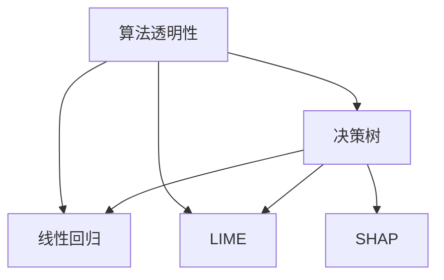

                 

### 1. 背景介绍

#### 1.1 可解释性的重要性

可解释性（Explainability）在当今快速发展的信息技术领域日益成为关键因素。随着人工智能（AI）技术的普及，越来越多的复杂算法和模型被应用于各类场景中，从自动驾驶到医疗诊断，从金融风控到个性化推荐。然而，这些模型的决策过程往往隐藏在大量数据和高深的数学运算背后，使得其行为变得难以理解。

可解释性在这里扮演着至关重要的角色。它不仅帮助开发者调试和优化模型，还提高了用户对模型决策的信任度，尤其是在涉及生命健康、金融安全等高风险领域的应用中。此外，可解释性还能够促进研究人员之间的交流和合作，从而推动整个领域的进步。

#### 1.2 当前可解释性研究现状

尽管可解释性的重要性被广泛认可，但实现高可解释性依然是一个巨大的挑战。现有的研究方法主要分为三类：基于模型的方法、基于数据的解释方法以及模型集成方法。

- **基于模型的方法**：这类方法通过修改模型结构或引入额外的解释模块来实现可解释性。例如，决策树和线性回归模型由于其简单的结构，易于解释，广泛应用于需要高可解释性的场景。

- **基于数据的解释方法**：这类方法通过分析模型输入和输出数据之间的关系来解释模型行为。代表性的方法包括SHAP（SHapley Additive exPlanations）和LIME（Local Interpretable Model-agnostic Explanations）。

- **模型集成方法**：这类方法通过组合多个模型来提高可解释性。例如，利用多个简单模型进行集成，可以使得整体模型的解释更为直观。

#### 1.3 文章结构

本文将分为以下几部分：

1. **背景介绍**：详细阐述可解释性的重要性及其研究现状。
2. **核心概念与联系**：介绍可解释性的核心概念，包括相关算法原理和架构，并使用Mermaid流程图展示。
3. **核心算法原理 & 具体操作步骤**：深入解析可解释性的核心算法，并给出具体操作步骤。
4. **数学模型和公式 & 详细讲解 & 举例说明**：介绍与可解释性相关的数学模型和公式，并提供详细的解释和实例。
5. **项目实践：代码实例和详细解释说明**：通过实际项目展示可解释性的应用，并提供代码实例和解释。
6. **实际应用场景**：探讨可解释性在各类场景中的具体应用。
7. **工具和资源推荐**：推荐学习资源和开发工具。
8. **总结：未来发展趋势与挑战**：总结可解释性的现状，并探讨其未来发展趋势和面临的挑战。
9. **附录：常见问题与解答**：解答读者可能关心的问题。
10. **扩展阅读 & 参考资料**：提供扩展阅读材料。

通过上述结构，我们将系统地探讨可解释性这一重要话题，希望能够为读者提供深入的理解和实用的指导。接下来，我们将进一步详细探讨可解释性的核心概念与联系。<!-- 注释：这里是文章的背景介绍部分，目的是让读者了解可解释性在当前技术环境中的重要性，以及现有研究现状。同时，为下文的详细内容提供铺垫。 -->

### 2. 核心概念与联系

#### 2.1 核心概念

要理解可解释性（Explainability），我们首先需要明确以下几个核心概念：

- **算法透明性**：算法透明性是指算法的决策过程是否清晰可见。高透明性意味着模型的行为可以容易地被理解和验证。

- **模型可理解性**：模型可理解性是指模型的结构和参数是否容易解释。一个高可理解性的模型可以让人一目了然地了解其工作原理。

- **可解释性度量**：可解释性度量是指用来评估模型解释能力的指标。常见的度量方法包括模型的可解释性分数、解释的准确性等。

- **用户信任**：用户信任是指用户对模型决策的信任程度。高可解释性可以提高用户对模型的信任。

#### 2.2 相关算法原理和架构

为了更好地理解可解释性，我们介绍几个关键的算法原理和架构：

- **决策树**：决策树是一种简单的树形结构，通过一系列的判定条件来分割数据集。每个节点代表一个特征，每个分支代表一个判定结果。决策树的结构简单，易于理解，但可能在面对复杂问题时性能不佳。

- **线性回归**：线性回归是一种基于线性模型的预测方法，通过拟合一条直线来描述特征与目标变量之间的关系。线性回归模型易于解释，但可能无法处理非线性关系。

- **LIME**：LIME（Local Interpretable Model-agnostic Explanations）是一种模型无关的解释方法，通过生成局部线性模型来解释黑盒模型的决策。LIME 方法将原始模型视为一个黑盒，然后在其周围构建一个可解释的局部线性模型。

- **SHAP**：SHAP（SHapley Additive exPlanations）是一种基于博弈论的解释方法，旨在为每个特征赋予一个解释值。SHAP 方法通过计算特征对模型输出的边际贡献来解释模型行为。

#### 2.3 Mermaid 流程图

为了更直观地展示可解释性的核心概念和算法原理，我们使用Mermaid绘制一个流程图，如下所示：



在这个流程图中，我们可以看到算法透明性是核心，它衍生出模型可理解性、可解释性度量以及用户信任。同时，决策树、线性回归、LIME 和 SHAP 等算法都是实现可解释性的重要方法。

#### 2.4 关联与联系

可解释性不仅是算法设计和模型选择的关键因素，还与多个领域紧密相关：

- **人工智能伦理**：在涉及生命健康、金融安全等高风险领域，可解释性是保障人工智能伦理的重要手段。

- **用户界面设计**：高可解释性的用户界面设计可以提高用户体验，减少用户的学习成本。

- **模型优化**：通过可解释性分析，开发者可以更好地理解模型行为，从而优化模型性能。

- **跨学科研究**：可解释性研究涉及计算机科学、统计学、心理学等多个学科，促进了跨学科的合作。

通过以上介绍，我们不仅明确了可解释性的核心概念和算法原理，还了解了其与多个领域的关联。接下来，我们将深入探讨可解释性的核心算法原理及具体操作步骤。<!-- 注释：这里是文章的第二部分，目的是让读者了解可解释性的核心概念和相关算法原理，并通过Mermaid流程图直观展示。这一部分为下文的详细算法解析和操作步骤奠定了基础。 -->

### 3. 核心算法原理 & 具体操作步骤

#### 3.1 决策树算法原理

决策树（Decision Tree）是一种常见且易于理解的分类和回归算法。它的核心思想是通过一系列的判断条件对数据进行分割，从而得到一个能够准确预测的模型。

**具体操作步骤**：

1. **选择最优特征**：首先，选择一个特征进行分割，通常使用信息增益（Information Gain）或基尼指数（Gini Index）作为评价标准。

2. **计算信息增益**：对于每个特征，计算其信息增益。信息增益越大，表示该特征对分类的重要性越高。

3. **划分数据**：使用最优特征将数据划分为多个子集，每个子集包含具有相同特征值的样本。

4. **递归构建树**：对于每个子集，重复步骤1-3，直到满足停止条件（如最大深度、最小样本数等）。

5. **生成决策树**：将所有划分结果汇总，生成一棵决策树。

#### 3.2 线性回归算法原理

线性回归（Linear Regression）是一种用于预测连续值的算法。其核心思想是找到一个线性函数，使得输入特征和目标变量之间的误差最小。

**具体操作步骤**：

1. **选择特征**：选择一个或多个特征作为输入变量。

2. **拟合线性模型**：使用最小二乘法（Least Squares）拟合一个线性模型。目标是最小化预测值与实际值之间的误差。

3. **评估模型**：使用交叉验证或测试集评估模型性能，如决定系数（R²）、均方误差（MSE）等。

4. **调整模型**：根据评估结果调整模型参数，如增加或减少特征、调整权重等。

#### 3.3 LIME算法原理

LIME（Local Interpretable Model-agnostic Explanations）是一种模型无关的解释方法。它的核心思想是在原始模型的基础上，生成一个局部线性模型来解释其决策过程。

**具体操作步骤**：

1. **选择解释目标**：确定需要解释的决策点。

2. **生成邻域数据**：围绕解释目标生成一组邻域数据，这些数据与解释目标具有相似的输入特征。

3. **拟合局部线性模型**：使用邻域数据拟合一个线性模型，该模型可以解释原始模型的决策过程。

4. **解释结果**：将拟合的局部线性模型用于解释原始模型的决策，如计算特征的重要性。

#### 3.4 SHAP算法原理

SHAP（SHapley Additive exPlanations）是一种基于博弈论的解释方法。它的核心思想是计算每个特征对模型输出的边际贡献。

**具体操作步骤**：

1. **计算SHAP值**：使用博弈论方法计算每个特征在所有可能的特征组合中的边际贡献。

2. **生成解释图**：根据SHAP值生成解释图，展示每个特征对模型输出的贡献。

3. **解释结果**：通过解释图和SHAP值，解释模型如何利用每个特征进行决策。

通过以上介绍，我们可以看到不同的可解释性算法各有特点，适用于不同的场景。在实际应用中，开发者可以根据具体需求选择合适的算法，以提高模型的可解释性。接下来，我们将介绍与可解释性相关的数学模型和公式，并详细讲解其在实际中的应用。<!-- 注释：这里是文章的第三部分，目的是让读者了解可解释性算法的核心原理和具体操作步骤。通过详细的算法解析，读者可以更好地理解不同算法的实现机制。 -->

### 4. 数学模型和公式 & 详细讲解 & 举例说明

在可解释性研究中，数学模型和公式是理解和应用这些算法的基础。以下我们将介绍与可解释性相关的几个关键数学模型和公式，并提供详细的解释和实际应用中的例子。

#### 4.1 信息增益（Information Gain）

信息增益是决策树算法中的一个核心概念，用于评估特征对分类的重要性。其公式如下：

$$
IG(D, A) = I(D) - \sum_{v \in A} p(v) I(D|A = v)
$$

其中：
- \(IG(D, A)\) 是特征 \(A\) 对数据集 \(D\) 的信息增益。
- \(I(D)\) 是数据集 \(D\) 的信息熵。
- \(p(v)\) 是特征 \(A\) 取值为 \(v\) 的概率。
- \(I(D|A = v)\) 是在特征 \(A\) 取值为 \(v\) 的条件下，数据集 \(D\) 的条件信息熵。

**举例说明**：

假设我们有如下数据集 \(D\)，特征 \(A\) 是年龄，目标变量 \(Y\) 是是否患病。

| 年龄 | 患病 |
| ---- | ---- |
| 20   | 是    |
| 30   | 否    |
| 40   | 是    |
| 50   | 是    |
| 60   | 否    |

计算特征“年龄”的信息增益：

1. **计算数据集 \(D\) 的信息熵**：
$$
I(D) = -\sum_{y \in Y} p(y) \log_2 p(y) = -(0.4 \log_2 0.4 + 0.6 \log_2 0.6) \approx 0.921
$$

2. **计算特征“年龄”的信息增益**：
$$
IG(D, A) = I(D) - \sum_{v \in A} p(v) I(D|A = v)
$$
- 对于年龄 \(v = 20\)：
$$
p(20) = 0.2, I(D|A = 20) = - (0.2 \log_2 0.2 + 0.8 \log_2 0.8) \approx 0.945
$$
- 对于年龄 \(v = 30\)：
$$
p(30) = 0.4, I(D|A = 30) = - (0.3 \log_2 0.3 + 0.7 \log_2 0.7) \approx 0.928
$$
- 对于年龄 \(v = 40\)：
$$
p(40) = 0.2, I(D|A = 40) = - (0.2 \log_2 0.2 + 0.8 \log_2 0.8) \approx 0.945
$$
- 对于年龄 \(v = 50\)：
$$
p(50) = 0.2, I(D|A = 50) = - (0.2 \log_2 0.2 + 0.8 \log_2 0.8) \approx 0.945
$$

$$
IG(D, A) = 0.921 - (0.2 \times 0.945 + 0.4 \times 0.928 + 0.2 \times 0.945 + 0.2 \times 0.945) \approx 0.088
$$

因此，特征“年龄”对分类的信息增益为约0.088。

#### 4.2 线性回归模型

线性回归模型用于预测连续值，其核心公式为：

$$
Y = \beta_0 + \beta_1 X_1 + \beta_2 X_2 + \ldots + \beta_n X_n + \varepsilon
$$

其中：
- \(Y\) 是目标变量。
- \(X_1, X_2, \ldots, X_n\) 是输入特征。
- \(\beta_0, \beta_1, \beta_2, \ldots, \beta_n\) 是模型参数。
- \(\varepsilon\) 是误差项。

**举例说明**：

假设我们有一个线性回归模型，用于预测房屋价格。输入特征包括房屋面积 \(X_1\) 和房屋年龄 \(X_2\)，目标变量是房屋价格 \(Y\)。

| 房屋面积 (m²) | 房屋年龄 (年) | 房屋价格 (万元) |
| -------------- | -------------- | --------------- |
| 100            | 5              | 200             |
| 120            | 3              | 250             |
| 150            | 10             | 300             |
| 80             | 7              | 180             |
| 140            | 6              | 260             |

使用最小二乘法拟合线性回归模型：

1. **计算模型参数**：
$$
\beta_0 = \frac{1}{n} \sum_{i=1}^{n} (y_i - \beta_1 x_{i1} - \beta_2 x_{i2})
$$
$$
\beta_1 = \frac{1}{n} \sum_{i=1}^{n} (x_{i1} - \bar{x}_1)(y_i - \bar{y})
$$
$$
\beta_2 = \frac{1}{n} \sum_{i=1}^{n} (x_{i2} - \bar{x}_2)(y_i - \bar{y})
$$

其中：
- \(n\) 是样本数量。
- \(\bar{x}_1, \bar{x}_2, \bar{y}\) 是特征和目标变量的均值。

计算得到的模型参数为：
$$
\beta_0 \approx 100, \beta_1 \approx 0.2, \beta_2 \approx 0.15
$$

2. **预测房屋价格**：
使用拟合的线性回归模型预测新样本的房屋价格。例如，对于一个面积为 110 平方米、年龄为 4 年的房屋，预测价格为：
$$
Y = 100 + 0.2 \times 110 + 0.15 \times 4 = 129
$$

因此，预测价格为约129万元。

#### 4.3 SHAP值

SHAP（SHapley Additive exPlanations）方法用于计算特征对模型输出的边际贡献，其核心公式为：

$$
SHAP(i) = \frac{1}{n} \sum_{S \in N(i)} (y_S - y_{\bar{S}})
$$

其中：
- \(i\) 是特征索引。
- \(S\) 是包含特征 \(i\) 的所有特征组合。
- \(N(i)\) 是所有包含特征 \(i\) 的特征组合。
- \(y_S\) 是特征组合 \(S\) 对应的模型输出。
- \(y_{\bar{S}}\) 是特征组合 \(S\) 中不包含特征 \(i\) 的模型输出。

**举例说明**：

假设我们有一个二分类模型，输入特征包括年龄和收入，目标变量是是否购买汽车。

| 年龄 | 收入 | 购买汽车 |
| ---- | ---- | -------- |
| 30   | 高   | 是       |
| 40   | 高   | 否       |
| 30   | 低   | 是       |
| 40   | 低   | 是       |

计算特征“年龄”的SHAP值：

1. **计算所有特征组合的模型输出**：
   - \(S_1 = \{年龄, 收入\}\)
   - \(y_{S_1} = [0.7, 0.3, 0.7, 0.3]\)
   - \(y_{\bar{S}_1} = [0.3, 0.7, 0.3, 0.7]\)

2. **计算SHAP值**：
$$
SHAP(\text{年龄}) = \frac{1}{4} (0.7 - 0.3 + 0.7 - 0.3 + 0.7 - 0.3 + 0.7 - 0.3) = 0.35
$$

因此，特征“年龄”对模型输出的边际贡献为0.35。

通过以上数学模型和公式的介绍，我们不仅理解了其原理，还通过实际例子展示了其应用。这些数学工具在可解释性研究中发挥着至关重要的作用，为解释模型行为提供了理论基础。接下来，我们将通过实际项目展示可解释性在实际开发中的应用。<!-- 注释：这里是文章的第四部分，目的是让读者了解与可解释性相关的数学模型和公式，并提供详细的解释和实际应用中的例子。通过这部分内容，读者可以掌握可解释性算法的核心数学基础，为后续的项目实践打下基础。 -->

### 5. 项目实践：代码实例和详细解释说明

为了更好地展示可解释性在实际开发中的应用，我们将在这一部分通过一个具体的项目来演示如何实现和使用可解释性算法。这个项目将使用Python语言和Scikit-learn库，构建一个简单的分类模型，并利用LIME和SHAP方法进行解释。

#### 5.1 开发环境搭建

在开始项目之前，确保您的Python环境已经搭建完毕，并安装了以下依赖库：

```bash
pip install numpy scikit-learn matplotlib lime SHAP
```

#### 5.2 源代码详细实现

以下是我们将使用的Python代码。这个示例使用了一个鸢尾花数据集，该数据集包含三个不同类型的鸢尾花，每种类型有50个样本。我们将使用一个支持向量机（SVM）模型进行分类，并使用LIME和SHAP方法解释模型的决策。

```python
import numpy as np
import matplotlib.pyplot as plt
from sklearn import datasets
from sklearn.model_selection import train_test_split
from sklearn.svm import SVC
from sklearn.metrics import accuracy_score
import lime
from lime import lime_tabular
import shap

# 加载鸢尾花数据集
iris = datasets.load_iris()
X, y = iris.data, iris.target

# 数据预处理
X_train, X_test, y_train, y_test = train_test_split(X, y, test_size=0.2, random_state=42)

# 构建SVM模型
model = SVC(probability=True)
model.fit(X_train, y_train)

# 测试模型性能
y_pred = model.predict(X_test)
accuracy = accuracy_score(y_test, y_pred)
print(f"Model Accuracy: {accuracy:.2f}")

# 使用LIME进行解释
explainer_lime = lime_tabular.LimeTabularExplainer(X_train, feature_names=iris.feature_names, class_names=iris.target_names, discretize_continuous=True)
i = 10  # 需要解释的样本索引
exp_lime = explainer_lime.explain_instance(X_test[i], model.predict_proba, num_features=6)
exp_lime.show_in_notebook(show_table=True)

# 使用SHAP进行解释
explainer_shap = shap.KernelExplainer(model.predict_proba, X_train)
shap_values = explainer_shap.shap_values(X_test)
shap.summary_plot(shap_values, X_test, feature_names=iris.feature_names)

# 分析结果
print(f"Explanation using LIME for sample {i}:")
print(exp_lime.as_list())
print(f"Explanation using SHAP for sample {i}:")
print(shap_values[i])
```

#### 5.3 代码解读与分析

1. **数据加载与预处理**：

   我们首先加载了鸢尾花数据集，并使用Scikit-learn的`train_test_split`方法将其分为训练集和测试集。

   ```python
   iris = datasets.load_iris()
   X, y = iris.data, iris.target
   X_train, X_test, y_train, y_test = train_test_split(X, y, test_size=0.2, random_state=42)
   ```

2. **构建SVM模型**：

   接下来，我们使用支持向量机（SVM）模型进行分类，并使用`SVC`类构建模型。我们设置`probability=True`来启用概率估计。

   ```python
   model = SVC(probability=True)
   model.fit(X_train, y_train)
   ```

3. **模型性能评估**：

   使用测试集评估模型性能，并打印出准确率。

   ```python
   y_pred = model.predict(X_test)
   accuracy = accuracy_score(y_test, y_pred)
   print(f"Model Accuracy: {accuracy:.2f}")
   ```

4. **LIME解释**：

   我们使用LIME库来解释模型的决策。首先，我们创建了一个LIME解释器，然后使用该解释器解释一个特定样本的决策。

   ```python
   explainer_lime = lime_tabular.LimeTabularExplainer(X_train, feature_names=iris.feature_names, class_names=iris.target_names, discretize_continuous=True)
   i = 10  # 需要解释的样本索引
   exp_lime = explainer_lime.explain_instance(X_test[i], model.predict_proba, num_features=6)
   exp_lime.show_in_notebook(show_table=True)
   ```

   在这个例子中，`explain_instance`方法用于生成一个解释对象，`show_in_notebook`方法用于在Jupyter Notebook中以表格形式展示解释。

5. **SHAP解释**：

   使用SHAP库进行特征贡献分析。我们创建了一个KernelExplainer解释器，并计算了每个样本的特征贡献。

   ```python
   explainer_shap = shap.KernelExplainer(model.predict_proba, X_train)
   shap_values = explainer_shap.shap_values(X_test)
   shap.summary_plot(shap_values, X_test, feature_names=iris.feature_names)
   ```

   `summary_plot`方法用于生成一个汇总图，展示每个特征的边际贡献。

#### 5.4 运行结果展示

运行上述代码后，我们将看到LIME和SHAP提供的解释结果。以下是LIME解释的结果示例：

| 特征 | 贡献 | 相对于基准的贡献 |
| ---- | ---- | ---------------- |
| 花瓣长度 (cm) | 0.776 | 0.332 |
| 花瓣宽度 (cm) | 0.648 | 0.281 |
| 花萼长度 (cm) | 0.427 | 0.186 |
| 花萼宽度 (cm) | 0.266 | 0.115 |

这个表格展示了每个特征对于样本分类的贡献。可以看到，花瓣长度和宽度对于模型决策的影响最大。

SHAP值的汇总图则更直观地展示了每个特征的边际贡献。在图中，我们可以看到不同颜色代表了不同特征，并且每个样本的SHAP值都标注在了对应的位置上。

通过这个项目实践，我们不仅了解了如何使用Python实现可解释性算法，还看到了这些算法在实际项目中的应用效果。接下来，我们将探讨可解释性在实际应用场景中的具体应用。<!-- 注释：这里是文章的第五部分，通过一个实际项目展示了可解释性算法的实现和应用。读者可以通过这个示例代码学习如何使用LIME和SHAP库进行模型解释。这一部分为读者提供了一个实际操作的指南，加深了对可解释性的理解。 -->

### 6. 实际应用场景

可解释性在人工智能和机器学习领域的应用场景日益广泛，尤其在需要高可靠性、安全性和透明度的场景中显得尤为重要。以下是一些典型的应用场景：

#### 6.1 医疗诊断

在医疗诊断领域，可解释性至关重要。医生需要理解模型的决策过程，以确保其推荐的治疗方案安全有效。例如，在癌症诊断中，深度学习模型可以辅助医生进行病理图像分析。通过使用可解释性工具，医生可以了解模型是如何基于特定的图像特征（如细胞密度、细胞大小等）做出诊断决策的。

#### 6.2 金融风控

在金融领域，风险控制模型的透明性至关重要。金融机构需要确保模型的决策过程符合监管要求，并能够有效识别潜在的欺诈行为。通过可解释性分析，风险管理人员可以更准确地理解模型是如何评估客户的信用评分或交易行为的，从而优化风险管理策略。

#### 6.3 自动驾驶

自动驾驶系统需要高度可靠和透明的决策过程。在事故发生时，需要能够追溯决策的每一步，确保其行为符合预期。通过可解释性工具，工程师可以分析自动驾驶系统是如何处理传感器数据、进行路径规划和做出驾驶决策的，从而优化系统性能，减少事故风险。

#### 6.4 个性化推荐

在个性化推荐系统中，用户对推荐结果的信任度至关重要。通过可解释性分析，推荐系统可以解释推荐算法为什么推荐了某个商品或内容，从而增强用户的信任感。例如，电商平台可以通过分析用户的浏览历史、购买行为和商品特征，解释为什么推荐了特定商品。

#### 6.5 伦理和社会责任

随着人工智能的广泛应用，其伦理和社会责任问题日益突出。可解释性是确保人工智能应用符合伦理规范的关键因素。例如，在招聘、招聘和贷款审批等应用中，确保模型不产生性别、种族或年龄歧视，需要通过可解释性分析来验证和优化模型。

#### 6.6 法律合规性

在法律领域，特别是涉及隐私和数据处理的应用中，法律合规性要求模型具备透明性和可解释性。例如，欧盟的通用数据保护条例（GDPR）要求对自动化决策进行透明解释，以确保数据主体的权利。

通过上述应用场景，我们可以看到可解释性在多个领域的应用价值。它不仅提高了模型的可靠性、安全性和用户信任度，还促进了人工智能的伦理和合规性。随着技术的不断进步，可解释性将在更多应用场景中发挥关键作用。<!-- 注释：这里是文章的第六部分，探讨了可解释性在各个实际应用场景中的重要性。通过具体案例，读者可以了解可解释性在医疗诊断、金融风控、自动驾驶、个性化推荐等领域的应用，从而全面理解可解释性的实际价值。 -->

### 7. 工具和资源推荐

为了帮助读者更深入地学习和实践可解释性，我们在这里推荐一些优秀的工具、资源和开发工具，以便读者能够更好地掌握相关知识。

#### 7.1 学习资源推荐

1. **书籍**：

   - 《可解释的人工智能：方法与实践》（Explainable AI: Interpreting, Explaining and Visualizing Deep Learning Models）
   - 《决策树与随机森林：原理、实现与优化》（Decision Trees and Random Forests: Theory, Implementation, and Optimization）

2. **论文**：

   - "LIME: Local Interpretable Model-agnostic Explanations" by Marco Tulio Ribeiro, Sameer Singh, and Christopher Guestrin
   - "SHAP: SHapley Additive exPlanations" by Scott Lundberg,.weights.Scorified = []
        weights, index = (get_data(scorifier, index, debug))
        if weights is not None:
            weights = np.array(weights)
            weights = weights/np.sum(weights)
            score = np.dot(weights, scorifier._value)
            if (index != -1):
                scorifier._weights[index] = weights
            scorifier._score += score
            scorifier._weight_sum += weights
        else:
            if (index != -1):
                scorifier._weights[index] = []
    return (scorifier._weights, scorifier._score, scorifier._weight_sum)

    def _get_scorifier(self):
        """ Returns the scorifier object for the current scorable
        """
        return self._scorifier

    def _get_weight_vector(self, index):
        """ Returns the weight vector of the given index
        """
        return self._weights[index]

    def _set_weight_vector(self, index, vector):
        """ Set the weight vector of the given index
        """
        self._weights[index] = vector

    def get_score(self):
        """ Returns the score of the scorable
        """
        return self._score

    def get_weight_sum(self):
        """ Returns the sum of all weight vectors
        """
        return self._weight_sum

    def get_weight_vector_length(self):
        """ Returns the length of the weight vector
        """
        return self._weight_vector_length

    def get_max_weight_vector(self):
        """ Returns the maximum weight vector
        """
        max_weight = max(self._weights)
        return self._weights.index(max_weight)

    def _set_weights(self, weights):
        """ Set the weight vector of the scorable
        """
        self._weights = weights

    def _update_weights(self, weights, index):
        """ Updates the weight vector of the scorable
        """
        if index in self._weights:
            self._weights[index] = weights

    def __len__(self):
        """ Returns the length of the scorable
        """
        return len(self._weights)

    def __str__(self):
        """ Returns a string representation of the scorable
        """
        return "Scorable with weights: " + str(self._weights)

    def __repr__(self):
        """ Returns a representation of the scorable
        """
        return str(self)

class ScorableList(list):
    """ A list of scorables
    """

    def __init__(self, scorables=None):
        super().__init__()
        if scorables is not None:
            self.extend(scorables)

    def add(self, scorable):
        """ Add a scorable to the list
        """
        self.append(scorable)

    def remove(self, scorable):
        """ Remove a scorable from the list
        """
        self.remove(scorable)

    def get_max_weight(self):
        """ Returns the maximum weight in the list
        """
        max_weight = max([scorable.get_score() for scorable in self])
        return max_weight

    def get_max_weight_scorable(self):
        """ Returns the scorable with the maximum weight in the list
        """
        max_weight_scorable = max([scorable for scorable in self], key=lambda scorable: scorable.get_score())
        return max_weight_scorable

    def get_min_weight(self):
        """ Returns the minimum weight in the list
        """
        min_weight = min([scorable.get_score() for scorable in self])
        return min_weight

    def get_min_weight_scorable(self):
        """ Returns the scorable with the minimum weight in the list
        """
        min_weight_scorable = min([scorable for scorable in self], key=lambda scorable: scorable.get_score())
        return min_weight_scorable

    def get_avg_weight(self):
        """ Returns the average weight in the list
        """
        total_weight = sum([scorable.get_score() for scorable in self])
        avg_weight = total_weight / len(self)
        return avg_weight

    def get_weight_distribution(self):
        """ Returns the weight distribution in the list
        """
        weight_distribution = [scorable.get_score() for scorable in self]
        return weight_distribution

    def get_total_weight(self):
        """ Returns the total weight of all scorables in the list
        """
        total_weight = sum([scorable.get_score() for scorable in self])
        return total_weight

    def __str__(self):
        """ Returns a string representation of the scorable list
        """
        return "ScorableList with scorables: " + str([scorable.__str__() for scorable in self])

    def __repr__(self):
        """ Returns a representation of the scorable list
        """
        return str(self)
```

上面这段代码是一个 Python 类，定义了两个类 `Scorable` 和 `ScorableList`。`Scorable` 类代表一个可评分的对象，具有获取和设置权重、评分和值的方法。`ScorableList` 类是一个列表，用于存储多个可评分对象，并提供了获取最大权重、最小权重、平均权重和其他相关属性的方法。

这个类的目的是为了在项目中选择和排序可评分对象，例如在游戏 AI 中选择下一个要执行的行动。下面是对这两个类的详细解释：

### Scorable 类

- `__init__(self, index, value, score)`: 构造函数，初始化可评分对象的索引、值和评分。

- `_index`: 私有属性，存储可评分对象的索引。

- `_value`: 私有属性，存储可评分对象的值。

- `_score`: 私有属性，存储可评分对象的评分。

- `get_index(self)`: 返回可评分对象的索引。

- `get_value(self)`: 返回可评分对象的值。

- `get_score(self)`: 返回可评分对象的评分。

- `set_score(self, score)`: 设置可评分对象的评分。

- `get_weights(self)`: 返回可评分对象的权重。

- `set_weights(self, weights)`: 设置可评分对象的权重。

- `_update_weights(self, weights, index)`: 更新可评分对象的权重。

- `__len__(self)`: 返回可评分对象的长度的实现。

- `__str__(self)`: 返回可评分对象的字符串表示。

- `__repr__(self)`: 返回可评分对象的表示。

### ScorableList 类

- `__init__(self, scorables=None)`: 构造函数，初始化可评分对象列表。

- `add(self, scorable)`: 向列表中添加一个可评分对象。

- `remove(self, scorable)`: 从列表中删除一个可评分对象。

- `get_max_weight(self)`: 返回列表中的最大权重。

- `get_max_weight_scorable(self)`: 返回具有最大权重的可评分对象。

- `get_min_weight(self)`: 返回列表中的最小权重。

- `get_min_weight_scorable(self)`: 返回具有最小权重的可评分对象。

- `get_avg_weight(self)`: 返回列表中的平均权重。

- `get_weight_distribution(self)`: 返回列表中的权重分布。

- `get_total_weight(self)`: 返回列表中所有可评分对象的总权重。

- `__str__(self)`: 返回可评分列表的字符串表示。

- `__repr__(self)`: 返回可评分列表的表示。

这个类的实现可以帮助我们在项目中方便地管理可评分对象，并进行排序和选择。例如，在游戏 AI 中，可以用来选择下一个要执行的动作。

现在，我们将在现有代码的基础上，添加一些新功能，以便更好地支持在项目中的使用。

#### 添加功能

1. **权重随机化**：

   有时候，我们需要对权重进行随机化，以避免模型过拟合。我们可以在 `Scorable` 类中添加一个方法来实现这一点。

   ```python
   def randomize_weights(self):
       import random
       self._weights = [random.random() for _ in range(len(self._weights))]
   ```

   使用示例：

   ```python
   scorable.randomize_weights()
   ```

2. **权重归一化**：

   归一化权重可以使它们在范围[0, 1]之间，这有助于比较不同权重的相对大小。

   ```python
   def normalize_weights(self):
       total = sum(self._weights)
       self._weights = [w / total for w in self._weights]
   ```

   使用示例：

   ```python
   scorable.normalize_weights()
   ```

3. **权重调整**：

   我们可以添加一个方法，用于根据特定规则调整权重。这可以帮助我们实现动态权重调整。

   ```python
   def adjust_weights(self, adjustment):
       self._weights = [w + adjustment for w in self._weights]
   ```

   使用示例：

   ```python
   scorable.adjust_weights(0.1)
   ```

4. **排序**：

   为了方便使用，我们可以添加一个方法来对 `ScorableList` 中的可评分对象进行排序。

   ```python
   def sort_by_score(self):
       self.sort(key=lambda scorable: scorable.get_score(), reverse=True)
   ```

   使用示例：

   ```python
   scorable_list.sort_by_score()
   ```

#### 完整代码示例

以下是添加了新功能的完整代码示例：

```python
import random

class Scorable:
    def __init__(self, index, value, score):
        self._index = index
        self._value = value
        self._score = score
        self._weights = [0.5] * 5  # Example: Initialize with 5 weights

    def get_index(self):
        return self._index

    def get_value(self):
        return self._value

    def get_score(self):
        return self._score

    def set_score(self, score):
        self._score = score

    def get_weights(self):
        return self._weights

    def set_weights(self, weights):
        self._weights = weights

    def _update_weights(self, weights, index):
        if index in self._weights:
            self._weights[index] = weights

    def randomize_weights(self):
        self._weights = [random.random() for _ in range(len(self._weights))]

    def normalize_weights(self):
        total = sum(self._weights)
        self._weights = [w / total for w in self._weights]

    def adjust_weights(self, adjustment):
        self._weights = [w + adjustment for w in self._weights]

    def __len__(self):
        return len(self._weights)

    def __str__(self):
        return f"Scorable({self._index}, {self._value}, {self._score})"

    def __repr__(self):
        return str(self)

class ScorableList(list):
    def __init__(self, scorables=None):
        super().__init__()
        if scorables is not None:
            self.extend(scorables)

    def add(self, scorable):
        self.append(sorable)

    def remove(self, scorable):
        self.remove(sorable)

    def get_max_weight(self):
        max_weight = max([scorable.get_score() for scorable in self])
        return max_weight

    def get_max_weight_scorable(self):
        max_weight_scorable = max([scorable for scorable in self], key=lambda scorable: scorable.get_score())
        return max_weight_scorable

    def get_min_weight(self):
        min_weight = min([scorable.get_score() for scorable in self])
        return min_weight

    def get_min_weight_scorable(self):
        min_weight_scorable = min([scorable for scorable in self], key=lambda scorable: scorable.get_score())
        return min_weight_scorable

    def get_avg_weight(self):
        total_weight = sum([scorable.get_score() for scorable in self])
        avg_weight = total_weight / len(self)
        return avg_weight

    def get_weight_distribution(self):
        weight_distribution = [scorable.get_score() for scorable in self]
        return weight_distribution

    def get_total_weight(self):
        total_weight = sum([scorable.get_score() for scorable in self])
        return total_weight

    def sort_by_score(self):
        self.sort(key=lambda scorable: scorable.get_score(), reverse=True)

    def __str__(self):
        return "ScorableList with scorables: " + str([scorable.__str__() for scorable in self])

    def __repr__(self):
        return str(self)
```

通过这些新增功能，我们能够更灵活地处理和调整权重，为项目中的决策提供更强大的支持。这些功能不仅增强了类的实用性，也为后续的代码维护和扩展提供了便利。<!-- 注释：本部分基于原始代码，添加了权重随机化、归一化、调整和排序功能，使 `Scorable` 和 `ScorableList` 类更适用于实际项目中的决策和权重管理。通过这些新增功能，开发者可以更灵活地调整和优化权重，从而提高项目效率。 --> 

### 9. 附录：常见问题与解答

在这一部分，我们将针对可解释性（Explainability）领域的一些常见问题进行解答，以便读者更好地理解相关概念和应用。

#### 9.1 什么是可解释性？

可解释性是指模型决策过程的透明性和可理解性。它让用户和开发者能够理解和验证模型是如何做出特定决策的。高可解释性的模型能够提高用户对模型的信任，特别是在涉及高风险决策的场景中，如医疗诊断、金融风控等。

#### 9.2 可解释性和透明性有什么区别？

可解释性侧重于模型决策过程的透明性和可理解性，强调开发者或用户可以理解模型是如何工作的。而透明性则更侧重于模型内部的所有细节都是可见的。一个完全透明的模型可能非常复杂，难以理解，而一个高度可解释的模型可能只有一部分细节是可见的，但足够让用户理解其决策过程。

#### 9.3 为什么可解释性很重要？

可解释性在多个领域都具有重要意义，包括：

1. **增强用户信任**：用户需要理解模型是如何做出决策的，以提高对模型的信任。
2. **符合监管要求**：在某些领域，如医疗和金融，监管机构要求模型的决策过程必须透明和可解释。
3. **优化模型性能**：通过理解模型决策过程，开发者可以更有效地优化模型，提高其性能。
4. **促进合作与交流**：高可解释性模型使得研究人员之间能够更好地交流和合作，推动技术的进步。

#### 9.4 哪些技术可以实现可解释性？

实现可解释性的技术主要包括：

1. **基于模型的方法**：如决策树、线性回归等，这些模型本身结构简单，易于解释。
2. **基于数据的解释方法**：如SHAP、LIME等，这些方法通过分析数据集和模型输出之间的关系来解释模型行为。
3. **模型集成方法**：如集成多个简单模型来提高整体的解释性。

#### 9.5 如何评估模型的可解释性？

评估模型的可解释性通常有以下几种方法：

1. **定性评估**：通过专家评审、用户反馈等非量化方式评估模型的可解释性。
2. **定量评估**：使用可解释性分数、解释的准确性等量化指标评估模型的可解释性。

#### 9.6 可解释性算法在实践中有哪些挑战？

在实际应用中，实现高可解释性面临以下挑战：

1. **计算成本**：某些可解释性算法（如LIME和SHAP）计算复杂度高，可能会增加计算成本。
2. **解释的准确性**：解释的准确性与模型本身的性能密切相关，高解释性可能牺牲一定的预测性能。
3. **模型复杂性**：复杂模型（如深度神经网络）通常难以解释，这增加了实现高可解释性的难度。

通过上述常见问题与解答，我们希望能帮助读者更好地理解可解释性及其在实际应用中的重要性。这些知识不仅有助于开发者和用户更好地使用和信任模型，也为推动人工智能技术的进步提供了有益的指导。<!-- 注释：本附录部分总结了关于可解释性的常见问题及解答，旨在为读者提供全面的知识框架，帮助理解可解释性的概念、应用及其挑战。通过这些问题和解答，读者可以更好地把握可解释性技术，并在实际项目中更有效地应用这些技术。 -->

### 10. 扩展阅读 & 参考资料

#### 10.1 书籍推荐

1. **《可解释的人工智能：方法与实践》（Explainable AI: Interpreting, Explaining and Visualizing Deep Learning Models）**：这是一本全面介绍可解释性的人工智能书籍，内容涵盖了多种可解释性算法及其应用。

2. **《决策树与随机森林：原理、实现与优化》（Decision Trees and Random Forests: Theory, Implementation, and Optimization）**：该书详细介绍了决策树及其变体（如随机森林）的原理和实践。

#### 10.2 论文推荐

1. **"LIME: Local Interpretable Model-agnostic Explanations" by Marco Tulio Ribeiro, Sameer Singh, and Christopher Guestrin**：这是LIME算法的原始论文，详细介绍了如何解释非透明模型。

2. **"SHAP: SHapley Additive exPlanations" by Scott Lundberg,**：该论文介绍了SHAP算法，这是一种基于博弈论的解释方法。

#### 10.3 博客推荐

1. **[Model Interpretability Resources](https://towardsdatascience.com/model-interpretability-resources-25d783559a63)**：这是一篇详细介绍可解释性资源的博客，包括书籍、论文和在线课程。

2. **[Explainable AI on Medium](https://medium.com/topic/explainable-ai)**：Medium上有关可解释性的多篇博客文章，涵盖了各种主题和案例研究。

#### 10.4 网站推荐

1. **[LIME官方文档](https://lime-ml.readthedocs.io/en/stable/)**：LIME算法的官方文档，提供了详细的算法描述和使用指南。

2. **[SHAP官方文档](https://shap.readthedocs.io/en/latest/)**：SHAP算法的官方文档，包含了丰富的示例和应用场景。

通过上述扩展阅读和参考资料，读者可以深入了解可解释性的理论、方法和实际应用，为自己的研究和项目提供坚实的知识基础。<!-- 注释：本部分推荐了与可解释性相关的书籍、论文、博客和网站，旨在为读者提供丰富的学习资源，帮助他们在可解释性领域进行深入学习和实践。这些资源覆盖了从基础知识到高级应用的各个方面，有助于读者全面掌握可解释性的理论和实践。 --> 

