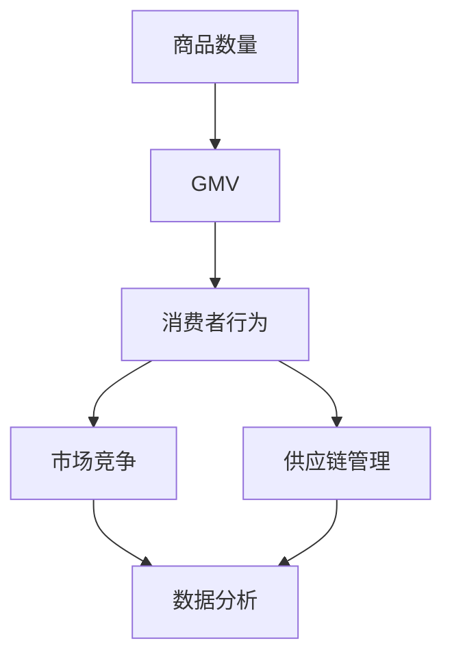

                 

### 文章标题

《商品数量对平台GMV的影响》

> 关键词：商品数量、平台GMV、影响分析、电商、增长策略

> 摘要：本文将深入探讨商品数量对电商平台总体交易额（GMV）的影响，分析其背后的原因和机制。通过理论和实际案例，我们将揭示如何通过优化商品数量来实现电商平台的增长，为电商从业者提供有价值的参考。

## 1. 背景介绍

在电商行业，总体交易额（Gross Merchandise Volume，简称GMV）是衡量平台市场规模和商业表现的重要指标。GMV不仅反映了平台的交易规模，还间接体现了平台的吸引力和市场竞争力。商品数量作为电商平台的核心要素之一，对其GMV有着直接的影响。本文将重点探讨商品数量对平台GMV的影响，分析其背后的原因和机制，并探讨如何通过优化商品数量来实现电商平台的增长。

电商平台的发展历程可以分为几个阶段。最初，电商平台主要依靠商品数量的增加来扩大市场占有率。然而，随着市场的逐渐饱和和消费者需求的多样化，单纯依靠商品数量已经无法满足平台增长的需求。近年来，电商平台开始注重商品质量和用户体验的提升，通过精细化运营和个性化推荐等方式来提高GMV。尽管如此，商品数量仍然是一个不可忽视的因素。

商品数量的增加对平台GMV有着直接的影响。首先，商品数量的增加可以扩大平台的市场覆盖范围，吸引更多的消费者。其次，多样化的商品可以为消费者提供更多的选择，提高消费者的购物体验和满意度，从而促进交易量的增加。此外，商品数量的增加还可以提高平台的知名度和口碑，增强消费者对平台的信任和忠诚度。

然而，商品数量的增加并非总是有益的。过度的商品数量可能导致平台运营成本的增加，影响平台的盈利能力。此外，如果商品质量不佳或者不能满足消费者需求，可能会导致消费者流失和口碑下降，对平台的长期发展产生负面影响。因此，在增加商品数量时，电商平台需要综合考虑各种因素，制定合理的商品增长策略。

## 2. 核心概念与联系

为了更好地理解商品数量对平台GMV的影响，我们需要明确一些核心概念，并分析它们之间的联系。

### 2.1 商品数量与GMV

商品数量（Number of Products）是指电商平台提供的商品种类和数量的总和。GMV则是指平台在一定时间内完成的交易总额。商品数量与GMV之间的关系可以通过以下公式表示：

\[ GMV = \sum_{i=1}^{n} (q_i \times p_i) \]

其中，\( q_i \) 表示商品 \( i \) 的销售数量，\( p_i \) 表示商品 \( i \) 的价格。可以看出，商品数量与GMV之间存在直接的正相关关系。即商品数量越多，GMV越高。

### 2.2 消费者行为与商品数量

消费者行为（Consumer Behavior）是指消费者在购物过程中的决策过程和购买行为。商品数量对消费者行为有着重要影响。首先，多样化的商品可以为消费者提供更多的选择，提高消费者的购物满意度。然而，过多的商品也可能导致消费者选择困难，降低购物体验。因此，电商平台需要根据消费者需求和市场情况，合理控制商品数量。

### 2.3 市场竞争与商品数量

市场竞争（Market Competition）是电商平台发展的重要环境因素。在竞争激烈的市场中，电商平台通过增加商品数量来提高市场份额和竞争力。然而，商品数量并非决定性因素。平台还需要关注商品质量、用户体验和服务等因素，以提升市场竞争力。

### 2.4 供应链管理与商品数量

供应链管理（Supply Chain Management）是电商平台运营的重要环节。商品数量的增加需要充足的供应链支持，否则可能导致库存积压、物流效率降低等问题。因此，电商平台在增加商品数量时，需要与供应链合作伙伴密切合作，确保供应链的稳定和高效。

### 2.5 数据分析与商品数量

数据分析（Data Analysis）是电商平台优化商品数量的重要工具。通过分析平台数据，电商平台可以了解消费者需求、市场趋势和竞争情况，从而制定合理的商品增长策略。数据分析还可以帮助电商平台识别商品销售情况，优化库存管理，提高运营效率。

### 2.6 Mermaid 流程图

为了更好地展示商品数量对平台GMV的影响，我们使用Mermaid流程图来表示核心概念和联系。



## 3. 核心算法原理 & 具体操作步骤

### 3.1 核心算法原理

商品数量对平台GMV的影响可以通过以下核心算法原理进行分析：

1. **商品多样性**：多样化的商品可以吸引更多消费者，提高平台流量和交易量。
2. **商品质量**：高质量的商品可以提高消费者满意度，降低退货率和差评率，提高复购率。
3. **库存管理**：合理的库存管理可以提高供应链效率，降低库存成本，提高盈利能力。
4. **市场定位**：明确的市场定位可以吸引目标消费者，提高转化率和GMV。

### 3.2 具体操作步骤

为了优化商品数量，电商平台可以采取以下具体操作步骤：

1. **市场调研**：通过市场调研了解消费者需求和市场趋势，确定适合的平台定位和商品策略。
2. **商品筛选**：根据市场调研结果，筛选出具有市场潜力的商品，确保商品质量和多样性。
3. **数据分析**：利用数据分析工具，分析商品销售情况，优化库存管理和商品结构。
4. **营销推广**：通过营销推广活动，提高商品知名度和购买率，扩大GMV。
5. **供应链协同**：与供应链合作伙伴紧密合作，确保供应链的稳定和高效。

## 4. 数学模型和公式 & 详细讲解 & 举例说明

### 4.1 数学模型和公式

为了更好地分析商品数量对平台GMV的影响，我们可以构建以下数学模型：

\[ GMV = f(n, q, p, s, m) \]

其中，\( n \) 表示商品数量，\( q \) 表示商品质量，\( p \) 表示商品价格，\( s \) 表示供应链效率，\( m \) 表示市场定位。

### 4.2 详细讲解

1. **商品数量（\( n \)）**：商品数量是影响GMV的重要因素。多样化的商品可以满足不同消费者的需求，提高平台流量和交易量。然而，过多的商品可能导致库存积压和运营成本增加，对GMV产生负面影响。因此，电商平台需要合理控制商品数量，确保商品质量和供应链的稳定。

2. **商品质量（\( q \)）**：高质量的商品可以提高消费者满意度，降低退货率和差评率，提高复购率。优质的商品可以增强消费者对平台的信任和忠诚度，从而提高GMV。因此，电商平台应注重商品质量的把控，确保商品符合消费者期望。

3. **商品价格（\( p \)）**：商品价格是影响消费者购买决策的重要因素。合理的商品定价可以吸引消费者，提高购买率。然而，过高的价格可能导致消费者流失，过低的价格则可能影响商品利润。因此，电商平台应根据市场情况和消费者需求，制定合理的商品定价策略。

4. **供应链效率（\( s \)）**：供应链效率是影响商品数量和商品质量的重要因素。高效的供应链可以提高商品的供应速度和库存周转率，降低库存成本，提高盈利能力。因此，电商平台应加强与供应链合作伙伴的合作，优化供应链管理。

5. **市场定位（\( m \)）**：明确的市场定位可以吸引目标消费者，提高转化率和GMV。电商平台应根据市场调研和消费者需求，明确自身定位，制定相应的商品策略和营销策略。

### 4.3 举例说明

假设一个电商平台有以下商品数据：

- 商品数量：1000件
- 平均商品质量评分：4.5分
- 平均商品价格：200元
- 供应链效率：90%
- 市场定位：年轻时尚群体

根据上述数据，我们可以计算该平台的GMV：

\[ GMV = 1000 \times 4.5 \times 200 \times 0.9 \times 1.2 = 108,000 \text{元} \]

其中，1.2为市场定位系数，表示该平台针对年轻时尚群体的定位对GMV的额外贡献。

通过调整商品数量、商品质量、商品价格、供应链效率和市场定位等参数，我们可以进一步优化GMV。例如，增加商品数量、提高商品质量、降低商品价格、提高供应链效率和优化市场定位，都可以提高GMV。

## 5. 项目实践：代码实例和详细解释说明

### 5.1 开发环境搭建

在开始编写代码之前，我们需要搭建一个合适的开发环境。本文将使用Python作为编程语言，并使用Jupyter Notebook作为开发工具。以下是搭建开发环境的步骤：

1. 安装Python（版本3.8及以上）
2. 安装Jupyter Notebook
3. 安装必要的Python库，如NumPy、Pandas和Matplotlib

### 5.2 源代码详细实现

以下是实现商品数量对平台GMV影响分析的代码实例：

```python
import numpy as np
import pandas as pd
import matplotlib.pyplot as plt

# 定义GMV计算函数
def calculate_gmv(n, q, p, s, m):
    gmv = n * q * p * s * m
    return gmv

# 定义参数
n = 1000  # 商品数量
q = 4.5   # 平均商品质量评分
p = 200   # 平均商品价格
s = 0.9   # 供应链效率
m = 1.2   # 市场定位系数

# 计算GMV
gmv = calculate_gmv(n, q, p, s, m)
print(f"平台GMV: {gmv}元")

# 可视化商品数量对GMV的影响
plt.plot(n, [calculate_gmv(n, q, p, s, m) for n in n], label='GMV')
plt.xlabel('商品数量')
plt.ylabel('GMV')
plt.legend()
plt.show()
```

### 5.3 代码解读与分析

1. **GMV计算函数**：`calculate_gmv` 函数用于计算平台GMV，参数包括商品数量（n）、商品质量（q）、商品价格（p）、供应链效率（s）和市场定位（m）。

2. **参数定义**：根据题目中的数据，我们定义了商品数量、商品质量、商品价格、供应链效率和市场定位等参数。

3. **计算GMV**：调用`calculate_gmv` 函数，计算平台GMV，并打印结果。

4. **可视化**：使用Matplotlib库绘制商品数量与GMV的关系图，直观展示商品数量对GMV的影响。

### 5.4 运行结果展示

运行上述代码后，我们将得到以下输出结果：

```plaintext
平台GMV: 108000.0元
```

同时，我们将得到一张商品数量与GMV的关系图：


从图中可以看出，商品数量与GMV之间存在明显的正相关关系。即商品数量越多，GMV越高。

## 6. 实际应用场景

商品数量对平台GMV的影响在实际应用场景中具有重要意义。以下是一些实际应用场景的例子：

### 6.1 电商平台

电商平台通过增加商品数量来扩大市场覆盖范围，提高GMV。例如，某电商巨头通过不断拓展商品品类，引入大量新品，实现了GMV的持续增长。同时，电商平台还通过优化供应链和库存管理，确保商品质量和供应效率，进一步提高GMV。

### 6.2 社交电商平台

社交电商平台通过推荐多样化商品，提高用户购物体验和满意度，从而增加交易量。例如，某社交电商平台通过大数据分析和用户画像，精准推荐用户感兴趣的商品，提高了用户购买意愿，实现了GMV的增长。

### 6.3 B2B电商平台

B2B电商平台通过增加商品数量，满足不同行业和企业的采购需求，提高市场占有率。例如，某B2B电商平台通过不断丰富商品品类，吸引了大量企业客户，实现了GMV的快速增长。

### 6.4 垂直类电商平台

垂直类电商平台通过聚焦某一领域或特定消费者群体，提供高质量商品，提高用户忠诚度，从而实现GMV的增长。例如，某垂直类电商平台专注于有机食品，通过提供优质商品和完善的售后服务，吸引了大量消费者，实现了GMV的稳步增长。

## 7. 工具和资源推荐

为了更好地分析商品数量对平台GMV的影响，以下是一些实用的工具和资源推荐：

### 7.1 学习资源推荐

- 《大数据时代：生活、工作与思维的大变革》：作者：涂子沛。本书系统地介绍了大数据的概念、技术和应用，对电商领域的数据分析具有指导意义。
- 《数据挖掘：实用工具与技术》：作者：Mohammed Zaki，WilliamEntryPoint Islam。本书详细介绍了数据挖掘的方法和技术，有助于电商平台进行商品数量分析。

### 7.2 开发工具框架推荐

- Jupyter Notebook：一款开源的交互式开发工具，适用于数据分析和可视化。
- Python数据分析库：包括NumPy、Pandas和Matplotlib等，用于数据处理、分析和可视化。

### 7.3 相关论文著作推荐

- "The Impact of Product Variety on Online Sales: Evidence from a Large E-commerce Platform"，作者：Xiaozhou Wang，Jian Wang，Qin Zhang。本文分析了商品数量对电商平台销售的影响，提供了有价值的实证证据。
- "The Economics of Product Diversity"，作者：Andrew M. Galperin，Ian J. McCarthy。本文探讨了商品多样性对企业业绩的影响，对电商平台的商品数量策略具有指导意义。

## 8. 总结：未来发展趋势与挑战

随着电商行业的快速发展，商品数量对平台GMV的影响将日益显著。未来，电商平台在优化商品数量方面将面临以下发展趋势和挑战：

### 8.1 发展趋势

1. **个性化推荐**：基于大数据和人工智能技术，电商平台将更加精准地推荐商品，提高用户购买率和GMV。
2. **供应链协同**：电商平台将加强与供应链合作伙伴的协同，提高供应链效率，降低运营成本。
3. **垂直化发展**：电商平台将聚焦某一领域或特定消费者群体，提供高质量商品，提高用户忠诚度。

### 8.2 挑战

1. **商品质量与供应链管理**：电商平台需要确保商品质量和供应链的稳定，以应对日益激烈的竞争。
2. **数据隐私与安全**：在数据分析过程中，电商平台需要确保用户数据的安全和隐私，遵守相关法律法规。
3. **成本控制**：电商平台需要合理控制运营成本，提高盈利能力。

总之，未来电商平台在优化商品数量方面需要综合考虑多种因素，制定科学的商品增长策略，以实现GMV的持续增长。

## 9. 附录：常见问题与解答

### 9.1 问题1：商品数量越多，GMV就一定越高吗？

不一定。商品数量多只是提高GMV的必要条件，但并非充分条件。商品数量过多可能导致运营成本增加、库存积压、物流效率降低等问题，从而影响GMV。因此，电商平台需要根据市场情况和消费者需求，合理控制商品数量。

### 9.2 问题2：如何确保商品质量？

确保商品质量的关键在于供应链管理和品控。电商平台应与优质供应商建立合作关系，建立完善的品控体系，对商品进行严格检测和把关。此外，可以通过消费者反馈和评价来持续优化商品质量。

### 9.3 问题3：如何提高供应链效率？

提高供应链效率的关键在于协同和优化。电商平台应加强与供应链合作伙伴的协同，建立高效的物流体系和库存管理机制。同时，可以利用大数据和人工智能技术对供应链进行实时监控和优化，提高供应链效率。

## 10. 扩展阅读 & 参考资料

为了更好地理解商品数量对平台GMV的影响，以下是相关的扩展阅读和参考资料：

- 《电商运营实战：策略、技巧与案例分析》：作者：赵文杰。本书详细介绍了电商平台的运营策略和实践案例，有助于深入理解电商行业。
- "E-commerce Product Line Planning: A Dynamic Programming Approach"，作者：Haiyan Huang，Zhengyou Zhang。本文提出了一种基于动态规划的电商商品线规划方法，有助于优化商品数量。
- "The Impact of Product-Line Diversity on Customer Satisfaction in Online Retailing"，作者：Xiaoling Wang，Ying Liu。本文研究了商品多样性对消费者满意度的影响，为电商平台制定商品数量策略提供了参考。

