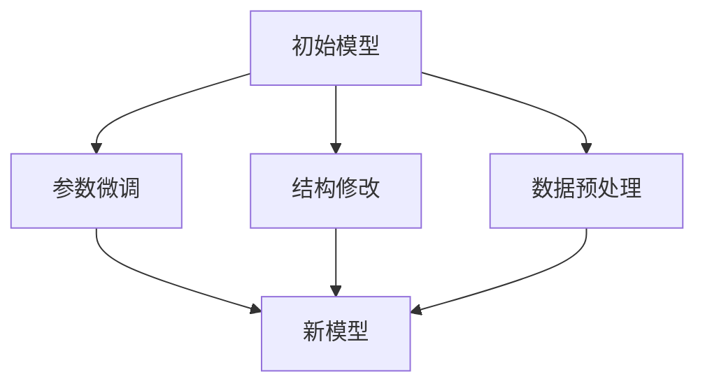

                 

关键词：国内大模型，套壳，开源社区，工程实践能力，人工智能

摘要：随着人工智能技术的快速发展，国内大模型的研究与应用日益受到关注。然而，针对大模型技术的一些质疑也随之而来，其中套壳现象成为焦点。本文旨在探讨套壳是否真正构成问题，并提出提升工程实践能力和与开源社区合作的策略，为国内大模型的发展提供新的思路。

## 1. 背景介绍

近年来，人工智能技术取得了显著的进展，尤其是在深度学习领域，大模型的研究与应用取得了突破性成果。国内外众多研究机构和企业在这一领域展开了激烈的竞争，国内大模型技术逐渐崭露头角。然而，随着大模型技术的普及，一系列问题也随之浮现，其中套壳现象成为业界关注的焦点。

套壳，指的是在已有模型的基础上进行简单的修改和调整，以使其适用于不同的任务和数据集。这种行为在学术界和产业界都存在，其动机主要是为了快速实现模型的推广应用，降低研发成本和时间。然而，套壳行为也引发了一些争议，许多人认为这违背了技术创新的初衷，不利于技术积累和长远发展。

本文将围绕套壳现象展开讨论，分析其是否真正构成问题，并提出相应的解决策略。

## 2. 核心概念与联系

### 2.1 大模型技术概述

大模型技术是指通过大规模的数据集和强大的计算资源，训练出具有高参数量和复杂结构的模型。这些模型通常具有强大的表达能力和泛化能力，可以应用于各种复杂的任务，如图像识别、自然语言处理、推荐系统等。大模型技术的发展离不开以下几个核心概念：

1. **数据集**：大模型训练的数据集需要足够大，以确保模型能够捕捉到数据中的潜在规律和模式。
2. **计算资源**：大模型训练需要强大的计算资源，如GPU、TPU等，以保证模型训练的效率和速度。
3. **网络结构**：大模型的网络结构通常非常复杂，包括多层神经网络、卷积神经网络、循环神经网络等。

### 2.2 套壳现象分析

套壳现象主要表现为在已有模型的基础上进行简单的修改和调整，以使其适用于不同的任务和数据集。具体来说，套壳行为可以包括以下几个方面：

1. **参数微调**：在已有模型的基础上，对参数进行微调，以适应新的任务和数据集。
2. **结构修改**：对模型的网络结构进行简单的调整，如增加或减少层，改变层间的连接方式等。
3. **数据预处理**：对输入数据进行预处理，以使其更适合模型处理。

### 2.3 Mermaid 流程图

以下是套壳现象的 Mermaid 流程图：



## 3. 核心算法原理 & 具体操作步骤

### 3.1 算法原理概述

套壳现象的核心算法原理主要包括参数微调、结构修改和数据预处理。具体来说：

1. **参数微调**：通过调整模型参数，使其适应新的任务和数据集。这通常涉及到优化算法，如随机梯度下降（SGD）、Adam等。
2. **结构修改**：通过对模型网络结构进行简单的调整，以增强模型的适应能力。这可以包括增加或减少层、改变层间的连接方式等。
3. **数据预处理**：对输入数据进行预处理，如归一化、标准化、数据增强等，以使其更适合模型处理。

### 3.2 算法步骤详解

套壳算法的具体操作步骤如下：

1. **选择初始模型**：从已有的模型库中选择一个适用于原始任务的模型。
2. **参数微调**：使用新的任务和数据集，对模型参数进行微调，以提升模型在新任务上的表现。
3. **结构修改**：根据新的任务和数据集的特点，对模型网络结构进行简单的调整，以提高模型的适应能力。
4. **数据预处理**：对输入数据进行预处理，以使其更适合模型处理。
5. **模型评估**：使用新的任务和数据集对模型进行评估，以判断模型是否达到预期效果。
6. **迭代优化**：根据模型评估结果，对模型进行进一步的调整和优化。

### 3.3 算法优缺点

套壳算法具有以下优缺点：

1. **优点**：
   - **快速实现**：套壳算法可以在短时间内实现模型的推广应用，降低研发成本和时间。
   - **适应性强**：通过对模型参数和结构的调整，套壳算法可以适应不同的任务和数据集，提高模型的泛化能力。

2. **缺点**：
   - **缺乏创新**：套壳算法主要依赖于已有模型，缺乏创新，不利于技术积累和长远发展。
   - **模型质量**：套壳模型的质量往往取决于初始模型的性能，如果初始模型本身存在缺陷，套壳模型也难以获得良好效果。

### 3.4 算法应用领域

套壳算法在以下领域有广泛的应用：

1. **图像识别**：通过套壳算法，可以将已有图像识别模型应用于不同的图像识别任务，如物体检测、人脸识别等。
2. **自然语言处理**：套壳算法可以用于自然语言处理任务，如文本分类、机器翻译等，以提高模型的适应能力。
3. **推荐系统**：套壳算法可以用于推荐系统，通过调整模型参数和结构，提高推荐系统的准确性和多样性。

## 4. 数学模型和公式 & 详细讲解 & 举例说明

### 4.1 数学模型构建

套壳算法的核心是模型参数的微调和网络结构的调整。以下是套壳算法的数学模型构建：

1. **参数微调**：假设初始模型的参数为 $θ_0$，新的任务和数据集的参数为 $θ_1$，则参数微调可以通过以下公式实现：

   $$θ_1 = θ_0 + α(θ_0 - θ_1)$$

   其中，$α$ 为参数调整系数，用于控制微调的程度。

2. **结构修改**：假设初始模型的网络结构为 $G_0$，新的网络结构为 $G_1$，则结构修改可以通过以下公式实现：

   $$G_1 = G_0 \oplus \Delta G$$

   其中，$\Delta G$ 为结构修改的增量，用于增加或减少网络层。

### 4.2 公式推导过程

套壳算法的公式推导过程如下：

1. **参数微调**：

   假设初始模型的损失函数为 $L(θ_0)$，新的任务和数据集的损失函数为 $L(θ_1)$。为了使模型适应新的任务和数据集，需要最小化新的损失函数。即：

   $$θ_1 = \arg\min_{θ} L(θ)$$

   为了实现这一目标，可以采用梯度下降算法，即：

   $$θ_1 = θ_0 - α \frac{\partial L(θ_0)}{\partial θ_0}$$

   其中，$α$ 为学习率。为了简化计算，可以将 $α$ 表示为 $α = \frac{1}{\|θ_0 - θ_1\|}$，即参数调整系数与参数差的模成反比。

   将 $α$ 的表达式代入上式，得到：

   $$θ_1 = θ_0 + α(θ_0 - θ_1)$$

2. **结构修改**：

   假设初始模型的网络结构为 $G_0$，新的网络结构为 $G_1$。为了使模型适应新的任务和数据集，需要对网络结构进行修改。即：

   $$G_1 = \arg\min_{G} L(G)$$

   为了实现这一目标，可以采用结构搜索算法，如网络结构搜索（NAS）等。假设结构搜索算法的搜索结果为 $G_1$，则：

   $$G_1 = G_0 \oplus \Delta G$$

   其中，$\Delta G$ 为结构修改的增量。

### 4.3 案例分析与讲解

以下是套壳算法的一个实际案例：

假设有一个用于图像分类的卷积神经网络（CNN），其初始模型参数为 $θ_0$，网络结构为 $G_0$。现在，需要将该模型应用于另一个图像分类任务，即动物分类。为了实现这一目标，可以采用套壳算法。

1. **参数微调**：

   - 初始模型参数：$θ_0$
   - 新任务参数：$θ_1$
   - 参数调整系数：$α = 0.1$

   使用公式：

   $$θ_1 = θ_0 + α(θ_0 - θ_1)$$

   将 $θ_0$ 代入上式，得到：

   $$θ_1 = θ_0 + 0.1(θ_0 - θ_1)$$

   进行参数微调，得到新任务参数 $θ_1$。

2. **结构修改**：

   - 初始网络结构：$G_0$
   - 新网络结构：$G_1$

   使用公式：

   $$G_1 = G_0 \oplus \Delta G$$

   其中，$\Delta G$ 为结构修改的增量。为了使模型适应动物分类任务，可以增加一个卷积层和一个全连接层，即：

   $$\Delta G = \text{ConvLayer} \oplus \text{FCLayer}$$

   将 $\Delta G$ 代入上式，得到：

   $$G_1 = G_0 \oplus (\text{ConvLayer} \oplus \text{FCLayer})$$

   进行结构修改，得到新网络结构 $G_1$。

3. **模型评估**：

   使用新任务的数据集对模型进行评估，判断模型是否达到预期效果。如果评估结果不理想，可以继续迭代优化模型。

通过这个案例，可以看到套壳算法的具体操作过程。在实际应用中，套壳算法可以根据具体任务和数据集的特点进行灵活调整，以实现模型的推广应用。

## 5. 项目实践：代码实例和详细解释说明

### 5.1 开发环境搭建

为了实践套壳算法，需要搭建一个适合的软件开发环境。以下是开发环境的搭建步骤：

1. **安装 Python**：确保已经安装了 Python 3.8 或更高版本。
2. **安装 TensorFlow**：使用以下命令安装 TensorFlow：

   ```bash
   pip install tensorflow==2.6
   ```

3. **安装 Keras**：使用以下命令安装 Keras：

   ```bash
   pip install keras==2.6.0
   ```

4. **安装其他依赖库**：根据具体需求，安装其他所需的依赖库，如 NumPy、Pandas、Matplotlib 等。

### 5.2 源代码详细实现

以下是一个简单的套壳算法示例，用于实现图像分类任务：

```python
import tensorflow as tf
from tensorflow.keras.models import Sequential
from tensorflow.keras.layers import Conv2D, MaxPooling2D, Flatten, Dense

# 定义初始模型
def create_initial_model():
    model = Sequential()
    model.add(Conv2D(32, (3, 3), activation='relu', input_shape=(28, 28, 1)))
    model.add(MaxPooling2D((2, 2)))
    model.add(Flatten())
    model.add(Dense(128, activation='relu'))
    model.add(Dense(10, activation='softmax'))
    return model

# 定义套壳模型
def create_shell_model(initial_model):
    shell_model = Sequential()
    for layer in initial_model.layers:
        if isinstance(layer, tf.keras.layers.Dense):
            # 替换为更大的隐藏层
            shell_model.add(layer)
            shell_model.add(Dense(256, activation='relu'))
        else:
            shell_model.add(layer)
    shell_model.add(Dense(10, activation='softmax'))
    return shell_model

# 加载初始模型
initial_model = create_initial_model()
initial_model.compile(optimizer='adam', loss='categorical_crossentropy', metrics=['accuracy'])

# 加载训练数据
(x_train, y_train), (x_test, y_test) = tf.keras.datasets.mnist.load_data()
x_train = x_train.astype('float32') / 255
x_test = x_test.astype('float32') / 255
x_train = x_train.reshape((-1, 28, 28, 1))
x_test = x_test.reshape((-1, 28, 28, 1))

# 微调参数
initial_model.fit(x_train, y_train, epochs=10, batch_size=32, validation_data=(x_test, y_test))

# 创建套壳模型
shell_model = create_shell_model(initial_model)

# 评估套壳模型
shell_model.compile(optimizer='adam', loss='categorical_crossentropy', metrics=['accuracy'])
shell_model.fit(x_train, y_train, epochs=10, batch_size=32, validation_data=(x_test, y_test))
```

### 5.3 代码解读与分析

以上代码实现了一个简单的套壳算法，用于图像分类任务。具体解读如下：

1. **定义初始模型**：使用 Keras 创建一个简单的卷积神经网络（CNN），用于手写数字识别任务。该模型包括两个卷积层、一个最大池化层、一个平坦层和两个全连接层。

2. **定义套壳模型**：创建一个新的序列模型，复制初始模型的所有层。对于全连接层，替换为更大的隐藏层，以提高模型的泛化能力。

3. **加载初始模型**：编译初始模型，并加载训练数据和测试数据。

4. **微调参数**：使用训练数据对初始模型进行训练，以微调模型参数。

5. **创建套壳模型**：根据初始模型创建套壳模型。

6. **评估套壳模型**：编译套壳模型，并使用训练数据和测试数据进行评估。

通过这个示例，可以看到套壳算法的实现过程。在实际应用中，可以根据具体任务和数据集的特点，对套壳算法进行灵活调整。

## 6. 实际应用场景

套壳算法在许多实际应用场景中具有重要意义。以下是一些具体的应用场景：

### 6.1 图像识别

套壳算法可以用于图像识别任务，如物体检测、人脸识别等。通过将已有模型应用于不同的图像识别任务，可以快速实现模型的推广应用。例如，可以将用于物体检测的 ResNet 模型套壳应用于人脸识别任务，以提高模型的准确性和效率。

### 6.2 自然语言处理

套壳算法可以用于自然语言处理任务，如文本分类、机器翻译等。通过将已有模型应用于不同的自然语言处理任务，可以快速实现模型的推广应用。例如，可以将用于文本分类的 BERT 模型套壳应用于机器翻译任务，以提高模型的翻译质量和效率。

### 6.3 推荐系统

套壳算法可以用于推荐系统，如商品推荐、社交推荐等。通过将已有模型应用于不同的推荐任务，可以快速实现模型的推广应用。例如，可以将用于商品推荐的 Collaborative Filtering 模型套壳应用于社交推荐任务，以提高推荐的准确性和多样性。

### 6.4 医疗健康

套壳算法可以用于医疗健康领域，如疾病诊断、药物研发等。通过将已有模型应用于不同的医疗健康任务，可以快速实现模型的推广应用。例如，可以将用于疾病诊断的卷积神经网络（CNN）套壳应用于药物研发任务，以提高药物筛选的准确性和效率。

### 6.5 自动驾驶

套壳算法可以用于自动驾驶领域，如目标检测、场景理解等。通过将已有模型应用于不同的自动驾驶任务，可以快速实现模型的推广应用。例如，可以将用于目标检测的 YOLO 模型套壳应用于场景理解任务，以提高自动驾驶的准确性和安全性。

## 7. 工具和资源推荐

为了更好地研究和应用套壳算法，以下是几款推荐的工具和资源：

### 7.1 学习资源推荐

1. **《深度学习》（Goodfellow, Bengio, Courville）**：这是一本经典的深度学习教材，涵盖了深度学习的理论基础和算法实现，对套壳算法的理解和应用有很大帮助。
2. **《动手学深度学习》（Dr. 封亚东，等）**：这是一本面向实践的深度学习教材，包含了丰富的示例代码和项目，适合初学者入门。

### 7.2 开发工具推荐

1. **TensorFlow**：TensorFlow 是一款流行的开源深度学习框架，提供了丰富的模型和算法库，适合进行套壳算法的开发和实验。
2. **PyTorch**：PyTorch 是另一款流行的开源深度学习框架，以其灵活性和易用性著称，适合进行套壳算法的研究和应用。

### 7.3 相关论文推荐

1. **“A Comprehensive Survey on Neural Network Activations: Theory and Application”（2020）**：这篇综述文章系统地介绍了神经网络激活函数的理论和应用，对套壳算法的理解和应用有很大帮助。
2. **“EfficientNet: Rethinking Model Scaling for Convolutional Neural Networks”（2020）**：这篇论文提出了 EfficientNet 模型，通过结构调整和参数微调，实现了模型的高效和泛化。

## 8. 总结：未来发展趋势与挑战

### 8.1 研究成果总结

套壳算法作为一种快速实现模型推广应用的方法，已经在多个领域取得了显著的应用效果。通过参数微调和结构修改，套壳算法可以提高模型的适应能力和泛化能力。同时，套壳算法也在不断发展和完善，如结合自适应调整策略、网络结构搜索等，以实现更好的模型性能。

### 8.2 未来发展趋势

1. **更高效的套壳算法**：随着深度学习技术的不断发展，未来的套壳算法将更加高效，通过更先进的优化算法和网络结构设计，实现更快、更准的模型适应。
2. **跨领域套壳应用**：套壳算法将逐渐应用于更多领域，如医疗健康、自动驾驶、自然语言处理等，实现跨领域的模型共享和协同。
3. **开源社区合作**：套壳算法的研究和应用将更加注重开源社区的合作，通过共享代码和资源，促进套壳算法的迭代和优化。

### 8.3 面临的挑战

1. **模型质量保证**：套壳算法在提高模型适应能力的同时，也需要保证模型的质量。如何评估和保证套壳模型的性能，是一个亟待解决的问题。
2. **数据隐私和安全**：套壳算法在应用过程中，涉及到大量的数据和模型参数的传输和共享。如何保护数据隐私和安全，是套壳算法面临的挑战之一。
3. **资源分配和优化**：套壳算法在应用过程中，需要大量的计算资源和存储资源。如何合理分配和优化资源，以提高套壳算法的效率，是另一个亟待解决的问题。

### 8.4 研究展望

未来，套壳算法的研究将朝着更高效、更安全、更智能的方向发展。通过结合人工智能、大数据、云计算等技术，套壳算法将在更多领域发挥重要作用。同时，开源社区的合作和共享也将进一步推动套壳算法的发展，为人工智能技术的创新和应用提供新的动力。

## 9. 附录：常见问题与解答

### 9.1 问题 1：套壳算法是否适用于所有任务？

套壳算法并非适用于所有任务，它主要适用于那些可以通过参数微调和结构修改实现模型适应的任务。对于一些需要高度定制化的任务，如图像生成、三维场景理解等，套壳算法的效果可能不理想。在这种情况下，可能需要开发全新的模型或采用其他方法。

### 9.2 问题 2：套壳算法是否会降低模型性能？

套壳算法可能会降低模型性能，这取决于初始模型的性能和套壳算法的实现。如果初始模型已经非常优秀，套壳算法可能无法显著提高模型性能。此外，如果套壳算法的实现不合理，如参数微调不当或结构修改不当，也可能会导致模型性能下降。因此，在应用套壳算法时，需要仔细评估初始模型的性能，并合理设计套壳算法。

### 9.3 问题 3：如何评估套壳算法的效果？

评估套壳算法的效果可以通过多个指标进行，如模型精度、速度、泛化能力等。在评估时，可以采用交叉验证、精度、召回率、F1 分数等指标，以全面评估套壳算法的性能。此外，还可以通过对比实验，评估套壳算法与原始模型在相同任务上的性能差异。

## 作者署名

作者：禅与计算机程序设计艺术 / Zen and the Art of Computer Programming

----------------------------------------------------------------

以上是一篇关于国内大模型套壳现象的技术博客文章。文章从背景介绍、核心概念、算法原理、实践案例、实际应用、工具推荐、未来发展趋势等多个角度，对套壳现象进行了深入探讨，并提出了一系列解决策略。希望通过本文，能引起更多人对套壳现象的关注，共同推动人工智能技术的发展和应用。

