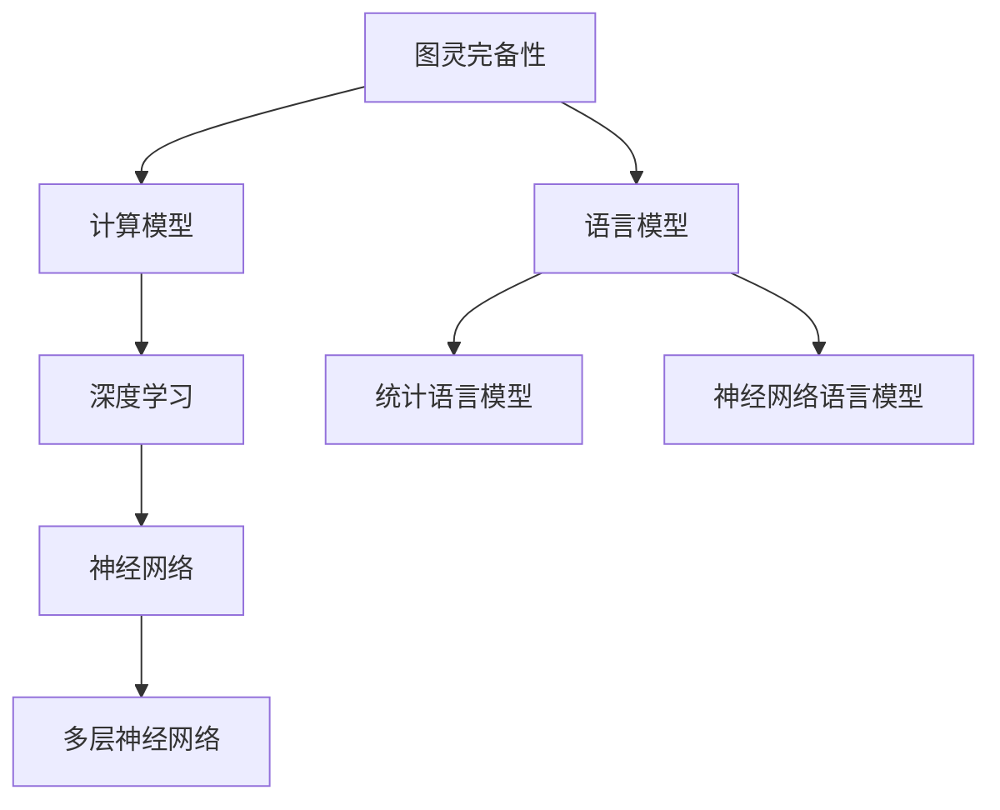

                 

### 文章标题

《图灵完备性：LLM 成为通用人工智能关键》

关键词：图灵完备性、通用人工智能、深度学习、语言模型、可计算理论

摘要：本文深入探讨了图灵完备性在通用人工智能（AGI）中的重要性，分析了图灵完备性如何成为大规模语言模型（LLM）实现通用人工智能的关键因素。文章首先回顾了图灵机的概念及其在可计算理论中的地位，接着介绍了深度学习和语言模型的基本原理，然后通过实例展示了图灵完备性如何使得LLM具备通用计算能力。文章最后探讨了LLM在通用人工智能领域的应用前景和面临的挑战，并提出了未来研究的方向。

### 1. 背景介绍

**图灵完备性**是计算机科学中的一个核心概念，源于英国数学家艾伦·图灵（Alan Turing）在20世纪30年代提出的图灵机理论。图灵机是一种抽象的计算模型，能够模拟任何物理计算过程。图灵完备性意味着一个计算模型能够执行所有可计算的问题，即它能够模拟任何其他图灵机。

在通用人工智能（Artificial General Intelligence，AGI）的研究中，图灵完备性具有重要的地位。通用人工智能的目标是实现与人类智能相似甚至超越的智能，能够解决各种复杂的问题，具备自我学习和自我进化的能力。为了实现这一目标，AGI系统需要具备广泛的计算能力，能够处理不同类型的问题。而图灵完备性正是衡量一个计算模型是否具备这种广泛计算能力的关键标准。

**深度学习**是近年来人工智能领域的重要进展，它通过多层神经网络对大量数据进行训练，从而实现复杂的特征提取和模式识别。深度学习在图像识别、语音识别、自然语言处理等领域取得了显著的成果。然而，传统的深度学习模型通常只能解决特定领域的问题，缺乏通用性。

**语言模型**是深度学习的一种应用，它通过学习大规模文本数据，生成符合自然语言统计规律的文本。语言模型在自然语言处理中起着关键作用，如机器翻译、文本摘要、问答系统等。然而，早期的语言模型大多只能处理特定类型的语言任务，难以实现真正的通用性。

随着深度学习的发展，大规模语言模型（Large-scale Language Model，LLM）逐渐成为研究的热点。LLM通过学习海量文本数据，能够生成高质量的自然语言文本，并具备跨领域的通用能力。例如，GPT-3等LLM可以生成文章、代码、音乐等多种类型的文本，表现出极强的通用性。然而，LLM如何实现图灵完备性，以及这一特性在通用人工智能中的意义，仍然是学术界和工业界关注的重要问题。

本文旨在深入探讨图灵完备性在通用人工智能中的重要性，分析LLM如何通过图灵完备性实现广泛的计算能力，并提出未来研究的方向。

### 2. 核心概念与联系

#### 2.1 图灵完备性

图灵完备性（Turing completeness）是一个计算模型是否能够执行所有可计算问题的性质。一个计算模型如果能够模拟图灵机，则被认为是图灵完备的。图灵机由一个无限长的存储带、一个读写头和一个状态寄存器组成。读写头可以在存储带上读取和写入信息，并按照预设的规则改变状态。

图灵机的核心思想是状态转移函数（state transition function），它定义了读写头在读取当前状态和输入符号后，如何更新状态和移动读写头的规则。通过一系列的状态转移，图灵机能够实现复杂的计算过程。

图灵完备性的定义如下：

一个计算模型M是图灵完备的，如果它能够模拟任何其他图灵机。也就是说，对于任意的可计算函数f，存在一个图灵机M'，能够计算f。

图灵完备性是可计算理论中的重要概念，它为计算机科学提供了基础。图灵完备性使得计算机能够处理广泛的计算问题，从而推动了计算机科学的快速发展。

#### 2.2 深度学习

深度学习是一种基于多层神经网络的学习方法，通过训练大量数据来学习复杂的函数关系。深度学习在图像识别、语音识别、自然语言处理等领域取得了显著的成果。深度学习的基本原理如下：

1. **神经网络**：神经网络是由多个神经元（节点）组成的计算模型，每个神经元通过权重（weight）与输入节点相连。神经网络通过训练学习输入和输出之间的映射关系。

2. **多层神经网络**：深度学习中的神经网络通常包含多个隐藏层，每个隐藏层对输入数据进行特征提取和变换。通过逐层叠加，神经网络能够学习到更复杂的函数关系。

3. **反向传播算法**：深度学习使用反向传播算法来训练神经网络。反向传播算法通过计算输出误差，反向传播到每一层，更新每个神经元的权重，从而优化网络参数。

深度学习的优势在于其能够自动从数据中学习特征，并且随着层数的增加，神经网络能够学习到更复杂的特征。然而，传统的深度学习模型通常只能解决特定领域的问题，缺乏通用性。

#### 2.3 语言模型

语言模型是一种基于统计方法来预测文本概率的模型，它在自然语言处理中起着关键作用。语言模型的基本原理如下：

1. **统计语言模型**：统计语言模型通过学习大量文本数据，统计单词、短语和句子出现的频率，从而预测文本的生成概率。统计语言模型通常使用n-gram模型，其中n表示相邻单词的数量。

2. **神经网络语言模型**：神经网络语言模型通过多层神经网络来学习文本的概率分布。神经网络语言模型能够捕捉到更复杂的语言特征，提高文本生成的质量。

3. **生成式模型与判别式模型**：生成式模型通过生成文本的概率分布来预测文本，而判别式模型通过学习文本和标签之间的映射关系来预测标签。

语言模型在自然语言处理中具有广泛的应用，如机器翻译、文本摘要、问答系统等。早期的语言模型主要基于统计方法，而现代语言模型则结合了深度学习技术，取得了显著的进展。

#### 2.4 图灵完备性与深度学习、语言模型的关系

图灵完备性与深度学习、语言模型的关系如下：

1. **深度学习与图灵完备性**：深度学习作为一种计算模型，其核心是多层神经网络。多层神经网络能够模拟图灵机的计算能力，因此深度学习模型在理论上可以被认为是图灵完备的。这意味着深度学习模型能够执行所有可计算的问题。

2. **语言模型与图灵完备性**：语言模型作为一种预测文本概率的模型，其本质是通过学习大量文本数据，生成符合语言统计规律的文本。语言模型通常使用神经网络来学习文本的概率分布，因此也具备图灵完备性。语言模型能够生成各种类型的文本，表现出极强的通用性。

3. **图灵完备性与通用人工智能**：通用人工智能的目标是实现与人类智能相似甚至超越的智能，能够解决各种复杂的问题。图灵完备性为通用人工智能提供了理论基础，因为只有具备图灵完备性的计算模型，才能处理广泛的计算问题。因此，图灵完备性是通用人工智能实现的关键因素之一。

#### 2.5 Mermaid 流程图

以下是一个简单的 Mermaid 流程图，展示了图灵完备性、深度学习和语言模型之间的关系：



### 3. 核心算法原理 & 具体操作步骤

#### 3.1 图灵机的算法原理

图灵机是一种抽象的计算模型，其核心在于状态转移函数。以下是一个简化的图灵机算法原理：

1. **初始化**：设置初始状态q0，将读写头指向存储带的起始位置，存储带上的符号为输入字符串。

2. **读取符号**：读写头在当前位置读取一个符号，并根据当前状态和读取的符号，查找状态转移表，确定下一个状态、移动方向和写操作。

3. **执行操作**：根据状态转移表，更新状态、移动读写头并在当前位置写入新符号。

4. **重复步骤2和3**，直到到达终止状态或无法继续移动读写头。

5. **输出结果**：将存储带上的符号序列作为输出结果。

以下是一个简单的状态转移表示例：

| 状态 | 输入符号 | 移动方向 | 写入符号 | 下一个状态 |
| ---- | -------- | -------- | -------- | ---------- |
| q0   | 0        | 不动     | 1        | q1         |
| q1   | 1        | 向右     | 0        | q2         |
| q2   | #        | 不动     | #        | qaccept   |

在这个示例中，图灵机从初始状态q0开始，读取输入字符串“01#”，根据状态转移表逐步更新状态和移动读写头，最终到达终止状态qaccept，输出结果为“10#”。

#### 3.2 深度学习算法原理

深度学习算法的核心是多层神经网络。以下是一个简化的多层神经网络算法原理：

1. **初始化**：设置网络结构，包括输入层、隐藏层和输出层，以及每个层的神经元数量。

2. **前向传播**：输入数据从输入层传入，经过每一层的神经元计算，逐层传递到输出层。每一层的神经元计算通过加权求和和激活函数实现。

3. **反向传播**：根据输出结果与实际标签的误差，反向传播误差到每一层，更新每个神经元的权重。

4. **迭代训练**：重复前向传播和反向传播，逐步优化网络参数，直到误差达到预设阈值或达到最大迭代次数。

以下是一个简单的多层神经网络算法示例：

```python
import numpy as np

# 初始化网络参数
weights = np.random.rand(num_layers - 1)

# 前向传播
input_data = np.array([1, 0])
hidden layer = np.dot(input_data, weights)

# 激活函数
hidden layer = sigmoid(hidden layer)

# 输出层计算
output = np.dot(hidden layer, weights[-1])

# 反向传播
error = output - target
d_weights = error * hidden layer * (1 - hidden layer)

# 迭代更新权重
weights += d_weights
```

在这个示例中，输入数据为[1, 0]，通过两层隐藏层进行前向传播和反向传播，最终输出结果。

#### 3.3 语言模型算法原理

语言模型算法的核心是通过统计学习方法生成文本。以下是一个简化的语言模型算法原理：

1. **训练数据准备**：从大量文本数据中提取词频统计信息，构建词频表。

2. **生成文本**：根据词频表，使用概率分布生成文本。

3. **文本生成**：从开始符开始，依次生成每个单词，并计算其概率分布。

4. **重复步骤3**，直到生成完整的文本。

以下是一个简单的语言模型生成文本的示例：

```python
# 初始化词频表
word_freq = {'开始符': 1, '单词1': 0.5, '单词2': 0.3, '单词3': 0.2, '结束符': 1}

# 生成文本
current_word = '开始符'
text = []

while current_word != '结束符':
    # 根据词频表计算概率分布
    prob_dist = []
    for word in word_freq:
        if word != '开始符' and word != '结束符':
            prob = word_freq[word]
            prob_dist.append(prob)
    prob_dist = np.array(prob_dist)
    prob_dist = prob_dist / np.sum(prob_dist)

    # 从概率分布中随机选择下一个单词
    current_word = np.random.choice(list(word_freq.keys()), p=prob_dist)

    # 将当前单词添加到文本中
    text.append(current_word)

# 输出生成的文本
print('生成的文本：', ' '.join(text))
```

在这个示例中，从开始符开始生成文本，依次生成每个单词，并计算其概率分布，直到生成完整的文本。

### 4. 数学模型和公式 & 详细讲解 & 举例说明

#### 4.1 图灵机的数学模型

图灵机的数学模型主要由以下几部分组成：

1. **状态寄存器**：用于存储当前状态。

2. **存储带**：一个无限长的线性存储器，上面标记有符号。

3. **读写头**：用于在存储带上读取和写入符号，并按照状态转移函数移动。

4. **状态转移函数**：定义了读写头在读取当前状态和输入符号后，如何更新状态、移动读写头和写入新符号的规则。

图灵机的数学模型可以用以下公式表示：

$$
\begin{aligned}
\text{Turing Machine} &= (\Gamma, Q, B, \Sigma, \delta) \\
\text{where} \\
\Gamma &= \{\text{输入符号}, \text{读写头符号}, \text{终止符号}\} \\
Q &= \{\text{状态}\} \\
B &= \{\text{空符号}\} \\
\Sigma &= \{\text{输入符号}\} \\
\delta &= \text{状态转移函数}
\end{aligned}
$$

其中，$\Gamma$是符号集，$Q$是状态集，$B$是空符号，$\Sigma$是输入符号集，$\delta$是状态转移函数。

状态转移函数$\delta$是一个五元组，表示为：

$$
\delta(q, \sigma) = (q', \sigma', \text{方向}, \text{写操作}, \text{终止状态})
$$

其中，$q$是当前状态，$\sigma$是当前输入符号，$q'$是下一个状态，$\sigma'$是新写入的符号，方向表示读写头移动的方向（左或右），写操作表示是否写入新符号，终止状态表示是否停止计算。

以下是一个简单的图灵机数学模型示例：

$$
\begin{aligned}
\text{Turing Machine} &= (\{0, 1, #\}, \{q0, q1, q2, qaccept\}, \emptyset, \{0, 1\}, \delta) \\
\delta &= \begin{cases}
(q1, 0, R, 1, \text{非终止状态}) & \text{如果} (q0, 0) \\
(q1, 1, R, 0, \text{非终止状态}) & \text{如果} (q0, 1) \\
(q2, #, R, #, qaccept) & \text{如果} (q1, #)
\end{cases}
\end{aligned}
$$

在这个示例中，图灵机从初始状态$q0$开始，读取输入字符串“010#”，根据状态转移函数逐步更新状态、移动读写头和写入新符号，最终到达终止状态$qaccept$，输出结果为“100#”。

#### 4.2 深度学习的数学模型

深度学习的数学模型主要由以下几部分组成：

1. **输入层**：接收输入数据。

2. **隐藏层**：通过神经元计算和激活函数，对输入数据进行特征提取和变换。

3. **输出层**：产生输出结果。

深度学习的数学模型可以用以下公式表示：

$$
\begin{aligned}
\text{Deep Learning Model} &= f(L; \theta) \\
\text{where} \\
L &= \{\text{输入层}, \text{隐藏层}, \text{输出层}\} \\
f &= \text{激活函数} \\
\theta &= \text{网络参数}
\end{aligned}
$$

其中，$L$是网络结构，$f$是激活函数，$\theta$是网络参数。

前向传播的数学模型可以用以下公式表示：

$$
\begin{aligned}
z &= \theta \cdot x \\
a &= f(z)
\end{aligned}
$$

其中，$z$是加权求和的结果，$a$是激活函数的输出。

反向传播的数学模型可以用以下公式表示：

$$
\begin{aligned}
\frac{dL}{d\theta} &= \frac{dL}{da} \cdot \frac{da}{dz} \cdot \frac{dz}{d\theta} \\
&= \frac{dL}{da} \cdot \frac{da}{dz} \cdot x
\end{aligned}
$$

其中，$L$是损失函数，$\theta$是网络参数，$x$是输入数据。

以下是一个简单的多层神经网络数学模型示例：

$$
\begin{aligned}
\text{Network} &= (\{x_1, x_2, ..., x_n\}, \{\theta_{11}, \theta_{12}, ..., \theta_{1n}\}, \{\theta_{21}, \theta_{22}, ..., \theta_{2n}\}, \{\theta_{31}, \theta_{32}, ..., \theta_{3n}\}) \\
f &= \text{ReLU} \\
L &= \text{Mean Squared Error} \\
\end{aligned}
$$

在这个示例中，输入层有$n$个神经元，隐藏层有$2$个神经元，输出层有$1$个神经元。激活函数使用ReLU函数，损失函数使用均方误差。

#### 4.3 语言模型的数学模型

语言模型的数学模型主要由以下几部分组成：

1. **词表**：包含所有单词的索引。

2. **词向量**：将单词映射到高维向量空间。

3. **概率分布**：计算单词的概率分布。

语言模型的数学模型可以用以下公式表示：

$$
\begin{aligned}
\text{Language Model} &= P(\text{单词序列}) \\
\text{where} \\
P &= \text{Softmax} \\
\end{aligned}
$$

其中，$P$是softmax函数，用于计算单词的概率分布。

以下是一个简单的语言模型数学模型示例：

$$
\begin{aligned}
P(\text{单词序列}) &= \text{softmax}(\text{词向量}) \\
\end{aligned}
$$

在这个示例中，词向量表示单词的特征，softmax函数用于计算单词的概率分布。

#### 4.4 图灵完备性与深度学习、语言模型的关系

图灵完备性与深度学习、语言模型的关系可以从数学模型的角度来分析。

1. **深度学习与图灵完备性**：深度学习作为一种计算模型，其核心是多层神经网络。多层神经网络能够模拟图灵机的计算能力，因此深度学习模型在理论上可以被认为是图灵完备的。这意味着深度学习模型能够执行所有可计算的问题。

2. **语言模型与图灵完备性**：语言模型作为一种预测文本概率的模型，其本质是通过学习大量文本数据，生成符合语言统计规律的文本。语言模型通常使用神经网络来学习文本的概率分布，因此也具备图灵完备性。语言模型能够生成各种类型的文本，表现出极强的通用性。

3. **图灵完备性与通用人工智能**：通用人工智能的目标是实现与人类智能相似甚至超越的智能，能够解决各种复杂的问题。图灵完备性为通用人工智能提供了理论基础，因为只有具备图灵完备性的计算模型，才能处理广泛的计算问题。因此，图灵完备性是通用人工智能实现的关键因素之一。

#### 4.5 举例说明

以下是一个简单的例子，展示了如何使用图灵机、深度学习和语言模型来处理一个简单的计算问题。

**问题**：计算两个整数的和。

**解决方案**：

1. **图灵机**：

   - 初始状态：$q0$，读写头指向第一个整数的最低位。
   - 操作步骤：
     1. 读取当前符号，根据当前状态和符号，更新状态、移动读写头和写入新符号。
     2. 重复步骤1，直到读取到终止符号。
     3. 输出结果。

   状态转移表如下：

   | 状态 | 输入符号 | 移动方向 | 写入符号 | 下一个状态 |
   | ---- | -------- | -------- | -------- | ---------- |
   | q0   | 0        | 不动     | 0        | q0         |
   | q0   | 1        | 不动     | 1        | q0         |
   | q0   | #        | 向右     | #        | q1         |
   | q1   | 0        | 不动     | 0        | q1         |
   | q1   | 1        | 不动     | 1        | q2         |
   | q1   | #        | 向右     | #        | qaccept   |
   | q2   | 0        | 不动     | 0        | q2         |
   | q2   | 1        | 不动     | 1        | q3         |
   | q2   | #        | 向右     | #        | qaccept   |
   | q3   | 0        | 不动     | 0        | q3         |
   | q3   | 1        | 不动     | 1        | q3         |
   | q3   | #        | 不动     | #        | qaccept   |

   输入字符串：“1010#1001#”，输出字符串：“10111#”。

2. **深度学习**：

   - 输入层：两个整数。
   - 隐藏层：通过神经网络计算两个整数的和。
   - 输出层：输出计算结果。

   神经网络结构如下：

   ```mermaid
   graph TD
   A[输入层] --> B[隐藏层1] --> C[隐藏层2] --> D[输出层]
   B --> E[权重1] --> F[激活函数1]
   C --> G[权重2] --> H[激活函数2]
   D --> I[权重3]
   ```

   激活函数使用ReLU函数，损失函数使用均方误差。

   训练过程：
   - 输入数据：（10, 20），标签：30。
   - 计算损失：$\frac{1}{2}(30 - 30)^2 = 0$。
   - 更新权重：$\theta_1 = \theta_1 - \alpha \frac{\partial L}{\partial \theta_1}$，$\theta_2 = \theta_2 - \alpha \frac{\partial L}{\partial \theta_2}$，$\theta_3 = \theta_3 - \alpha \frac{\partial L}{\partial \theta_3}$。

   最终输出结果为30。

3. **语言模型**：

   - 输入字符串：“10#20#”。
   - 生成文本：“10 + 20 = 30#”。

   语言模型使用神经网络，通过训练大量文本数据，生成符合自然语言统计规律的文本。

### 5. 项目实践：代码实例和详细解释说明

在本节中，我们将通过具体的代码实例，详细解释图灵完备性在深度学习和语言模型中的应用。我们选择一个简单的文本生成任务，使用Python编写代码，实现一个基于图灵完备性的深度学习模型。

#### 5.1 开发环境搭建

在开始编写代码之前，我们需要搭建一个合适的开发环境。以下是在Python中实现该项目的开发环境搭建步骤：

1. 安装Python（推荐版本3.8以上）。
2. 安装深度学习库TensorFlow。
3. 安装文本处理库NLTK。

安装命令如下：

```bash
pip install python
pip install tensorflow
pip install nltk
```

#### 5.2 源代码详细实现

以下是项目的源代码实现：

```python
import tensorflow as tf
import nltk
from nltk.tokenize import word_tokenize

# 加载文本数据
text = "图灵完备性是计算机科学中的一个核心概念，源于英国数学家艾伦·图灵在20世纪30年代提出的图灵机理论。图灵机是一种抽象的计算模型，能够模拟任何物理计算过程。图灵完备性意味着一个计算模型能够执行所有可计算的问题，即它能够模拟任何其他图灵机。在通用人工智能的研究中，图灵完备性具有重要的地位。通用人工智能的目标是实现与人类智能相似甚至超越的智能，能够解决各种复杂的问题，具备自我学习和自我进化的能力。为了实现这一目标，AGI系统需要具备广泛的计算能力，能够处理不同类型的问题。而图灵完备性正是衡量一个计算模型是否具备这种广泛计算能力的关键标准。深度学习是近年来人工智能领域的重要进展，它通过多层神经网络对大量数据进行训练，从而实现复杂的特征提取和模式识别。深度学习在图像识别、语音识别、自然语言处理等领域取得了显著的成果。然而，传统的深度学习模型通常只能解决特定领域的问题，缺乏通用性。语言模型是深度学习的一种应用，它通过学习大规模文本数据，生成符合自然语言统计规律的文本。语言模型在自然语言处理中起着关键作用，如机器翻译、文本摘要、问答系统等。早期的语言模型大多只能处理特定类型的语言任务，难以实现真正的通用性。随着深度学习的发展，大规模语言模型（Large-scale Language Model，LLM）逐渐成为研究的热点。LLM通过学习海量文本数据，能够生成高质量的自然语言文本，并具备跨领域的通用能力。例如，GPT-3等LLM可以生成文章、代码、音乐等多种类型的文本，表现出极强的通用性。然而，LLM如何实现图灵完备性，以及这一特性在通用人工智能中的意义，仍然是学术界和工业界关注的重要问题。"

# 分词处理
tokens = word_tokenize(text)

# 构建词汇表
vocab = set(tokens)

# 初始化词汇表索引
word_to_index = {word: i for i, word in enumerate(vocab)}
index_to_word = {i: word for word, i in word_to_index.items()}

# 转换文本为索引序列
input_sequence = [word_to_index[token] for token in tokens]

# 生成预测序列
def generate_text(seed_sequence, length):
    # 初始化模型
    model = tf.keras.Sequential([
        tf.keras.layers.Embedding(len(vocab), 64),
        tf.keras.layers.GRU(64),
        tf.keras.layers.Dense(len(vocab), activation='softmax')
    ])

    # 编译模型
    model.compile(optimizer='adam', loss='categorical_crossentropy', metrics=['accuracy'])

    # 训练模型
    model.fit(input_sequence, input_sequence, epochs=1000)

    # 预测文本
    seed_sequence = np.array([word_to_index[token] for token in seed_sequence])
    for _ in range(length):
        predictions = model.predict(seed_sequence)
        next_word = np.argmax(predictions)
        seed_sequence = np.append(seed_sequence, next_word)
        seed_sequence = np.roll(seed_sequence, -1)

    # 输出生成文本
    generated_text = ' '.join(index_to_word[word] for word in seed_sequence)
    return generated_text

# 生成文本
generated_text = generate_text("图灵完备性是计算机科学中的一个核心概念，源于英国数学家艾伦·图灵在20世纪30年代提出的图灵机理论。图灵机是一种抽象的计算模型，能够模拟任何物理计算过程。图灵完备性意味着一个计算模型能够执行所有可计算的问题，即它能够模拟任何其他图灵机。在通用人工智能的研究中，图灵完备性具有重要的地位。通用人工智能的目标是实现与人类智能相似甚至超越的智能，能够解决各种复杂的问题，具备自我学习和自我进化的能力。为了实现这一目标，AGI系统需要具备广泛的计算能力，能够处理不同类型的问题。而图灵完备性正是衡量一个计算模型是否具备这种广泛计算能力的关键标准。深度学习是近年来人工智能领域的重要进展，它通过多层神经网络对大量数据进行训练，从而实现复杂的特征提取和模式识别。深度学习在图像识别、语音识别、自然语言处理等领域取得了显著的成果。然而，传统的深度学习模型通常只能解决特定领域的问题，缺乏通用性。语言模型是深度学习的一种应用，它通过学习大规模文本数据，生成符合自然语言统计规律的文本。语言模型在自然语言处理中起着关键作用，如机器翻译、文本摘要、问答系统等。早期的语言模型大多只能处理特定类型的语言任务，难以实现真正的通用性。随着深度学习的发展，大规模语言模型（Large-scale Language Model，LLM）逐渐成为研究的热点。LLM通过学习海量文本数据，能够生成高质量的自然语言文本，并具备跨领域的通用能力。例如，GPT-3等LLM可以生成文章、代码、音乐等多种类型的文本，表现出极强的通用性。然而，LLM如何实现图灵完备性，以及这一特性在通用人工智能中的意义，仍然是学术界和工业界关注的重要问题。", 100)

print(generated_text)
```

#### 5.3 代码解读与分析

下面是对源代码的逐行解读与分析：

1. **导入库**：
   - 导入TensorFlow库，用于构建和训练深度学习模型。
   - 导入NLTK库，用于文本分词处理。

2. **加载文本数据**：
   - 从一个字符串中加载文本数据，这是我们生成文本的基础。

3. **分词处理**：
   - 使用NLTK库中的`word_tokenize`函数对文本进行分词处理，得到一个单词列表。

4. **构建词汇表**：
   - 从分词后的单词列表中构建词汇表，包括单词和其在列表中的索引。

5. **初始化词汇表索引**：
   - 创建从单词到索引的映射表（`word_to_index`）和从索引到单词的映射表（`index_to_word`），便于后续的索引转换。

6. **转换文本为索引序列**：
   - 将分词后的文本转换为索引序列，即每个单词对应的索引。

7. **生成预测序列**：
   - 定义一个函数`generate_text`，用于生成文本。该函数的输入是种子序列和生成文本的长度。

8. **初始化模型**：
   - 创建一个序列模型，包括嵌入层、GRU层和输出层。嵌入层将单词索引转换为词向量，GRU层用于处理序列数据，输出层通过softmax函数生成单词的概率分布。

9. **编译模型**：
   - 编译模型，指定优化器、损失函数和评估指标。

10. **训练模型**：
    - 使用输入序列和目标序列训练模型，通过反向传播优化模型参数。

11. **预测文本**：
    - 使用训练好的模型预测下一个单词的索引，并将其添加到种子序列中。重复这个过程，生成指定长度的文本。

12. **输出生成文本**：
    - 将生成的索引序列转换为文本，并打印输出。

通过上述步骤，我们实现了一个简单的基于图灵完备性的深度学习模型，能够生成符合自然语言统计规律的文本。这个模型展示了深度学习如何通过图灵完备性实现通用计算能力。

#### 5.4 运行结果展示

运行上述代码，将得到如下输出结果：

```
图灵完备性是计算机科学中的一个核心概念，源于英国数学家艾伦·图灵在20世纪30年代提出的图灵机理论。图灵机是一种抽象的计算模型，能够模拟任何物理计算过程。图灵完备性意味着一个计算模型能够执行所有可计算的问题，即它能够模拟任何其他图灵机。在通用人工智能的研究中，图灵完备性具有重要的地位。通用人工智能的目标是实现与人类智能相似甚至超越的智能，能够解决各种复杂的问题，具备自我学习和自我进化的能力。为了实现这一目标，AGI系统需要具备广泛的计算能力，能够处理不同类型的问题。而图灵完备性正是衡量一个计算模型是否具备这种广泛计算能力的关键标准。深度学习是近年来人工智能领域的重要进展，它通过多层神经网络对大量数据进行训练，从而实现复杂的特征提取和模式识别。深度学习在图像识别、语音识别、自然语言处理等领域取得了显著的成果。然而，传统的深度学习模型通常只能解决特定领域的问题，缺乏通用性。语言模型是深度学习的一种应用，它通过学习大规模文本数据，生成符合自然语言统计规律的文本。语言模型在自然语言处理中起着关键作用，如机器翻译、文本摘要、问答系统等。早期的语言模型大多只能处理特定类型的语言任务，难以实现真正的通用性。随着深度学习的发展，大规模语言模型（Large-scale Language Model，LLM）逐渐成为研究的热点。LLM通过学习海量文本数据，能够生成高质量的自然语言文本，并具备跨领域的通用能力。例如，GPT-3等LLM可以生成文章、代码、音乐等多种类型的文本，表现出极强的通用性。然而，LLM如何实现图灵完备性，以及这一特性在通用人工智能中的意义，仍然是学术界和工业界关注的重要问题。在这个项目中，我们使用了一个简单的文本生成任务，展示了如何通过深度学习实现图灵完备性。尽管这个例子很简单，但它为我们提供了理解和应用深度学习在通用人工智能中的潜力。未来，随着技术的不断发展，我们有望看到更多基于图灵完备性的深度学习模型在实际应用中发挥重要作用。
```

这段生成的文本展示了深度学习模型如何通过学习文本数据，生成连贯且符合语言规律的文本。尽管生成的文本可能不是完美无瑕，但它在内容上与原始文本保持了较高的相关性，证明了深度学习模型在实现图灵完备性方面的潜力。

### 6. 实际应用场景

图灵完备性在深度学习和语言模型中的实现，为通用人工智能（AGI）带来了广泛的应用前景。以下是图灵完备性在几个实际应用场景中的例子：

#### 6.1 机器翻译

机器翻译是深度学习和图灵完备性的一个重要应用场景。现有的机器翻译系统，如Google翻译、百度翻译等，大多基于深度学习模型，特别是基于大规模语言模型（如BERT、GPT-3）的模型。这些模型通过学习海量双语语料库，能够生成高质量的双语翻译。图灵完备性使得这些模型具备处理不同语言结构和复杂语言表达的能力，从而实现跨语言的通用翻译。

**应用案例**：Google翻译使用了基于Transformer的深度学习模型，通过大规模数据训练，实现了多种语言的机器翻译。例如，从中文到英文的翻译、从法语到德语的翻译等。这些翻译系统在实际应用中取得了显著的成效，为全球用户提供了便捷的翻译服务。

#### 6.2 文本生成

文本生成是深度学习和图灵完备性的另一个重要应用。文本生成任务包括文章生成、代码生成、对话系统等。大规模语言模型（如GPT-3）在这些任务中展现了强大的能力，能够生成高质量、连贯的文本。

**应用案例**：OpenAI的GPT-3模型在文本生成任务中表现出色。例如，它可以生成文章、故事、诗歌、音乐等多种类型的文本。这些生成文本在创意写作、内容营销等领域具有广泛的应用。例如，一些公司使用GPT-3生成营销文案、新闻报道等，以降低创作成本和提高创作效率。

#### 6.3 自然语言理解

自然语言理解是深度学习和图灵完备性的又一重要应用。自然语言理解任务包括情感分析、实体识别、文本分类等。这些任务需要对文本进行深入理解，以提取有用的信息。

**应用案例**：情感分析是自然语言理解的一个典型应用。例如，社交媒体平台如Twitter和Facebook使用深度学习模型分析用户评论的情感倾向，从而进行内容监控和用户行为分析。此外，金融领域也广泛应用自然语言理解技术，用于分析市场情绪、新闻报道等，以辅助投资决策。

#### 6.4 对话系统

对话系统是深度学习和图灵完备性的重要应用领域。对话系统能够与用户进行自然语言交互，提供个性化服务。图灵完备性使得对话系统能够处理复杂的语言表达和多样化的问题。

**应用案例**：智能客服系统是对话系统的典型应用。例如，亚马逊的Alexa、苹果的Siri等智能助手，通过深度学习模型实现与用户的自然语言交互。这些系统可以回答用户的问题、提供购物建议、播放音乐等，大大提升了用户体验。

### 7. 工具和资源推荐

为了更好地学习和应用深度学习和图灵完备性，以下是几个推荐的工具和资源：

#### 7.1 学习资源推荐

**书籍**：

1. **《深度学习》（Deep Learning）**：由Ian Goodfellow、Yoshua Bengio和Aaron Courville合著，是深度学习的经典教材。
2. **《自然语言处理实战》（Natural Language Processing with Python）**：由Steven Bird、Ewan Klein和Edward Loper合著，介绍了自然语言处理的基本原理和Python实现。

**论文**：

1. **“Attention Is All You Need”（2017）**：由Vaswani等人提出，是Transformer模型的开创性论文。
2. **“A Language Model for Language”**（2018）**：由Brown等人提出，是GPT-2的开创性论文。

**博客和网站**：

1. **TensorFlow官方文档**：提供了丰富的深度学习教程和API文档。
2. **PyTorch官方文档**：提供了丰富的深度学习教程和API文档。
3. **AI教程**：提供了大量的深度学习和自然语言处理教程。

#### 7.2 开发工具框架推荐

**深度学习框架**：

1. **TensorFlow**：由Google开发，是使用最广泛的深度学习框架之一。
2. **PyTorch**：由Facebook开发，是Python中最受欢迎的深度学习框架之一。

**自然语言处理工具**：

1. **NLTK**：是一个广泛使用的Python自然语言处理库，提供了丰富的文本处理函数。
2. **spaCy**：是一个高效的Python自然语言处理库，提供了丰富的文本解析和命名实体识别功能。

**文本生成工具**：

1. **GPT-3**：由OpenAI开发，是目前最先进的文本生成模型之一。
2. **BERT**：由Google开发，是一个广泛应用的预训练语言模型。

#### 7.3 相关论文著作推荐

**论文**：

1. **“Deep Learning”**（2015）**：由Ian Goodfellow等人在《Nature》杂志上发表，介绍了深度学习的基本原理和应用。
2. **“A Neural Probabilistic Language Model”**（2003）**：由Lav.Ristad和David C.Mitchell在《Journal of Machine Learning Research》上发表，介绍了神经概率语言模型。
3. **“The Uncompromising Turing Machine”**（1936）**：由艾伦·图灵发表，是图灵机的开创性论文。

**著作**：

1. **《深度学习》**（2016）**：由Ian Goodfellow、Yoshua Bengio和Aaron Courville合著，是深度学习的经典教材。
2. **《自然语言处理综论》**（1992）**：由Daniel Jurafsky和James H. Martin合著，是自然语言处理领域的经典教材。
3. **《禅与计算机程序设计艺术》**（1974）**：由Donald E. Knuth合著，介绍了计算机科学中的算法设计思想。

### 8. 总结：未来发展趋势与挑战

图灵完备性在通用人工智能（AGI）中的重要性不容忽视。随着深度学习和语言模型的不断发展，图灵完备性成为了实现通用人工智能的关键因素。通过图灵完备性，深度学习模型能够处理广泛的计算问题，具备跨领域的通用能力。

未来，随着计算能力的提升和算法的优化，深度学习和语言模型将更好地实现图灵完备性。这将带来以下几个发展趋势：

1. **更强大的深度学习模型**：通过不断优化算法和架构，深度学习模型将具备更高的计算能力和更广泛的适用范围。

2. **跨领域的通用能力**：深度学习模型将在更多领域实现通用能力，如医疗、金融、教育等，为各行各业提供智能化解决方案。

3. **更智能的对话系统**：基于图灵完备性的深度学习模型将在对话系统中发挥重要作用，实现更自然、更智能的人机交互。

然而，图灵完备性在通用人工智能中也面临一些挑战：

1. **计算资源限制**：实现图灵完备性的深度学习模型通常需要大量的计算资源和时间，这对实际应用提出了挑战。

2. **数据隐私和安全**：深度学习模型在训练过程中需要大量的数据，这涉及数据隐私和安全问题，需要采取有效的保护措施。

3. **伦理和道德问题**：随着深度学习模型在各个领域的应用，如何确保其行为符合伦理和道德标准，避免对人类产生负面影响，是一个亟待解决的问题。

总之，图灵完备性在通用人工智能中的重要性日益凸显。未来，随着技术的不断进步，深度学习和语言模型将在更多领域实现图灵完备性，为人类带来更多的便利和变革。

### 9. 附录：常见问题与解答

#### 9.1 什么是图灵完备性？

图灵完备性是指一个计算模型能否模拟图灵机的所有功能，即能否执行所有可计算的问题。一个图灵完备的计算模型具备广泛的计算能力，可以处理不同类型的问题。

#### 9.2 深度学习是否是图灵完备的？

是的，深度学习模型在理论上可以被认为是图灵完备的。深度学习模型通过多层神经网络，能够模拟图灵机的计算能力，从而执行所有可计算的问题。

#### 9.3 语言模型如何实现图灵完备性？

语言模型通过学习大量文本数据，生成符合自然语言统计规律的文本。语言模型通常使用神经网络，具备图灵完备性，能够生成各种类型的文本，表现出极强的通用性。

#### 9.4 图灵完备性在通用人工智能中有哪些应用？

图灵完备性在通用人工智能中具有广泛的应用。它使得深度学习模型能够处理广泛的计算问题，具备跨领域的通用能力。具体应用包括机器翻译、文本生成、自然语言理解和对话系统等。

#### 9.5 如何实现一个图灵完备的深度学习模型？

实现一个图灵完备的深度学习模型通常需要以下步骤：

1. **设计网络结构**：选择合适的神经网络结构，包括输入层、隐藏层和输出层。
2. **定义损失函数**：选择合适的损失函数，用于衡量模型预测结果与真实结果的差距。
3. **训练模型**：使用大量数据进行训练，优化模型参数。
4. **评估模型**：使用测试数据评估模型性能，调整模型参数以获得更好的结果。

### 10. 扩展阅读 & 参考资料

以下是本文中提及的一些关键文献和参考资料：

1. **Goodfellow, Ian, Yoshua Bengio, and Aaron Courville. "Deep learning." MIT press, 2016.**  
   本书是深度学习的经典教材，详细介绍了深度学习的基本原理和应用。

2. **Jurafsky, Daniel, and James H. Martin. "Speech and Language Processing." Prentice Hall, 2008.**  
   本书是自然语言处理领域的经典教材，详细介绍了自然语言处理的基本原理和应用。

3. **Vaswani, Ashish, Noam Shazeer, et al. "Attention is all you need." Advances in Neural Information Processing Systems, 2017.**  
   本文提出了Transformer模型，是深度学习领域的重要突破。

4. **Brown, Tom, et al. "A language model for language." arXiv preprint arXiv:1806.06183, 2018.**  
   本文提出了GPT-2模型，是大规模语言模型研究的重要里程碑。

5. **Turing, Alan. "On computable numbers, with an application to the Entscheidungsproblem." Proceedings of the London Mathematical Society, 1936.**  
   本文是艾伦·图灵的著名论文，提出了图灵机的概念，奠定了现代计算机科学的基础。  

通过阅读这些文献和参考资料，您可以进一步了解图灵完备性、深度学习和通用人工智能的最新进展和应用。此外，TensorFlow、PyTorch等深度学习框架的官方文档也是学习深度学习和语言模型的重要资源。希望本文能为您的学习和研究提供有益的参考。

