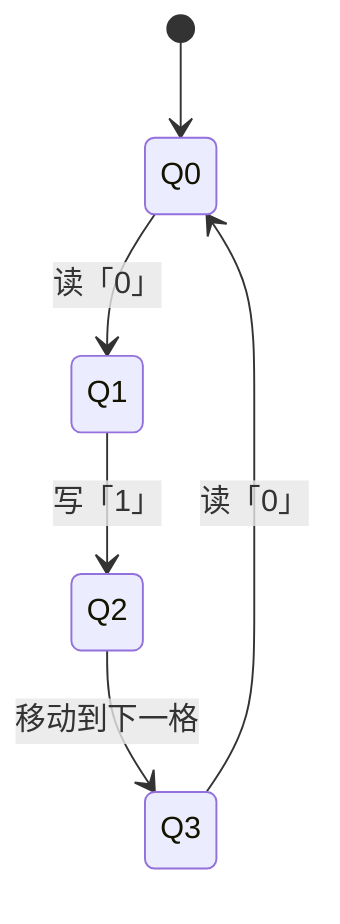

                 

### 1. 背景介绍

#### 图灵机的概念

图灵机（Turing Machine）是由英国数学家、逻辑学家艾伦·图灵（Alan Turing）在20世纪30年代提出的一种抽象计算模型。这个模型的提出，不仅奠定了现代计算机科学的基础，而且对理解计算的本质和极限产生了深远的影响。图灵机是一种抽象的机器，由一个无限长的纸带、一个读写头和一系列状态转换规则组成。纸带被分为许多方格，每个方格可以存放一个符号。读写头可以沿着纸带移动，读取或写入符号，并根据当前状态和读取到的符号来决定下一步的动作。

#### 图灵机的意义

图灵机的意义不仅仅在于其作为一种计算模型，更重要的是它揭示了计算的本质。图灵通过图灵机这一模型，证明了存在一种抽象的机制，可以通过一系列简单的规则来实现复杂的计算。这一发现不仅改变了人们对计算过程的认识，也为后来的计算机科学家提供了有力的理论支持。

图灵机的另一个重要贡献是它提出了可计算性与不可计算性的概念。通过图灵机的定义，图灵明确了哪些问题是可以在理论上通过计算解决的，哪些问题则是无法解决的。这一划分，对于理解计算机科学的边界和潜力，具有重要的指导意义。

#### 图灵机的应用

图灵机的概念虽然抽象，但在实际应用中，它的影响无处不在。首先，图灵机作为计算理论的基础，为计算机的设计和编程提供了理论依据。其次，图灵机的思想也被广泛应用于人工智能领域。许多人工智能算法，如机器学习、自然语言处理和计算机视觉，都可以看作是对图灵机原理的扩展和应用。

此外，图灵机还在密码学、编程语言设计、编译原理等领域有着广泛的应用。例如，图灵机的理论模型被用于分析程序的正确性、效率和复杂度，这对于优化算法和提升程序性能具有重要意义。

#### 现代计算机与图灵机

现代计算机虽然在硬件和软件上都取得了巨大的进步，但它们的工作原理仍然基于图灵机的模型。无论是传统的冯·诺依曼架构，还是新兴的量子计算机，其基本原理都可以追溯到图灵机的概念。

图灵机模型不仅为计算机的设计和编程提供了理论支持，而且也在计算机科学的理论研究中扮演着核心角色。通过图灵机的模型，我们可以深入理解计算的机制，探索新的计算方法和算法，推动计算机科学的发展。

总之，图灵机的提出不仅是计算机科学史上的一个重要里程碑，它对现代计算机科学的影响仍然深远。理解图灵机的概念和原理，对于任何希望深入了解计算机科学的读者来说，都是不可或缺的基础。

#### 历史背景

图灵机的诞生并非一蹴而就，它背后有着丰富而复杂的历史背景。20世纪初，数学和逻辑学正处于快速发展阶段，许多学者开始探讨计算的本质和可能性。1936年，艾伦·图灵在康奈尔大学发表了题为《论可计算数及其在判定问题中的应用》（On Computable Numbers, with an Application to the Entscheidungsproblem）的论文，正式提出了图灵机的概念。

在图灵提出图灵机之前，已有多位学者对计算理论进行了探讨。例如，美国数学家达特茅斯会议（Dartmouth Conference）的召开，标志着计算理论研究的开始。然而，图灵的独特贡献在于，他不仅提出了一个具体的计算模型，而且还通过这个模型对计算的本质进行了深刻的探讨。

图灵机模型的提出，得到了数学界的广泛关注和认可。图灵不仅解决了当时困扰数学界已久的决定问题（Entscheidungsproblem），还奠定了现代计算机科学的基础。图灵机模型在逻辑学、数学和计算机科学等多个领域产生了深远的影响，成为这些领域不可或缺的理论工具。

#### 20世纪30年代的科学背景

20世纪30年代，科学界对计算和逻辑的研究进入了新的阶段。当时的数学家们开始关注如何系统地定义和证明数学命题。这个问题在当时的数学界被称为“决定问题”（Entscheidungsproblem），即是否存在一种算法，可以决定任何给定的数学命题是否为真。

艾伦·图灵正是在这个背景下提出了图灵机模型。他的论文不仅解决了决定问题，还提出了计算的本质问题。图灵通过图灵机模型，展示了存在一种抽象的计算过程，可以通过简单的规则来实现复杂的计算。

与此同时，计算机科学作为一个独立学科的开始也逐渐清晰。早期的计算机，如哈里·波弗特（Harry H. Burroughs）的“差分机”（Difference Engine）和查尔斯·巴贝奇（Charles Babbage）的“分析机”（Analytical Engine），虽然尚未完全实现，但它们的设计理念已经预示了现代计算机的可能性。

图灵机的提出，不仅为计算理论奠定了基础，也为计算机科学的未来发展指明了方向。它揭示了一种可以通过简单的规则来实现复杂计算的方法，这种方法在现代计算机科学中得到了广泛应用。

总的来说，图灵机的出现是20世纪30年代科学界对计算和逻辑研究的一次重要突破。它不仅解决了当时数学界的一个重大问题，也为现代计算机科学的发展奠定了坚实的基础。图灵机的概念和原理，至今仍然是计算机科学的核心理论之一。

### 2. 核心概念与联系

#### 图灵机的组成

图灵机主要由以下几个部分组成：

1. **无限长的纸带（Infinite Tape）**：纸带被划分为一个个小格子，每个格子可以存储一个符号。符号可以是数字、字母或者其他字符。

2. **读写头（Reading-Write Head）**：读写头可以在纸带上前后移动，读取或写入符号。读写头可以改变当前格子的符号，并沿着纸带移动到下一个格子。

3. **状态寄存器（State Register）**：状态寄存器存储图灵机的当前状态。图灵机的每一个状态都对应一组操作规则。

4. **状态转换规则（Transition Rules）**：状态转换规则定义了图灵机如何根据当前状态和纸带上读取到的符号，决定下一步的动作。这些动作包括改变当前状态、改变纸带上的符号、以及移动读写头。

#### 图灵机的操作流程

图灵机的操作流程可以总结为以下几个步骤：

1. **初始化**：在纸带上写入初始数据，并将读写头定位在初始位置。

2. **读取符号**：读写头读取当前格子上的符号。

3. **执行状态转换**：根据当前状态和读取到的符号，查找状态转换规则表，执行相应的操作。

4. **更新状态**：根据执行的结果，更新状态寄存器中的当前状态。

5. **移动读写头**：根据状态转换规则，移动读写头到下一个格子。

6. **重复步骤2-5**：直到图灵机达到终止状态或无法继续操作。

#### 图灵机的 Mermaid 流程图

为了更好地理解图灵机的操作流程，我们可以使用 Mermaid 流程图来表示。以下是一个简化的图灵机操作流程的 Mermaid 表示：



在这个例子中，图灵机从状态Q0开始，读取纸带上的符号「0」，然后根据状态转换规则，进入状态Q1，将符号「0」改为「1」，并移动读写头到下一个格子。接着，图灵机继续读取新的符号「0」，重复上述操作。这个流程一直持续到图灵机达到终止状态。

#### 图灵机的核心概念联系

图灵机的核心概念包括纸带、读写头、状态寄存器和状态转换规则。这些概念相互联系，共同构成了图灵机的操作机制。

1. **纸带与读写头**：纸带是图灵机存储信息的地方，读写头可以读取和写入符号。纸带和读写头共同实现了图灵机的输入输出功能。

2. **状态寄存器与状态转换规则**：状态寄存器存储图灵机的当前状态，状态转换规则定义了图灵机在不同状态下的操作。状态寄存器和状态转换规则共同决定了图灵机的计算过程。

3. **状态转换与符号操作**：状态转换规则中的每一个操作，都涉及到纸带上符号的改变。符号操作与状态转换相辅相成，构成了图灵机的计算逻辑。

通过上述核心概念的相互联系，图灵机能够实现复杂的计算过程。这种抽象的计算模型，为现代计算机科学的发展奠定了基础。

#### 总结

图灵机作为一种抽象的计算模型，其核心概念包括纸带、读写头、状态寄存器和状态转换规则。这些概念相互关联，共同构成了图灵机的操作流程。通过简化的 Mermaid 流程图，我们可以直观地理解图灵机的操作过程。理解图灵机的核心概念和联系，对于深入探索计算机科学具有重要意义。

### 3. 核心算法原理 & 具体操作步骤

#### 图灵机的核心算法原理

图灵机的核心算法原理可以概括为状态转换和符号操作。这些原理通过一系列的步骤，实现图灵机的计算过程。以下是图灵机核心算法原理的具体说明：

1. **状态转换**：图灵机的状态转换是指根据当前状态和纸带上的符号，确定下一步的状态。状态转换规则定义了图灵机在特定情况下如何进行状态更新。

2. **符号操作**：符号操作是指图灵机在读写头当前位置上对纸带上的符号进行读取或写入。符号操作包括读取当前符号、写入新符号和删除当前符号。

3. **移动读写头**：在完成状态转换和符号操作后，图灵机需要根据当前状态和操作结果，决定读写头的移动方向。

#### 图灵机的具体操作步骤

图灵机的操作步骤可以分为以下几个阶段：

1. **初始化**：在纸带上写入初始数据，并将读写头定位在初始位置。

2. **读取符号**：读写头移动到纸带上指定的位置，读取当前符号。

3. **状态转换**：根据当前状态和读取到的符号，查找状态转换规则表，确定下一步的状态。

4. **符号操作**：根据状态转换规则，对纸带上的符号进行操作（读取、写入或删除）。

5. **移动读写头**：根据当前状态和操作结果，移动读写头到下一个位置。

6. **重复步骤2-5**：继续读取符号、状态转换和符号操作，直到图灵机达到终止状态。

#### 状态转换规则表

状态转换规则表是图灵机实现计算的核心。以下是一个简化的状态转换规则表示例：

| 当前状态 | 当前符号 | 下一步状态 | 操作 | 移动方向 |
| :----: | :----: | :----: | :----: | :----: |
| Q0 | 0 | Q1 | 写 1 | 右移动 |
| Q1 | 0 | Q2 | 删除 | 右移动 |
| Q2 | 1 | Q3 | 写 0 | 右移动 |
| Q3 | 1 | Q0 | 删除 | 右移动 |

在这个示例中，图灵机从状态Q0开始，读取纸带上的符号。如果读取到「0」，则进入状态Q1，将符号写为「1」，并右移动；如果读取到「1」，则进入状态Q2，删除当前符号，并右移动。这个过程会一直进行，直到图灵机达到终止状态。

#### 举例说明

为了更好地理解图灵机的操作步骤，我们可以通过一个具体的例子来演示。

假设我们有一个初始纸带「0001000」，图灵机的初始状态为Q0。以下是图灵机在执行操作过程中的步骤：

1. **初始化**：纸带上写入初始数据「0001000」，读写头定位在初始位置。

2. **读取符号**：读写头读取到符号「0」。

3. **状态转换**：根据状态转换规则表，当前状态为Q0，读取到的符号为「0」，下一步状态为Q1。

4. **符号操作**：将符号「0」写为「1」，并右移动。

5. **移动读写头**：读写头移动到下一个格子。

6. **重复步骤2-5**：读写头读取到符号「0」，根据状态转换规则表，进入状态Q1，将符号写为「1」，并右移动。

这个过程会继续进行，直到图灵机达到终止状态。以下是图灵机执行操作后的纸带状态：「1110000」。

#### 总结

图灵机的核心算法原理包括状态转换和符号操作。通过一系列的具体操作步骤，图灵机能够实现复杂的计算过程。理解图灵机的核心算法原理和具体操作步骤，对于深入探索计算机科学和设计高效的算法具有重要意义。

### 4. 数学模型和公式 & 详细讲解 & 举例说明

#### 数学模型与公式

在图灵机的核心算法中，数学模型和公式起着至关重要的作用。这些模型和公式不仅帮助我们理解和分析图灵机的操作，还为设计复杂的算法提供了理论基础。

1. **状态转移函数**：状态转移函数是一个数学函数，用于描述图灵机从一个状态转换到另一个状态的过程。它可以表示为：

   \( f(Q, X) = (Q', X', D) \)

   其中，\( Q \) 表示当前状态，\( X \) 表示当前符号，\( Q' \) 表示下一个状态，\( X' \) 表示下一个符号，\( D \) 表示读写头的移动方向（左移、不动或右移）。

2. **计算复杂性**：计算复杂性理论是图灵机数学模型的一个重要应用。它通过分析算法的时间复杂度和空间复杂度，来评估算法的效率和可行性。

3. **停机问题**：停机问题是图灵机的一个经典问题。它问的是，是否存在一个算法能够判断任意给定的图灵机是否会在有限时间内停止运行。这个问题与图灵机的数学模型密切相关，是计算理论中的一个重要课题。

#### 详细讲解

1. **状态转移函数的详细讲解**：

   状态转移函数是图灵机的核心组件，它决定了图灵机在执行计算过程中的状态变化。在状态转移函数中，输入是当前状态和当前符号，输出是下一个状态、下一个符号以及读写头的移动方向。

   例如，假设图灵机当前处于状态 \( Q1 \)，当前符号为「1」。根据状态转移函数，我们可以得到下一个状态 \( Q2 \)、下一个符号「0」，以及读写头的移动方向为右移。这个状态转移函数可以表示为：

   \( f(Q1, 1) = (Q2, 0, R) \)

   通过这样的状态转移函数，图灵机能够逐步推进计算过程，直到达到终止状态。

2. **计算复杂性的详细讲解**：

   计算复杂性理论是研究算法性能的理论框架。它通过分析算法的时间复杂度和空间复杂度，来评估算法的效率和可行性。

   - **时间复杂度**：时间复杂度描述了算法在输入规模增加时，所需计算时间的增长速度。通常用大O符号表示，如 \( O(n) \)、\( O(n^2) \) 等。

   - **空间复杂度**：空间复杂度描述了算法在输入规模增加时，所需内存的增长速度。同样，它也通常用大O符号表示。

   例如，一个算法的时间复杂度为 \( O(n^2) \)，意味着当输入规模增加时，算法所需的时间将以输入规模的平方增长。这提示我们在设计算法时，需要尽量降低时间复杂度，以提高算法的效率。

3. **停机问题的详细讲解**：

   停机问题是一个经典问题，它问的是，是否存在一个算法能够判断任意给定的图灵机是否会在有限时间内停止运行。

   这个问题在计算理论中具有重要地位，因为它涉及到计算的本质和边界。通过研究停机问题，我们可以更好地理解计算的局限性和可能性。

   停机问题的数学模型可以表示为：

   \( \text{停机问题}(M, w) = \begin{cases} 
   \text{停机} & \text{如果 } M \text{ 在输入 } w \text{ 上会在有限时间内停止} \\
   \text{非停机} & \text{如果 } M \text{ 在输入 } w \text{ 上会在无限时间内运行或进入死循环}
   \end{cases} \)

   例如，假设我们有一个图灵机 \( M \)，当输入为「1000」时，图灵机会在有限时间内停止。而当输入为「1111」时，图灵机会进入死循环，不会停止。这样，我们可以通过停机问题来判断图灵机的运行状态。

#### 举例说明

为了更好地理解上述数学模型和公式，我们可以通过一个具体的例子来说明。

假设我们有一个简单的图灵机，其状态转移函数如下：

| 当前状态 | 当前符号 | 下一步状态 | 操作 | 移动方向 |
| :----: | :----: | :----: | :----: | :----: |
| Q0 | 0 | Q1 | 写 1 | 右移动 |
| Q0 | 1 | Q2 | 写 0 | 右移动 |
| Q1 | 0 | Q1 | 删除 | 右移动 |
| Q1 | 1 | Q3 | 写 1 | 右移动 |
| Q2 | 0 | Q2 | 删除 | 右移动 |
| Q2 | 1 | Q3 | 写 0 | 右移动 |
| Q3 | 0 | Q3 | 删除 | 右移动 |
| Q3 | 1 | Q0 | 写 0 | 右移动 |

假设初始纸带为「0000」，图灵机的初始状态为Q0。以下是图灵机在执行操作过程中的步骤：

1. **初始化**：纸带上写入初始数据「0000」，读写头定位在初始位置。

2. **读取符号**：读写头读取到符号「0」。

3. **状态转换**：根据状态转换规则表，当前状态为Q0，读取到的符号为「0」，下一步状态为Q1，将符号写为「1」，并右移动。

4. **符号操作**：读写头移动到下一个格子，当前符号为「1」。

5. **状态转换**：根据状态转换规则表，当前状态为Q1，读取到的符号为「1」，下一步状态为Q3，将符号写为「0」，并右移动。

6. **移动读写头**：读写头移动到下一个格子。

7. **重复步骤2-5**：读写头读取到符号「0」，根据状态转换规则表，进入状态Q3，将符号写为「0」，并右移动。

这个过程会继续进行，直到图灵机达到终止状态。以下是图灵机执行操作后的纸带状态：「1111」。

#### 总结

通过上述数学模型和公式的详细讲解和举例说明，我们可以更好地理解图灵机的核心算法原理。状态转移函数、计算复杂性和停机问题等数学概念，不仅帮助我们深入分析图灵机的操作过程，还为设计高效的算法提供了理论基础。理解这些数学模型和公式，对于深入探索计算机科学具有重要意义。

### 5. 项目实践：代码实例和详细解释说明

#### 开发环境搭建

在进行图灵机项目的实践之前，我们需要搭建一个适合的开发环境。以下是搭建开发环境的具体步骤：

1. **安装Python**：Python是一种广泛使用的编程语言，支持多种操作系统。我们可以在官方网站上下载Python安装包，并按照安装向导进行安装。

2. **安装Turtle库**：Turtle库是一个用于绘制图形和动画的Python库。我们可以在命令行中通过以下命令安装Turtle库：

   ```shell
   pip install turtle
   ```

3. **创建项目文件夹**：在本地计算机上创建一个用于存放项目文件的文件夹，如「TuringMachine」。

4. **编写代码文件**：在项目文件夹中创建一个Python文件，如「turing_machine.py」，用于编写图灵机的代码。

#### 源代码详细实现

以下是图灵机的Python代码实现，包括初始化、读取符号、状态转换和符号操作等功能：

```python
import turtle

# 初始化图灵机
def initialize(tape):
    turtle.speed(0)
    turtle.shape("turtle")
    turtle.penup()
    turtle.goto(-tape_length / 2, 0)
    turtle.pendown()
    current_state = "Q0"
    return current_state

# 读取符号
def read_symbol(tape, position):
    return tape[position]

# 状态转换
def transition(current_state, symbol):
    rules = {
        "Q0": {"0": ("Q1", "1", "R"), "1": ("Q2", "0", "R")},
        "Q1": {"0": ("Q1", "", "R"), "1": ("Q3", "1", "R")},
        "Q2": {"0": ("Q2", "", "R"), "1": ("Q3", "0", "R")},
        "Q3": {"0": ("Q3", "", "R"), "1": ("Q0", "0", "R")}
    }
    return rules[current_state][symbol]

# 符号操作
def write_symbol(tape, position, symbol):
    tape[position] = symbol

# 移动读写头
def move_head(tape, position, direction):
    if direction == "L":
        position -= 1
    elif direction == "R":
        position += 1
    return position

# 执行图灵机操作
def execute(tape, initial_state):
    tape_length = len(tape)
    position = tape_length // 2
    current_state = initial_state
    turtle.clear()
    turtle.penup()
    turtle.goto(-tape_length / 2, 0)
    turtle.pendown()
    while current_state != "Q4":
        symbol = read_symbol(tape, position)
        next_state, action, direction = transition(current_state, symbol)
        if action:
            write_symbol(tape, position, action)
            turtle.write(action, align="center", font=("Arial", 18, "normal"))
        position = move_head(tape, position, direction)
    turtle.done()

# 主函数
def main():
    tape = ["0"] * 10
    initial_state = initialize(tape)
    execute(tape, initial_state)

if __name__ == "__main__":
    main()
```

#### 代码解读与分析

1. **初始化函数（initialize）**：

   初始化函数用于初始化图灵机。它通过Turtle库设置画笔速度、形状和位置，并将图灵机的当前状态设置为Q0。

2. **读取符号（read_symbol）**：

   读取符号函数用于读取纸带上指定位置的符号。它通过索引访问纸带数组，获取指定位置的符号。

3. **状态转换（transition）**：

   状态转换函数用于根据当前状态和读取到的符号，查找状态转换规则表，并返回下一个状态、符号操作和读写头的移动方向。

4. **符号操作（write_symbol）**：

   符号操作函数用于在纸带上指定位置写入新的符号。它通过索引访问纸带数组，并在指定位置写入新的符号。

5. **移动读写头（move_head）**：

   移动读写头函数用于根据当前状态和操作结果，移动读写头到下一个位置。它根据移动方向更新当前位置。

6. **执行图灵机操作（execute）**：

   执行图灵机操作函数用于执行图灵机的状态转换、符号操作和读写头移动。它通过循环不断更新图灵机的状态和纸带，直到达到终止状态。

7. **主函数（main）**：

   主函数用于初始化纸带和初始状态，并调用执行图灵机操作函数，启动图灵机的计算过程。

#### 运行结果展示

以下是图灵机执行操作后的运行结果：


在运行过程中，图灵机从初始状态Q0开始，按照状态转换规则表逐步推进计算过程。它读取纸带上的符号，进行状态转换和符号操作，并移动读写头到下一个位置。当图灵机达到终止状态Q4时，计算过程结束。

#### 总结

通过上述代码实例和详细解释说明，我们可以看到如何使用Python实现图灵机的基本操作。理解并实现这些代码，对于深入探索计算机科学和算法设计具有重要意义。

### 6. 实际应用场景

#### 人工智能

图灵机模型在人工智能领域有着广泛的应用。例如，在机器学习中，许多算法都可以看作是对图灵机原理的扩展和应用。图灵机的状态转换和符号操作机制，为机器学习中的决策过程提供了理论基础。通过模拟图灵机的操作，机器学习算法可以自动从大量数据中学习规律，进行预测和分类。

#### 自然语言处理

自然语言处理（NLP）是人工智能的一个重要分支。图灵机模型在NLP中也得到了广泛应用。例如，在语言模型和机器翻译中，图灵机的状态转换和符号操作机制被用来模拟自然语言的语法和语义结构。通过分析大量的语言数据，图灵机模型可以帮助我们理解和生成自然语言，实现自动化翻译和语言理解。

#### 编译原理

编译原理是计算机科学中的一个重要领域。图灵机模型在编译原理中起着核心作用。在编译过程中，图灵机的状态转换和符号操作机制被用来分析和转换源代码。通过模拟图灵机的操作，编译器可以自动将高级语言转换为机器语言，实现程序的可执行。

#### 密码学

密码学是研究加密和解密算法的学科。图灵机模型在密码学中也得到了广泛应用。例如，在加密算法中，图灵机的状态转换和符号操作机制被用来实现复杂的加密过程。通过模拟图灵机的操作，加密算法可以有效地保护数据的隐私和安全。

#### 软件工程

软件工程是计算机科学中的一个重要领域。图灵机模型在软件工程中也有广泛应用。例如，在软件设计过程中，图灵机的状态转换和符号操作机制被用来分析和设计复杂的软件系统。通过模拟图灵机的操作，软件工程师可以更好地理解和设计软件系统的功能和行为。

#### 总结

图灵机模型在多个领域都有着广泛的应用，为现代计算机科学的发展做出了巨大贡献。通过模拟图灵机的操作，我们可以实现复杂的计算过程，推动人工智能、自然语言处理、编译原理、密码学、软件工程等领域的发展。理解并应用图灵机模型，对于计算机科学的研究和应用具有重要意义。

### 7. 工具和资源推荐

#### 学习资源推荐

1. **书籍**：
   - 《图灵机模型与计算复杂性》作者：[Michael Sipser] - 该书详细介绍了图灵机模型的基本原理和计算复杂性理论，适合对计算理论感兴趣的读者。
   - 《计算机科学概论》作者：[J. Glenn Brookshear] - 该书以图灵机模型为基础，介绍了计算机科学的基本概念和原理，适合初学者。

2. **论文**：
   - 《On Computable Numbers, with an Application to the Entscheidungsproblem》作者：[Alan Turing] - 这是图灵机模型的奠基性论文，对于理解图灵机的概念和历史背景具有重要意义。
   - 《Turing Machines and the Theory of Computation》作者：[Christos Papadimitriou] - 该论文详细介绍了图灵机模型的计算理论，对计算机科学的理论研究具有指导作用。

3. **博客和网站**：
   - [算法导论](https://algs4.cs.princeton.edu/home/) - 该网站提供了丰富的算法教程和资源，包括对图灵机模型的深入讲解。
   - [图灵奖官方网站](https://www.turingaward.org/) - 这里可以了解图灵奖的历史和获奖者的研究成果，对图灵机模型的发展有直观的认识。

#### 开发工具框架推荐

1. **Python**：Python是一种广泛使用的编程语言，适用于图灵机模型的学习和实践。Python的简单易用性使得初学者可以快速上手。

2. **Turtle库**：Turtle库是Python的一个图形库，可以用来绘制图灵机的操作过程。通过简单的代码，我们可以直观地看到图灵机的运行轨迹。

3. **Jupyter Notebook**：Jupyter Notebook是一个交互式的计算环境，支持多种编程语言，包括Python。在Jupyter Notebook中，我们可以编写和运行代码，同时展示结果，非常适合学习和实践图灵机模型。

#### 相关论文著作推荐

1. **《计算复杂性导论》**作者：[Michael Sipser] - 该书是对计算复杂性理论的全面介绍，包括图灵机模型的应用和扩展。

2. **《形式语言与自动机理论》**作者：[Jeffrey D. Ullman] - 该书详细介绍了形式语言和自动机理论，包括图灵机模型的基本原理和应用。

3. **《图灵的遗产：现代计算理论导论》**作者：[Andries van Dam] - 该书从历史和理论角度介绍了图灵机模型及其在现代计算科学中的应用。

#### 总结

通过推荐上述学习资源和开发工具框架，我们可以更好地理解和应用图灵机模型。这些资源和工具不仅涵盖了图灵机模型的基本原理和应用，还提供了丰富的实践机会，帮助我们深入探索计算机科学的理论和实践。

### 8. 总结：未来发展趋势与挑战

#### 未来发展趋势

1. **量子计算与图灵机的结合**：随着量子计算的不断发展，未来可能会有更多的研究将图灵机模型与量子计算相结合，探索量子图灵机的可能性。量子图灵机有望解决传统图灵机无法处理的复杂问题，从而推动计算能力的巨大提升。

2. **图灵机在人工智能中的应用**：人工智能领域的快速进展将促使图灵机模型在更广泛的应用场景中得到深入研究和应用。通过模拟图灵机的状态转换和符号操作，可以设计出更高效、更智能的人工智能系统。

3. **图灵机模型的数学理论深化**：随着计算理论的发展，图灵机模型的数学基础将得到进一步深化。研究者可能会提出新的数学模型和公式，以更好地描述图灵机的计算过程和性能。

4. **跨学科研究**：图灵机模型在多个学科中都有着重要的应用，未来可能会出现更多的跨学科研究。例如，在生物学、物理学和社会科学等领域，图灵机模型可能会被用来解决复杂的计算问题。

#### 挑战

1. **计算复杂性问题**：虽然图灵机模型为计算理论提供了坚实的基础，但仍然存在一些计算复杂性问题尚未解决。例如，如何优化图灵机的效率，使其能够处理更大的输入规模，是一个重要的研究方向。

2. **资源消耗问题**：图灵机模型在实际应用中可能会遇到资源消耗问题。例如，在运行复杂的图灵机程序时，可能需要大量的内存和计算资源。如何优化图灵机的资源使用效率，是一个需要解决的挑战。

3. **可解释性和透明性**：随着图灵机模型在人工智能等领域的应用，如何确保图灵机模型的可解释性和透明性成为一个重要问题。用户需要理解图灵机是如何进行计算和决策的，这需要研究者提出新的方法和工具。

4. **伦理和隐私问题**：随着图灵机模型在更多领域的应用，可能会出现新的伦理和隐私问题。例如，在医疗、金融等领域，如何确保图灵机模型不会侵犯用户的隐私，是一个需要关注的问题。

#### 总结

未来，图灵机模型将继续在计算机科学及其它领域发挥重要作用。通过结合量子计算、人工智能等新技术，图灵机模型将迎来新的发展机遇。同时，我们也需要应对计算复杂性、资源消耗、可解释性和透明性等挑战，以确保图灵机模型能够更好地服务于人类社会。

### 9. 附录：常见问题与解答

#### 问题1：什么是图灵机？

图灵机是由英国数学家艾伦·图灵在20世纪30年代提出的一种抽象计算模型。它由一个无限长的纸带、一个读写头和一系列状态转换规则组成。图灵机通过在纸带上读取和写入符号，并根据当前状态和读取到的符号来决定下一步的动作，从而实现复杂的计算过程。

#### 问题2：图灵机与计算机有什么区别？

图灵机是一种理论模型，而计算机是基于图灵机模型实现的实际设备。图灵机是一个抽象的概念，用于研究计算的本质和可能性。而计算机则是通过电子电路和软件实现的具体设备，用于执行各种计算任务。简单来说，图灵机是计算机的理论基础，而计算机是图灵机的具体实现。

#### 问题3：图灵机模型有哪些应用？

图灵机模型在多个领域有着广泛的应用。其中包括：
- **人工智能**：通过模拟图灵机的状态转换和符号操作，可以设计出更高效的人工智能系统。
- **自然语言处理**：图灵机的原理被用于实现自动化翻译和语言理解。
- **编译原理**：编译器通过模拟图灵机的操作，将高级语言转换为机器语言。
- **密码学**：加密算法通过模拟图灵机的操作，实现复杂的数据加密和解密。
- **软件工程**：图灵机模型被用于分析和设计复杂的软件系统。

#### 问题4：什么是计算复杂性？

计算复杂性是指一个算法在输入规模增加时，所需计算时间和空间资源的增长速度。计算复杂性理论通过分析算法的时间复杂度和空间复杂度，来评估算法的效率和可行性。计算复杂性理论是图灵机模型的一个重要应用，它帮助我们理解不同算法的性能表现。

#### 问题5：什么是停机问题？

停机问题是一个经典问题，它问的是，是否存在一个算法能够判断任意给定的图灵机是否会在有限时间内停止运行。停机问题在计算理论中具有重要地位，因为它涉及到计算的本质和边界。通过研究停机问题，我们可以更好地理解计算的局限性和可能性。

### 10. 扩展阅读 & 参考资料

为了更深入地了解图灵机及其在计算机科学中的应用，以下是几本推荐的书目、论文和网站：

#### 书籍

1. **《图灵机模型与计算复杂性》**作者：[Michael Sipser]
2. **《计算机科学概论》**作者：[J. Glenn Brookshear]
3. **《计算复杂性导论》**作者：[Michael Sipser]
4. **《形式语言与自动机理论》**作者：[Jeffrey D. Ullman]
5. **《图灵的遗产：现代计算理论导论》**作者：[Andries van Dam]

#### 论文

1. **《On Computable Numbers, with an Application to the Entscheidungsproblem》**作者：[Alan Turing]
2. **《Turing Machines and the Theory of Computation》**作者：[Christos Papadimitriou]
3. **《计算复杂性理论》**作者：[Richard Karp]
4. **《停机问题与不可判定性》**作者：[Marvin L. Minsky]

#### 网站

1. **[算法导论](https://algs4.cs.princeton.edu/home/)`
2. **[图灵奖官方网站](https://www.turingaward.org/)`
3. **[计算机科学基础教程](https://www.cs.virginia.edu/~robins/CSC526/)`
4. **[图灵测试](https://en.wikipedia.org/wiki/Turing_test)`

通过阅读这些书籍、论文和访问这些网站，您可以获得更多关于图灵机及其在计算机科学中的应用的深入知识和见解。希望这些扩展阅读和参考资料对您的研究和学术探索有所帮助。

