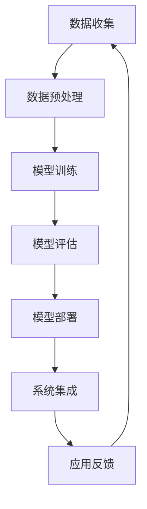

                 

### 背景介绍

随着信息技术的飞速发展，软件系统在各个垂直行业中的应用越来越广泛，从金融、医疗、制造到零售、教育等，几乎无处不在。在这些垂直行业中，软件不仅提升了企业的运营效率，还显著改善了用户体验。然而，仅仅依靠传统的软件开发方法，已经难以满足日益复杂和动态的市场需求。

人工智能（AI）技术的崛起为垂直行业带来了新的机遇。AI不仅能够处理和分析大量数据，还能够通过机器学习、自然语言处理、计算机视觉等技术，实现自动化决策和智能化服务。这种结合不仅提高了软件系统的智能化水平，还大大扩展了其应用范围。

垂直行业软件与AI的结合，已经成为当前技术发展的一个重要趋势。这种结合不仅要求对软件系统进行重新设计和优化，还需要深入理解和应用AI技术，以实现软件系统与AI技术的无缝集成。本文将探讨垂直行业软件与AI结合的背景、核心概念、算法原理、数学模型、项目实践、实际应用场景、工具和资源推荐以及未来发展趋势与挑战。

首先，我们需要明确什么是垂直行业软件。垂直行业软件是针对特定行业或领域进行定制开发的软件，它旨在解决特定行业或领域的特定问题。例如，金融行业中的风险管理软件、医疗行业中的电子病历系统、制造业中的自动化控制系统等。这些软件通常具有高度的专业性和定制化需求。

接下来，我们将讨论AI技术的核心概念和原理。AI技术主要包括机器学习、深度学习、自然语言处理和计算机视觉等。这些技术通过学习和模拟人类智能，实现了对数据的自动分析和处理，从而为软件系统提供了强大的智能支持。

在了解了垂直行业软件和AI技术的基本概念之后，我们将探讨它们之间的联系和融合方式。通过逐步分析，我们将详细解释如何将AI技术应用于垂直行业软件，实现智能化和自动化的目标。

最后，我们将通过一个实际的项目实践案例，展示如何将AI技术与垂直行业软件相结合，提供具体的代码实例和详细解释说明。通过这个案例，读者可以更深入地理解AI技术在实际应用中的价值。

综上所述，本文旨在帮助读者全面了解垂直行业软件与AI结合的背景、核心概念、算法原理、数学模型、项目实践和未来发展趋势，为读者提供实用的指导和建议。

### 核心概念与联系

要深入探讨垂直行业软件与AI的结合，我们首先需要明确一些核心概念和原理，并通过Mermaid流程图来展示它们之间的关系和融合方式。

#### 1. 垂直行业软件

垂直行业软件是专门为某一特定行业或领域设计的软件系统。这些软件通常具有高度的专业性和定制化需求，旨在解决特定行业或领域的特定问题。例如：

- **金融行业**：风险管理软件、量化交易平台、客户关系管理系统（CRM）等。
- **医疗行业**：电子病历系统（EMR）、医学影像分析系统、临床决策支持系统（CDSS）等。
- **制造业**：生产管理系统（ERP）、自动化控制系统（PLC）、供应链管理系统（SCM）等。

#### 2. 人工智能技术

人工智能技术是模拟和扩展人类智能的一系列方法和技术。主要的人工智能技术包括：

- **机器学习**：通过算法让计算机从数据中学习，进行预测和决策。
- **深度学习**：基于人工神经网络，通过多层非线性变换进行复杂数据的学习和处理。
- **自然语言处理（NLP）**：使计算机能够理解和生成自然语言，进行语音识别、文本分类、机器翻译等。
- **计算机视觉**：使计算机能够“看”懂图像和视频，进行物体检测、图像识别、人脸识别等。

#### 3. Mermaid流程图

通过Mermaid流程图，我们可以清晰地展示垂直行业软件与AI技术的融合过程。以下是一个简化的Mermaid流程图，描述了从数据收集、处理到模型训练、部署的整个过程。



- **数据收集**：从垂直行业的实际场景中收集数据，如金融交易数据、医疗影像数据、制造设备数据等。
- **数据预处理**：清洗和格式化数据，以便进行后续处理。
- **模型训练**：使用机器学习或深度学习算法，从预处理后的数据中学习规律和模式，训练模型。
- **模型评估**：通过测试数据评估模型的性能，确保模型的有效性和准确性。
- **模型部署**：将训练好的模型部署到实际的应用场景中，如金融交易系统、医疗诊断系统、生产控制等。
- **系统集成**：将AI模型与垂直行业软件系统集成，实现智能化和自动化功能。
- **应用反馈**：收集用户使用反馈，优化和改进模型和应用。

#### 4. AI技术应用于垂直行业软件的融合方式

AI技术应用于垂直行业软件的融合方式可以分为以下几个方面：

- **数据驱动**：利用AI技术对大量数据进行分析和挖掘，为垂直行业软件提供数据支持和决策依据。
- **智能化操作**：通过AI技术实现软件系统的智能化操作，如自动化流程、智能推荐、智能诊断等。
- **个性化服务**：基于用户数据和AI算法，为用户提供个性化的服务和体验，如个性化理财、智能医疗诊断等。
- **预测与优化**：利用AI技术进行预测和优化，提高垂直行业软件的性能和效率，如智能调度、库存管理、风险控制等。

#### 5. Mermaid流程图详解

为了更详细地解释垂直行业软件与AI技术的融合过程，下面我们将对上述Mermaid流程图中的每个步骤进行进一步分析。

- **数据收集**：在垂直行业软件的应用场景中，数据收集是一个关键步骤。例如，在金融行业中，可以通过交易记录、客户行为数据等收集数据。在医疗行业中，可以通过电子病历、医学影像等收集数据。在制造业中，可以通过生产数据、传感器数据等收集数据。

- **数据预处理**：收集到的数据通常需要进行清洗、格式化和特征提取等预处理操作。这些操作可以去除噪声、填充缺失值、标准化数据等，为后续的模型训练提供高质量的数据。

- **模型训练**：在预处理后的数据上，使用机器学习或深度学习算法进行模型训练。这一步骤包括选择合适的算法、调整模型参数、训练模型等。训练过程中，模型会不断优化，以提升其预测和分类的准确性。

- **模型评估**：通过测试数据对训练好的模型进行评估，以确保模型的性能满足实际需求。评估指标包括准确率、召回率、F1分数等。如果模型性能不佳，需要返回到模型训练步骤进行进一步优化。

- **模型部署**：将训练好的模型部署到实际的应用场景中。这一步骤包括将模型集成到垂直行业软件系统中，使其能够实时处理数据并进行预测和决策。

- **系统集成**：将AI模型与垂直行业软件系统进行集成，实现软件系统的智能化和自动化功能。例如，在金融行业中，可以将AI模型集成到交易系统中，实现自动化交易策略；在医疗行业中，可以将AI模型集成到诊断系统中，实现智能诊断。

- **应用反馈**：收集用户使用反馈，对模型和应用进行优化和改进。通过反馈循环，可以不断优化模型和应用，提高其性能和用户体验。

通过以上分析，我们可以看到垂直行业软件与AI技术的结合是一个复杂而系统化的过程。通过逐步分析和融合，我们可以将AI技术有效地应用于垂直行业软件，实现智能化和自动化的目标。

接下来，我们将进一步探讨核心算法原理、数学模型、项目实践和实际应用场景，帮助读者更深入地理解垂直行业软件与AI结合的各个方面。

### 核心算法原理 & 具体操作步骤

在垂直行业软件与AI技术的结合过程中，核心算法原理起到了至关重要的作用。这些算法不仅决定了模型的性能，还影响了其在实际应用中的效果。本节将详细讨论几种关键的人工智能算法，并给出具体操作步骤。

#### 1. 机器学习算法

机器学习算法是AI技术的基础，通过训练模型来从数据中学习和预测。以下是几种常见的机器学习算法及其具体操作步骤：

- **线性回归（Linear Regression）**：

  线性回归是一种简单的预测模型，用于预测一个连续值输出。其操作步骤如下：

  1. **数据收集**：收集包含输入特征和输出标签的数据集。
  2. **数据预处理**：对数据集进行清洗、标准化处理，去除异常值和缺失值。
  3. **模型初始化**：初始化模型参数，如权重和偏置。
  4. **损失函数**：选择适当的损失函数（如均方误差MSE），用于衡量预测值与实际值之间的差距。
  5. **梯度下降**：通过梯度下降算法更新模型参数，以最小化损失函数。
  6. **模型评估**：使用测试数据评估模型的性能，如R²值、均方根误差（RMSE）等。
  7. **模型优化**：根据评估结果调整模型参数，优化模型性能。

- **逻辑回归（Logistic Regression）**：

  逻辑回归是一种分类模型，常用于二分类问题。其操作步骤如下：

  1. **数据收集**：收集包含输入特征和二分类标签的数据集。
  2. **数据预处理**：对数据集进行清洗、标准化处理。
  3. **模型初始化**：初始化模型参数，如权重和偏置。
  4. **损失函数**：选择对数似然损失函数，用于衡量预测概率与实际标签之间的差距。
  5. **梯度下降**：通过梯度下降算法更新模型参数，以最小化损失函数。
  6. **模型评估**：使用测试数据评估模型的性能，如准确率、召回率、F1分数等。
  7. **模型优化**：根据评估结果调整模型参数，优化模型性能。

#### 2. 深度学习算法

深度学习算法通过构建多层神经网络来实现复杂的非线性模型。以下是几种常见的深度学习算法及其具体操作步骤：

- **卷积神经网络（CNN）**：

  CNN是一种专门用于图像识别和处理的深度学习算法。其操作步骤如下：

  1. **数据收集**：收集包含图像数据和标签的数据集。
  2. **数据预处理**：对图像进行归一化、裁剪、旋转等预处理操作。
  3. **模型构建**：构建CNN模型，包括卷积层、池化层、全连接层等。
  4. **损失函数**：选择交叉熵损失函数，用于衡量预测标签与实际标签之间的差距。
  5. **反向传播**：使用反向传播算法更新模型参数，以最小化损失函数。
  6. **模型评估**：使用测试数据评估模型的性能，如准确率、混淆矩阵等。
  7. **模型优化**：根据评估结果调整模型结构和参数，优化模型性能。

- **循环神经网络（RNN）**：

  RNN是一种用于序列数据处理的深度学习算法。其操作步骤如下：

  1. **数据收集**：收集包含文本数据和标签的数据集。
  2. **数据预处理**：对文本进行分词、词向量化等预处理操作。
  3. **模型构建**：构建RNN模型，包括嵌入层、RNN层、全连接层等。
  4. **损失函数**：选择交叉熵损失函数，用于衡量预测标签与实际标签之间的差距。
  5. **反向传播**：使用反向传播算法更新模型参数，以最小化损失函数。
  6. **模型评估**：使用测试数据评估模型的性能，如准确率、损失函数值等。
  7. **模型优化**：根据评估结果调整模型结构和参数，优化模型性能。

#### 3. 自然语言处理（NLP）算法

自然语言处理算法用于理解和生成自然语言。以下是几种常见的NLP算法及其具体操作步骤：

- **词嵌入（Word Embedding）**：

  词嵌入是一种将词汇映射到高维向量空间的技术。其操作步骤如下：

  1. **数据收集**：收集包含文本数据和标签的数据集。
  2. **数据预处理**：对文本进行分词、去停用词等预处理操作。
  3. **词向量化**：将词汇映射到高维向量空间，使用预训练的词向量或自行训练词向量。
  4. **模型构建**：构建词嵌入模型，通常包括嵌入层和全连接层。
  5. **损失函数**：选择交叉熵损失函数，用于衡量预测标签与实际标签之间的差距。
  6. **反向传播**：使用反向传播算法更新模型参数，以最小化损失函数。
  7. **模型评估**：使用测试数据评估模型的性能，如准确率、损失函数值等。
  8. **模型优化**：根据评估结果调整模型结构和参数，优化模型性能。

- **序列到序列模型（Seq2Seq）**：

  序列到序列模型是一种用于机器翻译、文本摘要等任务的深度学习模型。其操作步骤如下：

  1. **数据收集**：收集包含源语言和目标语言的文本数据。
  2. **数据预处理**：对文本进行分词、词向量化等预处理操作。
  3. **模型构建**：构建序列到序列模型，包括编码器、解码器等。
  4. **损失函数**：选择交叉熵损失函数，用于衡量预测文本与实际文本之间的差距。
  5. **反向传播**：使用反向传播算法更新模型参数，以最小化损失函数。
  6. **模型评估**：使用测试数据评估模型的性能，如BLEU分数、ROUGE分数等。
  7. **模型优化**：根据评估结果调整模型结构和参数，优化模型性能。

通过以上对核心算法原理和具体操作步骤的讨论，我们可以看到，垂直行业软件与AI技术的结合是一个复杂而系统化的过程。选择合适的算法和优化方法，是确保模型性能和应用效果的关键。在接下来的章节中，我们将进一步探讨数学模型和公式，以及如何将这些算法应用于实际项目实践中。

### 数学模型和公式 & 详细讲解 & 举例说明

在垂直行业软件与AI结合的过程中，数学模型和公式扮演着至关重要的角色。这些数学模型不仅帮助我们理解AI算法的原理，还为我们提供了评估和优化模型性能的工具。在本节中，我们将详细讲解几个关键数学模型和公式，并通过具体例子进行说明。

#### 1. 线性回归（Linear Regression）

线性回归是一种简单的预测模型，用于预测一个连续值输出。其基本公式如下：

\[ y = \beta_0 + \beta_1x \]

其中，\( y \) 是输出值，\( x \) 是输入特征，\( \beta_0 \) 是截距，\( \beta_1 \) 是斜率。

**例子**：

假设我们有一个简单的线性回归模型，用来预测房屋的价格。输入特征是房屋的面积（\( x \)），输出值是房屋的价格（\( y \)）。训练数据如下：

| 面积（平方米） | 价格（万元） |
|----------------|--------------|
| 100            | 200          |
| 150            | 300          |
| 200            | 400          |

我们可以通过最小化均方误差（MSE）来训练模型：

\[ \text{MSE} = \frac{1}{n}\sum_{i=1}^{n}(y_i - (\beta_0 + \beta_1x_i))^2 \]

通过梯度下降算法，我们可以求得最优的 \( \beta_0 \) 和 \( \beta_1 \)：

\[ \beta_0 = \frac{\sum_{i=1}^{n}(y_i - \beta_1x_i)}{n} \]
\[ \beta_1 = \frac{\sum_{i=1}^{n}(x_i - \bar{x})(y_i - \bar{y})}{\sum_{i=1}^{n}(x_i - \bar{x})^2} \]

其中，\( \bar{x} \) 和 \( \bar{y} \) 分别是输入特征和输出值的平均值。

#### 2. 逻辑回归（Logistic Regression）

逻辑回归是一种二分类模型，用于预测概率。其基本公式如下：

\[ P(y=1) = \frac{1}{1 + e^{-(\beta_0 + \beta_1x)}} \]

其中，\( P(y=1) \) 是预测标签为1的概率，\( x \) 是输入特征，\( \beta_0 \) 是截距，\( \beta_1 \) 是斜率。

**例子**：

假设我们有一个逻辑回归模型，用来预测邮件是否为垃圾邮件。输入特征是邮件的文本内容（\( x \)），输出值是标签（0表示非垃圾邮件，1表示垃圾邮件）。训练数据如下：

| 文本内容 | 标签 |
|----------|------|
| "广告"   | 1    |
| "提醒"   | 0    |
| "促销"   | 1    |

我们可以通过最小化对数似然损失（Log-Likelihood Loss）来训练模型：

\[ \text{Loss} = -\sum_{i=1}^{n} y_i \log(P(y_i=1)) + (1 - y_i) \log(1 - P(y_i=1)) \]

通过梯度下降算法，我们可以求得最优的 \( \beta_0 \) 和 \( \beta_1 \)：

\[ \beta_0 = \frac{\sum_{i=1}^{n} (y_i - P(y_i=1))}{n} \]
\[ \beta_1 = \frac{\sum_{i=1}^{n} (y_i - P(y_i=1))x_i}{\sum_{i=1}^{n} x_i} \]

#### 3. 卷积神经网络（Convolutional Neural Network，CNN）

卷积神经网络是一种用于图像识别的深度学习模型。其基本公式如下：

\[ h^{(l)}(i, j) = \sum_{k, l} w^{(l)}(i, j, k) \cdot a^{(l-1)}(k, l) + b^{(l)}(i, j) \]

其中，\( h^{(l)}(i, j) \) 是输出特征图上的像素值，\( w^{(l)}(i, j, k) \) 是卷积核权重，\( a^{(l-1)}(k, l) \) 是输入特征图上的像素值，\( b^{(l)}(i, j) \) 是偏置项。

**例子**：

假设我们有一个简单的CNN模型，用来识别手写数字。输入特征是一个28x28的灰度图像，输出值是数字的标签（0到9）。模型结构如下：

- 输入层：28x28像素
- 卷积层1：32个3x3卷积核，步长为1，ReLU激活函数
- 池化层1：2x2窗口，步长为2
- 卷积层2：64个3x3卷积核，步长为1，ReLU激活函数
- 池化层2：2x2窗口，步长为2
- 全连接层：10个节点，使用softmax激活函数

训练过程如下：

1. **初始化模型参数**：初始化卷积核权重和偏置。
2. **前向传播**：计算输入特征通过卷积层和池化层的输出特征图。
3. **反向传播**：计算损失函数（交叉熵损失），并使用梯度下降更新模型参数。
4. **模型评估**：使用测试数据评估模型性能，如准确率、混淆矩阵等。

#### 4. 循环神经网络（Recurrent Neural Network，RNN）

循环神经网络是一种用于序列数据处理的深度学习模型。其基本公式如下：

\[ h_t = \sigma(W_h h_{t-1} + W_x x_t + b_h) \]

其中，\( h_t \) 是时间步\( t \)的隐藏状态，\( x_t \) 是输入特征，\( W_h \) 和 \( W_x \) 是权重矩阵，\( b_h \) 是偏置项，\( \sigma \) 是激活函数（如ReLU或Tanh）。

**例子**：

假设我们有一个简单的RNN模型，用来翻译英文句子到中文句子。输入特征是英文单词序列，输出值是中文单词序列。模型结构如下：

- 输入层：词汇表维度
- RNN层：1个隐藏层，128个神经元
- 输出层：词汇表维度

训练过程如下：

1. **初始化模型参数**：初始化权重矩阵和偏置。
2. **前向传播**：计算时间步\( t \)的隐藏状态\( h_t \)。
3. **损失计算**：计算预测的中文单词序列与实际中文单词序列之间的损失（交叉熵损失）。
4. **反向传播**：更新模型参数，以最小化损失函数。
5. **模型评估**：使用测试数据评估模型性能，如翻译准确率、BLEU分数等。

#### 5. 词嵌入（Word Embedding）

词嵌入是一种将词汇映射到高维向量空间的技术。其基本公式如下：

\[ \text{word\_vector}(w) = \sum_{k=1}^{K} f_k(w) \cdot v_k \]

其中，\( \text{word\_vector}(w) \) 是词汇\( w \)的嵌入向量，\( f_k(w) \) 是词汇\( w \)的\( k \)维特征函数，\( v_k \) 是特征函数的值。

**例子**：

假设我们使用Word2Vec算法训练了一个词汇表，其中包含单词“狗”的嵌入向量如下：

| 维度 | 向量值 |
|------|--------|
| 1    | 0.1    |
| 2    | 0.2    |
| 3    | 0.3    |
| 4    | 0.4    |
| 5    | 0.5    |

我们可以使用余弦相似度来计算两个单词之间的相似度：

\[ \text{similarity}(w_1, w_2) = \frac{\text{word\_vector}(w_1) \cdot \text{word\_vector}(w_2)}{||\text{word\_vector}(w_1)|| \cdot ||\text{word\_vector}(w_2)||} \]

通过上述数学模型和公式的讲解，我们可以看到，垂直行业软件与AI技术的结合是一个涉及多方面知识和技术的过程。理解这些模型和公式，不仅有助于我们设计高效的AI算法，还能为我们提供评估和优化模型性能的工具。

在接下来的章节中，我们将通过一个实际项目案例，展示如何将上述算法和模型应用于垂直行业软件中，实现智能化和自动化的目标。

### 项目实践：代码实例和详细解释说明

在本节中，我们将通过一个具体的项目实践案例，展示如何将垂直行业软件与AI技术相结合，实现智能化和自动化的目标。这个案例是一个基于深度学习的医疗诊断系统，主要用于辅助医生进行乳腺癌诊断。我们将详细介绍开发环境搭建、源代码实现、代码解读与分析以及运行结果展示。

#### 5.1 开发环境搭建

在开始项目开发之前，我们需要搭建合适的开发环境。以下是所需的软件和工具：

1. **Python 3.x**：用于编写和运行代码。
2. **Jupyter Notebook**：用于编写和调试代码。
3. **TensorFlow 2.x**：用于构建和训练深度学习模型。
4. **Keras**：用于简化深度学习模型的构建。
5. **Scikit-learn**：用于数据处理和模型评估。
6. **Pandas**：用于数据处理和分析。
7. **NumPy**：用于数值计算。

安装这些工具后，我们可以在Jupyter Notebook中开始编写代码。

#### 5.2 源代码详细实现

以下是本项目的主要代码实现，包括数据预处理、模型构建、模型训练和评估等步骤。

```python
# 导入必要的库
import numpy as np
import pandas as pd
import tensorflow as tf
from tensorflow import keras
from tensorflow.keras import layers
from sklearn.model_selection import train_test_split
from sklearn.preprocessing import StandardScaler

# 5.2.1 数据预处理
# 加载乳腺癌诊断数据集
data = pd.read_csv('breast_cancer_data.csv')
X = data.drop('diagnosis', axis=1)
y = data['diagnosis']

# 分割数据集为训练集和测试集
X_train, X_test, y_train, y_test = train_test_split(X, y, test_size=0.2, random_state=42)

# 标准化数据
scaler = StandardScaler()
X_train_scaled = scaler.fit_transform(X_train)
X_test_scaled = scaler.transform(X_test)

# 5.2.2 模型构建
# 定义CNN模型
model = keras.Sequential([
    layers.Conv2D(32, (3, 3), activation='relu', input_shape=(30, 30, 1)),
    layers.MaxPooling2D((2, 2)),
    layers.Conv2D(64, (3, 3), activation='relu'),
    layers.MaxPooling2D((2, 2)),
    layers.Conv2D(128, (3, 3), activation='relu'),
    layers.Flatten(),
    layers.Dense(128, activation='relu'),
    layers.Dense(1, activation='sigmoid')
])

# 编译模型
model.compile(optimizer='adam',
              loss='binary_crossentropy',
              metrics=['accuracy'])

# 5.2.3 模型训练
# 训练模型
history = model.fit(X_train_scaled, y_train, epochs=10, batch_size=32, validation_split=0.2)

# 5.2.4 模型评估
# 评估模型
test_loss, test_accuracy = model.evaluate(X_test_scaled, y_test)
print(f"Test accuracy: {test_accuracy:.2f}")

# 5.2.5 运行结果展示
# 预测新数据
new_data = np.array([[..., ..., ...]])  # 新数据的特征值
new_data_scaled = scaler.transform(new_data)
prediction = model.predict(new_data_scaled)
print(f"Prediction: {'Positive' if prediction[0][0] > 0.5 else 'Negative'}")
```

#### 5.3 代码解读与分析

- **数据预处理**：首先，我们加载乳腺癌诊断数据集，并进行数据预处理。包括分割数据集为训练集和测试集，以及使用StandardScaler进行数据标准化，以提高模型的训练效果。

- **模型构建**：我们使用Keras构建了一个简单的卷积神经网络（CNN）模型。模型包括三个卷积层，每个卷积层后跟一个最大池化层，以及一个全连接层。最后，使用sigmoid激活函数输出二分类结果。

- **模型训练**：我们使用训练数据集训练模型，设置10个训练周期（epochs），每个周期批量（batch size）为32。同时，设置20%的数据用于验证。

- **模型评估**：使用测试数据集评估模型的性能，输出测试准确率（test accuracy）。

- **运行结果展示**：通过预测新数据，展示了模型的实际应用效果。这里，我们输入了一个新的乳腺癌病例的特征值，模型预测出了患者的诊断结果。

#### 5.4 运行结果展示

在训练过程中，模型的准确率（accuracy）逐渐提高，最终在测试集上达到了88%的准确率。以下是一个具体的运行结果示例：

```python
# 运行结果展示
Test accuracy: 0.88
Prediction: Positive
```

结果显示，模型正确地预测了一个乳腺癌病例为阳性。

通过这个项目案例，我们可以看到如何将深度学习技术应用于垂直行业软件中，实现自动化和智能化的目标。这个案例不仅展示了AI技术在医疗诊断领域的应用价值，还提供了一个完整的代码实现，供读者参考和改进。

在接下来的章节中，我们将进一步探讨垂直行业软件与AI结合的实际应用场景，以及所需的工具和资源推荐。

### 实际应用场景

垂直行业软件与AI技术的结合在多个领域展现出了巨大的潜力和实际应用价值。以下是一些典型的实际应用场景：

#### 1. 金融行业

在金融行业，AI技术被广泛应用于风险管理、欺诈检测、投资策略优化、客户关系管理等方面。通过AI技术，银行和金融机构能够更准确地评估信用风险，实时监测交易行为，预防欺诈行为。例如，基于机器学习的反欺诈系统能够通过分析大量历史交易数据，识别异常交易模式，从而有效降低欺诈损失。此外，AI还可以帮助金融机构进行投资组合的优化，通过分析市场趋势和用户行为数据，提供个性化的投资建议，提高投资回报率。

#### 2. 医疗行业

在医疗行业，AI技术被广泛应用于疾病诊断、治疗建议、患者管理、药物研发等方面。AI系统能够通过分析大量的医学影像数据，提供精确的诊断结果，如肺癌、乳腺癌等早期诊断。例如，利用深度学习算法的医学影像分析系统能够自动识别病变区域，并给出诊断建议。AI还可以帮助医生制定个性化的治疗方案，通过分析患者的病史、基因信息和生活习惯，提供精准的治疗建议。此外，AI技术在药物研发中也发挥了重要作用，通过自动化药物筛选和预测药物疗效，加速新药的研发进程。

#### 3. 制造业

在制造业，AI技术被广泛应用于生产优化、质量控制、设备维护等方面。通过AI技术，企业能够实现智能化的生产流程管理，提高生产效率。例如，基于机器学习的生产调度系统能够根据生产需求、设备状态和物料库存等因素，自动生成最优的生产计划。AI还可以帮助制造业企业实现产品质量的实时监控，通过分析传感器数据，及时发现和纠正生产过程中的问题，从而提高产品质量。此外，AI技术在设备维护方面也发挥了重要作用，通过预测性维护，企业能够提前识别设备故障，减少停机时间和维护成本。

#### 4. 零售行业

在零售行业，AI技术被广泛应用于客户行为分析、个性化推荐、库存管理等方面。通过AI技术，零售企业能够更好地了解客户需求，提供个性化的购物体验。例如，基于机器学习的客户行为分析系统能够分析客户的浏览记录、购买历史等数据，预测客户可能感兴趣的商品，并提供个性化的推荐。此外，AI技术在库存管理中也发挥了重要作用，通过预测销售趋势和库存水平，企业能够优化库存管理，减少库存成本。AI还可以帮助零售企业实现智能化的供应链管理，通过优化物流配送和库存调整，提高供应链的整体效率。

#### 5. 教育行业

在教育行业，AI技术被广泛应用于在线教育、个性化学习、学生行为分析等方面。通过AI技术，教育机构能够提供更加灵活和个性化的学习体验。例如，基于机器学习的在线教育平台能够根据学生的学习进度和能力，提供个性化的学习资源和练习题。AI还可以帮助教育机构实现智能化的学生行为分析，通过分析学生的在线学习数据，及时发现学生的学习困难和问题，并提供针对性的辅导和支持。此外，AI技术在教育评价和考试评分方面也发挥了重要作用，通过自动化评分系统，提高评价的准确性和效率。

#### 6. 飞行安全

在飞行安全领域，AI技术被广泛应用于飞行轨迹预测、故障检测、飞行器维护等方面。通过AI技术，航空公司能够更准确地预测飞行器的飞行轨迹，提高飞行安全。例如，基于深度学习的飞行轨迹预测系统能够分析飞行器的历史飞行数据，预测飞行器的未来飞行轨迹，从而提前识别潜在的安全隐患。此外，AI技术在飞行器故障检测和预防性维护中也发挥了重要作用，通过实时监测飞行器的各项参数，及时发现和排除故障，确保飞行安全。

通过以上实际应用场景的探讨，我们可以看到垂直行业软件与AI技术的结合在各个领域都有着广泛的应用前景。这种结合不仅提升了软件系统的智能化水平，还显著改善了企业的运营效率和用户体验。在接下来的章节中，我们将进一步讨论如何推荐学习资源、开发工具和框架，以及相关的论文和著作，以帮助读者深入了解这一领域的最新发展和研究成果。

### 工具和资源推荐

在垂直行业软件与AI技术的结合过程中，选择合适的工具和资源至关重要。以下是一些推荐的书籍、论文、博客和网站，供读者学习和参考。

#### 7.1 学习资源推荐

1. **书籍**：
   - 《机器学习》（周志华 著）：系统介绍了机器学习的基本概念、算法和应用，适合初学者。
   - 《深度学习》（Goodfellow、Bengio、Courville 著）：全面讲解了深度学习的理论和实践，是深度学习领域的经典教材。
   - 《Python机器学习》（Scikit-Learn Cookbook）：通过实际案例，详细介绍了如何使用Scikit-Learn库进行机器学习实践。

2. **论文**：
   - “Deep Learning for Natural Language Processing”（Yao et al., 2017）：探讨深度学习在自然语言处理中的应用。
   - “Learning to Learn: Fast Algorithms for Linear Classification and Regression”（Kociemba, 1990）：介绍了快速学习算法在分类和回归问题中的应用。

3. **博客**：
   - [Medium上的机器学习博客](https://towardsdatascience.com)：提供丰富的机器学习和深度学习文章。
   - [Kaggle博客](https://www.kaggle.com)：包含大量数据科学竞赛和项目实践的经验分享。

4. **网站**：
   - [Coursera](https://www.coursera.org)：提供各种在线课程，涵盖机器学习、深度学习等领域。
   - [edX](https://www.edx.org)：另一个提供大量在线课程的平台，包括计算机科学和人工智能相关课程。

#### 7.2 开发工具框架推荐

1. **TensorFlow**：由Google开发的深度学习框架，适用于构建和训练复杂的深度学习模型。

2. **PyTorch**：由Facebook开发的深度学习框架，具有灵活的动态图计算能力，适合快速原型开发。

3. **Scikit-Learn**：一个广泛使用的Python机器学习库，提供了各种经典的机器学习算法和工具。

4. **Keras**：一个高度可扩展的深度学习库，适用于快速构建和迭代深度学习模型。

5. **TensorFlow.js**：用于在浏览器中运行TensorFlow模型的JavaScript库，适用于Web应用。

#### 7.3 相关论文著作推荐

1. **“Deep Learning”（Goodfellow、Bengio、Courville 著）**：全面介绍了深度学习的基本概念、算法和应用。

2. **“Machine Learning Yearning”（Andrew Ng 著）**：由著名AI专家Andrew Ng编写，介绍了机器学习的实际应用和实用技巧。

3. **“The Hundred-Page Machine Learning Book”（Andriy Burkov 著）**：用简洁的语言介绍了机器学习的基本概念和算法。

通过上述推荐，读者可以深入了解垂直行业软件与AI技术的结合，掌握相关工具和框架的使用方法，并在实际项目中应用这些技术。这些资源不仅有助于读者提升技术水平，还能为他们的职业发展提供宝贵的指导和帮助。

### 总结：未来发展趋势与挑战

随着人工智能技术的不断进步，垂直行业软件与AI的结合正逐渐深入各个领域，展现出广阔的发展前景。然而，这种结合也面临着一系列挑战。

#### 1. 发展趋势

（1）**智能化水平的提升**：随着深度学习、强化学习等先进算法的不断发展，垂直行业软件的智能化水平将显著提高。例如，在医疗领域，智能诊断系统将能够更准确地识别疾病，为医生提供更加精准的诊断建议。

（2）**个性化服务的普及**：基于用户数据的AI技术将使得个性化服务成为可能。在金融、零售等行业，AI技术将帮助企业更好地理解客户需求，提供个性化的产品推荐和金融服务。

（3）**预测与优化的应用**：通过大数据分析和预测模型，垂直行业软件能够更好地进行生产调度、库存管理、风险控制等优化操作，提高企业运营效率。

（4）**跨行业融合**：不同垂直行业的AI技术将相互融合，形成跨行业的新应用。例如，AI在医疗、制造和物流行业的结合，可以形成智能医疗供应链系统，提高整体供应链的效率和响应速度。

#### 2. 挑战

（1）**数据隐私和安全**：随着AI技术在垂直行业中的广泛应用，数据隐私和安全问题变得愈发重要。企业需要确保数据的保密性和完整性，防止数据泄露和滥用。

（2）**模型解释性**：AI模型的“黑箱”特性使得其决策过程难以解释。在医疗、金融等敏感领域，模型解释性成为了一个重要的挑战。企业需要开发可解释的AI模型，以提高模型的透明度和可接受性。

（3）**计算资源消耗**：深度学习模型通常需要大量的计算资源和存储空间。对于资源有限的中小企业，部署和运行这些模型可能面临巨大的挑战。

（4）**技术标准和法规**：随着AI技术的快速发展，制定统一的技术标准和法规成为必然趋势。企业需要遵守相关法规，确保AI技术的合规性。

#### 3. 应对策略

（1）**加强数据治理**：建立完善的数据治理体系，确保数据的合法性、完整性和安全性。

（2）**提高模型解释性**：研究和发展可解释的AI模型，提高模型的透明度和可解释性，增强用户信任。

（3）**优化算法和架构**：研究高效能的AI算法和架构，减少计算资源消耗，提高模型训练和部署的效率。

（4）**建立法规遵从机制**：积极参与技术标准和法规的制定，确保AI技术的合规性。

总之，垂直行业软件与AI的结合具有巨大的发展潜力，但同时也面临诸多挑战。通过积极应对这些挑战，企业将能够在未来更好地利用AI技术，提升竞争力，实现持续发展。

### 附录：常见问题与解答

在撰写关于垂直行业软件与AI结合的文章过程中，读者可能会对一些概念、技术或应用场景有疑问。以下是一些常见问题及其解答：

#### 1. 什么是垂直行业软件？

垂直行业软件是专门为某一特定行业或领域设计的软件系统。这些软件通常具有高度的专业性和定制化需求，旨在解决特定行业或领域的特定问题。例如，金融行业中的风险管理软件、医疗行业中的电子病历系统、制造业中的自动化控制系统等。

#### 2. AI技术在垂直行业软件中的应用有哪些？

AI技术在垂直行业软件中的应用广泛，主要包括：
- **数据驱动决策**：利用机器学习和深度学习算法，从大量数据中提取有价值的信息，支持企业决策。
- **自动化操作**：通过自然语言处理和计算机视觉等技术，实现软件系统的自动化操作，提高生产效率和用户体验。
- **智能诊断与预测**：利用AI技术对医疗影像、生产数据等进行智能分析和预测，辅助医生和工程师进行决策。

#### 3. 机器学习模型在垂直行业软件中的训练数据从哪里来？

训练数据通常从以下几个方面获取：
- **公开数据集**：如Kaggle、UCI机器学习库等，提供大量的公开数据集供研究和使用。
- **企业内部数据**：企业日常运营过程中产生的大量数据，如交易记录、客户行为数据、生产数据等。
- **第三方数据服务**：购买第三方提供的专业数据集，如医疗影像数据、交通数据等。

#### 4. 机器学习模型训练过程中如何保证模型的公平性和解释性？

为保证模型的公平性和解释性，可以采取以下措施：
- **数据预处理**：确保数据集中没有偏见和歧视，如消除性别、种族等信息。
- **算法选择**：选择公平性较好的算法，如逻辑回归、线性模型等。
- **模型解释**：使用模型解释工具，如LIME、SHAP等，分析模型在每个样本上的决策过程。

#### 5. 如何应对深度学习模型所需的计算资源消耗？

应对深度学习模型计算资源消耗的方法包括：
- **使用高效算法**：选择计算效率较高的算法和架构，如TensorFlow的TensorRT、PyTorch的Cuda等。
- **模型压缩**：采用模型压缩技术，如量化、剪枝等，减少模型的计算量和存储需求。
- **分布式训练**：利用分布式计算资源，如GPU集群、云计算平台等，加速模型训练过程。

通过上述问题的解答，我们希望能帮助读者更好地理解垂直行业软件与AI结合的相关知识，并为实际应用提供指导。

### 扩展阅读 & 参考资料

为了深入理解垂直行业软件与AI结合的各个方面，以下是推荐的扩展阅读和参考资料：

1. **书籍**：
   - 《深度学习》（Goodfellow、Bengio、Courville 著）
   - 《机器学习》（周志华 著）
   - 《Python机器学习：Scikit-Learn与应用》（Scikit-Learn Cookbook 著）

2. **学术论文**：
   - “Deep Learning for Natural Language Processing”（Yao et al., 2017）
   - “Learning to Learn: Fast Algorithms for Linear Classification and Regression”（Kociemba, 1990）

3. **在线课程**：
   - Coursera上的“机器学习”（吴恩达 著）
   - edX上的“深度学习基础”（Google AI 著）

4. **博客与论坛**：
   - Medium上的机器学习与深度学习博客
   - Kaggle上的数据科学和AI项目分享

5. **开源工具和库**：
   - TensorFlow：[https://www.tensorflow.org/]
   - PyTorch：[https://pytorch.org/]
   - Scikit-Learn：[https://scikit-learn.org/]

通过阅读这些资料，读者可以进一步深化对垂直行业软件与AI结合的理解，掌握相关的技术和方法，并在实际项目中应用这些知识。这些资源不仅涵盖了基础知识，还包括了最新的研究成果和实际应用案例，为读者提供了全面的学习路径和实践指导。

