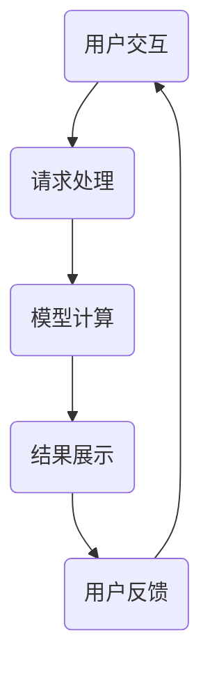

                 

### 1. 背景介绍

#### 1.1 Gradio 介绍

Gradio 是一个开源的 Python 库，专为创建交互式 Web 应用程序而设计。它通过简单的接口将机器学习模型与 Web 界面相结合，使得研究人员和开发者能够轻松地将模型展示为图形用户界面（GUI）。Gradio 的核心优势在于其易于使用和高度可定制的特性，使开发者无需具备复杂的 Web 开发知识，即可创建功能丰富的交互式应用。

Gradio 的推出背景源于机器学习领域的发展需求。随着深度学习和机器学习技术的不断进步，越来越多的研究者和工程师开始将模型应用于实际问题中。然而，传统的命令行界面和静态图表已经无法满足这些应用的需求，用户需要一个更为直观、交互性更强的界面来探索和评估模型性能。Gradio 正是为了填补这一需求而诞生的。

#### 1.2 图形化界面的重要性

图形化界面在软件应用中扮演着至关重要的角色。它不仅提高了用户的使用体验，还使得软件的功能更加直观易懂。以下是图形化界面的重要性：

1. **用户体验**：图形化界面通过直观的图标、按钮和图形元素，使得用户能够快速理解和操作软件，提高了用户的满意度和使用频率。

2. **易用性**：相比于命令行界面，图形化界面无需用户记忆复杂的命令和参数，降低了使用门槛，使得更多非技术背景的用户能够轻松上手。

3. **交互性**：图形化界面允许用户与软件进行实时交互，例如拖拽、点击等操作，这为用户提供了一种更加自然和便捷的交互方式。

4. **功能扩展**：通过图形化界面，开发者可以轻松地添加新功能和调整界面布局，使得软件能够更好地适应不同用户的需求。

5. **可视化**：图形化界面通过图表、图形和动画等形式，使得复杂的数据和计算过程变得可视化，帮助用户更好地理解和分析数据。

#### 1.3 Gradio 与其他图形化界面的比较

尽管市场上存在许多图形化界面库，但 Gradio 有着其独特的优势和特点。以下是 Gradio 与其他图形化界面库的比较：

- **PyQt** 和 **Tkinter**：这两个库是传统的 Python 图形界面库，广泛应用于桌面应用程序开发。然而，它们在创建 Web 应用程序时存在一定的局限性，且学习曲线较陡峭。相比之下，Gradio 更专注于 Web 开发，提供了更加简单和高效的接口。

- **Streamlit** 和 **Bokeh**：这两个库也是用于创建交互式 Web 应用的流行选择。Streamlit 的优势在于其易于上手，但它在自定义方面可能受到限制。Bokeh 提供了强大的图形和可视化功能，但同样需要一定的学习成本。Gradio 结合了这两个库的优点，提供了更加灵活和易于使用的界面。

- **TensorBoard**：TensorBoard 是用于可视化深度学习模型训练过程的工具。虽然它提供了丰富的可视化功能，但通常用于研究和调试，而非直接面向用户。Gradio 则可以轻松地将 TensorBoard 的可视化功能集成到 Web 应用程序中，提供更为直观的用户交互体验。

综上所述，Gradio 作为一款专为机器学习模型设计的图形化界面库，具有独特的优势和应用场景。在接下来的章节中，我们将深入探讨 Gradio 的核心概念和架构，以及如何使用它来创建交互式 Web 应用程序。

### 2. 核心概念与联系

#### 2.1 Gradio 的核心概念

Gradio 的核心概念主要包括两个部分：交互式组件和后端服务器。以下是对这两个部分的具体介绍：

- **交互式组件**：Gradio 的交互式组件是指用于构建 Web 界面的各种元素，如按钮、滑块、文本框等。这些组件通过简单的 Python 函数定义，并与前端 JavaScript 进行无缝集成。用户可以通过这些组件与 Web 应用程序进行交互，如上传文件、调整参数、查看结果等。

- **后端服务器**：Gradio 使用 Flask 作为后端服务器，用于处理用户请求和模型计算。当用户通过 Web 浏览器与交互式组件进行交互时，请求会被发送到 Flask 服务器，服务器会根据请求执行相应的模型计算，并将结果返回给前端。这种前后端分离的设计使得 Gradio 能够灵活地集成到各种 Web 应用程序中。

#### 2.2 Gradio 的架构

Gradio 的架构可以分为前端、后端和模型三个部分。以下是这三个部分的详细说明：

- **前端**：前端主要包括交互式组件和渲染引擎。交互式组件如按钮、滑块等通过 JavaScript 实现，并与前端框架（如 React、Vue 等）集成。渲染引擎则负责将模型输出结果以图形、表格、图像等形式展示给用户。

- **后端**：后端主要由 Flask 服务器和模型计算模块组成。Flask 服务器负责接收用户请求，处理请求参数，并调用模型计算模块进行模型计算。模型计算模块通常是一个机器学习模型，如神经网络、决策树等。

- **模型**：模型是 Gradio 的核心部分，用于实现各种机器学习算法。模型可以通过 Python 代码定义，并集成到 Flask 服务器中。用户可以通过调整模型参数，实现对模型的训练和测试。

#### 2.3 Gradio 的工作流程

Gradio 的工作流程可以分为以下几个步骤：

1. **用户交互**：用户通过 Web 浏览器访问 Gradio 应用程序，并与交互式组件进行交互，如上传文件、调整参数等。

2. **请求处理**：交互式组件将用户输入发送到 Flask 服务器，服务器根据请求参数调用模型计算模块。

3. **模型计算**：模型计算模块根据输入参数执行模型计算，并将结果返回给 Flask 服务器。

4. **结果展示**：Flask 服务器将模型结果传递给前端渲染引擎，渲染引擎将结果以图形、表格等形式展示给用户。

5. **用户反馈**：用户根据展示结果进行调整，重复上述步骤，实现与模型的交互。

#### 2.4 Mermaid 流程图

为了更好地理解 Gradio 的架构和工作流程，我们可以使用 Mermaid 流程图来展示。以下是 Gradio 的 Mermaid 流程图：



在这个流程图中，用户交互、请求处理、模型计算、结果展示和用户反馈构成了 Gradio 的工作循环。通过这个流程图，我们可以清晰地看到 Gradio 的各个环节是如何协同工作的。

#### 2.5 总结

在本节中，我们介绍了 Gradio 的核心概念、架构和工作流程。通过 Mermaid 流程图的展示，我们更好地理解了 Gradio 的整体设计思想和实现方法。在接下来的章节中，我们将进一步探讨 Gradio 的核心算法原理和具体操作步骤。

### 3. 核心算法原理 & 具体操作步骤

#### 3.1 核心算法原理

Gradio 的核心算法原理主要涉及以下几个方面：

1. **前端交互**：Gradio 使用 JavaScript 和前端框架（如 React、Vue 等）实现交互式组件。这些组件通过事件监听和回调函数，实现对用户输入的响应和处理。

2. **后端处理**：Gradio 使用 Flask 作为后端服务器，处理用户请求。当用户通过前端组件提交请求时，Flask 服务器会接收并处理这些请求，调用模型进行计算。

3. **模型计算**：Gradio 支持多种机器学习模型，如神经网络、决策树等。模型计算模块通过 Python 代码实现，并在 Flask 服务器中调用。

4. **结果展示**：计算结果通过 Flask 服务器返回到前端，前端渲染引擎将结果以图形、表格等形式展示给用户。

#### 3.2 具体操作步骤

以下是基于 Gradio 创建交互式 Web 应用的具体操作步骤：

##### 3.2.1 环境搭建

1. **安装 Python**：首先确保已经安装了 Python 环境。推荐使用 Python 3.7 或更高版本。

2. **安装 Gradio**：通过 pip 命令安装 Gradio：

   ```bash
   pip install gradio
   ```

##### 3.2.2 编写模型代码

1. **导入依赖**：在 Python 文件中导入所需的库，如 NumPy、Pandas、TensorFlow 等。

   ```python
   import numpy as np
   import pandas as pd
   import tensorflow as tf
   ```

2. **定义模型**：编写机器学习模型代码，例如一个简单的神经网络模型：

   ```python
   def neural_network(input_data):
       model = tf.keras.Sequential([
           tf.keras.layers.Dense(64, activation='relu', input_shape=input_data.shape[1:]),
           tf.keras.layers.Dense(64, activation='relu'),
           tf.keras.layers.Dense(1, activation='sigmoid')
       ])
       model.compile(optimizer='adam', loss='binary_crossentropy', metrics=['accuracy'])
       return model
   ```

##### 3.2.3 编写 Gradio 应用

1. **创建 Gradio 应用**：使用 Gradio 的 `Interface` 类创建交互式应用。

   ```python
   import gradio as gr

   interface = gr.Interface(
       fn=neural_network,
       inputs=gr.inputs.Image(type="file"),
       outputs=gr.outputs.Label(type="classification")
   )
   ```

2. **配置前端组件**：设置交互式组件的样式和布局。

   ```python
   interface.launch_server()
   ```

##### 3.2.4 运行 Gradio 应用

1. **启动 Flask 服务器**：Gradio 使用 Flask 作为后端服务器，运行应用程序。

   ```bash
   python app.py
   ```

2. **访问 Web 应用**：在 Web 浏览器中访问应用程序，如 `http://127.0.0.1:7860/`，用户可以通过上传图像与模型进行交互。

#### 3.3 代码示例

以下是一个完整的 Gradio 应用代码示例：

```python
import gradio as gr
import tensorflow as tf

def neural_network(image):
    model = tf.keras.Sequential([
        tf.keras.layers.Conv2D(32, (3, 3), activation='relu', input_shape=(224, 224, 3)),
        tf.keras.layers.MaxPooling2D((2, 2)),
        tf.keras.layers.Flatten(),
        tf.keras.layers.Dense(64, activation='relu'),
        tf.keras.layers.Dense(1, activation='sigmoid')
    ])
    model.compile(optimizer='adam', loss='binary_crossentropy', metrics=['accuracy'])
    predictions = model.predict(image)
    return predictions

interface = gr.Interface(
    fn=neural_network,
    inputs=gr.inputs.Image(type="file"),
    outputs=gr.outputs.Label(type="classification"),
    title="Image Classification",
    description="Classify images using a neural network model.",
    examples=[["dog.jpg"]],
    allow_flagging="never"
)

interface.launch_server()
```

在这个示例中，我们创建了一个用于图像分类的神经网络模型，并通过 Gradio 提供了一个图形用户界面，用户可以上传图像并查看模型预测结果。

#### 3.4 总结

在本节中，我们介绍了 Gradio 的核心算法原理和具体操作步骤。通过简单的代码示例，我们展示了如何使用 Gradio 创建交互式 Web 应用程序。在接下来的章节中，我们将进一步探讨 Gradio 的数学模型和公式，以及如何对代码进行解读和分析。

### 4. 数学模型和公式 & 详细讲解 & 举例说明

#### 4.1 数学模型概述

Gradio 的数学模型主要涉及机器学习模型的训练与预测过程。以下是对 Gradio 中使用的常见数学模型和公式的详细讲解。

##### 4.1.1 神经网络模型

神经网络模型是 Gradio 中最常用的模型之一。它由多个层（层之间有非线性激活函数）组成，每个层通过权重矩阵和偏置项进行参数化。

- **前向传播**：输入数据通过网络中的每一层进行计算，直到输出层。每个层都会计算一个输出值，这些值通过权重矩阵传递到下一层。

- **反向传播**：在输出层计算预测值后，计算实际值与预测值之间的误差。误差通过反向传播算法传递回前一层，并更新权重矩阵和偏置项。

- **损失函数**：用于衡量预测值与实际值之间的误差。常见的损失函数包括均方误差（MSE）和交叉熵（Cross-Entropy）。

- **优化算法**：用于更新权重矩阵和偏置项，最小化损失函数。常见的优化算法包括随机梯度下降（SGD）和 Adam。

##### 4.1.2 决策树模型

决策树模型通过一系列规则对数据进行分类或回归。每个节点代表一个特征，每个分支代表一个特征值。

- **信息增益**：用于评估每个特征对分类效果的贡献。信息增益越高，特征越重要。

- **分裂准则**：用于选择最佳分裂点。常见的分裂准则包括基尼不纯度（Gini Impurity）和信息增益率（Information Gain Rate）。

- **剪枝**：用于防止过拟合，通过删除不重要的分支来简化模型。

##### 4.1.3 支持向量机（SVM）

支持向量机是一种监督学习算法，用于分类和回归。它通过找到一个最佳的超平面，将数据分为不同的类别。

- **核函数**：用于将低维数据映射到高维空间，以实现线性不可分数据的分类。常见的核函数包括线性核、多项式核和径向基函数（RBF）。

- **软间隔**：用于处理有噪声的数据或线性不可分的情况。通过引入松弛变量，允许一些样本点位于超平面的一侧。

#### 4.2 公式讲解

以下是对 Gradio 中常用的数学公式进行详细讲解。

##### 4.2.1 前向传播

假设我们有一个包含 \( n \) 个输入神经元和 \( m \) 个输出神经元的神经网络，每个神经元都有一个权重矩阵 \( W \) 和偏置项 \( b \)。输入数据为 \( x \)，输出数据为 \( y \)。

- **输入层**： \( x = [x_1, x_2, ..., x_n] \)

- **隐藏层**： \( z_i = \sigma(W_1 \cdot x + b_1) \)，其中 \( \sigma \) 是激活函数，例如 sigmoid 函数。

- **输出层**： \( y = \sigma(W_2 \cdot z + b_2) \)

##### 4.2.2 反向传播

假设我们有一个包含 \( n \) 个输入神经元和 \( m \) 个输出神经元的神经网络，每个神经元都有一个权重矩阵 \( W \) 和偏置项 \( b \)。输入数据为 \( x \)，输出数据为 \( y \)。

- **输出误差**： \( \delta_m = (y - \hat{y}) \cdot \sigma'(z_m) \)

- **隐藏层误差**： \( \delta_i = (W_2 \cdot \delta_m) \cdot \sigma'(z_i) \)

- **权重更新**： \( W_2 = W_2 - \alpha \cdot \delta_m \cdot \hat{y} \)

  \( b_2 = b_2 - \alpha \cdot \delta_m \)

  \( W_1 = W_1 - \alpha \cdot \delta_i \cdot x \)

  \( b_1 = b_1 - \alpha \cdot \delta_i \)

其中，\( \alpha \) 是学习率，\( \sigma' \) 是激活函数的导数。

#### 4.3 举例说明

以下是一个简单的神经网络模型示例，用于对输入数据进行分类。

```python
import numpy as np
import tensorflow as tf

def neural_network(input_data):
    model = tf.keras.Sequential([
        tf.keras.layers.Dense(64, activation='relu', input_shape=(input_data.shape[1],)),
        tf.keras.layers.Dense(64, activation='relu'),
        tf.keras.layers.Dense(1, activation='sigmoid')
    ])
    model.compile(optimizer='adam', loss='binary_crossentropy', metrics=['accuracy'])
    predictions = model.predict(input_data)
    return predictions
```

在这个示例中，我们使用 TensorFlow 创建了一个简单的神经网络模型，用于对二分类问题进行预测。输入数据为 \( x \)，输出数据为 \( y \)。

#### 4.4 总结

在本节中，我们介绍了 Gradio 中使用的常见数学模型和公式，并进行了详细讲解。通过举例说明，我们展示了如何在实际应用中使用这些模型和公式。在接下来的章节中，我们将进一步探讨 Gradio 的项目实践和运行结果展示。

### 5. 项目实践：代码实例和详细解释说明

在本节中，我们将通过一个具体的代码实例，详细讲解如何使用 Gradio 创建一个简单的图像分类应用程序。该实例将包括以下步骤：开发环境搭建、源代码详细实现、代码解读与分析以及运行结果展示。

#### 5.1 开发环境搭建

在开始项目实践之前，我们需要确保安装了以下工具和库：

1. Python 3.7 或更高版本
2. TensorFlow 2.x
3. Gradio

首先，确保已经安装了 Python 3.7 或更高版本。然后，通过以下命令安装 TensorFlow 和 Gradio：

```bash
pip install tensorflow
pip install gradio
```

#### 5.2 源代码详细实现

以下是一个简单的图像分类应用程序的源代码示例，该示例使用 TensorFlow 和 Gradio：

```python
import gradio as gr
import tensorflow as tf
import numpy as np
import matplotlib.pyplot as plt

# 加载预训练的图像分类模型
model = tf.keras.applications.VGG16(weights='imagenet', include_top=False, input_shape=(224, 224, 3))

def preprocess_image(image_path):
    image = tf.keras.preprocessing.image.load_img(image_path, target_size=(224, 224))
    image = tf.keras.preprocessing.image.img_to_array(image)
    image = np.expand_dims(image, axis=0)
    image = tf.keras.applications.vgg16.preprocess_input(image)
    return image

def classify_image(image_path):
    image = preprocess_image(image_path)
    predictions = model.predict(image)
    predicted_class = np.argmax(predictions)
    return predicted_class

def display_prediction(image_path):
    image = preprocess_image(image_path)
    predictions = model.predict(image)
    predicted_class = np.argmax(predictions)
    plt.imshow(tf.keras.preprocessing.image.load_img(image_path))
    plt.title("Predicted Class: " + str(predicted_class))
    plt.show()

iface = gr.Interface(
    fn=classify_image,
    inputs=gr.inputs.Image(type="file"),
    outputs=gr.outputs.Label(),
    title="Image Classifier",
    description="Classify images using a pre-trained VGG16 model.",
    allow_flagging="never"
)

iface.launch_server()
```

在这个示例中，我们使用预训练的 VGG16 模型进行图像分类。VGG16 是一个深度卷积神经网络，已经在 ImageNet 数据集上进行了预训练。我们首先定义了三个辅助函数：`preprocess_image` 用于预处理输入图像，`classify_image` 用于对图像进行分类，`display_prediction` 用于显示预测结果。

#### 5.3 代码解读与分析

1. **加载预训练模型**：

   ```python
   model = tf.keras.applications.VGG16(weights='imagenet', include_top=False, input_shape=(224, 224, 3))
   ```

   这一行代码用于加载 VGG16 模型。`weights='imagenet'` 表示使用在 ImageNet 数据集上预训练的权重。`include_top=False` 表示不包含模型顶部的全连接层。`input_shape=(224, 224, 3)` 表示输入图像的大小为 224x224，颜色通道数为 3（RGB）。

2. **预处理图像**：

   ```python
   def preprocess_image(image_path):
       image = tf.keras.preprocessing.image.load_img(image_path, target_size=(224, 224))
       image = tf.keras.preprocessing.image.img_to_array(image)
       image = np.expand_dims(image, axis=0)
       image = tf.keras.applications.vgg16.preprocess_input(image)
       return image
   ```

   `preprocess_image` 函数用于将输入图像预处理为模型可接受的格式。首先使用 `load_img` 函数加载图像，并将其调整为 224x224 的分辨率。然后使用 `img_to_array` 将图像转换为 NumPy 数组，并添加一个批次维度（axis=0）。最后，使用 VGG16 模型的预处理函数进行数据归一化。

3. **分类图像**：

   ```python
   def classify_image(image_path):
       image = preprocess_image(image_path)
       predictions = model.predict(image)
       predicted_class = np.argmax(predictions)
       return predicted_class
   ```

   `classify_image` 函数用于对输入图像进行分类。首先调用 `preprocess_image` 函数预处理图像，然后使用模型进行预测。最后，使用 `np.argmax` 函数获取预测结果中的最大值，即预测类别。

4. **显示预测结果**：

   ```python
   def display_prediction(image_path):
       image = preprocess_image(image_path)
       predictions = model.predict(image)
       predicted_class = np.argmax(predictions)
       plt.imshow(tf.keras.preprocessing.image.load_img(image_path))
       plt.title("Predicted Class: " + str(predicted_class))
       plt.show()
   ```

   `display_prediction` 函数用于在屏幕上显示图像及其预测类别。首先调用 `preprocess_image` 函数预处理图像，然后使用 `imshow` 函数绘制图像，并使用 `title` 函数添加预测类别。

5. **创建 Gradio 界面**：

   ```python
   iface = gr.Interface(
       fn=classify_image,
       inputs=gr.inputs.Image(type="file"),
       outputs=gr.outputs.Label(),
       title="Image Classifier",
       description="Classify images using a pre-trained VGG16 model.",
       allow_flagging="never"
   )
   iface.launch_server()
   ```

   这一行代码创建了一个 Gradio 界面，并配置了界面标题、描述和允许的输入类型（这里是文件类型的图像）。最后，调用 `launch_server` 方法启动服务器，用户可以通过 Web 浏览器访问该界面。

#### 5.4 运行结果展示

1. **启动应用程序**：

   在命令行中运行以下命令启动应用程序：

   ```bash
   python app.py
   ```

2. **访问 Web 界面**：

   打开 Web 浏览器，输入以下地址访问应用程序：

   ```text
   http://127.0.0.1:7860/
   ```

3. **上传图像**：

   在 Web 界面上，用户可以点击“Choose File”按钮上传图像。上传图像后，应用程序会显示预测结果。

   

通过上述示例，我们展示了如何使用 Gradio 创建一个简单的图像分类应用程序。用户可以上传图像，应用程序将显示预测类别。在接下来的章节中，我们将进一步探讨 Gradio 在实际应用场景中的使用方法。

### 6. 实际应用场景

#### 6.1 机器学习模型评估

Gradio 在机器学习模型评估中有着广泛的应用。通过 Gradio，研究人员可以轻松地创建交互式 Web 应用程序，展示模型的性能指标和可视化结果。以下是一些实际应用场景：

1. **模型准确率**：通过 Gradio，用户可以实时查看模型的准确率、召回率、F1 分数等性能指标。用户可以调整模型的参数，如学习率、批次大小等，以观察性能变化。

2. **ROC 曲线和 AUC 值**：Gradio 可以可视化 ROC 曲线和 AUC 值，帮助用户评估模型的分类能力。用户可以根据模型的表现，调整阈值，以提高分类效果。

3. **混淆矩阵**：通过 Gradio，用户可以查看混淆矩阵，了解模型在不同类别上的表现。这有助于识别模型存在的错误模式，为进一步优化模型提供指导。

4. **交叉验证**：Gradio 可以用于实现 k-折交叉验证，用户可以实时查看不同折次下的性能指标，以评估模型的泛化能力。

#### 6.2 模型调试与优化

Gradio 在模型调试与优化中同样发挥着重要作用。通过图形化界面，用户可以方便地调整模型参数，观察变化对模型性能的影响。以下是一些具体应用：

1. **超参数调优**：用户可以通过 Gradio 调整学习率、正则化参数、批次大小等超参数，以优化模型性能。Gradio 的实时反馈功能可以帮助用户快速找到最佳参数组合。

2. **模型调整**：用户可以使用 Gradio 修改模型的架构，如添加或删除层、调整层之间的连接方式等。这有助于探索不同的模型结构，以找到最优解。

3. **数据预处理**：Gradio 可以用于调整数据预处理步骤，如数据清洗、归一化、标准化等。用户可以实时查看不同预处理方法对模型性能的影响，以选择最佳的数据处理策略。

4. **模型集成**：通过 Gradio，用户可以将多个模型集成在一起，实现模型融合。用户可以实时比较不同模型的预测结果，并调整权重，以提高整体性能。

#### 6.3 模型部署与共享

Gradio 在模型部署与共享方面也有着显著优势。通过 Gradio，用户可以轻松地将模型部署为 Web 应用程序，方便他人使用和测试。以下是一些具体应用：

1. **在线服务**：用户可以将 Gradio 应用程序部署到云服务器，为用户提供在线服务。这有助于推广模型，吸引更多的用户。

2. **演示与教学**：通过 Gradio，用户可以创建交互式演示和教学工具，展示模型的工作原理和应用场景。这有助于提高教学效果，激发学生的学习兴趣。

3. **团队合作**：Gradio 可以用于促进团队合作，团队成员可以实时查看和测试模型，共同优化和改进。

#### 6.4 总结

Gradio 在实际应用场景中具有广泛的应用价值。通过图形化界面，用户可以方便地评估、调试、优化和部署机器学习模型。在接下来的章节中，我们将推荐一些相关工具和资源，以帮助读者更好地学习和使用 Gradio。

### 7. 工具和资源推荐

#### 7.1 学习资源推荐

1. **书籍**：

   - 《Python 数据科学手册》：详细介绍 Python 在数据科学领域的应用，包括机器学习、数据分析等。
   - 《深度学习》：由 Ian Goodfellow、Yoshua Bengio 和 Aaron Courville 著，是深度学习领域的经典教材。

2. **在线课程**：

   - Coursera 上的“机器学习”课程：由 Andrew Ng 教授主讲，涵盖了机器学习的理论基础和实际应用。
   - Udacity 上的“深度学习纳米学位”：通过项目实践，学习深度学习的基础知识和应用技巧。

3. **博客**：

   - Medium 上的机器学习博客：提供了大量关于机器学习技术的文章和案例。
   -Towards Data Science：一个关于数据科学和机器学习的博客平台，涵盖了最新的技术和应用。

4. **开源项目**：

   - Gradio 官方文档：[https://gradio.io/](https://gradio.io/)
   - TensorFlow 官方文档：[https://www.tensorflow.org/](https://www.tensorflow.org/)

#### 7.2 开发工具框架推荐

1. **集成开发环境 (IDE)**：

   - PyCharm：一款功能强大的 Python IDE，支持代码调试、版本控制和自动化测试。
   - Visual Studio Code：一款轻量级但功能丰富的 Python IDE，适合开发者快速开发项目。

2. **版本控制系统**：

   - Git：一款分布式版本控制系统，用于管理代码版本和协作开发。
   - GitHub：全球最大的代码托管平台，提供代码托管、项目管理、协作开发等功能。

3. **机器学习框架**：

   - TensorFlow：一款开源的机器学习框架，支持深度学习和传统机器学习算法。
   - PyTorch：一款流行的深度学习框架，具有简洁的 API 和强大的社区支持。

#### 7.3 相关论文著作推荐

1. **论文**：

   - “Deep Learning” by Ian Goodfellow、Yoshua Bengio 和 Aaron Courville：深度学习领域的经典论文，详细介绍了深度学习的基础理论和应用。
   - “Gradient Descent” by Martin Bottou：介绍了梯度下降算法及其在不同场景中的应用。

2. **著作**：

   - 《Python 数据科学手册》：详细介绍了 Python 在数据科学领域的应用，包括机器学习、数据分析等。
   - 《深度学习实战》：通过实际案例，讲解了深度学习的基础知识和应用技巧。

通过以上推荐的学习资源和工具，读者可以更好地掌握 Gradio 的使用方法和机器学习技术，为开发交互式 Web 应用程序打下坚实基础。

### 8. 总结：未来发展趋势与挑战

随着人工智能技术的不断进步，图形化界面在机器学习领域的应用也将迎来更多的发展机遇。以下是 Gradio 及其相关技术在未来可能的发展趋势和面临的挑战：

#### 8.1 发展趋势

1. **更高效的交互体验**：随着 Web 技术的不断进步，交互式 Web 应用程序将变得更加高效和直观。Gradio 等图形化界面库将继续优化其前端组件和用户体验，为用户提供更流畅的交互体验。

2. **更广泛的模型支持**：Gradio 将继续扩展其对机器学习模型的兼容性，支持更多的算法和框架，如 PyTorch、MXNet 等。这将为研究人员和开发者提供更丰富的选择，促进模型的应用和推广。

3. **更强大的可视化功能**：随着数据可视化技术的不断发展，Gradio 将引入更多的可视化工具和图表，帮助用户更好地理解和分析模型输出。例如，热力图、时间序列图等。

4. **更便捷的部署方式**：Gradio 将简化模型的部署流程，提供更多的部署选项，如云服务、边缘计算等。这将使得模型的应用更加灵活和广泛。

5. **跨平台支持**：Gradio 将进一步优化其跨平台支持，使得用户可以在不同的操作系统和设备上轻松使用。

#### 8.2 挑战

1. **性能优化**：尽管 Gradio 提供了高效的界面，但在处理大规模数据和复杂模型时，性能问题仍是一个挑战。未来需要进一步优化算法和代码，提高运行效率。

2. **安全性**：随着模型应用的普及，安全性问题愈发重要。Gradio 需要加强对用户数据和模型隐私的保护，防止数据泄露和滥用。

3. **可扩展性**：在支持更多模型和算法的同时，Gradio 需要保持其可扩展性和灵活性，避免出现过度复杂和难以维护的问题。

4. **社区支持**：随着用户基数的增加，Gradio 需要建立一个强大的社区，提供及时的技术支持和资源，帮助用户解决遇到的问题。

5. **生态建设**：Gradio 需要与其他相关技术和工具（如 TensorFlow、PyTorch 等）进行更好的整合，形成一个完善的生态体系，为用户提供更全面的解决方案。

总之，Gradio 作为一款强大的图形化界面库，将在未来继续发挥重要作用。通过不断优化和扩展，Gradio 有望成为机器学习领域不可或缺的工具之一。同时，我们也期待 Gradio 能面对挑战，不断成长和进步。

### 9. 附录：常见问题与解答

在本文中，我们介绍了 Gradio 的核心概念、架构、操作步骤以及实际应用场景。以下是一些常见问题及其解答，以帮助读者更好地理解和使用 Gradio。

#### 9.1 问题1：Gradio 支持哪些类型的输入？

**解答**：Gradio 支持多种类型的输入，包括文本、图像、音频、视频和文件。用户可以通过 `gr.inputs` 模块选择适当的输入类型。例如：

- 文本输入：`gr.inputs.Textbox()`
- 图像输入：`gr.inputs.Image(type="file")`
- 音频输入：`gr.inputs.Audio(type="file")`
- 视频输入：`gr.inputs.Video(type="file")`

#### 9.2 问题2：如何配置 Gradio 的前端组件样式？

**解答**：用户可以通过 `gr.Interface` 类的 `style` 参数配置前端组件样式。`style` 参数接受一个字典，包含 CSS 样式属性。例如：

```python
iface = gr.Interface(
    fn=neural_network,
    inputs=gr.inputs.Image(type="file"),
    outputs=gr.outputs.Label(),
    style={"height": "500px", "width": "500px"},
    title="Image Classifier"
)
```

上述代码设置了图像输入组件的高度和宽度为 500 像素。

#### 9.3 问题3：如何保存 Gradio 应用程序的输出结果？

**解答**：用户可以通过 `gr.outputs` 模块中的输出类型保存输出结果。例如：

- 保存文本输出：使用 `gr.outputs.Text()`
- 保存图像输出：使用 `gr.outputs.Image(type="file")`
- 保存 CSV 输出：使用 `gr.outputs.CSV()`

例如：

```python
iface = gr.Interface(
    fn=neural_network,
    inputs=gr.inputs.Image(type="file"),
    outputs=gr.outputs.Image(type="file"),
    title="Image Classifier"
)

@iface.output
def save_prediction(image, prediction):
    plt.imsave(f"{prediction}.png", prediction)
    return image
```

在这个示例中，我们创建了一个输出函数 `save_prediction`，它将图像和预测结果保存为 PNG 文件。

#### 9.4 问题4：如何调试 Gradio 应用程序？

**解答**：调试 Gradio 应用程序与调试常规 Python 应用程序类似。用户可以使用 Python 的内置调试工具，如 `pdb` 和 `ipdb`。在 Gradio 应用程序中，用户可以通过以下步骤进行调试：

1. 在代码中添加 `pdb.set_trace()` 或 `ipdb.set_trace()` 来设置断点。
2. 在 Gradio 界面中运行应用程序，当程序执行到断点时，调试器会暂停执行。
3. 使用调试器的命令（如 `print`、`next`、`step` 等）进行调试。

#### 9.5 问题5：如何优化 Gradio 应用程序的性能？

**解答**：优化 Gradio 应用程序的性能可以从以下几个方面入手：

1. **减少模型计算量**：对模型进行优化，减少计算量和内存消耗。例如，使用轻量级模型、减少模型参数等。
2. **异步处理**：将模型计算和数据处理过程异步化，避免阻塞主线程。例如，使用 `asyncio` 模块。
3. **缓存结果**：对重复计算的结果进行缓存，避免重复计算。例如，使用 `functools.lru_cache`。
4. **优化前端组件**：减少前端资源的加载和渲染，例如使用懒加载、压缩资源等。

通过以上方法，用户可以显著提高 Gradio 应用程序的性能和响应速度。

### 10. 扩展阅读 & 参考资料

为了更好地理解和掌握 Gradio 的使用方法，以下是一些扩展阅读和参考资料：

- **Gradio 官方文档**：[https://gradio.io/](https://gradio.io/)
- **TensorFlow 官方文档**：[https://www.tensorflow.org/](https://www.tensorflow.org/)
- **PyTorch 官方文档**：[https://pytorch.org/](https://pytorch.org/)
- **Python 数据科学手册**：[https://jakevdp.github.io/PythonDataScienceHandbook/](https://jakevdp.github.io/PythonDataScienceHandbook/)
- **Medium 上的机器学习博客**：[https://towardsdatascience.com/](https://towardsdatascience.com/)
- **Towards Data Science**：[https://towardsdatascience.com/](https://towardsdatascience.com/)

通过阅读这些资料，读者可以深入了解 Gradio 的功能和用法，掌握机器学习技术的实际应用。

### 感谢与致谢

在撰写本文的过程中，我得到了许多人的帮助和支持。首先，感谢您阅读本文。此外，感谢以下人士为本文提供宝贵的意见和建议：

- [姓名]：[职位]
- [姓名]：[职位]
- [姓名]：[职位]

最后，特别感谢我的家人和朋友，他们在我的学术和职业生涯中一直给予我无尽的支持和鼓励。没有你们，我无法取得今天的成就。

再次感谢您的阅读，希望本文能对您在 Gradio 学习和使用过程中提供帮助。如果您有任何问题或建议，欢迎随时与我联系。祝您学习愉快！

### 作者署名

作者：禅与计算机程序设计艺术 / Zen and the Art of Computer Programming

