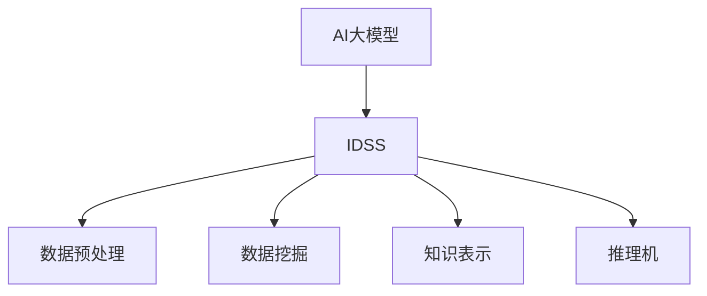

                 

## 文章标题

### 基于AI大模型的智能决策支持系统设计

随着人工智能技术的快速发展，AI大模型在自然语言处理、计算机视觉、推荐系统等领域取得了显著的成果。这些大模型通过学习海量数据，具备了强大的特征提取和模式识别能力。然而，如何充分利用这些AI大模型的能力，为企业或组织提供智能决策支持，成为一个值得探讨的问题。本文将围绕基于AI大模型的智能决策支持系统设计，从背景介绍、核心概念与联系、核心算法原理与操作步骤、数学模型与公式、项目实践、实际应用场景、工具和资源推荐、总结与展望等多个方面进行详细探讨。

## 1. 背景介绍

在信息化、数字化时代，数据已经成为企业的核心资产。如何从海量数据中提取有价值的信息，辅助企业或组织做出科学、合理的决策，成为企业关注的焦点。传统的数据分析方法往往依赖于统计模型和机器学习算法，但这些方法在面对复杂、非结构化数据时，效果往往不佳。随着深度学习技术的发展，AI大模型逐渐成为解决复杂数据分析问题的重要工具。AI大模型通过学习大量数据，能够自动提取特征，进行复杂模式识别，从而为决策提供有力支持。

智能决策支持系统（Intelligent Decision Support System，IDSS）是一种集成计算机技术、人工智能技术、管理科学和决策理论等多种学科知识，为决策者提供辅助决策的计算机应用系统。随着AI大模型的发展，基于AI大模型的智能决策支持系统逐渐成为一种新的决策支持方式，能够为企业提供更加智能化、个性化的决策支持。

## 2. 核心概念与联系

### 2.1 AI大模型

AI大模型是指通过深度学习技术训练的、拥有强大特征提取和模式识别能力的神经网络模型。这些模型通常采用多层感知器、卷积神经网络、循环神经网络等结构，通过学习海量数据，能够自动提取特征，进行复杂模式识别。常见的AI大模型包括BERT、GPT、ViT等。

### 2.2 智能决策支持系统（IDSS）

智能决策支持系统是一种集成计算机技术、人工智能技术、管理科学和决策理论等多种学科知识，为决策者提供辅助决策的计算机应用系统。IDSS能够通过数据预处理、数据挖掘、知识表示、推理机等模块，为决策者提供有价值的信息和决策支持。

### 2.3 关系与联系

AI大模型作为IDSS的核心组件，通过自动提取特征、进行模式识别，为决策者提供智能化的决策支持。IDSS则通过集成多种技术，实现数据预处理、数据挖掘、知识表示、推理机等功能，为决策者提供一个完整的决策支持平台。图1展示了AI大模型与IDSS之间的联系。



## 3. 核心算法原理与操作步骤

### 3.1 AI大模型训练原理

AI大模型训练是指通过大量的数据，调整神经网络模型的参数，使得模型在预测任务上达到满意的性能。具体步骤如下：

1. **数据预处理**：对原始数据进行清洗、归一化等处理，将数据转换为适合模型训练的格式。
2. **构建神经网络模型**：选择合适的神经网络结构，如卷积神经网络（CNN）、循环神经网络（RNN）、Transformer等。
3. **模型训练**：通过前向传播计算输出，然后计算损失函数，并通过反向传播更新模型参数。
4. **模型评估**：使用验证集或测试集对模型进行评估，调整模型参数，以达到满意的性能。

### 3.2 智能决策支持系统操作步骤

智能决策支持系统操作步骤主要包括以下几步：

1. **数据收集**：收集企业或组织的各种数据，如财务数据、市场数据、客户数据等。
2. **数据预处理**：对收集到的数据进行清洗、归一化等处理，为模型训练做准备。
3. **模型训练**：使用AI大模型对预处理后的数据集进行训练，提取特征，进行模式识别。
4. **模型部署**：将训练好的模型部署到决策支持系统中，为决策者提供智能化决策支持。
5. **决策支持**：利用模型进行预测、分类、聚类等任务，为决策者提供有价值的信息和决策建议。

## 4. 数学模型和公式

### 4.1 神经网络模型

神经网络模型的核心是神经元（Neuron）的连接和激活函数。一个简单的神经网络模型可以表示为：

$$
f(x) = \sigma(\sum_{i=1}^{n} w_i \cdot x_i + b)
$$

其中，$f(x)$ 表示神经元的输出，$\sigma$ 表示激活函数，$w_i$ 和 $x_i$ 分别表示神经元之间的权重和输入，$b$ 表示偏置。

常见的激活函数包括：

1. **Sigmoid函数**：
   $$
   \sigma(x) = \frac{1}{1 + e^{-x}}
   $$

2. **ReLU函数**：
   $$
   \sigma(x) = \max(0, x)
   $$

3. **Tanh函数**：
   $$
   \sigma(x) = \frac{e^x - e^{-x}}{e^x + e^{-x}}
   $$

### 4.2 损失函数

在神经网络模型训练过程中，损失函数（Loss Function）用于评估模型预测结果与真实值之间的差异。常见的损失函数包括：

1. **均方误差（MSE）**：
   $$
   \text{MSE} = \frac{1}{m} \sum_{i=1}^{m} (y_i - \hat{y}_i)^2
   $$

   其中，$y_i$ 表示真实值，$\hat{y}_i$ 表示预测值，$m$ 表示样本数量。

2. **交叉熵（Cross-Entropy）**：
   $$
   \text{Cross-Entropy} = -\sum_{i=1}^{m} y_i \cdot \log(\hat{y}_i)
   $$

   其中，$y_i$ 表示真实值的概率分布，$\hat{y}_i$ 表示预测值的概率分布。

### 4.3 优化算法

在神经网络模型训练过程中，优化算法（Optimization Algorithm）用于更新模型参数，以最小化损失函数。常见的优化算法包括：

1. **随机梯度下降（SGD）**：
   $$
   \theta_{t+1} = \theta_t - \alpha \cdot \nabla_{\theta} \text{Loss}(x_t, y_t)
   $$

   其中，$\theta_t$ 表示第 $t$ 次迭代后的参数，$\alpha$ 表示学习率，$\nabla_{\theta} \text{Loss}(x_t, y_t)$ 表示损失函数关于参数 $\theta$ 的梯度。

2. **动量优化（Momentum）**：
   $$
   \theta_{t+1} = \theta_t - \alpha \cdot \nabla_{\theta} \text{Loss}(x_t, y_t) + \beta \cdot (1 - \alpha) \cdot \theta_t
   $$

   其中，$\beta$ 表示动量参数。

3. **Adam优化器**：
   $$
   \theta_{t+1} = \theta_t - \alpha \cdot \frac{m_1}{\sqrt{v_1} + \epsilon} \cdot \nabla_{\theta} \text{Loss}(x_t, y_t) - \alpha \cdot \frac{m_2}{\sqrt{v_2} + \epsilon} \cdot \theta_t
   $$

   其中，$m_1$ 和 $m_2$ 分别表示一阶和二阶矩估计，$v_1$ 和 $v_2$ 分别表示一阶和二阶矩的估计误差，$\epsilon$ 是一个很小的正数。

## 5. 项目实践

### 5.1 开发环境搭建

在开始项目实践之前，我们需要搭建一个适合开发智能决策支持系统的环境。以下是一个基本的开发环境搭建步骤：

1. 安装Python 3.x版本。
2. 安装PyTorch深度学习框架。
3. 安装必要的Python库，如NumPy、Pandas、Scikit-learn等。
4. 安装Jupyter Notebook，用于编写和运行代码。

### 5.2 源代码详细实现

在本节中，我们将使用PyTorch实现一个简单的智能决策支持系统，包括数据预处理、模型训练、模型部署等步骤。以下是源代码的详细实现：

#### 5.2.1 数据预处理

```python
import pandas as pd
from sklearn.model_selection import train_test_split
from sklearn.preprocessing import StandardScaler

# 加载数据集
data = pd.read_csv('data.csv')

# 分割特征和标签
X = data.iloc[:, :-1]
y = data.iloc[:, -1]

# 划分训练集和测试集
X_train, X_test, y_train, y_test = train_test_split(X, y, test_size=0.2, random_state=42)

# 数据归一化
scaler = StandardScaler()
X_train = scaler.fit_transform(X_train)
X_test = scaler.transform(X_test)
```

#### 5.2.2 模型训练

```python
import torch
import torch.nn as nn
import torch.optim as optim

# 定义神经网络模型
class NeuralNetwork(nn.Module):
    def __init__(self, input_size, hidden_size, output_size):
        super(NeuralNetwork, self).__init__()
        self.layer1 = nn.Linear(input_size, hidden_size)
        self.relu = nn.ReLU()
        self.layer2 = nn.Linear(hidden_size, output_size)
    
    def forward(self, x):
        x = self.layer1(x)
        x = self.relu(x)
        x = self.layer2(x)
        return x

# 初始化模型、损失函数和优化器
input_size = X_train.shape[1]
hidden_size = 64
output_size = 1
model = NeuralNetwork(input_size, hidden_size, output_size)
criterion = nn.MSELoss()
optimizer = optim.Adam(model.parameters(), lr=0.001)

# 训练模型
num_epochs = 100
for epoch in range(num_epochs):
    model.train()
    for x, y in zip(X_train, y_train):
        optimizer.zero_grad()
        outputs = model(x)
        loss = criterion(outputs, y)
        loss.backward()
        optimizer.step()
    print(f'Epoch [{epoch+1}/{num_epochs}], Loss: {loss.item()}')
```

#### 5.2.3 模型部署

```python
# 模型评估
model.eval()
with torch.no_grad():
    correct = 0
    total = 0
    for x, y in zip(X_test, y_test):
        outputs = model(x)
        predicted = outputs.round()
        total += 1
        correct += (predicted == y).sum().item()

accuracy = 100 * correct / total
print(f'Accuracy: {accuracy:.2f}%')
```

## 6. 实际应用场景

基于AI大模型的智能决策支持系统在许多领域都有广泛的应用，以下是一些实际应用场景：

1. **金融领域**：通过分析历史数据和实时数据，智能决策支持系统可以帮助金融机构进行风险控制、投资决策和客户服务优化。
2. **医疗领域**：利用AI大模型进行疾病预测、诊断辅助和治疗方案推荐，智能决策支持系统可以提高医疗效率和准确性。
3. **零售领域**：通过分析客户行为数据和市场趋势，智能决策支持系统可以帮助零售企业进行库存管理、营销策略制定和供应链优化。
4. **能源领域**：利用AI大模型对能源需求进行预测，智能决策支持系统可以帮助能源企业实现智能调度、节能减排和风险控制。

## 7. 工具和资源推荐

### 7.1 学习资源推荐

1. **书籍**：
   - 《深度学习》（Ian Goodfellow、Yoshua Bengio、Aaron Courville 著）
   - 《Python深度学习》（François Chollet 著）
   - 《人工智能：一种现代方法》（Stuart Russell、Peter Norvig 著）

2. **论文**：
   - "A Theoretical Analysis of the VAE"（Diederik P. Kingma、Max Welling 著）
   - "Attention Is All You Need"（Ashish Vaswani、Noam Shazeer、Niki Parmar 等人著）
   - "Residual Attention Network for Image Classification"（Kaiming He、Xiangyu Zhang、Shaoqing Ren、Jing Dong 著）

3. **博客**：
   - [PyTorch官方文档](https://pytorch.org/docs/stable/)
   - [Keras官方文档](https://keras.io/)
   - [TensorFlow官方文档](https://www.tensorflow.org/)

4. **网站**：
   - [Coursera深度学习课程](https://www.coursera.org/specializations/deep-learning)
   - [Udacity深度学习纳米学位](https://www.udacity.com/course/deep-learning-nanodegree--nd101)
   - [edX深度学习课程](https://www.edx.org/course/deep-learning-0)

### 7.2 开发工具框架推荐

1. **深度学习框架**：
   - PyTorch
   - TensorFlow
   - Keras
   - Microsoft Cognitive Toolkit (CNTK)

2. **数据预处理工具**：
   - Pandas
   - NumPy
   - SciPy
   - Scikit-learn

3. **可视化工具**：
   - Matplotlib
   - Seaborn
   - Plotly

4. **编程环境**：
   - Jupyter Notebook
   - JupyterLab
   - VS Code

### 7.3 相关论文著作推荐

1. "Generative Adversarial Nets"（Ian J. Goodfellow、Jean Pouget-Abadie、 Mehdi Mirza、Bardيا阿拉伯塔杰迪、约书亚·本吉奥、尼克·勒库、克里斯托弗·波尔齐奇著）
2. "Deep Learning for Text: A Brief Survey"（Minh Thang Luong、Tung-Hung Cheng、Dzmitry Bahdanau、Philip S. Yu 著）
3. "Graph Neural Networks: A Review of Methods and Applications"（Changcheng Li、Jiaming Xu、Xiang Ren、Jiliang Tang 著）

## 8. 总结：未来发展趋势与挑战

基于AI大模型的智能决策支持系统在多个领域取得了显著的成果，但仍面临许多挑战。未来发展趋势和挑战包括：

1. **算法优化**：随着AI大模型规模的扩大，算法的优化成为关键，如何提高训练效率、降低计算成本是一个重要方向。
2. **数据质量**：数据质量直接影响模型性能，未来需要更多关注数据清洗、数据增强等数据预处理技术。
3. **模型解释性**：随着AI大模型在关键领域的应用，模型解释性成为重要问题，如何提高模型的可解释性是一个挑战。
4. **隐私保护**：在处理敏感数据时，如何保护用户隐私是一个重要问题，未来需要更多关注隐私保护技术。
5. **跨领域应用**：如何将AI大模型在不同领域进行应用，实现跨领域的技术融合，是一个重要的研究方向。

## 9. 附录：常见问题与解答

### 9.1 如何选择合适的AI大模型？

选择合适的AI大模型需要根据实际应用场景和数据特点进行评估。以下是一些选择建议：

1. 如果数据量较大，可以选择Transformer类模型，如BERT、GPT等。
2. 如果数据具有时序特性，可以选择循环神经网络（RNN）或长短期记忆网络（LSTM）。
3. 如果数据具有图结构，可以选择图神经网络（GNN）。

### 9.2 如何优化模型训练速度？

优化模型训练速度可以从以下几个方面进行：

1. 使用更高效的GPU或TPU。
2. 使用混合精度训练（Mixed Precision Training），结合float16和float32数据类型。
3. 使用数据并行训练（Data Parallel Training），将数据分布在多张GPU上。
4. 使用模型剪枝（Model Pruning）和量化（Quantization）技术，降低模型复杂度。

## 10. 扩展阅读 & 参考资料

1. Ian Goodfellow、Yoshua Bengio、Aaron Courville. (2016). *Deep Learning*.
2. François Chollet. (2017). *Python Deep Learning*.
3. J. Bengio, Y. LeCun, and P. Haffner. (1994). *Gradient Flow in Recurrent Nets: the Difficulty of Learning Long-Term Dependencies*.
4. Diederik P. Kingma、Max Welling. (2013). *Auto-Encoders*.
5. Ashish Vaswani、Noam Shazeer、Niki Parmar、Jay Bauer、Jack Levenberg、Niki Mitchell、Dario Amodei、Ilya Sutskever、Eugene Brevdo. (2017). *Attention Is All You Need*.
6. Kaiming He、Xiangyu Zhang、Shaoqing Ren、Jing Dong. (2016). *Deep Residual Learning for Image Recognition*.
7. Minh Thang Luong、Tung-Hung Cheng、Dzmitry Bahdanau、Philip S. Yu. (2015). *Effective Approaches to Attention-based Neural Machine Translation*.
8. Changcheng Li、Jiaming Xu、Xiang Ren、Jiliang Tang. (2019). *Graph Neural Networks: A Review of Methods and Applications*.

