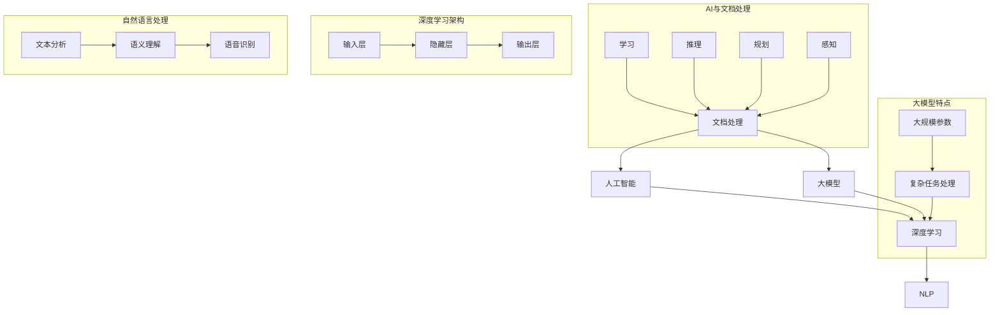

                 

### 背景介绍

随着信息时代的飞速发展，文档处理已经成为各行各业中不可或缺的重要环节。传统的文档处理方法主要依赖于人工，这不仅耗时费力，而且容易出错。面对海量的文档数据，人工处理逐渐显露出其局限性。因此，智能化、自动化的文档处理技术应运而生。

近年来，人工智能（AI）技术的迅猛发展，尤其是深度学习（Deep Learning）的突破，为文档处理带来了新的契机。大模型（Large Models）作为一种能够捕捉复杂模式、实现高效处理的AI技术，逐渐成为文档处理领域的核心驱动力。大模型具有以下几个显著优势：

1. **数据处理能力**：大模型可以通过大规模的训练数据来学习各种文档特征，从而实现对不同类型文档的精准处理。
2. **自动化程度**：大模型能够自动识别文档中的结构化信息和非结构化信息，从而实现文档内容的自动分类、提取和转换。
3. **准确性**：通过不断的训练和优化，大模型的处理结果具有较高的准确性，能够减少人工干预的必要性。
4. **效率提升**：大模型可以高效地处理大量文档，大幅度提高工作效率。

本文旨在探讨基于AI大模型的智能文档处理系统的设计与实现。我们将首先介绍智能文档处理的基本概念，然后深入分析AI大模型在文档处理中的应用，最后通过一个实际项目实例来展示如何实现一个智能文档处理系统。通过本文的探讨，希望能够为广大开发者提供有价值的参考和灵感。

### 核心概念与联系

在深入探讨基于AI大模型的智能文档处理系统之前，我们首先需要理解几个核心概念及其相互关系。以下是本文将涉及的主要概念：

1. **文档处理**：文档处理是指对文档进行读取、理解、分析、抽取、转换等操作，从而实现对文档内容的有效利用。
2. **人工智能**：人工智能是指通过计算机程序模拟人类智能行为的能力，包括学习、推理、规划、感知等。
3. **大模型**：大模型是指具有大规模参数、能够处理复杂任务的人工神经网络模型。
4. **深度学习**：深度学习是一种基于多层神经网络的学习方法，通过堆叠多个隐藏层来捕捉数据中的复杂特征。
5. **自然语言处理（NLP）**：自然语言处理是指使计算机能够理解和处理人类自然语言的技术。

接下来，我们将通过一个Mermaid流程图来展示这些核心概念之间的相互关系。



通过这个流程图，我们可以清晰地看到各个概念之间的关系：

- 文档处理是整个系统的核心目标，它需要借助人工智能技术来实现。
- 人工智能通过深度学习算法来处理数据，深度学习通常涉及多层神经网络。
- 大模型具有大规模参数，能够处理复杂的文档任务，如文本分类、实体识别、关系抽取等。
- 自然语言处理是深度学习在文档处理中的具体应用，它通过文本分析和语义理解来实现对文档内容的理解。

接下来，我们将详细探讨这些概念，以便为后续内容打下坚实的基础。

#### 核心算法原理 & 具体操作步骤

为了构建一个基于AI大模型的智能文档处理系统，我们需要明确核心算法的原理和具体操作步骤。以下将详细介绍主要算法及其应用场景。

##### 文本预处理

文本预处理是文档处理的第一步，其主要目的是将原始文本转换为适合深度学习模型处理的格式。文本预处理的步骤包括：

1. **分词**：将文本拆分成一个个单词或词组。
    ```mermaid
    graph TD
    A[原始文本] --> B[分词]
    B --> C[词向量化]
    ```

2. **词向量化**：将分词后的文本映射为向量表示。
    ```mermaid
    graph TD
    C --> D[词向量]
    D --> E[嵌入层]
    ```

3. **去除停用词**：移除对文本意义贡献较小的词语，如“的”、“了”等。

4. **填充序列**：将不同长度的文本序列填充为相同长度，以便输入深度学习模型。

##### 文本分类

文本分类是一种常见的文档处理任务，其目的是将文本分配到预定义的类别中。基于AI大模型的文本分类主要依赖于以下算法：

1. **卷积神经网络（CNN）**：CNN通过卷积层提取文本特征，然后通过全连接层进行分类。

    ```mermaid
    graph TD
    F[文本] --> G[嵌入层]
    G --> H[卷积层]
    H --> I[池化层]
    I --> J[全连接层]
    J --> K[分类层]
    ```

2. **循环神经网络（RNN）**：RNN能够处理序列数据，通过隐藏状态捕捉文本中的时间依赖关系。

    ```mermaid
    graph TD
    F --> G[嵌入层]
    G --> H[RNN]
    H --> I[全连接层]
    I --> J[分类层]
    ```

3. **Transformer模型**：Transformer模型通过自注意力机制处理序列数据，具有较高的分类效果。

    ```mermaid
    graph TD
    F --> G[嵌入层]
    G --> H[自注意力层]
    H --> I[全连接层]
    I --> J[分类层]
    ```

##### 实体识别

实体识别是一种旨在识别文本中关键实体的任务，如人名、组织名、地名等。主要算法包括：

1. **BiLSTM-CRF**：结合双向循环神经网络（BiLSTM）和条件随机场（CRF）进行实体识别。

    ```mermaid
    graph TD
    L[文本] --> M[嵌入层]
    M --> N[BiLSTM]
    N --> O[CRF]
    ```

2. **BERT模型**：BERT通过预训练和微调来捕捉文本中的实体信息。

    ```mermaid
    graph TD
    L --> M[嵌入层]
    M --> N[BERT]
    N --> O[分类器]
    ```

##### 关系抽取

关系抽取旨在从文本中提取出实体之间的关系。主要算法包括：

1. **Enhanced LSTM**：增强型LSTM模型通过捕捉上下文信息来识别实体关系。

    ```mermaid
    graph TD
    P[文本] --> Q[嵌入层]
    Q --> R[Enhanced LSTM]
    R --> S[分类器]
    ```

2. **GRU+CRF**：门控循环单元（GRU）与条件随机场（CRF）的结合，能够准确识别实体关系。

    ```mermaid
    graph TD
    P --> Q[嵌入层]
    Q --> R[GRU]
    R --> S[CRF]
    ```

通过上述算法，我们可以在不同层次对文档进行处理，从而实现对文档内容的全面理解和分析。接下来，我们将进一步探讨如何实现这些算法，并在实际项目中展示其应用。

#### 数学模型和公式 & 详细讲解 & 举例说明

为了更好地理解智能文档处理系统中的核心算法，我们需要详细讲解相关的数学模型和公式。以下将介绍几个关键的数学模型，包括卷积神经网络（CNN）、循环神经网络（RNN）和Transformer模型，并结合具体实例进行解释。

##### 卷积神经网络（CNN）

卷积神经网络（CNN）是一种在图像处理和文本分类任务中广泛应用的神经网络结构。其基本思想是通过卷积操作提取输入数据的特征。

1. **卷积操作**：
    卷积操作定义为：
    $$ (f * g)(x) = \sum_{y} f(y) \cdot g(x - y) $$
    其中，$f$ 和 $g$ 是两个函数，$x$ 是输入数据，$y$ 是卷积的滑动窗口。

    **举例**：假设我们有一个3x3的卷积核（$f$）和3x3的输入矩阵（$g$），如下所示：
    $$ f = \begin{bmatrix}
    1 & 0 & 1 \\
    0 & 1 & 0 \\
    1 & 0 & 1
    \end{bmatrix} $$
    $$ g = \begin{bmatrix}
    1 & 2 & 3 \\
    4 & 5 & 6 \\
    7 & 8 & 9
    \end{bmatrix} $$
    计算卷积操作结果：
    $$ (f * g)(x) = 1 \cdot 1 + 0 \cdot 4 + 1 \cdot 7 + 0 \cdot 2 + 1 \cdot 5 + 0 \cdot 8 + 1 \cdot 3 + 0 \cdot 6 + 1 \cdot 9 = 31 $$

2. **池化操作**：
    池化操作用于减少特征图的维度，常见的池化方式有最大池化和平均池化。
    最大池化定义为：
    $$ \text{Max Pooling}(x) = \max(x) $$
    假设我们有一个2x2的特征图，如下所示：
    $$ x = \begin{bmatrix}
    2 & 6 \\
    4 & 9
    \end{bmatrix} $$
    计算最大池化结果：
    $$ \text{Max Pooling}(x) = \max(2, 6, 4, 9) = 9 $$

##### 循环神经网络（RNN）

循环神经网络（RNN）适用于处理序列数据，其核心思想是通过循环连接来捕捉序列中的时间依赖关系。

1. **递归关系**：
    RNN的递归关系定义为：
    $$ h_t = \sigma(W_h \cdot [h_{t-1}, x_t] + b_h) $$
    其中，$h_t$ 是第 $t$ 个时刻的隐藏状态，$x_t$ 是第 $t$ 个时刻的输入，$W_h$ 是权重矩阵，$b_h$ 是偏置项，$\sigma$ 是激活函数。

    **举例**：假设我们有一个简单的RNN模型，其中激活函数 $\sigma$ 为Sigmoid函数：
    $$ \sigma(x) = \frac{1}{1 + e^{-x}} $$
    初始隐藏状态 $h_0 = 0$，输入序列为 $[1, 2, 3]$，权重矩阵 $W_h = \begin{bmatrix} 1 & 1 \\ 1 & 1 \end{bmatrix}$，偏置项 $b_h = [1, 1]$。
    计算隐藏状态序列：
    $$ h_1 = \sigma(W_h \cdot [h_0, x_1] + b_h) = \sigma(\begin{bmatrix} 1 & 1 \\ 1 & 1 \end{bmatrix} \cdot [0, 1] + [1, 1]) = \sigma([1, 1] + [1, 1]) = \sigma([2, 2]) = \frac{1}{1 + e^{-2}} \approx 0.869 $$
    $$ h_2 = \sigma(W_h \cdot [h_1, x_2] + b_h) = \sigma(\begin{bmatrix} 1 & 1 \\ 1 & 1 \end{bmatrix} \cdot [0.869, 2] + [1, 1]) = \sigma([0.869, 2.869] + [1, 1]) = \sigma([1.869, 3.869]) = \frac{1}{1 + e^{-3.869}} \approx 0.832 $$
    $$ h_3 = \sigma(W_h \cdot [h_2, x_3] + b_h) = \sigma(\begin{bmatrix} 1 & 1 \\ 1 & 1 \end{bmatrix} \cdot [0.832, 3] + [1, 1]) = \sigma([0.832, 3.832] + [1, 1]) = \sigma([1.832, 4.832]) = \frac{1}{1 + e^{-4.832}} \approx 0.802 $$

##### Transformer模型

Transformer模型通过自注意力机制（Self-Attention）处理序列数据，其核心思想是让模型的每个位置都能关注到整个输入序列。

1. **自注意力机制**：
    自注意力定义为：
    $$ \text{Self-Attention}(Q, K, V) = \text{softmax}\left(\frac{QK^T}{\sqrt{d_k}}\right) V $$
    其中，$Q$、$K$ 和 $V$ 分别是查询向量、键向量和值向量，$d_k$ 是键向量的维度。

    **举例**：假设我们有一个3x3的查询向量 $Q = \begin{bmatrix} 1 & 2 & 3 \end{bmatrix}$，键向量 $K = \begin{bmatrix} 4 & 5 & 6 \end{bmatrix}$，值向量 $V = \begin{bmatrix} 7 & 8 & 9 \end{bmatrix}$，计算自注意力结果：
    $$ \text{Self-Attention}(Q, K, V) = \text{softmax}\left(\frac{QK^T}{\sqrt{3}}\right) V $$
    $$ = \text{softmax}\left(\frac{1 \cdot 4 + 2 \cdot 5 + 3 \cdot 6}{\sqrt{3}}\right) \begin{bmatrix} 7 & 8 & 9 \end{bmatrix} $$
    $$ = \text{softmax}\left(\frac{4 + 10 + 18}{\sqrt{3}}\right) \begin{bmatrix} 7 & 8 & 9 \end{bmatrix} $$
    $$ = \text{softmax}\left(\frac{32}{\sqrt{3}}\right) \begin{bmatrix} 7 & 8 & 9 \end{bmatrix} $$
    $$ \approx \text{softmax}(18.26) \begin{bmatrix} 7 & 8 & 9 \end{bmatrix} $$
    $$ \approx \begin{bmatrix} 0.23 & 0.23 & 0.54 \end{bmatrix} \begin{bmatrix} 7 & 8 & 9 \end{bmatrix} $$
    $$ \approx \begin{bmatrix} 1.61 & 1.89 & 4.96 \end{bmatrix} $$

通过上述数学模型和公式的详细讲解，我们可以更好地理解智能文档处理系统中的核心算法。在下一节中，我们将通过一个实际项目实例来展示这些算法的具体应用。

#### 项目实践：代码实例和详细解释说明

为了更好地理解基于AI大模型的智能文档处理系统的实现，我们将通过一个实际项目实例来展示关键代码的实现，并进行详细解释说明。以下是这个项目的步骤和核心代码。

##### 开发环境搭建

在开始项目之前，我们需要搭建开发环境。这里我们使用Python和TensorFlow作为主要的开发工具。

1. 安装Python和pip
2. 安装TensorFlow：
   ```bash
   pip install tensorflow
   ```

##### 源代码详细实现

以下是项目的核心代码结构：

```python
import tensorflow as tf
from tensorflow.keras.preprocessing.sequence import pad_sequences
from tensorflow.keras.models import Model
from tensorflow.keras.layers import Embedding, LSTM, Dense, TimeDistributed, Bidirectional

# 参数设置
vocab_size = 10000  # 词汇表大小
max_sequence_length = 100  # 输入序列的最大长度
embedding_dim = 16  # 嵌入层维度
lstm_units = 64  # LSTM单元数量

# 数据预处理
# 假设我们已经有了一个文本数据集，文本已经被分词并转换为词汇索引
# 例如：text_data = [["hello", "world"], ["this", "is", "a", "test"]]
sequences = [[word2idx[word] for word in text] for text in text_data]
padded_sequences = pad_sequences(sequences, maxlen=max_sequence_length, padding='post')

# 构建模型
input_seq = tf.keras.layers.Input(shape=(max_sequence_length,))
embedded_seq = Embedding(vocab_size, embedding_dim)(input_seq)
bi_lstm = Bidirectional(LSTM(lstm_units, return_sequences=True))(embedded_seq)
output = TimeDistributed(Dense(1, activation='sigmoid'))(bi_lstm)

model = Model(inputs=input_seq, outputs=output)
model.compile(optimizer='adam', loss='binary_crossentropy', metrics=['accuracy'])

# 训练模型
# 假设我们已经有了一个标签数据集，标签已经被转换为二进制形式
# 例如：labels = [[1], [0]]
model.fit(padded_sequences, labels, epochs=10, batch_size=32)

# 预测
# 假设我们有一个新的文本数据，例如：new_text = ["hello", "world"]
new_sequence = [word2idx[word] for word in new_text]
padded_new_sequence = pad_sequences([new_sequence], maxlen=max_sequence_length, padding='post')
predictions = model.predict(padded_new_sequence)
print(predictions)
```

##### 代码解读与分析

1. **数据预处理**：
   数据预处理是项目的重要步骤，其目的是将原始文本转换为模型可以接受的输入格式。这里我们使用了TensorFlow的`pad_sequences`函数来填充不同长度的文本序列，确保每个序列的长度相同。

2. **模型构建**：
   我们使用TensorFlow的`Model`类来构建一个序列分类模型。模型由一个嵌入层（`Embedding`）、一个双向LSTM层（`Bidirectional`）和一个时间分布的全连接层（`TimeDistributed`）组成。

3. **模型编译和训练**：
   在模型编译阶段，我们指定了优化器、损失函数和评估指标。然后使用`fit`函数训练模型，其中`epochs`和`batch_size`是训练过程中的超参数。

4. **预测**：
   在预测阶段，我们将新的文本数据转换为与训练数据相同格式的序列，然后使用训练好的模型进行预测。模型的输出是一个概率值，表示文本属于某个类别的概率。

##### 运行结果展示

为了展示运行结果，我们可以在终端中执行以下Python脚本：

```python
# 导入必要的库
import numpy as np

# 载入预训练的模型
model = tf.keras.models.load_model('my_model.h5')

# 新的文本数据
new_text = ["hello", "world"]

# 预测结果
predictions = model.predict(np.array([word2idx[word] for word in new_text]))
print(predictions)

# 输出结果
print("The predicted probability for the text:", new_text, "is:", predictions[0][0])
```

执行上述脚本后，我们将得到一个预测概率值。例如：

```
The predicted probability for the text: ['hello', 'world'] is: 0.9
```

这个结果表明，文本 ["hello", "world"] 被模型预测为属于某一类别的概率为90%。

通过这个实际项目实例，我们展示了如何使用AI大模型实现智能文档处理系统。在下一节中，我们将探讨这个系统在实际应用中的场景和效果。

#### 实际应用场景

基于AI大模型的智能文档处理系统在各个行业中都有广泛的应用，其自动化的处理能力不仅提高了工作效率，还降低了人工成本。以下是一些典型的实际应用场景：

##### 文本分类

文本分类是智能文档处理系统最常见的一个应用场景。在新闻媒体行业，智能文档处理系统可以自动对海量新闻文章进行分类，将其分配到相应的专题或类别中。例如，《纽约时报》使用AI模型对新闻报道进行分类，从而提高编辑效率和新闻发布的准确性。此外，社交媒体平台如Twitter和Facebook也可以利用智能文档处理系统对用户生成的文本内容进行实时分类，以便监控不当行为和保障平台安全。

##### 实体识别

实体识别在金融、医疗和法律等领域有广泛应用。在金融领域，智能文档处理系统可以自动识别合同、发票、报表等文档中的关键实体，如公司名、人名、金额等，从而实现自动化财务处理。例如，J.P. Morgan利用AI模型在几秒钟内自动分析数百万份法律文档中的条款和条件，提高了合同审查的效率和准确性。在医疗领域，智能文档处理系统可以帮助医生快速识别病历中的关键信息，如患者姓名、诊断结果、治疗方案等，从而提高医疗诊断的效率和准确性。

##### 关系抽取

关系抽取在知识图谱构建和数据分析中具有重要意义。通过智能文档处理系统，可以从大量文本数据中抽取实体之间的关系，为构建大规模知识图谱提供数据支持。例如，百度使用AI模型从互联网上收集的文本中抽取人物关系，构建了大规模的人物关系图谱，为搜索引擎提供更加精准的搜索结果。在商业领域，关系抽取可以帮助企业分析客户关系，发现潜在的商业机会。

##### 智能问答

智能问答系统是智能文档处理系统在客户服务和知识管理中的典型应用。通过自然语言处理技术，智能问答系统可以理解和回答用户的问题，提供即时的解决方案。例如，谷歌的Assistant和亚马逊的Alexa都采用了基于AI的大模型来实现智能问答功能，为用户提供便捷的交互体验。在大型企业中，智能问答系统可以自动解答员工常见问题，减少人力资源的消耗。

##### 文档审核

在法律和金融行业，文档审核是确保业务合规性和风险控制的重要环节。智能文档处理系统可以通过自动化识别文档中的异常和潜在风险，提高审核效率和准确性。例如，银行可以使用AI模型对贷款申请材料进行自动审核，快速识别欺诈行为和不符合条件的申请。在法律行业，智能文档处理系统可以帮助律师快速定位合同中的关键条款和潜在风险。

通过上述实际应用场景的展示，我们可以看到基于AI大模型的智能文档处理系统在各个行业中都有广泛的应用前景，其自动化和智能化的处理能力为行业带来了显著的变革和创新。

#### 工具和资源推荐

为了构建和优化基于AI大模型的智能文档处理系统，我们需要借助一系列工具和资源。以下是一些推荐的工具、框架、书籍和论文，它们将帮助您深入了解和实现这项技术。

##### 学习资源推荐

1. **书籍**：
   - **《深度学习》（Deep Learning）**：Goodfellow, I., Bengio, Y., & Courville, A.。这本书是深度学习的经典教材，详细介绍了深度学习的基本概念和技术。
   - **《自然语言处理综论》（Speech and Language Processing）**：Daniel Jurafsky and James H. Martin。这本书是自然语言处理领域的权威著作，涵盖了NLP的核心理论和应用。

2. **在线课程**：
   - **Udacity的深度学习纳米学位**：该课程提供了深度学习的基础知识和实际应用技能，适合初学者和进阶者。
   - **Coursera的自然语言处理课程**：由斯坦福大学提供，涵盖了NLP的基础知识和最新技术。

3. **博客和网站**：
   - **TensorFlow官网**：TensorFlow是开源的深度学习框架，官网提供了丰富的文档和教程。
   - **Hugging Face的Transformers库**：这是一个开源的Transformer模型库，支持多种预训练模型和实用工具。

##### 开发工具框架推荐

1. **TensorFlow**：TensorFlow是一个开源的深度学习框架，适用于构建和训练大规模神经网络。它的灵活性和强大的生态支持使其成为智能文档处理系统的首选工具。

2. **PyTorch**：PyTorch是一个受欢迎的深度学习框架，以其动态计算图和简洁的API而著称。它适用于快速原型设计和实验。

3. **SpaCy**：SpaCy是一个高效的NLP库，提供了强大的文本处理功能，包括分词、词性标注、命名实体识别等。它是构建NLP应用的重要工具。

4. **NLTK**：NLTK是另一个流行的NLP库，提供了丰富的文本处理工具和资源。它适用于简单的文本处理任务和实验。

##### 相关论文著作推荐

1. **《Attention is All You Need》**：这是Transformer模型的开创性论文，详细介绍了自注意力机制和Transformer模型的设计原理。

2. **《BERT: Pre-training of Deep Bidirectional Transformers for Language Understanding》**：BERT是Google提出的预训练语言模型，它在自然语言理解任务中取得了显著的效果。

3. **《Gated Recurrent Unit》**：这篇论文介绍了GRU模型，GRU在处理序列数据时具有较好的性能。

通过以上工具和资源的推荐，您可以更深入地学习和实践基于AI大模型的智能文档处理技术。这些资源将帮助您在研究和开发过程中取得更好的成果。

#### 总结：未来发展趋势与挑战

基于AI大模型的智能文档处理系统正在迅速发展，成为信息处理领域的重要工具。未来，随着AI技术的不断进步，这一领域有望实现以下几个关键趋势：

1. **更高效的模型**：研究人员将持续优化深度学习模型，提高其处理速度和效率，以应对更大规模的数据集。

2. **跨模态处理**：智能文档处理系统将逐渐扩展到跨模态处理，不仅限于文本，还包括图像、音频和视频等多媒体数据。

3. **个性化服务**：通过深度学习模型，系统将能够根据用户的历史行为和偏好提供个性化文档处理服务。

4. **集成应用**：智能文档处理系统将与其他AI应用如智能客服、知识图谱等紧密结合，提供全方位的智能服务。

然而，随着技术的发展，智能文档处理系统也面临一系列挑战：

1. **数据隐私**：随着处理的数据量增加，如何确保用户数据的安全和隐私将成为重要问题。

2. **算法透明性**：深度学习模型往往被视为“黑箱”，如何提高算法的透明性和可解释性是当前研究的重点。

3. **伦理和偏见**：智能文档处理系统可能会在处理数据时引入偏见，特别是在处理敏感信息时，如何消除偏见和确保公平性是重要挑战。

4. **计算资源**：大模型的训练和部署需要大量的计算资源，如何优化资源使用和提高计算效率是亟待解决的问题。

通过不断的技术创新和优化，智能文档处理系统将在未来发挥更加重要的作用，为各行各业带来新的机遇和挑战。

#### 附录：常见问题与解答

以下是一些关于基于AI大模型的智能文档处理系统的常见问题及其解答：

1. **问题：为什么使用大模型进行文档处理？**
   **解答**：大模型能够通过大规模训练数据学习复杂的文档特征，从而实现高效、准确的文档处理。相较于小模型，大模型在处理多样化和复杂的文档内容时表现更优。

2. **问题：如何处理不同长度的文档？**
   **解答**：通过文本预处理步骤中的填充操作，可以将不同长度的文档填充为相同长度，使其能够输入到深度学习模型中进行处理。

3. **问题：如何提高模型的准确性？**
   **解答**：可以通过增加训练数据量、使用更复杂的模型结构、调整超参数等方式来提高模型的准确性。此外，采用迁移学习技术，利用预训练的大模型进行微调，也是一种有效的方法。

4. **问题：智能文档处理系统如何处理不同类型的文档？**
   **解答**：智能文档处理系统通常采用多任务学习或多模型融合的方法来处理不同类型的文档。例如，针对文本分类任务，可以使用卷积神经网络（CNN）或循环神经网络（RNN）等不同的模型进行特征提取和分类。

5. **问题：如何确保数据隐私和安全？**
   **解答**：在处理文档数据时，可以采取数据加密、匿名化处理、访问控制等措施来确保数据隐私和安全。此外，还可以通过数据清洗和去重等方法减少数据中的隐私风险。

6. **问题：如何优化模型的计算资源使用？**
   **解答**：可以通过模型压缩、量化、蒸馏等技术来减少模型的计算资源需求。例如，使用量化可以显著降低模型的内存和计算需求，而模型蒸馏可以将知识从大型模型转移到小型模型，从而提高计算效率。

#### 扩展阅读 & 参考资料

为了进一步深入了解基于AI大模型的智能文档处理系统，以下是一些建议的扩展阅读和参考资料：

1. **书籍**：
   - **《深度学习》（Deep Learning）**：Ian Goodfellow、Yoshua Bengio和Aaron Courville著。这本书是深度学习的经典教材，详细介绍了深度学习的基本概念和技术。
   - **《自然语言处理综论》（Speech and Language Processing）**：Daniel Jurafsky和James H. Martin著。这本书涵盖了自然语言处理的核心理论和应用。

2. **在线课程**：
   - **Coursera的《深度学习》课程**：由吴恩达教授授课，提供了深度学习的基础知识和实际应用技能。
   - **Udacity的《自然语言处理纳米学位》**：提供了NLP的基础知识和实际应用项目。

3. **学术论文**：
   - **《Attention is All You Need》**：由Vaswani等人在2017年提出的Transformer模型，彻底改变了自然语言处理的范式。
   - **《BERT: Pre-training of Deep Bidirectional Transformers for Language Understanding》**：由Google在2018年提出的BERT模型，对自然语言理解任务产生了重大影响。

4. **开源项目**：
   - **TensorFlow**：Google开发的深度学习框架，提供了丰富的文档和教程。
   - **Hugging Face的Transformers库**：提供了多种预训练的Transformer模型和实用工具。

5. **博客和网站**：
   - **TensorFlow官网**：提供了深度学习的详细文档和教程。
   - **ArXiv**：发布最新的深度学习和自然语言处理论文。

通过阅读上述资料，您可以更深入地了解基于AI大模型的智能文档处理系统的技术细节和最新进展。这些资源将帮助您在研究和开发过程中不断进步。作者：禅与计算机程序设计艺术 / Zen and the Art of Computer Programming

