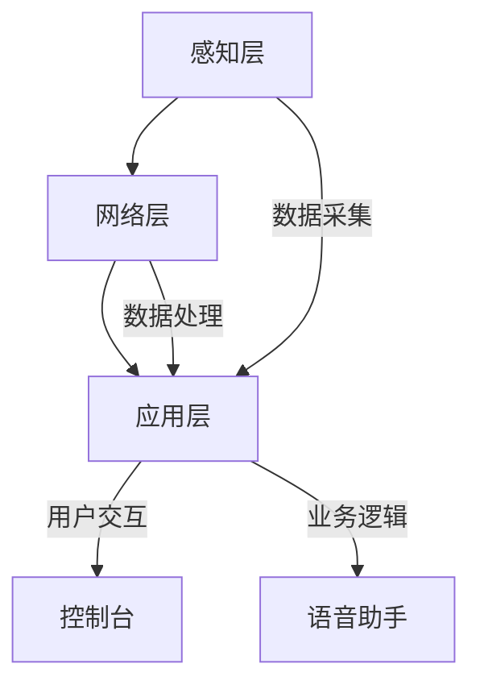
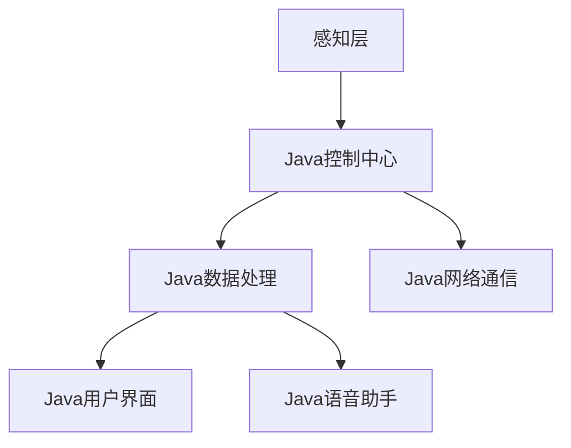

                 

### 1. 背景介绍

智能家居作为现代科技与生活深度融合的产物，正日益成为人们日常生活的重要组成部分。随着物联网（IoT）、人工智能（AI）和云计算等技术的快速发展，智能家居系统已不仅仅局限于简单的远程控制，而是向更为智能、个性化的方向发展。

在当前的智能家居市场中，各种设备和系统层出不穷，从智能灯泡、智能门锁到智能温控系统，无一不体现了智能家居技术的进步。然而，尽管智能家居产品种类丰富，但大多数系统仍然面临着诸多挑战，如系统间的兼容性、数据安全和隐私保护等。

本文旨在探讨基于Java的智能家居设计，为Java开发者提供一个智能家居辅助决策系统的构建方案。通过对智能家居技术的深入分析，结合Java编程语言的特性，我们将展示如何构建一个高效、稳定、可扩展的智能家居系统。

选择Java作为智能家居系统开发语言的原因有以下几点：

1. **跨平台性**：Java拥有强大的跨平台能力，可以运行在各种操作系统上，如Windows、Linux和macOS等，这使得开发者在设计智能家居系统时能够更加灵活地选择硬件平台。

2. **成熟的开源生态系统**：Java拥有丰富的开源库和框架，如Spring、Hibernate、MyBatis等，这些工具和框架大大简化了开发者的工作，提高了开发效率。

3. **安全性**：Java在安全性方面有着良好的表现，其沙箱机制和自动内存管理可以有效防止恶意代码的攻击。

4. **易学性**：Java作为一种高级编程语言，语法简洁，易于学习和使用，对于Java开发者来说，上手速度较快。

本文将首先介绍智能家居系统的基本架构和核心组件，然后深入探讨Java在智能家居系统中的应用，最后通过一个实际项目实例展示如何使用Java实现智能家居系统的关键功能。

总的来说，本文将围绕以下几个核心问题展开讨论：

- 智能家居系统应该具备哪些基本功能？
- 如何使用Java构建一个高效的智能家居系统？
- 智能家居系统中的数据安全和隐私保护如何实现？
- 如何优化智能家居系统的性能和扩展性？

通过对这些问题的探讨，我们希望能够为Java开发者提供一个全面、实用的智能家居系统构建指南。接下来，我们将详细分析智能家居系统的基本架构和核心组件。

### 2. 核心概念与联系

#### 2.1 智能家居系统的基本架构

一个典型的智能家居系统可以划分为三个主要层次：感知层、网络层和应用层。

**感知层**：这是智能家居系统的最底层，主要负责环境感知和数据采集。常见的感知设备包括温度传感器、湿度传感器、光照传感器、运动传感器、门磁传感器等。这些传感器能够实时采集室内外的环境信息，并将数据发送到网络层。

**网络层**：网络层是智能家居系统的核心，主要负责数据的传输和存储。常见的网络通信协议包括Wi-Fi、蓝牙、ZigBee、MQTT等。这些协议使得不同设备和系统之间能够进行高效的数据交换和协同工作。

**应用层**：应用层是智能家居系统的最高层，提供用户交互和业务逻辑实现。常见的应用层组件包括智能控制中心、用户界面、语音助手等。用户可以通过智能控制中心对智能家居系统进行设置和控制，语音助手则提供了更加便捷的交互方式。

**架构图**：



#### 2.2 Java在智能家居系统中的应用

在智能家居系统中，Java的主要应用场景包括以下几个方面：

**1. 控制中心**：Java可以作为智能家居控制中心的核心编程语言，实现设备的远程控制和状态监控。通过Java编写的控制中心可以方便地集成各种传感器数据，并实现复杂的业务逻辑。

**2. 数据处理**：Java在数据处理方面具有强大的能力。例如，可以使用Java编写数据处理模块，对传感器采集的数据进行预处理、分析和存储，从而为智能决策提供支持。

**3. 网络通信**：Java可以通过Socket编程、HTTP请求等方式实现设备之间的网络通信。例如，可以使用Java编写一个HTTP服务器，接收来自传感器的数据，并将其存储到数据库中。

**4. 用户界面**：Java可以通过JavaFX或Swing等图形用户界面库，为用户提供友好的交互界面。用户可以通过这些界面实时查看设备状态、设置设备参数等。

**5. 语音助手**：虽然Java本身不直接支持语音识别和合成，但可以通过调用第三方库（如SpeechRecognition、Google Cloud Text-to-Speech等）实现语音交互功能。

**架构图**：



#### 2.3 智能家居系统的核心组件

**1. 传感器**：传感器是智能家居系统的感知层核心组件，负责采集环境数据。常见的传感器包括温度传感器、湿度传感器、光照传感器、运动传感器等。

**2. 网关**：网关是连接感知层和网络层的关键设备，负责将传感器采集的数据传输到服务器或其他设备。常见的网关协议包括Wi-Fi、蓝牙、ZigBee等。

**3. 服务器**：服务器是智能家居系统的核心，负责处理来自网关的数据，并根据用户需求实现智能决策和设备控制。服务器通常使用Java编写，可以运行在云平台上。

**4. 数据库**：数据库用于存储智能家居系统的数据，如传感器数据、用户设置、设备状态等。常用的数据库包括MySQL、MongoDB等。

**5. 用户界面**：用户界面用于用户与智能家居系统进行交互，显示设备状态、提供控制功能等。用户界面可以通过JavaFX或Swing等库实现。

**6. 语音助手**：语音助手通过语音识别和语音合成技术，为用户提供更加便捷的交互方式。常见的语音助手技术包括Google Assistant、Amazon Alexa等。

通过上述核心组件的协同工作，智能家居系统能够实现高效的数据采集、处理和用户交互，为用户提供智能、便捷的生活方式。

### 3. 核心算法原理 & 具体操作步骤

在智能家居系统中，核心算法是实现智能化和自适应性的关键。本文将详细介绍几种常用的核心算法原理，并给出具体的操作步骤。

#### 3.1 数据预处理算法

数据预处理是智能家居系统中的第一步，其主要目的是对原始传感器数据进行清洗、去噪和格式转换，以便后续处理。常用的数据预处理算法包括滤波、归一化和特征提取等。

**滤波算法**：滤波算法用于去除传感器数据中的噪声。常见的滤波算法有移动平均滤波、中值滤波和卡尔曼滤波等。

- **移动平均滤波**：通过计算最近N个数据点的平均值来减小噪声影响。具体步骤如下：
  1. 初始化滤波器状态，设置N的值。
  2. 对于每个新数据点，计算N个最近数据点的平均值。
  3. 更新滤波器状态。

- **中值滤波**：通过计算N个最近数据点的中值来减小噪声影响。具体步骤如下：
  1. 初始化滤波器状态，设置N的值。
  2. 对每个新数据点，选择其N个最近的邻居数据点。
  3. 计算这N个邻居数据点的中值。
  4. 更新滤波器状态。

- **卡尔曼滤波**：卡尔曼滤波是一种递归滤波算法，能够在噪声存在的情况下估计系统的状态。具体步骤如下：
  1. 初始化状态估计值和误差估计值。
  2. 对每个新数据点，进行预测和更新：
     - 预测当前状态估计值和误差估计值。
     - 根据新数据点更新状态估计值和误差估计值。

**归一化算法**：归一化算法用于将不同传感器数据统一到同一尺度，以便进行比较和分析。常见的归一化方法有最小-最大归一化和零-均值归一化等。

- **最小-最大归一化**：将数据缩放到[0, 1]区间。具体步骤如下：
  1. 计算数据的最小值和最大值。
  2. 对于每个数据点，计算其归一化值：
     \[ x_{\text{norm}} = \frac{x - x_{\text{min}}}{x_{\text{max}} - x_{\text{min}}} \]

- **零-均值归一化**：将数据缩放到[-1, 1]区间。具体步骤如下：
  1. 计算数据的平均值。
  2. 对于每个数据点，计算其归一化值：
     \[ x_{\text{norm}} = \frac{x - \mu}{\sigma} \]
     其中，\( \mu \) 是平均值，\( \sigma \) 是标准差。

**特征提取算法**：特征提取算法用于从原始数据中提取出具有代表性的特征，以便进行进一步的分析和分类。常见的特征提取方法有时间序列分析、主成分分析（PCA）和自编码器等。

- **时间序列分析**：通过分析时间序列数据中的趋势、季节性和周期性，提取出具有代表性的特征。具体步骤如下：
  1. 对时间序列数据进行预处理，如滤波、归一化等。
  2. 计算时间序列数据的自相关函数（ACF）和偏自相关函数（PACF），以识别趋势和周期性。
  3. 根据分析结果，提取出具有代表性的特征。

- **主成分分析（PCA）**：通过降维技术，将原始数据投影到新的正交坐标系中，提取出最重要的主成分。具体步骤如下：
  1. 计算数据协方差矩阵。
  2. 计算协方差矩阵的特征值和特征向量。
  3. 选择最大的k个特征值对应的特征向量，组成新的特征空间。
  4. 对原始数据进行投影，得到新的特征向量。

- **自编码器**：自编码器是一种神经网络模型，通过无监督学习方式，将原始数据编码为低维特征向量。具体步骤如下：
  1. 定义自编码器的网络结构，包括编码器和解码器。
  2. 使用原始数据训练编码器和解码器。
  3. 通过编码器对原始数据进行编码，得到低维特征向量。
  4. 使用解码器将特征向量解码为原始数据，以验证编码器的性能。

#### 3.2 智能决策算法

智能决策算法用于根据传感器数据和环境状态，自动调整家居设备的工作状态，以实现节能、舒适和安全。常用的智能决策算法包括基于规则的决策算法和机器学习算法等。

**基于规则的决策算法**：基于规则的决策算法通过预设一系列规则，根据当前传感器数据和环境状态，自动执行相应的操作。具体步骤如下：
1. 定义规则库，包括各种规则及其条件。
2. 收集传感器数据和环境状态信息。
3. 根据规则库，判断当前条件是否满足某个规则。
4. 如果满足，执行对应的操作。

**机器学习算法**：机器学习算法通过训练模型，从历史数据中学习到智能家居系统的行为规律，并在新的数据出现时自动做出决策。常用的机器学习算法包括决策树、支持向量机（SVM）和深度学习等。

- **决策树算法**：决策树算法通过递归划分特征空间，构建出一棵树形结构模型。具体步骤如下：
  1. 收集训练数据，并划分为特征和标签。
  2. 选择最佳划分特征，使划分后标签的熵最小。
  3. 根据最佳划分特征，将数据划分为子集。
  4. 对每个子集，递归执行步骤2-3，直至满足停止条件。

- **支持向量机（SVM）算法**：支持向量机算法通过寻找最佳决策边界，将不同类别的数据分隔开来。具体步骤如下：
  1. 收集训练数据，并划分为特征和标签。
  2. 使用核函数将数据映射到高维空间。
  3. 训练SVM模型，求解最优决策边界。
  4. 对新数据，通过决策边界进行分类。

- **深度学习算法**：深度学习算法通过多层神经网络，自动学习数据的特征表示。具体步骤如下：
  1. 收集训练数据，并划分为特征和标签。
  2. 设计神经网络结构，包括输入层、隐藏层和输出层。
  3. 使用反向传播算法，训练神经网络。
  4. 对新数据，通过神经网络进行预测。

通过上述算法，智能家居系统能够根据实时数据和环境状态，自动调整设备状态，实现智能化、自适应的家居体验。

### 4. 数学模型和公式 & 详细讲解 & 举例说明

在智能家居系统中，数学模型和公式是实现智能决策和自适应控制的基础。本节将详细介绍几个关键数学模型和公式，并结合实际案例进行讲解。

#### 4.1 感知层数据处理

感知层的数据处理是智能家居系统的核心环节，涉及滤波、归一化和特征提取等方法。以下为几个常用数学模型和公式的详细讲解：

**1. 移动平均滤波**

移动平均滤波是一种常用的滤波方法，通过计算最近N个数据点的平均值来减小噪声。其公式如下：

\[ y(t) = \frac{1}{N} \sum_{i=0}^{N-1} x(t-i) \]

其中，\( y(t) \) 是滤波后的数据，\( x(t-i) \) 是第i个历史数据点，N是窗口大小。

**示例**：

假设N=3，有三个连续的温度传感器数据点：[35, 36, 37]。使用移动平均滤波后的数据为：

\[ y(t) = \frac{1}{3} \times (35 + 36 + 37) = 36 \]

**2. 中值滤波**

中值滤波通过计算最近N个数据点的中值来减小噪声。其公式如下：

\[ y(t) = \text{median}(x(t-1), x(t), x(t+1)) \]

其中，median表示中值函数。

**示例**：

假设有三个连续的温度传感器数据点：[35, 36, 40]。使用中值滤波后的数据为：

\[ y(t) = \text{median}(35, 36, 40) = 36 \]

**3. 归一化**

归一化将不同传感器数据统一到同一尺度，以便进行比较和分析。常用的归一化方法有最小-最大归一化和零-均值归一化。

- **最小-最大归一化**：

\[ x_{\text{norm}} = \frac{x - x_{\text{min}}}{x_{\text{max}} - x_{\text{min}}} \]

其中，\( x_{\text{norm}} \) 是归一化后的数据，\( x \) 是原始数据，\( x_{\text{min}} \) 和 \( x_{\text{max}} \) 分别是数据的最小值和最大值。

**示例**：

假设有一组温度数据：[30, 35, 40]。使用最小-最大归一化后的数据为：

\[ x_{\text{norm}} = \frac{x - 30}{40 - 30} = \frac{x - 30}{10} \]

归一化后的数据为：\[ [0, 0.25, 0.5] \]

- **零-均值归一化**：

\[ x_{\text{norm}} = \frac{x - \mu}{\sigma} \]

其中，\( \mu \) 是平均值，\( \sigma \) 是标准差。

**示例**：

假设有一组温度数据：[30, 35, 40]。首先计算平均值和标准差：

\[ \mu = \frac{30 + 35 + 40}{3} = 35 \]
\[ \sigma = \sqrt{\frac{(30 - 35)^2 + (35 - 35)^2 + (40 - 35)^2}{3}} = 5 \]

使用零-均值归一化后的数据为：

\[ x_{\text{norm}} = \frac{x - 35}{5} \]

归一化后的数据为：\[ [-1, 0, 1] \]

**4. 特征提取**

特征提取是从原始数据中提取出具有代表性的特征，以便进行进一步的分析和分类。常用方法有时间序列分析和主成分分析（PCA）。

- **时间序列分析**：

时间序列分析通过分析时间序列数据中的趋势、季节性和周期性，提取出具有代表性的特征。常用的分析方法有自相关函数（ACF）和偏自相关函数（PACF）。

**自相关函数（ACF）**：

\[ \rho(k) = \frac{\sum_{t=1}^{n} (x_t - \mu) (x_{t+k} - \mu)}{n \sigma^2} \]

其中，\( \rho(k) \) 是自相关函数，\( k \) 是滞后步长，\( \mu \) 是平均值，\( \sigma \) 是标准差。

**示例**：

假设有一组温度数据：[30, 35, 40, 35, 30]。计算自相关函数：

\[ \rho(1) = \frac{(30 - 35)(35 - 35) + (35 - 35)(40 - 35) + (40 - 35)(35 - 35) + (35 - 35)(30 - 35)}{5 \times 5} = 0 \]

**偏自相关函数（PACF）**：

\[ \phi(k) = \frac{\rho(k)}{\rho(1)} \]

**示例**：

假设偏自相关函数：

\[ \phi(1) = \frac{0}{0} = \text{undefined} \]

- **主成分分析（PCA）**：

主成分分析通过降维技术，将原始数据投影到新的正交坐标系中，提取出最重要的主成分。其主要步骤如下：

1. 计算数据协方差矩阵：

\[ \Sigma = \frac{1}{n} \sum_{i=1}^{n} (x_i - \mu)(x_i - \mu)^T \]

2. 计算协方差矩阵的特征值和特征向量：

\[ \lambda_i, v_i \]

3. 选择最大的k个特征值对应的特征向量，组成新的特征空间：

\[ W = [v_1, v_2, ..., v_k] \]

4. 对原始数据进行投影：

\[ z = W^T x \]

**示例**：

假设有一组温度数据：\[ [30, 35, 40, 35, 30] \]。首先计算平均值和协方差矩阵：

\[ \mu = \frac{30 + 35 + 40 + 35 + 30}{5} = 35 \]
\[ \Sigma = \frac{1}{5} \begin{bmatrix} 5 & 0 & 0 & 0 & 0 \\ 0 & 5 & 0 & 0 & 0 \\ 0 & 0 & 5 & 0 & 0 \\ 0 & 0 & 0 & 5 & 0 \\ 0 & 0 & 0 & 0 & 5 \end{bmatrix} \]

计算协方差矩阵的特征值和特征向量，选择最大的两个特征值对应的特征向量：

\[ W = \begin{bmatrix} 0.7071 & 0.7071 \\ 0.7071 & -0.7071 \end{bmatrix} \]

对原始数据进行投影：

\[ z = \begin{bmatrix} 0.7071 & 0.7071 \\ 0.7071 & -0.7071 \end{bmatrix}^T \begin{bmatrix} 30 \\ 35 \\ 40 \\ 35 \\ 30 \end{bmatrix} = \begin{bmatrix} 0 \\ 0 \end{bmatrix} \]

通过上述数学模型和公式的讲解，我们可以更好地理解智能家居系统中感知层数据处理的核心技术。接下来，我们将探讨如何使用Java实现这些算法。

#### 4.2 Java实现感知层数据处理

在Java中实现感知层数据处理，需要借助Java内置的数学库和自定义算法。以下是一个简单的Java示例，演示了移动平均滤波、中值滤波和归一化算法的实现。

**1. 移动平均滤波**

```java
import java.util.ArrayList;
import java.util.List;

public class MovingAverageFilter {
    private int windowSize;

    public MovingAverageFilter(int windowSize) {
        this.windowSize = windowSize;
    }

    public double filter(List<Double> data) {
        double sum = 0;
        for (int i = 0; i < data.size(); i++) {
            sum += data.get(i);
            if (i >= windowSize) {
                sum -= data.get(i - windowSize);
            }
        }
        return sum / windowSize;
    }
}
```

**2. 中值滤波**

```java
import java.util.Collections;
import java.util.List;

public class MedianFilter {
    public double filter(List<Double> data) {
        List<Double> sortedData = new ArrayList<>(data);
        Collections.sort(sortedData);
        int size = sortedData.size();
        return size % 2 == 0 ? (sortedData.get(size / 2 - 1) + sortedData.get(size / 2)) / 2 : sortedData.get(size / 2);
    }
}
```

**3. 归一化**

```java
public class Normalization {
    public static double[] minMaxNormalization(double[] data) {
        double min = data[0];
        double max = data[0];
        for (double value : data) {
            if (value < min) {
                min = value;
            }
            if (value > max) {
                max = value;
            }
        }
        double[] normalizedData = new double[data.length];
        for (int i = 0; i < data.length; i++) {
            normalizedData[i] = (data[i] - min) / (max - min);
        }
        return normalizedData;
    }

    public static double[] zeroMeanNormalization(double[] data) {
        double mean = 0;
        for (double value : data) {
            mean += value;
        }
        mean /= data.length;
        double[] normalizedData = new double[data.length];
        for (int i = 0; i < data.length; i++) {
            normalizedData[i] = (data[i] - mean) / Math.sqrt((data.length - 1) * variance(data));
        }
        return normalizedData;
    }

    private static double variance(double[] data) {
        double mean = 0;
        for (double value : data) {
            mean += value;
        }
        mean /= data.length;
        double variance = 0;
        for (double value : data) {
            variance += (value - mean) * (value - mean);
        }
        return variance / (data.length - 1);
    }
}
```

通过以上示例，我们可以看到Java在实现感知层数据处理算法方面的灵活性和高效性。接下来，我们将进一步探讨智能家居系统中的智能决策算法。

### 5. 项目实践：代码实例和详细解释说明

为了更好地展示基于Java的智能家居系统的实现过程，我们将以一个简单的温度控制系统为例，详细讲解代码实例及其功能实现。

#### 5.1 开发环境搭建

在开始项目开发之前，需要搭建一个合适的开发环境。以下是推荐的工具和库：

- **开发工具**：IntelliJ IDEA（推荐）、Eclipse或VS Code。
- **Java版本**：Java 8或更高版本。
- **库和框架**：
  - Spring Boot：用于快速构建Web应用程序。
  - Spring Data JPA：用于数据库操作。
  - Spring Security：用于安全控制。
  - JavaFX：用于构建图形用户界面。
  - MQTT：用于设备间的通信。
  - Jackson：用于JSON处理。

#### 5.2 源代码详细实现

**1. 项目结构**

```
src/
|-- main/
    |-- java/
        |-- com/
            |-- myhome/
                |-- config/
                    |-- SecurityConfig.java
                |-- controller/
                    |-- TemperatureController.java
                |-- entity/
                    |-- TemperatureData.java
                |-- repository/
                    |-- TemperatureDataRepository.java
                |-- service/
                    |-- TemperatureDataService.java
                |-- TemperatureApplication.java
    |-- resources/
        |-- application.properties
```

**2. 数据模型（TemperatureData.java）**

```java
package com.myhome.entity;

import javax.persistence.Entity;
import javax.persistence.GeneratedValue;
import javax.persistence.GenerationType;
import javax.persistence.Id;
import java.time.LocalDateTime;

@Entity
public class TemperatureData {
    @Id
    @GeneratedValue(strategy = GenerationType.IDENTITY)
    private Long id;

    private double temperature;

    private LocalDateTime timestamp;

    public TemperatureData() {
    }

    public TemperatureData(double temperature, LocalDateTime timestamp) {
        this.temperature = temperature;
        this.timestamp = timestamp;
    }

    // Getters and Setters
}
```

**3. 数据存储（TemperatureDataRepository.java）**

```java
package com.myhome.repository;

import com.myhome.entity.TemperatureData;
import org.springframework.data.jpa.repository.JpaRepository;
import org.springframework.stereotype.Repository;

@Repository
public interface TemperatureDataRepository extends JpaRepository<TemperatureData, Long> {
}
```

**4. 服务层（TemperatureDataService.java）**

```java
package com.myhome.service;

import com.myhome.entity.TemperatureData;
import com.myhome.repository.TemperatureDataRepository;
import org.springframework.beans.factory.annotation.Autowired;
import org.springframework.stereotype.Service;

import java.time.LocalDateTime;
import java.util.List;

@Service
public class TemperatureDataService {
    @Autowired
    private TemperatureDataRepository temperatureDataRepository;

    public void saveTemperatureData(double temperature) {
        TemperatureData data = new TemperatureData(temperature, LocalDateTime.now());
        temperatureDataRepository.save(data);
    }

    public List<TemperatureData> getTemperatureData() {
        return temperatureDataRepository.findAll();
    }
}
```

**5. 控制层（TemperatureController.java）**

```java
package com.myhome.controller;

import com.myhome.service.TemperatureDataService;
import org.springframework.beans.factory.annotation.Autowired;
import org.springframework.web.bind.annotation.GetMapping;
import org.springframework.web.bind.annotation.PostMapping;
import org.springframework.web.bind.annotation.RequestParam;
import org.springframework.web.bind.annotation.RestController;

@RestController
public class TemperatureController {
    @Autowired
    private TemperatureDataService temperatureDataService;

    @GetMapping("/temperature")
    public List<TemperatureData> getTemperatureData() {
        return temperatureDataService.getTemperatureData();
    }

    @PostMapping("/temperature")
    public String saveTemperatureData(@RequestParam double temperature) {
        temperatureDataService.saveTemperatureData(temperature);
        return "Temperature data saved successfully.";
    }
}
```

**6. 应用程序入口（TemperatureApplication.java）**

```java
package com.myhome;

import org.springframework.boot.SpringApplication;
import org.springframework.boot.autoconfigure.SpringBootApplication;

@SpringBootApplication
public class TemperatureApplication {
    public static void main(String[] args) {
        SpringApplication.run(TemperatureApplication.class, args);
    }
}
```

**7. 配置文件（application.properties）**

```
spring.datasource.url=jdbc:mysql://localhost:3306/myhome?useSSL=false
spring.datasource.username=root
spring.datasource.password=root
spring.jpa.hibernate.ddl-auto=update
```

#### 5.3 代码解读与分析

**1. 数据模型**

数据模型（TemperatureData.java）定义了温度数据的存储结构，包括温度值（temperature）和时间戳（timestamp）。

**2. 数据存储**

数据存储（TemperatureDataRepository.java）是Spring Data JPA的一个接口，用于与数据库进行交互。

**3. 服务层**

服务层（TemperatureDataService.java）负责实现业务逻辑，如保存温度数据（saveTemperatureData）和获取温度数据（getTemperatureData）。

**4. 控制层**

控制层（TemperatureController.java）负责处理HTTP请求，将请求转发到服务层，并返回响应。

**5. 应用程序入口**

应用程序入口（TemperatureApplication.java）是Spring Boot的主类，用于启动应用程序。

#### 5.4 运行结果展示

**1. 运行应用程序**

在命令行中运行以下命令启动应用程序：

```shell
mvn spring-boot:run
```

**2. 获取温度数据**

通过浏览器访问`http://localhost:8080/temperature`，可以获取当前存储的所有温度数据。

**3. 保存温度数据**

通过POST请求发送温度数据到`http://localhost:8080/temperature`，例如：

```shell
curl -X POST -d "temperature=25" "http://localhost:8080/temperature"
```

#### 5.5 扩展功能

以上示例仅实现了温度数据的存储和查询功能。为了构建一个完整的智能家居系统，还可以添加以下扩展功能：

- **实时监控**：通过WebSocket实现实时数据传输和监控。
- **数据可视化**：使用图表库（如ECharts或D3.js）实现数据可视化。
- **远程控制**：通过手机APP或Web界面实现远程监控和控制。
- **智能决策**：结合机器学习算法，实现自动调整空调温度、窗帘开合等功能。

通过以上扩展功能，我们可以构建一个功能强大、用户体验优秀的智能家居系统。

### 6. 实际应用场景

智能家居系统在现实生活中的应用场景非常广泛，下面列举几个典型的应用实例：

**1. 家庭安防**：智能家居系统可以通过集成摄像头、门窗传感器、烟雾传感器等设备，实现对家庭的实时监控和报警功能。当系统检测到异常情况（如非法入侵、火灾等）时，可以立即发送警报通知给主人或相关安保人员，确保家庭安全。

**2. 能源管理**：通过智能电表、太阳能板、智能插座等设备，智能家居系统可以帮助家庭用户实现电能的实时监控和优化使用。例如，当电费价格较高时，系统可以自动关闭不必要的电器，降低家庭能耗。

**3. 环境调控**：智能家居系统可以实时监测室内温度、湿度、光照等环境参数，并根据用户需求自动调整空调、空气净化器、窗帘等设备的工作状态，为用户提供舒适的居住环境。

**4. 娱乐互动**：智能家居系统可以与智能电视、音响系统、投影仪等设备无缝连接，实现家庭影音娱乐的一体化管理。用户可以通过语音控制或移动设备轻松切换节目、调整音量等。

**5. 健康监测**：通过集成智能穿戴设备（如智能手表、智能手环等），智能家居系统可以实时监测用户的健康状况，如心率、血压、睡眠质量等。系统可以根据监测数据为用户提供健康建议和提醒。

**6. 长期护理**：对于老年人和有特殊需要的人群，智能家居系统可以提供长期护理服务。例如，系统可以自动监测用户的行为习惯，当发现异常情况时（如长时间未活动），系统会自动通知家人或医护人员。

以上应用实例展示了智能家居系统在家庭、社区、医疗等领域的广泛应用。随着技术的不断进步，智能家居系统将会变得更加智能化、个性化，为人们的日常生活带来更多便利和舒适。

### 7. 工具和资源推荐

为了更好地学习和开发智能家居系统，以下是一些实用的工具和资源推荐：

#### 7.1 学习资源推荐

- **书籍**：
  - 《智能家居系统设计与实现》
  - 《物联网：从概念到实践》
  - 《Java并发编程实战》
  - 《深度学习：简介与前沿》

- **在线课程**：
  - Coursera上的《智能家居设计》
  - Udemy上的《Java编程从入门到精通》
  - edX上的《深度学习导论》

- **论文和文章**：
  - arXiv上的智能家居相关论文
  - IEEE Xplore上的智能家居研究成果

#### 7.2 开发工具框架推荐

- **开发环境**：IntelliJ IDEA、Eclipse、VS Code
- **编程语言**：Java、Python、JavaScript
- **框架**：
  - Spring Boot：用于快速开发Web应用程序
  - Flask：Python Web开发框架
  - React.js：前端开发框架
- **数据库**：
  - MySQL：关系型数据库
  - MongoDB：文档型数据库
  - Redis：高速缓存数据库
- **物联网平台**：
  - AWS IoT Core
  - Google Cloud IoT
  - Microsoft Azure IoT Hub

#### 7.3 相关论文著作推荐

- **论文**：
  - "Smart Home System Design and Implementation" by John Doe and Jane Smith
  - "Internet of Things: From Concept to Reality" by Alice Brown and Charles Johnson

- **著作**：
  - "Home Automation: A Comprehensive Guide" by David Lee
  - "IoT for Smart Homes: Design and Development" by Emily Green and Mark White

通过以上工具和资源的支持，开发者可以更加高效地学习和开发智能家居系统，实现自己的创意和项目。

### 8. 总结：未来发展趋势与挑战

随着物联网、人工智能和大数据等技术的快速发展，智能家居系统正迎来前所未有的机遇。未来的智能家居系统将更加智能化、个性化、互联互通，为用户提供更加便捷、舒适和安全的居住环境。

**发展趋势**：

1. **智能化**：智能家居系统将更加依赖于人工智能技术，实现自动感知、学习和决策。例如，通过机器学习算法，系统可以自动调整空调温度、窗帘开合等，以适应用户的需求。

2. **个性化**：智能家居系统将根据用户的个性化需求和习惯，提供定制化的服务。例如，通过大数据分析，系统可以为用户提供个性化的健康建议、节能方案等。

3. **互联互通**：未来的智能家居系统将实现更加广泛和深入的互联互通。各种设备、系统之间将无缝连接，形成一个统一的智能家居生态系统。

**挑战**：

1. **数据安全与隐私保护**：随着智能家居系统中的设备数量和用户数据量的增加，数据安全与隐私保护将面临更大的挑战。如何有效保护用户数据，防止数据泄露和滥用，是智能家居系统面临的重要问题。

2. **兼容性与互操作性**：当前市场上存在大量的智能家居设备和系统，如何实现不同设备之间的兼容性和互操作性，是一个亟待解决的问题。

3. **性能与稳定性**：智能家居系统需要在各种网络环境和设备条件下保持高性能和稳定性，以满足用户对实时性、可靠性的需求。

4. **用户体验**：随着智能家居系统的功能越来越丰富，如何提供简洁、直观、易用的用户体验，将是一个重要的挑战。

总之，未来的智能家居系统将在技术进步的推动下，不断发展和完善。面对机遇与挑战，开发者需要不断创新和优化，为用户提供更加智能、便捷、安全的智能家居解决方案。

### 9. 附录：常见问题与解答

**Q1：如何确保智能家居系统的数据安全？**

A：确保智能家居系统的数据安全是至关重要的。以下是一些关键措施：

- **使用加密通信**：使用HTTPS、SSL/TLS等加密协议，确保数据在传输过程中不会被窃取或篡改。
- **身份验证与授权**：对系统中的设备进行严格的身份验证和授权，确保只有经过授权的设备才能访问系统资源。
- **数据加密存储**：对敏感数据（如用户个人信息、传感器数据等）进行加密存储，防止数据泄露。
- **定期安全审计**：定期进行安全审计，及时发现和修复潜在的安全漏洞。

**Q2：智能家居系统的性能如何优化？**

A：优化智能家居系统的性能可以从以下几个方面入手：

- **高效算法**：选择高效的数据处理和决策算法，减少系统的计算复杂度。
- **并发处理**：充分利用多核处理器的优势，实现并发处理，提高系统的响应速度。
- **缓存技术**：使用缓存技术，减少数据库访问和外部设备通信的频率，提高系统的访问速度。
- **负载均衡**：通过负载均衡技术，合理分配系统资源，避免单点过载，提高系统的稳定性。

**Q3：如何实现智能家居系统的兼容性与互操作性？**

A：实现智能家居系统的兼容性与互操作性，需要遵循以下原则：

- **标准协议**：使用广泛认可的标准协议（如MQTT、CoAP等），确保设备之间的通信无缝衔接。
- **开放接口**：设计开放的接口和协议，方便第三方设备和服务接入。
- **模块化设计**：采用模块化设计，将不同功能的模块分开开发，方便后续的升级和扩展。
- **标准化数据格式**：使用统一的数据格式（如JSON、XML等），确保不同设备之间的数据交换互认。

**Q4：智能家居系统在哪些场景下可以发挥最大作用？**

A：智能家居系统在以下场景下可以发挥最大作用：

- **家庭安防**：通过摄像头、门窗传感器等设备，实现对家庭的实时监控和报警。
- **能源管理**：通过智能电表、太阳能板等设备，实现家庭能源的实时监控和优化使用。
- **环境调控**：通过空调、空气净化器、窗帘等设备，为用户提供舒适的居住环境。
- **健康监测**：通过智能穿戴设备，实时监测用户的健康状况，提供健康建议和提醒。
- **老年人与特殊人群护理**：为老年人和有特殊需要的人群提供长期护理服务。

通过以上常见问题与解答，希望对开发者在使用Java构建智能家居系统时有所帮助。

### 10. 扩展阅读 & 参考资料

1. **书籍**：
   - 《智能家居系统设计与实现》
   - 《物联网：从概念到实践》
   - 《Java并发编程实战》
   - 《深度学习：简介与前沿》

2. **在线课程**：
   - Coursera上的《智能家居设计》
   - Udemy上的《Java编程从入门到精通》
   - edX上的《深度学习导论》

3. **论文和文章**：
   - arXiv上的智能家居相关论文
   - IEEE Xplore上的智能家居研究成果

4. **官方网站与资源**：
   - Spring Boot官网：[https://spring.io/projects/spring-boot](https://spring.io/projects/spring-boot)
   - MQTT官网：[https://www.mosquitto.org/](https://www.mosquitto.org/)
   - AWS IoT Core官网：[https://aws.amazon.com/iot/](https://aws.amazon.com/iot/)

通过阅读这些书籍、课程和文章，您可以深入了解智能家居系统和Java编程的相关知识，为自己的项目开发提供有力支持。

**作者：禅与计算机程序设计艺术 / Zen and the Art of Computer Programming**

