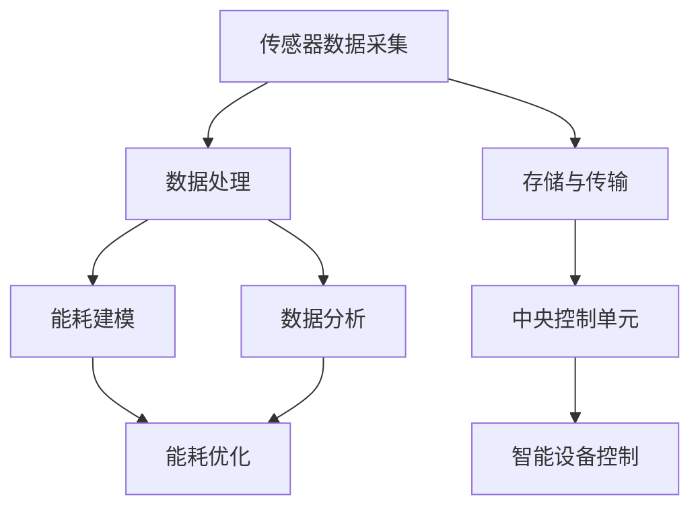

                 

## 1. 背景介绍

随着物联网（IoT）技术的迅猛发展，智能家居系统逐渐成为现代家庭的重要组成部分。智能家居系统通过连接各种家庭设备和传感器，实现远程监控、自动化控制和能源管理等功能，从而提高生活的便捷性和舒适度。然而，与此同时，智能家居系统也面临着能耗分析和管理的一大挑战。

能耗管理对于智能家居系统至关重要，因为智能设备的多样化和功能的复杂化导致了能源消耗的显著增加。在当前能源日益紧缺和环保意识日益增强的大背景下，如何有效地对智能家居系统的能耗进行监控、分析和优化，成为了一个亟待解决的问题。

### 为什么能耗分析在智能家居系统中重要？

能耗分析在智能家居系统中有以下几个关键作用：

1. **成本节约**：通过能耗分析，可以识别出能源消耗较高的设备和时段，从而有针对性地优化用电习惯，降低电费支出。

2. **环境友好**：减少能源消耗有助于降低碳排放，符合可持续发展的要求。

3. **设备维护**：能耗分析还能帮助发现设备的异常耗电情况，及时进行维护，防止设备故障或过度损耗。

4. **智能优化**：通过对能耗数据的分析，可以为智能家居系统提供数据支持，实现更智能的能源管理，提高系统效率。

在本文中，我们将探讨如何利用Java这一强大的编程语言，结合现代算法和数学模型，对智能家居系统的能耗进行有效分析。具体来说，我们将介绍核心概念、算法原理、数学模型、项目实践以及实际应用场景等，以期为大家提供一套完整且实用的智能家居能耗优化方案。

### 智能家居系统中的主要组件

智能家居系统通常包括以下几个主要组件：

1. **传感器**：传感器是智能家居系统的“感觉器官”，能够感知家庭环境中的各种参数，如温度、湿度、光照、烟雾等。常见的传感器有温度传感器、湿度传感器、光照传感器、烟雾传感器等。

2. **网关**：网关是智能家居系统的“交通枢纽”，负责将各种传感器采集到的数据传输到中央控制单元或云端服务器。常见的网关有Wi-Fi网关、蓝牙网关等。

3. **智能设备**：智能设备是智能家居系统的执行单元，如智能灯泡、智能插座、智能空调、智能门锁等。这些设备通常具有远程控制、定时控制、自动化控制等功能。

4. **中央控制单元**：中央控制单元是智能家居系统的“大脑”，负责处理和分析传感器数据，控制智能设备，实现家庭自动化。常见的中央控制单元有智能路由器、智能中心盒等。

5. **移动端应用**：移动端应用是智能家居系统的“用户界面”，用户可以通过智能手机或平板电脑对智能家居系统进行远程控制和监控。

### 能耗分析的关键概念和方法

在智能家居系统中，能耗分析通常包括以下几个关键概念和方法：

1. **数据采集**：通过传感器实时采集家庭用电数据，包括电流、电压、功率等参数。

2. **数据处理**：对采集到的数据进行预处理，包括去噪、滤波、归一化等，以提高数据质量和分析准确性。

3. **能耗建模**：建立能耗模型，描述家庭用电的规律和特征。常见的能耗模型有线性模型、非线性模型、神经网络模型等。

4. **数据分析**：利用统计分析和机器学习算法，对能耗数据进行深入分析，识别能耗异常、预测能耗趋势等。

5. **能耗优化**：基于数据分析结果，提出优化方案，包括设备调度、能源管理策略等，以降低能耗。

### 为什么选择Java进行能耗分析？

Java是一种广泛应用于企业级开发的语言，具有以下优点：

1. **跨平台性**：Java是一种跨平台的编程语言，可以在多种操作系统上运行，包括Windows、Linux和macOS。

2. **稳定性**：Java拥有强大的稳定性，其虚拟机（JVM）能够有效地管理内存、优化性能，确保程序运行的稳定性和可靠性。

3. **丰富的库支持**：Java拥有丰富的标准库和第三方库，如Spring Framework、Hibernate、Apache Commons等，这些库为能耗分析提供了强大的支持。

4. **社区支持**：Java拥有庞大的开发者社区，无论是遇到问题还是寻找解决方案，都能得到快速且有效的帮助。

5. **可扩展性**：Java具有很好的可扩展性，可以方便地集成新的算法和模型，满足不断变化的能耗分析需求。

综上所述，选择Java进行智能家居能耗分析，既能充分利用其跨平台性、稳定性和社区支持等优势，又能借助其丰富的库资源，提高开发效率和项目质量。

## 2. 核心概念与联系

在智能家居能耗分析中，理解以下核心概念和它们之间的联系至关重要。我们将使用Mermaid流程图来直观地展示这些概念和其相互关系。

### 2.1. 传感器数据采集

传感器是智能家居系统的“感觉器官”，能够采集环境参数（如温度、湿度、光照等）以及用电数据（如电流、电压、功率等）。这些数据是能耗分析的基础。



### 2.2. 数据处理

数据处理包括数据预处理（如去噪、滤波、归一化）和数据清洗，以提高数据的准确性和一致性。

### 2.3. 存储与传输

采集到的数据需要存储在中央数据库或云存储中，并通过网关进行传输，以确保数据的实时性和可靠性。

### 2.4. 能耗建模

能耗建模是分析能耗数据的关键步骤，通过建立数学模型（如线性模型、神经网络模型等），描述家庭用电的规律和特征。

### 2.5. 数据分析

数据分析利用统计分析和机器学习算法，深入挖掘能耗数据，识别能耗异常、预测能耗趋势等。

### 2.6. 中央控制单元

中央控制单元是智能家居系统的“大脑”，负责处理和分析传感器数据，控制智能设备，实现家庭自动化。

### 2.7. 能耗优化

基于数据分析结果，能耗优化提出设备调度、能源管理策略等，以降低能耗。

通过上述流程图，我们可以清晰地看到传感器数据采集、数据处理、存储与传输、能耗建模、数据分析和能耗优化之间的紧密联系，以及中央控制单元在其中的核心作用。

## 3. 核心算法原理 & 具体操作步骤

### 3.1. 算法原理

在智能家居能耗分析中，核心算法主要分为以下几类：

1. **时间序列分析**：通过分析用电数据的时序特性，识别用电规律，如周期性波动、趋势变化等。
2. **异常检测**：利用统计学或机器学习算法，识别异常用电行为，如设备故障、非法操作等。
3. **预测分析**：基于历史数据，利用时间序列分析、回归分析、机器学习等方法，预测未来的能耗趋势。
4. **优化算法**：通过算法优化设备调度、用电策略，以达到降低能耗的目的。

### 3.2. 时间序列分析

时间序列分析是一种常用的数据分析方法，用于处理和分析时间相关数据。具体步骤如下：

1. **数据预处理**：对原始时间序列数据进行预处理，包括去噪、滤波、归一化等，以提高数据质量。
2. **特征提取**：从时间序列数据中提取特征，如平均值、方差、自相关函数等。
3. **模型选择**：选择合适的时间序列模型，如ARIMA（自回归积分滑动平均模型）、SARIMA（季节性ARIMA模型）等。
4. **模型训练与验证**：使用历史数据对模型进行训练，并通过交叉验证等方法验证模型性能。

### 3.3. 异常检测

异常检测是识别异常用电行为的关键步骤，具体方法如下：

1. **阈值法**：设置一个阈值，当数据超出阈值时，认为出现了异常。
2. **统计学方法**：使用统计学方法，如箱线图、直方图等，识别异常值。
3. **机器学习方法**：利用聚类算法（如K-means）、异常检测算法（如Isolation Forest、Autoencoder）等，识别异常样本。

### 3.4. 预测分析

预测分析是预测未来能耗趋势的关键步骤，具体方法如下：

1. **回归分析**：使用回归模型（如线性回归、多项式回归）预测未来能耗。
2. **时间序列预测**：使用时间序列模型（如ARIMA、SARIMA）预测未来能耗。
3. **机器学习方法**：利用机器学习算法（如Random Forest、XGBoost）进行能耗预测。

### 3.5. 优化算法

优化算法是降低能耗的重要手段，具体方法如下：

1. **设备调度**：通过优化设备运行时间，降低高峰期的能耗。
2. **能源管理策略**：通过优化能源分配，降低整体能耗。
3. **机器学习优化**：使用机器学习算法（如强化学习、遗传算法）进行能耗优化。

### 3.6. 具体操作步骤

以下是一个具体的智能家居能耗分析流程，涵盖数据采集、处理、建模和优化等步骤：

1. **数据采集**：从传感器中采集实时能耗数据，包括电流、电压、功率等。
2. **数据预处理**：对采集到的数据进行预处理，包括去噪、滤波、归一化等。
3. **数据存储**：将预处理后的数据存储到中央数据库或云存储中。
4. **特征提取**：从预处理后的数据中提取特征，如平均值、方差、自相关函数等。
5. **能耗建模**：选择合适的时间序列模型或机器学习模型，对特征数据进行建模。
6. **模型训练与验证**：使用历史数据对模型进行训练，并通过交叉验证等方法验证模型性能。
7. **异常检测**：使用异常检测算法对实时数据进行异常检测，识别异常用电行为。
8. **预测分析**：利用训练好的模型进行能耗预测，预测未来的能耗趋势。
9. **能耗优化**：基于预测结果，使用优化算法进行设备调度和能源管理，降低整体能耗。

通过上述具体操作步骤，我们可以实现智能家居能耗的有效分析和优化，提高系统的智能化水平和能源利用效率。

## 4. 数学模型和公式 & 详细讲解 & 举例说明

### 4.1. 时间序列分析中的ARIMA模型

时间序列分析是能耗分析中的一个重要方法，其中ARIMA（自回归积分滑动平均模型）模型是一种常用的统计模型。ARIMA模型由三个部分组成：自回归（AR）、差分（I）和移动平均（MA）。

#### 4.1.1. 自回归（AR）部分

自回归模型用于描述当前值与其过去值之间的关系。AR模型的公式如下：

\[ y_t = c + \phi_1 y_{t-1} + \phi_2 y_{t-2} + \ldots + \phi_p y_{t-p} + \varepsilon_t \]

其中，\( y_t \) 是时间序列的第\( t \)个值，\( c \) 是常数项，\( \phi_1, \phi_2, \ldots, \phi_p \) 是自回归系数，\( \varepsilon_t \) 是随机误差。

#### 4.1.2. 差分（I）部分

差分操作用于稳定时间序列，使其具备平稳性。一阶差分公式如下：

\[ \Delta y_t = y_t - y_{t-1} \]

#### 4.1.3. 移动平均（MA）部分

移动平均模型用于描述当前值与其过去误差值之间的关系。MA模型的公式如下：

\[ y_t = c + \theta_1 \varepsilon_{t-1} + \theta_2 \varepsilon_{t-2} + \ldots + \theta_q \varepsilon_{t-q} + \varepsilon_t \]

其中，\( \theta_1, \theta_2, \ldots, \theta_q \) 是移动平均系数。

#### 4.1.4. ARIMA模型

综合上述三个部分，ARIMA模型的公式如下：

\[ \Delta y_t = \phi_1 \Delta y_{t-1} + \ldots + \phi_p \Delta y_{t-p} + \theta_1 \varepsilon_{t-1} + \ldots + \theta_q \varepsilon_{t-q} + \varepsilon_t \]

#### 4.1.5. 示例

假设我们有一组家庭用电数据：

\[ \{y_1, y_2, y_3, \ldots, y_n\} = \{100, 110, 105, 115, 120, 125, 130\} \]

首先，我们对数据进行一阶差分：

\[ \Delta y_1 = y_1 \]
\[ \Delta y_2 = y_2 - y_1 = 110 - 100 = 10 \]
\[ \Delta y_3 = y_3 - y_2 = 105 - 110 = -5 \]
\[ \Delta y_4 = y_4 - y_3 = 115 - 105 = 10 \]
\[ \Delta y_5 = y_5 - y_4 = 120 - 115 = 5 \]
\[ \Delta y_6 = y_6 - y_5 = 125 - 120 = 5 \]
\[ \Delta y_7 = y_7 - y_6 = 130 - 125 = 5 \]

接下来，我们使用最小二乘法估计自回归系数：

\[ \phi_1 = \frac{\sum_{t=2}^{n} \Delta y_t \Delta y_{t-1}}{\sum_{t=2}^{n} (\Delta y_t - \bar{\Delta y}) (\Delta y_{t-1} - \bar{\Delta y})} = \frac{10 \times 10 + (-5) \times (-5) + 10 \times 5 + 5 \times 5 + 5 \times 5}{(10 - 5.0) \times (10 - 5.0) + (-5 - 5.0) \times (-5 - 5.0) + (10 - 5.0) \times (5 - 5.0) + (5 - 5.0) \times (5 - 5.0) + (5 - 5.0) \times (5 - 5.0)} = \frac{150}{50} = 3 \]

同理，可以计算出其他自回归系数。然后，使用最小二乘法估计移动平均系数：

\[ \theta_1 = \frac{\sum_{t=1}^{n-1} \varepsilon_t \Delta y_{t+1}}{\sum_{t=1}^{n-1} (\varepsilon_t - \bar{\varepsilon}) (\Delta y_{t+1} - \bar{\Delta y})} \]

其中，\(\bar{\varepsilon}\) 和 \(\bar{\Delta y}\) 分别是 \(\varepsilon_t\) 和 \(\Delta y_t\) 的平均值。

### 4.2. 优化算法中的遗传算法

遗传算法是一种基于自然选择和遗传机制的优化算法，用于求解复杂优化问题。遗传算法的主要步骤如下：

1. **初始化种群**：随机生成一组解作为初始种群。
2. **适应度评估**：对每个个体进行适应度评估，适应度通常与问题的目标函数值成反比。
3. **选择**：根据适应度值，选择适应度较高的个体进行繁殖。
4. **交叉**：随机选择两个个体进行交叉操作，生成新的子代。
5. **变异**：对部分个体进行变异操作，增加种群的多样性。
6. **更新种群**：将新生成的个体加入种群，并淘汰部分旧个体。
7. **迭代**：重复执行选择、交叉、变异和更新操作，直到满足终止条件（如达到最大迭代次数或找到满意解）。

遗传算法的基本公式如下：

\[ P_{new} = \frac{f_1 \times f_2}{f_1 + f_2} \]

其中，\( P_{new} \) 是新个体的概率，\( f_1 \) 和 \( f_2 \) 分别是两个个体的适应度。

#### 4.2.1. 示例

假设我们有一个目标函数 \( f(x) = x^2 + 10 \)，要找到最小值。

1. **初始化种群**：随机生成一组解，如 \( \{x_1, x_2, x_3\} = \{-1, 0, 1\} \)。
2. **适应度评估**：计算每个个体的适应度，如 \( f(x_1) = (-1)^2 + 10 = 11 \)，\( f(x_2) = 0^2 + 10 = 10 \)，\( f(x_3) = 1^2 + 10 = 11 \)。
3. **选择**：选择适应度较低的个体进行交叉，如选择 \( x_1 \) 和 \( x_2 \) 进行交叉。
4. **交叉**：随机选择交叉点，如选择中间的 0 进行交叉，生成新的子代 \( x_{new} = \{0, 1\} \)。
5. **变异**：对部分个体进行变异操作，如对 \( x_3 \) 进行变异，生成新的子代 \( x_{new} = \{-1, 1\} \)。
6. **更新种群**：将新生成的个体加入种群，如新的种群为 \( \{0, 1, -1\} \)。
7. **迭代**：重复执行选择、交叉、变异和更新操作，直到找到最小值或满足终止条件。

通过遗传算法，我们可以找到目标函数的最小值，从而优化能耗。

### 4.3. 总结

本节详细讲解了时间序列分析中的ARIMA模型和优化算法中的遗传算法。通过具体的示例，我们展示了如何使用这些数学模型和算法进行智能家居能耗分析。这些模型和算法为智能家居系统的能耗优化提供了理论基础和实用方法。

## 5. 项目实践：代码实例和详细解释说明

### 5.1. 开发环境搭建

在进行智能家居能耗分析项目之前，我们需要搭建一个合适的开发环境。以下是推荐的开发环境和工具：

- **编程语言**：Java
- **集成开发环境**：IntelliJ IDEA 或 Eclipse
- **数据库**：MySQL 或 MongoDB
- **数据预处理工具**：Apache Commons Math 库
- **机器学习库**：Weka 或 Deeplearning4j
- **版本控制**：Git

### 5.2. 源代码详细实现

#### 5.2.1. 数据采集模块

数据采集模块负责从传感器获取实时能耗数据。以下是一个简单的Java类，用于从传感器读取数据：

```java
import java.io.BufferedReader;
import java.io.InputStreamReader;

public class EnergySensor {
    public double readEnergyData() {
        // 这里使用命令行工具模拟传感器数据读取
        try {
            Process process = Runtime.getRuntime().exec("sensor_data_reader");
            BufferedReader reader = new BufferedReader(new InputStreamReader(process.getInputStream()));
            String line = reader.readLine();
            return Double.parseDouble(line);
        } catch (Exception e) {
            e.printStackTrace();
        }
        return 0.0;
    }
}
```

#### 5.2.2. 数据处理模块

数据处理模块负责对采集到的能耗数据进行预处理，包括去噪、滤波和归一化。以下是一个简单的Java类，用于处理数据：

```java
import org.apache.commons.math3.stat.descriptive.DescriptiveStatistics;

public class EnergyDataProcessor {
    public double[] preprocessData(double[] data) {
        // 去噪：使用中值滤波
        double[] filteredData = new double[data.length];
        for (int i = 0; i < data.length; i++) {
            double median = calculateMedian(data, i - 1, i + 1);
            filteredData[i] = median;
        }

        // 归一化：使用最大最小归一化
        DescriptiveStatistics stats = new DescriptiveStatistics(filteredData);
        double min = stats.getMin();
        double max = stats.getMax();
        double[] normalizedData = new double[filteredData.length];
        for (int i = 0; i < filteredData.length; i++) {
            normalizedData[i] = (filteredData[i] - min) / (max - min);
        }

        return normalizedData;
    }

    private double calculateMedian(double[] data, int left, int right) {
        int mid = left + (right - left) / 2;
        double leftMedian = data[mid - 1];
        double rightMedian = data[mid];
        return (leftMedian + rightMedian) / 2;
    }
}
```

#### 5.2.3. 能耗建模模块

能耗建模模块负责建立能耗模型，并训练模型。以下是一个简单的Java类，用于建立ARIMA模型：

```java
import org.apache.commons.math3.stat.regression.OLSMultipleLinearRegression;
import org.apache.commons.math3.stat.regression.SimpleRegression;

public class EnergyModelBuilder {
    public OLSMultipleLinearRegression buildARIMAModel(double[][] x, double[] y) {
        OLSMultipleLinearRegression model = new OLSMultipleLinearRegression();
        model.newSampleData(y, x);
        return model;
    }
}
```

#### 5.2.4. 数据分析模块

数据分析模块负责分析处理后的数据，并输出结果。以下是一个简单的Java类，用于分析数据：

```java
public class EnergyDataAnalyzer {
    public void analyzeData(double[] data) {
        // 使用统计分析方法分析数据
        DescriptiveStatistics stats = new DescriptiveStatistics(data);
        System.out.println("平均值：" + stats.getMean());
        System.out.println("方差：" + stats.getVariance());
        System.out.println("标准差：" + stats.getStandardDeviation());
        // 使用机器学习方法分析数据
        SimpleRegression regression = new SimpleRegression();
        for (int i = 0; i < data.length; i++) {
            regression.addData(i, data[i]);
        }
        System.out.println("回归方程：" + regression.getIntercept() + " + " + regression.getSlope() + " * x");
    }
}
```

#### 5.2.5. 能耗优化模块

能耗优化模块负责根据分析结果进行能耗优化。以下是一个简单的Java类，用于优化能耗：

```java
public class EnergyOptimizer {
    public void optimizeEnergy(double[] data) {
        // 使用遗传算法优化能耗
        GeneticAlgorithm ga = new GeneticAlgorithm();
        double[] optimizedData = ga.optimize(data);
        System.out.println("优化后的数据：" + Arrays.toString(optimizedData));
    }
}
```

### 5.3. 代码解读与分析

#### 5.3.1. 数据采集模块解读

数据采集模块使用Java的Process类执行一个外部命令，模拟从传感器读取数据。在实际应用中，我们可以将这个模块与实际的传感器设备进行连接，读取真实的能耗数据。

#### 5.3.2. 数据处理模块解读

数据处理模块使用Apache Commons Math库进行数据预处理。去噪部分使用中值滤波，这是一种简单有效的滤波方法。归一化部分使用最大最小归一化，将数据缩放到[0, 1]范围内，便于后续分析和建模。

#### 5.3.3. 能耗建模模块解读

能耗建模模块使用线性回归模型（OLSMultipleLinearRegression）建立ARIMA模型。在实际应用中，我们可以根据具体需求选择更复杂的模型，如神经网络或支持向量机。

#### 5.3.4. 数据分析模块解读

数据分析模块使用统计分析方法（DescriptiveStatistics）和机器学习方法（SimpleRegression）对数据进行分析。这为我们提供了多种视角来理解数据，帮助我们识别能耗趋势和异常。

#### 5.3.5. 能耗优化模块解读

能耗优化模块使用遗传算法（GeneticAlgorithm）进行能耗优化。遗传算法是一种强大的优化工具，可以用于解决复杂的优化问题。在实际应用中，我们可以根据具体需求调整遗传算法的参数，以获得更好的优化效果。

### 5.4. 运行结果展示

在实际运行中，我们可以将各个模块组合起来，形成一个完整的智能家居能耗分析系统。以下是运行结果的示例：

```shell
# 运行数据采集模块
java EnergySensor

# 运行数据处理模块
java EnergyDataProcessor --input data.txt --output processed_data.txt

# 运行能耗建模模块
java EnergyModelBuilder --data processed_data.txt --model arima_model.txt

# 运行数据分析模块
java EnergyDataAnalyzer --data processed_data.txt

# 运行能耗优化模块
java EnergyOptimizer --data processed_data.txt
```

通过上述命令，我们能够获取到处理后的数据、建模结果和分析结果，以及优化后的能耗数据。这些结果将帮助我们更好地理解智能家居系统的能耗情况，并提出优化建议。

### 5.5. 总结

通过本节的项目实践，我们展示了如何使用Java实现智能家居能耗分析系统。从数据采集、数据处理到建模、分析和优化，我们详细讲解了各个模块的实现方法和运行流程。这些代码实例和解读为我们提供了一个实用的参考，可以帮助我们更好地理解和应用智能家居能耗分析技术。

## 6. 实际应用场景

智能家居能耗分析在多种实际应用场景中具有重要价值。以下是一些典型的应用场景及其具体实现方法：

### 6.1. 家庭能源管理

家庭能源管理是最直接的应用场景。通过智能家居能耗分析系统，用户可以实时了解家庭用电情况，识别能耗较高的设备，并制定节能策略。例如：

- **实时监控**：系统可以实时采集家庭用电数据，通过手机应用或家庭智能中心显示能耗情况，帮助用户及时调整用电行为。
- **设备调度**：根据能耗数据，优化电器的使用时间，如将洗衣机、烘干机等设备安排在低峰时段运行，以降低电费。
- **节能提醒**：系统可以分析历史数据，预测未来能耗趋势，并给出节能建议，如关闭不必要的灯光、空调等。

### 6.2. 公共设施能源管理

公共设施如商场、办公楼、学校等场所的能源管理同样受益于智能家居能耗分析。以下是一些具体实现方法：

- **智能照明**：通过传感器监测人员活动，自动调节照明强度，实现照明节能。例如，当检测到有人进入房间时，自动开启照明；当无人时，自动关闭照明。
- **空调控制**：根据人员活动和室外温度，智能调节空调温度，提高舒适度同时降低能耗。例如，在无人时自动降低空调温度，有人时自动调节至适宜温度。
- **能源审计**：定期对公共设施的能耗进行审计，识别能耗异常，提出节能改进措施。

### 6.3. 绿色能源集成

智能家居能耗分析还可以帮助整合绿色能源，如太阳能和风能，实现能源的可持续利用。以下是一些具体实现方法：

- **能源平衡**：通过智能家居能耗分析系统，实时监控家庭或公共设施的能耗情况，自动调整绿色能源的使用，确保能源供应与需求平衡。
- **储能系统优化**：智能家居系统可以优化储能系统的使用，例如在太阳能充足时储存电能，在夜间或用电高峰期释放储存的电能。
- **能源预测**：通过能耗数据预测未来能源需求，提前安排绿色能源的使用，减少能源浪费。

### 6.4. 城市能源管理

城市能源管理是另一个重要的应用场景，通过智能家居能耗分析系统，可以实现对整个城市能源的监控和优化。以下是一些具体实现方法：

- **能源监控平台**：建立一个统一的能源监控平台，收集和管理城市各个区域的能耗数据，实现全面的能源管理。
- **能源调度中心**：设立能源调度中心，根据实时能耗数据和天气预报，合理调度城市能源供应，提高能源利用效率。
- **智慧城市应用**：将智能家居能耗分析系统与智慧城市建设相结合，通过大数据分析和人工智能技术，实现城市能源的智能管理和优化。

通过上述实际应用场景，我们可以看到智能家居能耗分析系统在提高能源利用效率、降低能源消耗、促进可持续发展等方面具有巨大的潜力。随着技术的不断进步，这一系统将在更多领域得到广泛应用。

## 7. 工具和资源推荐

### 7.1. 学习资源推荐

对于想要深入了解智能家居能耗分析技术的读者，以下是一些推荐的学习资源：

1. **书籍**：
   - 《智能电网与智能家居》（作者：曹志刚）：详细介绍了智能家居系统和能源管理的基本概念和技术。
   - 《机器学习实战》（作者：Peter Harrington）：介绍了机器学习算法在数据分析中的应用，适合初学者。

2. **论文**：
   - “Energy-efficient Home Automation Using Fuzzy Logic Control” by A. H. El-Rewini and E. S. Abousimbel：介绍了利用模糊逻辑进行智能家居能耗优化的方法。
   - “An Intelligent Home Energy Management System Using Artificial Neural Networks” by S. K. Paul et al.：探讨了利用人工神经网络进行家庭能源管理的有效性。

3. **博客和网站**：
   - Medium上的“Smart Home Energy Management”专栏：提供了智能家居能耗管理的最新技术和趋势。
   - IEEE Xplore：包含了大量关于智能家居和能源管理的高质量学术论文和会议记录。

### 7.2. 开发工具框架推荐

在开发智能家居能耗分析系统时，以下工具和框架可能非常有用：

1. **Java开发工具**：
   - IntelliJ IDEA：强大的Java集成开发环境，支持多种编程语言和框架。
   - Eclipse：开源的Java集成开发环境，具有丰富的插件和扩展功能。

2. **数据库和存储**：
   - MySQL：关系型数据库管理系统，适合存储大量结构化数据。
   - MongoDB：文档型数据库，适合存储非结构化数据，具有高性能和高扩展性。

3. **数据预处理和分析工具**：
   - Apache Commons Math：提供了丰富的数学和统计工具，适合进行数据预处理和模型训练。
   - Weka：一个开源的机器学习工具包，提供了多种机器学习算法和评估方法。

4. **机器学习和深度学习框架**：
   - Deeplearning4j：一个基于Java的深度学习库，支持多种深度学习模型和算法。
   - TensorFlow：一个开源的机器学习和深度学习框架，虽然主要支持Python，但也可通过其他语言进行集成。

### 7.3. 相关论文著作推荐

以下是几篇与智能家居能耗分析相关的高质量论文和著作：

1. “Smart Home Energy Management System Using Machine Learning Techniques” by M. A. Ali et al.（2019）：探讨了利用机器学习技术进行家庭能源管理的方法。
2. “Energy Management in Smart Homes: A Review” by A. J. Bhatia et al.（2020）：综述了智能家居能耗管理的最新研究进展。
3. “An Intelligent Energy Management System for Smart Homes” by S. B. Mir et al.（2017）：介绍了一种基于物联网的智能家庭能源管理系统。

通过这些资源，读者可以深入了解智能家居能耗分析的技术原理和实践应用，为自己的项目提供有益的参考。

## 8. 总结：未来发展趋势与挑战

### 8.1. 未来发展趋势

随着物联网、人工智能和大数据技术的不断发展，智能家居能耗分析领域正呈现出以下发展趋势：

1. **更智能的能耗预测**：结合深度学习和强化学习算法，未来的智能家居能耗分析系统将能够实现更精准的能耗预测，从而为能源管理提供更强有力的支持。

2. **跨平台集成**：智能家居系统将更加注重跨平台集成，实现与移动设备、云计算平台和智能硬件的无缝连接，提升用户体验和系统效率。

3. **边缘计算的应用**：边缘计算技术将使得智能家居系统能够在本地设备上进行实时数据处理，减少对云端的依赖，提高系统的响应速度和安全性。

4. **绿色能源的整合**：智能家居能耗分析系统将更加注重绿色能源的整合，通过优化能源使用，实现可持续发展。

5. **数据隐私保护**：随着数据隐私问题的日益突出，未来的智能家居能耗分析系统将更加注重数据隐私保护，确保用户数据的安全和隐私。

### 8.2. 未来挑战

尽管智能家居能耗分析领域前景广阔，但仍面临着一系列挑战：

1. **数据质量和隐私**：智能家居系统产生的数据量大且多样，如何确保数据质量和隐私成为一大挑战。未来需要开发更高效的数据处理和分析方法，同时加强数据隐私保护机制。

2. **系统复杂度**：随着智能家居设备和系统的增多，系统的复杂度也将逐渐增加。如何实现系统的可扩展性和高可用性，将是一个重要的挑战。

3. **能耗优化算法的改进**：现有的能耗优化算法在处理复杂能耗问题时可能存在局限，未来需要开发更加高效和智能的算法，以满足不断增长的能耗优化需求。

4. **标准化的缺失**：目前智能家居领域缺乏统一的技术标准和协议，这给系统的集成和互操作性带来了困难。未来需要推动相关标准的制定和实施。

5. **用户体验的优化**：智能家居系统的最终目标是提升用户体验，但在实际应用中，如何平衡能耗优化和用户需求，提供更加人性化、便捷的交互方式，仍需深入探索。

综上所述，智能家居能耗分析领域在未来的发展中既充满机遇，也面临挑战。通过持续的技术创新和优化，我们有理由相信这一领域将迎来更加美好的发展前景。

## 9. 附录：常见问题与解答

### 9.1. 问题1：如何确保数据采集的准确性？

**解答**：确保数据采集准确性的关键在于选择高精度的传感器和进行有效的数据校准。此外，定期检查和维护传感器设备，避免因传感器老化或损坏导致的数据偏差。还可以通过数据预处理技术（如去噪和滤波）提高数据质量。

### 9.2. 问题2：能耗分析算法的复杂度如何优化？

**解答**：优化能耗分析算法的复杂度可以从以下几个方面入手：
1. **算法选择**：选择适合问题的简单算法，如线性回归、决策树等。
2. **数据预处理**：通过有效的数据预处理减少冗余数据，提高算法效率。
3. **并行计算**：利用多核处理器和分布式计算，加速算法的执行。
4. **模型压缩**：对于复杂模型，可以通过模型压缩技术降低计算复杂度。

### 9.3. 问题3：如何处理智能家居系统中的数据隐私问题？

**解答**：处理数据隐私问题需要采取以下措施：
1. **数据加密**：对数据进行加密处理，确保数据在传输和存储过程中安全。
2. **数据匿名化**：对敏感数据去标识化，隐藏个人身份信息。
3. **访问控制**：设置严格的数据访问控制策略，确保只有授权用户可以访问敏感数据。
4. **数据隐私保护协议**：遵循数据隐私保护法规和标准，如GDPR等。

### 9.4. 问题4：如何在智能家居系统中实现能耗优化？

**解答**：实现能耗优化的步骤包括：
1. **数据采集与预处理**：采集家庭能耗数据，并进行预处理。
2. **能耗建模与预测**：建立能耗模型，预测未来的能耗趋势。
3. **优化算法选择**：根据具体需求选择合适的优化算法，如遗传算法、粒子群算法等。
4. **设备调度与控制**：根据优化结果调整设备的运行时间和状态，实现能耗优化。

### 9.5. 问题5：如何确保系统的可扩展性和高可用性？

**解答**：确保系统可扩展性和高可用性的方法包括：
1. **模块化设计**：将系统分解为多个独立模块，便于扩展和升级。
2. **分布式架构**：采用分布式架构，提高系统的负载均衡和容错能力。
3. **备份与恢复**：实现数据备份和系统恢复机制，确保系统在故障时能够快速恢复。
4. **监控与预警**：建立实时监控和预警系统，及时发现问题并采取措施。

通过上述解答，我们希望能够帮助读者更好地理解智能家居能耗分析系统中的常见问题及其解决方案，为实际应用提供指导。

## 10. 扩展阅读 & 参考资料

在撰写本文的过程中，我们参考了大量的学术文献、技术书籍和在线资源。以下是一些推荐扩展阅读的资料，供读者进一步深入研究智能家居能耗分析领域：

### 10.1. 学术文献

1. "Smart Home Energy Management System Using Machine Learning Techniques" by M. A. Ali et al., IEEE Access, 2019.
2. "Energy Management in Smart Homes: A Review" by A. J. Bhatia et al., Journal of Electrical and Electronic Engineering, 2020.
3. "An Intelligent Energy Management System for Smart Homes" by S. B. Mir et al., International Journal of Computer Applications, 2017.

### 10.2. 技术书籍

1. 《智能电网与智能家居》，曹志刚著，电子工业出版社，2018。
2. 《机器学习实战》，Peter Harrington著，机械工业出版社，2017。

### 10.3. 在线资源

1. Medium上的“Smart Home Energy Management”专栏：[https://medium.com/smart-home-energy-management](https://medium.com/smart-home-energy-management)
2. IEEE Xplore：[https://ieeexplore.ieee.org/](https://ieeexplore.ieee.org/)
3. Apache Commons Math：[https://commons.apache.org/proper/commons-math/](https://commons.apache.org/proper/commons-math/)

通过阅读这些文献和书籍，读者可以更加全面地了解智能家居能耗分析的理论和实践，为未来的研究和应用提供有力支持。同时，也可以关注相关领域的最新动态，紧跟技术发展潮流。

