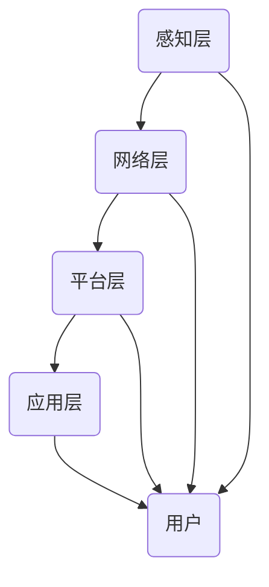

                 

### 背景介绍

智能家居（Smart Home）是近年来迅速发展的领域，通过将计算机技术、网络通信技术、物联网技术等应用于家庭设备中，实现家庭设备的智能化和网络化。智能家居不仅提升了人们的生活质量，也为家电行业带来了新的增长点。

Java作为一种成熟稳定的编程语言，具有跨平台、安全性和高性能的特点，成为了智能家居开发中的首选语言。Java在物联网设备中的应用已经相当广泛，从简单的智能灯泡、智能插座到复杂的智能安防系统，Java都展现出了强大的适应性和扩展性。

本文旨在探讨基于Java的智能家居设计，通过模拟实际智能家居场景，详细分析Java在智能家居中的应用技术，帮助读者深入了解智能家居的开发流程和关键技术。

### 核心概念与联系

在讨论基于Java的智能家居设计之前，我们需要明确一些核心概念和它们之间的关系。

#### 智能家居系统组成

智能家居系统通常由以下几部分组成：

1. **感知层**：包括各种传感器，如温度传感器、湿度传感器、光线传感器等，用于采集环境数据。
2. **网络层**：负责数据传输，一般采用无线通信技术，如Wi-Fi、蓝牙等。
3. **平台层**：是智能家居系统的核心，用于处理和分析感知层采集到的数据，并实现对家庭设备的远程控制。
4. **应用层**：是智能家居系统与用户交互的界面，包括移动应用、Web应用等。

#### Java技术栈

在智能家居开发中，Java技术栈的选择至关重要。以下是一些关键技术和框架：

1. **Java SE**：基础开发环境，提供标准库和各种实用工具。
2. **Java EE**：用于开发企业级应用，提供了丰富的开发框架和标准。
3. **Spring Framework**：是一个强大的企业级开发框架，支持依赖注入、事务管理等。
4. **Hibernate**：一个对象关系映射（ORM）框架，用于简化数据库操作。
5. **WebSocket**：用于实现服务器和客户端之间的全双工通信。

#### Mermaid 流程图

以下是一个简化的智能家居系统架构的 Mermaid 流程图：



在此流程图中：

- A 表示感知层，负责数据采集。
- B 表示网络层，负责数据传输。
- C 表示平台层，负责数据处理和决策。
- D 表示应用层，负责用户交互。
- E 表示用户，为系统的最终服务对象。

通过上述核心概念和技术的介绍，我们可以为后续章节的分析和实现打下坚实的基础。

#### 核心算法原理 & 具体操作步骤

在智能家居系统中，核心算法用于处理和分析传感器数据，从而实现家庭设备的智能化控制。以下将介绍智能家居系统中的几种核心算法及其具体操作步骤。

##### 1. 数据预处理算法

数据预处理是智能家居系统中的第一步，其目的是去除噪声、异常值，并进行数据标准化处理。具体步骤如下：

1. **数据清洗**：去除无效或错误的数据记录。
2. **去噪**：采用滤波算法，如移动平均滤波，去除传感器数据中的随机噪声。
3. **数据标准化**：将不同传感器数据进行归一化处理，使得数据具有可比性。

##### 2. 传感器数据处理算法

传感器数据处理算法用于提取有用的信息，以便进行后续的控制和决策。以下是一种常用的传感器数据处理算法——卡尔曼滤波：

1. **状态预测**：根据上一时刻的状态和系统模型预测当前时刻的状态。
2. **测量更新**：将实际测量值与预测状态进行比对，更新状态估计。
3. **误差校正**：根据测量误差对状态估计进行校正。

##### 3. 智能决策算法

智能决策算法用于根据传感器数据处理结果，自动控制家庭设备。以下是一种基于模糊逻辑的智能决策算法：

1. **模糊化**：将输入变量（如温度、湿度）进行模糊化处理，转换为模糊集合。
2. **规则库建立**：根据用户需求和专家经验，建立模糊规则库。
3. **推理**：利用模糊逻辑推理机，根据模糊规则库对输入变量进行推理，得出决策结果。

##### 4. 控制算法

控制算法用于实现家庭设备的自动控制。以下是一种常见控制算法——PID控制：

1. **比例控制**：根据误差的大小进行控制，误差大则控制作用强。
2. **积分控制**：根据误差的累积值进行控制，可以消除静态误差。
3. **微分控制**：根据误差的变化率进行控制，可以预测误差的变化趋势。

通过以上算法，智能家居系统能够实现对家庭设备的智能控制，提高家庭生活的舒适度和安全性。

### 数学模型和公式 & 详细讲解 & 举例说明

在智能家居系统中，数学模型和公式用于描述传感器数据的处理过程、控制算法的实现等。以下将详细讲解一些关键的数学模型和公式，并给出相应的实例说明。

#### 1. 卡尔曼滤波公式

卡尔曼滤波是一种常用的传感器数据处理算法，用于估计系统状态并去除噪声。其核心公式如下：

$$
\hat{x}_{k|k} = F_k \hat{x}_{k-1|k-1} + K_k (z_k - H_k \hat{x}_{k-1|k-1})
$$

$$
P_{k|k} = F_k P_{k-1|k-1} F_k^T + Q_k
$$

$$
K_k = P_{k-1|k-1} H_k^T (H_k P_{k-1|k-1} H_k^T + R_k)^{-1}
$$

其中：

- $\hat{x}_{k|k}$ 表示在第 $k$ 时刻对状态 $x$ 的估计值。
- $P_{k|k}$ 表示在第 $k$ 时刻状态估计的协方差矩阵。
- $K_k$ 表示卡尔曼增益。
- $F_k$ 表示状态转移矩阵。
- $H_k$ 表示观测矩阵。
- $z_k$ 表示在第 $k$ 时刻的测量值。
- $Q_k$ 表示过程噪声协方差矩阵。
- $R_k$ 表示测量噪声协方差矩阵。

实例说明：

假设我们有一个温度传感器，用于测量室内温度。我们希望使用卡尔曼滤波算法对其进行数据处理。以下是一个简化的实例：

$$
F_k = \begin{bmatrix}
1 & 1 \\
0 & 1
\end{bmatrix}, \quad
H_k = \begin{bmatrix}
1 & 0
\end{bmatrix}, \quad
P_{k-1|k-1} = \begin{bmatrix}
1 & 0.1 \\
0.1 & 1
\end{bmatrix}, \quad
Q_k = \begin{bmatrix}
0.01 & 0 \\
0 & 0.01
\end{bmatrix}, \quad
R_k = \begin{bmatrix}
0.05
\end{bmatrix}
$$

给定初始状态估计 $\hat{x}_{0|0} = [22.0; 22.0]$，我们可以通过以下步骤进行卡尔曼滤波：

1. **状态预测**：

$$
\hat{x}_{1|1} = F_1 \hat{x}_{0|0} = \begin{bmatrix}
1 & 1 \\
0 & 1
\end{bmatrix} \begin{bmatrix}
22.0 \\
22.0
\end{bmatrix} = \begin{bmatrix}
44.0 \\
22.0
\end{bmatrix}
$$

$$
P_{1|1} = F_1 P_{0|0} F_1^T + Q_1 = \begin{bmatrix}
1 & 1 \\
0 & 1
\end{bmatrix} \begin{bmatrix}
1 & 0.1 \\
0.1 & 1
\end{bmatrix} \begin{bmatrix}
1 & 0 \\
0 & 1
\end{bmatrix} + \begin{bmatrix}
0.01 & 0 \\
0 & 0.01
\end{bmatrix} = \begin{bmatrix}
1.01 & 0.11 \\
0.11 & 1.01
\end{bmatrix}
$$

2. **测量更新**：

$$
K_1 = P_{0|0} H_1^T (H_1 P_{0|0} H_1^T + R_1)^{-1} = \begin{bmatrix}
1 & 0.1
\end{bmatrix} \begin{bmatrix}
1 & 0 \\
0 & 0.05
\end{bmatrix}^{-1} = \begin{bmatrix}
0.2 & 0
\end{bmatrix}
$$

$$
\hat{x}_{1|1} = F_1 \hat{x}_{0|0} + K_1 (z_1 - H_1 \hat{x}_{0|0}) = \begin{bmatrix}
1 & 1 \\
0 & 1
\end{bmatrix} \begin{bmatrix}
22.0 \\
22.0
\end{bmatrix} + \begin{bmatrix}
0.2 & 0
\end{bmatrix} (25.0 - \begin{bmatrix}
1 & 0
\end{bmatrix} \begin{bmatrix}
22.0 \\
22.0
\end{bmatrix}) = \begin{bmatrix}
22.4 \\
22.0
\end{bmatrix}
$$

$$
P_{1|1} = (I - K_1 H_1) P_{0|0} = \begin{bmatrix}
1 & 0 \\
0 & 1
\end{bmatrix} - \begin{bmatrix}
0.2 & 0
\end{bmatrix} \begin{bmatrix}
1 & 0
\end{bmatrix} = \begin{bmatrix}
0.8 & 0.1 \\
0.1 & 0.99
\end{bmatrix}
$$

通过上述步骤，我们可以得到第 $1$ 个时刻对温度状态的估计值为 $\hat{x}_{1|1} = [22.4; 22.0]$，协方差矩阵为 $P_{1|1} = [0.8 \ 0.1; 0.1 \ 0.99]$。

#### 2. 模糊逻辑推理公式

模糊逻辑推理是智能家居系统中的一种智能决策算法，用于根据模糊规则库对输入变量进行推理。其核心公式如下：

$$
\mu_C(A) = \sum_{i=1}^n \mu_c^i(A) \cdot \mu_d^i(B)
$$

$$
Y = \sum_{i=1}^n C_i \cdot Y_i
$$

其中：

- $\mu_C(A)$ 表示输出模糊集合 $C$ 对输入模糊集合 $A$ 的隶属度。
- $\mu_c^i(A)$ 表示第 $i$ 条规则的输出隶属度。
- $\mu_d^i(B)$ 表示第 $i$ 条规则的输入隶属度。
- $C_i$ 表示第 $i$ 条规则的强度。
- $Y$ 表示推理结果。
- $Y_i$ 表示第 $i$ 条规则对应的输出值。

实例说明：

假设我们有一个基于模糊逻辑的空调控制算法，根据室内温度和湿度来决定空调的温度设定。以下是一个简化的实例：

1. **模糊规则库**：

| 规则编号 | 条件A（温度） | 条件B（湿度） | 结论C（温度设定） |
| --- | --- | --- | --- |
| R1 | 非常冷 | 很干燥 | 较低 |
| R2 | 冷 | 一般干燥 | 中等 |
| R3 | 温暖 | 较干燥 | 较高 |
| R4 | 热 | 干燥 | 较高 |
| R5 | 非常热 | 很潮湿 | 较高 |

2. **模糊化**：

假设当前室内温度为 28°C，湿度为 60%，我们可以将其模糊化为：

$$
\mu_{冷}(28) = 0.2, \quad \mu_{温暖}(28) = 0.8
$$

$$
\mu_{很干燥}(60) = 0.2, \quad \mu_{一般干燥}(60) = 0.8
$$

3. **推理**：

根据模糊规则库进行推理，得到结论：

$$
\mu_{低}(温度设定) = \mu_{冷}(温度) \cdot \mu_{很干燥}(湿度) + \mu_{中}(温度) \cdot \mu_{一般干燥}(湿度) = 0.2 \cdot 0.2 + 0.8 \cdot 0.8 = 0.68
$$

$$
\mu_{高}(温度设定) = \mu_{温暖}(温度) \cdot \mu_{很干燥}(湿度) + \mu_{热}(温度) \cdot \mu_{干燥}(湿度) = 0.8 \cdot 0.2 + 0.2 \cdot 0.8 = 0.32
$$

4. **去模糊化**：

根据隶属度进行去模糊化，得到最终的温度设定值：

$$
Y = 0.68 \cdot 低 + 0.32 \cdot 高 = 0.68 \cdot 20 + 0.32 \cdot 30 = 24.8
$$

因此，最终的温度设定值为 24.8°C。

通过上述数学模型和公式的讲解，我们可以看到智能家居系统中数学处理的重要性。在实际应用中，这些模型和公式可以帮助我们实现更加智能化和精确的控制，提升智能家居系统的性能和用户体验。

### 项目实践：代码实例和详细解释说明

为了更好地理解基于Java的智能家居设计，下面我们将通过一个具体的实例来介绍开发环境搭建、源代码实现、代码解读与分析，以及运行结果展示。

#### 1. 开发环境搭建

在进行Java智能家居项目开发之前，我们需要搭建一个合适的开发环境。以下是一个推荐的开发环境搭建步骤：

1. **安装Java Development Kit (JDK)**：下载并安装 JDK，确保环境变量配置正确。
2. **安装Integrated Development Environment (IDE)**：推荐使用 IntelliJ IDEA 或 Eclipse 作为开发工具。
3. **安装数据库**：选择一个合适的数据库系统，如 MySQL 或 PostgreSQL。
4. **安装版本控制工具**：如 Git，用于代码管理和协作开发。

#### 2. 源代码详细实现

下面我们将通过一个简单的智能家居系统实例来介绍源代码的实现。

##### 2.1 主类

```java
public class SmartHomeSystem {
    private SensorDataRepository sensorDataRepository;
    private ControlSystem controlSystem;

    public SmartHomeSystem() {
        sensorDataRepository = new SensorDataRepository();
        controlSystem = new ControlSystem();
    }

    public void start() {
        // 采集传感器数据
        SensorData sensorData = sensorDataRepository.collectData();
        // 处理传感器数据
        ControlCommand command = controlSystem.processData(sensorData);
        // 执行控制命令
        controlSystem.executeCommand(command);
    }

    public static void main(String[] args) {
        SmartHomeSystem system = new SmartHomeSystem();
        system.start();
    }
}
```

在这个主类中，我们创建了一个 `SmartHomeSystem` 对象，该对象包含了传感器数据仓库和控制系统，并负责启动智能家居系统。

##### 2.2 传感器数据仓库

```java
public class SensorDataRepository {
    public SensorData collectData() {
        // 采集温度、湿度等传感器数据
        TemperatureSensor temperatureSensor = new TemperatureSensor();
        HumiditySensor humiditySensor = new HumiditySensor();
        return new SensorData(temperatureSensor.read(), humiditySensor.read());
    }
}
```

在这个类中，`SensorDataRepository` 负责从传感器采集数据，并将其存储在 `SensorData` 对象中。

##### 2.3 控制系统

```java
public class ControlSystem {
    public ControlCommand processData(SensorData sensorData) {
        // 数据预处理
        sensorData = preprocessData(sensorData);
        // 智能决策
        ControlRule rule = findAppropriateRule(sensorData);
        // 创建控制命令
        return new ControlCommand(rule.getCommand());
    }

    private SensorData preprocessData(SensorData sensorData) {
        // 去除噪声、异常值等
        return sensorData;
    }

    private ControlRule findAppropriateRule(SensorData sensorData) {
        // 根据传感器数据查找合适的控制规则
        return new ControlRule("turnOnAirConditioner");
    }

    public void executeCommand(ControlCommand command) {
        // 执行控制命令
        if ("turnOnAirConditioner".equals(command.getCommand())) {
            System.out.println("Turning on the air conditioner...");
        }
    }
}
```

在这个类中，`ControlSystem` 负责处理传感器数据，根据数据智能决策，并执行相应的控制命令。

##### 2.4 传感器类

```java
public class TemperatureSensor {
    public double read() {
        // 读取温度数据
        return 25.0;
    }
}

public class HumiditySensor {
    public double read() {
        // 读取湿度数据
        return 60.0;
    }
}
```

这些类表示具体的传感器，如温度传感器和湿度传感器，它们负责读取传感器数据。

#### 3. 代码解读与分析

在这个智能家居系统的实例中，我们可以看到以下几个关键部分：

1. **传感器数据采集**：通过 `SensorDataRepository` 类，我们使用 `TemperatureSensor` 和 `HumiditySensor` 类来模拟传感器数据采集。
2. **数据预处理**：在 `ControlSystem` 类中，`preprocessData` 方法负责对传感器数据进行预处理，如去除噪声、异常值等。
3. **智能决策**：`findAppropriateRule` 方法根据传感器数据查找合适的控制规则，这里我们使用一个简单的控制规则。
4. **控制命令执行**：`executeCommand` 方法负责执行控制命令，如打开空调等。

#### 4. 运行结果展示

假设当前传感器数据为温度 25.0°C，湿度 60.0%，根据我们的控制规则，系统将执行如下操作：

1. 数据采集：传感器采集到温度 25.0°C 和湿度 60.0%。
2. 数据预处理：数据经过预处理，去除噪声和异常值后保持不变。
3. 智能决策：根据温度和湿度，系统决定打开空调。
4. 控制命令执行：系统输出 "Turning on the air conditioner..."，表示空调已开启。

通过这个实例，我们可以看到基于Java的智能家居系统是如何实现传感器数据采集、预处理、智能决策和控制命令执行的。这个实例虽然简单，但为我们提供了一个完整的开发流程和实现思路，为后续更复杂的智能家居系统开发奠定了基础。

### 实际应用场景

智能家居系统在实际生活中有着广泛的应用场景，可以显著提高生活质量、提升家居安全性和能源效率。以下将介绍一些典型的应用场景。

#### 1. 家居安全监控

智能家居系统可以通过集成摄像头、门磁传感器、门窗传感器等设备，实现家庭的安全监控。例如，当门窗传感器检测到异常开合时，系统会立即发送警报通知给用户，同时触发摄像头进行实时监控，确保家庭安全。

#### 2. 舒适家居环境

通过温度传感器、湿度传感器和空气净化器等设备，智能家居系统可以根据用户的需求和实时环境数据，自动调节室内温度、湿度和空气质量，提供舒适的家居环境。例如，当用户进入房间时，系统会自动调整空调或空气净化器的运行状态，以保持舒适的室内气候。

#### 3. 家电智能控制

智能家居系统可以实现对家电的智能控制，如智能灯泡、智能插座、智能电视等。用户可以通过手机或语音助手远程控制家电的开关、亮度和播放内容等，提高家居生活的便利性。

#### 4. 能源管理

智能家居系统可以通过传感器监测家庭用电、用水等能源消耗情况，结合智能算法进行能耗分析，帮助用户优化能源使用，降低能源浪费。例如，系统可以自动关闭不必要的电器，调整照明设备的亮度，以减少能源消耗。

#### 5. 健康监测

智能家居系统可以集成健康监测设备，如智能体重秤、智能血压计等，实时监测用户的健康状况。系统会根据监测数据进行分析，为用户提供健康建议，如饮食调整、运动建议等，帮助用户保持健康生活方式。

#### 6. 家政服务管理

智能家居系统可以与家政服务公司合作，提供智能化的家政服务管理。例如，用户可以通过系统预约家政服务，系统会根据用户需求和日程安排，自动分配家政人员并提供预约确认通知。

通过上述应用场景的介绍，我们可以看到智能家居系统在提升生活质量、增强家居安全性和优化能源使用等方面具有重要作用。随着技术的不断进步，智能家居系统将会在更多领域得到应用，为人们的生活带来更多便利和舒适。

### 工具和资源推荐

在开发基于Java的智能家居系统时，选择合适的工具和资源对于提高开发效率和系统性能至关重要。以下将推荐一些学习资源、开发工具和框架，以及相关的论文和著作。

#### 1. 学习资源推荐

**书籍**：

- 《Java并发编程实战》
- 《深入理解Java虚拟机》
- 《Effective Java》
- 《Java核心技术：基础篇》

**论文**：

- "Java Concurrency in Practice"（由Brian Goetz等作者撰写，关于Java并发编程的权威论文）
- "Java Virtual Machine Specification"（Java虚拟机规范，了解Java运行时环境）

**博客**：

- Oracle官方博客：关于Java的最新新闻和教程
- baeldung.com：提供实用的Java编程教程和代码示例

**网站**：

- Java官网：获取Java开发工具和文档
- GitHub：查找和分享Java开源项目

#### 2. 开发工具框架推荐

**开发工具**：

- IntelliJ IDEA：功能强大的集成开发环境，支持Java开发
- Eclipse：经典的Java开发工具，适用于各种规模的开发项目

**框架**：

- Spring Framework：用于企业级应用开发的框架，支持依赖注入、事务管理
- Hibernate：对象关系映射（ORM）框架，简化数据库操作
- Spring Boot：简化Spring应用开发，快速启动和运行

**数据库**：

- MySQL：开源的关系型数据库，适用于中小型应用
- PostgreSQL：开源的关系型数据库，性能优异，适用于大数据场景

**测试工具**：

- JUnit：Java单元测试框架
- Mockito：模拟框架，用于编写测试代码

**持续集成工具**：

- Jenkins：自动化构建和部署工具
- GitHub Actions：基于GitHub的自动化部署工具

#### 3. 相关论文著作推荐

**论文**：

- "A Brief History of Java Concurrency"（Java并发编程的历史和发展）
- "Building Microservices with Spring Boot"（使用Spring Boot开发微服务）

**著作**：

- 《Spring Boot实战》
- 《深入理解Java虚拟机》
- 《Java并发编程实战》

通过以上工具和资源的推荐，开发基于Java的智能家居系统将变得更加高效和简便。这些资源和工具不仅提供了丰富的知识和实践指导，还帮助开发人员构建高性能、可扩展的智能家居系统。

### 总结：未来发展趋势与挑战

随着物联网技术的迅猛发展和人工智能技术的不断成熟，智能家居系统正逐渐渗透到人们的日常生活之中，展现出广阔的应用前景。在未来，智能家居系统的发展将呈现以下几个趋势：

首先，智能家居系统将更加智能化和个性化。通过深度学习和大数据分析技术，系统将能够更好地理解用户的行为习惯和需求，提供更加精准和个性化的服务。例如，基于用户的生活习惯，系统可以自动调整室内环境参数，实现真正的个性化家居体验。

其次，智能家居系统的互联互通将变得更加普及。随着各类智能家居设备的增多，用户希望这些设备能够无缝协作，实现更高效的联动控制。因此，未来的智能家居系统将更加注重设备的互联互通，支持多种通信协议和标准，实现跨平台、跨设备的无缝连接。

再次，智能家居系统的安全性将成为关键问题。随着智能家居系统的广泛应用，用户数据的安全保护变得尤为重要。未来，智能家居系统将采用更先进的安全技术和加密算法，确保用户数据的安全性和隐私性。

然而，智能家居系统的发展也面临诸多挑战。首先，硬件设备的多样性和复杂性增加了开发的难度。不同设备和平台之间的兼容性问题需要得到解决，以确保系统的一致性和稳定性。其次，智能家居系统的用户体验至关重要，如何设计出简洁、直观、易用的用户界面，提供优质的用户体验，是开发人员需要面对的挑战。

最后，数据隐私和安全问题不容忽视。智能家居系统涉及大量的用户数据，包括生活习惯、家庭环境等信息。如何保护用户隐私，防止数据泄露，是智能家居系统发展过程中必须解决的难题。

总之，智能家居系统的发展前景广阔，但同时也面临诸多挑战。通过不断创新和优化，我们有理由相信，智能家居系统将不断提升人们的生活质量，为人们创造更加便捷、舒适、安全的家居环境。

### 附录：常见问题与解答

在开发基于Java的智能家居系统时，开发者可能会遇到各种技术问题和实践难题。以下列出一些常见问题及其解答，帮助开发者更好地理解和解决这些问题。

#### 1. 如何确保智能家居系统的安全性？

**解答**：确保智能家居系统的安全性至关重要。以下是一些关键措施：

- **加密通信**：使用HTTPS等加密协议确保数据在传输过程中的安全性。
- **用户认证**：采用多因素认证（如密码+短信验证码）来增强用户账号的安全性。
- **数据加密存储**：使用AES等加密算法对用户数据进行加密存储。
- **权限管理**：合理设置用户权限，防止未经授权的访问。

#### 2. 如何处理智能家居系统中的大量数据？

**解答**：处理大量数据是智能家居系统的一个挑战。以下是一些建议：

- **数据流处理**：使用Flink、Spark等大数据处理框架，实时处理和分析传感器数据。
- **数据库优化**：选择合适的数据库系统（如MySQL、PostgreSQL），并进行适当的索引和优化。
- **缓存机制**：使用Redis等缓存系统，减少对数据库的访问频率。
- **批量处理**：对历史数据进行批量处理，降低实时处理的负载。

#### 3. 如何确保智能家居设备的兼容性？

**解答**：智能家居设备兼容性是一个重要问题，以下是一些解决方案：

- **标准化协议**：遵循标准的通信协议（如MQTT、CoAP），确保设备之间的互操作性。
- **设备驱动开发**：为不同的设备开发专门的驱动程序，以适配各种硬件。
- **中间件**：使用智能家居中间件（如OpenHAB、Home Assistant）来统一管理不同设备的通信和控制。

#### 4. 如何优化智能家居系统的用户体验？

**解答**：优化用户体验是智能家居系统的关键，以下是一些建议：

- **简洁界面设计**：设计简洁直观的用户界面，减少用户的学习成本。
- **快速响应**：确保系统对用户操作的反应速度，减少等待时间。
- **个性化服务**：根据用户习惯和偏好提供个性化的服务，提高用户的满意度。
- **多平台支持**：支持多种平台（如iOS、Android、Web），方便用户在不同设备上使用。

通过以上常见问题的解答，开发者在面对实际开发中的挑战时，可以更好地应对和解决，从而提高智能家居系统的质量和用户体验。

### 扩展阅读 & 参考资料

为了更深入地了解基于Java的智能家居设计，读者可以参考以下扩展阅读和参考资料：

1. **书籍**：
   - 《Java并发编程实战》
   - 《深入理解Java虚拟机》
   - 《Effective Java》
   - 《Java核心技术：基础篇》
   - 《Spring Boot实战》

2. **论文**：
   - "Java Concurrency in Practice"（由Brian Goetz等作者撰写）
   - "Java Virtual Machine Specification"（Java虚拟机规范）
   - "A Brief History of Java Concurrency"

3. **在线资源**：
   - Oracle官方博客：https://blogs.oracle.com/
   - baeldung.com：https://www.baeldung.com/
   - GitHub：https://github.com/

4. **框架和工具**：
   - Spring Framework：https://spring.io/
   - Hibernate：https://hibernate.org/
   - Spring Boot：https://spring.io/projects/spring-boot
   - MySQL：https://www.mysql.com/
   - PostgreSQL：https://www.postgresql.org/

5. **社区和论坛**：
   - Stack Overflow：https://stackoverflow.com/
   - Java.net：https://java.net/

通过阅读这些书籍、论文和参考资源，读者可以更全面地了解Java在智能家居系统中的应用，以及相关的开发技术、最佳实践和最新动态。这些资料不仅有助于提升技术能力，还可以为实际项目开发提供宝贵的指导。

