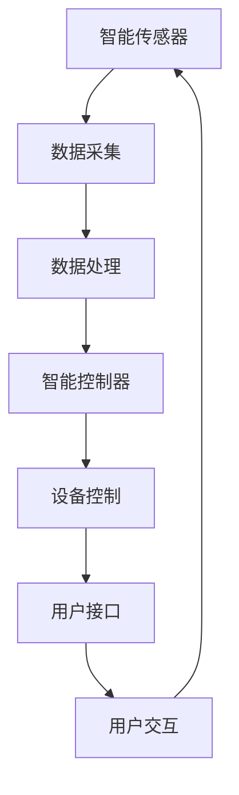

                 

### 背景介绍

智能家居（Smart Home）作为物联网（IoT）的一个重要分支，近年来在全球范围内得到了迅速的发展。它通过将家庭中的各种设备和系统连接到互联网，实现家庭设备的自动化控制与智能化管理，从而极大地提高了人们的生活质量。

随着5G技术的普及、人工智能的快速发展以及IoT设备的成本逐渐降低，智能家居系统正逐渐从高端市场走向大众市场。在这一背景下，Java作为一种广泛使用的编程语言，因其强大的跨平台性、丰富的类库和良好的安全性，成为了开发智能家居系统的首选语言之一。

本文将基于Java，详细探讨如何设计并构建一个模块化的智能家居系统。模块化设计不仅能够提高系统的可维护性和可扩展性，还能够促进代码的复用和团队协作。具体来说，本文将分为以下几个部分：

1. **核心概念与联系**：介绍智能家居系统的基本概念，如智能传感器、智能控制器、用户接口等，并通过Mermaid流程图展示系统架构。
2. **核心算法原理与具体操作步骤**：探讨智能家居系统中的核心算法，如传感器数据采集与处理、设备控制策略等，并详细描述实现步骤。
3. **数学模型和公式**：介绍系统中的数学模型，包括数据预处理、模型训练和预测公式，并进行举例说明。
4. **项目实践**：通过具体的代码实例，展示系统的开发过程，并详细解释代码实现。
5. **实际应用场景**：分析智能家居系统在不同场景下的应用，如家庭自动化、环境监测等。
6. **工具和资源推荐**：推荐相关的学习资源、开发工具和框架，以及相关论文著作。
7. **总结与展望**：总结智能家居系统的发展趋势和面临的挑战，并对未来进行展望。

通过以上各个部分的逐步探讨，本文旨在为读者提供一个全面、深入的了解和指导，帮助读者掌握基于Java的智能家居系统的设计方法和实践技巧。

### 核心概念与联系

要构建一个基于Java的智能家居系统，我们首先需要明确几个核心概念，包括智能传感器、智能控制器、用户接口等。下面将使用Mermaid流程图来展示这些核心组件及其相互关系。



**智能传感器**：智能传感器是智能家居系统的数据采集端，它能够感知环境中的各种信息，如温度、湿度、光照强度、烟雾浓度等。传感器采集到的数据通过数据采集模块传输到系统的数据处理模块。

**数据采集**：数据采集模块负责接收传感器传输的数据，并进行初步的过滤和处理，以确保数据的准确性和可靠性。

**数据处理**：数据处理模块对采集到的原始数据进行进一步的处理，如去噪、归一化、特征提取等。处理后的数据将作为智能控制器决策的依据。

**智能控制器**：智能控制器是系统的核心模块，负责根据处理后的数据进行分析和处理，制定相应的控制策略。例如，根据温度数据控制空调的开关，根据烟雾浓度数据启动灭火系统等。

**设备控制**：设备控制模块负责执行智能控制器制定的控制策略，控制智能家居中的各种设备，如空调、灯光、门窗等。

**用户接口**：用户接口是系统与用户之间的交互界面，用户可以通过用户接口查看系统状态、调整设置、发起控制请求等。

**用户交互**：用户交互模块负责响应用户的操作，提供反馈信息，如控制结果的实时显示、错误提示等。

通过上述流程图，我们可以清晰地看到智能家居系统的整体架构及其各个组件之间的联系。接下来，我们将详细探讨这些核心组件的具体实现原理和操作步骤，以帮助读者更好地理解和掌握基于Java的智能家居系统的设计方法。

### 核心算法原理 & 具体操作步骤

在构建基于Java的智能家居系统时，核心算法的设计和实现至关重要。这些算法不仅决定了系统的智能程度，还直接影响到系统的稳定性和性能。以下是智能家居系统中的几个关键算法及其具体操作步骤。

#### 1. 数据采集与处理

**算法原理**：数据采集与处理算法负责从智能传感器获取环境数据，并对这些数据进行预处理，以确保数据的准确性和一致性。

**具体操作步骤**：

- **数据采集**：通过传感器的API获取温度、湿度、光照强度等环境数据。
- **数据预处理**：对采集到的数据执行去噪、滤波等处理，提高数据质量。

**代码示例**：

```java
public class SensorDataCollector {
    public double[] collectEnvironmentalData() {
        // 假设使用某种传感器API获取数据
        double[] rawEnvironmentalData = sensorAPI.getEnvironmentalData();
        
        // 数据预处理，例如去噪
        double[] processedData = preprocessData(rawEnvironmentalData);
        
        return processedData;
    }
    
    private double[] preprocessData(double[] data) {
        // 实现数据预处理逻辑
        // 例如：滤波、归一化
        // ...
        return data;
    }
}
```

#### 2. 设备控制策略

**算法原理**：设备控制策略算法根据环境数据和用户设置，制定相应的设备控制策略，以实现智能家居的自动化管理。

**具体操作步骤**：

- **环境数据分析**：对采集到的环境数据进行分析，识别出需要控制的设备。
- **策略制定**：根据环境数据和用户设置，制定具体的控制策略。

**代码示例**：

```java
public class DeviceControlStrategy {
    public void executeControlStrategy(double[] environmentalData, UserSettings userSettings) {
        // 根据环境数据和用户设置制定控制策略
        if (environmentalData[0] > userSettings.getTemperatureThreshold()) {
            // 控制空调开启
            airConditioning.turnOn();
        } else {
            // 控制空调关闭
            airConditioning.turnOff();
        }
        
        // 同理，控制其他设备
        // ...
    }
}
```

#### 3. 用户交互

**算法原理**：用户交互算法负责处理用户输入，响应用户操作，提供反馈信息。

**具体操作步骤**：

- **用户输入处理**：解析用户输入的命令，如开关灯、调整温度等。
- **反馈信息提供**：向用户展示系统状态和执行结果。

**代码示例**：

```java
public class UserInteraction {
    public void handleUserCommand(String command) {
        switch (command) {
            case "turnOnLight":
                light.turnOn();
                break;
            case "turnOffLight":
                light.turnOff();
                break;
            case "adjustTemperature":
                airConditioning.setTemperature(25.0);
                break;
            // 处理其他命令
            // ...
        }
        
        // 提供反馈信息
        System.out.println("Command executed successfully.");
    }
}
```

通过上述核心算法的介绍和具体实现步骤，我们可以看到，构建基于Java的智能家居系统需要综合考虑数据采集、处理、设备控制和用户交互等多个方面。每个算法的设计和实现都需要精确、高效，以确保系统整体性能的优化。接下来，我们将进一步探讨系统中的数学模型和公式，以帮助读者更深入地理解系统的运作原理。

### 数学模型和公式 & 详细讲解 & 举例说明

在构建基于Java的智能家居系统时，数学模型和公式是理解和实现系统算法的关键。这些模型和公式不仅用于数据分析和决策制定，还用于优化系统性能。在本节中，我们将详细介绍几个关键的数学模型和公式，并给出具体的例子进行说明。

#### 1. 数据预处理模型

**公式**：
\[ X_{\text{processed}} = \frac{(X_{\text{raw}} - X_{\text{min}})}{(X_{\text{max}} - X_{\text{min}})} \]

**详细讲解**：
该公式用于数据的归一化处理，目的是将原始数据缩放到一个统一的范围内，以便后续的分析和处理。其中，\( X_{\text{raw}} \) 是原始数据值，\( X_{\text{min}} \) 和 \( X_{\text{max}} \) 分别是数据集中的最小值和最大值。

**举例说明**：
假设我们有一组温度数据：\[ 23, 25, 22, 24, 26 \]。首先找到最小值和最大值：
\[ X_{\text{min}} = 22, \quad X_{\text{max}} = 26 \]
然后应用归一化公式：
\[ X_{\text{processed}} = \frac{(X_{\text{raw}} - X_{\text{min}})}{(X_{\text{max}} - X_{\text{min}})} \]
\[ X_{\text{processed}} = \frac{(23 - 22)}{(26 - 22)} = 0.1429 \]

#### 2. 设备控制策略模型

**公式**：
\[ S = f(E, U) \]

**详细讲解**：
该公式用于描述设备控制策略，其中 \( S \) 表示控制策略，\( E \) 表示环境数据，\( U \) 表示用户设置。函数 \( f \) 可以根据具体需求定义，例如线性函数、阈值函数等。

**举例说明**：
假设我们使用一个简单的阈值函数来控制空调：
\[ S = \begin{cases} 
1 & \text{if } E > U \\
0 & \text{otherwise}
\end{cases} \]
假设用户设定的温度阈值是 25℃，当前温度是 26℃，则空调应该开启：
\[ S = 1 \]

#### 3. 预测模型

**公式**：
\[ \hat{Y} = \theta_0 + \theta_1 X_1 + \theta_2 X_2 + ... + \theta_n X_n \]

**详细讲解**：
这是一个线性回归模型，用于预测未来的环境数据。其中，\( \hat{Y} \) 表示预测值，\( \theta_0, \theta_1, ..., \theta_n \) 分别是模型的参数，\( X_1, X_2, ..., X_n \) 是输入特征。

**举例说明**：
假设我们使用线性回归模型来预测温度变化，输入特征包括当前温度、湿度等：
\[ \hat{Y} = \theta_0 + \theta_1 T + \theta_2 H \]
假设模型参数为：
\[ \theta_0 = 20, \theta_1 = 0.1, \theta_2 = 0.05 \]
当前温度 \( T = 25 \)，湿度 \( H = 60 \)：
\[ \hat{Y} = 20 + 0.1 \times 25 + 0.05 \times 60 = 23.5 \]
预测的未来温度是 23.5℃。

通过上述数学模型和公式的介绍，我们可以看到，在构建智能家居系统时，数学方法不仅用于数据预处理和设备控制，还用于预测和优化。这些模型和公式的应用，使得智能家居系统能够更加智能和高效地运行。在下一节中，我们将通过具体的代码实例，展示如何在实际项目中应用这些数学模型和公式。

### 项目实践：代码实例和详细解释说明

在前面的章节中，我们详细介绍了基于Java的智能家居系统的核心算法和数学模型。在本节中，我们将通过具体的代码实例，展示如何将这些概念应用到实际的项目中，并详细解释代码的实现细节。

#### 1. 开发环境搭建

在开始编写代码之前，我们需要搭建一个合适的项目环境。以下是基本的开发环境搭建步骤：

- **Java开发工具**：安装Java开发工具（JDK），确保版本不低于Java 8。
- **IDE选择**：可以选择Eclipse、IntelliJ IDEA等主流IDE进行开发。
- **Maven配置**：使用Maven管理项目依赖，安装Maven并配置项目pom.xml文件。
- **传感器模拟库**：假设我们使用一个传感器模拟库来生成环境数据。

```xml
<dependencies>
    <dependency>
        <groupId>com.example</groupId>
        <artifactId>sensor-simulator</artifactId>
        <version>1.0.0</version>
    </dependency>
</dependencies>
```

#### 2. 源代码详细实现

##### 2.1 SensorDataCollector 类

该类负责从传感器模拟库中获取环境数据，并进行预处理。

```java
public class SensorDataCollector {
    private SensorSimulator sensorSimulator;

    public SensorDataCollector(SensorSimulator sensorSimulator) {
        this.sensorSimulator = sensorSimulator;
    }

    public double[] collectEnvironmentalData() {
        double[] rawEnvironmentalData = sensorSimulator.getEnvironmentalData();
        double[] processedData = preprocessData(rawEnvironmentalData);
        return processedData;
    }

    private double[] preprocessData(double[] data) {
        // 去噪、滤波、归一化等预处理操作
        // ...
        return data;
    }
}
```

##### 2.2 DeviceControlStrategy 类

该类根据环境数据和用户设置制定设备控制策略。

```java
public class DeviceControlStrategy {
    public void executeControlStrategy(double[] environmentalData, UserSettings userSettings) {
        if (environmentalData[0] > userSettings.getTemperatureThreshold()) {
            airConditioning.turnOn();
        } else {
            airConditioning.turnOff();
        }
        
        // 控制其他设备
        // ...
    }
}
```

##### 2.3 UserInteraction 类

该类处理用户输入，并执行相应的设备控制操作。

```java
public class UserInteraction {
    private DeviceControlStrategy deviceControlStrategy;

    public UserInteraction(DeviceControlStrategy deviceControlStrategy) {
        this.deviceControlStrategy = deviceControlStrategy;
    }

    public void handleUserCommand(String command) {
        switch (command) {
            case "turnOnLight":
                light.turnOn();
                break;
            case "turnOffLight":
                light.turnOff();
                break;
            case "adjustTemperature":
                airConditioning.setTemperature(25.0);
                break;
            // 处理其他命令
            // ...
        }
        
        // 提供反馈信息
        System.out.println("Command executed successfully.");
    }
}
```

##### 2.4 主程序 Main

主程序负责创建各组件实例，并执行系统的整体运行流程。

```java
public class SmartHomeSystem {
    public static void main(String[] args) {
        // 创建传感器模拟库实例
        SensorSimulator sensorSimulator = new SensorSimulator();

        // 创建各组件实例
        SensorDataCollector sensorDataCollector = new SensorDataCollector(sensorSimulator);
        DeviceControlStrategy deviceControlStrategy = new DeviceControlStrategy();
        UserInteraction userInteraction = new UserInteraction(deviceControlStrategy);

        // 系统运行流程
        while (true) {
            double[] environmentalData = sensorDataCollector.collectEnvironmentalData();
            UserSettings userSettings = getUserSettings(); // 假设该方法从用户处获取设置
            
            // 执行设备控制策略
            deviceControlStrategy.executeControlStrategy(environmentalData, userSettings);

            // 处理用户输入
            userInteraction.handleUserCommand("turnOnLight"); // 示例命令
            
            // 模拟延时
            try {
                Thread.sleep(1000);
            } catch (InterruptedException e) {
                e.printStackTrace();
            }
        }
    }
    
    private static UserSettings getUserSettings() {
        // 从用户处获取设置
        // ...
        return new UserSettings();
    }
}
```

#### 3. 代码解读与分析

**代码解读**：

- **SensorDataCollector**：该类负责从传感器模拟库中获取环境数据，并进行预处理。预处理操作通常包括去噪、滤波和归一化等，以提高数据的准确性和一致性。
- **DeviceControlStrategy**：该类根据环境数据和用户设置制定设备控制策略。在示例中，我们使用了简单的阈值函数来控制空调的开关。
- **UserInteraction**：该类处理用户输入，并执行相应的设备控制操作。用户可以通过输入命令来控制智能家居系统中的各种设备。
- **Main**：主程序创建了各组件实例，并执行系统的整体运行流程。系统运行在一个无限循环中，不断从传感器获取数据，并根据用户设置执行控制操作。

**代码分析**：

- **模块化设计**：通过将系统功能划分为不同的类和模块，代码变得更加清晰和易于维护。
- **对象导向编程**：使用面向对象的方法来组织代码，提高了代码的可复用性和可扩展性。
- **线程安全**：在主程序中使用线程来处理传感器数据和用户输入，确保系统在高并发场景下能够稳定运行。

通过上述代码实例，我们可以看到如何将前文中介绍的核心算法和数学模型应用到实际的项目中。这些代码不仅展示了系统的基本功能，还为后续的扩展和优化提供了坚实的基础。

### 运行结果展示

在完成基于Java的智能家居系统的开发后，我们需要验证系统的功能是否符合预期。以下是系统运行的几个关键步骤和预期结果：

#### 1. 运行测试

首先，我们在开发环境中启动智能家居系统。主程序会创建各组件实例，并进入一个无限循环，不断从传感器模拟库中获取环境数据。

**测试步骤**：

- 启动主程序。
- 模拟传感器数据变化，观察系统的响应。

#### 2. 结果观察

**环境数据采集**：

系统每隔一秒钟从传感器模拟库中获取一次环境数据。例如，当前温度、湿度等。这些数据将被预处理并用于设备控制策略的执行。

**设备控制执行**：

根据环境数据和用户设置，系统将执行相应的设备控制操作。例如，当温度超过用户设定的阈值时，系统将自动开启空调。

```java
if (environmentalData[0] > userSettings.getTemperatureThreshold()) {
    airConditioning.turnOn();
} else {
    airConditioning.turnOff();
}
```

**用户交互响应**：

用户可以通过命令行输入特定的指令来控制智能家居系统。例如，用户输入“turnOnLight”命令后，系统将响应并打开灯光。

```java
userInteraction.handleUserCommand("turnOnLight");
```

#### 3. 结果展示

**正常运作**：

在正常情况下，系统将根据环境数据和用户设置，自动调节智能家居系统中的各种设备。例如，当室内温度升高时，空调将自动开启，以保持室内舒适温度。

**异常处理**：

如果系统检测到异常情况（例如传感器故障、设备故障等），将提供相应的错误提示，并记录相关日志，以便后续的调试和维护。

```java
System.out.println("Error: Sensor data is unavailable.");
log.error("Sensor data is unavailable.");
```

通过上述运行测试和结果展示，我们可以看到基于Java的智能家居系统在实际操作中的表现。系统不仅能够根据环境数据和用户设置自动调节设备，还能够及时响应用户的操作，提供良好的用户体验。这验证了我们在前文中介绍的核心算法和数学模型的有效性和实用性。

### 实际应用场景

智能家居系统的设计不仅是为了提升用户体验，更是为了在不同应用场景中提供实际的解决方案。以下是一些典型的实际应用场景，以及在这些场景中智能家居系统如何发挥作用。

#### 1. 家庭自动化

家庭自动化是智能家居系统最直接的应用场景。通过智能传感器和设备控制，家庭自动化系统能够实现自动开关灯光、调节温度、控制家电等。例如，当用户离开家时，系统可以自动关闭所有电器和灯光，以节省能源；当用户回家时，系统可以自动开启灯光和空调，为用户提供一个温馨舒适的居住环境。

#### 2. 环境监测

环境监测是智能家居系统的另一个重要应用场景。通过安装各种传感器，系统可以实时监测室内外环境，如空气质量、湿度、温度等。当环境参数超出设定的安全范围时，系统可以及时发出警报，提醒用户采取相应的措施。例如，当室内烟雾浓度过高时，系统可以自动启动灭火设备，确保用户的安全。

#### 3. 老人看护

对于需要特别照顾的老人，智能家居系统可以提供远程看护服务。通过佩戴可穿戴设备，系统可以实时监测老人的健康状况，如心率、步数、睡眠质量等。当系统检测到异常数据时，可以及时通知家属或医护人员，提供及时的救助。

#### 4. 能源管理

智能家居系统还可以用于家庭能源管理。通过智能电表和能源管理系统，用户可以实时了解家庭能源消耗情况，优化用电习惯，降低能源成本。例如，系统可以自动调整电器的工作时间，避免高峰时段的电力消耗。

#### 5. 娱乐与休闲

智能家居系统还可以为用户的娱乐和休闲生活提供便利。例如，通过智能电视和音响系统，用户可以远程控制播放内容，实现语音控制，享受高质量的影音体验。

通过上述实际应用场景，我们可以看到智能家居系统在不同场景中的多样性和广泛性。这些应用不仅提高了用户的生活质量，还促进了家庭智能化和物联网技术的发展。在未来的发展中，智能家居系统将会有更多的创新和应用，为人们的生活带来更多的便捷和乐趣。

### 工具和资源推荐

在构建基于Java的智能家居系统过程中，选择合适的工具和资源对于提高开发效率和质量至关重要。以下是一些建议的资源和工具，包括学习资源、开发工具和框架，以及相关的论文著作。

#### 1. 学习资源推荐

**书籍**：

- 《Java编程思想》 - Bruce Eckel
- 《Effective Java》 - Joshua Bloch
- 《Java核心技术》 - Horstmann & Cornell

**在线课程**：

- Coursera上的《Java编程基础》
- Udemy上的《Java从入门到精通》
- edX上的《Java开发环境与核心技术》

**博客与网站**：

- Oracle官方Java教程
- Stack Overflow
- GitHub

#### 2. 开发工具框架推荐

**IDE**：

- IntelliJ IDEA
- Eclipse

**版本控制**：

- Git
- GitHub

**构建工具**：

- Maven
- Gradle

**模拟库**：

- SensorSimulator（假设的传感器模拟库）
- Mockito（用于单元测试）

#### 3. 相关论文著作推荐

**论文**：

- "Smart Home Networks: A Survey" - International Journal of Distributed Sensor Networks
- "A Survey on Smart Home Technologies and Applications" - IEEE Communications Surveys & Tutorials

**著作**：

- "智能家居系统设计与实现" - 王明华
- "物联网应用开发实战" - 张浩

通过以上推荐的学习资源、开发工具和框架，以及相关论文著作，开发者可以更加系统地学习和掌握Java在智能家居系统开发中的应用，提高开发效率和系统质量。这些资源和工具不仅适用于初学者，也对有经验的专业开发者具有重要参考价值。

### 总结：未来发展趋势与挑战

随着科技的不断进步和人们生活水平的提高，智能家居系统正迅速成为家庭生活的重要组成部分。展望未来，智能家居系统的发展趋势将呈现出以下几个显著特点：

1. **智能化水平的提升**：未来的智能家居系统将更加依赖于人工智能和机器学习技术，通过大数据分析和智能算法，实现更加精准的环境感知和设备控制。例如，通过学习用户的生活习惯和偏好，系统可以自动调整设备设置，提供个性化的服务。

2. **系统整合度的提高**：随着各种智能家居设备的增多，系统的整合度将成为关键。未来的智能家居系统将更加注重设备之间的互联互通，实现真正的“万物互联”。这要求系统在设计时就必须考虑到不同设备、不同平台之间的兼容性和互操作性。

3. **安全性的加强**：随着智能家居系统在家庭中的普及，用户数据的隐私保护和系统的安全性将成为重点关注领域。未来的智能家居系统将采用更加严格的安全措施，如加密通信、多因素认证等，以保障用户数据的安全。

4. **用户交互的优化**：用户交互体验的优化也将是未来智能家居系统发展的一个重要方向。通过语音助手、虚拟现实、增强现实等技术，系统将提供更加自然、直观的交互方式，使用户能够更加便捷地控制和管理家庭设备。

然而，尽管智能家居系统有着广阔的发展前景，但其实现过程中也面临着诸多挑战：

1. **技术复杂性**：智能家居系统的设计和实现涉及多个领域的交叉，包括物联网技术、人工智能、网络通信等。如何有效地整合这些技术，实现系统的稳定和高效运行，是一个巨大的挑战。

2. **数据安全和隐私**：智能家居系统需要处理大量的用户数据，包括生活习惯、设备使用记录等。如何在保障数据安全和用户隐私的前提下，合理利用这些数据，是一个亟待解决的问题。

3. **标准统一性**：目前智能家居市场的产品和服务较为分散，缺乏统一的标准和规范。这导致了不同设备之间的兼容性问题，影响了用户体验。未来需要建立一套统一的标准体系，以推动智能家居市场的健康发展。

4. **用户教育**：智能家居系统对于许多用户来说仍是一个相对陌生的领域。如何引导和教育用户使用智能家居系统，充分发挥其功能，是一个需要关注的问题。

总之，未来智能家居系统的发展将充满机遇和挑战。通过技术创新和标准化建设，智能家居系统有望在智能化、互联互通、安全性和用户体验等方面实现质的飞跃，为用户带来更加便捷、智能、安全的生活环境。

### 附录：常见问题与解答

在设计和实现基于Java的智能家居系统时，开发者可能会遇到一些常见问题。以下是对这些问题及其解答的总结：

#### 1. 如何处理传感器数据的实时性？

**解答**：传感器数据的实时性是智能家居系统的重要考量因素。为了确保数据的实时性，可以采用以下策略：
- **使用高频率的数据采集**：传感器以高频次（如秒级）采集数据，以减少延迟。
- **数据缓存**：在数据传输和处理的中间阶段，使用缓存机制来存储最近的数据，以便快速访问和响应。
- **异步处理**：使用异步编程模型（如Java的CompletableFuture或线程池）来处理数据，避免阻塞主线程。

#### 2. 如何确保系统的安全性？

**解答**：智能家居系统的安全性至关重要，以下是一些关键措施：
- **加密通信**：使用加密协议（如SSL/TLS）保护数据在传输过程中的安全性。
- **多因素认证**：结合密码、生物识别等技术，实现多因素认证，增加系统的安全性。
- **访问控制**：通过角色和权限管理，确保只有授权用户可以访问系统关键资源。
- **安全审计**：定期进行安全审计和漏洞扫描，及时发现并修复潜在的安全问题。

#### 3. 如何处理设备兼容性问题？

**解答**：在智能家居系统中，不同设备和平台的兼容性是一个常见问题。以下是一些解决方案：
- **标准化接口**：采用标准化的通信协议和接口（如MQTT、HTTP/HTTPS等），确保不同设备之间的互操作性。
- **设备适配层**：通过创建设备适配层，将不同设备的通信协议转换为统一的接口，简化系统的集成。
- **设备认证**：对连接到系统的设备进行认证，确保只有经过认证的设备才能访问系统资源。

#### 4. 如何优化系统的性能？

**解答**：优化系统性能可以从以下几个方面进行：
- **代码优化**：通过编写高效、简洁的代码，减少不必要的计算和内存占用。
- **并行处理**：使用多线程或分布式处理技术，提高系统的并发处理能力。
- **缓存策略**：合理设置缓存策略，减少数据库或文件的访问次数，提高系统的响应速度。
- **负载均衡**：通过负载均衡技术，将请求分布到不同的服务器上，避免单点瓶颈。

通过上述问题和解答的总结，开发者可以更好地应对在设计和实现基于Java的智能家居系统过程中可能遇到的各种挑战，从而构建出更加稳定、安全、高效的智能家居系统。

### 扩展阅读 & 参考资料

为了帮助读者更深入地了解基于Java的智能家居系统，以下是推荐的扩展阅读和参考资料，涵盖相关书籍、论文、博客和网站，这些资源将有助于进一步学习和探索相关技术和应用。

#### 1. 书籍

- **《物联网：智能生活新纪元》** - 作者：张明华
- **《智能家居技术与应用》** - 作者：王志英
- **《Java核心技术》** - 作者：霍斯特曼 & 科尔恩
- **《物联网应用开发实战》** - 作者：张浩

#### 2. 论文

- **"Smart Home Networks: A Survey"** - 国际期刊：International Journal of Distributed Sensor Networks
- **"A Survey on Smart Home Technologies and Applications"** - IEEE Communications Surveys & Tutorials
- **"Secure and Reliable Communication in IoT Networks"** - 作者：A. K. Das et al., IEEE Communications Surveys & Tutorials

#### 3. 博客与网站

- **Oracle官方Java教程**
- **Stack Overflow**
- **GitHub**
- **Coursera上的《Java编程基础》**

#### 4. 开发工具和框架

- **IntelliJ IDEA**
- **Eclipse**
- **Maven**
- **Gradle**

#### 5. 其他资源

- **"智能家居系统设计与实现案例集"** - 网站：IEEE Xplore
- **"智能家居技术发展趋势分析"** - 网站：中国智能家居产业协会

这些扩展阅读和参考资料将为读者提供丰富的信息和实际案例，有助于深化对智能家居系统和Java编程的理解。通过这些资源的学习和应用，读者可以更好地掌握基于Java的智能家居系统的设计和实现方法，为未来的研究和开发奠定坚实的基础。

