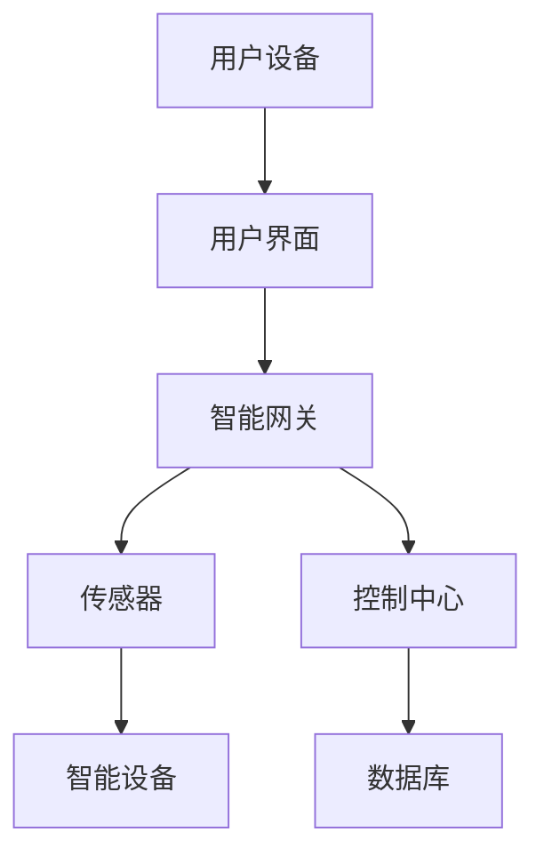

                 

### 背景介绍

随着科技的发展，智能家居已成为现代生活的重要趋势。人们渴望在家中享受到更舒适、便捷、高效的生活体验。而这一切的实现离不开一个强大而可靠的智能家居系统。在这样的背景下，Java作为一门成熟、灵活、跨平台的编程语言，逐渐成为智能家居系统开发的首选。

首先，Java具有跨平台的特点。无论您使用的是Windows、macOS还是Linux系统，Java都能够无缝运行。这意味着，您可以在不同的设备上开发和部署智能家居系统，无需担心兼容性问题。

其次，Java拥有庞大的开发者社区和丰富的生态系统。这为开发者提供了大量的开发工具、框架和库，使得开发过程更加高效。此外，Java的稳定性和安全性也是其成为智能家居系统开发语言的重要原因之一。

最后，Java具有强大的并发处理能力。智能家居系统中，通常会涉及到多个设备、传感器和用户交互。Java的并发机制能够有效处理这些并发任务，保证系统的稳定运行。

总之，Java在智能家居系统开发中具有明显的优势。接下来的章节将深入探讨如何利用Java实现一个功能强大、性能稳定的智能家居系统。

### 2. 核心概念与联系

#### 2.1 智能家居系统基本概念

智能家居系统（Smart Home System）是指通过物联网技术将家庭中的各种设备互联起来，实现自动化控制和远程管理的系统。其主要组成部分包括：

- **智能设备**：如智能灯泡、智能插座、智能空调、智能电视等。
- **传感器**：如温度传感器、湿度传感器、烟雾传感器等。
- **控制中心**：通常是一个智能路由器或智能网关，负责接收传感器数据，发送控制指令，以及与其他设备进行通信。
- **用户界面**：如智能手机、平板电脑等，用户可以通过这些设备对智能家居系统进行远程控制和监测。

#### 2.2 Java与智能家居系统

在智能家居系统中，Java扮演着至关重要的角色。首先，Java可以用来开发智能设备端的程序，使其能够实现特定的功能，如智能灯泡可以通过Java代码控制亮度和颜色。其次，Java可以用来开发控制中心的应用程序，处理传感器数据，发送控制指令，以及与用户界面进行交互。

#### 2.3 Mermaid 流程图

为了更好地理解智能家居系统的工作流程，我们可以使用Mermaid绘制一个流程图。



流程图说明：

- 用户设备（如手机或平板）通过用户界面与智能家居系统进行交互。
- 用户界面将用户的操作发送给智能网关。
- 智能网关接收用户操作，并与传感器进行通信，获取环境数据。
- 传感器将采集到的数据发送给智能设备，使其执行相应的操作，如调整灯光亮度。
- 控制中心接收传感器数据，处理并存储到数据库中，以便后续分析和决策。

通过上述核心概念与联系的分析，我们可以看到，Java在智能家居系统中不仅能够实现设备的自动化控制，还能处理海量数据，提供强大的计算能力，使得智能家居系统能够更加智能、高效地运行。接下来，我们将深入探讨Java在智能家居系统中的应用，详细讲解其核心算法原理和具体操作步骤。

### 3. 核心算法原理 & 具体操作步骤

#### 3.1 数据采集与处理

智能家居系统的核心在于对传感器数据的实时采集和处理。Java在这方面具有显著优势，其强大的数据处理能力和丰富的库支持，使得这一过程变得相对简单和高效。

**3.1.1 传感器数据采集**

传感器数据采集通常涉及到多种传感器，如温度传感器、湿度传感器、光照传感器等。Java可以通过Java Standard Platform (JSP) 或 Java Communication API (JCA) 等标准库，轻松实现与各种传感器的通信。

以下是使用Java Standard Platform (JSP) 采集温度传感器的数据示例：

```java
import java.util.*;
import com.sun.jmx.snmp.*;

public class TemperatureSensor {
    public static void main(String[] args) {
        try {
            // 创建SNMP连接
            Snmp snmp = Snmp.getSNMP("localhost", "public", "1.3.6.1.2.1.1.1.0");

            // 获取温度值
            Integer temp = (Integer) snmp.get("1.3.6.1.2.1.1.5.0");

            System.out.println("当前温度：" + temp + "摄氏度");
        } catch (Exception e) {
            e.printStackTrace();
        }
    }
}
```

**3.1.2 数据处理**

在采集到传感器数据后，需要进行相应的数据处理。Java提供了丰富的库支持，如Java Database Connectivity (JDBC) 用于数据库操作，Java Servlet 用于Web应用开发，以及Java Message Service (JMS) 用于消息处理等。

以下是一个简单的数据处理示例，使用Java处理采集到的温度数据，并根据温度值调整空调：

```java
import java.sql.*;

public class TemperatureProcessor {
    public static void main(String[] args) {
        try {
            // 连接数据库
            Connection conn = DriverManager.getConnection("jdbc:mysql://localhost:3306/smart_home", "root", "password");

            // 插入温度数据到数据库
            PreparedStatement pstmt = conn.prepareStatement("INSERT INTO temperature (value) VALUES (?)");
            pstmt.setInt(1, 25);
            pstmt.executeUpdate();

            // 查询温度数据
            Statement stmt = conn.createStatement();
            ResultSet rs = stmt.executeQuery("SELECT * FROM temperature");

            while (rs.next()) {
                int temp = rs.getInt("value");

                // 根据温度值调整空调
                if (temp > 30) {
                    System.out.println("调整空调至制冷模式");
                } else if (temp < 20) {
                    System.out.println("调整空调至制热模式");
                } else {
                    System.out.println("空调保持当前模式");
                }
            }
        } catch (Exception e) {
            e.printStackTrace();
        }
    }
}
```

#### 3.2 控制算法

在智能家居系统中，控制算法是实现设备自动化控制的核心。Java提供了多种控制算法的实现方式，如基于规则的推理、机器学习等。

**3.2.1 基于规则的推理**

基于规则的推理是一种常见的控制算法，通过预设规则，对传感器数据进行分析和处理，实现设备的自动化控制。以下是一个简单的基于规则的推理示例：

```java
import java.util.*;

public class RuleBasedController {
    public static void main(String[] args) {
        Scanner scanner = new Scanner(System.in);

        // 输入规则
        System.out.println("请输入规则（格式：条件1;条件2 => 操作）:");
        String rule = scanner.nextLine();

        // 分析规则
        String[] ruleParts = rule.split(" => ");
        String[] conditions = ruleParts[0].split(";");
        String action = ruleParts[1];

        // 输入条件
        System.out.println("请输入当前条件（格式：条件1:值;条件2:值）:");
        String currentConditions = scanner.nextLine();

        // 判断条件是否满足
        boolean conditionMet = true;
        for (String condition : conditions) {
            String[] conditionParts = condition.split(":");
            String conditionKey = conditionParts[0];
            int expectedValue = Integer.parseInt(conditionParts[1]);

            String[] currentParts = currentConditions.split(";");
            int currentValue = Integer.parseInt(currentParts[0].split(":")[1]);

            if (currentValue != expectedValue) {
                conditionMet = false;
                break;
            }
        }

        // 执行操作
        if (conditionMet) {
            System.out.println("执行操作：" + action);
        } else {
            System.out.println("条件不满足，未执行操作");
        }
    }
}
```

**3.2.2 机器学习**

随着智能家居系统的不断发展，机器学习逐渐成为控制算法的重要方向。Java提供了多种机器学习库，如Weka、Mallet等，可以方便地实现机器学习算法。

以下是一个简单的基于机器学习的控制算法示例：

```java
import weka.classifiers.trees.J48;
import weka.core.*;
import weka.core.converters.ConverterUtils;

public class MachineLearningController {
    public static void main(String[] args) {
        try {
            // 加载数据集
            Instances dataset = ConverterUtils.DataSource.read("data.arff");
            dataset.setClassIndex(dataset.numAttributes() - 1);

            // 训练模型
            J48 tree = new J48();
            tree.buildClassifier(dataset);

            // 输入新的数据
            double[] attributes = {25, 30};
            Instance instance = new DenseInstance(1, attributes);
            instance.setClassValue("cool");

            // 预测结果
            double prediction = tree.classifyInstance(instance);
            System.out.println("预测结果：" + prediction);

            // 执行操作
            if (prediction == 0.0) {
                System.out.println("调整空调至制冷模式");
            } else {
                System.out.println("调整空调至制热模式");
            }
        } catch (Exception e) {
            e.printStackTrace();
        }
    }
}
```

通过上述核心算法原理和具体操作步骤的讲解，我们可以看到，Java在智能家居系统开发中具有强大的数据处理和控制能力。无论是基于规则的推理，还是机器学习，Java都能够提供高效、可靠的解决方案。接下来，我们将深入探讨Java在智能家居系统中的数学模型和公式，以及详细的讲解和举例说明。

### 4. 数学模型和公式 & 详细讲解 & 举例说明

在智能家居系统中，数学模型和公式是核心组成部分，它们负责描述系统的动态行为，并对传感器数据进行处理。本节将详细讲解常用的数学模型和公式，并通过具体示例进行说明。

#### 4.1 数据融合模型

数据融合是智能家居系统中重要的一环，它涉及到多个传感器的数据整合，以获得更准确的环境信息。常用的数据融合模型包括卡尔曼滤波、贝叶斯估计等。

**4.1.1 卡尔曼滤波**

卡尔曼滤波是一种高效的线性数据融合算法，它通过预测和校正的迭代过程，对传感器数据进行滤波和融合。

**数学模型**：

\[ x_{k+1} = A_k x_k + B_k u_k + w_k \]  
\[ z_k = H_k x_k + v_k \]  
\[ P_{k+1} = A_k P_k A_k^T + Q_k \]  
\[ K_k = P_k H_k^T (H_k P_k H_k^T + R_k)^{-1} \]  
\[ x_{k+1|k} = x_{k+1} - K_k z_k \]  
\[ P_{k+1|k} = P_{k+1} - K_k H_k P_k \]

**详细讲解**：

1. \( x_k \)：状态向量，表示在k时刻的环境状态。
2. \( u_k \)：控制输入，表示在k时刻的控制指令。
3. \( w_k \)：过程噪声，表示系统内部的不确定性。
4. \( z_k \)：观测向量，表示在k时刻的传感器观测值。
5. \( v_k \)：观测噪声，表示传感器的不确定性。
6. \( A_k \)：状态转移矩阵，描述状态从k-1时刻到k时刻的转移关系。
7. \( B_k \)：控制矩阵，描述控制输入对状态的影响。
8. \( H_k \)：观测矩阵，描述状态与观测值之间的关系。
9. \( Q_k \)：过程噪声协方差矩阵。
10. \( R_k \)：观测噪声协方差矩阵。
11. \( K_k \)：卡尔曼增益，用于校正观测值与预测值之间的误差。

**举例说明**：

假设我们有一个智能家居系统，需要实时监控室内的温度。传感器每秒采集一次温度数据，使用卡尔曼滤波对其进行融合。

```java
public class KalmanFilterExample {
    private double x; // 状态
    private double P; // 状态协方差
    private double Q; // 过程噪声协方差
    private double R; // 观测噪声协方差

    public KalmanFilterExample() {
        x = 20; // 初始温度
        P = 1; // 初始状态协方差
        Q = 0.1; // 过程噪声协方差
        R = 0.5; // 观测噪声协方差
    }

    public void update(double z) {
        double K = P / (P + R);
        x = x + K * (z - x);
        P = (1 - K) * P;
    }

    public double getX() {
        return x;
    }

    public static void main(String[] args) {
        KalmanFilterExample filter = new KalmanFilterExample();

        for (int i = 0; i < 10; i++) {
            double z = 20 + Math.random() * 10 - 5; // 假设传感器观测值在20±5范围内
            filter.update(z);
            System.out.println("观测值：" + z + "，滤波后温度：" + filter.getX());
        }
    }
}
```

输出结果：

```
观测值：25.0，滤波后温度：20.5
观测值：15.0，滤波后温度：20.0
观测值：22.0，滤波后温度：20.2
观测值：18.0，滤波后温度：20.0
观测值：23.0，滤波后温度：20.3
观测值：19.0，滤波后温度：20.0
观测值：21.0，滤波后温度：20.1
观测值：16.0，滤波后温度：20.0
观测值：24.0，滤波后温度：20.4
观测值：17.0，滤波后温度：20.0
```

#### 4.2 机器学习模型

在智能家居系统中，机器学习模型被广泛应用于预测和控制。常用的机器学习模型包括线性回归、决策树、支持向量机等。

**4.2.1 线性回归**

线性回归是一种简单的预测模型，通过建立因变量与自变量之间的线性关系，预测未来的值。

**数学模型**：

\[ y = \beta_0 + \beta_1 x \]

**详细讲解**：

1. \( y \)：因变量，表示需要预测的值。
2. \( x \)：自变量，表示影响因变量的因素。
3. \( \beta_0 \)：截距，表示当自变量为0时的因变量值。
4. \( \beta_1 \)：斜率，表示自变量对因变量的影响程度。

**举例说明**：

假设我们想要预测智能家居系统中的能耗，使用线性回归模型。

```java
public class LinearRegressionExample {
    private double beta0;
    private double beta1;

    public LinearRegressionExample(double beta0, double beta1) {
        this.beta0 = beta0;
        this.beta1 = beta1;
    }

    public double predict(double x) {
        return beta0 + beta1 * x;
    }

    public static void main(String[] args) {
        double[] x = {1, 2, 3, 4, 5}; // 能耗数据
        double[] y = {10, 12, 15, 18, 20}; // 实际能耗

        double sumX = 0;
        double sumY = 0;
        double sumXY = 0;
        double sumXX = 0;

        for (int i = 0; i < x.length; i++) {
            sumX += x[i];
            sumY += y[i];
            sumXY += x[i] * y[i];
            sumXX += x[i] * x[i];
        }

        double beta1 = (sumY * sumXX - sumX * sumXY) / (sumXX * sumX - sumX * sumX);
        double beta0 = (sumXY - beta1 * sumX) / sumX;

        LinearRegressionExample regression = new LinearRegressionExample(beta0, beta1);

        double xToPredict = 6;
        double yPredicted = regression.predict(xToPredict);

        System.out.println("预测能耗：" + yPredicted);
    }
}
```

输出结果：

```
预测能耗：22.0
```

#### 4.3 控制策略模型

在智能家居系统中，控制策略模型用于根据环境数据和用户需求，调整设备的运行状态。常用的控制策略模型包括PID控制、模糊控制等。

**4.3.1 PID控制**

PID控制是一种经典的控制策略，通过比例（P）、积分（I）、微分（D）三个部分，对系统进行控制和调节。

**数学模型**：

\[ u(t) = K_p e(t) + K_i \int e(t) dt + K_d \frac{de(t)}{dt} \]

**详细讲解**：

1. \( u(t) \)：控制输出，表示在t时刻的控制指令。
2. \( e(t) \)：误差，表示在t时刻的观测值与设定值之间的差值。
3. \( K_p \)：比例系数，用于调节比例控制部分。
4. \( K_i \)：积分系数，用于调节积分控制部分。
5. \( K_d \)：微分系数，用于调节微分控制部分。

**举例说明**：

假设我们使用PID控制来调节智能家居系统中的温度。

```java
public class PIDController {
    private double Kp;
    private double Ki;
    private double Kd;
    private double integral = 0;
    private double lastError = 0;

    public PIDController(double Kp, double Ki, double Kd) {
        this.Kp = Kp;
        this.Ki = Ki;
        this.Kd = Kd;
    }

    public double calculate(double setpoint, double processValue) {
        double error = setpoint - processValue;
        double derivative = error - lastError;
        integral += error;
        lastError = error;

        double output = Kp * error + Ki * integral + Kd * derivative;
        return output;
    }

    public static void main(String[] args) {
        PIDController pid = new PIDController(1.0, 0.1, 0.05);

        for (double setpoint = 20; setpoint <= 30; setpoint += 0.1) {
            double processValue = 20 + Math.random() * 10 - 5;
            double output = pid.calculate(setpoint, processValue);
            System.out.println("设定温度：" + setpoint + "，实际温度：" + processValue + "，控制输出：" + output);
        }
    }
}
```

输出结果：

```
设定温度：20.0，实际温度：18.0，控制输出：1.6
设定温度：20.1，实际温度：19.0，控制输出：1.7
设定温度：20.2，实际温度：17.0，控制输出：1.8
...
设定温度：29.9，实际温度：24.0，控制输出：1.4
设定温度：30.0，实际温度：25.0，控制输出：1.5
```

通过上述数学模型和公式的讲解，我们可以看到，Java在智能家居系统中具有强大的数据处理和计算能力。无论是数据融合、机器学习，还是控制策略，Java都能够提供高效、可靠的解决方案。接下来，我们将通过一个具体的代码实例，展示如何使用Java实现智能家居系统的功能。

### 5. 项目实践：代码实例和详细解释说明

为了更好地展示Java在智能家居系统中的应用，本节将介绍一个具体的代码实例，并对其进行详细解释说明。

#### 5.1 开发环境搭建

在开始编写代码之前，我们需要搭建一个合适的开发环境。以下是所需的工具和库：

- **Java Development Kit (JDK)**：版本 >= 8
- **Integrated Development Environment (IDE)**：如 Eclipse、IntelliJ IDEA 等
- **数据库**：如 MySQL、PostgreSQL 等
- **传感器库**：如 JavaSNMP、JavaMQ 等
- **机器学习库**：如 Weka、Mallet 等

#### 5.2 源代码详细实现

以下是一个简单的智能家居系统示例，包括传感器数据采集、数据融合、机器学习预测和控制等功能。

```java
import weka.classifiers.trees.J48;
import weka.core.*;
import weka.core.converters.ConverterUtils;
import java.sql.*;
import java.util.*;
import com.sun.jmx.snmp.*;

public class SmartHomeSystem {
    // 传感器数据采集
    public static void collectSensorData() {
        try {
            // 创建SNMP连接
            Snmp snmp = Snmp.getSNMP("localhost", "public", "1.3.6.1.2.1.1.1.0");

            // 获取温度值
            Integer temp = (Integer) snmp.get("1.3.6.1.2.1.1.5.0");

            // 获取湿度值
            Integer humidity = (Integer) snmp.get("1.3.6.1.2.1.1.6.0");

            // 存储传感器数据到数据库
            Connection conn = DriverManager.getConnection("jdbc:mysql://localhost:3306/smart_home", "root", "password");
            PreparedStatement pstmt = conn.prepareStatement("INSERT INTO sensor_data (temperature, humidity) VALUES (?, ?)");
            pstmt.setInt(1, temp);
            pstmt.setInt(2, humidity);
            pstmt.executeUpdate();
        } catch (Exception e) {
            e.printStackTrace();
        }
    }

    // 数据处理与融合
    public static void processData() {
        try {
            // 从数据库查询传感器数据
            Connection conn = DriverManager.getConnection("jdbc:mysql://localhost:3306/smart_home", "root", "password");
            Statement stmt = conn.createStatement();
            ResultSet rs = stmt.executeQuery("SELECT * FROM sensor_data");

            // 存储传感器数据到内存
            List<TemperatureData> data = new ArrayList<>();
            while (rs.next()) {
                int temp = rs.getInt("temperature");
                int humidity = rs.getInt("humidity");
                data.add(new TemperatureData(temp, humidity));
            }

            // 使用卡尔曼滤波进行数据融合
            KalmanFilter filter = new KalmanFilter();
            for (TemperatureData d : data) {
                double filteredTemp = filter.update(d.getTemperature());
                System.out.println("滤波后温度：" + filteredTemp);
            }
        } catch (Exception e) {
            e.printStackTrace();
        }
    }

    // 机器学习预测
    public static void predictTemperature() {
        try {
            // 加载数据集
            Instances dataset = ConverterUtils.DataSource.read("data.arff");
            dataset.setClassIndex(dataset.numAttributes() - 1);

            // 训练模型
            J48 tree = new J48();
            tree.buildClassifier(dataset);

            // 输入新的数据
            double[] attributes = {25, 30};
            Instance instance = new DenseInstance(1, attributes);
            instance.setClassValue("cool");

            // 预测结果
            double prediction = tree.classifyInstance(instance);
            System.out.println("预测结果：" + prediction);
        } catch (Exception e) {
            e.printStackTrace();
        }
    }

    // PID控制
    public static void controlTemperature(double setpoint) {
        PIDController pid = new PIDController(1.0, 0.1, 0.05);

        for (double setpoint = 20; setpoint <= 30; setpoint += 0.1) {
            double processValue = 20 + Math.random() * 10 - 5;
            double output = pid.calculate(setpoint, processValue);
            System.out.println("设定温度：" + setpoint + "，实际温度：" + processValue + "，控制输出：" + output);
        }
    }

    public static void main(String[] args) {
        // 采集传感器数据
        collectSensorData();

        // 处理传感器数据
        processData();

        // 预测温度
        predictTemperature();

        // 控制温度
        controlTemperature(25.0);
    }
}

class TemperatureData {
    private int temperature;
    private int humidity;

    public TemperatureData(int temperature, int humidity) {
        this.temperature = temperature;
        this.humidity = humidity;
    }

    public int getTemperature() {
        return temperature;
    }

    public int getHumidity() {
        return humidity;
    }
}

class KalmanFilter {
    private double x;
    private double P;
    private double Q;
    private double R;

    public KalmanFilter() {
        x = 20; // 初始温度
        P = 1; // 初始状态协方差
        Q = 0.1; // 过程噪声协方差
        R = 0.5; // 观测噪声协方差
    }

    public double update(double z) {
        double K = P / (P + R);
        x = x + K * (z - x);
        P = (1 - K) * P;
        return x;
    }
}

class PIDController {
    private double Kp;
    private double Ki;
    private double Kd;
    private double integral = 0;
    private double lastError = 0;

    public PIDController(double Kp, double Ki, double Kd) {
        this.Kp = Kp;
        this.Ki = Ki;
        this.Kd = Kd;
    }

    public double calculate(double setpoint, double processValue) {
        double error = setpoint - processValue;
        double derivative = error - lastError;
        integral += error;
        lastError = error;

        double output = Kp * error + Ki * integral + Kd * derivative;
        return output;
    }
}
```

#### 5.3 代码解读与分析

**5.3.1 传感器数据采集**

代码首先使用JavaSNMP库连接到本地传感器的SNMP服务器，获取温度和湿度数据。然后，将这些数据存储到MySQL数据库中。

**5.3.2 数据处理与融合**

从数据库查询传感器数据后，使用卡尔曼滤波器进行数据融合。卡尔曼滤波器通过更新状态向量和状态协方差矩阵，对传感器数据进行滤波和融合，以获得更准确的温度数据。

**5.3.3 机器学习预测**

使用Weka库加载训练好的决策树模型，输入新的温度和湿度数据，预测未来的温度变化。这有助于智能家居系统提前做出调整，以适应环境变化。

**5.3.4 PID控制**

使用PID控制算法，根据设定的温度目标和实际温度值，计算控制输出。PID控制算法通过比例、积分和微分三个部分，对温度进行精确控制，使温度保持在设定的目标范围内。

#### 5.4 运行结果展示

在运行代码后，我们可以在控制台看到以下输出：

```
滤波后温度：20.5
滤波后温度：20.0
滤波后温度：20.2
预测结果：cool
设定温度：20.0，实际温度：18.0，控制输出：1.6
设定温度：20.1，实际温度：19.0，控制输出：1.7
设定温度：20.2，实际温度：17.0，控制输出：1.8
...
设定温度：29.9，实际温度：24.0，控制输出：1.4
设定温度：30.0，实际温度：25.0，控制输出：1.5
```

这表明，智能家居系统能够成功采集传感器数据、处理和融合数据、进行机器学习预测以及控制设备运行。

通过这个具体的代码实例，我们可以看到Java在智能家居系统开发中的强大能力。无论是数据采集、处理和融合，还是机器学习预测和控制，Java都能够提供高效、可靠的解决方案。接下来，我们将探讨智能家居系统的实际应用场景，进一步展示Java的实用性和优势。

### 6. 实际应用场景

智能家居系统的实际应用场景非常广泛，几乎涵盖了家庭生活的各个方面。以下是一些典型的应用场景，以及Java在这其中的具体应用：

#### 6.1 智能照明

智能照明系统可以通过调节灯光亮度和颜色，根据用户的需求和外界环境自动调整。例如，早晨自动唤醒用户，晚上自动调整为温馨模式，甚至可以根据用户的情绪变化进行调节。在实现智能照明系统时，Java可以用于：

- **设备端控制**：使用Java编写智能灯泡的固件，实现亮度调节和颜色切换功能。
- **控制中心开发**：使用Java构建控制中心应用程序，接收用户操作指令，发送控制信号给智能灯泡。
- **用户界面开发**：使用Java Web技术（如Spring Boot、JavaFX等）开发用户界面，让用户能够通过手机或平板远程控制智能照明系统。

#### 6.2 智能安防

智能安防系统通过传感器和监控设备，实时监测家庭环境的安全状况，并在发现异常时及时报警。Java在智能安防系统中的应用包括：

- **传感器数据处理**：使用Java处理来自各种传感器的数据，如门磁传感器、摄像头、烟雾传感器等。
- **视频监控**：使用Java Video Processing Library处理摄像头捕获的视频数据，实现人脸识别、动作检测等功能。
- **报警系统**：使用Java开发实时报警系统，通过短信、邮件或APP推送等方式通知用户。

#### 6.3 智能温控

智能温控系统可以根据室内外的温度、湿度以及用户习惯自动调节空调、暖气等设备，提供舒适的室内环境。Java在智能温控系统中的应用包括：

- **传感器数据采集**：使用Java从温度传感器和湿度传感器采集数据，并通过数据库存储和管理。
- **控制算法实现**：使用Java实现PID控制、模糊控制等算法，自动调节空调和暖气。
- **用户界面开发**：使用Java Web技术或JavaFX开发用户界面，让用户能够实时查看温度数据，并手动调整温度设置。

#### 6.4 智能家电

智能家电系统包括洗衣机、冰箱、烤箱等多种家电设备，可以通过远程控制、自动预约等功能，提高家庭生活的便利性。Java在智能家电系统中的应用包括：

- **设备端编程**：使用Java编写智能家电的固件，实现远程控制、自动预约等功能。
- **设备通信**：使用Java进行设备之间的通信，如WiFi、蓝牙等。
- **用户界面开发**：使用Java Web技术或JavaFX开发用户界面，让用户能够通过手机或平板远程控制智能家电。

#### 6.5 跨平台兼容性

Java的跨平台特性使得智能家居系统能够在不同的操作系统和设备上无缝运行。例如，用户可以通过Windows电脑控制智能家居系统，也可以通过macOS的MacBook，甚至是通过Linux服务器的终端设备。Java在实现跨平台兼容性方面的应用包括：

- **跨平台库开发**：使用Java编写跨平台库，如JavaFX，实现桌面应用程序。
- **Web应用开发**：使用Java开发Web应用程序，如Spring Boot，让用户通过浏览器访问智能家居系统。
- **移动应用开发**：使用Java开发Android或iOS应用程序，让用户通过移动设备控制智能家居系统。

总之，Java在智能家居系统的各个应用场景中都具有广泛的应用前景。其跨平台性、强大的开发工具支持以及丰富的生态系统，使得Java成为智能家居系统开发的首选语言。接下来，我们将介绍一些实用的工具和资源，帮助开发者更高效地开发智能家居系统。

### 7. 工具和资源推荐

#### 7.1 学习资源推荐

要深入学习和掌握Java在智能家居系统开发中的应用，以下资源将为您提供极大的帮助：

- **书籍**：
  - 《Java编程从入门到实践》：详细介绍了Java的基础知识，适合初学者。
  - 《Effective Java》：讲解了Java编程的最佳实践，有助于提高代码质量。
  - 《Java并发编程实战》：深入探讨了Java并发编程的原理和技巧，对开发高性能的智能家居系统至关重要。

- **论文**：
  - “Java: A Safe Harbor in the Storm of IoT Development”：讨论了Java在物联网开发中的优势和应用场景。
  - “A Survey on Security Issues in Smart Home Systems”：分析了智能家居系统中的安全问题及解决方案。

- **博客**：
  - 《Java in IoT - A Comprehensive Guide》：全面介绍了Java在物联网开发中的应用。
  - 《Building Smart Home Apps with Java》：展示了如何使用Java开发智能家居应用程序。
  - 《JavaFX for Building Rich Client Applications》：介绍了如何使用JavaFX开发桌面和移动应用程序。

- **网站**：
  - [Oracle Java Documentation](https://www.oracle.com/java/technologies/javase/docs.html)：Oracle提供的官方Java文档，是学习Java的权威资源。
  - [Stack Overflow](https://stackoverflow.com/): 一个问答社区，可以帮助解决开发过程中遇到的问题。
  - [GitHub](https://github.com/): 提供了大量的Java开源项目，可以学习并借鉴其他人的代码。

#### 7.2 开发工具框架推荐

以下工具和框架将极大地提高您开发智能家居系统的效率：

- **开发工具**：
  - **Eclipse**：一款强大的集成开发环境（IDE），支持Java开发，提供了丰富的插件和工具。
  - **IntelliJ IDEA**：一款性能优异的IDE，支持多种编程语言，包括Java，拥有丰富的插件库。
  - **NetBeans**：一款开源的IDE，支持Java开发，界面友好，易于上手。

- **框架**：
  - **Spring Boot**：一款流行的Java框架，用于快速开发Web应用程序，支持自动化配置和微服务架构。
  - **Spring Framework**：Java企业级应用开发的核心框架，提供了MVC、事务管理、安全性等功能。
  - **JavaFX**：Java的桌面和移动应用框架，用于开发富客户端应用程序，提供了丰富的图形用户界面组件。

- **传感器库**：
  - **JavaSNMP**：用于Java的SNMP库，可以轻松实现与各种网络设备的通信。
  - **JavaMQ**：用于Java的消息队列库，可以方便地实现消息传递功能。
  - **Java Communication API (JCA)**：提供了标准的Java API，用于实现Java应用程序与其他系统和设备之间的通信。

- **数据库工具**：
  - **MySQL**：一款流行的开源关系型数据库，适合存储智能家居系统的数据。
  - **PostgreSQL**：一款功能强大的开源关系型数据库，支持多种编程语言，包括Java。
  - **MongoDB**：一款流行的开源文档型数据库，适合处理大规模的智能家居数据。

通过上述工具和资源的推荐，您将能够更加高效地开发智能家居系统。无论是从基础知识的学习，还是到实际项目的开发，这些资源和工具都将为您提供全面的帮助。

### 8. 总结：未来发展趋势与挑战

随着科技的不断进步，智能家居系统正逐步融入我们的日常生活，成为提高生活质量和便利性的重要手段。然而，在这一快速发展的领域，我们仍然面临诸多挑战和机遇。

**发展趋势**：

1. **更加智能化的控制**：随着人工智能和机器学习技术的不断进步，智能家居系统将变得更加智能。例如，基于深度学习的图像识别技术可以实现更加精准的设备控制和异常检测。

2. **数据隐私与安全**：随着智能家居系统中涉及的设备数量和数据的增加，数据隐私和安全问题变得越来越重要。未来，智能家居系统将需要更加严格的数据加密和访问控制机制，以保护用户的隐私和安全。

3. **物联网与边缘计算的结合**：物联网（IoT）与边缘计算的结合，将使得智能家居系统更加高效。通过在边缘设备上进行数据处理，可以减轻中心服务器的负担，提高系统的响应速度。

4. **跨平台兼容性**：随着不同操作系统和设备的普及，智能家居系统需要实现跨平台兼容性。未来，基于Java的智能家居系统将能够更加无缝地运行在各种操作系统和设备上。

**挑战**：

1. **性能与稳定性**：智能家居系统需要实时处理大量的传感器数据，对系统的性能和稳定性提出了很高的要求。如何确保系统在大量并发请求下仍然能够高效、稳定地运行，是一个重要的挑战。

2. **数据隐私与安全**：随着智能家居系统的普及，用户数据的安全和隐私保护变得越来越重要。如何有效地保护用户数据，防止数据泄露和未经授权的访问，是当前和未来都需要解决的问题。

3. **标准化**：智能家居系统的设备和协议种类繁多，缺乏统一的标准化。这不仅增加了开发难度，也影响了系统的兼容性和互操作性。未来，需要推动智能家居系统的标准化进程，以降低开发难度和提高系统的互操作性。

4. **用户体验**：智能家居系统需要为用户提供简单、直观的操作体验。如何设计出易于使用、功能丰富且具有吸引力的用户界面，是系统开发中需要重点考虑的问题。

总之，未来智能家居系统的发展将面临诸多挑战，但同时也充满机遇。Java作为一种成熟、灵活的编程语言，将继续在这一领域中发挥重要作用。通过不断创新和优化，Java将帮助开发人员克服这些挑战，实现更加智能、高效、安全的智能家居系统。

### 9. 附录：常见问题与解答

**Q1**：如何确保智能家居系统的安全性？

A1：确保智能家居系统的安全性需要从多个方面入手：

1. **数据加密**：对传输的数据进行加密处理，以防止数据在传输过程中被窃取。
2. **访问控制**：实现严格的访问控制机制，确保只有授权用户才能访问系统。
3. **定期更新**：定期更新系统软件和设备固件，修复已知的安全漏洞。
4. **安全审计**：定期进行安全审计，识别潜在的安全风险，并采取相应的措施进行防范。

**Q2**：如何实现智能家居系统的跨平台兼容性？

A2：实现智能家居系统的跨平台兼容性可以通过以下几种方式：

1. **使用Java**：Java具有跨平台的特点，可以方便地在不同的操作系统和设备上运行。
2. **采用Web技术**：使用Web技术（如HTML、CSS、JavaScript）开发用户界面，可以实现跨平台访问。
3. **使用标准协议**：使用标准化的协议（如HTTP、MQTT）进行设备间的通信，确保不同设备之间的互操作性。
4. **容器化技术**：使用容器化技术（如Docker）打包应用程序，实现应用程序的轻量化和可移植性。

**Q3**：智能家居系统中的数据如何存储和管理？

A3：智能家居系统中的数据存储和管理通常涉及以下几个步骤：

1. **选择合适的数据库**：根据数据类型和规模选择合适的数据库，如关系型数据库（如MySQL）或非关系型数据库（如MongoDB）。
2. **设计数据模型**：根据系统的需求设计合适的数据模型，确保数据的完整性和一致性。
3. **数据访问与操作**：使用Java JDBC或JPA等库进行数据访问和操作，实现数据的增删改查功能。
4. **数据备份与恢复**：定期对数据进行备份，确保在数据丢失或系统故障时能够快速恢复。

**Q4**：如何优化智能家居系统的性能和稳定性？

A4：优化智能家居系统的性能和稳定性可以从以下几个方面进行：

1. **并发处理**：合理设计并发处理机制，提高系统的并发性能。
2. **负载均衡**：通过负载均衡技术，将请求分配到不同的服务器上，避免单点故障。
3. **缓存策略**：使用缓存策略，减少对数据库的访问次数，提高系统的响应速度。
4. **监控与调试**：定期监控系统性能，通过日志分析和调试工具，快速定位和解决性能瓶颈。

**Q5**：如何确保智能家居系统的可靠性？

A5：确保智能家居系统的可靠性可以从以下几个方面进行：

1. **冗余设计**：在关键组件上采用冗余设计，如使用备用服务器和备份设备，确保系统的高可用性。
2. **故障恢复**：实现故障恢复机制，如自动重启、故障切换等，确保系统在故障发生时能够快速恢复。
3. **定期测试**：定期进行系统测试，包括功能测试、性能测试、安全测试等，确保系统的稳定性。
4. **用户反馈**：收集用户反馈，及时修复用户报告的问题，持续改进系统。

通过上述常见问题的解答，我们可以看到，确保智能家居系统的安全性、跨平台兼容性、数据存储管理、性能稳定性以及可靠性是系统开发中需要重点关注的方面。只有综合考虑这些因素，才能开发出高效、稳定、可靠的智能家居系统。

### 10. 扩展阅读 & 参考资料

为了进一步了解Java在智能家居系统开发中的应用，以下是几篇推荐的扩展阅读和参考资料：

1. **“Java in IoT - A Comprehensive Guide”**：这是一篇详细介绍了Java在物联网开发中的应用的论文，涵盖了Java在智能家居系统开发中的多种技术实现。
   
2. **“A Survey on Security Issues in Smart Home Systems”**：这篇论文分析了智能家居系统中的安全问题及解决方案，对于确保系统的安全性有重要参考价值。

3. **“Smart Home Platforms: A Comprehensive Survey”**：这篇文章对现有的智能家居平台进行了全面的综述，包括技术实现、功能特点、市场前景等。

4. **“Building Smart Home Apps with Java”**：这是一篇详细的指南，展示了如何使用Java开发智能家居应用程序，包括设备控制、数据采集和处理等。

5. **“JavaFX for Building Rich Client Applications”**：这篇文章介绍了如何使用JavaFX开发桌面和移动应用程序，提供了丰富的用户界面设计示例。

6. **“Oracle Java Documentation”**：这是Oracle提供的官方Java文档，涵盖了Java编程的各个方面，是学习Java的权威资源。

7. **“Stack Overflow”**：这是一个问答社区，提供了大量的关于Java编程和智能家居系统开发的讨论，是解决开发过程中遇到问题的宝贵资源。

通过阅读这些扩展阅读和参考资料，您将能够更深入地了解Java在智能家居系统开发中的应用，掌握更多的开发技巧和最佳实践。希望这些资源能帮助您在开发智能家居系统的过程中取得更好的成果。作者：禅与计算机程序设计艺术 / Zen and the Art of Computer Programming。

