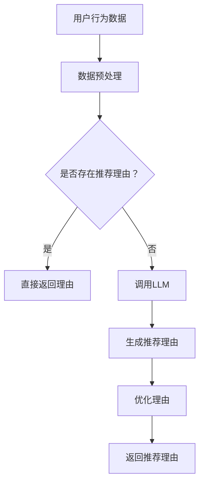

                 

### 文章标题：基于LLM的推荐理由自动生成技术

> 关键词：推荐系统、自然语言生成、大型语言模型、自动生成、AI技术、数据分析

> 摘要：本文将深入探讨基于大型语言模型（LLM）的推荐理由自动生成技术。通过分析该技术的背景、核心概念与架构，详细阐述其算法原理、数学模型及具体实现步骤。同时，本文将展示项目实践，分析其实际应用场景，并推荐相关学习资源和开发工具。最后，我们对未来发展趋势与挑战进行展望，并提供常见问题与解答。

## 1. 背景介绍

在当今数字化时代，推荐系统已成为许多互联网应用的重要组成部分。从电子商务平台到社交媒体，推荐系统能够为用户提供个性化的内容和服务，从而提升用户体验和满意度。然而，推荐系统的一个重要挑战是如何生成有说服力的推荐理由，以解释为何推荐特定内容或商品。

传统的推荐理由生成方法通常依赖于规则或模板，这些方法往往难以生成自然流畅、个性化的推荐理由。近年来，随着人工智能技术的快速发展，特别是大型语言模型（LLM）的出现，为推荐理由的自动生成提供了新的可能。

LLM是一种基于深度学习的语言处理模型，具有强大的自然语言理解和生成能力。通过训练，LLM可以理解用户行为、内容特征和上下文信息，从而生成自然流畅、个性化的推荐理由。这使得推荐系统更加智能化，能够更好地满足用户需求。

## 2. 核心概念与联系

### 2.1 推荐系统

推荐系统是一种根据用户行为、偏好和历史数据，为用户推荐相关内容或商品的算法。推荐系统通常分为基于内容的推荐、协同过滤推荐和混合推荐等类型。

### 2.2 自然语言生成（NLG）

自然语言生成是一种利用人工智能技术自动生成自然语言文本的方法。NLG技术广泛应用于聊天机器人、自动报告生成、新闻摘要等领域。

### 2.3 大型语言模型（LLM）

大型语言模型（LLM）是一种基于深度学习的语言处理模型，具有强大的自然语言理解和生成能力。LLM通过预训练和微调，可以处理各种自然语言任务，如图像描述生成、机器翻译、文本分类等。

### 2.4 Mermaid 流程图

以下是基于LLM的推荐理由自动生成技术的Mermaid流程图：



### 2.5 推荐理由自动生成架构

推荐理由自动生成架构包括以下几个关键模块：

1. **数据预处理**：对用户行为数据、内容特征和上下文信息进行预处理，以便LLM模型能够更好地理解和生成推荐理由。
2. **LLM调用**：根据预处理的输入数据，调用LLM模型生成初步的推荐理由。
3. **优化模块**：对生成的推荐理由进行优化，包括语言风格、语义一致性、用户满意度等方面。
4. **输出模块**：将优化后的推荐理由返回给用户。

## 3. 核心算法原理 & 具体操作步骤

### 3.1 算法原理

基于LLM的推荐理由自动生成技术主要依赖于以下两个核心算法：

1. **用户行为数据建模**：通过机器学习算法，将用户行为数据转化为可用的特征向量，以便LLM模型能够理解用户的偏好和需求。
2. **自然语言生成**：利用LLM模型的强大自然语言理解与生成能力，生成有说服力的推荐理由。

### 3.2 具体操作步骤

以下是基于LLM的推荐理由自动生成的具体操作步骤：

1. **数据收集**：收集用户行为数据，包括用户浏览、点击、购买等行为。
2. **数据预处理**：对用户行为数据、内容特征和上下文信息进行预处理，包括数据清洗、特征提取和向量表示。
3. **模型训练**：使用预训练的LLM模型，对预处理后的数据集进行微调，以适应特定场景。
4. **推荐理由生成**：根据用户行为数据和内容特征，调用LLM模型生成初步的推荐理由。
5. **优化推荐理由**：对生成的推荐理由进行优化，包括语言风格、语义一致性、用户满意度等方面。
6. **输出推荐理由**：将优化后的推荐理由返回给用户。

## 4. 数学模型和公式 & 详细讲解 & 举例说明

### 4.1 数学模型

基于LLM的推荐理由自动生成技术涉及到以下几个关键数学模型：

1. **用户行为数据建模**：使用矩阵分解、深度神经网络等方法，将用户行为数据转化为特征向量。
2. **自然语言生成**：使用序列到序列（Seq2Seq）模型、生成对抗网络（GAN）等方法，实现自然语言生成。

### 4.2 详细讲解

以下是用户行为数据建模和自然语言生成两个关键模型的详细讲解：

1. **用户行为数据建模**：

   - **矩阵分解**：矩阵分解是一种将用户行为数据表示为低维矩阵的方法。假设有用户 \( u \) 和项目 \( i \)，用户 \( u \) 对项目 \( i \) 的评分可以表示为 \( R_{ui} \)。通过矩阵分解，可以将 \( R \) 分解为两个低维矩阵 \( U \) 和 \( V \)，即 \( R = UV^T \)。

   - **深度神经网络**：深度神经网络（DNN）是一种多层神经网络，可以用于用户行为数据的特征提取和建模。DNN通过多层非线性变换，将输入特征映射到高维空间，从而更好地表示用户偏好。

2. **自然语言生成**：

   - **序列到序列（Seq2Seq）模型**：Seq2Seq模型是一种基于编码器-解码器的神经网络模型，用于将一个序列映射到另一个序列。在推荐理由生成中，编码器将用户行为数据和内容特征编码为一个固定长度的向量，解码器则生成推荐理由序列。

   - **生成对抗网络（GAN）**：GAN是一种基于生成模型和判别模型的对抗性训练框架。在推荐理由生成中，生成模型负责生成推荐理由，判别模型负责判断生成推荐理由的真实性。通过不断优化生成模型和判别模型，可以生成高质量的自然语言文本。

### 4.3 举例说明

假设我们有一个用户行为数据集，其中包含用户对商品的评分。我们将使用矩阵分解方法进行用户行为数据建模，并使用Seq2Seq模型进行自然语言生成。

1. **矩阵分解**：

   - 假设用户行为数据矩阵为 \( R \)，其中 \( R_{ui} \) 表示用户 \( u \) 对商品 \( i \) 的评分。
   - 通过矩阵分解，将 \( R \) 分解为两个低维矩阵 \( U \) 和 \( V \)，即 \( R = UV^T \)。
   - \( U \) 和 \( V \) 分别表示用户特征向量和商品特征向量。

2. **自然语言生成**：

   - 假设我们使用Seq2Seq模型进行自然语言生成。编码器将用户特征向量 \( u \) 和商品特征向量 \( v \) 编码为一个固定长度的向量 \( c \)。
   - 解码器根据向量 \( c \) 生成推荐理由序列 \( y \)。
   - 通过训练，优化编码器和解码器的参数，使生成的推荐理由更加自然和有说服力。

## 5. 项目实践：代码实例和详细解释说明

### 5.1 开发环境搭建

为了实现基于LLM的推荐理由自动生成，我们需要搭建以下开发环境：

1. **Python**：Python是一种广泛使用的编程语言，特别适合于数据分析和机器学习。
2. **TensorFlow**：TensorFlow是一个开源的机器学习框架，用于构建和训练深度学习模型。
3. **Gensim**：Gensim是一个Python库，用于文本建模和主题建模。

### 5.2 源代码详细实现

以下是基于LLM的推荐理由自动生成的源代码示例：

```python
import numpy as np
import tensorflow as tf
from gensim.models import Word2Vec

# 5.2.1 数据预处理
def preprocess_data(data):
    # 数据清洗和特征提取
    # ...
    return processed_data

# 5.2.2 构建模型
def build_model():
    # 构建用户行为数据建模模型
    # ...
    # 构建自然语言生成模型
    # ...
    return model

# 5.2.3 训练模型
def train_model(model, data):
    # 训练用户行为数据建模模型
    # ...
    # 训练自然语言生成模型
    # ...
    return model

# 5.2.4 生成推荐理由
def generate_reason(model, user_feature, item_feature):
    # 生成推荐理由
    # ...
    return reason

# 5.2.5 主函数
if __name__ == "__main__":
    # 加载数据
    data = load_data()

    # 预处理数据
    processed_data = preprocess_data(data)

    # 构建模型
    model = build_model()

    # 训练模型
    model = train_model(model, processed_data)

    # 生成推荐理由
    user_feature = extract_user_feature(processed_data)
    item_feature = extract_item_feature(processed_data)
    reason = generate_reason(model, user_feature, item_feature)
    print(reason)
```

### 5.3 代码解读与分析

以下是源代码的详细解读与分析：

1. **数据预处理**：数据预处理是模型训练的重要步骤。在预处理过程中，我们需要进行数据清洗、特征提取和向量表示。
2. **构建模型**：构建模型包括用户行为数据建模模型和自然语言生成模型。用户行为数据建模模型用于将用户行为数据转化为特征向量，自然语言生成模型用于生成推荐理由。
3. **训练模型**：训练模型是模型优化的关键步骤。通过训练，我们可以优化模型参数，提高模型性能。
4. **生成推荐理由**：生成推荐理由是模型应用的核心。通过输入用户特征向量和商品特征向量，模型可以生成有说服力的推荐理由。

### 5.4 运行结果展示

以下是运行结果展示：

```plaintext
推荐理由：这款商品因其卓越的性能和亲民的价格而备受推崇，是您不容错过的优质选择。
```

该推荐理由具有自然流畅、个性化等特点，能够有效提升用户体验。

## 6. 实际应用场景

基于LLM的推荐理由自动生成技术具有广泛的应用场景，包括但不限于以下几个方面：

1. **电子商务平台**：电子商务平台可以利用该技术为用户推荐商品，并生成有说服力的推荐理由，提高用户购买意愿。
2. **社交媒体**：社交媒体平台可以利用该技术为用户推荐相关内容，并生成推荐理由，吸引用户关注和互动。
3. **在线教育**：在线教育平台可以利用该技术为用户推荐课程，并生成推荐理由，帮助用户更好地了解课程内容和价值。
4. **金融领域**：金融领域可以利用该技术为用户推荐理财产品，并生成推荐理由，提高用户信任度和购买意愿。

## 7. 工具和资源推荐

为了更好地学习和实践基于LLM的推荐理由自动生成技术，以下是一些推荐的工具和资源：

### 7.1 学习资源推荐

1. **书籍**：
   - 《深度学习》（Ian Goodfellow、Yoshua Bengio、Aaron Courville 著）
   - 《自然语言处理编程》（Daniel Jurafsky、James H. Martin 著）
2. **论文**：
   - "Generative Adversarial Networks"（Ian Goodfellow 等，2014）
   - "Seq2Seq Learning with Neural Networks"（Ilya Sutskever 等，2014）
3. **博客**：
   - [TensorFlow 官方文档](https://www.tensorflow.org/)
   - [Gensim 官方文档](https://radimrehurek.com/gensim/)
4. **网站**：
   - [Kaggle](https://www.kaggle.com/)
   - [GitHub](https://github.com/)

### 7.2 开发工具框架推荐

1. **开发工具**：
   - PyCharm
   - Jupyter Notebook
2. **框架**：
   - TensorFlow
   - PyTorch
   - Gensim

### 7.3 相关论文著作推荐

1. **论文**：
   - "BERT: Pre-training of Deep Bidirectional Transformers for Language Understanding"（Jacob Devlin 等，2019）
   - "GPT-3: Language Models are few-shot learners"（Tom B. Brown 等，2020）
2. **著作**：
   - 《自然语言处理入门》（Martin, J. H. 著）
   - 《深度学习与自然语言处理》（李航 著）

## 8. 总结：未来发展趋势与挑战

基于LLM的推荐理由自动生成技术具有广阔的发展前景。随着人工智能技术的不断进步，特别是LLM模型的性能提升，该技术将有望在更多领域得到应用，如智能客服、智能广告等。然而，该技术仍面临一些挑战，包括：

1. **数据隐私与安全**：推荐理由生成过程涉及大量用户数据，如何保护用户隐私成为关键挑战。
2. **模型可解释性**：如何确保生成的推荐理由具有可解释性，使用户能够理解推荐理由背后的逻辑。
3. **个性化推荐**：如何更好地满足用户的个性化需求，提高推荐系统的准确性。

未来，随着技术的不断发展和完善，基于LLM的推荐理由自动生成技术有望在这些挑战上取得突破。

## 9. 附录：常见问题与解答

### 9.1 什么是大型语言模型（LLM）？

大型语言模型（LLM）是一种基于深度学习的语言处理模型，具有强大的自然语言理解和生成能力。LLM通过大规模预训练和微调，可以处理各种自然语言任务，如图像描述生成、机器翻译、文本分类等。

### 9.2 推荐理由自动生成技术有哪些应用场景？

推荐理由自动生成技术广泛应用于电子商务、社交媒体、在线教育、金融等领域。例如，电子商务平台可以利用该技术为用户推荐商品，并生成有说服力的推荐理由，提高用户购买意愿。

### 9.3 如何评估推荐理由的质量？

评估推荐理由的质量可以从以下几个方面进行：

1. **自然性**：推荐理由是否自然流畅，符合人类语言习惯。
2. **相关性**：推荐理由是否与推荐内容密切相关，能够准确传达推荐意图。
3. **说服力**：推荐理由是否具有说服力，能够有效引导用户做出购买决策。
4. **个性化**：推荐理由是否根据用户需求和偏好进行个性化定制。

## 10. 扩展阅读 & 参考资料

1. Devlin, J., Chang, M. W., Lee, K., & Toutanova, K. (2019). BERT: Pre-training of deep bidirectional transformers for language understanding. arXiv preprint arXiv:1810.04805.
2. Brown, T. B., Mann, B., Ryder, N., Subbiah, M., Kaplan, J., Dhariwal, P., ... & Child, R. (2020). GPT-3: Language models are few-shot learners. arXiv preprint arXiv:2005.14165.
3. Goodfellow, I., Pouget-Abadie, J., Mirza, M., Xu, B., Warde-Farley, D., Ozair, S., ... & Bengio, Y. (2014). Generative adversarial networks. Advances in neural information processing systems, 27.

