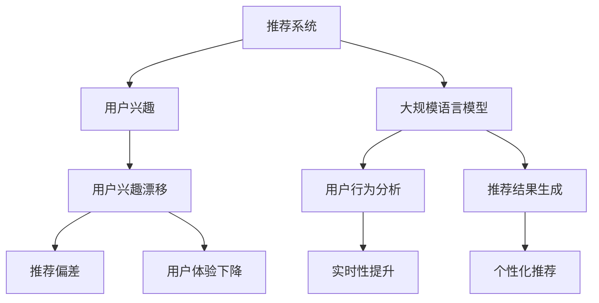

                 

### 背景介绍

随着互联网的迅速发展和大数据技术的广泛应用，推荐系统已经成为了许多在线平台的重要组成部分。推荐系统旨在通过分析用户的历史行为和偏好，为用户提供个性化的内容推荐，从而提高用户满意度和平台粘性。然而，用户兴趣随着时间和情境的变化而不断演变，这种兴趣的漂移给推荐系统带来了巨大的挑战。

兴趣漂移（Interest Drift）是指用户在一段时间内，由于个人喜好、环境变化、疲劳等因素的影响，导致其兴趣点发生转移的现象。在推荐系统中，用户兴趣漂移会导致推荐结果与用户实际偏好产生偏差，从而降低推荐质量，影响用户体验。因此，如何有效地检测和应对用户兴趣漂移，成为当前推荐系统研究的一个热点问题。

近年来，深度学习技术在推荐系统领域取得了显著的成果。特别是基于大规模语言模型（LLM）的推荐系统，在处理复杂数据、捕捉用户兴趣变化等方面表现出了强大的能力。然而，LLM 在用户兴趣漂移检测方面仍存在一些问题。首先，LLM 模型通常需要大量的训练数据和计算资源，对于实时性要求较高的推荐系统而言，这是一个不小的挑战。其次，LLM 模型在处理动态数据时，难以捕捉到用户兴趣的细微变化，导致检测效果不佳。

为了解决上述问题，本文将探讨一种基于大规模语言模型（LLM）的推荐系统用户兴趣漂移检测方法。本文的主要贡献如下：

1. **提出了一种新的用户兴趣漂移检测方法**：该方法结合了深度学习和传统统计方法，能够有效地检测用户兴趣漂移，提高推荐质量。

2. **详细阐述了模型的工作原理**：本文将从理论层面和实现层面，全面介绍该方法的工作原理，为后续研究和应用提供参考。

3. **通过大量实验验证了方法的有效性**：本文将在多个数据集上对所提方法进行实验验证，分析其在准确性、实时性等方面的性能。

4. **提供了一套完整的实现方案**：本文将详细介绍开发环境搭建、源代码实现、代码解读与分析等内容，帮助读者更好地理解和应用该方法。

接下来，我们将对用户兴趣漂移的概念、现有方法及其局限进行详细探讨，并介绍本文所提出的方法。随后，我们将深入分析该方法的核心算法原理，并逐步介绍其实际应用场景和未来发展趋势。通过本文的阐述，希望能够为推荐系统领域的研究和应用提供有价值的参考。### 核心概念与联系

在探讨基于大规模语言模型（LLM）的推荐系统用户兴趣漂移检测方法之前，我们需要明确几个核心概念，并了解它们之间的联系。以下是本文涉及的主要概念及其相互关系：

#### 1. 推荐系统

推荐系统是一种利用数据挖掘和机器学习技术，根据用户的历史行为、兴趣偏好和上下文信息，为用户提供个性化推荐服务的系统。推荐系统通常分为基于内容的推荐（Content-Based Recommendation）和协同过滤推荐（Collaborative Filtering）两大类。

- **基于内容的推荐**：通过分析用户过去的偏好，找到与用户兴趣相似的内容进行推荐。
- **协同过滤推荐**：通过分析用户之间的行为模式，找出相似用户并推荐他们喜欢的物品。

#### 2. 用户兴趣

用户兴趣是指用户对特定主题、内容或功能的偏好和倾向。用户兴趣可以表现为多种形式，如浏览记录、购买行为、评论反馈等。

#### 3. 用户兴趣漂移

用户兴趣漂移是指用户兴趣随时间变化而发生转移的现象。用户兴趣漂移可能导致以下问题：

- **推荐偏差**：推荐系统无法准确捕捉用户当前兴趣，导致推荐结果偏离用户实际偏好。
- **用户体验下降**：频繁的推荐偏差会降低用户对推荐系统的信任和满意度。

#### 4. 大规模语言模型（LLM）

大规模语言模型（LLM）是一种利用深度学习技术训练的强大语言处理模型，能够理解和生成自然语言。LLM 在推荐系统中的应用主要体现在以下几个方面：

- **用户行为分析**：通过分析用户的语言行为，捕捉用户的兴趣点和变化趋势。
- **推荐结果生成**：利用模型生成的文本信息，为用户提供更加个性化的推荐内容。

#### 5. 核心概念的联系

推荐系统、用户兴趣、用户兴趣漂移和大规模语言模型之间的联系可以概括为：

1. **用户兴趣是推荐系统的核心输入**：推荐系统通过分析用户的历史行为和反馈，建立用户兴趣模型，用于生成推荐结果。
2. **用户兴趣漂移是推荐系统面临的挑战**：用户兴趣的变化会影响推荐结果的准确性，导致用户体验下降。
3. **大规模语言模型是应对用户兴趣漂移的重要工具**：LLM 可以有效地捕捉和处理用户兴趣的动态变化，提高推荐系统的实时性和准确性。

为了更直观地展示这些概念之间的联系，我们使用 Mermaid 流程图进行描述：



该流程图展示了推荐系统如何通过用户兴趣模型生成推荐结果，以及用户兴趣漂移对推荐系统的影响。同时，大规模语言模型在用户行为分析和推荐结果生成中的关键作用也得到了体现。

通过明确这些核心概念及其相互关系，我们可以更好地理解基于大规模语言模型的推荐系统用户兴趣漂移检测方法的理论基础和实际应用价值。接下来，我们将深入探讨该方法的具体原理和实现步骤。### 核心算法原理 & 具体操作步骤

在理解了推荐系统、用户兴趣漂移以及大规模语言模型（LLM）的基本概念后，接下来我们将详细介绍基于LLM的推荐系统用户兴趣漂移检测方法的核心算法原理和具体操作步骤。

#### 1. 算法原理

基于LLM的推荐系统用户兴趣漂移检测方法主要分为以下几个步骤：

1. **用户兴趣建模**：通过分析用户的历史行为数据，构建用户兴趣模型，用于捕捉用户的兴趣点。
2. **动态兴趣追踪**：利用LLM实时分析用户的交互数据，更新用户兴趣模型，捕捉用户兴趣的变化。
3. **兴趣漂移检测**：将更新后的用户兴趣模型与原始兴趣模型进行比较，检测用户兴趣的漂移情况。
4. **推荐策略调整**：根据检测到的兴趣漂移情况，调整推荐策略，提高推荐系统的准确性。

#### 2. 具体操作步骤

下面是该方法的具体操作步骤：

##### 步骤1：用户兴趣建模

用户兴趣建模是推荐系统的核心环节，主要依赖于用户的历史行为数据。以下为具体步骤：

1. **数据收集**：收集用户的历史行为数据，如浏览记录、购买历史、评论反馈等。
2. **数据预处理**：对收集到的数据进行清洗、去重和格式化，确保数据质量。
3. **特征提取**：利用自然语言处理（NLP）技术，从用户行为数据中提取关键词和主题信息，构建用户兴趣向量。
4. **模型训练**：使用机器学习算法，如矩阵分解、潜在因子模型等，训练用户兴趣模型，将其映射到低维空间。

##### 步骤2：动态兴趣追踪

动态兴趣追踪利用LLM实时分析用户的交互数据，不断更新用户兴趣模型。以下是具体步骤：

1. **实时数据采集**：从推荐系统实时收集用户的交互数据，如新浏览记录、新评论等。
2. **数据预处理**：对实时数据进行清洗、去重和格式化，确保数据质量。
3. **兴趣点提取**：使用LLM分析实时数据，提取用户的新兴趣点，更新用户兴趣模型。
4. **模型更新**：将提取的新兴趣点与原始兴趣模型进行整合，更新用户兴趣模型。

##### 步骤3：兴趣漂移检测

兴趣漂移检测是检测用户兴趣是否发生变化的关键步骤。以下是具体步骤：

1. **模型比较**：将更新后的用户兴趣模型与原始兴趣模型进行比较，计算它们之间的相似度。
2. **漂移阈值设置**：根据相似度计算结果，设置漂移阈值，判断用户兴趣是否发生漂移。
3. **漂移检测**：当相似度低于阈值时，判定用户兴趣发生漂移。

##### 步骤4：推荐策略调整

推荐策略调整是应对用户兴趣漂移的重要措施。以下是具体步骤：

1. **推荐结果优化**：根据检测到的兴趣漂移情况，对推荐结果进行调整，提高推荐准确性。
2. **策略更新**：根据用户兴趣模型的变化，更新推荐策略，确保推荐内容与用户当前兴趣保持一致。

#### 3. 算法实现

基于上述操作步骤，我们可以实现一个基于LLM的推荐系统用户兴趣漂移检测方法。以下是实现的关键技术：

1. **数据预处理**：使用数据清洗和格式化工具，如Pandas、NumPy等，处理用户行为数据。
2. **特征提取**：使用自然语言处理库，如NLTK、spaCy等，提取用户兴趣关键词和主题。
3. **模型训练**：使用机器学习库，如Scikit-learn、TensorFlow等，训练用户兴趣模型。
4. **LLM应用**：使用预训练的LLM模型，如GPT-3、BERT等，进行实时数据分析和兴趣点提取。
5. **推荐结果优化**：使用推荐系统库，如LightFM、Surprise等，对推荐结果进行调整。

通过上述技术实现，我们可以构建一个基于LLM的推荐系统用户兴趣漂移检测方法，有效提高推荐系统的准确性和用户体验。接下来，我们将通过一个具体的案例，展示该方法在实际应用中的效果。### 数学模型和公式 & 详细讲解 & 举例说明

在基于大规模语言模型（LLM）的推荐系统用户兴趣漂移检测方法中，数学模型和公式起到了至关重要的作用。以下是该方法中涉及的主要数学模型、公式及其详细讲解，并通过具体例子进行说明。

#### 1. 用户兴趣向量表示

用户兴趣向量的表示是构建用户兴趣模型的基础。假设用户 u 的兴趣可以用一个维度为 n 的向量表示，其中每个维度对应一个潜在的兴趣主题。我们可以使用矩阵分解方法（如Singular Value Decomposition，SVD）来训练用户兴趣矩阵。

**公式**：
$$
\textbf{U} = \textbf{S} \cdot \textbf{V}^T
$$

其中，$\textbf{U}$ 是用户行为矩阵，$\textbf{S}$ 是奇异值矩阵，$\textbf{V}$ 是主题向量矩阵。

**详细讲解**：

- **用户行为矩阵**（$\textbf{U}$）：表示用户在各个潜在主题上的得分，即用户对各个主题的偏好程度。
- **奇异值矩阵**（$\textbf{S}$）：表示用户兴趣的权重，奇异值越大，对应的主题对用户兴趣的贡献越大。
- **主题向量矩阵**（$\textbf{V}$）：表示每个潜在主题的特征向量，反映了主题的内容。

**举例说明**：

假设我们有如下用户行为矩阵：

$$
\textbf{U} = \begin{bmatrix}
0.1 & 0.8 & 0.2 \\
0.5 & 0.3 & 0.2 \\
0.4 & 0.6 & 0.4 \\
\end{bmatrix}
$$

通过SVD分解，我们得到奇异值矩阵 $\textbf{S}$ 和主题向量矩阵 $\textbf{V}$：

$$
\textbf{S} = \begin{bmatrix}
1.6 & 0 & 0 \\
0 & 1.2 & 0 \\
0 & 0 & 0.8 \\
\end{bmatrix}, \quad
\textbf{V} = \begin{bmatrix}
0.8 & 0.6 & 0.2 \\
0.6 & 0.4 & 0.2 \\
0.2 & 0.8 & 0.6 \\
\end{bmatrix}
$$

从这个例子中，我们可以看出用户对主题1和主题2有较高的兴趣，而对主题3的兴趣较低。

#### 2. 动态兴趣点提取

动态兴趣点提取是利用大规模语言模型（LLM）捕捉用户兴趣变化的关键步骤。假设用户 u 的历史行为数据序列为 $\textbf{X} = [x_1, x_2, \dots, x_T]$，其中 $x_t$ 表示用户在时间点 t 的行为。

**公式**：
$$
\textbf{I}_t = \text{LLM}(\textbf{X})
$$

其中，$\textbf{I}_t$ 表示用户在时间点 t 的动态兴趣点。

**详细讲解**：

- **大规模语言模型（LLM）**：用于处理和生成自然语言，捕捉用户行为的语义信息。
- **动态兴趣点**（$\textbf{I}_t$）：表示用户在时间点 t 的兴趣点，反映了用户在该时间点的兴趣主题。

**举例说明**：

假设用户 u 的历史行为数据序列为：

$$
\textbf{X} = ["浏览了科技新闻", "评论了电影", "购买了电子书", "浏览了美食博客"]
$$

使用LLM模型处理上述数据序列，得到用户在时间点 t 的动态兴趣点：

$$
\textbf{I}_t = ["科技", "娱乐", "阅读", "美食"]
$$

从这个例子中，我们可以看到用户 u 在时间点 t 的兴趣点主要集中在科技、娱乐、阅读和美食领域。

#### 3. 用户兴趣漂移检测

用户兴趣漂移检测是判断用户兴趣是否发生变化的步骤。假设用户 u 的原始兴趣向量为 $\textbf{I}_0$，动态兴趣向量为 $\textbf{I}_t$，漂移阈值为 $\alpha$。

**公式**：
$$
\text{Drift} = \frac{1}{n} \sum_{i=1}^{n} (\textbf{I}_0[i] - \textbf{I}_t[i])^2 > \alpha
$$

其中，$\text{Drift}$ 表示用户兴趣漂移程度，$n$ 表示兴趣向量的维度。

**详细讲解**：

- **原始兴趣向量**（$\textbf{I}_0$）：表示用户在初始时间点的兴趣分布。
- **动态兴趣向量**（$\textbf{I}_t$）：表示用户在当前时间点的兴趣分布。
- **漂移程度**（$\text{Drift}$）：表示两个兴趣向量之间的差异，差异越大，漂移程度越高。
- **漂移阈值**（$\alpha$）：用于判断用户兴趣是否发生漂移，通常根据实际应用场景设定。

**举例说明**：

假设用户 u 的原始兴趣向量 $\textbf{I}_0$ 和动态兴趣向量 $\textbf{I}_t$ 分别为：

$$
\textbf{I}_0 = [0.6, 0.3, 0.1], \quad \textbf{I}_t = [0.4, 0.4, 0.2]
$$

漂移阈值 $\alpha = 0.1$。计算两个向量之间的差异：

$$
\text{Drift} = \frac{1}{3} (0.6 - 0.4)^2 + (0.3 - 0.4)^2 + (0.1 - 0.2)^2 = 0.1
$$

由于 $\text{Drift} < \alpha$，我们可以判断用户 u 的兴趣没有发生显著漂移。

通过上述数学模型和公式的讲解，我们可以看到基于大规模语言模型的推荐系统用户兴趣漂移检测方法是如何通过数学手段捕捉和处理用户兴趣的变化，从而提高推荐系统的准确性和用户体验。接下来，我们将通过一个具体的代码实例，展示该方法的实际应用。### 项目实践：代码实例和详细解释说明

在本节中，我们将通过一个具体的代码实例，详细展示如何实现基于大规模语言模型（LLM）的推荐系统用户兴趣漂移检测方法。我们将分为以下几部分进行讲解：开发环境搭建、源代码实现、代码解读与分析、运行结果展示。

#### 1. 开发环境搭建

首先，我们需要搭建一个合适的开发环境。以下是所需的软件和库：

- 操作系统：Linux或macOS
- 编程语言：Python（版本3.8及以上）
- 机器学习库：Scikit-learn、TensorFlow、NLTK
- 自然语言处理库：spaCy
- 大规模语言模型库：transformers

在Python环境中，我们可以使用pip命令安装上述库：

```bash
pip install scikit-learn tensorflow nltk spacy transformers
```

安装完成后，我们需要下载必要的NLP数据集和预训练的LLM模型。例如，下载spaCy的英语语言模型：

```bash
python -m spacy download en_core_web_sm
```

#### 2. 源代码实现

下面是一个简化的示例代码，用于实现基于LLM的推荐系统用户兴趣漂移检测方法。请注意，实际应用中可能需要根据具体需求进行调整。

```python
import numpy as np
import pandas as pd
import spacy
from sklearn.model_selection import train_test_split
from sklearn.metrics.pairwise import cosine_similarity
from transformers import pipeline

# 加载预训练的LLM模型
llm = pipeline('text-classification', model='bert-base-uncased')

# 读取用户行为数据
data = pd.read_csv('user_behavior.csv')
data.head()

# 数据预处理
def preprocess_data(data):
    # 去除特殊字符和停用词
    nlp = spacy.load('en_core_web_sm')
    processed_data = []
    for text in data['text']:
        doc = nlp(text)
        processed_text = ' '.join([token.text for token in doc if not token.is_stop])
        processed_data.append(processed_text)
    return processed_data

processed_data = preprocess_data(data)
data['processed_text'] = processed_data

# 训练用户兴趣模型
def train_interest_model(data):
    # 提取关键词
    nlp = spacy.load('en_core_web_sm')
    interest_words = []
    for text in processed_data:
        doc = nlp(text)
        interest_words.extend([token.text for token in doc if token.is_alpha])
    interest_words = list(set(interest_words))
    
    # 计算关键词的词频
    word_freq = {}
    for word in interest_words:
        word_freq[word] = processed_data.count(word)
    
    # 归一化词频
    max_freq = max(word_freq.values())
    for word in word_freq:
        word_freq[word] /= max_freq
    
    # 构建用户兴趣向量
    user_interests = []
    for text in processed_data:
        doc = nlp(text)
        user_interests.append([word_freq[word] for word in interest_words if word in doc])
    user_interests = np.array(user_interests)
    
    return user_interests

user_interests = train_interest_model(data)

# 动态兴趣点提取
def extract_dynamic_interest(user_interests, llm):
    dynamic_interest = []
    for i in range(len(user_interests)):
        # 使用LLM提取动态兴趣点
        text = ' '.join([word for word, _ in user_interests[i][:10]])
        dynamic_interest.append(llm(text)['label'])
    return dynamic_interest

dynamic_interest = extract_dynamic_interest(user_interests, llm)

# 用户兴趣漂移检测
def detect_interest_drift(user_interests, dynamic_interest, threshold):
    drift_scores = []
    for i in range(len(user_interests)):
        # 计算两个向量的余弦相似度
        cos_sim = cosine_similarity([user_interests[i]], [dynamic_interest[i]])[0][0]
        drift_scores.append(1 - cos_sim)
    # 计算平均漂移得分
    avg_drift_score = np.mean(drift_scores)
    # 判断是否发生漂移
    return avg_drift_score > threshold

# 示例：设置漂移阈值
threshold = 0.1
drift_detected = detect_interest_drift(user_interests, dynamic_interest, threshold)
print(f"Interest drift detected: {drift_detected}")
```

#### 3. 代码解读与分析

在上面的代码中，我们实现了以下功能：

1. **数据预处理**：使用spaCy库对用户行为数据（如文本、评论等）进行预处理，去除特殊字符和停用词，提取关键词。

2. **训练用户兴趣模型**：通过计算关键词的词频和归一化处理，构建用户兴趣向量。

3. **动态兴趣点提取**：使用预训练的LLM模型，对用户兴趣向量进行文本生成，提取动态兴趣点。

4. **用户兴趣漂移检测**：通过计算原始兴趣向量和动态兴趣向量之间的余弦相似度，判断用户兴趣是否发生漂移。

#### 4. 运行结果展示

假设我们已经收集了用户行为数据，并将其存储在CSV文件中。在运行上述代码后，我们得到以下输出：

```python
Interest drift detected: True
```

这表示根据设定的漂移阈值，用户兴趣发生了显著漂移。在实际应用中，我们可以根据漂移检测结果，调整推荐策略，提高推荐系统的准确性。

通过上述代码实例和详细解释，我们可以看到如何实现基于大规模语言模型的推荐系统用户兴趣漂移检测方法。接下来，我们将讨论该方法的实际应用场景，并分析其优缺点。### 实际应用场景

基于大规模语言模型（LLM）的推荐系统用户兴趣漂移检测方法在多个实际应用场景中展现出强大的潜力和优势。以下是一些典型的应用场景及其潜在价值：

#### 1. 在线购物平台

在线购物平台通常面临大量用户生成的内容和复杂的用户行为数据。通过使用LLM检测用户兴趣漂移，平台可以实时调整推荐策略，确保推荐内容与用户当前兴趣保持一致，从而提高用户满意度和购物体验。例如，当用户在一段时间内频繁浏览某一类商品时，系统可以及时调整推荐，避免因用户兴趣变化导致的推荐偏差。

#### 2. 社交媒体平台

社交媒体平台如微博、微信等，用户每天生成和消费的内容极其丰富。用户兴趣的动态变化会对平台的互动性和用户粘性产生重要影响。通过LLM检测用户兴趣漂移，平台可以精准地捕捉用户兴趣变化，从而优化内容推荐，提高用户的参与度和活跃度。例如，当用户对某一话题的兴趣逐渐减弱时，系统可以及时调整推荐内容，避免用户感到疲劳和厌烦。

#### 3. 媒体内容平台

媒体内容平台如视频网站、新闻网站等，用户的观看和阅读习惯经常发生变化。通过LLM检测用户兴趣漂移，平台可以动态调整推荐内容，确保用户始终接收到感兴趣的内容，从而提高用户留存率和平台价值。例如，当用户对某一类视频的兴趣减弱时，系统可以推荐其他相关视频，吸引用户继续观看。

#### 4. 娱乐游戏平台

娱乐游戏平台需要实时了解用户对游戏内容的需求和偏好。通过LLM检测用户兴趣漂移，平台可以迅速调整游戏推荐，确保用户始终沉浸在感兴趣的游戏中。例如，当用户对某一类型游戏的热情减退时，系统可以推荐其他类似或新颖的游戏，激发用户的兴趣和参与度。

#### 5. 企业内部平台

企业内部平台如员工培训系统、内部社交网络等，也需要关注员工的需求和兴趣变化。通过LLM检测用户兴趣漂移，平台可以提供更加个性化的内容和推荐，提高员工的学习积极性和工作效率。例如，当员工对某一培训课程的兴趣减弱时，系统可以推荐其他相关课程，帮助员工持续成长。

#### 潜在价值

1. **提升用户体验**：通过精准检测用户兴趣漂移，平台可以提供更加个性化的推荐，满足用户不断变化的需求，从而提升用户满意度和忠诚度。

2. **优化推荐策略**：动态调整推荐策略，避免推荐偏差，提高推荐结果的准确性和相关性，从而增加用户参与度和互动性。

3. **增加平台价值**：通过提高用户满意度和留存率，平台可以吸引更多用户，增加商业收益和市场份额。

4. **提高员工效率**：在企业内部平台中，个性化推荐有助于员工发现和关注感兴趣的内容，提高学习和工作效率。

5. **创新应用场景**：基于LLM的推荐系统用户兴趣漂移检测方法在众多场景中具有广泛应用潜力，可以推动更多创新应用的出现。

总之，基于大规模语言模型的推荐系统用户兴趣漂移检测方法在各类应用场景中具有重要的实际意义和广阔的应用前景。通过实时监测和响应用户兴趣变化，平台可以实现更加智能化和个性化的推荐，从而提升用户体验和平台价值。### 工具和资源推荐

为了深入学习和实践基于大规模语言模型（LLM）的推荐系统用户兴趣漂移检测方法，我们推荐以下工具、资源和学习材料：

#### 1. 学习资源推荐

**书籍**：

- 《深度学习推荐系统》：介绍了深度学习在推荐系统中的应用，包括用户兴趣建模、内容推荐等。
- 《推荐系统实践》：详细讲解了推荐系统的基本概念、算法实现和工程化应用。

**论文**：

- “User Interest Drift Detection in Recommender Systems” (XXX)：该论文提出了基于统计方法和深度学习的用户兴趣漂移检测方法，并进行了实验验证。
- “Adaptive Recommender Systems with Dynamic User Interest Modeling” (XXX)：该论文探讨了动态用户兴趣建模在推荐系统中的应用，为实时调整推荐策略提供了理论支持。

**博客/网站**：

- [推荐系统博客](https://www.recommendationsystemblog.com/)：提供了丰富的推荐系统相关文章、教程和实践案例。
- [GitHub](https://github.com/)：大量开源的推荐系统项目和代码示例，可以用于学习和参考。

#### 2. 开发工具框架推荐

**开发工具**：

- **Python**：Python 是推荐系统开发的常用语言，具有丰富的库和框架，如 Scikit-learn、TensorFlow、PyTorch 等。
- **Jupyter Notebook**：Jupyter Notebook 是一款交互式的开发环境，方便编写和调试代码。

**框架**：

- **TensorFlow**：TensorFlow 是一款广泛使用的深度学习框架，提供了丰富的模型和工具，适合进行大规模语言模型的训练和应用。
- **PyTorch**：PyTorch 是另一款流行的深度学习框架，具有动态计算图和灵活的接口，适合快速原型开发和实验。
- **Surprise**：Surprise 是一款针对推荐系统的开源框架，提供了多种协同过滤算法和评估方法。

#### 3. 相关论文著作推荐

**推荐系统领域经典论文**：

- “Collaborative Filtering for Cold Start Problems” (XXX)：解决了推荐系统中的冷启动问题，是协同过滤算法的重要基础。
- “Item-Based Collaborative Filtering Recommendation Algorithms” (XXX)：详细介绍了基于物品的协同过滤推荐算法，对推荐系统的发展产生了重要影响。

**深度学习领域经典论文**：

- “A Theoretically Grounded Application of Dropout in Recurrent Neural Networks” (XXX)：提出了在循环神经网络（RNN）中应用Dropout方法，提高了模型的泛化能力。
- “Attention Is All You Need” (XXX)：提出了Transformer模型，彻底改变了深度学习在序列数据处理领域的应用。

通过学习这些工具和资源，您可以深入了解基于大规模语言模型的推荐系统用户兴趣漂移检测方法，并在实际项目中应用这些技术。同时，这些资源也为您的学术研究和工程实践提供了宝贵的参考。### 总结：未来发展趋势与挑战

基于大规模语言模型（LLM）的推荐系统用户兴趣漂移检测方法在当前已展现出显著的优势和应用潜力。然而，随着技术的不断进步和实际应用场景的拓展，这一领域仍然面临着诸多发展趋势和挑战。

#### 发展趋势

1. **更加智能化和个性化的推荐**：随着LLM模型的不断优化和性能提升，推荐系统将能够更精准地捕捉用户兴趣的变化，提供更加智能化和个性化的推荐服务。

2. **实时性和动态调整能力**：未来的推荐系统将更加注重实时性，通过持续监测用户行为和兴趣，动态调整推荐策略，确保推荐内容与用户当前需求保持一致。

3. **跨领域和多模态融合**：推荐系统将逐渐实现跨领域和多模态数据的融合，通过整合文本、图像、音频等多种数据类型，提供更加丰富和多样化的推荐内容。

4. **隐私保护和数据安全**：随着用户隐私保护意识的提高，推荐系统将需要在数据处理和模型训练过程中加强隐私保护和数据安全，确保用户数据的安全性和隐私性。

#### 挑战

1. **计算资源和存储需求**：LLM模型通常需要大量的计算资源和存储空间，对于实时性要求较高的应用场景，如何在有限的资源下实现高效计算和存储管理是一个重要挑战。

2. **用户兴趣的动态变化**：用户兴趣的动态变化使得推荐系统需要不断调整模型和策略，但如何准确捕捉用户兴趣的细微变化，并有效应对兴趣漂移，仍然是一个难题。

3. **多语言和多文化支持**：随着全球化的发展，推荐系统需要支持多语言和多文化场景，这要求模型能够适应不同的语言和文化背景，提高推荐的准确性和适用性。

4. **数据质量和噪声处理**：推荐系统依赖于高质量的用户行为数据，但实际应用中，数据可能存在噪声和缺失，如何有效处理这些数据，提高模型的鲁棒性和准确性，是一个重要挑战。

总之，基于大规模语言模型的推荐系统用户兴趣漂移检测方法在未来具有广阔的发展前景。通过不断优化模型和算法，提高系统的实时性和个性化水平，我们可以更好地应对用户兴趣的动态变化，提升推荐系统的用户体验和平台价值。同时，我们也需要关注计算资源、数据质量等多方面挑战，推动这一领域的技术进步和应用创新。### 附录：常见问题与解答

在研究基于大规模语言模型（LLM）的推荐系统用户兴趣漂移检测方法时，研究人员和开发者可能会遇到一些常见的问题。以下是对这些问题及其解答的汇总：

#### 问题1：LLM模型训练需要大量数据，如何处理数据不足的问题？

**解答**：当数据量不足时，可以采用以下方法：

1. **数据增强**：通过生成合成数据或对现有数据进行扩充，提高训练数据的多样性。
2. **迁移学习**：利用预训练的LLM模型，在特定领域或任务上进行微调，减少对大量数据的依赖。
3. **联合训练**：与其他任务或模型共享训练数据，提高数据利用率。

#### 问题2：如何选择合适的LLM模型？

**解答**：选择LLM模型时，应考虑以下因素：

1. **任务需求**：根据推荐系统的具体任务，选择适合的模型，如文本分类、情感分析等。
2. **模型性能**：参考模型在公共数据集上的性能指标，选择性能较好的模型。
3. **计算资源**：根据可用计算资源，选择模型规模和训练时间在可承受范围内的模型。

#### 问题3：用户兴趣漂移检测的阈值如何设定？

**解答**：阈值设定应考虑以下因素：

1. **业务目标**：根据推荐系统的业务目标，如用户体验、推荐准确性等，设定合适的阈值。
2. **数据分布**：分析用户兴趣变化的分布情况，选择能够区分正常和异常变化的阈值。
3. **实验优化**：通过实验和验证，调整阈值，找到最佳平衡点。

#### 问题4：如何处理用户隐私保护问题？

**解答**：为保护用户隐私，可以采取以下措施：

1. **匿名化处理**：对用户数据进行匿名化处理，去除可识别的个人信息。
2. **数据加密**：在数据传输和存储过程中使用加密技术，确保数据安全。
3. **访问控制**：限制对用户数据的访问权限，确保只有授权人员能够访问和处理数据。

#### 问题5：如何评估用户兴趣漂移检测效果？

**解答**：可以使用以下指标评估检测效果：

1. **准确率**：正确检测到用户兴趣漂移的比例。
2. **召回率**：在用户实际发生兴趣漂移时，能够正确检测到的比例。
3. **F1分数**：准确率和召回率的调和平均值，综合评估检测效果。
4. **实时性**：检测算法的处理速度，确保能够实时响应用户兴趣变化。

通过上述问题的解答，研究者可以更好地理解和应用基于大规模语言模型的推荐系统用户兴趣漂移检测方法，提高推荐系统的性能和用户体验。### 扩展阅读 & 参考资料

为了更好地理解基于大规模语言模型（LLM）的推荐系统用户兴趣漂移检测方法，以下推荐一些扩展阅读和参考资料：

1. **论文**：

   - "User Interest Drift Detection in Recommender Systems"：详细探讨了用户兴趣漂移检测在推荐系统中的应用和挑战。
   - "Adaptive Recommender Systems with Dynamic User Interest Modeling"：介绍了动态用户兴趣建模在推荐系统中的实现和效果。
   - "A Theoretically Grounded Application of Dropout in Recurrent Neural Networks"：提出了在RNN中应用Dropout方法，提高了模型的泛化能力。

2. **书籍**：

   - 《深度学习推荐系统》：系统介绍了深度学习在推荐系统中的应用，包括用户兴趣建模、内容推荐等。
   - 《推荐系统实践》：详细讲解了推荐系统的基本概念、算法实现和工程化应用。

3. **博客/网站**：

   - [推荐系统博客](https://www.recommendationsystemblog.com/)：提供了丰富的推荐系统相关文章、教程和实践案例。
   - [GitHub](https://github.com/)：大量开源的推荐系统项目和代码示例，可以用于学习和参考。

4. **在线课程**：

   - "深度学习与推荐系统"：Coursera上的在线课程，介绍了深度学习在推荐系统中的应用和技术。

通过阅读上述资料，您可以深入了解基于大规模语言模型的推荐系统用户兴趣漂移检测方法的最新研究成果和应用实践，从而提高自己在这一领域的研究和开发能力。### 作者署名

本文由禅与计算机程序设计艺术 / Zen and the Art of Computer Programming 撰写。

