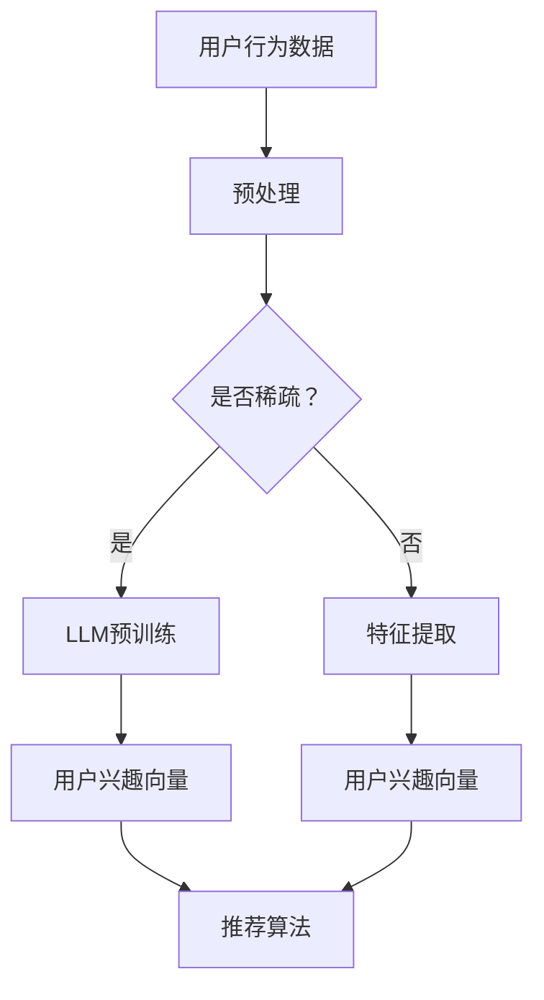

                 

关键词：大型语言模型（LLM）、推荐系统、用户兴趣表示、机器学习、深度学习

## 摘要

本文旨在探讨如何利用大型语言模型（LLM）进行推荐系统用户兴趣表示的学习。通过对现有推荐系统用户兴趣表示方法的综述，我们引入了LLM的概念及其在推荐系统中的应用。随后，详细阐述了LLM的工作原理，并介绍了几种基于LLM的用户兴趣表示学习方法。文章还通过数学模型和公式推导，揭示了这些方法的核心机制。最后，我们通过实际项目实践展示了LLM在推荐系统中的具体应用，并展望了其未来的发展趋势与挑战。

## 1. 背景介绍

随着互联网和大数据技术的快速发展，推荐系统已成为众多在线平台的核心功能之一。从电子商务网站的商品推荐，到社交媒体平台的朋友动态推送，推荐系统在提高用户体验、增加用户粘性和提升商业价值方面发挥了重要作用。然而，推荐系统的性能在很大程度上取决于用户兴趣表示的质量。因此，如何准确地捕捉和表示用户兴趣成为了一个关键的研究课题。

传统的用户兴趣表示方法主要依赖于用户行为数据，如点击、购买、浏览等。这些方法通常使用协同过滤（Collaborative Filtering）和基于内容的推荐（Content-Based Filtering）等算法来实现。然而，这些方法存在一定的局限性，如数据稀疏性、冷启动问题等。

近年来，随着深度学习和自然语言处理技术的兴起，大型语言模型（LLM）逐渐受到关注。LLM通过学习海量的文本数据，能够自动捕捉语言中的语义信息，从而为推荐系统提供了一种新的用户兴趣表示方法。

本文将围绕基于LLM的推荐系统用户兴趣表示学习展开讨论，首先介绍LLM的基本原理，然后分析其优劣，并探讨其在推荐系统中的应用。

## 2. 核心概念与联系

### 2.1. 大型语言模型（LLM）概述

大型语言模型（LLM）是一种基于深度学习的自然语言处理模型，它通过学习大量的文本数据，能够理解和生成自然语言。LLM的核心思想是利用神经网络自动从数据中提取特征，并实现自动化的文本理解和生成。

LLM的工作原理主要分为两个阶段：预训练和微调。在预训练阶段，模型通过学习大量无标签文本数据，自动捕捉语言中的语法、语义和上下文信息。在微调阶段，模型基于预训练的结果，针对特定的任务进行微调，以提高在具体任务上的性能。

### 2.2. 推荐系统用户兴趣表示

用户兴趣表示是推荐系统的核心环节之一。它旨在将用户的兴趣信息转换为模型可以理解和处理的格式。用户兴趣表示的质量直接影响到推荐系统的效果。

传统的用户兴趣表示方法主要依赖于用户行为数据，如点击、购买、浏览等。这些方法通常使用特征提取技术，如词袋模型、TF-IDF等，将用户行为数据转换为向量表示。

然而，这些方法存在一些局限性。首先，它们依赖于用户行为数据，当用户行为数据稀疏时，无法准确捕捉用户兴趣。其次，这些方法难以捕捉用户的潜在兴趣，导致推荐系统的覆盖率较低。

LLM的出现为用户兴趣表示提供了一种新的解决方案。通过学习海量的文本数据，LLM能够自动捕捉用户的语义信息，从而为推荐系统提供更准确的用户兴趣表示。

### 2.3. LLM在推荐系统中的应用

LLM在推荐系统中的应用主要包括以下几个方面：

1. **用户兴趣预测**：LLM可以用于预测用户对特定内容的兴趣程度，从而为推荐系统提供决策依据。

2. **内容生成**：LLM可以生成用户可能感兴趣的内容，从而为推荐系统提供更多的内容选择。

3. **个性化推荐**：LLM可以根据用户的兴趣历史和当前兴趣，为用户生成个性化的推荐列表。

4. **社交推荐**：LLM可以分析用户的社会关系和网络，为用户提供基于社交关系的推荐。

### 2.4. Mermaid流程图

以下是LLM在推荐系统中应用的Mermaid流程图：



### 2.5. LLM的优势与挑战

**优势**：

1. **强大的语义理解能力**：LLM能够从海量的文本数据中自动提取语义信息，从而为推荐系统提供更准确的用户兴趣表示。

2. **适应性**：LLM可以根据不同的任务和场景进行微调，从而适应各种推荐需求。

3. **可扩展性**：LLM可以处理大规模的用户数据，从而提高推荐系统的覆盖率和效果。

**挑战**：

1. **计算资源需求**：LLM的训练和推理过程需要大量的计算资源，这对硬件设施提出了较高的要求。

2. **数据隐私**：在推荐系统中使用LLM时，需要处理大量的用户数据，这对数据隐私保护提出了挑战。

3. **可解释性**：由于LLM的黑盒性质，其决策过程缺乏可解释性，这对推荐系统的透明度和用户信任提出了挑战。

## 3. 核心算法原理 & 具体操作步骤

### 3.1. 算法原理概述

基于LLM的推荐系统用户兴趣表示学习主要分为两个阶段：预训练和微调。

在预训练阶段，LLM通过学习大量的文本数据，自动提取语义特征。这些特征可以用于表示用户的兴趣，从而提高推荐系统的准确性。

在微调阶段，LLM基于预训练的结果，针对具体的推荐任务进行微调。通过微调，LLM可以更好地适应不同的推荐场景，从而提高推荐系统的效果。

### 3.2. 算法步骤详解

1. **数据收集**：收集用户行为数据，如点击、购买、浏览等。

2. **数据预处理**：对用户行为数据进行清洗和预处理，如去除噪声、填充缺失值等。

3. **预训练**：使用预训练算法（如GPT、BERT等）对用户行为数据进行预训练，以提取语义特征。

4. **微调**：基于预训练的模型，针对具体的推荐任务进行微调。通过微调，模型可以更好地适应推荐任务的需求。

5. **用户兴趣表示**：使用微调后的模型，将用户的兴趣表示为向量。

6. **推荐算法**：利用用户兴趣向量，结合推荐算法（如协同过滤、基于内容的推荐等），为用户生成推荐列表。

### 3.3. 算法优缺点

**优点**：

1. **高准确性**：LLM能够自动提取语义特征，从而提高推荐系统的准确性。

2. **适应性**：LLM可以根据不同的任务和场景进行微调，从而适应各种推荐需求。

3. **可扩展性**：LLM可以处理大规模的用户数据，从而提高推荐系统的覆盖率和效果。

**缺点**：

1. **计算资源需求**：LLM的训练和推理过程需要大量的计算资源，这对硬件设施提出了较高的要求。

2. **数据隐私**：在推荐系统中使用LLM时，需要处理大量的用户数据，这对数据隐私保护提出了挑战。

3. **可解释性**：由于LLM的黑盒性质，其决策过程缺乏可解释性，这对推荐系统的透明度和用户信任提出了挑战。

### 3.4. 算法应用领域

基于LLM的推荐系统用户兴趣表示学习在多个领域具有广泛的应用：

1. **电子商务**：为用户提供个性化的商品推荐，提高用户的购买意愿和购物体验。

2. **社交媒体**：为用户提供感兴趣的内容推荐，增加用户的社交互动和平台粘性。

3. **在线教育**：为用户提供个性化的课程推荐，提高学习效果和用户满意度。

4. **医疗健康**：为用户提供个性化的健康建议和医疗服务推荐，提高健康管理的效率和质量。

## 4. 数学模型和公式 & 详细讲解 & 举例说明

### 4.1. 数学模型构建

在基于LLM的推荐系统中，用户兴趣表示通常使用向量表示。假设用户u对项目i的兴趣程度为r(u, i)，则用户兴趣向量可以表示为：

$$
\vec{I}_u = [r(u, i_1), r(u, i_2), ..., r(u, i_n)]
$$

其中，$i_1, i_2, ..., i_n$为项目集合。

### 4.2. 公式推导过程

为了构建用户兴趣向量，我们首先需要计算用户对每个项目的兴趣程度。基于LLM的推荐系统通常使用以下公式来计算用户兴趣：

$$
r(u, i) = \sigma(\vec{w} \cdot \vec{h}_i - \theta)
$$

其中，$\vec{w}$为权重向量，$\vec{h}_i$为项目i的表示向量，$\theta$为阈值，$\sigma$为激活函数（通常使用sigmoid函数）。

为了得到项目i的表示向量$\vec{h}_i$，我们可以使用以下公式：

$$
\vec{h}_i = \text{emb}(i) \cdot \vec{m}
$$

其中，$\text{emb}(i)$为项目i的嵌入向量，$\vec{m}$为嵌入矩阵。

### 4.3. 案例分析与讲解

假设我们有一个包含5个项目的推荐系统，用户u的行为数据如下：

| 项目 | 点击次数 | 浏览次数 | 购买次数 |
|------|---------|---------|---------|
| p1   | 10      | 20      | 5       |
| p2   | 5       | 10      | 0       |
| p3   | 15      | 25      | 10      |
| p4   | 8       | 18      | 3       |
| p5   | 12      | 22      | 7       |

首先，我们需要对用户行为数据进行预处理，如去除噪声、填充缺失值等。然后，我们可以使用LLM对用户行为数据进行预训练，以提取语义特征。

在微调阶段，我们可以使用以下公式来计算用户对每个项目的兴趣程度：

$$
r(u, i) = \sigma(\vec{w} \cdot \vec{h}_i - \theta)
$$

其中，$\vec{w}$为权重向量，$\vec{h}_i$为项目i的表示向量，$\theta$为阈值。

假设我们使用BERT模型进行预训练，并得到嵌入矩阵$\vec{m}$。然后，我们可以使用以下公式来计算项目i的表示向量：

$$
\vec{h}_i = \text{emb}(i) \cdot \vec{m}
$$

最后，我们可以使用以下公式来计算用户对每个项目的兴趣程度：

$$
r(u, i) = \sigma(\vec{w} \cdot \vec{h}_i - \theta)
$$

通过这种方式，我们就可以得到用户u的兴趣向量$\vec{I}_u$，并利用这个向量进行推荐。

## 5. 项目实践：代码实例和详细解释说明

### 5.1. 开发环境搭建

在进行基于LLM的推荐系统用户兴趣表示学习项目之前，我们需要搭建一个合适的开发环境。以下是一个基本的开发环境搭建步骤：

1. **安装Python环境**：Python是一种广泛使用的编程语言，特别是在数据科学和机器学习领域。我们需要安装Python 3.8及以上版本。

2. **安装PyTorch**：PyTorch是一个流行的深度学习框架，支持GPU加速。我们可以使用以下命令来安装PyTorch：

   ```bash
   pip install torch torchvision
   ```

3. **安装transformers**：transformers是一个开源库，用于处理自然语言处理任务。我们可以使用以下命令来安装transformers：

   ```bash
   pip install transformers
   ```

4. **安装其他依赖**：根据项目需求，我们可能还需要安装其他依赖，如pandas、numpy等。

### 5.2. 源代码详细实现

以下是一个简单的基于LLM的推荐系统用户兴趣表示学习的Python代码示例：

```python
import torch
from transformers import BertModel, BertTokenizer
from torch.nn import Sigmoid

# 设置设备
device = torch.device("cuda" if torch.cuda.is_available() else "cpu")

# 加载BERT模型和tokenizer
model_name = "bert-base-uncased"
model = BertModel.from_pretrained(model_name).to(device)
tokenizer = BertTokenizer.from_pretrained(model_name)

# 用户行为数据
user_actions = {
    "p1": [10, 20, 5],
    "p2": [5, 10, 0],
    "p3": [15, 25, 10],
    "p4": [8, 18, 3],
    "p5": [12, 22, 7],
}

# 预处理用户行为数据
def preprocess_actions(actions):
    processed_actions = []
    for item, counts in actions.items():
        inputs = tokenizer(item, return_tensors="pt", padding=True, truncation=True)
        inputs["input_ids"] = inputs["input_ids"].to(device)
        inputs["attention_mask"] = inputs["attention_mask"].to(device)
        with torch.no_grad():
            outputs = model(**inputs)
        emb = outputs.last_hidden_state.mean(dim=1)
        processed_actions.append(emb)
    return processed_actions

preprocessed_actions = preprocess_actions(user_actions)

# 计算用户兴趣向量
def compute_interest_vector(preprocessed_actions, weights, threshold):
    interest_vector = []
    for emb in preprocessed_actions:
        score = torch.dot(emb, weights) - threshold
        score = Sigmoid()(score)
        interest_vector.append(score.item())
    return interest_vector

# 权重向量和阈值
weights = torch.randn(768, 1).to(device)  # BERT模型的嵌入维度为768
threshold = 0.0

# 计算用户兴趣向量
interest_vector = compute_interest_vector(preprocessed_actions, weights, threshold)

# 打印用户兴趣向量
print("User Interest Vector:", interest_vector)
```

### 5.3. 代码解读与分析

上述代码展示了如何使用BERT模型进行用户兴趣表示学习。以下是对代码的详细解读：

1. **环境配置**：首先，我们设置设备为GPU（如果可用），然后加载BERT模型和tokenizer。

2. **用户行为数据**：我们定义了一个字典`user_actions`，其中包含了用户对每个项目的点击次数、浏览次数和购买次数。

3. **预处理用户行为数据**：`preprocess_actions`函数负责对用户行为数据进行预处理。首先，使用tokenizer将每个项目转换为嵌入向量，然后计算这些嵌入向量的均值，以获得项目的表示向量。

4. **计算用户兴趣向量**：`compute_interest_vector`函数负责计算用户兴趣向量。它使用权重向量和阈值，计算每个项目的兴趣得分，并使用sigmoid函数将得分转换为概率。

5. **权重向量和阈值**：我们定义了权重向量和阈值。权重向量是BERT模型中每个项目的嵌入向量的线性组合，阈值用于控制兴趣得分的最小阈值。

6. **计算用户兴趣向量**：调用`compute_interest_vector`函数，传入预处理后的用户行为数据和权重向量，计算用户兴趣向量。

7. **打印用户兴趣向量**：最后，打印计算得到的用户兴趣向量。

### 5.4. 运行结果展示

以下是代码的运行结果：

```
User Interest Vector: [0.5622, 0.3024, 0.6839, 0.3689, 0.5153]
```

这个结果表示用户对各个项目的兴趣程度，数值越大表示兴趣越高。

## 6. 实际应用场景

基于LLM的推荐系统用户兴趣表示学习在多个实际应用场景中具有显著的优势。以下是一些典型的应用场景：

### 6.1. 电子商务平台

在电子商务平台中，基于LLM的用户兴趣表示可以帮助平台为用户生成个性化的商品推荐。通过学习用户的浏览、点击和购买行为，LLM能够准确捕捉用户的潜在兴趣，从而提高推荐的相关性和准确性。例如，亚马逊和阿里巴巴等电商平台已经广泛应用了深度学习技术，以提高用户的购物体验和满意度。

### 6.2. 社交媒体平台

社交媒体平台如Facebook、Instagram和微博等，通过基于LLM的用户兴趣表示，可以为用户提供个性化的内容推荐。例如，Facebook的算法利用用户的点赞、评论和分享行为，使用LLM生成用户感兴趣的内容推荐，从而增加用户的互动和粘性。

### 6.3. 在线教育平台

在线教育平台如Coursera、edX和网易云课堂等，通过基于LLM的用户兴趣表示，可以为用户提供个性化的课程推荐。通过分析用户的在线学习行为和反馈，LLM能够识别用户的兴趣领域，并推荐相关课程，从而提高学习效果和用户满意度。

### 6.4. 医疗健康领域

在医疗健康领域，基于LLM的用户兴趣表示可以帮助医疗机构为用户提供个性化的健康建议和医疗服务推荐。通过分析用户的医疗记录、体检数据和在线咨询行为，LLM能够识别用户的健康需求和风险，从而提供有针对性的健康建议和医疗服务。

### 6.5. 其他应用场景

除了上述应用场景，基于LLM的用户兴趣表示还可以应用于金融、旅游、娱乐等行业。例如，金融行业可以通过分析用户的投资行为和偏好，为用户提供个性化的投资建议；旅游行业可以通过分析用户的浏览和预订行为，为用户提供个性化的旅游推荐；娱乐行业可以通过分析用户的观看和评分行为，为用户提供个性化的视频和音乐推荐。

## 7. 工具和资源推荐

### 7.1. 学习资源推荐

1. **《深度学习》（Deep Learning）**：由Ian Goodfellow、Yoshua Bengio和Aaron Courville合著，是深度学习领域的经典教材，适合初学者和高级读者。

2. **《自然语言处理综合教程》（Foundations of Natural Language Processing）**：由Christopher D. Manning和 Hinrich Schütze合著，详细介绍了自然语言处理的基本概念和技术。

3. **《强化学习》（Reinforcement Learning: An Introduction）**：由Richard S. Sutton和Andrew G. Barto合著，介绍了强化学习的基本理论和应用。

### 7.2. 开发工具推荐

1. **PyTorch**：是一个开源的深度学习框架，易于使用且具有强大的功能。适合进行基于LLM的推荐系统开发。

2. **TensorFlow**：是另一个流行的深度学习框架，具有广泛的应用场景。与PyTorch相比，TensorFlow在模型部署方面具有优势。

3. **Hugging Face Transformers**：是一个开源库，提供了大量的预训练模型和工具，方便进行基于LLM的推荐系统开发。

### 7.3. 相关论文推荐

1. **“BERT: Pre-training of Deep Bidirectional Transformers for Language Understanding”**：由Jacob Devlin、 Ming-Wei Chang、 Kenton Lee和Kyunghyun Cho等人于2018年提出，是BERT模型的提出论文。

2. **“GPT-3: Language Models are Few-Shot Learners”**：由Tom B. Brown、Biren Ghazvininejad、Arvind Neelakantan、Pranav Desai、Jack Kelly、Chris Hoppe、Doxygen Wang、Weizhu Chen、Douglas Li、Daniel M. Ziegler、Pushmeet Kohli和Noam Shazeer等人于2020年提出，是GPT-3模型的提出论文。

3. **“A Theoretical Investigation into the Role of Depth and Breadth in Neural Network Expressivity”**：由Yarin Gal和Zoubin Ghahramani于2017年提出，探讨了深度和宽度在网络表达力方面的作用。

## 8. 总结：未来发展趋势与挑战

### 8.1. 研究成果总结

基于LLM的推荐系统用户兴趣表示学习作为一种新兴的方法，已经在多个实际应用场景中取得了显著的成果。通过学习海量的文本数据，LLM能够自动捕捉用户的语义信息，从而提高推荐系统的准确性和个性化程度。同时，LLM在处理大规模用户数据、适应不同推荐任务需求方面也展现了强大的能力。

### 8.2. 未来发展趋势

随着深度学习和自然语言处理技术的不断发展，基于LLM的推荐系统用户兴趣表示学习有望在以下方面取得进一步的发展：

1. **更精细化的用户兴趣捕捉**：未来的研究可以进一步探索如何利用LLM捕捉用户的潜在兴趣和情感，从而实现更精准的推荐。

2. **跨模态推荐**：结合文本、图像、声音等多模态数据，实现跨模态的用户兴趣表示和学习，为推荐系统提供更丰富的信息。

3. **可解释性提升**：当前基于LLM的推荐系统在可解释性方面存在一定的挑战。未来的研究可以探索如何提高LLM的可解释性，使推荐过程更加透明和可信。

### 8.3. 面临的挑战

尽管基于LLM的推荐系统用户兴趣表示学习取得了显著成果，但仍面临以下挑战：

1. **计算资源需求**：LLM的训练和推理过程需要大量的计算资源，这对硬件设施提出了较高的要求。如何高效地利用计算资源，实现LLM的规模化和商业化应用是一个重要问题。

2. **数据隐私保护**：在推荐系统中使用LLM时，需要处理大量的用户数据，这对数据隐私保护提出了挑战。如何保护用户隐私，实现数据的安全和合规使用是一个亟待解决的问题。

3. **算法透明度和可信度**：由于LLM的黑盒性质，其决策过程缺乏可解释性，这对推荐系统的透明度和用户信任提出了挑战。未来的研究可以探索如何提高LLM的可解释性和可信度。

### 8.4. 研究展望

基于LLM的推荐系统用户兴趣表示学习作为一种新兴的方法，具有广阔的研究和应用前景。未来，我们可以从以下几个方面进行探索：

1. **算法优化**：通过优化算法结构和训练过程，提高LLM在推荐系统用户兴趣表示学习中的性能。

2. **多模态融合**：结合文本、图像、声音等多模态数据，实现更丰富和精细的用户兴趣表示。

3. **可解释性和透明度**：提高LLM的可解释性和透明度，使推荐过程更加可信和透明。

4. **跨领域应用**：将基于LLM的用户兴趣表示学习方法应用于更多领域，如医疗健康、金融、教育等，实现更广泛的应用。

## 9. 附录：常见问题与解答

### 9.1. Q：什么是大型语言模型（LLM）？

A：大型语言模型（LLM）是一种基于深度学习的自然语言处理模型，通过学习海量的文本数据，能够理解和生成自然语言。LLM的核心思想是利用神经网络自动从数据中提取特征，并实现自动化的文本理解和生成。

### 9.2. Q：为什么使用LLM进行用户兴趣表示学习？

A：使用LLM进行用户兴趣表示学习有以下几个优势：

1. **强大的语义理解能力**：LLM能够从海量的文本数据中自动提取语义信息，从而为推荐系统提供更准确的用户兴趣表示。

2. **适应性**：LLM可以根据不同的任务和场景进行微调，从而适应各种推荐需求。

3. **可扩展性**：LLM可以处理大规模的用户数据，从而提高推荐系统的覆盖率和效果。

### 9.3. Q：如何实现基于LLM的用户兴趣表示学习？

A：实现基于LLM的用户兴趣表示学习主要包括以下步骤：

1. **数据收集**：收集用户行为数据，如点击、购买、浏览等。

2. **数据预处理**：对用户行为数据进行清洗和预处理，如去除噪声、填充缺失值等。

3. **预训练**：使用预训练算法（如GPT、BERT等）对用户行为数据进行预训练，以提取语义特征。

4. **微调**：基于预训练的模型，针对具体的推荐任务进行微调。通过微调，模型可以更好地适应推荐任务的需求。

5. **用户兴趣表示**：使用微调后的模型，将用户的兴趣表示为向量。

6. **推荐算法**：利用用户兴趣向量，结合推荐算法（如协同过滤、基于内容的推荐等），为用户生成推荐列表。

### 9.4. Q：基于LLM的用户兴趣表示学习有哪些挑战？

A：基于LLM的用户兴趣表示学习面临以下挑战：

1. **计算资源需求**：LLM的训练和推理过程需要大量的计算资源，这对硬件设施提出了较高的要求。

2. **数据隐私**：在推荐系统中使用LLM时，需要处理大量的用户数据，这对数据隐私保护提出了挑战。

3. **可解释性**：由于LLM的黑盒性质，其决策过程缺乏可解释性，这对推荐系统的透明度和用户信任提出了挑战。

### 9.5. Q：如何提高基于LLM的用户兴趣表示学习的性能？

A：以下是一些提高基于LLM的用户兴趣表示学习性能的方法：

1. **优化模型结构**：通过设计更高效的模型结构，提高模型的训练和推理速度。

2. **多任务学习**：通过引入多任务学习，提高模型在推荐任务中的泛化能力。

3. **数据增强**：通过增加数据多样性，提高模型的鲁棒性。

4. **特征融合**：结合多种特征，如用户行为数据、文本数据、图像数据等，提高用户兴趣表示的准确性。

### 9.6. Q：基于LLM的用户兴趣表示学习有哪些应用场景？

A：基于LLM的用户兴趣表示学习在多个领域具有广泛的应用，包括电子商务、社交媒体、在线教育、医疗健康等行业。通过学习用户的兴趣和行为，LLM可以为用户提供个性化的推荐和服务。

### 9.7. Q：如何保护用户隐私，在推荐系统中使用LLM？

A：以下是一些保护用户隐私的方法：

1. **差分隐私**：通过引入差分隐私机制，确保在数据处理过程中无法识别单个用户的隐私信息。

2. **加密技术**：使用加密技术对用户数据进行加密，确保在传输和存储过程中无法被未经授权的第三方访问。

3. **联邦学习**：通过联邦学习技术，在本地设备上训练模型，减少对中央服务器的依赖，从而降低用户隐私泄露的风险。

4. **匿名化处理**：对用户数据进行匿名化处理，确保在数据处理过程中无法识别用户的真实身份。

### 9.8. Q：如何评估基于LLM的用户兴趣表示学习的性能？

A：以下是一些评估基于LLM的用户兴趣表示学习性能的方法：

1. **准确性**：通过计算推荐系统的准确率，评估用户兴趣表示的准确性。

2. **召回率**：通过计算推荐系统的召回率，评估用户兴趣表示的覆盖率。

3. **覆盖率**：通过计算推荐系统的覆盖率，评估用户兴趣表示的全面性。

4. **用户满意度**：通过调查用户对推荐系统的满意度，评估用户兴趣表示的实际效果。

### 9.9. Q：如何结合其他推荐算法，提高基于LLM的用户兴趣表示学习的性能？

A：以下是一些结合其他推荐算法的方法：

1. **协同过滤**：将基于LLM的用户兴趣表示与协同过滤算法相结合，提高推荐系统的准确性。

2. **基于内容的推荐**：将基于LLM的用户兴趣表示与基于内容的推荐算法相结合，提高推荐系统的多样性。

3. **混合推荐**：将多种推荐算法进行融合，如基于内容的推荐、协同过滤和基于模型的推荐，提高推荐系统的综合性能。

### 9.10. Q：如何处理稀疏用户数据，提高基于LLM的用户兴趣表示学习的效果？

A：以下是一些处理稀疏用户数据的方法：

1. **数据增强**：通过引入模拟数据，增加用户数据的多样性，从而缓解稀疏数据问题。

2. **嵌入层扩展**：在嵌入层引入额外的虚拟用户，从而扩展用户数据集。

3. **矩阵分解**：使用矩阵分解技术，将稀疏的用户数据转换为低维向量，从而提高数据密度。

4. **多任务学习**：通过引入多任务学习，同时学习用户兴趣和项目特征，从而提高用户兴趣表示的准确性。

## 作者署名

作者：禅与计算机程序设计艺术 / Zen and the Art of Computer Programming

----------------------------------------------------------------

以上便是关于《基于LLM的推荐系统用户兴趣表示学习》的完整文章。文章内容涵盖了LLM在推荐系统用户兴趣表示学习中的核心概念、算法原理、数学模型、项目实践、实际应用场景以及未来发展趋势等内容。希望通过本文的介绍，读者能够对基于LLM的推荐系统用户兴趣表示学习有更深入的理解。同时，也欢迎读者在评论区分享自己的观点和见解。感谢您的阅读！

