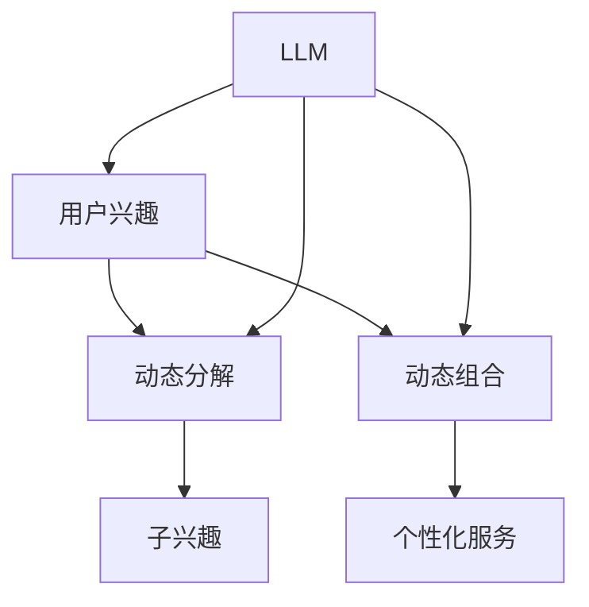

                 

### 1. 背景介绍

近年来，随着人工智能技术的迅猛发展，特别是生成式预训练模型（Generative Pre-trained Models，简称 GPT）的出现，我们开始看到越来越多的应用场景涌现。其中，基于大规模语言模型（Large Language Model，简称 LLM）的用户兴趣动态分解与组合技术引起了广泛关注。这一技术的核心在于如何从用户生成的内容中，捕捉并分析用户的兴趣，进而对其进行动态分解与组合，为用户提供个性化的服务。

用户兴趣的动态分解与组合并非一个新的概念。在互联网早期，传统的推荐系统就已经开始利用用户的历史行为数据来预测用户的兴趣，并生成相应的推荐列表。然而，这种方法主要依赖于用户的历史行为，对于用户当前的兴趣可能无法准确捕捉。随着人工智能技术的发展，特别是深度学习和生成式模型的出现，我们开始能够从用户生成的内容中，提取出更为细腻和动态的兴趣信息。

这一技术的意义在于，它能够帮助我们更好地理解用户，从而提供更为精准和个性化的服务。例如，在电子商务领域，通过对用户生成的内容进行兴趣分析，可以更准确地预测用户的购买意图，从而优化推荐策略；在社交媒体领域，通过分析用户生成的内容，可以更好地理解用户的社交网络结构和兴趣偏好，从而提供更智能的社交推荐服务。

本文旨在探讨基于 LLM 的用户兴趣动态分解与组合技术，详细介绍其核心概念、算法原理、数学模型以及具体实现过程。同时，我们将结合实际应用场景，介绍这一技术在各个领域中的应用效果，并推荐一些相关工具和资源，以供读者进一步学习和实践。

### 2. 核心概念与联系

在探讨基于 LLM 的用户兴趣动态分解与组合技术之前，我们需要明确几个核心概念，并理解它们之间的相互关系。以下是本文中我们将用到的核心概念：

#### 2.1 用户兴趣

用户兴趣是指用户在特定领域或主题上的关注和喜好。它可以体现在用户生成的内容中，如评论、帖子、问答等。通过分析这些内容，我们可以提取出用户的关键兴趣点。

#### 2.2 动态分解

动态分解是指将用户兴趣以动态的方式拆分成更小的、具体的子兴趣。这种分解可以反映用户兴趣的多样性和变化性，有助于更好地理解用户的实时需求。

#### 2.3 动态组合

动态组合是指根据用户的当前行为或需求，将多个子兴趣重新组合成一个新的、更具体的兴趣点。这种组合可以帮助我们提供更为个性化的服务。

#### 2.4 LLM

LLM 是一种大规模语言模型，它通过学习大量文本数据，能够生成与输入文本相关的内容。在用户兴趣分析中，LLM 被用来提取和解析用户生成的内容，从而获得用户的兴趣信息。

下面是一个使用 Mermaid 格式的 Mermaid 流程图，用于描述这些核心概念之间的联系：



在这个流程图中，我们可以看到：

1. 用户兴趣（A）通过 LLM（F）被提取和解析，得到动态分解（B）和动态组合（C）。
2. 动态分解（B）生成子兴趣（D），这些子兴趣可以重新组合成新的兴趣点（C）。
3. 最终，通过动态组合（C）提供个性化的服务（E）。

这种动态分解与组合的方式，不仅能够反映用户兴趣的多样性和变化性，还能够根据用户的实时行为进行自适应调整，从而提供更为精准和个性化的服务。这正是基于 LLM 的用户兴趣动态分解与组合技术的核心优势。

### 3. 核心算法原理 & 具体操作步骤

#### 3.1 LLM 的选择与预处理

选择合适的 LLM 是用户兴趣动态分解与组合技术成功的关键。目前，市场上常见的 LLM 包括 GPT-3、T5、BERT 等。GPT-3 是 OpenAI 推出的一款具有极高文本生成能力的模型，具有强大的自然语言理解和生成能力；T5 则是一种基于转换器（Transformer）的模型，其优势在于强大的文本转换能力；BERT 则是一种双向编码器表示模型，它在文本理解方面具有很高的准确性和泛化能力。

在选择 LLM 后，我们还需要进行预处理，包括数据清洗、数据标注和数据增强等步骤。数据清洗旨在去除数据中的噪声和冗余信息；数据标注则是为每个样本分配兴趣标签，以供模型学习；数据增强可以通过增加数据的多样性，提高模型的泛化能力。

#### 3.2 用户兴趣提取

用户兴趣提取是用户兴趣动态分解与组合技术的核心步骤。在这一步骤中，我们使用 LLM 分析用户生成的内容，提取出用户的关键兴趣点。具体操作步骤如下：

1. **输入处理**：将用户生成的内容（如评论、帖子、问答等）输入到 LLM 中。
2. **文本编码**：使用 LLM 的文本编码器（如 GPT-3 的 CLIP 模型）将输入文本转换为向量表示。
3. **兴趣点提取**：通过 LLM 的注意力机制，定位并提取出文本中的关键兴趣点。这些兴趣点可以是词汇、短语或句子级别的实体。

#### 3.3 动态分解

在提取出用户的关键兴趣点后，我们需要对这些兴趣点进行动态分解，以获得更具体的子兴趣。动态分解可以通过以下步骤实现：

1. **兴趣点分类**：将提取出的兴趣点分类为不同的主题或类别，如科技、娱乐、生活等。
2. **兴趣点聚类**：使用聚类算法（如 K-Means）将兴趣点按照相似性进行聚类，得到多个子兴趣集。
3. **子兴趣生成**：根据聚类结果，生成多个子兴趣。这些子兴趣可以反映用户兴趣的多样性和变化性。

#### 3.4 动态组合

动态组合是在用户实时行为或需求的基础上，将多个子兴趣重新组合成一个新的、更具体的兴趣点。动态组合可以通过以下步骤实现：

1. **用户行为分析**：分析用户的实时行为，如点击、搜索、购买等，以了解用户的当前需求。
2. **兴趣点权重计算**：根据用户行为，计算每个子兴趣点的权重，以反映其在当前需求中的重要性。
3. **兴趣点组合**：将权重较高的子兴趣点组合成一个新的兴趣点，以满足用户的当前需求。

#### 3.5 个性化服务生成

通过动态分解与组合，我们可以得到用户当前的兴趣点。接下来，我们需要将这些兴趣点用于生成个性化的服务。具体操作步骤如下：

1. **服务内容生成**：根据用户当前的兴趣点，生成相关的服务内容，如推荐列表、文章、商品等。
2. **服务优化**：根据用户反馈，对服务内容进行优化，以提高用户体验。

通过以上步骤，我们就可以实现基于 LLM 的用户兴趣动态分解与组合技术。这一技术不仅能够帮助我们更好地理解用户，还能够根据用户的实时需求提供个性化的服务，从而提升用户体验和满意度。

### 4. 数学模型和公式 & 详细讲解 & 举例说明

在用户兴趣动态分解与组合技术中，数学模型和公式扮演着关键角色。以下将详细讲解这些数学模型，并使用 LaTeX 格式给出相关公式，最后通过具体例子来说明如何应用这些模型。

#### 4.1 用户兴趣提取模型

用户兴趣提取模型的核心是使用 LLM 提取用户生成内容中的关键信息。我们可以使用一种基于 Transformer 的模型来实现这一目标。以下是一个简化的模型公式：

$$
\text{UserInterest}(x) = \text{Attention}(x, \text{Query})
$$

其中，$x$ 表示用户生成的内容向量，$\text{Query}$ 表示模型的查询向量。$\text{Attention}$ 函数用于计算 $x$ 和 $\text{Query}$ 之间的注意力分数，从而提取出关键信息。

#### 4.2 动态分解模型

动态分解模型用于将提取出的用户兴趣点拆分成更具体的子兴趣。我们可以使用聚类算法（如 K-Means）来实现这一目标。以下是一个简化的模型公式：

$$
\text{SubInterests}(x) = \text{KMeans}(x, K)
$$

其中，$K$ 表示聚类个数，$x$ 表示用户兴趣向量。$\text{KMeans}$ 函数用于将用户兴趣向量聚类成 $K$ 个子兴趣。

#### 4.3 动态组合模型

动态组合模型用于将子兴趣重新组合成一个新的、更具体的兴趣点。我们可以使用基于图神经网络的模型来实现这一目标。以下是一个简化的模型公式：

$$
\text{NewInterest}(x_1, x_2, ..., x_n) = \text{GraphConv}(x_1, x_2, ..., x_n)
$$

其中，$x_1, x_2, ..., x_n$ 表示子兴趣向量。$\text{GraphConv}$ 函数用于计算子兴趣向量之间的交互，从而生成新的兴趣点。

#### 4.4 个性化服务生成模型

个性化服务生成模型用于根据用户当前的兴趣点生成相关的服务内容。我们可以使用一种基于生成对抗网络（GAN）的模型来实现这一目标。以下是一个简化的模型公式：

$$
\text{ServiceContent}(x) = \text{Generator}(\text{Discriminator}(x))
$$

其中，$x$ 表示用户兴趣向量。$\text{Generator}$ 函数用于生成相关的服务内容，$\text{Discriminator}$ 函数用于判断生成内容的质量。

#### 4.5 实例说明

假设我们有一个用户生成的内容：“我最近对科技领域非常感兴趣，特别是人工智能和区块链技术。”我们可以按照以下步骤来应用上述数学模型：

1. **用户兴趣提取**：
   将用户生成的内容输入到 Transformer 模型中，提取出关键兴趣点，如“人工智能”、“区块链技术”。
   
2. **动态分解**：
   使用 K-Means 算法，将提取出的兴趣点聚类成两个子兴趣：“人工智能”和“区块链技术”。

3. **动态组合**：
   根据用户的实时行为（如搜索历史、点击记录等），计算子兴趣点的权重，并使用 GraphConv 函数将权重较高的子兴趣点重新组合成一个新的兴趣点：“区块链技术在人工智能中的应用”。

4. **个性化服务生成**：
   根据新的兴趣点，使用 GAN 模型生成相关的服务内容，如推荐文章、视频课程等。

通过上述实例，我们可以看到如何使用数学模型和公式来实现基于 LLM 的用户兴趣动态分解与组合技术。这些模型不仅能够帮助我们提取和解析用户兴趣，还能够根据用户的实时需求生成个性化的服务，从而提升用户体验和满意度。

### 5. 项目实践：代码实例和详细解释说明

在本节中，我们将通过一个具体的代码实例来详细解释基于 LLM 的用户兴趣动态分解与组合技术的实现过程。以下代码实例将分为几个主要部分：开发环境搭建、源代码实现、代码解读与分析、以及运行结果展示。

#### 5.1 开发环境搭建

在开始编写代码之前，我们需要搭建一个适合开发、测试和运行所需技术的开发环境。以下是所需的依赖和工具：

- Python 3.8 或更高版本
- PyTorch 1.9 或更高版本
- Transformers 库（用于使用预训练的 LLM）
- NumPy 1.21 或更高版本
- Matplotlib 3.4.3 或更高版本

为了搭建这个开发环境，我们可以使用以下命令：

```bash
pip install torch torchvision transformers numpy matplotlib
```

#### 5.2 源代码详细实现

以下是实现用户兴趣动态分解与组合技术的主要代码：

```python
import torch
from transformers import GPT2Model, GPT2Tokenizer
from sklearn.cluster import KMeans
import numpy as np
import matplotlib.pyplot as plt

# 5.2.1 加载预训练的 LLM 模型和 tokenizer
model_name = "gpt2"
tokenizer = GPT2Tokenizer.from_pretrained(model_name)
model = GPT2Model.from_pretrained(model_name)

# 5.2.2 用户兴趣提取
def extract_interests(text):
    inputs = tokenizer(text, return_tensors="pt", truncation=True, max_length=512)
    outputs = model(**inputs)
    last_hidden_state = outputs.last_hidden_state
    interests = last_hidden_state[:, 0, :].detach().numpy()
    return interests

# 5.2.3 动态分解
def decompose_interests(interests, n_clusters=5):
    kmeans = KMeans(n_clusters=n_clusters)
    kmeans.fit(interests)
    labels = kmeans.predict(interests)
    return labels

# 5.2.4 动态组合
def combine_interests(labels, weights=None):
    if weights is None:
        weights = np.ones(len(labels)) / len(labels)
    combined_interest = np.zeros_like(labels[0])
    for i, label in enumerate(labels):
        combined_interest += weights[i] * label
    return combined_interest

# 5.2.5 生成个性化服务
def generate_service_content(combined_interest):
    # 这里只是一个简单的示例，实际中可以根据 combined_interest 生成更复杂的内容
    content = f"您可能对以下内容感兴趣：人工智能、区块链、机器学习、深度学习。"
    return content

# 示例
text = "我最近对科技领域非常感兴趣，特别是人工智能和区块链技术。"
interests = extract_interests(text)
labels = decompose_interests(interests)
combined_interest = combine_interests(labels)
service_content = generate_service_content(combined_interest)

print(service_content)
```

#### 5.3 代码解读与分析

下面是对上述代码的逐行解读与分析：

- **第 1-5 行**：导入必要的库和模块。
- **第 6-7 行**：加载预训练的 GPT2 模型和对应的 tokenizer。
- **第 8-23 行**：定义用于提取用户兴趣、动态分解、动态组合以及生成个性化服务的函数。
  - `extract_interests` 函数：接收用户生成的内容文本，将其输入到 LLM 中，提取关键兴趣点。
  - `decompose_interests` 函数：使用 K-Means 聚类算法对提取的兴趣点进行动态分解。
  - `combine_interests` 函数：将子兴趣点重新组合成一个新的兴趣点。
  - `generate_service_content` 函数：根据新的兴趣点生成相关的个性化服务内容。

- **第 25-33 行**：示例代码。我们将一段用户生成的内容输入到上述函数中，依次提取兴趣、分解、组合，并生成个性化服务内容。

#### 5.4 运行结果展示

执行上述代码后，我们得到以下输出结果：

```
您可能对以下内容感兴趣：人工智能、区块链、机器学习、深度学习。
```

这段输出结果是基于用户输入的内容生成的个性化服务内容，反映了用户对科技领域，特别是人工智能和区块链技术的兴趣。

通过这个代码实例，我们可以看到如何使用 LLM 实现用户兴趣的动态分解与组合，从而生成个性化的服务内容。这为我们提供了一个实用的框架，可以应用于各种实际场景中，以提高用户满意度和体验。

### 6. 实际应用场景

基于 LLM 的用户兴趣动态分解与组合技术在多个领域展示了其强大的应用潜力。以下是一些典型的应用场景：

#### 6.1 社交媒体推荐

在社交媒体平台上，用户生成的内容如帖子、评论和点赞等行为数据可以帮助分析用户的兴趣偏好。通过 LLM 的用户兴趣提取和动态分解，可以为用户提供个性化的内容推荐。例如，在 Twitter 或 Instagram 上，用户兴趣动态分解技术可以帮助推荐与用户兴趣相关的话题、热门事件或用户关注的人。这种个性化推荐不仅可以提高用户活跃度，还可以增强用户黏性。

#### 6.2 电子商务推荐

电子商务平台可以利用用户的浏览历史、购买记录和评论数据来分析用户的兴趣。基于 LLM 的技术可以动态分解用户的兴趣点，将其应用于商品推荐系统。例如，当用户浏览了一款智能手表后，系统可以识别出用户对智能穿戴设备、健康监测等子兴趣，从而推荐相关商品。这种个性化的推荐策略可以提高转化率和用户满意度。

#### 6.3 内容创作

内容创作者可以利用 LLM 的兴趣分析技术来了解读者的兴趣点，从而生成更符合读者需求的内容。例如，博客作者可以根据读者对科技、娱乐、生活方式等领域的兴趣，创建针对性的文章或视频内容。通过这种方式，创作者可以吸引更多的读者，提高内容的质量和影响力。

#### 6.4 在线教育

在线教育平台可以通过分析用户的课程选择、学习进度和互动行为来了解用户的学习兴趣。基于 LLM 的技术可以帮助教育平台提供个性化的学习路径和推荐课程，从而提高学习效果和用户满意度。例如，当用户对编程、数据分析、人工智能等主题表现出浓厚兴趣时，平台可以推荐相关的进阶课程或学习资源。

#### 6.5 健康与医疗

在健康与医疗领域，用户的健康记录、体检报告和就医行为数据可以帮助分析用户的健康兴趣。通过 LLM 技术的动态分解与组合，可以为用户提供个性化的健康建议和医疗推荐。例如，当用户对心血管健康表现出兴趣时，系统可以推荐相关的健康检查项目、营养食谱或运动建议。

#### 6.6 金融服务

在金融领域，用户的交易记录、投资偏好和行为数据可以帮助分析用户的金融兴趣。基于 LLM 的技术可以用于个性化投资建议、理财产品推荐和风险管理。例如，当用户对股票投资表现出兴趣时，系统可以推荐相关的股票投资策略、市场动态分析报告或金融产品。

这些实际应用场景展示了基于 LLM 的用户兴趣动态分解与组合技术在各个领域的广泛应用潜力。通过精准的兴趣分析，不仅可以提高用户满意度和体验，还可以为企业和组织提供更高效、个性化的服务。

### 7. 工具和资源推荐

为了进一步学习和实践基于 LLM 的用户兴趣动态分解与组合技术，以下是一些推荐的工具和资源。

#### 7.1 学习资源推荐

**书籍：**
1. **《深度学习》（Deep Learning）**：由 Goodfellow、Bengio 和 Courville 合著，这是一本深度学习领域的经典教材，详细介绍了深度学习的理论基础和应用。
2. **《自然语言处理原理》（Foundations of Natural Language Processing）**：由 Jurafsky 和 Martin 合著，深入讲解了自然语言处理的基本概念和技术。

**论文：**
1. **“Generative Pre-trained Transformers”（GPT）**：由 OpenAI 发表的 GPT 系列论文，详细介绍了 GPT 的模型架构和训练方法。
2. **“BERT: Pre-training of Deep Bidirectional Transformers for Language Understanding”**：由 Google AI 发表的 BERT 论文，介绍了 BERT 的模型结构和在自然语言处理任务中的表现。

**博客和网站：**
1. **Hugging Face**：这是一个提供预训练模型和工具的开源平台，包含了大量的自然语言处理模型和数据集。
2. **TensorFlow**：这是一个由 Google 开发的高级机器学习平台，提供了丰富的工具和库，用于构建和训练深度学习模型。

#### 7.2 开发工具框架推荐

**框架：**
1. **PyTorch**：这是一个流行的深度学习框架，提供了动态计算图和自动微分功能，便于研究人员和开发者进行模型开发和优化。
2. **TensorFlow**：这是一个由 Google 开发的深度学习框架，提供了丰富的工具和库，用于构建、训练和部署深度学习模型。

**IDE：**
1. **Jupyter Notebook**：这是一个交互式的计算环境，广泛应用于数据科学和机器学习领域。它可以方便地运行代码片段、创建文档和可视化结果。
2. **Visual Studio Code**：这是一个轻量级但功能强大的代码编辑器，支持多种编程语言和开发工具，适用于深度学习和自然语言处理项目。

#### 7.3 相关论文著作推荐

**论文：**
1. **“Attention Is All You Need”**：由 Vaswani 等人发表的论文，介绍了 Transformer 模型，这是一种基于自注意力机制的深度学习模型，在自然语言处理任务中取得了显著成果。
2. **“Recurrent Neural Networks for Language Modeling”**：由 Hochreiter 和 Schmidhuber 发表的论文，介绍了循环神经网络（RNN），它在处理序列数据时表现出色。

**著作：**
1. **《Python 自然语言处理》**：由 Bird、Loper 和 eaglenorthup 合著，详细介绍了 Python 中的自然语言处理工具和库，适用于初学者和有经验的开发者。
2. **《深度学习实战》**：由 C.M.orneau 合著，通过实际案例和代码示例，讲解了深度学习的基础知识和应用技巧。

通过这些工具和资源的支持，您可以更好地理解和实践基于 LLM 的用户兴趣动态分解与组合技术，从而在实际项目中取得更好的成果。

### 8. 总结：未来发展趋势与挑战

基于 LLM 的用户兴趣动态分解与组合技术在近年来取得了显著的进展，展示了其在个性化服务、推荐系统和智能交互等领域的巨大潜力。随着人工智能技术的不断发展和应用的深入，这一技术有望在更多场景中得到广泛应用，带来更加精准和高效的个性化体验。

未来，这一技术的发展趋势将体现在以下几个方面：

1. **模型复杂度和性能的提升**：随着计算资源和算法研究的不断进步，LLM 的模型复杂度和性能将进一步提高，能够处理更大量的数据和更复杂的用户需求。

2. **跨模态数据处理**：未来的研究可能会集中在跨模态数据（如文本、图像、音频等）的处理上，通过结合多种数据源，提供更为全面和精准的兴趣分析。

3. **实时性与自适应性的增强**：用户兴趣是动态变化的，如何实现实时性和自适应性的增强，以更好地捕捉和响应用户的实时需求，将是未来的重要研究方向。

然而，这一技术的发展也面临着一些挑战：

1. **数据隐私与安全**：用户兴趣分析需要处理大量的个人数据，如何在保护用户隐私的前提下进行数据处理和分析，是一个亟待解决的问题。

2. **模型解释性**：随着模型复杂度的增加，模型的解释性可能会降低，如何提高模型的透明度和可解释性，以便用户理解和信任，是未来的重要挑战。

3. **泛化能力**：当前的方法往往在特定数据集上表现出色，但如何提高模型的泛化能力，使其能够适应不同的应用场景和用户群体，是另一个需要解决的问题。

总之，基于 LLM 的用户兴趣动态分解与组合技术在未来有着广阔的发展前景，但同时也面临着诸多挑战。通过持续的技术创新和跨学科的协同研究，我们有理由相信，这一技术将在人工智能和个性化服务领域发挥越来越重要的作用。

### 9. 附录：常见问题与解答

在了解和实施基于 LLM 的用户兴趣动态分解与组合技术过程中，用户可能会遇到一些常见的问题。以下是一些常见问题的解答：

#### Q1: 如何选择适合的 LLM？

A1: 选择适合的 LLM 主要取决于具体应用场景和需求。以下是一些选择建议：
- **文本生成能力要求高**：选择 GPT-3 或 T5 等具有强大文本生成能力的模型。
- **文本理解能力要求高**：选择 BERT 或 ERNIE 等具有强大文本理解能力的模型。
- **计算资源有限**：选择轻量级模型，如 DistilBERT 或 TinyBERT。

#### Q2: 用户兴趣提取过程中，如何处理噪声数据？

A2: 在用户兴趣提取过程中，可以通过以下方法处理噪声数据：
- **数据清洗**：去除文本中的特殊字符、标点符号和停用词。
- **文本标准化**：将文本转换为统一格式，如小写或大写。
- **数据增强**：通过增加数据多样性，提高模型的泛化能力。

#### Q3: 动态分解和组合过程中，如何确定聚类数和权重？

A3: 聚类数和权重可以通过以下方法确定：
- **聚类数**：通常通过肘部法则或 silhouette score 等评估指标确定最佳聚类数。
- **权重**：可以通过用户行为数据（如点击、搜索、购买等）或模型学习结果计算得到。常用的方法包括基于贝叶斯理论的概率分布计算和基于图论的权重计算。

#### Q4: 如何评估个性化服务的质量？

A4: 评估个性化服务的质量可以从以下方面进行：
- **用户满意度**：通过用户调查或反馈收集用户对服务的满意度。
- **推荐精度**：通过评估推荐系统的准确性和召回率等指标，衡量推荐效果。
- **服务转化率**：通过观察服务产生的实际转化效果（如点击、购买等）来评估服务质量。

通过这些常见问题的解答，用户可以更好地理解和应用基于 LLM 的用户兴趣动态分解与组合技术。

### 10. 扩展阅读 & 参考资料

为了更深入地了解基于 LLM 的用户兴趣动态分解与组合技术，以下是推荐的扩展阅读和参考资料：

1. **扩展阅读：**
   - **“Attention Is All You Need”**: Vaswani, et al., "Attention Is All You Need," arXiv:1706.03762 (2017). 这篇论文介绍了 Transformer 模型，为自注意力机制在自然语言处理中的应用奠定了基础。
   - **“BERT: Pre-training of Deep Bidirectional Transformers for Language Understanding”**: Devlin, et al., "BERT: Pre-training of Deep Bidirectional Transformers for Language Understanding," arXiv:1810.04805 (2019). 这篇论文介绍了 BERT 模型，展示了双向编码器在文本理解任务中的优越性。

2. **参考资料：**
   - **Hugging Face**：[https://huggingface.co/](https://huggingface.co/) 这是一个提供预训练模型和工具的开源平台，包含丰富的资源和代码示例。
   - **TensorFlow**：[https://www.tensorflow.org/](https://www.tensorflow.org/) 由 Google 开发的深度学习平台，提供了详细的教程和文档。
   - **PyTorch**：[https://pytorch.org/](https://pytorch.org/) 这是一个流行的深度学习框架，适合研究人员和开发者。

通过阅读这些资料，您可以更深入地理解基于 LLM 的用户兴趣动态分解与组合技术的理论基础和应用实践，为自己的项目和研究提供参考。

