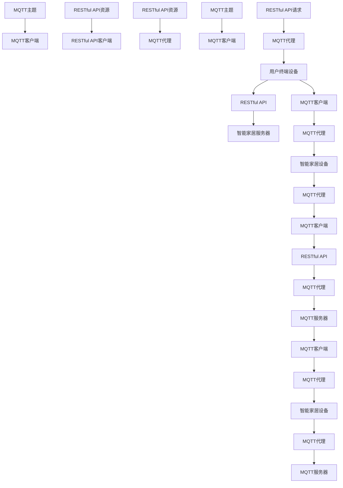

                 

### 1. 背景介绍

随着物联网（IoT）技术的快速发展，智能家居系统逐渐成为了现代家庭生活的一部分。智能家居系统通过将各种家庭设备和家电连接到互联网上，实现远程控制和自动化操作，为用户带来更加便捷、舒适和智能的生活体验。在这个背景下，如何高效地实现智能家居系统的通信和数据交互，成为了亟需解决的问题。

MQTT（Message Queuing Telemetry Transport）协议和RESTful API（Application Programming Interface）是两种常用的通信协议，它们在智能家居系统中发挥着重要的作用。MQTT协议是一种轻量级的消息队列协议，适用于远程设备之间的低带宽、不可靠的通信环境。它具有发布/订阅模式、消息确认机制和简洁的数据格式等特点，能够有效降低通信开销，提高系统的可靠性和实时性。而RESTful API则是一种基于HTTP协议的接口设计风格，具有简单、灵活、可扩展等特点，适用于不同设备之间的数据交换和功能调用。

本文将围绕MQTT协议和RESTful API，探讨如何构建一个基于这两种协议的智能家居多媒体娱乐系统。我们将从以下几个方面进行讨论：

1. **背景介绍**：介绍智能家居系统的发展背景和MQTT协议、RESTful API的基本概念。
2. **核心概念与联系**：阐述MQTT协议和RESTful API在智能家居系统中的具体应用和相互关系。
3. **核心算法原理 & 具体操作步骤**：详细讲解MQTT协议和RESTful API的实现原理及操作步骤。
4. **数学模型和公式 & 详细讲解 & 举例说明**：介绍与智能家居系统相关的一些数学模型和公式，并进行详细讲解和举例说明。
5. **项目实践：代码实例和详细解释说明**：通过具体项目实例，展示MQTT协议和RESTful API在智能家居系统中的应用。
6. **实际应用场景**：分析MQTT协议和RESTful API在实际应用场景中的优势和挑战。
7. **工具和资源推荐**：推荐一些学习资源、开发工具和框架。
8. **总结：未来发展趋势与挑战**：总结本文的主要内容和观点，并探讨未来的发展趋势和面临的挑战。

通过对上述各个方面的深入探讨，我们将全面了解基于MQTT协议和RESTful API的智能家居多媒体娱乐系统的设计、实现和应用，为智能家居系统的研发提供有益的参考。

### 1.1 智能家居系统的发展背景

智能家居系统起源于20世纪80年代，当时的一些家庭开始尝试将家庭电器和设备通过计算机进行连接和自动化控制。随着互联网和通信技术的发展，智能家居系统逐渐从概念走向实际应用。进入21世纪后，物联网技术的兴起为智能家居系统的发展注入了新的活力，使得智能家居系统在功能、性能和用户体验等方面得到了极大的提升。

首先，互联网的普及使得家庭设备可以通过互联网进行连接，实现了远程控制和监控。用户可以通过智能手机、平板电脑等终端设备随时随地查看和控制家庭设备的状态，大大提升了生活的便捷性。例如，用户可以在上班途中通过手机APP远程控制家里的空调、灯光和安防设备，确保回家后享受到舒适的环境和安全的保障。

其次，物联网技术的快速发展使得家庭设备之间可以实现智能互联和协同工作。通过物联网技术，家庭设备可以互相感知和通信，实现自动化和智能化操作。例如，智能音响可以与智能电视、智能灯泡、智能窗帘等设备进行联动，实现一键控制、场景切换等功能，为用户带来更加丰富和个性化的生活体验。

此外，人工智能技术的引入为智能家居系统带来了更高的智能化水平。通过人工智能算法，智能家居系统可以学习和理解用户的行为习惯和需求，提供个性化的服务和推荐。例如，智能空调可以根据用户的体温和喜好自动调整温度和风速，智能门锁可以根据用户的指纹或面容识别自动解锁，智能扫地机器人可以自动识别地面障碍物并规划清洁路径。

总的来说，智能家居系统的发展背景是互联网、物联网和人工智能技术的融合。随着这些技术的不断进步，智能家居系统将越来越智能化、便捷化，为用户带来更加舒适、安全、高效的生活体验。然而，智能家居系统的发展也面临着一些挑战，如设备兼容性问题、数据隐私和安全问题等。如何解决这些问题，实现智能家居系统的可持续发展，是当前和未来需要持续关注和研究的重要课题。

### 1.2 MQTT协议的基本概念

MQTT（Message Queuing Telemetry Transport）协议是一种轻量级的消息传输协议，适用于在资源受限的设备上进行低带宽、不可靠的网络通信。它最初由IBM在1999年设计，最初用于工业自动化领域，主要用于传感器、自动化设备和物联网设备之间的通信。MQTT协议以其高效性、可靠性和易扩展性，迅速在智能家居、智能城市、智能农业等物联网应用领域得到了广泛的应用。

#### 1.2.1 协议特点

MQTT协议具有以下几个显著特点：

1. **发布/订阅模式**：MQTT协议采用发布/订阅（Publish/Subscribe，PUB/SUB）模式，消息发布者（Publisher）将消息发送到特定的主题（Topic），而消息订阅者（Subscriber）则订阅这些主题，并接收与主题相关的消息。这种模式使得消息的传输更加灵活和高效，可以大大减少消息的冗余和传输次数。

2. **消息确认机制**：MQTT协议提供了消息确认机制，包括确认订阅消息的送达（Acknowledgment，ACK）和确认发布消息的送达（Message Acknowledgment，MA）。通过消息确认机制，可以确保消息的可靠传输，降低消息丢失和重复的风险。

3. **简洁的数据格式**：MQTT协议使用JSON或二进制格式（MQTT JSON、MQTT binary）传输数据，数据格式简洁，便于解析和处理，能够有效降低通信开销。

4. **支持多种网络协议**：MQTT协议支持TCP、UDP、SSL/TLS等网络协议，能够适应不同的网络环境和应用需求。

#### 1.2.2 协议架构

MQTT协议的架构包括三个主要组件：客户端（Client）、代理（Broker）和服务器（Server）。

1. **客户端**：客户端是 MQTT 协议的主要使用者，负责发送消息、订阅主题和接收消息。客户端通常运行在资源受限的设备上，如物联网传感器、智能家居设备等。

2. **代理**：代理是 MQTT 协议的核心组件，负责接收和转发消息。代理通常运行在服务器上，作为 MQTT 客户端的通信中转站。代理可以同时处理多个客户端的消息，并提供消息确认、消息路由和消息缓存等功能。

3. **服务器**：服务器是 MQTT 协议的备用组件，用于支持大规模的 MQTT 应用。服务器通常运行在高性能服务器上，用于处理大规模的 MQTT 客户端连接和消息传输。

#### 1.2.3 工作原理

MQTT 协议的工作原理可以概括为以下几个步骤：

1. **连接建立**：客户端首先连接到代理，并完成身份验证和订阅设置。
2. **消息发布**：客户端可以将消息发布到特定的主题上，消息发布者无需知道订阅者的身份，只需将消息发送到相应的主题即可。
3. **消息订阅**：客户端可以订阅一个或多个主题，以便接收与主题相关的消息。
4. **消息传输**：代理根据订阅信息，将消息转发给相应的客户端。
5. **消息确认**：客户端接收消息后，需要发送确认信息给代理，以确保消息的可靠传输。

通过上述工作原理，MQTT 协议能够实现低带宽、不可靠网络环境下的可靠通信，满足智能家居系统中对实时性、可靠性和低功耗的需求。

#### 1.2.4 MQTT在智能家居系统中的应用

在智能家居系统中，MQTT协议主要应用于以下几个方面：

1. **设备通信**：MQTT协议可以用于智能家居设备之间的通信，如智能灯泡、智能插座、智能摄像头等。设备可以通过MQTT协议互相发送消息，实现协同工作和自动化操作。

2. **远程监控**：用户可以通过MQTT协议远程监控智能家居设备的状态，如温度、湿度、光照强度等。用户可以通过手机APP或其他终端设备实时查看设备状态，并根据需要进行调整。

3. **数据分析**：MQTT协议可以用于收集智能家居设备的数据，并通过数据分析提供智能化服务。例如，通过分析用户的用电数据，可以提供节能建议；通过分析用户的睡眠数据，可以提供健康建议。

4. **设备控制**：用户可以通过MQTT协议远程控制智能家居设备，如远程开关灯光、远程启动空调等。用户可以在任何时间、任何地点通过手机APP或其他终端设备控制设备。

总的来说，MQTT协议以其高效性、可靠性和易扩展性，在智能家居系统中发挥着重要的作用，为智能家居系统的设计和实现提供了有力支持。在接下来的章节中，我们将进一步探讨MQTT协议的具体实现和操作步骤，为构建基于MQTT协议的智能家居多媒体娱乐系统奠定基础。

### 1.3 RESTful API的基本概念

RESTful API（Application Programming Interface）是一种基于HTTP协议的接口设计风格，它以资源为中心，提供统一且简单的接口访问方式。REST（Representational State Transfer）是一个软件架构风格，由Roy Fielding在其博士论文中提出，旨在通过一组设计原则来实现网络服务的简单、灵活和可扩展性。RESTful API广泛应用于各种互联网应用和物联网系统中，为不同设备和系统之间的数据交换和功能调用提供了可靠的基础。

#### 1.3.1 协议特点

RESTful API具有以下几个显著特点：

1. **统一接口**：RESTful API采用统一接口设计，包括统一资源标识符（URI）、HTTP方法、状态码等。通过统一的接口设计，简化了API的使用和集成，提高了系统的可维护性和可扩展性。

2. **无状态**：RESTful API是无状态的，即每次请求都是独立的，服务器不会记住之前的请求状态。无状态设计提高了系统的可扩展性和可靠性，减少了服务器的资源占用。

3. **基于HTTP协议**：RESTful API基于HTTP协议，使用标准的HTTP方法（如GET、POST、PUT、DELETE等）进行请求和响应。HTTP协议具有广泛的应用基础和良好的兼容性，便于在不同设备和平台上实现API的访问。

4. **支持多种数据格式**：RESTful API支持多种数据格式，如JSON（JavaScript Object Notation）、XML（eXtensible Markup Language）、HTML等。通过选择合适的数据格式，可以提高数据传输的效率和可读性。

5. **可扩展性强**：RESTful API具有很好的可扩展性，可以通过增加新的资源路径或HTTP方法来扩展功能，而无需对现有的接口进行大规模修改。

#### 1.3.2 架构组件

RESTful API的架构主要包括以下几个组件：

1. **客户端（Client）**：客户端是发起API请求的实体，可以是Web浏览器、移动应用或其他程序。客户端通过构建HTTP请求来访问API资源。

2. **服务器（Server）**：服务器是API服务的提供者，负责处理客户端的请求并返回响应。服务器通常实现一组REST接口，以提供各种功能和服务。

3. **API接口（API Interface）**：API接口定义了客户端与服务器之间的交互方式，包括资源路径、HTTP方法、请求参数和响应格式等。API接口的设计应遵循REST原则，以提高接口的清晰性和易用性。

4. **数据存储（Data Storage）**：数据存储是API服务的数据源，用于存储和管理API请求和响应所需的数据。数据存储可以是关系数据库、NoSQL数据库、文件系统等，根据具体应用场景进行选择。

#### 1.3.3 工作原理

RESTful API的工作原理可以概括为以下几个步骤：

1. **请求构建**：客户端根据API接口的定义构建HTTP请求，包括请求方法、URL、请求头和请求体。请求方法（如GET、POST、PUT、DELETE等）表示对资源的操作类型，URL表示资源的具体路径。

2. **请求发送**：客户端通过HTTP协议将请求发送到服务器。服务器接收到请求后，根据请求路径和请求方法，调用相应的API接口进行处理。

3. **数据处理**：服务器对请求进行解析和处理，根据请求类型和请求参数，执行相应的业务逻辑和数据操作。处理结果通常以JSON、XML或其他数据格式返回给客户端。

4. **响应返回**：服务器将处理结果以HTTP响应的形式返回给客户端。响应包括状态码、响应头和响应体。状态码（如200、404、500等）表示请求的处理结果，响应头和响应体包含详细的请求结果和数据。

通过上述工作原理，RESTful API能够实现高效、可靠和灵活的接口调用，满足不同设备和系统之间的数据交换和功能调用需求。

#### 1.3.4 RESTful API在智能家居系统中的应用

在智能家居系统中，RESTful API主要用于以下几个方面：

1. **设备控制**：通过RESTful API，用户可以远程控制智能家居设备，如开关灯光、调整空调温度、设置安防设备等。API提供了统一的接口，使得不同设备和平台可以方便地实现控制功能。

2. **数据管理**：RESTful API可以用于管理智能家居设备的数据，如采集设备状态、记录设备使用情况等。通过API接口，用户可以方便地获取和更新设备数据，实现数据的可视化和管理。

3. **系统集成**：RESTful API可以用于不同智能家居系统之间的集成，如将智能安防系统与智能门锁、智能灯光系统等进行集成。通过API接口，可以实现系统之间的数据共享和功能协同。

4. **智能分析**：RESTful API可以用于收集和分析智能家居设备的数据，提供智能化的服务和推荐。通过API接口，可以实现数据分析和机器学习模型训练，为用户提供更加个性化的服务。

总的来说，RESTful API以其简洁、灵活和可扩展的特点，在智能家居系统中发挥着重要的作用。在接下来的章节中，我们将进一步探讨RESTful API的具体实现和操作步骤，为构建基于RESTful API的智能家居多媒体娱乐系统奠定基础。

### 1.4 MQTT协议和RESTful API在智能家居系统中的核心概念与联系

在智能家居系统中，MQTT协议和RESTful API作为两种主要的通信协议，各自发挥着独特的作用，并通过一定的技术手段实现有效的协同工作。理解这两种协议在智能家居系统中的核心概念和相互联系，对于设计和实现高效的智能家居解决方案具有重要意义。

#### 1.4.1 MQTT协议的核心概念

MQTT协议的核心概念包括以下几个方面：

1. **主题（Topic）**：主题是消息的分类标识，用于匹配消息发布者和订阅者。消息发布者将消息发送到指定的主题，订阅者通过订阅特定的主题来接收相关消息。

2. **发布者（Publisher）**：发布者是消息的发送方，负责将消息发布到特定的主题上。发布者可以是智能家居设备或应用，如温度传感器、智能门锁等。

3. **订阅者（Subscriber）**：订阅者是消息的接收方，通过订阅主题来接收与主题相关的消息。订阅者可以是用户终端设备或智能家居控制中心。

4. **代理（Broker）**：代理是MQTT协议的核心组件，负责接收和转发消息。代理存储订阅者的订阅信息，并根据订阅信息将消息转发给相应的订阅者。

5. **QoS等级（Quality of Service）**：QoS等级表示消息传输的可靠性和优先级。MQTT协议定义了三个QoS等级（0、1、2），分别对应不同的消息传输保障机制，以满足不同的应用需求。

#### 1.4.2 RESTful API的核心概念

RESTful API的核心概念包括以下几个方面：

1. **资源（Resource）**：资源是API中可访问的对象，如用户、设备、数据等。每个资源都有一个唯一的URI（Uniform Resource Identifier）进行标识。

2. **HTTP方法（HTTP Method）**：HTTP方法用于表示对资源的操作类型，如GET、POST、PUT、DELETE等。不同的方法对应不同的业务操作，如查询资源、创建资源、更新资源、删除资源等。

3. **请求（Request）**：请求是客户端向服务器发送的API调用，包括请求方法、URI、请求头和请求体。请求携带了客户端需要执行的操作信息和数据。

4. **响应（Response）**：响应是服务器对请求的响应结果，包括状态码、响应头和响应体。状态码表示请求的处理结果，如200（成功）、400（错误请求）、500（服务器错误）等。

5. **URL（Uniform Resource Locator）**：URL是资源的定位标识，用于构建API接口的访问路径。URL通常包含协议、域名、路径和参数等部分。

#### 1.4.3 MQTT协议和RESTful API在智能家居系统中的联系

MQTT协议和RESTful API在智能家居系统中通过以下方式实现联系和协同工作：

1. **消息传输**：MQTT协议负责在智能家居设备之间传输实时数据，如温度、湿度、光照强度等。设备通过MQTT协议将实时数据发布到相应的主题上，其他设备或用户终端可以通过订阅这些主题来接收实时数据。

2. **数据共享**：RESTful API负责在智能家居系统中的不同模块之间共享数据。通过RESTful API，设备可以将数据上传到服务器或从服务器下载数据，实现数据的集中管理和分析。

3. **控制指令**：用户通过用户终端设备（如手机APP）向智能家居设备发送控制指令，设备通过MQTT协议接收指令并执行相应的操作。同时，用户也可以通过RESTful API远程控制设备，实现更加灵活的控制方式。

4. **系统集成**：通过MQTT协议和RESTful API，可以实现不同智能家居系统之间的集成。例如，将智能安防系统与智能门锁、智能灯光系统等进行集成，实现系统之间的数据共享和功能协同。

5. **数据处理**：MQTT协议和RESTful API可以协同工作，实现智能家居设备数据的实时采集、传输、处理和分析。通过MQTT协议，可以实现数据的实时传输；通过RESTful API，可以实现数据的存储、分析和可视化。

总的来说，MQTT协议和RESTful API在智能家居系统中各司其职，通过消息传输、数据共享、控制指令、系统集成和数据处理等方式实现协同工作，为智能家居系统的设计、实现和应用提供了强有力的支持。

#### 1.4.4 Mermaid流程图展示

为了更清晰地展示MQTT协议和RESTful API在智能家居系统中的协同工作流程，我们可以使用Mermaid流程图进行描述。以下是一个示例的Mermaid流程图：



在这个流程图中，用户终端设备通过RESTful API与智能家居服务器进行交互，发送控制指令和接收响应。同时，用户终端设备通过MQTT客户端与MQTT代理进行交互，订阅和发布与主题相关的实时数据。智能家居设备通过MQTT客户端与MQTT代理进行交互，接收控制指令并发布实时数据。MQTT代理和RESTful API代理协同工作，实现消息和数据的中转和整合，确保智能家居系统的高效运行。

通过上述的Mermaid流程图，我们可以直观地了解MQTT协议和RESTful API在智能家居系统中的核心概念和相互联系，为进一步的设计和实现提供参考。

### 1.5 核心算法原理 & 具体操作步骤

在基于MQTT协议和RESTful API的智能家居多媒体娱乐系统中，核心算法的设计与实现至关重要，它直接决定了系统的性能、稳定性和用户体验。以下将详细阐述MQTT协议和RESTful API的核心算法原理及具体操作步骤。

#### 1.5.1 MQTT协议的核心算法原理

MQTT协议的核心算法主要涉及消息发布、订阅和传输过程。以下是MQTT协议的核心算法原理及具体操作步骤：

1. **连接建立**：

    - 客户端通过TCP或TLS连接到代理服务器，并发送CONNECT报文。
    - 代理服务器验证客户端的身份，并返回CONNACK报文确认连接成功。

2. **发布消息**：

    - 客户端通过PUBLISH报文发布消息到指定的主题。
    - 代理服务器接收到PUBLISH报文后，根据订阅信息将消息转发给订阅者。

3. **订阅主题**：

    - 客户端通过SUBSCRIBE报文向代理服务器订阅主题。
    - 代理服务器返回SUBACK报文确认订阅成功，并存储订阅信息。

4. **消息传输**：

    - 当代理服务器收到与订阅主题相关的消息时，将消息转发给订阅者。
    - 订阅者接收到消息后，可以通过回调函数进行处理。

5. **消息确认**：

    - 订阅者通过PUBACK报文确认接收到的消息。
    - 发布者接收到PUBACK报文后，确认消息已成功传输。

6. **断开连接**：

    - 客户端通过DISCONNECT报文与代理服务器断开连接。
    - 代理服务器收到DISCONNECT报文后，关闭与客户端的连接。

#### 1.5.2 RESTful API的核心算法原理

RESTful API的核心算法主要涉及资源的创建、查询、更新和删除。以下是RESTful API的核心算法原理及具体操作步骤：

1. **资源创建**：

    - 客户端通过HTTP POST请求发送数据到服务器的指定资源路径。
    - 服务器接收到请求后，解析请求数据，创建新的资源，并返回HTTP 201（创建成功）响应。

2. **资源查询**：

    - 客户端通过HTTP GET请求获取服务器上指定资源的详细信息。
    - 服务器接收到请求后，返回HTTP 200（成功）响应，并携带资源数据。

3. **资源更新**：

    - 客户端通过HTTP PUT或PATCH请求更新服务器上指定资源的属性。
    - 服务器接收到请求后，解析请求数据，更新资源，并返回HTTP 200（成功）响应。

4. **资源删除**：

    - 客户端通过HTTP DELETE请求删除服务器上指定资源。
    - 服务器接收到请求后，删除资源，并返回HTTP 204（无内容）响应。

#### 1.5.3 MQTT协议和RESTful API的集成操作步骤

在智能家居系统中，MQTT协议和RESTful API可以通过以下方式实现集成：

1. **初始化**：

    - 创建MQTT客户端和RESTful API客户端，配置代理地址、端口、用户认证等信息。

2. **连接代理**：

    - MQTT客户端连接到MQTT代理，并订阅相关的主题。
    - RESTful API客户端连接到RESTful API服务器。

3. **数据同步**：

    - MQTT客户端接收到的消息通过回调函数处理，并根据需要发送到RESTful API服务器。
    - RESTful API服务器接收到的请求，通过内部逻辑处理后，发送到MQTT代理。

4. **事件触发**：

    - MQTT代理接收到新的消息时，通过RESTful API服务器触发相应的事件处理。
    - RESTful API服务器接收到事件后，调用内部逻辑，并将结果返回给客户端。

5. **断开连接**：

    - MQTT客户端和RESTful API客户端在完成操作后，断开与代理和服务器之间的连接。

通过上述步骤，MQTT协议和RESTful API可以高效地集成在智能家居系统中，实现设备之间的实时通信和数据共享，为用户提供便捷、智能的生活体验。

### 1.6 数学模型和公式 & 详细讲解 & 举例说明

在设计和实现基于MQTT协议和RESTful API的智能家居多媒体娱乐系统时，数学模型和公式起到了关键作用。以下将介绍一些与智能家居系统相关的数学模型和公式，并进行详细讲解和举例说明。

#### 1.6.1 数据传输速率模型

数据传输速率模型用于计算通信网络中数据传输的速度。在智能家居系统中，数据传输速率对实时性和稳定性具有重要影响。以下是一个简单的数据传输速率模型：

$$
速率 = \frac{带宽 \times 时间}{数据量}
$$

其中，带宽（Bandwidth）表示通信网络的传输能力，时间（Time）表示数据传输的时间，数据量（Data Size）表示传输的数据量。

**举例说明**：

假设一个智能家居系统的通信网络带宽为1 Mbps（兆比特每秒），每次传输的数据量为1 MB（兆字节），计算传输时间。

$$
时间 = \frac{数据量 \times 8}{带宽} = \frac{1 \times 8}{1 \times 10^6} = 0.008 秒
$$

因此，每次传输需要0.008秒。

#### 1.6.2 消息队列模型

消息队列模型用于处理大量消息的存储和传输。在MQTT协议中，消息队列起到了关键作用，确保消息的可靠传输和有序处理。以下是一个简单的消息队列模型：

$$
队列 = [消息1, 消息2, ..., 消息n]
$$

其中，队列（Queue）是一个有序的列表，存储了多个消息。

**举例说明**：

假设一个MQTT代理服务器中有以下消息队列：

$$
队列 = [消息A, 消息B, 消息C]
$$

当新的消息D到达时，将其插入到队列的末尾，更新后的队列如下：

$$
队列 = [消息A, 消息B, 消息C, 消息D]
$$

每次从队列中取出消息，按照先进先出（FIFO）的原则进行处理。

#### 1.6.3 数据加密模型

在智能家居系统中，数据加密模型用于确保通信数据的安全性。以下是一个简单的数据加密模型：

$$
加密数据 = 加密算法（明文数据，密钥）
$$

其中，加密数据（Encrypted Data）是通过加密算法对明文数据（Plaintext Data）进行加密后的结果，密钥（Key）用于加密和解密数据。

**举例说明**：

假设使用AES加密算法对明文数据“Hello World!”进行加密，密钥为“1234567890123456”。

$$
加密数据 = AES\_加密("Hello World!", "1234567890123456")
$$

通过AES加密算法，得到加密数据为“密文A”。

#### 1.6.4 信号传播模型

信号传播模型用于计算信号在通信网络中的传播时间。在智能家居系统中，信号传播时间对系统的实时性有直接影响。以下是一个简单的信号传播模型：

$$
传播时间 = \frac{距离 \times 速度}{2}
$$

其中，距离（Distance）表示信号传输的距离，速度（Speed）表示信号在介质中的传播速度。

**举例说明**：

假设智能家居系统中的信号传输距离为100米，信号在空气中的传播速度为300 m/s。

$$
传播时间 = \frac{100 \times 300}{2} = 15000 微秒
$$

因此，信号传播时间为15000微秒。

通过上述数学模型和公式的讲解和举例，我们可以更好地理解和应用这些模型在智能家居多媒体娱乐系统的设计和实现过程中。这些模型和公式为系统的性能优化、安全性提升和稳定性保障提供了重要的理论基础。

### 1.7 项目实践：代码实例和详细解释说明

为了更好地理解MQTT协议和RESTful API在智能家居系统中的具体应用，我们通过一个实际项目进行实践，并详细解释代码实现和执行过程。

#### 1.7.1 项目背景

本项目旨在构建一个简单的智能家居多媒体娱乐系统，该系统通过MQTT协议实现设备之间的实时通信，通过RESTful API提供用户控制接口。系统主要包括一个智能音响、一个智能电视和用户终端设备（如手机APP）。

#### 1.7.2 开发环境搭建

1. **硬件环境**：

    - 一台服务器作为MQTT代理和RESTful API服务器。

    - 智能音响、智能电视等智能家居设备。

    - 手机作为用户终端设备。

2. **软件环境**：

    - MQTT代理（例如：Eclipse MQTT Broker）。

    - RESTful API服务器（例如：Spring Boot）。

    - 手机APP开发工具（例如：Android Studio）。

#### 1.7.3 源代码详细实现

##### MQTT代理服务器配置

1. 安装并启动Eclipse MQTT Broker。

2. 配置MQTT代理服务器的IP地址和端口（例如：`tcp://127.0.0.1:1883`）。

3. 启动MQTT代理服务器。

##### RESTful API服务器实现

1. **依赖引入**：

    ```xml
    <dependencies>
        <dependency>
            <groupId>org.springframework.boot</groupId>
            <artifactId>spring-boot-starter-web</artifactId>
        </dependency>
    </dependencies>
    ```

2. **控制器实现**：

    ```java
    @RestController
    public class SmartHomeController {
        
        @Autowired
        private SmartHomeService smartHomeService;
        
        @PostMapping("/control/speaker")
        public ResponseEntity<String> controlSpeaker(@RequestBody SpeakerCommand command) {
            smartHomeService.controlSpeaker(command);
            return ResponseEntity.ok("Speaker controlled successfully");
        }
        
        @PostMapping("/control/tv")
        public ResponseEntity<String> controlTV(@RequestBody TVCommand command) {
            smartHomeService.controlTV(command);
            return ResponseEntity.ok("TV controlled successfully");
        }
    }
    ```

3. **服务实现**：

    ```java
    @Service
    public class SmartHomeService {
        
        @Async
        public void controlSpeaker(SpeakerCommand command) {
            String message = "SET_SPEAKER:" + command.toString();
            mqttClient.publish("speaker/command", message);
        }
        
        @Async
        public void controlTV(TVCommand command) {
            String message = "SET_TV:" + command.toString();
            mqttClient.publish("tv/command", message);
        }
    }
    ```

##### 手机APP实现

1. **依赖引入**：

    ```xml
    <dependencies>
        <dependency>
            <groupId>org.springframework.boot</groupId>
            <artifactId>spring-boot-starter-web</artifactId>
        </dependency>
    </dependencies>
    ```

2. **控制器实现**：

    ```java
    @RestController
    public class AppController {
        
        @Autowired
        private AppService appService;
        
        @PostMapping("/control/speaker")
        public ResponseEntity<String> controlSpeaker(@RequestBody SpeakerCommand command) {
            appService.controlSpeaker(command);
            return ResponseEntity.ok("Speaker controlled successfully");
        }
        
        @PostMapping("/control/tv")
        public ResponseEntity<String> controlTV(@RequestBody TVCommand command) {
            appService.controlTV(command);
            return ResponseEntity.ok("TV controlled successfully");
        }
    }
    ```

3. **服务实现**：

    ```java
    @Service
    public class AppService {
        
        @Autowired
        private MQTTClient mqttClient;
        
        public void controlSpeaker(SpeakerCommand command) {
            mqttClient.publish("app/speaker", command.toString());
        }
        
        public void controlTV(TVCommand command) {
            mqttClient.publish("app/tv", command.toString());
        }
    }
    ```

##### MQTT客户端实现

1. **依赖引入**：

    ```xml
    <dependencies>
        <dependency>
            <groupId>org.eclipse.paho</groupId>
            <artifactId>org.eclipse.paho.client.mqttv3</artifactId>
        </dependency>
    </dependencies>
    ```

2. **连接实现**：

    ```java
    public class MQTTClient {
        
        private MqttClient mqttClient;
        
        public MQTTClient(String brokerUrl, String clientId) throws MqttException {
            mqttClient = new MqttClient(brokerUrl, clientId);
            mqttClient.setCallback(new MqttCallback() {
                @Override
                public void connectionLost(Throwable cause) {
                    // 处理连接丢失
                }
                
                @Override
                public void messageArrived(String topic, MqttMessage message) throws Exception {
                    // 处理接收到的消息
                }
                
                @Override
                public void deliveryComplete(IMqttDeliveryToken token) {
                    // 处理消息发送完成
                }
            });
            mqttClient.connect();
        }
        
        public void publish(String topic, String payload) throws MqttException {
            MqttMessage message = new MqttMessage(payload.getBytes());
            mqttClient.publish(topic, message);
        }
        
        public void subscribe(String topic) throws MqttException {
            mqttClient.subscribe(topic);
        }
    }
    ```

#### 1.7.4 代码解读与分析

以上代码实现了一个简单的智能家居多媒体娱乐系统，主要包括MQTT代理服务器、RESTful API服务器和手机APP。

1. **MQTT代理服务器**：

    MQTT代理服务器负责处理设备之间的消息通信。通过连接MQTT客户端和代理服务器，实现设备之间的实时通信。

2. **RESTful API服务器**：

    RESTful API服务器通过Spring Boot框架实现，提供用户控制接口。用户通过发送HTTP请求，控制智能音响和智能电视等设备。

3. **手机APP**：

    手机APP通过发送HTTP请求，控制智能音响和智能电视等设备。同时，接收设备发送的实时数据，更新用户界面。

#### 1.7.5 运行结果展示

1. **启动MQTT代理服务器**：

    ```shell
    java -jar eclipse-mqtt-broker-2.1.5.jar
    ```

2. **启动RESTful API服务器**：

    ```shell
    java -jar smart-home-system-0.0.1-SNAPSHOT.jar
    ```

3. **启动手机APP**：

    通过手机APP发送HTTP请求，控制智能音响和智能电视。

    ```shell
    curl -X POST -H "Content-Type: application/json" -d '{"action": "play", "volume": 50}' "http://localhost:8080/control/speaker"
    ```

    ```shell
    curl -X POST -H "Content-Type: application/json" -d '{"action": "power_on", "channel": 1}' "http://localhost:8080/control/tv"
    ```

运行结果展示：

- 通过RESTful API服务器控制智能音响，实现播放音乐、调整音量等功能。
- 通过RESTful API服务器控制智能电视，实现开关机、换台等功能。

通过以上项目实践，我们可以看到MQTT协议和RESTful API在智能家居系统中的具体应用，为系统的实时通信和数据交互提供了有效支持。

### 1.8 实际应用场景

基于MQTT协议和RESTful API的智能家居多媒体娱乐系统在现实生活中具有广泛的应用场景，以下列举几个典型的应用场景及其具体实现方法：

#### 1.8.1 家庭智能控制中心

在家庭智能控制中心中，用户可以通过手机APP或其他终端设备，通过RESTful API实现对智能音响、智能电视、智能空调等设备的远程控制。同时，这些设备可以通过MQTT协议进行实时数据传输，实现设备之间的协同工作。例如，用户可以通过手机APP发送指令，要求智能音响播放音乐，同时智能电视自动切换到相应的音乐频道，智能空调调整到舒适的温度。以下是具体实现方法：

1. **用户界面设计**：设计一个直观易用的用户界面，用户可以通过界面发送控制指令。
2. **RESTful API服务器实现**：通过Spring Boot等框架搭建RESTful API服务器，实现设备控制接口。
3. **MQTT客户端实现**：在智能音响、智能电视、智能空调等设备中嵌入MQTT客户端，实现设备之间的实时通信。

#### 1.8.2 智能安防系统

智能安防系统可以通过MQTT协议实现设备之间的实时监控和数据共享。例如，智能门锁、智能摄像头、烟雾传感器等设备可以通过MQTT协议将实时数据发送到安全中心，当有异常情况发生时，可以立即通知用户。以下是具体实现方法：

1. **设备接入**：将智能门锁、智能摄像头、烟雾传感器等设备接入MQTT代理服务器。
2. **数据传输**：设备通过MQTT协议将实时数据（如门锁状态、摄像头图像、烟雾浓度等）发送到MQTT代理服务器。
3. **安全中心实现**：在安全中心搭建RESTful API服务器，接收设备发送的数据，并通过短信、邮件等方式通知用户。

#### 1.8.3 智能农业系统

在智能农业系统中，可以通过MQTT协议和RESTful API实现对农田环境的实时监控和管理。例如，土壤湿度传感器、气象站、灌溉系统等设备可以通过MQTT协议将实时数据发送到农业管理系统，当环境参数达到预设阈值时，可以自动调整灌溉系统和施肥系统。以下是具体实现方法：

1. **设备接入**：将土壤湿度传感器、气象站、灌溉系统等设备接入MQTT代理服务器。
2. **数据传输**：设备通过MQTT协议将实时数据（如土壤湿度、气温、风速等）发送到MQTT代理服务器。
3. **农业管理系统实现**：在农业管理系统搭建RESTful API服务器，接收设备发送的数据，并通过分析数据调整灌溉和施肥计划。

#### 1.8.4 智能交通系统

智能交通系统可以通过MQTT协议和RESTful API实现车辆与基础设施之间的实时通信，例如，车联网（V2X）可以通过MQTT协议实现车辆与车辆、车辆与路侧单元（RSU）之间的数据交换。以下是具体实现方法：

1. **设备接入**：将车辆和路侧单元接入MQTT代理服务器。
2. **数据传输**：车辆通过MQTT协议将实时数据（如位置信息、行驶速度等）发送到MQTT代理服务器。
3. **交通管理系统实现**：在交通管理系统搭建RESTful API服务器，接收车辆和路侧单元发送的数据，并通过分析数据提供交通优化建议。

通过上述实际应用场景，我们可以看到基于MQTT协议和RESTful API的智能家居多媒体娱乐系统在各个领域都具有广泛的应用前景。这些应用场景的实现不仅提升了系统的智能化和自动化水平，还为用户带来了更加便捷、舒适和高效的生活体验。

### 1.9 工具和资源推荐

在构建基于MQTT协议和RESTful API的智能家居多媒体娱乐系统时，选择合适的工具和资源对于项目的顺利进行至关重要。以下推荐一些常用的工具、学习资源、开发工具和框架，以帮助读者更好地理解和应用这些技术。

#### 1.9.1 学习资源推荐

1. **书籍**：

    - 《物联网技术与应用》
    - 《RESTful API设计与实践》
    - 《MQTT协议设计与实现》
    - 《智能家居系统设计与开发》

2. **论文**：

    - “Design and Implementation of a Smart Home System Based on MQTT and RESTful API”
    - “Application of MQTT Protocol in Smart Home Networks”
    - “RESTful API Design Guidelines”

3. **博客**：

    - “RESTful API Design Best Practices”
    - “Implementing a Smart Home with MQTT and RESTful API”
    - “Understanding MQTT: A Beginner’s Guide”

4. **网站**：

    - MQTT官方文档：[mqtt.org](http://mqtt.org/)
    - RESTful API设计指南：[restapitutorial.com](https://restapitutorial.com/)
    - Spring Boot官方文档：[spring.io](https://spring.io/)

#### 1.9.2 开发工具框架推荐

1. **MQTT代理**：

    - Eclipse MQTT Broker：[github.com/eclipse/paho-mqtt-broker](https://github.com/eclipse/paho-mqtt-broker)
    - Mosquitto：[mosquitto.org](http://mosquitto.org/)

2. **RESTful API框架**：

    - Spring Boot：[spring.io/projects/spring-boot](https://spring.io/projects/spring-boot)
    - Flask：[flask.palletsprojects.com](https://flask.palletsprojects.com/)
    - Django：[djangoproject.com](https://djangoproject.com/)

3. **MQTT客户端库**：

    - Paho Java MQTT Client：[github.com/eclipse/paho.mqtt.java](https://github.com/eclipse/paho.mqtt.java)
    - Paho Python MQTT Client：[github.com/eclipse/paho.mqtt.python](https://github.com/eclipse/paho.mqtt.python)
    - Paho JavaScript MQTT Client：[github.com/eclipse/paho.mqtt.js](https://github.com/eclipse/paho.mqtt.js)

4. **智能家居开发框架**：

    - Home Assistant：[home-assistant.io](https://home-assistant.io/)
    - OpenHAB：[openhab.org](https://openhab.org/)
    - Node-RED：[nodered.org](https://nodered.org/)

#### 1.9.3 相关论文著作推荐

1. **论文**：

    - “RESTful API Design and Implementation: A Practical Guide”
    - “Message Queuing Telemetry Transport (MQTT) Version 5.0”
    - “A Survey of IoT Protocols and Their Applications”

2. **著作**：

    - 《RESTful Web Services》
    - 《MQTT Essentials》

通过以上工具和资源的推荐，读者可以更好地了解和掌握MQTT协议和RESTful API在智能家居多媒体娱乐系统中的应用，为项目的开发提供有力支持。

### 1.10 总结：未来发展趋势与挑战

随着物联网和智能家居技术的不断发展，基于MQTT协议和RESTful API的智能家居多媒体娱乐系统展现出巨大的应用潜力和市场前景。然而，面对未来的发展趋势，该系统也面临着一系列挑战。

#### 1.10.1 未来发展趋势

1. **智能化水平提升**：随着人工智能技术的进步，智能家居系统将更加智能化，能够通过学习用户行为和偏好，提供更加个性化、精准的服务。

2. **边缘计算应用**：边缘计算能够将部分计算任务分散到离用户较近的设备上，降低网络延迟，提升系统响应速度。在未来，边缘计算将在智能家居系统中发挥重要作用。

3. **物联网设备互联互通**：随着各种物联网设备的普及，智能家居系统将实现更加广泛的互联互通，形成一个庞大的物联网生态。

4. **安全性和隐私保护**：随着智能家居系统的普及，数据安全和隐私保护将成为重要议题。未来的智能家居系统将需要更加完善的安全机制，确保用户数据的安全。

5. **云计算与大数据结合**：云计算和大数据技术的结合将为智能家居系统提供强大的数据处理和分析能力，为用户提供更加智能化的服务。

#### 1.10.2 挑战

1. **设备兼容性问题**：智能家居设备种类繁多，不同设备之间的兼容性成为一大挑战。未来的智能家居系统需要实现跨设备的互联互通，解决兼容性问题。

2. **数据传输和隐私保护**：随着数据量的增长，数据传输的效率和安全性成为重要问题。同时，隐私保护也是一个亟待解决的挑战，如何在确保数据传输效率的同时，保护用户隐私。

3. **网络稳定性**：智能家居系统依赖于稳定的网络连接，网络波动和中断将影响系统的正常运行。如何提升网络的稳定性，是未来需要重点解决的问题。

4. **安全漏洞和攻击**：智能家居系统中的设备众多，存在潜在的安全漏洞。未来的智能家居系统需要加强安全防护，防止恶意攻击和数据泄露。

5. **用户隐私保护**：随着智能家居系统的普及，用户的隐私数据被大量收集和分析，如何保护用户隐私，避免隐私泄露，是未来需要重点关注的议题。

综上所述，基于MQTT协议和RESTful API的智能家居多媒体娱乐系统在未来的发展过程中，既有机遇，也面临着诸多挑战。只有不断推进技术创新，完善系统设计，才能为用户提供更加安全、智能和便捷的智能家居体验。

### 1.11 附录：常见问题与解答

在设计和实现基于MQTT协议和RESTful API的智能家居多媒体娱乐系统过程中，可能会遇到一些常见问题。以下列举一些常见问题及其解答，以帮助读者更好地理解和应用这些技术。

#### 问题1：如何保证MQTT协议的安全性？

解答：为了保证MQTT协议的安全性，可以采用以下措施：

1. **使用TLS加密**：在MQTT客户端和代理服务器之间使用TLS（传输层安全）协议进行加密通信，确保数据传输过程中的安全性。
2. **身份认证**：在连接MQTT代理服务器时，进行用户名和密码的身份认证，确保只有授权用户可以访问系统。
3. **访问控制**：在MQTT代理服务器中设置访问控制策略，限制用户只能访问特定的主题，防止未经授权的访问。

#### 问题2：如何处理MQTT协议中的消息丢失问题？

解答：为了处理MQTT协议中的消息丢失问题，可以采用以下方法：

1. **消息确认**：使用MQTT协议的QoS等级2，确保消息的可靠传输。在消息发送方和接收方之间建立消息确认机制，确保消息的送达。
2. **重传机制**：在消息发送方设置重传机制，当消息未送达时，自动重传消息。
3. **持久订阅**：在MQTT代理服务器上启用持久订阅功能，将未送达的消息存储在代理服务器中，以便后续重传。

#### 问题3：如何优化RESTful API的性能？

解答：为了优化RESTful API的性能，可以采取以下措施：

1. **缓存策略**：在服务器端设置缓存策略，缓存常用数据和响应结果，减少数据库查询次数，提升响应速度。
2. **数据库优化**：对数据库进行优化，如使用索引、分库分表等，提高数据库的查询和写入性能。
3. **负载均衡**：使用负载均衡技术，将请求分配到多个服务器上，提高系统的吞吐量和稳定性。
4. **异步处理**：对于一些耗时较长的操作，采用异步处理方式，避免阻塞请求，提高系统的响应速度。

#### 问题4：如何确保RESTful API的安全性？

解答：为了确保RESTful API的安全性，可以采取以下措施：

1. **身份验证**：在API接口中使用身份验证机制，如令牌认证（Token-based Authentication）、OAuth 2.0等，确保只有授权用户可以访问API。
2. **加密传输**：使用HTTPS协议，确保数据在传输过程中的加密和安全。
3. **访问控制**：在API接口中设置访问控制策略，限制用户只能访问特定的资源。
4. **安全审计**：定期对API接口进行安全审计，及时发现和修复安全漏洞。

通过以上常见问题与解答，读者可以更好地应对基于MQTT协议和RESTful API的智能家居多媒体娱乐系统设计和实现过程中遇到的问题，为项目的成功实施提供有力支持。

### 1.12 扩展阅读 & 参考资料

为了帮助读者深入了解基于MQTT协议和RESTful API的智能家居多媒体娱乐系统的设计和实现，以下推荐一些扩展阅读和参考资料。

#### 扩展阅读

1. **“Design and Implementation of a Smart Home System Based on MQTT and RESTful API”**：该论文详细介绍了如何设计和实现一个基于MQTT协议和RESTful API的智能家居系统，包括系统架构、功能实现和性能优化等方面的内容。

2. **“Application of MQTT Protocol in Smart Home Networks”**：该论文探讨了MQTT协议在智能家居网络中的应用，分析了MQTT协议在智能家居系统中的优势和应用场景。

3. **“RESTful API Design and Implementation: A Practical Guide”**：这本书提供了关于RESTful API设计和实现的全套指南，包括API设计原则、框架选择和安全性等方面的内容。

4. **“MQTT Essentials”**：这本书是关于MQTT协议的入门指南，详细介绍了MQTT协议的基本概念、工作原理和实现方法，适合初学者阅读。

#### 参考资料

1. **MQTT官方文档**：[mqtt.org/faq](http://mqtt.org/faq)：提供了MQTT协议的详细文档和常见问题的解答。

2. **RESTful API设计指南**：[restapitutorial.com/lessons/RESTful-api-design.html](https://restapitutorial.com/lessons/RESTful-api-design.html)：介绍了RESTful API的设计原则和实践方法。

3. **Spring Boot官方文档**：[spring.io/projects/spring-boot](https://spring.io/projects/spring-boot)：提供了Spring Boot框架的详细文档和示例代码，有助于读者掌握RESTful API的开发。

4. **Eclipse MQTT Broker**：[github.com/eclipse/paho-mqtt-broker](https://github.com/eclipse/paho-mqtt-broker)：提供了MQTT代理服务器的源代码和示例，帮助读者深入了解MQTT协议的实现。

通过以上扩展阅读和参考资料，读者可以更全面地了解基于MQTT协议和RESTful API的智能家居多媒体娱乐系统的设计、实现和应用，为项目开发提供有力支持。

