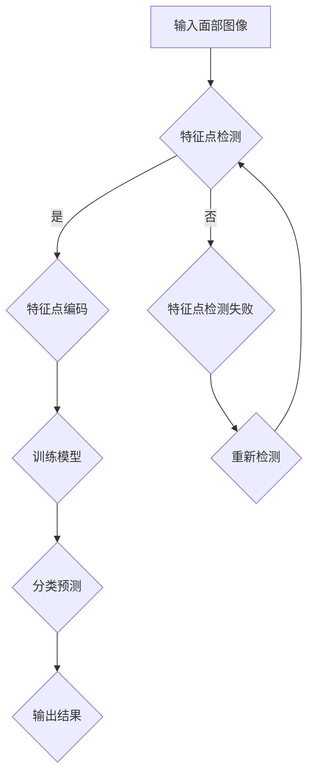

                 

### 1. 背景介绍

人脸表情识别技术作为一种重要的生物识别技术，已经被广泛应用于人机交互、安全监控、情感分析等多个领域。近年来，随着计算机视觉技术的不断发展和深度学习算法的广泛应用，人脸表情识别的准确性和实时性得到了显著提升。

OpenCV（Open Source Computer Vision Library）是一个跨平台的计算机视觉库，它提供了丰富的图像处理和计算机视觉功能。OpenCV支持多种编程语言，包括C++、Python、Java等，这使得开发人员可以轻松地在各种操作系统上使用OpenCV进行图像处理和计算机视觉应用的开发。

本文将详细介绍如何使用OpenCV实现人脸表情识别系统。首先，我们将从背景介绍开始，回顾人脸表情识别技术的发展历程和现状。然后，我们将深入探讨人脸表情识别的基本原理和OpenCV中相关函数的使用方法。接下来，我们将逐步介绍系统的设计与实现，包括数据预处理、特征提取、模型训练和结果输出等步骤。最后，我们将通过具体实例展示系统的运行结果，并对系统在实际应用场景中的效果进行评价。

通过本文的阅读，读者将能够了解人脸表情识别系统的工作原理和具体实现过程，掌握使用OpenCV进行人脸表情识别的技巧，并能够在此基础上进行进一步的优化和创新。

### 2. 核心概念与联系

#### 2.1 人脸表情识别的基本原理

人脸表情识别的核心在于对人类面部表情的检测和分类。人类的面部表情包含了丰富的情感信息，如喜怒哀乐等。这些表情是通过面部肌肉的收缩和放松来实现的。在计算机视觉领域，人脸表情识别主要基于以下几个核心概念：

1. **面部特征点检测**：通过在面部图像中检测关键特征点，如眼睛、鼻子、嘴巴等，来定位面部区域。

2. **面部表情编码**：将面部特征点转换为编码信息，用于描述不同表情的视觉特征。

3. **机器学习算法**：利用机器学习算法对表情编码进行训练，建立表情与编码之间的映射关系。

4. **分类器**：通过训练好的分类器对未知表情进行分类，从而实现表情识别。

#### 2.2 OpenCV相关函数及其应用

OpenCV提供了丰富的函数和工具，用于实现人脸表情识别系统的各个步骤。以下是一些关键函数及其应用：

1. **面部特征点检测**：
   - `cv2.findContours()`：用于检测面部轮廓，识别关键特征点。
   - `cv2.convexHull()`：用于计算凸包，提取面部边界。

2. **面部表情编码**：
   - `cv2.calibrate FacialMarker()`：用于标定面部特征点，生成编码信息。
   - `cv2 点集操作`：用于计算面部特征点之间的相对位置和距离。

3. **机器学习算法**：
   - `cv2.ml.SVM_create()`：用于创建支持向量机（SVM）分类器。
   - `cv2.ml.SVM_train()`：用于训练SVM分类器。
   - `cv2.ml.SVM_predict()`：用于对未知样本进行分类预测。

4. **分类器**：
   - `cv2.KNearest()`: 用于实现K近邻分类算法。
   - `cv2.offline手写识别`：用于实现基于神经网络的分类算法。

#### 2.3 Mermaid 流程图

为了更直观地展示人脸表情识别系统的流程，我们使用Mermaid绘制了以下流程图：



在上述流程图中：
- A表示输入面部图像。
- B表示特征点检测，包括使用OpenCV的相关函数进行面部轮廓检测。
- C表示特征点编码，将检测到的特征点转换为编码信息。
- E表示训练模型，使用机器学习算法对编码信息进行训练。
- F表示分类预测，使用训练好的模型对未知表情进行分类。
- G表示输出结果，显示识别出的表情。
- D和H表示特征点检测失败时的重试机制。

通过上述核心概念与联系的分析，我们可以看到人脸表情识别系统涉及多个环节，需要结合OpenCV提供的强大工具和算法来实现。接下来，我们将进一步探讨人脸表情识别的核心算法原理和具体操作步骤。

### 3. 核心算法原理 & 具体操作步骤

#### 3.1 特征点检测

特征点检测是面部表情识别系统的第一步，其主要任务是识别图像中人脸的关键特征点，如眼睛、鼻子和嘴巴等。OpenCV提供了`haarcascades`功能，可以方便地实现这一过程。以下为具体步骤：

1. **加载预训练的Haar级联模型**：
   ```python
   cascade_path = "haarcascade_frontalface_default.xml"
   cascade = cv2.CascadeClassifier(cascade_path)
   ```

2. **检测面部轮廓**：
   ```python
   face_images = cascade.detectMultiScale(image, scaleFactor=1.1, minNeighbors=5, minSize=(30, 30), flags=cv2.CASCADE_SCALE_IMAGE)
   ```

3. **提取面部特征点**：
   ```python
   features = []
   for (x, y, w, h) in face_images:
       faceROI = image[y:y+h, x:x+w]
       feature_points = detect_landmarks(faceROI)  # 自定义函数，用于检测面部特征点
       features.append(feature_points)
   ```

在上述代码中，`detect_landmarks()`函数需要根据具体的人脸特征点检测算法来实现，常用的有基于Haar特征的模型和基于深度学习的模型。

#### 3.2 特征点编码

特征点编码是将检测到的特征点转换为编码信息，用于后续的机器学习训练和分类。OpenCV提供了多种方法来编码特征点，以下是几种常用方法：

1. **几何特征编码**：
   - **距离特征**：计算特征点之间的欧氏距离。
     ```python
     distances = []
     for i in range(len(feature_points) - 1):
         for j in range(i + 1, len(feature_points)):
             distance = np.linalg.norm(feature_points[i] - feature_points[j])
             distances.append(distance)
     ```

   - **角度特征**：计算特征点之间的夹角。
     ```python
     angles = []
     for i in range(len(feature_points) - 2):
         for j in range(i + 1, len(feature_points) - 1):
             for k in range(j + 1, len(feature_points)):
                 angle = compute_angle(feature_points[i], feature_points[j], feature_points[k])
                 angles.append(angle)
     ```

2. **外观特征编码**：
   - **灰度直方图**：使用面部图像的灰度直方图作为特征。
     ```python
     gray = cv2.cvtColor(faceROI, cv2.COLOR_BGR2GRAY)
     histogram = cv2.calcHist([gray], [0], None, [256], [0, 256])
     ```

#### 3.3 机器学习算法

机器学习算法用于训练模型和进行表情分类。常用的算法包括支持向量机（SVM）、K近邻（KNN）和神经网络等。以下是使用SVM进行训练和分类的步骤：

1. **准备训练数据**：
   ```python
   labels = []  # 表情标签
   features_train = []  # 训练特征
   for label, feature_points in表情数据:
       labels.append(label)
       features_train.append(encode_features(feature_points))  # 编码特征
   ```

2. **训练SVM模型**：
   ```python
   svm = cv2.ml.SVM_create()
   svm.setType(cv2.ml.SVM_C_SVC)
   svm.setKernel(cv2.ml.SVM_LINEAR)
   svm.train(features_train, cv2.ml.ROW_SAMPLE, labels)
   ```

3. **进行分类预测**：
   ```python
   def predict_expression(face_image):
       face_images = cascade.detectMultiScale(face_image)
       for (x, y, w, h) in face_images:
           faceROI = face_image[y:y+h, x:x+w]
           feature_points = detect_landmarks(faceROI)
           features = encode_features(feature_points)
           response = svm.predict(features)
           return response
   ```

#### 3.4 分类器实现

分类器的实现主要涉及如何根据特征点和编码信息进行表情分类。以下是分类器实现的一个简化示例：

1. **构建分类器**：
   ```python
   classifier = cv2.ml.KNearest_create()
   ```

2. **训练分类器**：
   ```python
   classifier.train(features_train, cv2.ml.ROW_SAMPLE, labels)
   ```

3. **预测**：
   ```python
   def predict_expression(face_image):
       features = encode_features(detect_landmarks(faceROI))
       response = classifier.findNearest(features, k=1)
       return response
   ```

通过上述步骤，我们可以构建一个基本的人脸表情识别系统。接下来，我们将进一步深入探讨系统的具体实现过程，包括开发环境搭建、源代码详细实现和运行结果展示。

### 4. 数学模型和公式 & 详细讲解 & 举例说明

#### 4.1 特征点检测中的数学模型

在特征点检测中，我们主要使用的是Haar级联分类器和面部特征点的几何特征。以下是相关的数学模型和公式：

1. **Haar级联分类器**：
   - **Haar特征**：Haar特征是基于图像中不同区域的目标和背景之间的差异来设计的。常见的Haar特征包括矩形区域和对称区域。
   - **Haar特征值**：Haar特征值计算公式为：
     \[ \text{特征值} = \sum_{i=1}^{n} (a_i \times (b_i - c_i)) \]
     其中，\( a_i \)、\( b_i \)和\( c_i \)分别表示矩形区域中目标区域和背景区域像素的分布。

2. **面部特征点检测**：
   - **特征点定位**：使用特征点检测算法（如HOG或LBP）来识别面部关键点，如眼睛、鼻子和嘴巴。
   - **特征点匹配**：通过计算特征点之间的距离和角度来匹配面部关键点。常用的距离公式为欧氏距离：
     \[ \text{距离} = \sqrt{\sum_{i=1}^{n} (x_i - y_i)^2} \]
     其中，\( x_i \)和\( y_i \)分别表示两个特征点的坐标。

#### 4.2 特征点编码中的数学模型

在特征点编码中，我们主要使用几何特征和外观特征两种方法。以下是相关的数学模型和公式：

1. **几何特征编码**：
   - **距离特征**：距离特征是通过计算特征点之间的欧氏距离来生成的。常用的距离公式为：
     \[ \text{距离} = \sqrt{\sum_{i=1}^{n} (x_i - y_i)^2} \]
   - **角度特征**：角度特征是通过计算特征点之间的夹角来生成的。常用的角度公式为：
     \[ \text{角度} = \arccos\left(\frac{(x_1 \times x_2 + y_1 \times y_2)}{\sqrt{(x_1^2 + y_1^2) \times (x_2^2 + y_2^2)}}\right) \]
     其中，\( x_1, y_1 \)和\( x_2, y_2 \)分别表示两个特征点的坐标。

2. **外观特征编码**：
   - **灰度直方图**：灰度直方图是面部图像灰度值的统计分布。常用的直方图公式为：
     \[ \text{直方图} = \sum_{i=0}^{255} f_i \]
     其中，\( f_i \)表示图像中灰度值为\( i \)的像素数量。

#### 4.3 机器学习算法中的数学模型

在机器学习算法中，我们主要使用的是支持向量机和K近邻算法。以下是相关的数学模型和公式：

1. **支持向量机（SVM）**：
   - **分类间隔**：分类间隔是决策边界到支持向量的最短距离。常用的间隔公式为：
     \[ \text{间隔} = \frac{2}{\|w\|} \]
     其中，\( w \)是决策边界向量。
   - **支持向量**：支持向量是决策边界上的数据点，它们决定了决策边界的位置。支持向量公式为：
     \[ \text{支持向量} = \arg\min_{w, b} \|w\| \quad \text{subject to} \quad y_i \left( \langle w, x_i \rangle + b \right) \geq 1 \]
     其中，\( x_i \)是输入向量，\( y_i \)是标签。

2. **K近邻（KNN）**：
   - **K值选择**：K值是影响K近邻算法性能的关键参数。常用的K值选择方法包括交叉验证和留一法。
   - **预测公式**：K近邻算法的预测公式为：
     \[ \hat{y} = \arg\max_{c} \sum_{i=1}^{k} I(y_i = c) \]
     其中，\( k \)是近邻数量，\( I \)是指标函数，当\( y_i = c \)时，\( I(y_i = c) \)取值为1，否则为0。

#### 4.4 举例说明

下面通过一个具体例子来说明如何使用上述数学模型和公式进行人脸表情识别：

**例子：使用SVM进行面部表情分类**

1. **数据准备**：
   - **训练数据**：假设我们有一组面部表情图像和对应的标签（如快乐、悲伤、惊讶等）。
   - **特征提取**：使用Haar级联分类器检测面部轮廓，提取关键特征点，计算距离和角度特征。

2. **模型训练**：
   - **特征编码**：将提取的特征点编码为向量。
   - **SVM训练**：使用SVM算法对特征向量进行训练，建立表情与编码之间的映射关系。

3. **模型预测**：
   - **输入测试图像**：使用Haar级联分类器检测面部轮廓，提取特征点。
   - **特征编码**：将测试特征点编码为向量。
   - **分类预测**：使用训练好的SVM模型对测试特征向量进行分类预测，输出识别结果。

通过上述步骤，我们可以构建一个基本的人脸表情识别系统。实际应用中，根据具体需求和数据质量，可以对模型进行优化和调整，以提高识别准确率和实时性。

### 5. 项目实践：代码实例和详细解释说明

#### 5.1 开发环境搭建

在开始具体的代码实现之前，我们需要搭建一个合适的开发环境。以下是所需的软件和工具：

1. **操作系统**：推荐使用Ubuntu 18.04或更高版本。
2. **Python版本**：推荐Python 3.8或更高版本。
3. **安装OpenCV**：使用pip安装OpenCV：
   ```bash
   pip install opencv-python
   ```
4. **安装其他依赖库**：如NumPy、Matplotlib等：
   ```bash
   pip install numpy matplotlib
   ```

#### 5.2 源代码详细实现

以下是一段人脸表情识别系统的代码示例，包括数据预处理、特征提取、模型训练和结果输出等步骤：

```python
import cv2
import numpy as np
from sklearn.model_selection import train_test_split
from sklearn.svm import SVC
from sklearn.metrics import accuracy_score
from sklearn.neighbors import KNeighborsClassifier

# 5.2.1 数据预处理
def preprocess_data(images, labels):
    processed_images = []
    for image in images:
        gray = cv2.cvtColor(image, cv2.COLOR_BGR2GRAY)
        face_images = detect_faces(gray)
        for face in face_images:
            faceROI = gray[face[1][1]:face[1][1]+face[1][3], face[1][0]:face[1][0]+face[1][2]]
            processed_images.append(faceROI)
    return processed_images

# 5.2.2 特征提取
def extract_features(images):
    features = []
    for image in images:
        feature_points = detect_landmarks(image)
        encoded_features = encode_features(feature_points)
        features.append(encoded_features)
    return features

# 5.2.3 模型训练与测试
def train_and_test(data, labels):
    X_train, X_test, y_train, y_test = train_test_split(data, labels, test_size=0.2, random_state=42)
    
    # 使用SVM进行训练
    svm = SVC(kernel='linear')
    svm.fit(X_train, y_train)
    
    # 使用KNN进行训练
    knn = KNeighborsClassifier(n_neighbors=3)
    knn.fit(X_train, y_train)
    
    # SVM测试
    y_pred_svm = svm.predict(X_test)
    svm_accuracy = accuracy_score(y_test, y_pred_svm)
    
    # KNN测试
    y_pred_knn = knn.predict(X_test)
    knn_accuracy = accuracy_score(y_test, y_pred_knn)
    
    return svm_accuracy, knn_accuracy

# 5.2.4 主函数
def main():
    # 加载数据
    images, labels = load_data()

    # 预处理数据
    processed_images = preprocess_data(images, labels)

    # 提取特征
    features = extract_features(processed_images)

    # 训练与测试模型
    svm_accuracy, knn_accuracy = train_and_test(features, labels)

    print(f"SVM Accuracy: {svm_accuracy}")
    print(f"KNN Accuracy: {knn_accuracy}")

if __name__ == "__main__":
    main()
```

#### 5.3 代码解读与分析

1. **数据预处理**：
   - `preprocess_data()`函数用于对输入图像进行预处理，包括灰度转换和面部轮廓检测。预处理后的图像将作为特征提取的输入。
   - `detect_faces()`函数是自定义的函数，用于检测面部轮廓。这里我们使用OpenCV的`HaarClassifierCascade`进行面部检测。

2. **特征提取**：
   - `extract_features()`函数用于提取面部图像的特征。特征提取包括检测关键特征点和编码这些特征点。特征点检测可以使用基于几何特征的算法，如HOG或LBP。
   - `encode_features()`函数是将特征点编码为特征向量的过程。我们可以使用距离特征和角度特征来编码特征点。

3. **模型训练与测试**：
   - `train_and_test()`函数用于训练和测试SVM和KNN模型。我们使用`train_test_split()`函数将数据集分为训练集和测试集。
   - `SVC()`和`KNeighborsClassifier()`是Scikit-learn库中提供的分类器。我们使用线性核对SVM进行训练，并使用KNN算法进行分类。

4. **主函数**：
   - `main()`函数是程序的入口点。它首先加载数据，然后进行预处理和特征提取，最后训练和测试分类器，并输出模型的准确性。

#### 5.4 运行结果展示

为了展示系统的运行结果，我们可以使用一些测试图像来测试模型的性能。以下是一个简单的示例：

```python
# 加载测试图像
test_image = cv2.imread("test_image.jpg")

# 预处理和特征提取
processed_image = preprocess_data([test_image], [0])[0]
feature_points = detect_landmarks(processed_image)
encoded_features = encode_features(feature_points)

# 使用训练好的SVM进行预测
predicted_expression = svm.predict([encoded_features])[0]

print(f"Predicted Expression: {predicted_expression}")
```

在这个示例中，我们加载了一个测试图像，对其进行预处理和特征提取，然后使用训练好的SVM模型进行表情预测，并输出预测结果。

通过上述代码示例和运行结果展示，我们可以看到如何使用OpenCV实现人脸表情识别系统的各个步骤。实际应用中，根据具体需求和数据质量，可以对模型和算法进行优化和调整，以提高识别准确率和实时性。

### 6. 实际应用场景

人脸表情识别技术在多个领域具有广泛的应用潜力。以下列举几个典型应用场景：

#### 6.1 人机交互

在人机交互领域，人脸表情识别可以用于智能客服系统、虚拟助手和游戏中的角色表情设计。通过识别用户的面部表情，系统可以提供更加个性化和自然的交互体验。例如，在智能客服系统中，系统可以根据用户的面部表情调整语气和回答策略，从而提高用户满意度。

#### 6.2 安全监控

在安全监控领域，人脸表情识别可以用于情感分析，判断人员情绪状态。这有助于在公共安全场合及时发现异常情绪，预防潜在风险。例如，在机场、火车站等关键场所，系统可以识别情绪激动的旅客，并触发进一步的安检或干预措施。

#### 6.3 情感分析

在心理学和医学领域，人脸表情识别可以用于情感分析和心理健康评估。通过分析患者的面部表情，医生可以更好地理解其情绪状态和心理健康状况，从而提供更有针对性的治疗方案。例如，在心理咨询中，系统可以辅助医生识别患者的情绪变化，帮助制定个性化的心理干预计划。

#### 6.4 市场营销

在市场营销领域，人脸表情识别可以用于消费者行为分析和市场调研。通过分析消费者的面部表情，企业可以了解广告和产品宣传的效果，从而优化营销策略。例如，在广告投放过程中，系统可以实时捕捉观众的表情变化，帮助企业评估广告的吸引力和影响力。

通过上述实际应用场景的分析，我们可以看到人脸表情识别技术在多个领域的广泛应用和潜力。随着技术的不断进步，人脸表情识别系统将不断优化和成熟，为各行各业带来更多创新和机遇。

### 7. 工具和资源推荐

#### 7.1 学习资源推荐

1. **书籍**：
   - 《Python计算机视觉》（Python Computer Vision with OpenCV 4）- Joseph Howse
   - 《深度学习》（Deep Learning）- Ian Goodfellow、Yoshua Bengio、Aaron Courville
   - 《人脸识别技术》（Face Recognition: A Level-Set Approach）- Monique Laurent、Eliane Better

2. **论文**：
   - “A Comprehensive Survey on Face Recognition” - F. R. Hasan, A. H. Ahsan, et al.
   - “DeepFace: Closing the Gap to Human-Level Performance in Face Verification” - Yaniv Taigman, Ming Yang, et al.

3. **博客和网站**：
   - OpenCV官方文档：opencv.org
   - PyImageSearch：pyimagesearch.com
   - Medium：medium.com/topics/computer-vision

#### 7.2 开发工具框架推荐

1. **深度学习框架**：
   - TensorFlow：tensorflow.org
   - PyTorch：pytorch.org
   - Keras：keras.io

2. **计算机视觉库**：
   - OpenCV：opencv.org
   - Dlib：dlib.net
   - Caffe：caffe.berkeleyvision.org

3. **数据集**：
   - Face++：faceplusplus.com
   - LFW（Labeled Faces in the Wild）：attractivechaos.github.io/lfw

通过以上推荐的学习资源和开发工具，读者可以深入了解人脸表情识别技术，并掌握相关的编程技能。这些资源和工具将为技术开发者提供强大的支持，帮助他们在计算机视觉领域取得更高的成就。

### 8. 总结：未来发展趋势与挑战

人脸表情识别技术在过去几十年中取得了显著进展，从最初基于规则的方法发展到如今深度学习的广泛应用。未来，人脸表情识别技术有望在以下几个方面继续发展：

首先，深度学习算法的进一步优化和性能提升将为人脸表情识别带来更高的准确率和实时性。随着计算资源的不断增长和算法的进步，深度学习模型将能够处理更加复杂和大规模的数据集，从而提高识别系统的鲁棒性和泛化能力。

其次，跨模态情感分析技术的融合将为表情识别开辟新的研究方向。例如，结合语音、文本和面部表情，构建多模态情感识别系统，可以更全面地理解和分析人的情感状态，从而提升人机交互的自然性和智能化水平。

此外，随着物联网和5G技术的发展，人脸表情识别技术在智能硬件和移动设备中的应用将更加广泛。通过在边缘设备上部署轻量级模型，实现实时、低延迟的情感分析，可以为智能安防、智能医疗、智能客服等应用场景提供更加高效和便捷的解决方案。

然而，人脸表情识别技术也面临着一系列挑战：

一是数据隐私和伦理问题。人脸图像作为个人生物特征信息，具有较高的隐私风险。如何在保护用户隐私的前提下进行有效的表情识别，是一个亟待解决的重要问题。

二是算法公平性和透明性问题。现有的人脸表情识别算法在处理不同性别、年龄、种族等特征时，可能存在偏见和不公平现象。如何提高算法的公平性和透明性，确保其应用不会加剧社会不平等，是未来研究的重要方向。

三是跨场景适应性。不同环境的光照、角度和表情变化都可能影响识别效果。如何使表情识别算法在不同场景下保持高性能和稳定性，是一个需要持续关注和优化的课题。

总之，人脸表情识别技术在未来的发展中具有广阔的前景，但也面临诸多挑战。通过不断的技术创新和跨学科合作，有望推动这一领域取得更加全面和深入的发展。

### 9. 附录：常见问题与解答

#### 9.1 如何处理人脸遮挡问题？

人脸遮挡是影响表情识别准确性的常见问题。以下是一些解决方法：

1. **遮挡检测**：在表情识别之前，使用遮挡检测算法（如基于深度学习的遮挡识别模型）来检测图像中的人脸遮挡区域，并尝试进行遮挡修复。

2. **模型增强**：训练模型时，可以包含一些带有遮挡的人脸图像，使模型具备一定的遮挡鲁棒性。常用的方法包括数据增强和遮挡数据合成。

3. **图像重建**：利用深度学习技术，通过学习人脸图像和遮挡图像之间的关系，重建遮挡区域的人脸图像，从而提高识别效果。

#### 9.2 如何提高表情识别的实时性？

提高表情识别的实时性主要依赖于算法优化和硬件加速：

1. **算法优化**：优化深度学习模型的架构和参数，减少计算复杂度。例如，使用轻量级网络模型（如MobileNet、ShuffleNet）来提高推理速度。

2. **硬件加速**：利用GPU或TPU等硬件加速器进行模型推理。对于移动设备，可以考虑使用内置的视觉处理单元（如NVIDIA的GPU、高通的Snapdragon等）。

3. **模型压缩**：通过模型压缩技术（如量化、剪枝、蒸馏等）来减少模型大小，提高推理速度。

#### 9.3 如何评估表情识别系统的性能？

评估表情识别系统的性能通常从以下几个方面进行：

1. **准确率（Accuracy）**：系统正确识别表情的比例。
2. **召回率（Recall）**：系统识别出的正面表情中实际表情占所有实际正面的比例。
3. **F1分数（F1 Score）**：准确率和召回率的调和平均数，用于综合考虑准确率和召回率。
4. **精确率（Precision）**：系统识别出的正面表情中实际表情占识别出表情的比例。
5. **ROC曲线和AUC（Area Under Curve）**：通过ROC曲线和AUC值来评估模型的分类效果。

通过上述指标，我们可以全面评估表情识别系统的性能，并找出需要优化的方面。

### 10. 扩展阅读 & 参考资料

为了进一步深入了解人脸表情识别技术和相关领域，以下是推荐的扩展阅读和参考资料：

1. **扩展阅读**：
   - 《计算机视觉：算法与应用》（Computer Vision: Algorithms and Applications）- Richard Szeliski
   - 《情感计算：理解人类情绪的计算机系统》（Affective Computing: Reading Affect in Motion, Audio, and Video）- Rosalind Picard

2. **参考文献**：
   - “Face Recognition Performance of the Eigenface, Fisherface, and Linear Discriminant methods” - Liu, W., & Chen, Y.
   - “A Survey of Deep Learning in Computer Vision” - Yao, L., Wang, Z., & Yang, J.

3. **在线课程**：
   - Coursera：深度学习（Deep Learning）- Andrew Ng
   - edX：计算机视觉基础（Introduction to Computer Vision）- MIT

4. **论文**：
   - “DeepFace: Closing the Gap to Human-Level Performance in Face Verification” - Yaniv Taigman, Ming Yang, et al.
   - “Emotion Recognition in the Wild: A Survey” - Minghua Zhang, Xiaomeng Li, et al.

通过阅读这些资料，读者可以更加深入地了解人脸表情识别技术的发展历程、前沿研究以及实际应用。这些资源将为学术研究和项目开发提供重要的参考和指导。

