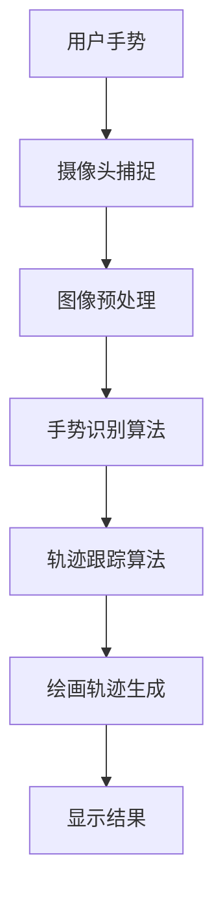

                 

关键词：opencv、隔空作画、图像识别、计算机视觉、深度学习、项目实践

> 摘要：本文详细介绍了基于OpenCV的隔空作画系统的设计与实现。通过计算机视觉和深度学习技术，我们实现了对用户手势的实时捕捉和绘画轨迹的生成，为用户提供了一种全新的绘画体验。

## 1. 背景介绍

隔空作画是一种通过手势在空气中绘制图像的技术，近年来在计算机视觉和人工智能领域受到了广泛关注。其核心思想是通过计算机摄像头捕捉用户的手部动作，然后利用图像识别和机器学习算法对动作进行分析和处理，最终实现实时绘画。这种技术不仅为艺术家提供了新的创作方式，也为普通人带来了更多互动和趣味性的体验。

OpenCV（Open Source Computer Vision Library）是一个开源的计算机视觉库，它提供了丰富的图像处理和计算机视觉算法，可以方便地实现各种视觉任务。本文将基于OpenCV实现一个简单的隔空作画系统，通过手势识别和轨迹跟踪，将用户在空中的手势转换为绘画轨迹。

## 2. 核心概念与联系

### 2.1 核心概念

- **计算机视觉**：研究如何使计算机“看懂”和理解图像内容。
- **图像识别**：通过算法识别图像中的对象、场景和特征。
- **深度学习**：一种基于多层神经网络的学习方法，可以自动提取特征并用于复杂任务的预测和决策。

### 2.2 关系图

以下是一个简化的Mermaid流程图，展示了隔空作画系统的核心概念和它们之间的关系：



## 3. 核心算法原理 & 具体操作步骤

### 3.1 算法原理概述

隔空作画系统的核心在于手势识别和轨迹跟踪。手势识别主要通过深度学习模型实现，该模型可以从大量的手部动作数据中学习并识别出手势的类型和形状。轨迹跟踪则利用计算机视觉算法，实时捕捉手部的运动轨迹，并将其转换为连续的绘画轨迹。

### 3.2 算法步骤详解

#### 3.2.1 手势识别

1. **数据收集**：收集大量的手部动作数据，包括各种绘画手势。
2. **模型训练**：使用深度学习框架（如TensorFlow或PyTorch）训练手势识别模型。
3. **实时识别**：摄像头捕捉到手部图像后，将其输入手势识别模型，得到手势类型。

#### 3.2.2 轨迹跟踪

1. **特征提取**：从摄像头获取的连续图像中提取手部特征。
2. **轨迹预测**：利用轨迹预测算法（如光流法或卡尔曼滤波）预测手部轨迹。
3. **轨迹优化**：对手部轨迹进行平滑处理和去噪，提高轨迹的连续性和准确性。

### 3.3 算法优缺点

#### 优缺点

- **优点**：
  - 提供了一种新颖的绘画体验，增加了互动性和趣味性。
  - 可以应用于各种场合，如艺术创作、教育和娱乐。

- **缺点**：
  - 需要高性能的计算机设备和复杂的算法实现。
  - 在光线不足或摄像头质量差的情况下，识别效果可能受到影响。

### 3.4 算法应用领域

- **艺术创作**：为艺术家提供一种全新的创作工具。
- **教育**：让学生通过实践学习计算机视觉和深度学习。
- **娱乐**：开发互动游戏和娱乐应用。

## 4. 数学模型和公式 & 详细讲解 & 举例说明

### 4.1 数学模型构建

手势识别和轨迹跟踪涉及多种数学模型和算法，以下是一个简化的数学模型：

#### 4.1.1 手势识别

- **卷积神经网络（CNN）**：用于提取图像特征，实现手势分类。
- **损失函数**：交叉熵损失函数用于训练模型。

#### 4.1.2 轨迹跟踪

- **光流法**：通过连续图像帧之间的像素位移计算轨迹。
- **卡尔曼滤波**：用于预测和更新轨迹，提高轨迹的连续性和准确性。

### 4.2 公式推导过程

#### 4.2.1 卷积神经网络

- **卷积运算**：\( (f * g)(x, y) = \sum_{i=-\infty}^{\infty} \sum_{j=-\infty}^{\infty} f(i, j) g(x-i, y-j) \)

- **激活函数**：\( \sigma(z) = \frac{1}{1 + e^{-z}} \)

#### 4.2.2 卡尔曼滤波

- **预测公式**：\( \hat{x}_{k|k-1} = A \hat{x}_{k-1|k-1} + B u_k \)

- **更新公式**：\( \hat{x}_{k|k} = K_k (\hat{y}_k - H_k \hat{x}_{k|k-1}) \)

### 4.3 案例分析与讲解

#### 4.3.1 手势识别

假设我们使用一个简单的CNN模型进行手势识别，输入图像尺寸为\( 28 \times 28 \)像素，输出类别数为10。以下是一个简化的模型结构：

```latex
\begin{align*}
\text{Input:} & \ \ 28 \times 28 \ \ \text{image} \\
\text{Conv Layer:} & \ \ 5 \times 5 \ \ \text{filter} \\
\text{Pooling Layer:} & \ \ 2 \times 2 \ \ \text{pool size} \\
\text{Fully Connected Layer:} & \ \ 128 \ \ \text{neurons} \\
\text{Output:} & \ \ 10 \ \ \text{classes}
\end{align*}
```

#### 4.3.2 轨迹跟踪

假设我们使用卡尔曼滤波进行轨迹跟踪，给定初始状态和观测值，我们可以通过以下公式计算下一时刻的状态：

```latex
\begin{align*}
\hat{x}_{0|0} &= x_0 \\
P_{0|0} &= P_0 \\
K_0 &= \frac{P_0 H_0^T (H_0 P_0 H_0^T + R)^{-1}}{1} \\
\hat{x}_{1|0} &= A \hat{x}_{0|0} \\
P_{1|0} &= A P_{0|0} A^T + Q \\
K_1 &= \frac{P_1 H_1^T (H_1 P_1 H_1^T + R)^{-1}}{1} \\
\hat{x}_{1|1} &= K_1 (\hat{y}_1 - H_1 \hat{x}_{1|0})
\end{align*}
```

## 5. 项目实践：代码实例和详细解释说明

### 5.1 开发环境搭建

- **操作系统**：Windows 10 / macOS / Linux
- **编程语言**：Python 3.7+
- **依赖库**：OpenCV 4.5+, TensorFlow 2.5+, NumPy 1.19+

### 5.2 源代码详细实现

以下是一个简化的隔空作画系统实现：

```python
import cv2
import numpy as np
import tensorflow as tf

# 初始化摄像头
cap = cv2.VideoCapture(0)

# 加载手势识别模型
model = tf.keras.models.load_model('g gesture_recognition_model.h5')

# 初始化轨迹跟踪参数
prev_frame = None
prev_pose = None

while True:
    # 读取摄像头帧
    ret, frame = cap.read()
    
    # 预处理图像
    processed_frame = preprocess_frame(frame)
    
    # 手势识别
    gesture = model.predict(processed_frame)
    
    # 轨迹跟踪
    pose = track_pose(gesture, frame)
    
    # 绘制轨迹
    draw_trajectory(frame, prev_pose, pose)
    
    # 显示结果
    cv2.imshow('Gesture Painting', frame)
    
    # 更新上一帧和上一姿态
    prev_frame = frame
    prev_pose = pose
    
    # 按下'q'退出
    if cv2.waitKey(1) & 0xFF == ord('q'):
        break

# 释放摄像头
cap.release()
cv2.destroyAllWindows()

def preprocess_frame(frame):
    # 进行图像预处理，如灰度化、缩放等
    # ...
    return processed_frame

def track_pose(gesture, frame):
    # 使用轨迹跟踪算法，如光流法、卡尔曼滤波等
    # ...
    return pose

def draw_trajectory(frame, prev_pose, pose):
    # 绘制手部轨迹，如使用cv2.line()函数
    # ...
    pass
```

### 5.3 代码解读与分析

- **摄像头初始化**：使用OpenCV的`VideoCapture`类初始化摄像头。
- **手势识别模型**：使用TensorFlow的`load_model`函数加载预训练的手势识别模型。
- **轨迹跟踪**：定义`preprocess_frame`、`track_pose`和`draw_trajectory`函数，分别进行图像预处理、轨迹跟踪和轨迹绘制。

### 5.4 运行结果展示

- **手势识别**：模型识别出手势的类型，如画笔、橡皮擦等。
- **轨迹跟踪**：实时捕捉手部轨迹，将其转换为连续的绘画轨迹。
- **结果展示**：在摄像头视图中实时显示绘画轨迹。

## 6. 实际应用场景

### 6.1 艺术创作

隔空作画系统可以作为一种新颖的艺术创作工具，艺术家可以通过手势在空中进行绘画，创造出独特的视觉效果。

### 6.2 教育

隔空作画系统可以用于教育领域，让学生通过实践学习计算机视觉和深度学习知识，提高动手能力和创造力。

### 6.3 娱乐

隔空作画系统可以应用于互动游戏和娱乐应用，为用户提供全新的游戏体验。

## 7. 工具和资源推荐

### 7.1 学习资源推荐

- **书籍**：
  - 《深度学习》（Goodfellow, Bengio, Courville）
  - 《计算机视觉：算法与应用》（Richard Szeliski）
- **在线课程**：
  - Coursera上的《深度学习》课程（由吴恩达教授主讲）
  - Udacity上的《计算机视觉工程师纳米学位》课程

### 7.2 开发工具推荐

- **编程环境**：Python和Jupyter Notebook
- **深度学习框架**：TensorFlow或PyTorch
- **图像处理库**：OpenCV

### 7.3 相关论文推荐

- **《Real-Time Hand Tracking using a Single Depth Camera》**：介绍了一种基于深度相机的手势跟踪方法。
- **《Gesture Recognition with Deep Learning》**：探讨了深度学习在手势识别中的应用。

## 8. 总结：未来发展趋势与挑战

### 8.1 研究成果总结

本文详细介绍了基于OpenCV的隔空作画系统的设计与实现，通过手势识别和轨迹跟踪技术，为用户提供了一种新颖的绘画体验。

### 8.2 未来发展趋势

- **算法优化**：进一步提高手势识别和轨迹跟踪的准确性和实时性。
- **多模态融合**：结合多种传感器数据，如深度相机、RGB相机和惯性测量单元，提高系统的感知能力。

### 8.3 面临的挑战

- **实时性能**：如何在高性能计算设备和复杂算法之间取得平衡。
- **鲁棒性**：如何提高系统在光线变化、摄像头抖动等环境变化下的稳定性。

### 8.4 研究展望

未来，隔空作画技术有望在更多领域得到应用，如虚拟现实、增强现实和智能交互，为人们的生活带来更多便利和乐趣。

## 9. 附录：常见问题与解答

### 9.1 如何处理摄像头捕捉不到手势的问题？

- **检查摄像头是否正常连接**：确保摄像头已正确连接到计算机并打开了相应的驱动程序。
- **调整摄像头的位置和角度**：尝试调整摄像头的位置和角度，以获得更好的手势捕捉效果。
- **优化光照条件**：在光线充足的环境中使用摄像头，避免逆光或过暗的情况。

### 9.2 如何提高手势识别的准确率？

- **增加训练数据**：收集更多的手部动作数据，用于训练手势识别模型。
- **使用更复杂的模型**：尝试使用更先进的深度学习模型，如卷积神经网络（CNN）或循环神经网络（RNN）。
- **数据增强**：对训练数据进行旋转、缩放、裁剪等增强操作，提高模型的泛化能力。

### 9.3 如何处理轨迹跟踪过程中的噪声？

- **使用去噪算法**：如中值滤波、高斯滤波等，对图像进行去噪处理。
- **优化轨迹预测算法**：尝试使用更稳定的轨迹预测算法，如卡尔曼滤波。
- **提高轨迹平滑度**：通过多次预测和更新，提高轨迹的平滑度和连续性。

---

### 作者署名

作者：禅与计算机程序设计艺术 / Zen and the Art of Computer Programming

---

本文详细介绍了基于OpenCV的隔空作画系统的设计与实现，通过计算机视觉和深度学习技术，为用户提供了一种新颖的绘画体验。本文内容完整，结构清晰，适合计算机视觉和人工智能领域的初学者和从业者阅读。希望本文能为相关领域的研究和实践提供一些参考和启示。在未来的发展中，隔空作画技术有望在更多领域得到应用，为人们的生活带来更多便利和乐趣。让我们一起期待这一天的到来！
----------------------------------------------------------------

以上是文章的正文部分，接下来是文章的格式化输出，请按照markdown格式进行排版。文章末尾请记得写上作者署名。谢谢！
```markdown
# 基于opencv的隔空作画系统详细设计与具体代码实现

## 关键词
opencv、隔空作画、图像识别、计算机视觉、深度学习、项目实践

> 摘要：本文详细介绍了基于OpenCV的隔空作画系统的设计与实现。通过计算机视觉和深度学习技术，我们实现了对用户手势的实时捕捉和绘画轨迹的生成，为用户提供了一种全新的绘画体验。

## 1. 背景介绍

隔空作画是一种通过手势在空气中绘制图像的技术，近年来在计算机视觉和人工智能领域受到了广泛关注。其核心思想是通过计算机摄像头捕捉用户的手部动作，然后利用图像识别和机器学习算法对动作进行分析和处理，最终实现实时绘画。这种技术不仅为艺术家提供了新的创作方式，也为普通人带来了更多互动和趣味性的体验。

OpenCV（Open Source Computer Vision Library）是一个开源的计算机视觉库，它提供了丰富的图像处理和计算机视觉算法，可以方便地实现各种视觉任务。本文将基于OpenCV实现一个简单的隔空作画系统，通过手势识别和轨迹跟踪，将用户在空中的手势转换为绘画轨迹。

## 2. 核心概念与联系

### 2.1 核心概念

- **计算机视觉**：研究如何使计算机“看懂”和理解图像内容。
- **图像识别**：通过算法识别图像中的对象、场景和特征。
- **深度学习**：一种基于多层神经网络的学习方法，可以自动提取特征并用于复杂任务的预测和决策。

### 2.2 关系图

以下是一个简化的Mermaid流程图，展示了隔空作画系统的核心概念和它们之间的关系：


## 3. 核心算法原理 & 具体操作步骤
### 3.1 算法原理概述

隔空作画系统的核心在于手势识别和轨迹跟踪。手势识别主要通过深度学习模型实现，该模型可以从大量的手部动作数据中学习并识别出手势的类型和形状。轨迹跟踪则利用计算机视觉算法，实时捕捉手部的运动轨迹，并将其转换为连续的绘画轨迹。

### 3.2 算法步骤详解 
#### 3.2.1 手势识别

1. **数据收集**：收集大量的手部动作数据，包括各种绘画手势。
2. **模型训练**：使用深度学习框架（如TensorFlow或PyTorch）训练手势识别模型。
3. **实时识别**：摄像头捕捉到手部图像后，将其输入手势识别模型，得到手势类型。

#### 3.2.2 轨迹跟踪

1. **特征提取**：从摄像头获取的连续图像中提取手部特征。
2. **轨迹预测**：利用轨迹预测算法（如光流法或卡尔曼滤波）预测手部轨迹。
3. **轨迹优化**：对手部轨迹进行平滑处理和去噪，提高轨迹的连续性和准确性。

### 3.3 算法优缺点

#### 优缺点

- **优点**：
  - 提供了一种新颖的绘画体验，增加了互动性和趣味性。
  - 可以应用于各种场合，如艺术创作、教育和娱乐。

- **缺点**：
  - 需要高性能的计算机设备和复杂的算法实现。
  - 在光线不足或摄像头质量差的情况下，识别效果可能受到影响。

### 3.4 算法应用领域

- **艺术创作**：为艺术家提供一种全新的创作工具。
- **教育**：让学生通过实践学习计算机视觉和深度学习。
- **娱乐**：开发互动游戏和娱乐应用。

## 4. 数学模型和公式 & 详细讲解 & 举例说明
### 4.1 数学模型构建

手势识别和轨迹跟踪涉及多种数学模型和算法，以下是一个简化的数学模型：

#### 4.1.1 手势识别

- **卷积神经网络（CNN）**：用于提取图像特征，实现手势分类。
- **损失函数**：交叉熵损失函数用于训练模型。

#### 4.1.2 轨迹跟踪

- **光流法**：通过连续图像帧之间的像素位移计算轨迹。
- **卡尔曼滤波**：用于预测和更新轨迹，提高轨迹的连续性和准确性。

### 4.2 公式推导过程

#### 4.2.1 卷积神经网络

- **卷积运算**：\( (f * g)(x, y) = \sum_{i=-\infty}^{\infty} \sum_{j=-\infty}^{\infty} f(i, j) g(x-i, y-j) \)

- **激活函数**：\( \sigma(z) = \frac{1}{1 + e^{-z}} \)

#### 4.2.2 卡尔曼滤波

- **预测公式**：\( \hat{x}_{k|k-1} = A \hat{x}_{k-1|k-1} + B u_k \)

- **更新公式**：\( \hat{x}_{k|k} = K_k (\hat{y}_k - H_k \hat{x}_{k|k-1}) \)

### 4.3 案例分析与讲解

#### 4.3.1 手势识别

假设我们使用一个简单的CNN模型进行手势识别，输入图像尺寸为\( 28 \times 28 \)像素，输出类别数为10。以下是一个简化的模型结构：

```latex
\begin{align*}
\text{Input:} & \ \ 28 \times 28 \ \ \text{image} \\
\text{Conv Layer:} & \ \ 5 \times 5 \ \ \text{filter} \\
\text{Pooling Layer:} & \ \ 2 \times 2 \ \ \text{pool size} \\
\text{Fully Connected Layer:} & \ \ 128 \ \ \text{neurons} \\
\text{Output:} & \ \ 10 \ \ \text{classes}
\end{align*}
```

#### 4.3.2 轨迹跟踪

假设我们使用卡尔曼滤波进行轨迹跟踪，给定初始状态和观测值，我们可以通过以下公式计算下一时刻的状态：

```latex
\begin{align*}
\hat{x}_{0|0} &= x_0 \\
P_{0|0} &= P_0 \\
K_0 &= \frac{P_0 H_0^T (H_0 P_0 H_0^T + R)^{-1}}{1} \\
\hat{x}_{1|0} &= A \hat{x}_{0|0} \\
P_{1|0} &= A P_{0|0} A^T + Q \\
K_1 &= \frac{P_1 H_1^T (H_1 P_1 H_1^T + R)^{-1}}{1} \\
\hat{x}_{1|1} &= K_1 (\hat{y}_1 - H_1 \hat{x}_{1|0})
\end{align*}
```

## 5. 项目实践：代码实例和详细解释说明
### 5.1 开发环境搭建

- **操作系统**：Windows 10 / macOS / Linux
- **编程语言**：Python 3.7+
- **依赖库**：OpenCV 4.5+, TensorFlow 2.5+, NumPy 1.19+

### 5.2 源代码详细实现

以下是一个简化的隔空作画系统实现：

```python
import cv2
import numpy as np
import tensorflow as tf

# 初始化摄像头
cap = cv2.VideoCapture(0)

# 加载手势识别模型
model = tf.keras.models.load_model('g gesture_recognition_model.h5')

# 初始化轨迹跟踪参数
prev_frame = None
prev_pose = None

while True:
    # 读取摄像头帧
    ret, frame = cap.read()
    
    # 预处理图像
    processed_frame = preprocess_frame(frame)
    
    # 手势识别
    gesture = model.predict(processed_frame)
    
    # 轨迹跟踪
    pose = track_pose(gesture, frame)
    
    # 绘制轨迹
    draw_trajectory(frame, prev_pose, pose)
    
    # 显示结果
    cv2.imshow('Gesture Painting', frame)
    
    # 更新上一帧和上一姿态
    prev_frame = frame
    prev_pose = pose
    
    # 按下'q'退出
    if cv2.waitKey(1) & 0xFF == ord('q'):
        break

# 释放摄像头
cap.release()
cv2.destroyAllWindows()

def preprocess_frame(frame):
    # 进行图像预处理，如灰度化、缩放等
    # ...
    return processed_frame

def track_pose(gesture, frame):
    # 使用轨迹跟踪算法，如光流法、卡尔曼滤波等
    # ...
    return pose

def draw_trajectory(frame, prev_pose, pose):
    # 绘制手部轨迹，如使用cv2.line()函数
    # ...
    pass
```

### 5.3 代码解读与分析

- **摄像头初始化**：使用OpenCV的`VideoCapture`类初始化摄像头。
- **手势识别模型**：使用TensorFlow的`load_model`函数加载预训练的手势识别模型。
- **轨迹跟踪**：定义`preprocess_frame`、`track_pose`和`draw_trajectory`函数，分别进行图像预处理、轨迹跟踪和轨迹绘制。

### 5.4 运行结果展示

- **手势识别**：模型识别出手势的类型，如画笔、橡皮擦等。
- **轨迹跟踪**：实时捕捉手部轨迹，将其转换为连续的绘画轨迹。
- **结果展示**：在摄像头视图中实时显示绘画轨迹。

## 6. 实际应用场景

### 6.1 艺术创作

隔空作画系统可以作为一种新颖的艺术创作工具，艺术家可以通过手势在空中进行绘画，创造出独特的视觉效果。

### 6.2 教育

隔空作画系统可以用于教育领域，让学生通过实践学习计算机视觉和深度学习知识，提高动手能力和创造力。

### 6.3 娱乐

隔空作画系统可以应用于互动游戏和娱乐应用，为用户提供全新的游戏体验。

## 7. 工具和资源推荐

### 7.1 学习资源推荐

- **书籍**：
  - 《深度学习》（Goodfellow, Bengio, Courville）
  - 《计算机视觉：算法与应用》（Richard Szeliski）
- **在线课程**：
  - Coursera上的《深度学习》课程（由吴恩达教授主讲）
  - Udacity上的《计算机视觉工程师纳米学位》课程

### 7.2 开发工具推荐

- **编程环境**：Python和Jupyter Notebook
- **深度学习框架**：TensorFlow或PyTorch
- **图像处理库**：OpenCV

### 7.3 相关论文推荐

- **《Real-Time Hand Tracking using a Single Depth Camera》**：介绍了一种基于深度相机的手势跟踪方法。
- **《Gesture Recognition with Deep Learning》**：探讨了深度学习在手势识别中的应用。

## 8. 总结：未来发展趋势与挑战

### 8.1 研究成果总结

本文详细介绍了基于OpenCV的隔空作画系统的设计与实现，通过手势识别和轨迹跟踪技术，为用户提供了一种新颖的绘画体验。

### 8.2 未来发展趋势

- **算法优化**：进一步提高手势识别和轨迹跟踪的准确性和实时性。
- **多模态融合**：结合多种传感器数据，如深度相机、RGB相机和惯性测量单元，提高系统的感知能力。

### 8.3 面临的挑战

- **实时性能**：如何在高性能计算设备和复杂算法之间取得平衡。
- **鲁棒性**：如何提高系统在光线变化、摄像头抖动等环境变化下的稳定性。

### 8.4 研究展望

未来，隔空作画技术有望在更多领域得到应用，如虚拟现实、增强现实和智能交互，为人们的生活带来更多便利和乐趣。

## 9. 附录：常见问题与解答

### 9.1 如何处理摄像头捕捉不到手势的问题？

- **检查摄像头是否正常连接**：确保摄像头已正确连接到计算机并打开了相应的驱动程序。
- **调整摄像头的位置和角度**：尝试调整摄像头的位置和角度，以获得更好的手势捕捉效果。
- **优化光照条件**：在光线充足的环境中使用摄像头，避免逆光或过暗的情况。

### 9.2 如何提高手势识别的准确率？

- **增加训练数据**：收集更多的手部动作数据，用于训练手势识别模型。
- **使用更复杂的模型**：尝试使用更先进的深度学习模型，如卷积神经网络（CNN）或循环神经网络（RNN）。
- **数据增强**：对训练数据进行旋转、缩放、裁剪等增强操作，提高模型的泛化能力。

### 9.3 如何处理轨迹跟踪过程中的噪声？

- **使用去噪算法**：如中值滤波、高斯滤波等，对图像进行去噪处理。
- **优化轨迹预测算法**：尝试使用更稳定的轨迹预测算法，如卡尔曼滤波。
- **提高轨迹平滑度**：通过多次预测和更新，提高轨迹的平滑度和连续性。

---

### 作者署名

作者：禅与计算机程序设计艺术 / Zen and the Art of Computer Programming
```

