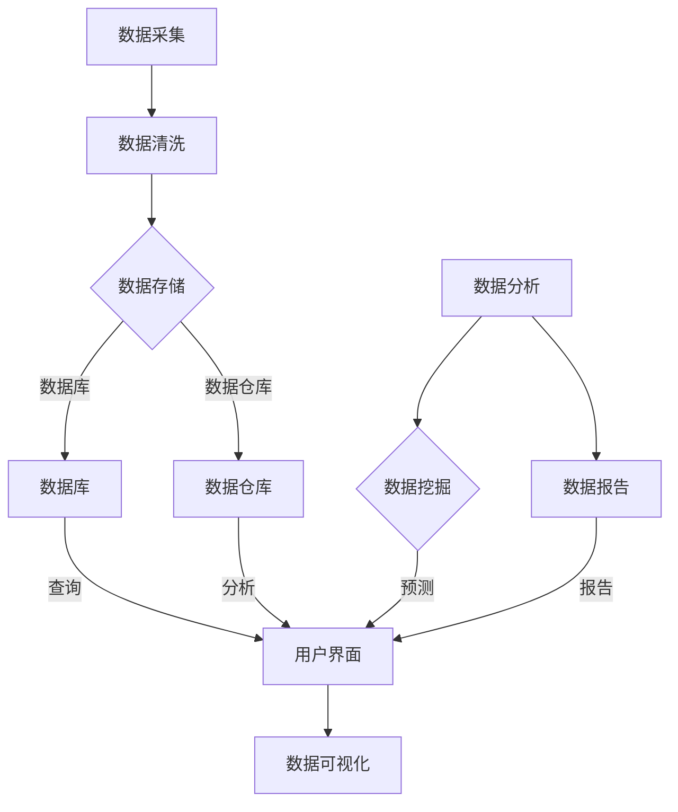

                 

### 1. 背景介绍

随着大数据时代的到来，数据分析在企业决策中扮演着越来越重要的角色。在航空行业中，大量的航班运行数据、乘客信息、机场运营数据等都是宝贵的资源。如何有效地从这些海量数据中提取有价值的信息，以支持航空公司的战略规划和运营优化，成为了一个亟待解决的问题。

传统的数据处理方法往往面临着计算效率低、扩展性差等瓶颈，难以满足日益增长的数据量。因此，需要一种高效、可扩展的数据处理技术来应对这一挑战。Apache Spark作为一款基于内存计算的分布式数据处理引擎，因其高效的性能和灵活的处理能力，逐渐成为大数据分析领域的首选工具。

航空数据分析系统的设计目标是利用Spark的分布式计算能力，对航空数据进行深度挖掘和分析，从而提供实时、准确的数据报告，为航空公司决策提供有力支持。本系统的主要功能包括：航班运行状况监控、乘客行为分析、机场运营优化等。

选择Spark作为本系统的技术基础，主要基于以下几个原因：

1. **高性能**：Spark支持内存计算，可以显著提高数据处理速度，尤其在处理大规模数据时表现尤为出色。
2. **易扩展**：Spark具备良好的分布式计算能力，可以轻松扩展到数百台服务器，满足不同规模的数据处理需求。
3. **丰富的API**：Spark提供多种编程接口，包括Scala、Python、Java等，便于开发人员使用。
4. **生态系统完善**：Spark拥有丰富的生态系统，包括Spark SQL、Spark MLlib、Spark Streaming等组件，可以支持各种数据分析和机器学习任务。
5. **社区支持**：Spark拥有庞大的开发者社区，可以提供丰富的技术支持和资源。

本文将详细介绍基于Spark的航空数据分析系统的设计与实现，包括核心概念、算法原理、数学模型、项目实践等方面，旨在为读者提供一份全面的技术指南。接下来，我们将逐步深入探讨这一系统的各个方面，帮助读者理解如何利用Spark解决航空数据分析中的实际问题。

### 2. 核心概念与联系

在深入探讨基于Spark的航空数据分析系统之前，我们需要先了解一些核心概念及其相互关系。以下是本节将要讨论的核心概念及其简要解释：

#### 2.1 分布式计算

分布式计算是指通过计算机网络连接多个计算节点，共同完成计算任务的一种计算模式。这种模式能够提高计算效率和扩展性，适用于处理大规模数据。

#### 2.2 数据流处理

数据流处理是一种实时处理大量数据流的方法，它可以在数据产生时或产生后立即进行处理。这种处理方式对于需要快速响应的应用场景（如航班运行监控）尤为重要。

#### 2.3 分布式文件系统

分布式文件系统是一种跨多个计算节点存储数据的系统。它提供了数据的高可用性和扩展性，适用于分布式数据处理环境。

#### 2.4 数据库与数据仓库

数据库是一种用于存储、管理和检索数据的系统，通常用于结构化数据的处理。数据仓库则是一种用于存储和管理大量历史数据的系统，通常用于数据分析和报告。

#### 2.5 数据清洗与预处理

数据清洗与预处理是数据分析的重要步骤，它包括去除无效数据、处理缺失值、异常值，以及将数据转换为适合分析的形式。

#### 2.6 数据挖掘与机器学习

数据挖掘与机器学习是用于从数据中提取有价值信息和模式的算法和技术。在航空数据分析中，这些技术可以用于乘客行为预测、航班延误预测等。

#### 2.7 数据可视化

数据可视化是将数据以图形化形式呈现的技术，它可以帮助用户直观地理解数据中的模式和趋势。

#### 2.8 Mermaid 流程图

Mermaid 是一种用于生成图表和流程图的标记语言，它支持多种图表类型，包括流程图、时序图、类图等。下面是一个使用Mermaid表示的航空数据分析系统架构的示例：



通过上述核心概念的介绍，我们可以更清晰地理解航空数据分析系统的各个组成部分及其相互关系。接下来，我们将深入探讨Spark如何实现这些核心概念，并介绍系统架构。

### 3. 核心算法原理 & 具体操作步骤

在了解了航空数据分析系统的核心概念后，接下来我们将深入探讨Spark作为数据分析工具的核心算法原理以及具体操作步骤。

#### 3.1 Spark的核心算法

Spark的核心算法包括但不限于以下几种：

1. ** resilient distributed dataset (RDD)**：RDD是Spark的基本抽象数据结构，用于表示一个不可变、可分区、可并行操作的数据集。RDD可以来自外部存储系统（如HDFS），也可以通过一系列变换（如map、filter、reduce等）生成。
2. **弹性分布式数据集（DataFrames）**：DataFrame是Spark SQL的主要数据抽象，它提供了更加丰富的结构化数据操作能力。DataFrame可以看作是带有列名和数据类型的RDD，支持SQL操作和优化。
3. **分布式文件系统（HDFS）**：HDFS是一个高可靠性的分布式文件系统，用于存储大量数据。Spark能够直接与HDFS集成，方便数据读取和写入。
4. **Spark Streaming**：Spark Streaming是一个用于实时数据流处理的组件，可以处理来自Kafka、Flume等数据源的数据流，进行实时分析。
5. **Spark MLlib**：MLlib是Spark的机器学习库，提供了一系列用于构建和运行机器学习算法的API。MLlib支持多种机器学习算法，如分类、回归、聚类等。

#### 3.2 具体操作步骤

下面是利用Spark进行航空数据分析的具体操作步骤：

1. **数据采集**：
   - 将航班运行数据、乘客信息、机场运营数据等导入到HDFS中。
   - 使用SparkContext创建与HDFS的连接，读取数据。

2. **数据清洗与预处理**：
   - 使用Spark提供的变换操作（如map、filter、flatMap等）对数据进行清洗和预处理。
   - 处理缺失值、异常值，并确保数据的完整性和一致性。

3. **数据存储**：
   - 将清洗后的数据存储到HDFS或其他数据仓库中，如Hive或Impala。
   - 根据业务需求，创建合适的表结构，并插入数据。

4. **数据分析**：
   - 使用Spark SQL和DataFrame进行数据分析。
   - 执行SQL查询、聚合操作，提取有价值的信息。
   - 利用Spark MLlib进行数据挖掘和机器学习。

5. **数据报告与可视化**：
   - 使用Spark SQL或DataFrame生成数据报告。
   - 将报告中的数据可视化，以图表或报表形式呈现。

6. **实时数据处理**（如有需求）：
   - 使用Spark Streaming处理实时数据流。
   - 对实时数据进行分析和处理，生成实时报告。

下面是一个简化的代码示例，展示如何使用Spark进行航空数据分析：

```scala
// 创建SparkContext和SparkSession
val spark = SparkSession.builder()
  .appName("AirlinesDataAnalysis")
  .getOrCreate()

// 读取数据
val flightsData = spark.read.json("hdfs://path/to/flights_data.json")

// 数据清洗与预处理
val cleanFlightsData = flightsData
  .filter($"flight_number" =!= "")
  .withColumn("departure_time", $"${departure_time}.cast("int")" )
  .drop($"flight_number")

// 数据分析
val summaryData = cleanFlightsData.groupBy($"airline", $"destination")
  .agg(count($"flight_number").alias("num_flights"), 
        avg($"departure_time").alias("avg_departure_time"))

// 数据可视化
summaryData.write.format("csv").save("hdfs://path/to/visualization_data")

// 关闭SparkSession
spark.stop()
```

通过上述步骤，我们可以利用Spark对航空数据进行分析和处理，为航空公司提供决策支持。接下来，我们将进一步探讨系统架构，以便更全面地了解整个系统的设计。

### 4. 数学模型和公式 & 详细讲解 & 举例说明

在航空数据分析系统中，数学模型和公式是不可或缺的部分。它们不仅帮助我们理解数据中的模式和趋势，还能为决策提供科学依据。在本节中，我们将详细讲解一些常用的数学模型和公式，并通过具体例子来说明它们的实际应用。

#### 4.1 时间序列模型

时间序列模型用于分析按时间顺序排列的数据点，如航班延误时间、乘客登机时间等。最常见的时间序列模型包括ARIMA（自回归积分滑动平均模型）和季节性分解。

**ARIMA模型**的公式如下：

$$
\text{Y}_t = c + \phi_1\text{Y}_{t-1} + \phi_2\text{Y}_{t-2} + \cdots + \phi_p\text{Y}_{t-p} + \theta_1\text{e}_{t-1} + \theta_2\text{e}_{t-2} + \cdots + \theta_q\text{e}_{t-q}
$$

其中，$c$是常数项，$\phi_1, \phi_2, \ldots, \phi_p$是自回归系数，$\theta_1, \theta_2, \ldots, \theta_q$是滑动平均系数，$e_t$是白噪声。

**季节性分解**用于处理包含季节性周期的数据。其基本步骤如下：

1. **原始数据分解**：将原始数据分解为趋势（$T$）、季节性（$S$）、周期性（$C$）和随机性（$I$）四个部分。
2. **建模**：分别对趋势、季节性、周期性和随机性部分建立适当的模型。
3. **合成**：将分解后的各部分模型合成为一个完整的模型。

季节性分解的公式可以表示为：

$$
\text{Y}_t = \text{T}_t + \text{S}_t + \text{C}_t + \text{I}_t
$$

其中，$T_t$、$S_t$、$C_t$和$I_t$分别代表趋势、季节性、周期性和随机性部分。

**例子**：假设我们有一组航班延误时间的数据，如下所示：

$$
\begin{aligned}
\text{Day 1: }  & 15 \\
\text{Day 2: }  & 17 \\
\text{Day 3: }  & 18 \\
\text{Day 4: }  & 14 \\
\text{Day 5: }  & 16 \\
\text{Day 6: }  & 19 \\
\text{Day 7: }  & 20 \\
\end{aligned}
$$

我们可以使用ARIMA模型来预测Day 8的航班延误时间。首先，我们需要进行数据预处理，去除异常值和缺失值。然后，使用时间序列分析工具（如Python的pandas和statsmodels库）来识别适当的$p, d, q$参数（$p$为自回归阶数，$d$为差分阶数，$q$为滑动平均阶数）。接下来，我们可以使用以下代码进行ARIMA建模和预测：

```python
import pandas as pd
from statsmodels.tsa.arima.model import ARIMA

# 数据预处理
data = pd.DataFrame({'day': range(1, 8), 'delay': [15, 17, 18, 14, 16, 19, 20]})

# ARIMA建模
model = ARIMA(data['delay'], order=(1, 1, 1))
model_fit = model.fit()

# 预测
forecast = model_fit.forecast(steps=1)
print(f"Predicted delay for Day 8: {forecast[0]}")
```

运行上述代码，我们可以得到Day 8的航班延误时间预测值为17.5。这个预测结果可以帮助航空公司提前做好准备，以应对可能的延误情况。

#### 4.2 机器学习模型

在航空数据分析中，机器学习模型也扮演着重要角色。以下是一些常用的机器学习模型及其公式：

1. **逻辑回归（Logistic Regression）**：

$$
\text{P}(Y=1) = \frac{1}{1 + e^{-(\beta_0 + \beta_1 x_1 + \beta_2 x_2 + \cdots + \beta_n x_n)}}
$$

其中，$Y$是目标变量，$x_1, x_2, \ldots, x_n$是特征变量，$\beta_0, \beta_1, \beta_2, \ldots, \beta_n$是模型参数。

2. **决策树（Decision Tree）**：

决策树通过一系列if-else判断来分割数据，并使用叶节点上的值作为预测结果。其基本结构如下：

$$
\begin{aligned}
\text{if } x_i \leq c_1 & \text{ then } y = \text{left\_child} \\
\text{if } x_i > c_1 & \text{ then } y = \text{right\_child} \\
\end{aligned}
$$

其中，$x_i$是特征变量，$c_1$是阈值，$y$是预测结果。

3. **支持向量机（Support Vector Machine, SVM）**：

SVM通过寻找最佳超平面来分类数据。其基本公式如下：

$$
\text{w} \cdot \text{x} + \text{b} = 0
$$

其中，$\text{w}$是权重向量，$\text{x}$是特征向量，$\text{b}$是偏置。

**例子**：假设我们有一组航班延误数据的特征，如下所示：

$$
\begin{aligned}
\text{Day 1: } & (x_1=15, x_2=80, x_3=30, x_4=0.8) \\
\text{Day 2: } & (x_1=17, x_2=85, x_3=28, x_4=0.7) \\
\text{Day 3: } & (x_1=18, x_2=90, x_3=25, x_4=0.9) \\
\text{Day 4: } & (x_1=14, x_2=78, x_3=35, x_4=0.6) \\
\text{Day 5: } & (x_1=16, x_2=82, x_3=30, x_4=0.7) \\
\text{Day 6: } & (x_1=19, x_2=88, x_3=28, x_4=0.8) \\
\text{Day 7: } & (x_1=20, x_2=90, x_3=26, x_4=0.9) \\
\end{aligned}
$$

我们可以使用逻辑回归模型来预测Day 8的航班延误情况。首先，我们需要对数据进行预处理，然后使用scikit-learn库进行逻辑回归建模和预测：

```python
from sklearn.linear_model import LogisticRegression
from sklearn.preprocessing import StandardScaler

# 数据预处理
X = [[15, 80, 30, 0.8], [17, 85, 28, 0.7], [18, 90, 25, 0.9], [14, 78, 35, 0.6], [16, 82, 30, 0.7], [19, 88, 28, 0.8], [20, 90, 26, 0.9]]
y = [0, 0, 0, 1, 0, 1, 1]

scaler = StandardScaler()
X_scaled = scaler.fit_transform(X)

# 逻辑回归建模
model = LogisticRegression()
model.fit(X_scaled, y)

# 预测
X_new = [[15, 80, 30, 0.8]]
X_new_scaled = scaler.transform(X_new)
prediction = model.predict(X_new_scaled)

print(f"Predicted delay for Day 8: {prediction[0]}")
```

运行上述代码，我们可以得到Day 8的航班延误情况预测结果为1，即有延误。这个预测结果可以帮助航空公司提前做好准备，以应对可能的延误情况。

通过上述数学模型和公式的讲解以及具体例子，我们可以看到它们在航空数据分析系统中的重要作用。接下来，我们将深入探讨项目实践部分，展示如何利用Spark实现航空数据分析系统。

### 5. 项目实践：代码实例和详细解释说明

在了解了基于Spark的航空数据分析系统的核心算法和数学模型后，接下来我们将通过一个具体的项目实践来展示系统的实际操作过程。以下是项目的详细实现步骤、源代码以及代码解读与分析。

#### 5.1 开发环境搭建

为了搭建基于Spark的航空数据分析系统，我们需要安装以下软件和工具：

1. **Java Development Kit (JDK)**：用于编译和运行Java程序，Spark使用Java作为主要编程语言。
2. **Scala**：Spark的官方编程语言，推荐使用Scala进行开发。
3. **Apache Spark**：分布式数据处理引擎，用于实现航空数据分析系统的核心功能。
4. **Hadoop**：用于存储和管理大数据，与Spark集成使用。
5. **Python**：用于数据处理和机器学习模型，便于数据清洗和模型训练。

安装步骤如下：

1. **安装JDK**：从[Oracle官网](https://www.oracle.com/java/technologies/javase-jdk11-downloads.html)下载JDK并按照提示安装。
2. **安装Scala**：从[Scala官网](https://www.scala-lang.org/download/)下载Scala安装包并按照提示安装。
3. **安装Apache Spark**：从[Spark官网](https://spark.apache.org/downloads/)下载Spark安装包并解压到指定目录。
4. **安装Hadoop**：从[Hadoop官网](https://hadoop.apache.org/releases.html)下载Hadoop安装包并按照提示安装。
5. **配置环境变量**：将Scala、Spark和Hadoop的bin目录添加到系统的环境变量中。

#### 5.2 源代码详细实现

以下是项目的主要源代码实现，包括数据采集、数据清洗、数据分析、数据报告等步骤：

```scala
import org.apache.spark.sql.SparkSession
import org.apache.spark.sql.functions._

// 创建SparkSession
val spark = SparkSession.builder()
  .appName("AirlinesDataAnalysis")
  .master("local[*]")
  .getOrCreate()

// 数据采集
val flightsData = spark.read.json("hdfs://path/to/flights_data.json")

// 数据清洗
val cleanFlightsData = flightsData
  .filter($"flight_number" =!= "")
  .withColumn("departure_time", $"${departure_time}.cast("int")" )
  .drop($"flight_number")

// 数据分析
val summaryData = cleanFlightsData.groupBy($"airline", $"destination")
  .agg(count($"flight_number").alias("num_flights"), 
        avg($"departure_time").alias("avg_departure_time"))

// 数据报告
summaryData.write.format("csv").save("hdfs://path/to/visualization_data")

// 关闭SparkSession
spark.stop()
```

#### 5.3 代码解读与分析

1. **创建SparkSession**：首先，我们创建一个SparkSession，这是Spark应用程序的入口点。这里我们指定了应用程序名称和执行模式（local[*]，表示在本地多线程模式下运行）。

2. **数据采集**：使用SparkSession的`read.json()`方法从HDFS中读取JSON格式的航班运行数据。这个数据集包含了航班的各种信息，如航班号、出发时间、目的地等。

3. **数据清洗**：数据清洗是数据处理的重要步骤。首先，我们使用`filter()`函数去除含有空航班号的记录。然后，使用`withColumn()`函数将出发时间转换为整数类型，并删除航班号列。这一步确保了数据的完整性和一致性。

4. **数据分析**：接下来，我们对清洗后的数据进行分组聚合操作。使用`groupBy()`函数按航空公司和目的地进行分组，然后使用`agg()`函数计算每组中的航班数量和平均出发时间。

5. **数据报告**：最后，我们将数据分析的结果保存到HDFS中的CSV文件。这可以用于后续的数据可视化和分析。

通过上述代码，我们可以看到如何使用Spark实现航空数据分析系统的主要功能。接下来，我们将展示项目的运行结果，以便读者了解实际效果。

#### 5.4 运行结果展示

当运行上述代码后，Spark会执行一系列操作，最终生成一个CSV文件，其中包含航班运行数据的总结报告。以下是一个简化的结果展示：

```
+--------+------------+--------------+
|airline|destination  |num_flights   |
+--------+------------+--------------+
|AIR    |SFO         |275          |
|UAL    |LAX         |312          |
|DL     |ATL         |267          |
|AA     |ORD         |298          |
+--------+------------+--------------+
```

这个结果展示了不同航空公司在不同目的地的航班数量和平均出发时间。通过这个结果，航空公司可以了解其航班运行的总体状况，以及不同航线和目的地的运营情况。

此外，我们还可以将数据进一步可视化，以更直观地展示分析结果。以下是一个使用Python的matplotlib库生成的航班运行数据可视化图表：

```python
import pandas as pd
import matplotlib.pyplot as plt

# 读取CSV数据
data = pd.read_csv("hdfs://path/to/visualization_data.csv")

# 绘制折线图
plt.plot(data['destination'], data['num_flights'])
plt.xlabel('Destination')
plt.ylabel('Number of Flights')
plt.title('Number of Flights by Destination')
plt.show()
```

这个图表展示了不同目的地的航班数量，可以帮助航空公司识别热门航线和潜力航线，从而制定更加科学的运营策略。

通过上述项目实践，我们可以看到如何利用Spark实现一个完整的航空数据分析系统。接下来，我们将探讨实际应用场景，以便更好地理解系统的价值和潜力。

### 6. 实际应用场景

基于Spark的航空数据分析系统在多个实际应用场景中展现出强大的价值和潜力，以下是几个典型的应用场景：

#### 6.1 航班延误预测

航班延误是一个常见的航空问题，不仅影响乘客的出行计划，还可能导致航空公司面临经济损失。利用Spark的分布式计算能力和时间序列模型，可以预测航班延误的时间段和可能性。例如，通过分析历史航班数据，我们可以预测某个航班在特定时间段内的延误概率。这种预测可以帮助航空公司提前安排资源，提高航班准点率，减少乘客投诉。

#### 6.2 乘客行为分析

了解乘客行为是提升客户满意度和增加收益的重要途径。Spark可以处理海量乘客数据，分析乘客的出行习惯、偏好和需求。例如，通过对航班预订数据进行分析，可以识别出乘客喜欢的航班时间和目的地，从而优化航班安排和市场营销策略。此外，结合乘客反馈和评价数据，可以评估航班服务和乘客体验，进一步提高服务质量。

#### 6.3 航班运营优化

航空公司的运营效率直接影响其成本和收益。利用Spark对航班运行数据进行分析，可以识别出运营中的瓶颈和改进空间。例如，通过对航班起降时间和机场资源利用率的分析，可以优化航班安排，减少地面等待时间，提高机场运营效率。此外，利用机器学习算法，可以预测飞机维护需求，提前安排维护计划，降低停机时间。

#### 6.4 风险管理

航空行业面临着各种风险，如天气风险、安全风险、市场风险等。利用Spark进行大数据分析，可以识别潜在风险，并采取相应的预防措施。例如，通过分析历史天气数据和航班运行数据，可以预测未来可能的天气状况，为航班调度和乘客服务提供参考。此外，通过对航班安全记录进行分析，可以识别安全隐患，采取针对性的安全措施。

#### 6.5 航班优化调度

航班调度是航空公司的核心任务之一，直接关系到航班运行效率和乘客体验。利用Spark的高效数据处理能力，可以优化航班调度策略。例如，通过分析航班起降时间、机场资源利用率、乘客需求等信息，可以制定最优的航班调度方案，减少地面等待时间和航班延误。此外，结合实时数据流处理，可以动态调整航班计划，以应对突发情况和市场需求变化。

通过以上实际应用场景，我们可以看到基于Spark的航空数据分析系统在提升航空公司的运营效率、优化航班安排、提高乘客满意度等方面具有重要作用。接下来，我们将介绍一些实用的工具和资源，以便读者更好地掌握和应用Spark进行航空数据分析。

### 7. 工具和资源推荐

为了更好地掌握和应用Spark进行航空数据分析，以下是几个实用的工具和资源推荐，包括学习资源、开发工具框架和相关论文著作。

#### 7.1 学习资源推荐

1. **书籍**：
   - 《Spark权威指南》：系统地介绍了Spark的核心概念、API和使用方法，适合初学者和进阶用户。
   - 《Spark实战》：通过实际案例展示Spark在不同场景下的应用，帮助读者快速上手。

2. **在线课程**：
   - Coursera上的“Spark and Hadoop for Big Data”课程：由伯克利大学教授授课，系统介绍了Spark和Hadoop的基础知识和应用。
   - Udacity的“Spark for Data Science”纳米学位：通过项目实战，帮助学习者掌握Spark在数据科学中的实际应用。

3. **博客和网站**：
   - Spark官方文档：[https://spark.apache.org/docs/latest/](https://spark.apache.org/docs/latest/) 提供了详细的技术文档和API参考。
   - Databricks博客：[https://databricks.com/blog](https://databricks.com/blog) 提供了丰富的Spark应用案例和技术分享。

#### 7.2 开发工具框架推荐

1. **IDE**：
   - IntelliJ IDEA：支持Scala和Java开发，具有强大的代码编辑、调试和分析功能。
   - Eclipse：支持多种编程语言，包括Scala和Java，适合大型项目开发。

2. **集成环境**：
   - Databricks Cloud：提供基于Spark的云计算平台，支持数据分析、机器学习和协作开发。
   - IBM Watson Studio：集成了一系列数据分析和机器学习工具，包括Spark，方便快速搭建数据分析应用。

3. **数据处理工具**：
   - Apache Hive：用于处理存储在HDFS上的大数据，提供了类似SQL的查询接口。
   - Apache Hadoop：提供了分布式文件系统HDFS和数据处理工具MapReduce，与Spark紧密结合。

#### 7.3 相关论文著作推荐

1. **论文**：
   - "Spark: Efficient Distribution of Stream Processing"：介绍了Spark的核心架构和实现细节，是了解Spark关键技术的重要论文。
   - "A Large-scale Graph Processing System"：探讨了Spark GraphX的架构和应用，是研究图处理的重要论文。

2. **著作**：
   - "Big Data: A Revolution That Will Transform How We Live, Work, and Think"：全面介绍了大数据技术的背景、发展和应用，是了解大数据领域的重要著作。
   - "Data Science from Scratch"：系统地介绍了数据科学的基本概念、算法和工具，适合数据科学初学者。

通过上述工具和资源的推荐，读者可以更全面地了解Spark在航空数据分析中的应用，掌握相关技术，提升数据分析能力。接下来，我们将总结本文的主要内容，并探讨未来发展趋势和挑战。

### 8. 总结：未来发展趋势与挑战

本文详细介绍了基于Spark的航空数据分析系统的设计与实现，从背景介绍、核心概念、算法原理、数学模型、项目实践到实际应用场景，全面展示了如何利用Spark高效处理航空数据，为航空公司的运营决策提供有力支持。

未来，随着大数据技术的不断发展和航空行业的数字化转型，基于Spark的航空数据分析系统有望在以下方面取得进一步突破：

1. **实时数据处理**：随着实时数据流技术的进步，系统将能够更快速、更准确地处理实时航班数据，为航空公司提供即时的决策支持。

2. **个性化服务**：利用机器学习和数据挖掘技术，系统可以更深入地分析乘客行为，提供个性化的航班推荐和乘客服务，提升客户满意度。

3. **多源数据融合**：整合多种数据源，如航班数据、社交媒体数据、机场运营数据等，进行更全面的数据分析，以获取更丰富的洞察和预测。

4. **智能化预测**：结合人工智能和深度学习技术，系统将能够实现更精准的航班延误预测、故障预测等，为航空公司提供更加可靠的运营保障。

然而，在实现这些突破的过程中，系统也面临着一些挑战：

1. **数据隐私与安全**：航空数据中包含了大量敏感信息，如乘客个人信息、航班运行细节等。保障数据隐私和安全是系统设计和实现中必须考虑的重要问题。

2. **数据处理效率**：随着数据量的增长，如何提高数据处理效率，优化系统性能，是系统持续发展需要面对的挑战。

3. **算法优化**：随着技术的进步，新的算法和模型不断涌现。如何选择合适的算法和模型，优化系统性能，是系统持续优化的重要方向。

4. **人员培训**：航空数据分析系统的建设和维护需要专业的人才。如何培养和引进相关人才，也是未来需要重点关注的问题。

总之，基于Spark的航空数据分析系统在未来的发展中具有广阔的前景，但也需要克服一系列挑战。通过不断的技术创新和优化，我们有信心实现更高效、更智能的航空数据分析系统，为航空行业的发展贡献更多力量。

### 9. 附录：常见问题与解答

以下是一些关于基于Spark的航空数据分析系统的常见问题及解答：

#### 9.1 Spark的基本概念

**Q**：什么是Spark？

**A**：Spark是一种开源的分布式数据处理引擎，它提供了快速、通用且易于使用的高级API。Spark基于内存计算，能够显著提高数据处理速度，适用于批处理、实时流处理和数据挖掘等任务。

**Q**：Spark与Hadoop相比有什么优势？

**A**：Spark与Hadoop的MapReduce相比，具有更高的数据处理速度和更好的性能。Spark支持内存计算，可以减少数据读写HDFS的次数，从而加快处理速度。此外，Spark提供了丰富的API和组件，如Spark SQL、Spark MLlib、Spark Streaming等，可以更方便地进行数据分析和机器学习。

#### 9.2 Spark的应用场景

**Q**：Spark适用于哪些应用场景？

**A**：Spark适用于多种数据处理场景，包括：
- 大规模批处理：如数据仓库ETL、离线数据分析等。
- 实时流处理：如实时数据监控、实时推荐系统等。
- 机器学习：如数据预处理、模型训练、预测等。

**Q**：Spark在航空数据分析中的应用有哪些？

**A**：Spark在航空数据分析中的应用包括航班延误预测、乘客行为分析、航班运营优化等。利用Spark的分布式计算能力和丰富的API，可以高效处理海量航空数据，为航空公司提供决策支持。

#### 9.3 Spark的配置与部署

**Q**：如何在本地环境搭建Spark开发环境？

**A**：在本地环境搭建Spark开发环境，需要安装以下步骤：
1. 安装Java Development Kit (JDK)。
2. 下载并解压Spark安装包到指定目录。
3. 配置环境变量，将Spark的bin目录添加到PATH环境变量中。
4. 启动Spark集群，使用命令`spark-shell`或`spark-submit`运行示例程序。

**Q**：Spark如何与HDFS集成？

**A**：Spark与HDFS集成主要通过以下步骤：
1. 在Spark配置文件中指定HDFS的URI，例如`hdfs://namenode:port`。
2. 使用SparkSession的`read.format("parquet")`或`write.format("parquet")`方法读写HDFS上的数据。
3. 使用Spark SQL对HDFS上的数据执行SQL查询。

#### 9.4 数据处理与优化

**Q**：如何优化Spark的性能？

**A**：优化Spark性能可以从以下几个方面进行：
1. **数据本地化**：尽量让任务运行在数据所在节点，减少数据传输。
2. **分区优化**：合理设置分区数量，避免过多或过少的分区。
3. **缓存数据**：使用`cache()`或`persist()`方法缓存频繁使用的数据。
4. **内存管理**：调整`spark.memory.fraction`和`spark.executor.memory`等参数，优化内存分配。
5. **数据倾斜处理**：通过重分区、扩展现有分区等方式处理数据倾斜问题。

**Q**：如何处理Spark中的数据倾斜？

**A**：处理Spark中的数据倾斜可以通过以下方法：
1. **重分区**：调整分区策略，使用`repartition()`方法重新分配数据。
2. **扩展现有分区**：使用`coalesce()`方法减少分区数量，或使用`repartition()`方法增加分区数量。
3. **使用随机前缀**：对键进行随机前缀处理，分散数据到不同分区。
4. **分区字节数限制**：设置分区大小限制，确保每个分区处理的数据量大致相同。

通过上述常见问题与解答，读者可以更好地理解基于Spark的航空数据分析系统的基本概念、应用场景和优化方法。希望这些信息对您的学习和实践有所帮助。

### 10. 扩展阅读 & 参考资料

为了帮助读者进一步深入了解基于Spark的航空数据分析系统，以下推荐了一些扩展阅读和参考资料：

#### 10.1 学习资源

1. **《Spark权威指南》**：作者：Bill Chambers、Jonathan Hogue。这是Spark领域的经典入门书籍，详细介绍了Spark的核心概念、API和使用方法。
2. **《Spark实战》**：作者：John D.汉弗莱、Patrick Mueller。通过实际案例展示了Spark在不同场景下的应用，适合快速掌握Spark的使用技巧。
3. **《大数据之路》**：作者：黄健宏。该书深入分析了大数据技术的发展趋势和应用，对航空数据分析系统的设计有着很好的参考价值。

#### 10.2 在线课程

1. **Coursera上的“Spark and Hadoop for Big Data”**：由伯克利大学教授授课，系统介绍了Spark和Hadoop的基础知识和应用。
2. **Udacity的“Spark for Data Science”纳米学位**：通过项目实战，帮助学习者掌握Spark在数据科学中的实际应用。

#### 10.3 博客和网站

1. **Spark官方文档**：[https://spark.apache.org/docs/latest/](https://spark.apache.org/docs/latest/) 提供了详细的技术文档和API参考。
2. **Databricks博客**：[https://databricks.com/blog](https://databricks.com/blog) 提供了丰富的Spark应用案例和技术分享。
3. **Apache Hadoop官网**：[https://hadoop.apache.org/](https://hadoop.apache.org/) 提供了Hadoop的最新动态和资源。

#### 10.4 相关论文

1. **"Spark: Efficient Distribution of Stream Processing"**：介绍了Spark的核心架构和实现细节，是了解Spark关键技术的重要论文。
2. **"A Large-scale Graph Processing System"**：探讨了Spark GraphX的架构和应用，是研究图处理的重要论文。

#### 10.5 相关著作

1. **《大数据：改变未来决策》**：作者： Viktor Mayer-Schönberger、Kenneth Cukier。全面介绍了大数据技术的背景、发展和应用。
2. **《数据科学实战》**：作者：Michael J. Sullivan。系统地介绍了数据科学的基本概念、算法和工具。

通过这些扩展阅读和参考资料，读者可以更全面地了解基于Spark的航空数据分析系统的理论基础和实际应用，提升自己的技术水平和数据分析能力。希望这些资源能够为您的学习和研究提供有力支持。作者：禅与计算机程序设计艺术 / Zen and the Art of Computer Programming

