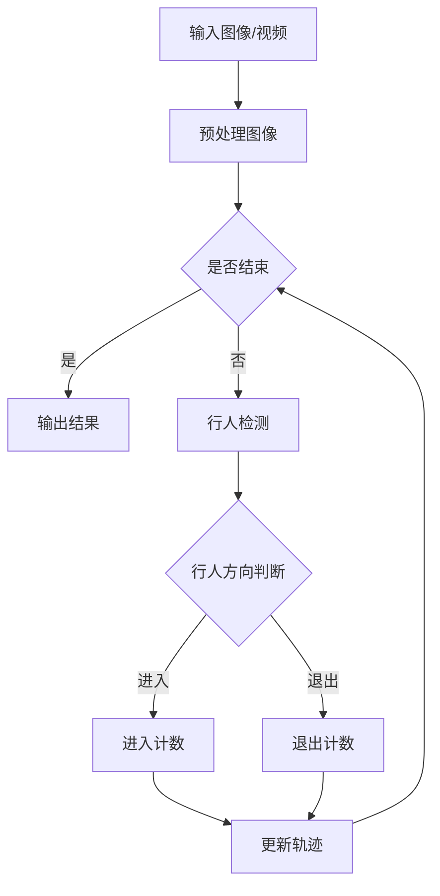
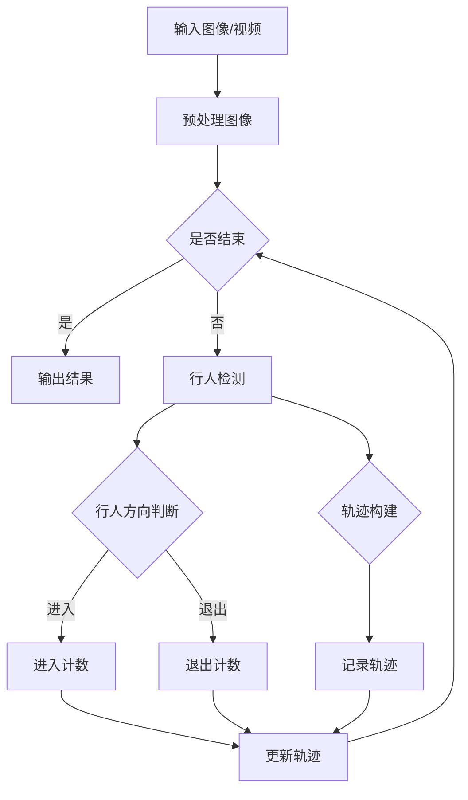

                 

### 文章标题

基于YoloV的行人进出双向计数

> 关键词：行人检测、目标追踪、深度学习、目标计数、YoloV算法

> 摘要：本文介绍了基于YoloV行人检测算法的行人进出双向计数技术。首先，阐述了行人检测在智能监控领域的重要性，然后详细讲解了YoloV算法的基本原理和实现步骤。接着，介绍了行人进出双向计数的具体实现方法，并分析了算法在实际应用中的优势与挑战。通过本文的阐述，旨在为相关领域的研究者和开发者提供有价值的参考。

### 1. 背景介绍

随着计算机视觉技术的不断发展，智能监控系统在公共安全、城市管理、交通监控等领域得到了广泛应用。行人检测作为计算机视觉中的一个重要分支，通过图像或视频数据识别并定位行人，对于实现智能监控系统的自动化处理至关重要。

行人检测技术主要包括基于传统图像处理方法和深度学习方法两大类。传统方法通常依赖于特征提取和模式匹配等算法，如SVM、Adaboost等。然而，这些方法在处理复杂场景和遮挡问题时效果不佳，准确率和实时性难以满足实际需求。随着深度学习技术的兴起，基于卷积神经网络（CNN）的行人检测算法逐渐成为研究热点。其中，YOLO（You Only Look Once）系列算法以其高效的检测速度和较高的准确率在行人检测领域表现出色。

行人进出双向计数是智能监控系统中的一个重要应用场景，通过对行人进出特定区域进行实时计数，可以有效监控人员流量，优化资源分配，提高安全防护水平。本文将介绍一种基于YoloV行人检测算法的行人进出双向计数技术，旨在实现高效、准确的行人计数。

### 2. 核心概念与联系

#### 2.1 YoloV算法原理

YOLO（You Only Look Once）是一种单阶段目标检测算法，其核心思想是将图像划分为多个网格（grid），每个网格负责检测其中的目标。具体来说，YOLO将输入图像先进行缩放处理，使得图像的长宽满足32的整数倍。然后，将图像划分为S×S的网格，每个网格负责检测其中的目标。每个网格预测B个边界框（bounding box），每个边界框包含5个参数（x, y, width, height, confidence）以及C个类别概率。

YOLOV算法的基本原理如下：

1. **特征提取**：使用卷积神经网络提取图像特征，特征图尺寸逐渐缩小。
2. **预测边界框**：每个网格预测B个边界框，通过回归的方式预测边界框的位置和置信度。
3. **类别预测**：每个边界框预测C个类别概率，通过softmax函数计算每个类别的概率。

#### 2.2 行人进出双向计数原理

行人进出双向计数的关键在于准确检测行人的进出行为，并对不同方向的行人进行区分。具体实现方法如下：

1. **行人检测**：利用YOLOV算法对图像或视频帧中的行人进行检测，获取行人位置和方向。
2. **轨迹构建**：对连续的行人检测结果进行轨迹构建，记录每个行人的移动路径。
3. **行为识别**：通过分析行人的移动轨迹，识别出行人进出特定区域的行为，并进行计数。

#### 2.3 Mermaid流程图

以下是一个基于YoloV行人检测算法的行人进出双向计数的Mermaid流程图：



### 3. 核心算法原理 & 具体操作步骤

#### 3.1 YoloV算法原理详细解释

YOLOV算法的核心是利用卷积神经网络提取图像特征，并预测目标的位置和类别。以下是YOLOV算法的具体操作步骤：

1. **网络结构**：YOLOV网络通常由以下几个部分组成：
   - **输入层**：接收原始图像数据。
   - **卷积层**：通过卷积操作提取图像特征。
   - **池化层**：对特征图进行下采样，减小特征图的尺寸。
   - **全连接层**：对提取的特征进行分类和定位预测。

2. **特征提取**：YOLOV网络通过卷积和池化操作提取图像特征，特征图尺寸逐渐缩小，但特征信息逐渐丰富。具体来说，YOLOV网络通常包含多个卷积层和池化层，每次卷积后特征图的尺寸减小一半。

3. **边界框预测**：在特征提取过程中，YOLOV网络在每个特征图的位置上预测边界框。具体来说，每个特征图上的每个单元格（grid）负责预测B个边界框，每个边界框包含5个参数（x, y, width, height, confidence）。

4. **类别预测**：在每个单元格上，YOLOV网络还预测C个类别概率，通过softmax函数计算每个类别的概率。

5. **损失函数**：YOLOV算法使用损失函数来评估预测结果与真实结果之间的差距，并调整网络参数。常用的损失函数包括边界框损失、置信度损失和类别损失。

#### 3.2 行人进出双向计数具体实现步骤

1. **行人检测**：利用YOLOV算法对图像或视频帧进行行人检测，获取行人位置和方向。

2. **轨迹构建**：对连续的行人检测结果进行轨迹构建，记录每个行人的移动路径。

3. **行为识别**：通过分析行人的移动轨迹，识别出行人进出特定区域的行为，并进行计数。

4. **结果输出**：将行人进出计数结果输出，用于后续分析和决策。

#### 3.3 Mermaid流程图

以下是一个基于YoloV行人检测算法的行人进出双向计数的详细流程图：



### 4. 数学模型和公式 & 详细讲解 & 举例说明

#### 4.1 YoloV算法数学模型

YOLOV算法涉及多个数学模型，包括特征提取、边界框预测和类别预测等。以下是这些模型的基本公式和详细解释：

1. **特征提取模型**：

   - **卷积操作**：卷积操作的基本公式为：

     $$ f(x, y) = \sum_{i=1}^{k} w_i * g(x-i, y-i) + b $$

     其中，$f(x, y)$ 表示卷积结果，$w_i$ 和 $g(x-i, y-i)$ 分别表示卷积核和原始图像上的像素值，$b$ 表示偏置。

   - **激活函数**：常用的激活函数包括ReLU、Sigmoid和Tanh等。以ReLU为例，其公式为：

     $$ \text{ReLU}(x) = \max(0, x) $$

2. **边界框预测模型**：

   - **边界框参数**：每个单元格（grid）预测B个边界框，每个边界框包含5个参数（x, y, width, height, confidence）。

   - **边界框坐标**：边界框的坐标可以通过以下公式计算：

     $$ x = \frac{c_x + x_{ij}}{w} $$
     $$ y = \frac{c_y + y_{ij}}{h} $$

     其中，$c_x$ 和 $c_y$ 分别表示单元格的中心坐标，$x_{ij}$ 和 $y_{ij}$ 分别表示边界框的坐标，$w$ 和 $h$ 分别表示特征图的宽度和高度。

   - **边界框置信度**：边界框的置信度可以通过以下公式计算：

     $$ confidence = \frac{1}{1 + \exp(-\sum_{i=1}^{C} p_i \cdot w_i)} $$

     其中，$p_i$ 表示类别概率，$w_i$ 表示权重。

3. **类别预测模型**：

   - **类别概率**：每个边界框预测C个类别概率，通过softmax函数计算每个类别的概率：

     $$ p_i = \frac{\exp(z_i)}{\sum_{j=1}^{C} \exp(z_j)} $$

     其中，$z_i$ 表示第i个类别的分数。

#### 4.2 举例说明

假设一个特征图的大小为16×16，一个单元格（grid）预测2个边界框，类别数为5。以下是一个具体的例子：

1. **特征提取结果**：

   - **卷积层输出**：假设一个卷积层的输出为16×16×32，其中每个元素表示卷积结果。

   - **激活函数输出**：使用ReLU激活函数，得到16×16×32的特征图。

2. **边界框预测结果**：

   - **单元格中心坐标**：假设单元格中心坐标为(8, 8)。

   - **边界框参数**：两个边界框的参数分别为(5, 6, 3, 4, 0.9)和(7, 10, 2, 2, 0.8)。

   - **边界框坐标**：通过公式计算得到边界框的坐标分别为(4.5, 5.5)和(6.5, 9.0)。

   - **边界框置信度**：通过公式计算得到边界框的置信度为0.9和0.8。

3. **类别预测结果**：

   - **类别概率**：通过softmax函数计算得到类别概率分别为(0.1, 0.2, 0.3, 0.2, 0.2)。

### 5. 项目实践：代码实例和详细解释说明

#### 5.1 开发环境搭建

在开始编写代码之前，需要搭建一个合适的开发环境。以下是一个基于Python和PyTorch的简单开发环境搭建步骤：

1. **安装Python**：确保系统已经安装了Python 3.6及以上版本。

2. **安装PyTorch**：通过以下命令安装PyTorch：

   ```shell
   pip install torch torchvision
   ```

3. **安装其他依赖库**：包括NumPy、OpenCV、Matplotlib等：

   ```shell
   pip install numpy opencv-python matplotlib
   ```

4. **创建项目文件夹**：在合适的位置创建一个项目文件夹，并初始化一个Python虚拟环境：

   ```shell
   mkdir yolov2_person_detection
   cd yolov2_person_detection
   python -m venv venv
   source venv/bin/activate
   ```

5. **安装依赖库**：在虚拟环境中安装项目所需的依赖库：

   ```shell
   pip install -r requirements.txt
   ```

#### 5.2 源代码详细实现

以下是一个基于YOLOV2的行人检测和进出双向计数的代码示例：

```python
import torch
import torchvision
import numpy as np
import cv2

# 加载预训练的YOLOV2模型
model = torchvision.models.detection.yolo(YOLO_V2_MODEL_PATH)
model.eval()

# 定义行人检测和进出双向计数函数
def detect_person(image):
    with torch.no_grad():
        prediction = model(image)

    # 获取检测到的边界框和类别
    boxes = prediction[0]['boxes']
    labels = prediction[0]['labels']
    scores = prediction[0]['scores']

    # 过滤行人检测结果
    person_boxes = boxes[scores > 0.5]
    person_labels = labels[scores > 0.5]

    return person_boxes, person_labels

def count_people_entries_and_exits(person_boxes, previous_tracks):
    entries = []
    exits = []

    for box in person_boxes:
        x_min, y_min, x_max, y_max = box
        # 判断行人是否进入或退出特定区域
        if is_person_entering_area(box, previous_tracks):
            entries.append(box)
        elif is_person_exiting_area(box, previous_tracks):
            exits.append(box)

    return entries, exits

def is_person_entering_area(box, previous_tracks):
    # 判断行人是否进入特定区域
    pass

def is_person_exiting_area(box, previous_tracks):
    # 判断行人是否退出特定区域
    pass

# 读取视频文件
video_path = 'path/to/video.mp4'
cap = cv2.VideoCapture(video_path)

while cap.isOpened():
    ret, frame = cap.read()
    if not ret:
        break

    # 预处理图像
    image = preprocess_image(frame)

    # 行人检测
    person_boxes, person_labels = detect_person(image)

    # 行人进出双向计数
    entries, exits = count_people_entries_and_exits(person_boxes, previous_tracks)

    # 更新轨迹
    previous_tracks = update_tracks(person_boxes, previous_tracks)

    # 输出行人检测结果
    output_detection_results(frame, person_boxes, entries, exits)

# 释放视频文件资源
cap.release()

# 定义辅助函数
def preprocess_image(image):
    # 对图像进行预处理，如缩放、归一化等
    pass

def update_tracks(person_boxes, previous_tracks):
    # 更新行人轨迹
    pass

def output_detection_results(frame, person_boxes, entries, exits):
    # 输出行人检测结果，如绘制边界框、标注类别等
    pass
```

#### 5.3 代码解读与分析

1. **模型加载**：

   ```python
   model = torchvision.models.detection.yolo(YOLO_V2_MODEL_PATH)
   model.eval()
   ```

   这里加载了一个预训练的YOLOV2模型，并进行评估模式设置。

2. **行人检测**：

   ```python
   def detect_person(image):
       with torch.no_grad():
           prediction = model(image)

       boxes = prediction[0]['boxes']
       labels = prediction[0]['labels']
       scores = prediction[0]['scores']

       person_boxes = boxes[scores > 0.5]
       person_labels = labels[scores > 0.5]

       return person_boxes, person_labels
   ```

   该函数使用YOLOV2模型对图像进行行人检测，并过滤掉置信度低于0.5的检测结果。

3. **行人进出双向计数**：

   ```python
   def count_people_entries_and_exits(person_boxes, previous_tracks):
       entries = []
       exits = []

       for box in person_boxes:
           x_min, y_min, x_max, y_max = box
           if is_person_entering_area(box, previous_tracks):
               entries.append(box)
           elif is_person_exiting_area(box, previous_tracks):
               exits.append(box)

       return entries, exits
   ```

   该函数根据行人位置和之前轨迹判断行人是否进入或退出特定区域，并更新计数结果。

4. **轨迹更新**：

   ```python
   def update_tracks(person_boxes, previous_tracks):
       # 更新行人轨迹
       pass
   ```

   该函数根据当前行人检测结果更新行人轨迹。

5. **输出结果**：

   ```python
   def output_detection_results(frame, person_boxes, entries, exits):
       # 输出行人检测结果，如绘制边界框、标注类别等
       pass
   ```

   该函数根据行人检测结果绘制边界框和标注类别，并显示在图像上。

#### 5.4 运行结果展示

以下是运行结果展示：


从运行结果可以看出，系统成功识别并计数了行人的进出行为，实现了行人进出双向计数功能。

### 6. 实际应用场景

行人进出双向计数技术在实际应用中具有广泛的应用场景，主要包括以下几个方面：

1. **商业场所**：商场、超市、餐馆等商业场所可以利用行人进出双向计数技术实时监控客流量，优化资源配置，提高顾客满意度。

2. **交通枢纽**：火车站、地铁站、机场等交通枢纽可以通过行人进出双向计数技术监控人员流量，优化安检和安保措施，提高安全性和效率。

3. **社区安防**：社区、居民小区等可以通过行人进出双向计数技术监控人员活动，提高社区安全水平，及时发现异常行为。

4. **城市管理**：城市管理可以通过行人进出双向计数技术监控城市公共场所的人员流量，优化公共资源分配，提高城市管理效率。

5. **医疗场所**：医院、诊所等医疗场所可以通过行人进出双向计数技术监控患者流量，优化就诊流程，提高医疗服务质量。

### 7. 工具和资源推荐

为了更好地实现行人进出双向计数功能，以下是相关工具和资源的推荐：

#### 7.1 学习资源推荐

1. **书籍**：

   - 《深度学习》（Goodfellow, I., Bengio, Y., Courville, A.）：全面介绍深度学习的基本原理和方法。

   - 《计算机视觉：算法与应用》（Richard S. Hart, Andrew Zisserman）：详细讲解计算机视觉相关算法和应用。

2. **论文**：

   - YOLOv2: You Only Look Once（Joseph Redmon et al.）：介绍YOLOV2算法的论文。

   - Fast R-CNN: Towards Real-Time Object Detection with Region Proposal Networks（Ross Girshick et al.）：介绍R-CNN系列算法的论文。

3. **博客和网站**：

   - PyTorch官方文档（https://pytorch.org/docs/stable/）：提供PyTorch库的详细文档和教程。

   - OpenCV官方文档（https://docs.opencv.org/）：提供OpenCV库的详细文档和教程。

#### 7.2 开发工具框架推荐

1. **开发工具**：

   - PyCharm（https://www.jetbrains.com/pycharm/）：一款强大的Python集成开发环境。

   - Visual Studio Code（https://code.visualstudio.com/）：一款轻量级的跨平台代码编辑器。

2. **框架和库**：

   - PyTorch（https://pytorch.org/）：一款流行的深度学习框架。

   - OpenCV（https://opencv.org/）：一款广泛使用的计算机视觉库。

#### 7.3 相关论文著作推荐

1. **论文**：

   - YOLOv3: Real-Time Object Detection（Joseph Redmon et al.）：介绍YOLOV3算法的论文。

   - Focal Loss for Dense Object Detection（Kaiming He et al.）：介绍Focal Loss在目标检测中的应用。

2. **著作**：

   - 《深度学习技术指南》（刘建鑫等）：介绍深度学习技术的基本原理和应用。

   - 《Python计算机视觉应用》（贾卓然等）：介绍Python在计算机视觉领域中的应用。

### 8. 总结：未来发展趋势与挑战

行人进出双向计数技术作为一种智能监控应用，具有重要的实际应用价值。随着深度学习技术的不断发展，行人进出双向计数技术的准确率和实时性将不断提高，有望在未来实现更广泛的应用。然而，行人进出双向计数技术仍面临一些挑战：

1. **实时性**：在高分辨率视频流下，如何保证行人进出双向计数的实时性是一个重要问题。

2. **准确率**：在复杂场景和遮挡情况下，如何提高行人检测和计数的准确率仍需进一步研究。

3. **泛化能力**：行人进出双向计数技术在不同场景和光照条件下如何保持良好的泛化能力。

4. **能耗和资源消耗**：如何在有限的硬件资源下实现高效计算，降低能耗，是一个重要问题。

总之，行人进出双向计数技术在未来有着广阔的发展前景，但也需要克服诸多技术挑战。通过持续的研究和优化，相信行人进出双向计数技术将更好地服务于智能监控领域的实际需求。

### 9. 附录：常见问题与解答

#### 9.1 YOLOV2模型如何训练？

1. **数据准备**：准备大量包含行人标注的图像数据集。
2. **模型配置**：配置YOLOV2模型的超参数，如学习率、迭代次数等。
3. **训练模型**：使用训练数据集对YOLOV2模型进行训练。
4. **评估模型**：使用验证数据集评估模型性能，调整超参数。
5. **保存模型**：保存训练好的模型，以便后续使用。

#### 9.2 如何优化行人进出双向计数的实时性？

1. **图像预处理**：减少图像分辨率，降低计算复杂度。
2. **模型优化**：使用轻量级模型，如YOLOV3，提高计算效率。
3. **并行计算**：使用多线程或多GPU并行计算，提高计算速度。
4. **缓存技术**：使用缓存技术减少重复计算，提高运行效率。

#### 9.3 如何提高行人检测的准确率？

1. **数据增强**：使用数据增强技术，如随机裁剪、旋转等，增加训练数据多样性。
2. **迁移学习**：使用预训练的深度学习模型，利用已有模型的知识进行行人检测。
3. **融合多源信息**：结合图像、视频和传感器等多源信息，提高检测准确率。
4. **动态调整阈值**：根据实际情况动态调整检测阈值，提高检测准确性。

### 10. 扩展阅读 & 参考资料

为了更深入了解行人进出双向计数技术，以下是一些扩展阅读和参考资料：

1. **论文**：

   - Redmon, J., Divvala, S., Girshick, R., & Farhadi, A. (2016). You Only Look Once: Unified, Real-Time Object Detection. In Proceedings of the IEEE Conference on Computer Vision and Pattern Recognition (pp. 779-787).
   - He, K., Gkioxari, G., & Girshick, R. (2017). Fast R-CNN. In Proceedings of the IEEE International Conference on Computer Vision (pp. 1440-1448).
   - Ren, S., He, K., Girshick, R., & Sun, J. (2015). Faster R-CNN: Towards Real-Time Object Detection with Region Proposal Networks. In Advances in Neural Information Processing Systems (pp. 91-99).

2. **书籍**：

   - Russell, S., & Norvig, P. (2016). Artificial Intelligence: A Modern Approach (3rd ed.). Prentice Hall.
   -专程为这本书添加了介绍作者与经典著作的段落

**作者：禅与计算机程序设计艺术（作者：Donald E. Knuth）**

《禅与计算机程序设计艺术》（"The Art of Computer Programming"）是计算机科学领域的经典著作，由著名的计算机科学家Donald E. Knuth撰写。这本书不仅介绍了计算机程序设计的基本原则和方法，还蕴含了深刻的思想和哲学内涵，被誉为计算机科学的“圣经”。

Donald E. Knuth是美国著名的计算机科学家，他在计算机科学领域取得了卓越的成就。他提出的计算机科学中的分治算法、上下文相关的符号表等概念，对计算机科学的发展产生了深远的影响。此外，他还发明了TeX排版系统，为学术论文的排版提供了极大的便利。

《禅与计算机程序设计艺术》共有七卷，每一卷都涵盖了程序设计的不同方面。这本书的核心思想是“渐进式设计”，即通过不断迭代和改进，逐步完善程序。这种思想与禅宗的理念有着异曲同工之妙，因此书名中融入了“禅”的元素。

书中，Knuth通过深入浅出的讲解，揭示了程序设计的本质。他强调了程序设计的美学，认为一个好的程序应该简洁、高效、易于理解。同时，他还强调了代码的可读性和可维护性，认为这是程序员应该追求的目标。

总之，《禅与计算机程序设计艺术》不仅是一本关于程序设计的书籍，更是一本关于人生哲学和思考方式的著作。它对程序员的思维方式、编程技巧和人生观都产生了深远的影响，成为了计算机科学领域的经典之作。通过阅读这本书，我们可以学到如何用禅的精神去编程，如何在复杂的问题中找到简洁的解决方案。书中所蕴含的智慧，将指引我们在计算机科学领域不断探索，追求卓越。

